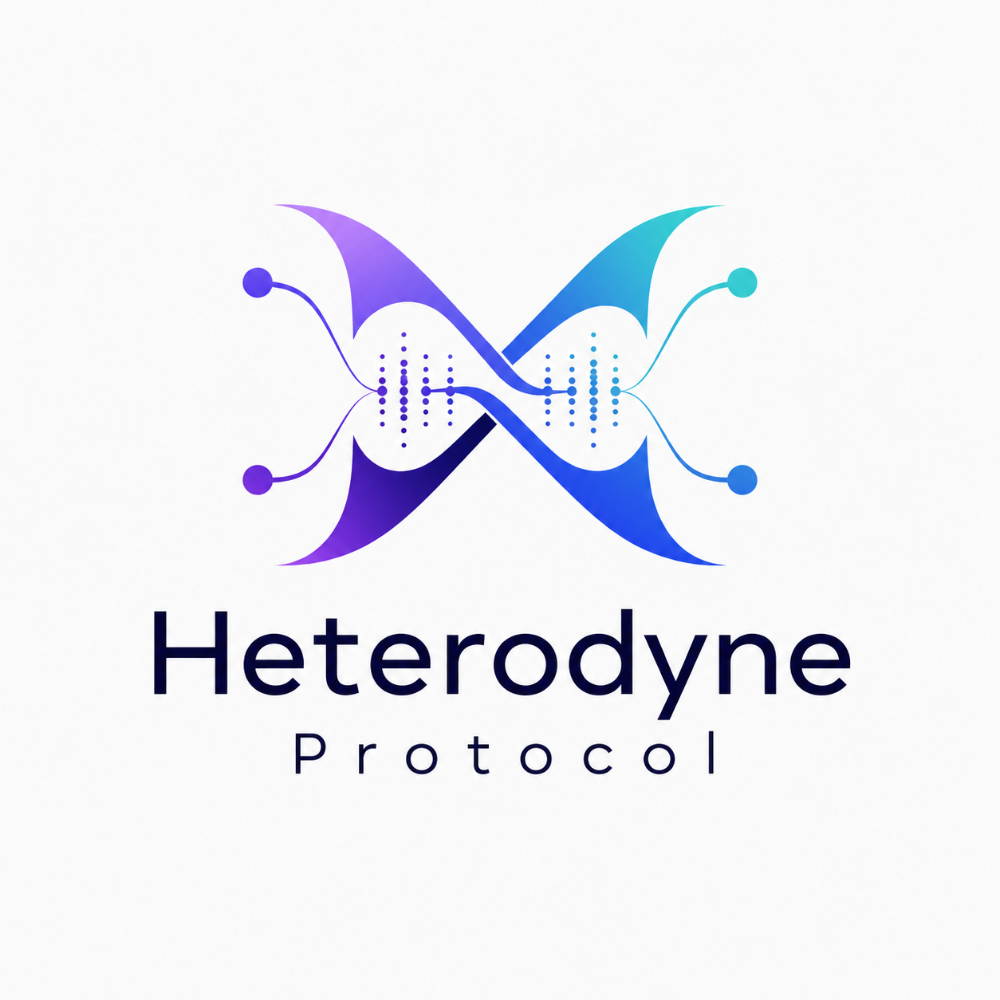

<p align="center">
  
</p>

<p align="center">
  <strong>Social media that nobody owns — censorship-resistant, portable, with encrypted private messaging.</strong>
</p>

<p align="center">
  Nostr identity · Matrix transport · one open network for any conformant client
</p>

---

> **Status:** Specification stage. The protocol is **fully specified** at
> [`docs/spec/heterodyne.md`](docs/spec/heterodyne.md) (**v0.3.0 DRAFT**). It is
> in its **0.x phase — in flux until 1.0**: wire formats and requirements may
> still change between releases. A first-party reference client is the next
> milestone. **Contributions are welcome.**

## What Heterodyne means to you

Heterodyne is a decentralized social network protocol built around a simple
promise: **your identity is yours, and no platform owns or gatekeeps it.**

- **You own your identity, not a platform.** Your identity is a cryptographic
  keypair you hold — not a username inside someone else's database. No company
  can sell it, rename it, or lock you out of it. Your posts are portable across
  open relays and can be backed by archives you control, so no single provider
  is the gatekeeper of your presence.
- **Not tied to one provider or account.** Your public identity is decoupled
  from the server you happen to publish through. You can be *multi-homed* across
  several servers at once and still present **one cohesive identity** to your
  followers. If a server turns hostile, you point your followers elsewhere and
  carry your identity — and your audience — with you.
- **Highly censorship-resistant and hard to shut down.** There is no central
  server to seize and no single chokepoint. Content rides over open Nostr relays
  and federated Matrix homeservers; anyone can run either. Individual relays or
  servers can still refuse or drop traffic — but because none of them is
  essential, clients publish to and read from many, and the network keeps
  working when some go away.
- **You stay findable.** Decentralization usually makes people hard to discover.
  Heterodyne keeps a cryptographically-signed, authoritative pointer from your
  public identity to where you publish, so followers can verify your current
  location whenever that signed pointer is reachable — even after you've moved
  servers.
- **Messages are attributable to you.** Broadcast posts are signed by your key,
  so followers can verify a post genuinely came from your identity and was not
  forged. Group and direct messages default to "bare" Matrix messages —
  attributable to their author's identity through a verified delegation, with an
  opt-in per-message signature for transferable proof. A signature proves an
  *authorized key* signed the message, which is exactly why keys can be rotated
  and revoked if one is ever compromised.
- **Private conversation stays private.** Group and direct messages are
  end-to-end encrypted with Matrix's ratchet cryptography (Megolm today, MLS
  ahead). The server that carries your messages **cannot read them** — it routes
  ciphertext it can never open, making mass surveillance by a provider, or
  coercion of one, ineffective against the content itself.
- **Light on resources.** No proof-of-work mining, no blockchain, no heavy
  consensus. Encryption is done **once per room** and Matrix distributes the keys
  to authorized members — instead of re-encrypting a message separately for every
  recipient. The protocol is designed to run on modest hardware.
- **Anyone can build a client.** The specification is open and
  implementation-agnostic. Build your own client in any language or runtime; as
  long as it follows the spec, it is designed to interoperate with every other
  conformant Heterodyne client — that shared conformance is what makes one
  network out of many independent clients.

## How it works

Heterodyne pairs **Nostr identity** with **Matrix transport**, using each system
for what it does best:

- **Nostr provides identity and authenticity.** A user's `secp256k1` keypair is
  portable, censorship-resistant, and not bound to any homeserver or relay. It is
  the durable, self-owned identity that followers trust.
- **Matrix provides transport, encryption, and governance.** Megolm/MLS group
  end-to-end encryption, native room state for membership and moderation power
  levels, and federation for resilience.

The key insight: the user's identity (their Nostr keypair) is **decoupled** from
the Matrix account used to publish any given event. **Broadcast** content (you
publishing as yourself) lives on open Nostr relays, signed by your key — and
room-key-wrapped when the audience is a private follower set. **Discussion**
(group chat, DMs) flows through Matrix rooms, which also carry the encryption
keys, membership, and moderation state. Group privacy is outsourced to Matrix's
cryptographic ratchet: a client encrypts a message **once for the room** and
Matrix distributes the keys to authorized members.

For private rooms the homeserver acts as a **blind relay** — it routes and
stores ciphertext it cannot decrypt, so a provider cannot read your message
*contents* and cannot be coerced into handing them over. (It still observes
transport-level metadata such as who is in a room and when messages are sent;
Heterodyne encrypts message contents and room state, not the existence of the
traffic itself.)

Encrypting once per room also sidesteps the *N-encryptions-for-N-recipients*
scaling problem of classic encrypted broadcasts: a shared room session means
encrypt-once, deliver-to-many.

Identity is anchored by a **KERI cold-root key** (your public identity), with a
rotating **epoch key** that signs day-to-day attestations — so the root key
stays cold and a compromised signing key can be rotated out without losing your
identity.

```
                  your device (holds your keys)
          broadcasts │                        │ group chat / DMs
       signed by your│                        │ encrypted once per room
       key           ▼                        ▼
              open Nostr relays        Matrix homeserver
              (public fan-out)         (blind relay: routes
                                        ciphertext it can't read,
                                        federates to other servers)
```

## Room taxonomy

Heterodyne organizes spaces on a **broadcast vs. discussion × public vs.
private** axis, plus two infrastructure room kinds:

| Room kind | Purpose | Encryption | Authorship |
|---|---|---|---|
| `public_broadcast` | Open, Twitter-style public feed. | None | Nostr-signed, plaintext on relays |
| `private_broadcast` | Persona broadcasts to a closed follower set. | Megolm/MLS | Nostr-signed, room-key-wrapped on relays |
| `public_discussion` | Communities, topic rooms, forums, group chat. | None | Bare Matrix; optional per-message signature badge |
| `private_discussion` | Friend circles, planning, DMs. | Megolm/MLS | Bare Matrix; optional per-message signature badge |

Plus `identity_room` and `config_room` infrastructure kinds. **No kind claims
deniability** — every in-room message is attributable to its author's identity
via the protocol's delegation, though bare messages carry no *transferable*
third-party proof.

## Project status & roadmap

The specification is **fully drafted with diagrams**. All load-bearing protocol
decisions — identity, envelope, rooms, publishing, discovery, moderation,
encryption, bridging, interop, versioning, security, and conformance — are
written down. See [`CHANGELOG.md`](CHANGELOG.md) for per-version history and
[`docs/adr/`](docs/adr/) for the decision records behind each revision.

The current release is **v0.3.0**. Per the semver 0.x rule (spec §12.1),
everything is subject to change until **1.0.0**.

**Next milestones:**

1. Expand and complete the conformance test vectors in
   [`docs/spec/vectors/`](docs/spec/vectors/) (coverage is underway) and validate
   them against the first reference client.
2. Build a first-party reference client to validate the protocol end-to-end
   (language and runtime to be chosen separately — the spec is agnostic).
3. Iterate the spec based on implementation feedback toward 1.0.

## Build your own client

Heterodyne is **specification-first and implementation-agnostic** — no language
or runtime is prescribed. Interoperability is the goal that conformance serves:
any client that follows [`docs/spec/heterodyne.md`](docs/spec/heterodyne.md) and
passes the conformance vectors should interoperate with every other Heterodyne
client. The protocol is a **pure client-side bridge**: vanilla Matrix
homeservers and Nostr relays carry Heterodyne traffic without any
protocol-specific modifications.

To start implementing, read the spec, then check the conformance vector format
in [`docs/spec/vectors/`](docs/spec/vectors/) to validate your wire output
byte-for-byte.

## Navigate this repository

| Path | What it is |
|---|---|
| [`docs/spec/heterodyne.md`](docs/spec/heterodyne.md) | The normative specification (single living document, 0.x). |
| [`docs/architecture.md`](docs/architecture.md) | Non-normative architecture overview and design rationale. |
| [`docs/glossary.md`](docs/glossary.md) | Term definitions referenced from the spec. |
| [`docs/security/threat-model.md`](docs/security/threat-model.md) | Companion analysis to the spec's security model. |
| [`docs/spec/vectors/`](docs/spec/vectors/) | Conformance test vectors (format defined; vectors authored incrementally). |
| [`docs/adr/`](docs/adr/) | Architecture Decision Records behind each revision. |
| [`research/INDEX.md`](research/INDEX.md) | Topic-keyed index into the background research. |
| [`CLAUDE.md`](CLAUDE.md) | Project mission and full repository map. |

When you need to look something up, **start at
[`research/INDEX.md`](research/INDEX.md)** — it maps topics (outbox routing,
NIP-72 communities, MLS group cryptography, …) to exact source locations.

## Contributing

Heterodyne is in active 0.x design. The most valuable contributions right now
are:

- **Spec review** — adversarial reading of [`docs/spec/heterodyne.md`](docs/spec/heterodyne.md)
  and the [threat model](docs/security/threat-model.md).
- **Test vectors** — authoring conformance vectors in [`docs/spec/vectors/`](docs/spec/vectors/).
- **Client prototypes** — implementations that exercise the spec and feed back
  into it.

Architectural decisions are recorded as ADRs in [`docs/adr/`](docs/adr/); open a
discussion or proposal before large changes so the rationale is captured.

## License

License to be determined. Until a `LICENSE` file is added to this repository,
all rights are reserved by the authors.
