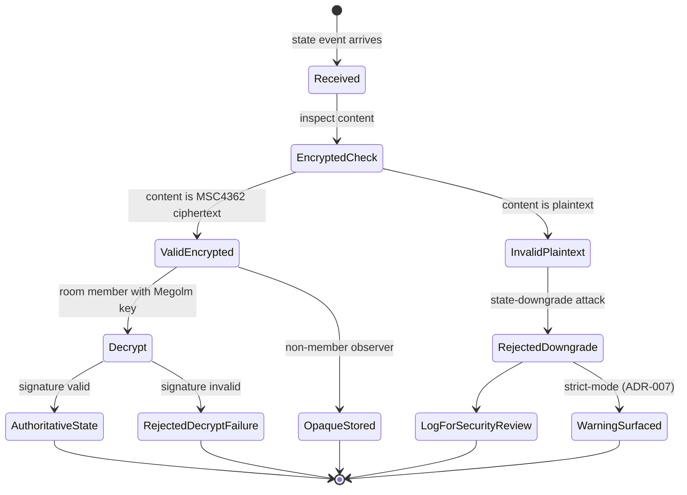

# ADR-001: Client-side implementation of unstable Matrix features (MSC4362, peek) and invariant I1 rewrite

**Date:** 2026-05-21
**Status:** Accepted
**Decision makers:** Liam Helmer (architect); star-chamber providers: gemini-3.1-pro, gpt-5.4 (via Fuel-IX); local Claude subagent

## Context

The Heterodyne v0.2.0 spec mandates MSC4362 (encrypted state events) in five MUST locations (§3.8 line 727, §5.4 lines 1345–1347, §9.1 lines 2526–2528, §7.5 lines 2078–2079, §13.2 lines 3474–3475) and references a non-existent stable Matrix client-server endpoint `GET /_matrix/client/v3/peek/{roomId}` in §3.6 lines 630–633. Both depend on unmerged Matrix MSCs.

An inherited project invariant (from `mxdx`, documented in `CLAUDE.md`) requires that vanilla Matrix homeservers handle Heterodyne traffic without protocol-specific modifications. The current spec's MUST language for MSC4362 and the broken peek endpoint reference both violate this invariant.

External critique flagged both as "major" interoperability blockers.

## Decision

Heterodyne clients implement MSC4362-compatible encrypted state events and equivalent peek behavior **entirely client-side**. Vanilla Matrix homeservers store the encrypted-state payload as opaque JSON content and require no server-side MSC4362 support. The peek endpoint reference is replaced with stable client-server API mechanisms.

Concomitantly, invariant I1 in §13.2 is rewritten to reflect this client-side encryption model: the homeserver does not guarantee state-event confidentiality through MSC4362 server enforcement; that property is guaranteed by Heterodyne client behavior plus the fact that Heterodyne private rooms are Heterodyne-only (see ADR-002).

To prevent state-downgrade attacks (a malicious or buggy client publishing unencrypted state events in a private room), this ADR specifies normative validity semantics: receivers MUST treat unexpected unencrypted state events in `private_*` and `dm_*` rooms as invalid and MUST NOT use them for any authoritative state resolution. UX rejection/warning behavior for strict-mode clients is in ADR-007.

## Requirements (RFC 2119)

1. Heterodyne clients MUST encrypt the `content` field of every state event posted to `private_verifiable`, `private_deniable`, `dm_verifiable`, `dm_deniable`, or `config_room` rooms using MSC4362-compatible encrypted-state ciphertext.
2. Heterodyne clients MUST post such state events using standard Matrix `PUT /_matrix/client/v3/rooms/{roomId}/state/{eventType}/{stateKey}` endpoints, with the encrypted payload as the `content`.
3. Heterodyne clients MUST NOT require that the homeserver advertise MSC4362 support, and MUST NOT reject homeservers solely because they lack such advertisement.
4. Heterodyne clients MUST replace any reliance on `GET /_matrix/client/v3/peek/{roomId}` with one of:
   - `GET /_matrix/client/v3/rooms/{roomId}/state/{eventType}/{stateKey}` (or the bulk state endpoint) when room history visibility permits unauthenticated read; or
   - Joining the room when read access requires membership; or
   - Experimental MSC2753 peek endpoints when the homeserver advertises support.
5. Heterodyne clients MUST treat any unencrypted state event of a Heterodyne-defined `m.heterodyne.*` type received in a `private_*` or `dm_*` room as INVALID; such events MUST NOT contribute to authoritative state resolution and MUST NOT be presented to the user without an explicit "potentially forged" warning.
6. Heterodyne clients SHOULD log invalid unencrypted state events for diagnostic and security-monitoring purposes.
7. Invariant I1 in §13.2 MUST be rewritten as: "Heterodyne clients ensure no homeserver sees plaintext for any event in a `private_*`, `dm_*`, or `config_room` room, including state events. This guarantee is client-side; the homeserver stores all such state events as opaque ciphertext. Receivers MUST reject unencrypted state events in these room kinds per ADR-001 requirement 5."

## Rationale

The user articulated this principle during the grill: "compatibility with existing matrix servers unaltered is paramount; however, we can use experimental client features for our clients at will." Client-side implementation honors both halves — Heterodyne ships the privacy properties MSC4362 promises without making any unmerged MSC a server-side prerequisite. The mxdx-inherited invariant is preserved.

The state-downgrade clause is essential because moving from server-enforced to client-enforced encryption shifts the trust boundary: in the original MSC4362 model, the server enforces encryption; in the Heterodyne model, every receiving client must verify it. Without explicit validity semantics, a malicious or buggy client could publish unencrypted state events that other clients silently accept.

## Alternatives Considered

### (A) Keep MUST, document upstream stability risk
- **Pros:** Smallest doc change; preserves the strictest reading of I1.
- **Cons:** Blocks vanilla-homeserver compatibility (violates the mxdx-inherited invariant); stalls test-vector and first-party-client milestones; bakes in a non-existent endpoint.
- **Why rejected:** Violates the explicit mxdx compatibility invariant.

### (B) Baseline + heterodyne-strict capability profiles
- **Pros:** Clean conformance story; preserves I1 in strict mode.
- **Cons:** Doubles conformance surface; weakens the security argument in baseline; complicates threat-model exposition.
- **Why rejected:** The user's framing — "the server doesn't have to enforce it for Heterodyne clients as they will always do it anyways" — eliminates the need for a baseline/strict split. The strict behavior IS the baseline.

### (C) Stable fallback as primary, MSC as opt-in upgrade
- **Pros:** Works on vanilla today; clean degradation.
- **Cons:** Implies that the baseline lacks encrypted state (state-metadata leakage to homeserver in default path) and weakens invariant I1.
- **Why rejected:** Same as (B); the user's principle is that Heterodyne clients always implement the strict behavior — there's no "degraded baseline" to define.

### (D) Wait for MSC4362 / MSC2753 to merge upstream
- **Pros:** Cleanest conformance once upstream lands.
- **Cons:** Unbounded wait; blocks all milestones.
- **Why rejected:** Indefinite project stall.

## Assumed Versions (SHOULD)

- MSC4362 (encrypted state events): draft as of 2026-05-21. Heterodyne tracks the draft semantics but does not require server support.
- MSC2753 (peek): draft as of 2026-05-21. Used opportunistically when available.
- Matrix Client-Server API: stable endpoints `GET /_matrix/client/v3/rooms/{roomId}/state/...` and `POST /_matrix/client/v3/rooms/{roomId}/join` are guaranteed to be available; specific room version requirements are in ADR-002.

## Diagram

State machine for received `m.heterodyne.*` state events in a `private_*` or `dm_*` room.

Mermaid source

## Consequences

- §3.6 lines 630–633: peek endpoint reference is replaced.
- §3.8 line 727, §5.4 lines 1345–1347, §9.1 lines 2526–2528, §7.5 lines 2078–2079: MSC4362 MUST language is preserved but clarified as "client-side implementation; server stores as opaque content."
- §13.2 invariant I1: full rewrite per requirement 7.
- New normative subsection (likely §9.1.1 or §13.2.1): state-downgrade validity rules per requirements 5–6.
- ADR-007 (strict-mode client profile) adds UX-layer rejection/warning behavior that builds on the baseline validity rules from this ADR.
- Threat model in §13 now distinguishes "server-enforced" from "client-enforced" confidentiality — this distinction must be exposed to users in client UX (warning when a peer client appears to be non-Heterodyne).
- First-party-client implementation can target vanilla Synapse/Dendrite/Conduit homeservers without patches.

## Council Input

Both star-chamber providers (round 1 of architecture review) flagged that the original synthesis combined this technical implementation decision with a separable product/conformance question about non-Heterodyne client interoperability. Round 2 converged on splitting them: this ADR (001) owns the technical implementation model and baseline state-downgrade resistance; ADR-002 owns the private-room interoperability profile and Matrix room-version pinning. Both rounds also flagged that invariant I1 must be rewritten in the same ADR as the client-side reframe (here) rather than bundled into the security-claims hygiene ADR — the rewrite is downstream of the architecture change, not a wording fix.
