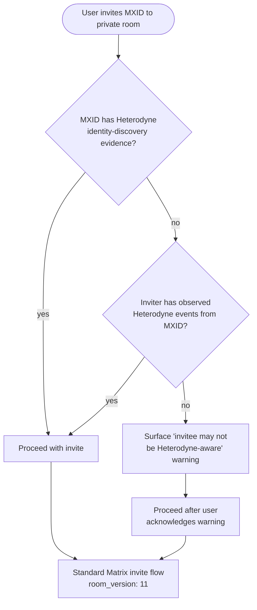

# ADR-002: Private-room interoperability profile and Matrix room-version pinning

**Date:** 2026-05-21
**Status:** Accepted
**Decision makers:** Liam Helmer (architect); star-chamber providers: gemini-3.1-pro, gpt-5.4 (via Fuel-IX); local Claude subagent

## Context

ADR-001 establishes that Heterodyne clients implement encrypted state events client-side and that the homeserver stores them as opaque content. This raises a follow-on product question that the original synthesis bundled into the same ADR but is logically separate: **what is the interoperability contract with non-Heterodyne Matrix clients in Heterodyne rooms?**

Additionally, the spec at §5.2 line 1266 and §5.4 line 1342 uses the phrase "latest stable Matrix room version" for the `m.room.create.room_version` field. External critique flagged this as a normative imprecision: Matrix room versions change semantics (v12 changed creator power semantics; future versions may further restructure power levels and authorization), so "latest stable" is not a stable conformance target. Room-version selection is itself a conformance decision that affects authorization, power levels, identity-room recovery, and moderator authority — placing it in the editorial cleanup pass would smuggle a normative decision into a cleanup commit.

This ADR consolidates both concerns: Heterodyne-only private rooms + an explicit Matrix room version pin.

## Decision

1. Heterodyne `private_verifiable`, `private_deniable`, `dm_verifiable`, `dm_deniable`, and `config_room` rooms are **intended for Heterodyne-aware client populations only**. A non-Heterodyne Matrix client joining such a room is functionally degraded (cannot read encrypted state events; may misinterpret room kind labels) but does not break the room — they can read the Megolm-encrypted timeline normally if they have the Megolm keys.
2. Heterodyne clients MUST pin the Matrix room version at room creation. The pinned version is **v11** as of this ADR. The pin is updated only via a new ADR.
3. Heterodyne clients SHOULD warn the user before inviting an MXID whose homeserver has not been observed to carry Heterodyne-published events (heuristic; not a hard verification).

## Requirements (RFC 2119)

1. Heterodyne clients creating any `private_verifiable`, `private_deniable`, `dm_verifiable`, `dm_deniable`, or `config_room` room MUST set `m.room.create.room_version` to `"11"`.
2. Heterodyne clients MAY create `public_broadcast` and `public_moderated` rooms with any Matrix room version supported by the homeserver, but SHOULD prefer `"11"` for consistency.
3. The spec MUST replace the phrases "latest stable Matrix room version" (§5.2 line 1266) and "latest stable" (§5.4 line 1342) with the explicit version pin `"11"`.
4. A Heterodyne client MUST NOT refuse to join an existing Heterodyne room solely because its `room_version` differs from `"11"`, provided it is `"11"` or higher.
5. Heterodyne clients SHOULD surface a UX warning before inviting an MXID into a `private_*`, `dm_*`, or `config_room` room when the inviter has no evidence (from Heterodyne identity-discovery state) that the invitee uses a Heterodyne-aware client.
6. The spec MUST add a normative note to §5.4 and §5.5 stating that Heterodyne private rooms are intended for Heterodyne-aware client populations.
7. Bumping the pinned room version MUST be done by issuing a new ADR that supersedes requirement 1 of this ADR, citing the specific authorization/power-level changes in the new room version that motivated the bump.

## Rationale

Pinning to v11 (the current latest stable as of 2026-05-21) gives implementers a deterministic conformance target. Room version 11 is widely supported by all maintained Matrix homeservers (Synapse, Dendrite, Conduit) and clients (Element, FluffyChat, etc.). The MUST language combined with the explicit-ADR-required bump mechanism prevents accidental version drift over time.

Declaring private rooms Heterodyne-only is the honest interoperability contract: a non-Heterodyne client cannot interpret Heterodyne-specific encrypted state, room-kind labels, or kind enum semantics. Rather than design a fictitious mixed-population mode, the spec acknowledges the intended deployment and provides UX guidance for the boundary case.

## Alternatives Considered

### (A) Bundle this into ADR-001 (client-side MSC implementation)
- **Pros:** Fewer ADRs; captures the operational coupling.
- **Cons:** Mixes a technical implementation decision (how encrypted state works on vanilla servers) with a product/conformance decision (who can use Heterodyne rooms). Both can evolve independently — e.g., a future version might add a partial-interoperability mode without changing the encryption model.
- **Why rejected:** Star-chamber round 1 and round 2 both flagged the original ADR-001 as overloaded; splitting improves traceability and review.

### (B) Support mixed populations with normative "degraded mode" for non-Heterodyne clients
- **Pros:** Better Matrix-ecosystem interop.
- **Cons:** Significantly more spec surface; requires defining "degraded mode" behavior for every Heterodyne feature; non-Heterodyne client maintainers have no incentive to implement.
- **Why rejected:** Spec surface cost without realistic adoption path.

### (C) Spec silent on non-Heterodyne clients (implementation choice)
- **Pros:** Smallest spec change.
- **Cons:** Undefined behavior in a real deployment scenario; inconsistent client UX; user confusion when invites silently fail to interoperate.
- **Why rejected:** Real deployment scenarios deserve normative guidance.

### (D) Reject non-Heterodyne clients via state-event capability check
- **Pros:** Hard interoperability boundary.
- **Cons:** Requires bot infrastructure or a non-trivial pre-invite handshake; conflicts with the mxdx "vanilla server" invariant; over-engineered for the actual threat.
- **Why rejected:** Too heavyweight for a UX warning's job.

### Room-version pin alternatives
- Stay editorial ("just fix the phrase"): rejected because pinning IS a normative decision; should be visible in ADR.
- Own ADR for room version: rejected because the rationale is tied to private-room interop expectations (capability of clients to handle the chosen version's authorization model).
- Pin a lower version (v10 or earlier): rejected because v11 has been stable and widely deployed long enough to be safely required.

## Assumed Versions (SHOULD)

- Matrix Client-Server API: stable.
- Matrix room version: **11** (pinned by this ADR).
- Synapse: 1.99+ (supports v11).
- Dendrite: 0.13+ (supports v11).
- Conduit: 0.7+ (supports v11).

## Diagram

Pre-invite warning decision flow for `private_*` and `dm_*` rooms.

Mermaid source

## Consequences

- §5.2 line 1266 and §5.4 line 1342: `room_version` value changes from `"latest stable Matrix room version"` to `"11"`.
- §5.4 and §5.5: gain a normative note declaring Heterodyne-only intent for private rooms.
- New client UX requirement: warning before inviting an MXID without Heterodyne-discovery evidence.
- Future room-version bumps require an explicit ADR, preventing implicit drift.
- Test vector required: room creation with `room_version: "11"`; rejection of `room_version: "10"` or earlier in private rooms.

## Council Input

Both star-chamber providers (round 2) recommended that room-version pinning be moved OUT of the editorial cleanup pass and into a normative ADR. They specifically suggested absorbing it into the private-room interoperability ADR (where this lives) because the version choice is motivated by the same capability expectations: Heterodyne clients need predictable Matrix authorization semantics across all deployments. The "own ADR" alternative was rated as adding ceremony without independent value.
