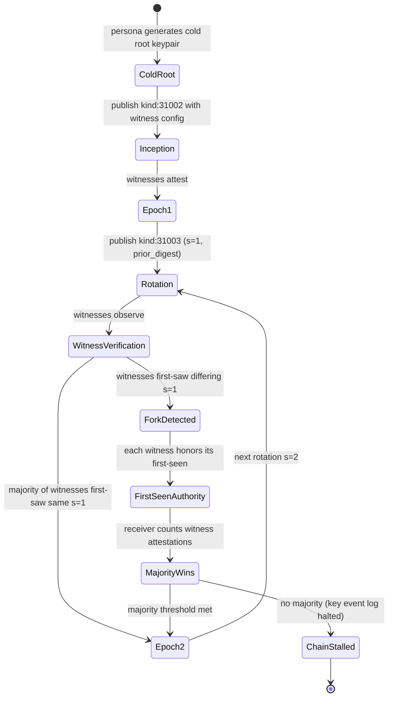

# ADR-003: Inline Heterodyne KERI profile, §8.3 mechanical port, and witness rule correction

**Date:** 2026-05-21
**Status:** Accepted
**Decision makers:** Liam Helmer (architect); star-chamber providers: gemini-3.1-pro, gpt-5.4 (via Fuel-IX); local Claude subagent

## Context

The v0.2.0 spec at §3.5 (lines 537–565) commits Heterodyne unconditionally to KERI for cold root inception and rotation but defers exact payload schemas, ceremony procedures, and verifier algorithms to a companion document at `docs/superpowers/specs/2026-05-21-cold-root-epoch-keys-design.md` ("incorporated by reference"). This produces three documented problems:

1. **False KERI conformance claim (critique item 10).** §3.5 lines 550–553 call a cumulative-witness-weight fork-resolution rule "KERI's deterministic resolution rule," but canonical KERI (per the trustoverip KERI specification) uses first-seen ordering at each witness, not cumulative weight. Investigation of the companion document confirmed it contains no rationale for cumulative weight — the rule appears to be a one-off transcription error in heterodyne.md with no upstream design provenance.

2. **§8.3 specification gap (verification finding, not in original critique).** The v0.2.0 KERI migration explicitly retired the v0.1.4 single-key successor-chain mechanism (§3.5 lines 525–527) but §8.3 (moderator key rotation, lines 2387–2404) still describes that retired mechanism with "identity chain" / "paired successor/predecessor events" terminology. Moderator key rotation is therefore unspecified for KERI personas in v0.2.0.

3. **Companion-doc-as-normative ambiguity.** The spec markets itself as the implementation-agnostic single source of truth, but the most security-critical machinery (key event log replay, witness verification) lives in a separate document. This two-document coupling caused the §8.3 gap.

## Decision

Inline a self-contained "Heterodyne KERI profile" in §3.5. The Cold Root + Epoch Keys companion document is demoted from "incorporated by reference" to "informative companion / design rationale" — heterodyne.md becomes the single normative source. §8.3 (moderator key rotation) is mechanically ported to use the same inlined KERI primitives. The witness-agreement rule is corrected to canonical KERI first-seen ordering.

Open questions deferred to v0.3 (per architecture review): stricter moderator-specific rotation policies (NIP-72 community-owner re-attestation, mandatory witness threshold for moderators) — to be informed by first-party-client experience.

## Requirements (RFC 2119)

1. The spec MUST inline normative definitions for the following KERI primitives into §3.5:
   - Cold root inception event payload schema (kind:31002) — including controller bind, witness configuration, signature format.
   - Rotation event payload schema (kind:31003) — including sequence number `s`, prior digest, new keys, witness threshold.
   - Witness signature format and aggregation rules.
   - Verifier algorithm for key event log replay (including duplicate detection).
2. The spec MUST replace the existing witness-agreement rule at §3.5 lines 550–553 with: "Verifiers MUST apply canonical KERI first-seen ordering: the first valid rotation event observed by a witness for sequence number `s` is authoritative for that witness; receivers MUST consider a rotation effective only when a majority of the static witness configuration has attested to the same `s` value."
3. The companion document `docs/superpowers/specs/2026-05-21-cold-root-epoch-keys-design.md` MUST be reclassified in §3.5 as "informative companion (design rationale and worked examples); NORMATIVE content lives in §3.5 below."
4. §8.3 (Moderator key rotation) MUST be rewritten to:
   - Remove all references to "identity chain", "single-key successor", and "paired successor/predecessor events".
   - State that moderator key rotation uses the same KERI inception/rotation primitives as persona rotation (defined in §3.5).
   - Specify that verifiers walking a moderator's key event log MUST apply the same verifier algorithm as for personas.
5. The spec MUST NOT claim KERI conformance beyond what the inlined §3.5 profile actually implements; specifically, any divergence from canonical KERI behavior MUST be explicitly labeled as a "Heterodyne-local extension" with stated rationale.
6. The spec SHOULD include canonical KERI test vectors (inception, rotation, fork resolution under first-seen, duplicate-rotation rejection) referenced from §14 (Conformance).

## Rationale

Inlining produces a single auditable normative document. The "incorporated by reference" pattern broke down in v0.2.0 specifically because the §8.3 author worked from the older single-key mental model and the companion document didn't surface the KERI port requirement. A single document forces the next reviewer to see all KERI-touching sections together.

Correcting the witness rule to canonical KERI first-seen is low-risk and aligned with the upstream specification: no rationale for cumulative weight was ever documented, suggesting it was a transcription error. Should a future use case actually require cumulative weight, it can be added as a documented Heterodyne-local extension via a new ADR — but starting from canonical KERI behavior is the safe default.

The §8.3 mechanical port is the smallest delta that closes the verification-surfaced gap. Stricter moderator-specific rotation policies (NIP-72 re-attestation, witness threshold floors) are real questions but they require first-party-client experience to evaluate; baking them in during a cleanup is premature.

## Alternatives Considered

### (B) Companion-doc-as-normative, audited
- **Pros:** Preserves existing structure; companion doc was purpose-built for this.
- **Cons:** Two-document coupling caused the §8.3 gap; reviewers will hit the §3.5 conformance claim before reading the companion; ongoing audit burden.
- **Why rejected:** The mechanism that produced the verification-surfaced gap is preserved.

### (C) Inline §3.5 KERI, defer §8.3 to v0.3 as "TBD"
- **Pros:** Honest about the moderator-rotation open question.
- **Cons:** Ships v0.2 with a known TBD; complicates first-party-client work on moderation.
- **Why rejected:** Mechanical port of §8.3 to KERI primitives is low-cost; stricter moderator rules can be the v0.3 ADR.

### (D) Drop KERI naming entirely; rebrand as "Heterodyne KEL"
- **Pros:** Intellectually honest about divergences; frees design.
- **Cons:** Loses the KERI ecosystem interop story (witnesses, watchers); invites perpetual "why not just use KERI" questions.
- **Why rejected:** Heterodyne intends to be a KERI implementation; correcting divergences is preferable to abandoning the name.

## Assumed Versions (SHOULD)

- KERI specification: trustoverip/kswg-keri-specification at draft-22 or compatible.
- BIP-340 (Schnorr): final.
- Nostr NIP-01: stable.

## Diagram

KERI key event lifecycle: cold root inception → epoch rotations → fork resolution (first-seen).

Mermaid source

## Consequences

- §3.5 lines 537–565 significantly expanded with inlined KERI payload schemas, ceremony procedures, and verifier algorithm.
- §3.5 lines 550–553 (witness rule) rewritten to canonical KERI first-seen.
- §8.3 lines 2387–2404 fully rewritten using KERI primitives; "identity chain" / "successor/predecessor" terminology removed.
- §3.5 lines 559–565 reframe the companion document as informative.
- §2 (Terminology, lines 168–170): "Identity chain" definition rewritten as "KERI key event log".
- §3 lines 2680–2681, 2854–2856, 3582: replace "identity chain" with "KERI key event log".
- New test vectors required: KERI inception, rotation, fork-resolution under first-seen, duplicate-rotation rejection.
- Open question deferred to v0.3: stricter moderator-specific rotation policies.

## Council Input

Round 1 reviewers split on inline-vs-companion (one favored each). Round 2 converged on inline + companion-as-informative once it was framed as: the companion-doc coupling is what caused the §8.3 gap. Both rounds agreed the witness rule should be corrected to first-seen given no rationale exists for cumulative weight. Both rounds also flagged that §8.3 must be ported in the same ADR (not as a separate workstream) because the rewrite uses the inlined primitives directly.
