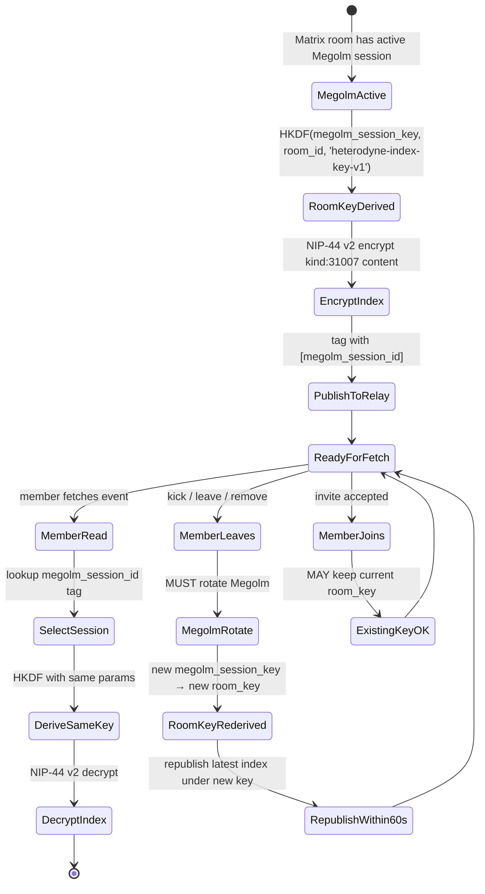

# ADR-005: Private feed index — Heterodyne room-key wrap (Megolm-derived, NIP-44 v2)

**Date:** 2026-05-21
**Status:** Accepted
**Decision makers:** Liam Helmer (architect); star-chamber providers: gemini-3.1-pro, gpt-5.4 (via Fuel-IX); local Claude subagent

## Context

The current spec at §6.7.4 lines 1688–1695 specifies that private rooms MAY publish a `kind:31007` feed index gift-wrapped per NIP-59 (kind:1059 outer event addressing each room member's npub). External critique flagged this as a major scaling concern: a 500-member room produces 500 separate `kind:1059` events per index update.

When the architect was asked about the gift-wrap scaling, they revealed an original design intent that didn't appear in the current spec text: "I think I was imagining that this would actually be sent encrypted using the megolm key for the room, so all clients could decrypt it." That design intent — a per-room shared-key wrap that all members can decrypt with a single event per index update — is materially different from NIP-59 per-recipient gift wrap.

The architecture-review round 2 reviewers initially recommended deferring this design to v0.3 (sub-grill on key management first), but the architect chose to design it now. A focused sub-grill resolved the four open design questions (key derivation, encryption primitive, rotation lifecycle, backward compatibility).

## Decision

Replace the NIP-59 per-recipient gift-wrap path for private `kind:31007` indexes with a **Heterodyne-defined room-key wrap**:

- **Key derivation:** the room key is derived from the active Matrix Megolm outbound session key using HKDF with the info string `"heterodyne-index-key-v1"`. When Megolm rotates (whether by membership change, time, or message count), the index key rotates with it.
- **Encryption primitive:** NIP-44 v2 (ChaCha20 + HMAC-SHA256, with NIP-44 padding) using the derived room key as the NIP-44 conversation key.
- **Rotation policy:** MUST rotate on member removal/kick/leave; MAY accept the existing key on join.
- **Backward compatibility:** the NIP-59 gift-wrap path is withdrawn entirely; the room-key wrap is the only private-index mechanism.

This change applies only to **private rooms** (`private_verifiable`, `private_deniable`, `dm_verifiable`, `dm_deniable`). Public rooms (`public_broadcast`, `public_moderated`) continue to publish their feed indexes as plaintext `kind:31007` events on Nostr relays per §6.7.

## Requirements (RFC 2119)

### Key derivation

1. Heterodyne clients publishing a `kind:31007` index for a `private_verifiable`, `private_deniable`, `dm_verifiable`, or `dm_deniable` room MUST derive the room key as: `room_key = HKDF-SHA256(ikm=megolm_session_key, salt=room_id, info="heterodyne-index-key-v1", L=32)`, where `megolm_session_key` is the 32-byte outbound session key currently active for the room.
2. Heterodyne clients MUST track Megolm session rotations and re-derive `room_key` whenever the outbound session rotates.
3. Heterodyne clients MUST identify which Megolm session derived the current `room_key` via a `["megolm_session_id", "<session-id>"]` tag on each published `kind:31007` event, enabling receivers to select the correct key.

### Encryption

4. The `content` field of a `kind:31007` event for a private room MUST contain the NIP-44 v2 encryption of the index payload (the same JSON structure that would otherwise appear in the unencrypted `content`), with `room_key` as the NIP-44 conversation key.
5. Heterodyne clients MUST decrypt `kind:31007` events for private rooms by selecting the Megolm session indicated by the `["megolm_session_id", "..."]` tag, deriving `room_key`, and applying NIP-44 v2 decryption.
6. The `tags` field of the `kind:31007` event remains plaintext, EXCEPT that the `["d", "..."]` addressable identifier MUST be a stable opaque value (e.g., a hash of the persona-pubkey + room-id) that does not leak the room's identity to non-members observing relays.

### Rotation

7. Heterodyne clients MUST trigger a Matrix Megolm rotation (and therefore a `room_key` rotation) when any member is removed, kicked, or leaves voluntarily from a `private_*` or `dm_*` room.
8. Heterodyne clients MAY accept the existing Megolm session (and therefore the existing `room_key`) when new members join — historical indexes encrypted under prior keys remain readable by those who possess the prior Megolm sessions.
9. Heterodyne clients MUST republish the latest `kind:31007` index encrypted under the new `room_key` within a normative window (SHOULD: 60 seconds) of a forced rotation, so that newly excluded members cannot read subsequent updates.

### Backward compatibility

10. The spec MUST withdraw the NIP-59 gift-wrapped private index path from §6.7.4 entirely.
11. Heterodyne clients MUST NOT publish private `kind:31007` indexes using NIP-59 gift-wrap.
12. Heterodyne clients SHOULD ignore any NIP-59-gift-wrapped events claiming to contain a `kind:31007` index (defensive: such events may originate from buggy or legacy clients and should not be honored as authoritative indexes).

### Other

13. Test vectors required: key derivation given a known Megolm session key, encryption/decryption of a sample `kind:31007` payload, rotation behavior after a member-removal event.
14. §6.7.4 MUST be rewritten to specify this room-key wrap mechanism; the NIP-59 gift-wrap text MUST be removed (not merely deprecated).

## Rationale

The sub-grill explicitly considered alternative key-derivation sources (independent Heterodyne key distributed via state event; persona-secret + epoch counter). Megolm-derived was chosen because:
- All room members already have the Megolm session — no new key distribution mechanism is needed.
- Rotation triggers are already well-defined for Megolm (Matrix client libraries handle them).
- The key lifecycle is automatically tied to the room's E2EE membership boundary.

NIP-44 v2 was chosen over AES-GCM with HKDF-derived per-message subkeys because:
- Stays inside the Nostr cryptographic stack; implementers already have NIP-44 libraries.
- NIP-44's padding scheme hides index length, which would otherwise leak how many published events a persona has accumulated.

The rotation policy (mandatory on remove, permissive on join) matches typical Megolm best practice and avoids spurious republication on every join in active rooms.

Withdrawing rather than deprecating the NIP-59 gift-wrap path is acceptable because that path was OPTIONAL in v0.2.0 — no known implementer has shipped against it. A clean break avoids the parallel-paths conformance complexity.

## Alternatives Considered

### Key derivation alternatives
- **Independent Heterodyne key distributed via Matrix state event:** would decouple rotation policy from Megolm but adds new state event surface, new distribution mechanism, and a second key-lifecycle to reason about. Rejected because Megolm coupling is operationally simpler.
- **Persona-installed room secret + epoch counter:** maximally independent; adds significant spec surface (epoch state event, counter monotonicity rules, recovery from lost secret). Rejected as over-engineered for the use case.

### Encryption primitive alternatives
- **AES-256-GCM with HKDF subkeys:** standard AEAD, wider tooling. Rejected because the Nostr-native NIP-44 v2 is sufficient and avoids introducing a second crypto stack.
- **XChaCha20-Poly1305 direct:** simple AEAD, no NIP alignment. Rejected for the same NIP-alignment reason.

### Rotation alternatives
- **Mandatory rotation on every membership change:** strongest forward/backward secrecy but high cost in churny rooms. Rejected — the marginal security benefit on join is small (the new member sees future indexes; that's expected behavior).
- **Heterodyne-defined explicit rotation trigger:** decouples from Megolm but breaks the simplicity of "derive from Megolm." Rejected.

### Backward-compat alternatives
- **Keep gift-wrap as DEPRECATED OPTIONAL fallback:** smoother transition. Rejected because no known implementer has shipped the gift-wrap path; clean break is cheaper.
- **Both paths permitted (parallel):** matches scaling math (gift-wrap fine for 2-3 person rooms). Rejected because doubled consumption surface for marginal benefit.

### Whole-feature alternatives
- **Defer to v0.3** (architecture-review recommendation): rejected because the architect chose to design it now via sub-grill rather than accept an undesigned deferral.
- **Withdraw private indexes entirely, rely on Matrix timeline:** considered as a fallback if Megolm-encryption proved impractical. The sub-grill confirmed it is practical, so this alternative is moot.

## Assumed Versions (SHOULD)

- Matrix Megolm: stable specification.
- NIP-44 v2: stable.
- HKDF-SHA256: RFC 5869.

## Diagram

Room-key lifecycle: derivation, encryption, rotation, member removal.

Mermaid source

## Consequences

- §6.7.4 fully rewritten: NIP-59 gift-wrap text removed; room-key wrap mechanism specified.
- New normative requirement: clients track Megolm session IDs and rotate index keys on member removal.
- New tag: `["megolm_session_id", "<id>"]` on private `kind:31007` events.
- New test vectors: key derivation, encryption/decryption, rotation on member removal.
- New `["d", "..."]` requirement: opaque identifier that doesn't leak room identity (room identity is private metadata).
- Loss of cross-Nostr-relay aggregation for private personas — but this was always inherently limited because private rooms are member-bound.
- Public rooms (`public_broadcast`, `public_moderated`) unaffected.

## Council Input

The architecture review initially flagged ADR-004 (this ADR) as under-scoped and recommended deferral to v0.3. The architect chose to design via sub-grill instead. The sub-grill yielded converged design decisions: Megolm-derived key (option A), NIP-44 v2 encryption (option A), mandatory-rotation-on-leave / permissive-on-join (option A), withdraw NIP-59 path entirely (option A). The reviewers' concerns about under-specification are now addressed by requirements 1–14.
