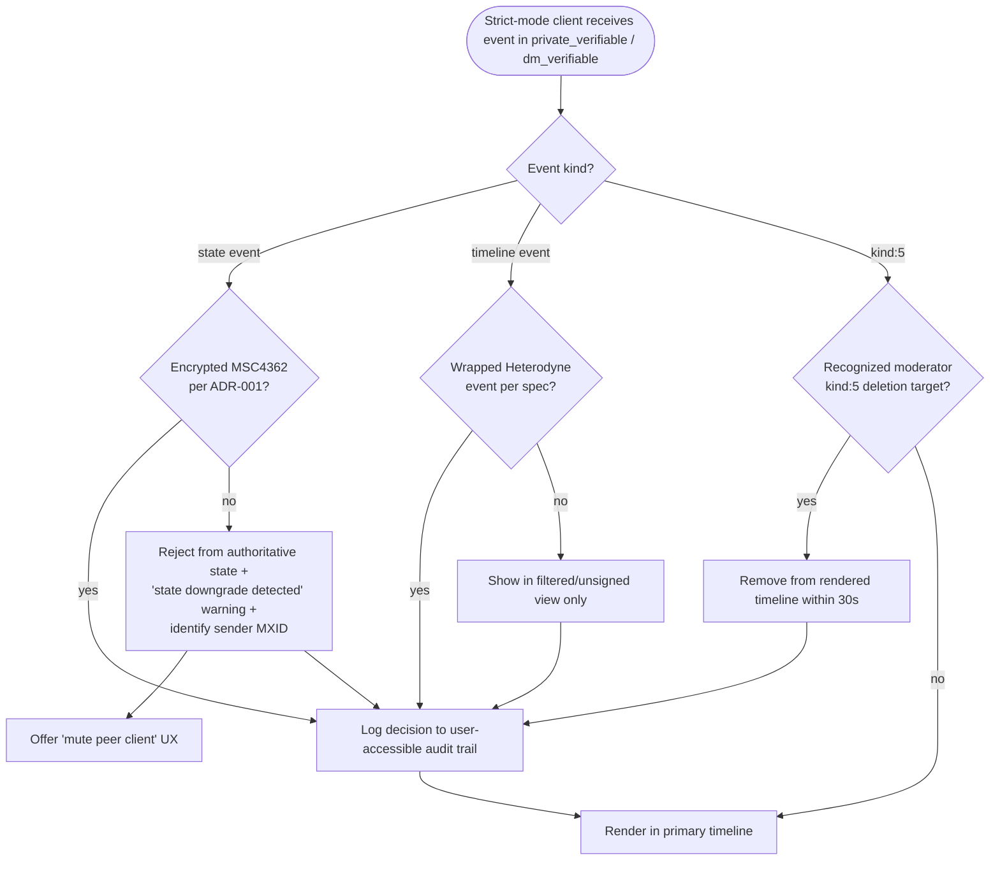

# ADR-007: Heterodyne strict-mode client profile (moderation enforcement and state-downgrade UX)

**Date:** 2026-05-21
**Status:** Accepted
**Decision makers:** Liam Helmer (architect); star-chamber providers: gemini-3.1-pro, gpt-5.4 (via Fuel-IX); local Claude subagent

## Context

External critique (item 15) flagged that Matrix cannot reject bare events at admission time and that the spec's editorial-only moderation approach (§11.1, §12.3) is an honest limitation but provides no enforcement contract. Star-chamber suggested formalizing a "Moderated Client Profile" to standardize client-side filtering UX across implementations.

Additionally, the architecture review for ADR-001 (client-side MSC implementation) surfaced a related issue: when encrypted-state enforcement moves from server-side to client-side, there is a state-downgrade attack surface. A malicious or buggy client could publish unencrypted state events into a `private_*` room. ADR-001's requirement 5 defines the baseline validity semantics (such events are invalid; MUST NOT be authoritative; MUST NOT be presented without a "potentially forged" warning). But strict-mode clients should go further — actively reject, hide, and surface clearer warnings.

This ADR bundles both: define the `heterodyne-strict-mode` client profile and specify its enforcement behaviors for moderation and state-downgrade UX.

## Decision

Define a formal `heterodyne-strict-mode` client profile alongside the editorial-enforcement baseline. Strict-mode clients implement specific MUST behaviors for filtering bare events, honoring `kind:5` deletions, rendering state-downgrade warnings, and rejecting unencrypted state events in private rooms. Clients advertise strict-mode capability via §12 capability negotiation.

§11.1 prose framing ("the wire protocol accepts what it accepts") is preserved — strict-mode is explicitly a client-side layer on top of the wire-level acceptance.

## Requirements (RFC 2119)

### Profile declaration

1. Heterodyne clients MAY implement the `heterodyne-strict-mode` profile. A client implementing this profile MUST advertise the capability `heterodyne-strict-mode` in §12 capability negotiation (specific capability string and version TBD by the §12 capability registry).
2. The spec MUST add a normative subsection (§11.5 or equivalent) defining `heterodyne-strict-mode` and its requirements (this ADR's requirements 3–11).

### Moderation enforcement (strict-mode clients)

3. Strict-mode clients receiving a bare event (non-wrapped Nostr or Matrix message) in a `private_verifiable` or `dm_verifiable` room MUST NOT render that event in the primary timeline. Clients MAY surface it in a "filtered" or "unsigned" view, or hide entirely; they MUST NOT present it as if it were a verified event.
4. Strict-mode clients MUST process Nostr `kind:5` deletions issued by a recognized moderator (per §8) and remove the targeted events from the rendered timeline within a normative window of 30 seconds of observing the `kind:5` event.
5. Strict-mode clients MUST surface an "unmoderated" or "pre-approval" indicator for any event that has not yet been approved by the moderation system in `public_moderated` rooms (where the room's moderation policy requires approval).
6. Strict-mode clients MUST NOT silently fall back to non-strict rendering for any event — every filtering decision MUST be logged in a user-accessible audit trail (last N decisions) so users can verify the client behaved correctly.

### State-downgrade enforcement (strict-mode clients)

7. Strict-mode clients receiving an unencrypted state event of any `m.heterodyne.*` type in a `private_verifiable`, `private_deniable`, `dm_verifiable`, `dm_deniable`, or `config_room` room (per ADR-001 requirement 5) MUST:
   - Reject the event from authoritative state resolution (this is already required at baseline by ADR-001 requirement 5).
   - Display a prominent "potentially forged / state downgrade detected" warning indicating which peer client appears responsible (by `sender` MXID).
   - Log the event for security review per ADR-001 requirement 6.
8. Strict-mode clients SHOULD offer a UX option to mute the offending peer client's events until the user explicitly re-enables them.

### Interoperability

9. Non-strict-mode (baseline) clients MUST still apply ADR-001's requirement 5 (treat unexpected unencrypted state events as invalid). The strict-mode profile adds UX rejection and warning behavior on top of the baseline validity rules; it does NOT replace them.
10. Strict-mode clients MUST interoperate with non-strict-mode clients in the same room: peer presence of a non-strict-mode client does NOT degrade the strict-mode client's behavior.
11. The spec MUST clarify that `heterodyne-strict-mode` is an OPTIONAL profile; clients are not required to implement it for baseline Heterodyne conformance. Specific Heterodyne deployments (e.g., specific community or organizational deployments) MAY require strict-mode via policy outside the spec.

## Rationale

The user chose to formalize a strict-mode profile rather than keep moderation entirely editorial (star-chamber's recommended option A was the lighter conformance-note approach; the user picked the heavier formal profile). The reasoning: a profile creates a measurable conformance target that prevents implementations from diverging on critical filtering UX. Different Heterodyne clients implementing "the right thing" differently would lead to community fragmentation and user confusion.

Bundling state-downgrade UX into the strict-mode profile (rather than a separate ADR) reflects the layering surfaced in architecture review: ADR-001 defines baseline validity ("these events are invalid"); ADR-007 (this ADR) defines strict-mode UX ("here's how to surface that to the user"). Both ADRs are needed; bundling state-downgrade into strict-mode keeps related UX requirements together.

§11.1's "the wire protocol accepts what it accepts" framing is preserved because it's accurate — strict-mode is a client-side filter on top of an accepting wire protocol, not a wire-protocol-level rejection.

## Alternatives Considered

### (A) Keep editorial framing; add a conformance note only
- **Pros:** Smallest spec change; preserves intentional design choice.
- **Cons:** No standard across implementations; community fragmentation risk.
- **Why rejected:** The user chose the formal profile.

### (B) Strict-mode profile but without state-downgrade UX
- **Pros:** Cleaner scope (just moderation).
- **Cons:** State-downgrade is a real attack class introduced by ADR-001's client-side reframe; needs explicit UX handling.
- **Why rejected:** Bundling matches the review's layering recommendation (baseline validity in ADR-001; strict-mode UX here).

### (C) Defer entirely to first-party-client experience
- **Pros:** No premature normative surface.
- **Cons:** User chose to specify now.
- **Why rejected:** User's choice.

## Assumed Versions (SHOULD)

- Nostr NIP-09 (kind:5 deletions): stable.
- NIP-72 (moderated communities): stable.
- Matrix Megolm: stable.

## Diagram

Strict-mode event filtering decision flow.

Mermaid source

## Consequences

- New normative subsection (§11.5 or equivalent): `heterodyne-strict-mode` client profile defined.
- §12 capability registry: new capability `heterodyne-strict-mode` (version TBD).
- §11.1 prose unchanged; the editorial framing is preserved with the addition that strict-mode is a client-side enhancement.
- Strict-mode clients need to implement: bare-event filtering, kind:5 deletion observation, state-downgrade warning UX, peer-mute UX.
- Test vectors required: strict-mode filtering of bare events; kind:5 deletion observation within 30s; state-downgrade warning rendering.
- Non-strict-mode clients are not required to change behavior beyond ADR-001's baseline.

## Council Input

Round 1 of architecture review (one reviewer) suggested a formal "Moderated Client Profile" as a top-level seed; the architect agreed in the grill. Round 2 specifically recommended that state-downgrade mitigation be SPLIT across two ADRs — baseline validity rules in ADR-001 (where the client-side reframe introduces the issue) and UX rendering/rejection in ADR-007 (where strict-mode lives). The reviewers rated "state-downgrade mitigation only in ADR-006" as "high risk / poor fit" because non-strict baseline behavior would remain ambiguous. This ADR follows the split recommendation.
