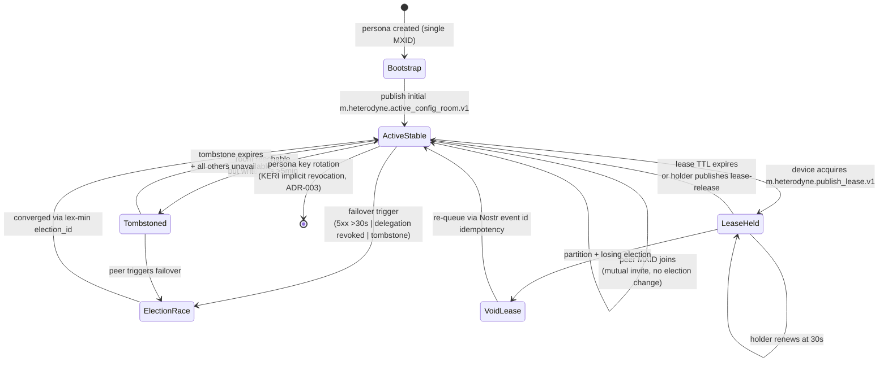

# ADR-009: Multi-homing coordination via mutual config-room membership with elected active leader

**Date:** 2026-05-23
**Status:** Accepted
**Decision makers:** Liam Helmer (architect); star-chamber providers: gpt-5 (via Fuel-IX, two-instance parallel review); local Claude subagent

## Context

The Heterodyne v0.2.0 spec presents multi-homing — one npub on multiple MXIDs across multiple homeservers — as the headline design intuition (CLAUDE.md, §3.1 lines 328–334, §3.2 lines 356–368). However, three concrete multi-homing scenarios remain normatively undefined:

1. **Simultaneous publish from two delegated devices.** If MXID-A on H1 and MXID-B on H2 (same npub) both sign a publishable intent at the same time, §6.1's "exactly one signed Nostr event per intent" rule is violated with no coordination substrate. §3.8.4 explicitly defers cross-MXID synchronization.
2. **`kind:31005` race conditions.** Concurrent publication of differing identity-pointer events leaves the "latest" tiebreaker undefined beyond NIP-01's `created_at` rule.
3. **Single-MXID revocation.** §3.3 prescribes "revoke the delegation and rotate Matrix credentials" with no procedure for removing one MXID's authority while keeping the persona's npub root and other delegations intact.

The architect's design preference (from the brainstorming questionnaire) is: "Each MXID creates a config room. The config room is shared with all multi-homed Matrix accounts. At any given time, only one room is active for things like locks, and information on which room is active is published as a state event into every config room. If a config room becomes unavailable, a different config room would be used, and pointers would be updated. If a room was accessible but not publishable, then clients would tombstone it temporarily and retry it periodically."

This pattern keeps coordination state OUT of the identity room (which is observed by every follower and federation peer) and inside the encrypted config rooms (whose contents are visible only to the persona's own devices). This embodies the project-wide "no unnecessary broadcast" principle: state only the user's devices need MUST NOT be broadcast.

Star-chamber's architecture review of the synthesis raised three load-bearing concerns this ADR addresses: (a) a tiebreak contradiction in the draft (lex-max vs lex-min election_id) — resolved here by standardizing on lex-min; (b) partition-window convergence — addressed by an explicit void-and-requeue rule for leases issued under an election that subsequently loses Matrix state resolution; (c) cold-start with a single MXID — addressed by a bootstrap rule.

## Decision

Per-MXID config rooms (§3.8 substrate preserved) are extended to mutual membership across all delegated MXIDs of the same npub. A single config room is "active" at any time for coordination primitives; the active-room pointer is replicated into every config room. Failover and tombstone semantics handle homeserver unavailability and accessible-but-unpublishable rooms.

The publish lease is a state event in the active config room. `kind:31005` race resolution uses KERI-anchored tiebreakers. Single-MXID revocation combines a Nostr `kind:5` deletion of the delegation attestation with a follow-up Matrix state event scoping the revocation effective time.

## Requirements (RFC 2119)

### Mutual config-room membership

1. The §3.8 per-MXID config room model is preserved. Each delegated MXID MUST create its own config room on first publish.
2. Newly-delegated MXIDs MUST invite every currently-delegated MXID of the same npub to their new config room and share Megolm history.
3. Existing delegated MXIDs MUST invite a newly-observed delegated MXID to their config rooms within 60 seconds of observing the new delegation attestation in the identity room.
4. A persona with N delegated MXIDs SHOULD reach a steady state of N config rooms with N members each. Transient asymmetric membership during invite propagation MUST NOT cause coordination failure (see partition-window rules below).

### Active-room election

5. A new state event type `m.heterodyne.active_config_room.v1` MUST be defined with shape:
   ```json
   {
     "active_room_id": "!opaque:server",
     "active_room_homeserver": "server",
     "elected_at": <unix-seconds>,
     "election_id": "<uuid-v4>"
   }
   ```
6. This state event MUST be replicated into EVERY config room of the persona by the electing device. State key MUST be empty string (`""`) so there is exactly one active-room pointer per config room.
7. Receivers reconcile multiple seen active-room pointers by: max `elected_at`, ties broken by **lex-min `election_id`**. (This rule MUST be applied uniformly across all instances and uses below — `kind:31005` tiebreaker, failover, and rollback recovery.)
8. **Bootstrap.** The first config room created for the persona (lowest `m.room.create.origin_server_ts` observed across the persona's delegations) is the initial active room. On persona creation, the founding MXID MUST publish the initial `m.heterodyne.active_config_room.v1` state event in its own config room.
9. **Cold-start with a single MXID.** A persona with exactly one delegated MXID has exactly one config room, which is bootstrap-active by definition. The active-room pointer MUST still be published (forward-compatibility for when peer MXIDs join).

### Failover

10. Any non-active-MXID device MAY initiate failover by publishing a new `m.heterodyne.active_config_room.v1` electing a different config room when ANY of these triggers fires:
    - (a) The MXID hosting the active room has its delegation revoked per req 17.
    - (b) The active room's homeserver returns 5xx or is network-unreachable for >30 seconds on sync attempts.
    - (c) The active room receives `m.room.tombstone` (e.g., room upgrade or homeserver-initiated retirement).
11. Tiebreaking between concurrent failover elections uses req 7: highest `elected_at`, then lex-min `election_id`.
12. After a successful failover, the new active room MUST contain a fresh `m.heterodyne.publish_lease.v1` issued by the failover initiator (resetting the lease on transition).

### Tombstone-and-retry (accessible-but-unpublishable)

13. When a config room is reachable for read (sync succeeds) but write attempts return errors for >5 minutes cumulative across 3 retry windows, any observing device MUST publish `m.heterodyne.config_room_tombstone.v1` in the currently-active config room with shape:
    ```json
    {
      "tombstoned_room_id": "!opaque:server",
      "expires_at": <unix-seconds>,
      "reason": "<short string, e.g. 'write_5xx_timeout'>"
    }
    ```
    Default `expires_at`: now + 1 hour.
14. Tombstoned rooms MUST NOT be elected as active during the tombstone window. After expiry, they MAY be re-elected only if all other rooms are also tombstoned or unavailable.

### Publish lease (in active room)

15. A new state event type `m.heterodyne.publish_lease.v1` MUST be defined with shape:
    ```json
    {
      "holder_mxid": "@alice:h1",
      "expires_at": <unix-seconds>,
      "lease_id": "<uuid-v4>"
    }
    ```
    State key MUST be empty string. The event lives ONLY in the currently-active config room.
16. Devices MUST acquire the lease before signing a publishable event. On lease expiry without renewal, any device MAY acquire by writing a new state event with a fresh `lease_id`. Concurrent lease writes resolve by Matrix state-event ordering (last-writer-wins via origin_server_ts → event id, per Matrix v11 state resolution).
17. Lease TTL is 60 seconds. The holder SHOULD renew at 30-second intervals while actively publishing.

### Partition-window correctness

18. During a Matrix federation partition, two devices on different homeservers MAY each elect different active rooms and each issue a publish lease in their believed-active room.
19. When the partition heals and Matrix state resolution converges on a single active room (per req 7), publish leases issued in rooms that LOST the converged election MUST be considered void.
20. Events published under a void lease MUST be re-queued and re-published using the canonical lease, with the original Nostr event id reused as the Matrix txn_id (idempotent per §6.3). Followers seeing both publications via raw relay reads MUST dedupe by Nostr event id.

### kind:31005 race tiebreaker

21. When verifiers see multiple `kind:31005` events for the same npub, the tiebreaker rule MUST be:
    - (a) Highest `created_at`.
    - (b) On tie: prefer the event whose `matrix_identity_room` value is corroborated by an `m.heterodyne.root.v1` published in that room AND has the highest KERI witness count for the persona's current epoch (per ADR-003 first-seen ordering).
    - (c) On further tie: lex-min event id.

### Single-MXID revocation

22. To revoke a single delegation without rotating the npub root, the persona MUST publish:
    - A `kind:5` deletion event (per NIP-09) targeting the delegation attestation (`kind:31001`) event id.
    - An `m.heterodyne.delegation_revoked.v1` state event in the identity room with shape:
      ```json
      {
        "revoked_mxid": "@alice:h1",
        "effective_at": <unix-seconds>,
        "reason": "<optional short string>"
      }
      ```
23. Events signed by the revoked MXID with `created_at >= effective_at` MUST be marked untrusted by verifiers.
24. Other delegated MXIDs of the same npub MUST kick the revoked MXID from all of their config rooms within 60 seconds of observing the revocation state event.
25. If the revoked MXID was holding the publish lease at the moment of revocation, any non-revoked MXID device MUST trigger failover per req 10(a).

### Interaction with KERI

26. A KERI rotation event (per ADR-003 `kind:31003`) implicitly revokes ALL delegations whose `nostr_attestation` was signed under the rotated epoch. The single-MXID revocation procedure in reqs 22–25 is for SELECTIVE revocation without full epoch rotation.

## Rationale

The architect's substrate choice (mutual config-room membership with elected active leader) is the narrowest substrate satisfying the requirement: state only the persona's devices read, no identity-room broadcast surface, deterministic resolution under Matrix's eventual-consistency model.

The lex-min `election_id` tiebreaker matches the "first by birthday" convention used in ADR-003's KERI first-seen ordering and in Matrix state resolution itself (lex-min event id on origin_server_ts ties).

The partition-window void-and-requeue rule (reqs 18–20) is critical: without it, a partition could produce two committed publishes for the same intent, with no recovery path. The idempotent re-publication (Nostr event id as txn_id) ensures that the cleanup is observable and convergent.

The tombstone-and-retry mechanism handles the asymmetric homeserver case the architect specifically called out (accessible but not publishable) — a scenario standard Matrix mechanisms don't address because Matrix assumes a homeserver is either reachable or not.

Single-MXID revocation as a Nostr `kind:5` deletion plus a scoped Matrix state event mirrors the moderation `kind:5` pattern in ADR-007 — same wire mechanism, different scope.

## Alternatives Considered

### (A) Identity-room publish lease (rejected during questionnaire)
- **Pros:** Single room, no cross-room replication.
- **Cons:** Broadcasts coordination state (lease churn, device count, publish cadence) to every follower and federation peer.
- **Why rejected:** Violates the no-unnecessary-broadcast principle. The architect explicitly chose against it: "anything that doesn't need to be broadcast shouldn't be broadcast."

### (B) NIP-59 gift-wrapped device-to-device leases over Nostr
- **Pros:** No new Matrix state; works without Matrix connectivity.
- **Cons:** New Nostr event kind; gift-wrap overhead per lease op; conflicts with Heterodyne's "Matrix for private coordination" convention; relay polling latency for lease ops.
- **Why rejected:** The architect's design preference is Matrix-substrate for coordination.

### (C) Per-npub shared config room (extending §3.8 to per-npub)
- **Pros:** One substrate for both within-MXID and cross-MXID coordination.
- **Cons:** Cross-homeserver Matrix room invite latency blocks first publish from a fresh MXID; the shared room ID being public reveals approximate device count if observers count members.
- **Why rejected:** The architect's design keeps per-MXID config rooms (no §3.8 rewrite) and uses mutual membership for cross-MXID.

### (D) Intent-id dedup with no coordination protocol
- **Pros:** Zero blocking on publish; resilient to partitions.
- **Cons:** Both devices burn relay bandwidth and signature CPU on every publish; dedup is feed-index-only (raw-relay readers still see duplicates).
- **Why rejected:** The architect chose coordination over post-hoc dedup.

## Assumed Versions (SHOULD)

- Matrix room version: v11 (per ADR-002 pin).
- Matrix Megolm: stable.
- NIP-09 (kind:5 deletions): stable.
- ADR-003 (KERI inline profile): foundational; ADR-009 builds on KERI witness counts for `kind:31005` tiebreaking.

## Diagram

Active-room election + publish-lease + tombstone state machine.

<details><summary>Mermaid source</summary>



</details>

## Consequences

- New normative §3.9 (or equivalent placement): "Multi-homing coordination."
- §3.8 amended to require mutual config-room membership across all delegated MXIDs of the same npub.
- New state event types: `m.heterodyne.active_config_room.v1`, `m.heterodyne.publish_lease.v1`, `m.heterodyne.config_room_tombstone.v1`, `m.heterodyne.delegation_revoked.v1`.
- `kind:31005` tiebreaker rule normatively defined; ADR-003 KERI witness count is the second-stage discriminator.
- Single-MXID revocation procedure normatively defined; distinct from KERI epoch rotation.
- §6.3 idempotency strengthens partition-window recovery (re-publication uses original Nostr event id as Matrix txn_id).
- Test vectors required (per ADR-011): `multi-homing/active-room-election`, `multi-homing/publish-lease`, `multi-homing/single-mxid-revocation`, `multi-homing/kind31005-tiebreaker`, `multi-homing/partition-window-void-requeue`.
- First-party client must implement the full coordination protocol; this is the largest single normative surface added in this batch.
- Matrix federation lag affects first-publish latency from a fresh MXID by up to 60 seconds (mutual-invite propagation window).

## Council Input

Star-chamber's parallel-mode review of the synthesis flagged: (a) the lex-max vs lex-min `election_id` contradiction — fixed here by standardizing on lex-min; (b) the partition-window convergence gap — fixed by reqs 18–20; (c) the single-MXID cold-start case — fixed by req 9. The architect accepted all three fixes verbatim during the post-review gate.

The architect's substrate-choice text (mutual membership + active-leader + tombstone-and-retry) was preserved verbatim from the questionnaire answer; the requirements here operationalize that text without expanding scope beyond it.
