# ADR-012: Full Megolm→MLS migration protocol with receiver-verifiable flip

**Date:** 2026-05-23
**Status:** Accepted
**Decision makers:** Liam Helmer (architect); star-chamber providers: gpt-5 (via Fuel-IX, two-instance parallel review); local Claude subagent

## Context

§9.2 (lines 2998–3039) reserves a state event `m.heterodyne.encryption_version.v1` with `algorithm: "megolm"`, `migrated_from: null`, `migrated_at: null`, and states: "The MLS migration procedure (re-key, member re-acknowledgement, atomic flip of `algorithm`, populating `migrated_from` and `migrated_at`) is deferred to a future spec version." The spec elsewhere references "the MLS variant once stabilized" (§5.4 line 1570; §3.8.1 line 943) as if it is a near-term drop-in.

Three derived problems:

1. **No capability negotiation hook.** `m.heterodyne.capabilities.v1` (§12.2) advertises `event_types` and `profiles` but has no `encryption_algorithms_supported` field. A room cannot verify all members support MLS before flipping.
2. **No dual-protocol period or key-continuity.** The spec does not describe what happens to in-flight Megolm-encrypted messages during the transition window, nor whether/how Megolm session keys carry forward.
3. **Bootstrapping problem.** The `m.heterodyne.encryption_version.v1` state event is itself encrypted (per ADR-001 client-side MSC4362). A client that doesn't share the room's Megolm session key cannot even read which algorithm is in use — a chicken-and-egg for MLS migration signaling.

The architect's questionnaire answer: specify the full Megolm→MLS migration protocol now, even though Matrix MLS itself isn't finalized. This is consistent with the architect's broader "comprehensive scope" choice for v0.2.0.

Star-chamber's review flagged two concerns this ADR addresses: (a) the "atomic flip" framing is over-strong given Matrix federation lag — adopted here as "receiver-verifiable flip"; (b) offline members during the 60-second drain window need explicit reconnect handling.

## Decision

Specify the full Megolm→MLS migration as a moderator-initiated, all-member-ACK'd, receiver-verifiable flip with a defined drain window, key-continuity recommendation, and explicit fallback for non-MLS clients. Capability advertisement gates eligibility. Offline-member reconnect and federation-lag tail-period handling are normatively defined to bound the indeterminism inherent in eventually-consistent Matrix state.

## Requirements (RFC 2119)

### Capability advertisement

1. The `m.heterodyne.capabilities.v1` schema (§12.2) MUST be extended with a new field:
   ```json
   { "encryption_algorithms_supported": ["megolm", "mls"?, "<future>"?] }
   ```
   Clients MUST advertise their supported algorithms. Receivers MUST tolerate unknown algorithm strings (forward compatibility).
2. Baseline conformance MUST include `"megolm"`. Clients claiming MLS support MUST include `"mls"`.

### Migration eligibility

3. A room MUST NOT initiate Megolm→MLS migration unless every current member's most-recent `m.heterodyne.capabilities.v1` advertisement (within the last 30 days) includes `"mls"`. The initiator MUST verify this gate before publishing the migration intent.

### Initiator selection

4. The migration initiator is the room moderator (highest Matrix power level whose MXID is currently delegated under any persona).
5. If multiple members share the highest power level, the persona npub with lex-min hex value initiates. The initiator's MXID and persona npub MUST be recorded in the migration intent event.

### Pre-flip intent

6. The initiator MUST publish `m.heterodyne.migration_intent.v1` as a state event in the room (encrypted under the current Megolm session per ADR-001) with shape:
   ```json
   {
     "target_algorithm": "mls",
     "drain_window_seconds": 60,
     "intent_id": "<uuid-v4>",
     "initiator_mxid": "@alice:h1",
     "initiator_npub": "<hex>"
   }
   ```
   State key MUST be the `intent_id`.

### Member ACK

7. Every current room member MUST respond within the drain window with `m.heterodyne.migration_ack.v1` (encrypted under current Megolm), shape:
   ```json
   { "intent_id": "<uuid-v4>", "member_npub": "<hex>" }
   ```
8. Missing ACKs at drain expiry MUST cause migration abort: the initiator publishes `m.heterodyne.migration_abort.v1` referencing the `intent_id` with `reason: "missing_acks"` and a list of non-acking npubs. A new `migration_intent` event MUST NOT be issued within 24 hours of an abort.

### Drain window

9. During the 60-second drain window, members SHOULD NOT publish new timeline events. In-flight Megolm events that were signed before the drain window opened MAY complete delivery normally.

### Receiver-verifiable flip

10. At drain expiry with all ACKs received, the initiator MUST publish `m.heterodyne.encryption_version.v1` (the slot reserved by current §9.2, state key empty string) with:
    ```json
    {
      "algorithm": "mls",
      "migrated_from": "megolm",
      "migrated_at": <unix-seconds>,
      "intent_id": "<uuid-v4>"
    }
    ```
    This state event MUST itself be encrypted under the LAST Megolm session key so all current members can read it.
11. The flip is **receiver-verifiable, not atomic**: each receiver, on processing the flip event in its local view of room state, treats all timeline events with origin_server_ts > flip event's origin_server_ts as MLS-encrypted and all earlier events as Megolm-encrypted.

### Offline-member reconnect handling

12. A member that comes online after the flip with queued local Megolm events MUST check the room's current `m.heterodyne.encryption_version.v1` state BEFORE publishing.
13. If the room's current `algorithm != "megolm"` and the member supports the new algorithm, queued events MUST be re-encrypted under the new algorithm using fresh MLS state (NOT the queued Megolm ciphertext) before publish. The original Nostr event id is reused as the Matrix txn_id (idempotency per §6.3).
14. If the queued events were already published via Nostr relays (asymmetric delivery per ADR-010) before going offline, the Matrix-side re-encryption proceeds normally; ADR-010's reverse-asymmetry rules apply.
15. If the member does NOT support the new algorithm, queued events MUST be marked as locally failed; the user MUST be notified per ADR-010 reqs 6 / 8.

### Federation-lag tail period

16. Between the initiator's flip event being committed at the initiator's homeserver and full Matrix federation propagation (typically <30 seconds), federated members who have not yet seen the flip MAY publish Megolm-encrypted events.
17. Receivers that HAVE seen the flip MUST accept such Megolm events as valid for the room's history IF the events' origin_server_ts is within a 60-second tail-period after the flip's origin_server_ts AND the events reference Megolm session keys received before the flip. Events outside this window or referencing session keys not received before the flip MUST be rejected as unauthenticated.
18. After the tail period expires (60 seconds post-flip), any Megolm event MUST be rejected regardless of session key provenance.

### Key continuity

19. RECOMMENDED: the initiator includes the Megolm session export (per Matrix spec, encrypted as opaque blob) as `app_data.megolm_session_export` in the first MLS commit after the flip. Clients with the export can decrypt pre-flip historical timeline content.
20. Key continuity is OPTIONAL because the privacy benefit (decrypting old Megolm content under MLS-derived keys) is small and the operational cost (key-handling complexity) is non-trivial.

### Receiver fallback (non-MLS clients)

21. A client whose `encryption_algorithms_supported` does NOT include `"mls"` that encounters a room with `algorithm: "mls"` MUST:
    - (a) Mark the room "unsupported encryption — MLS upgrade required."
    - (b) Stop accepting new timeline events for moderation/storage processing.
    - (c) Retain read access to pre-migration history via Megolm (the session keys it already holds remain valid for pre-flip events and tail-period events per req 17).
    - (d) Surface a one-time warning to the user with upgrade guidance.

### Rollback

22. MLS→Megolm rollback is FORBIDDEN in v0.2. Once a room is flipped to MLS, it remains on MLS for the spec's lifetime.

### Re-attempt after abort

23. If a `migration_intent` event is followed by `migration_abort` or expires without quorum ACK, the room remains on Megolm. A new `migration_intent` MAY be issued no sooner than 24 hours after the abort. Repeated aborts SHOULD be surfaced to the room's moderators as a "members not upgrading" signal.

## Rationale

The architect chose to specify the full migration protocol despite Matrix MLS instability. The choice is consistent with the broader v0.2.0 comprehensive-scope stance: lock down protocol now so first-party client validation can exercise migration end-to-end. The cost (potential need for breaking changes when Matrix MLS finalizes) is accepted; the benefit (no half-specified migration that diverges across implementations) is judged worth it.

"Receiver-verifiable flip" (req 11) replaces the over-strong "atomic" framing. Matrix state is eventually consistent under federation; calling the flip atomic was technically wrong. The tail-period rule (reqs 16–18) bounds the indeterminism: within 60 seconds of the flip, Megolm events with proper session-key provenance are accepted; outside that window, never. This matches the operational reality of Matrix federation propagation while keeping the security boundary tight.

The offline-reconnect handling (reqs 12–15) addresses the star-chamber's concern that offline members during the drain would produce unrecoverable Megolm events. The solution: on reconnect, the member observes the flip, discards queued Megolm publishes, re-encrypts under MLS, and reuses the Nostr event id for idempotency. Worst case (member doesn't support MLS): the queued events are locally marked failed per ADR-010 — explicit failure, not silent loss.

Lex-min npub for tied initiator selection (req 5) matches the lex-min election_id tiebreaker pattern from ADR-009 and the first-seen ordering from ADR-003.

Forbidding rollback (req 22) is a deliberate simplification: rollback semantics would double the protocol surface (re-MLS-encryption of MLS history, key-continuity in the reverse direction). v0.2 explicitly defers; if rollback is ever needed, a future spec version can define it.

## Alternatives Considered

### (A) Capability + abort-safe stub only (defer the flip procedure)
- **Pros:** Doesn't lock semantics that depend on a moving Matrix MSC; minimal commitment.
- **Cons:** Still leaves the actual flip unspecified; first-party client cannot exercise migration; "MLS readiness" stays advertised but unwired.
- **Why rejected:** The architect chose full specification.

### (B) Explicit non-goal (delete the schema slot, defer MLS to v0.3)
- **Pros:** Cleanest; matches reality that Matrix MLS isn't stable.
- **Cons:** Rules out experimental MLS rooms during the v0.2 window; contradicts the existing schema-slot signal.
- **Why rejected:** The architect chose full specification.

### (C) Pure receiver-fallback (no migration protocol, just "MLS rooms exist; non-MLS clients can't join")
- **Pros:** Smallest spec.
- **Cons:** No Megolm-to-MLS migration possible; rooms are stuck on whichever algorithm they were created with.
- **Why rejected:** Migration is the load-bearing case (existing rooms need to upgrade).

### (D) Atomic flip with no tail period
- **Pros:** Cleaner mental model.
- **Cons:** Matrix federation lag makes this unenforceable; events arriving via lagging federation would be silently rejected with no recovery.
- **Why rejected:** Adopted receiver-verifiable + tail period instead.

## Assumed Versions (SHOULD)

- Matrix Megolm: stable.
- Matrix MLS (when it stabilizes): the migration protocol here is forward-compatible with the expected MLS primitives, but specific field names in `app_data.megolm_session_export` may need adjustment when Matrix MLS finalizes its session-export schema. A future ADR will reconcile if needed.
- ADR-001 (client-side MSC implementation): foundational; the flip event is itself MSC4362-encrypted state.
- ADR-009 (multi-homing): the lex-min tiebreaker convention is reused for initiator selection.
- ADR-010 (asymmetric delivery): the idempotent-republish mechanism is reused for re-encrypted offline-queue events.

## Diagram

Megolm-to-MLS migration state machine.

```mermaid
stateDiagram-v2
    [*] --> Megolm: room created on Megolm
    Megolm --> EligibilityCheck: moderator considers migration
    EligibilityCheck --> Megolm: not all members advertise mls
    EligibilityCheck --> IntentPublished: all current members support mls

    IntentPublished --> Drain: drain window (60s)
    Drain --> AllACKd: every member sends migration_ack.v1
    Drain --> Aborted: drain expires with missing ACKs

    Aborted --> Megolm: migration_abort.v1 published;<br/>24h cooldown
    AllACKd --> Flipped: initiator publishes encryption_version.v1<br/>(MLS, encrypted under last Megolm key)

    Flipped --> TailPeriod: 60s window for lagging federation
    TailPeriod --> MLSSteady: tail expires;<br/>only MLS events accepted

    state OfflineMember {
        [*] --> Reconnect
        Reconnect --> CheckState: observe encryption_version.v1
        CheckState --> ReEncrypt: supports mls
        CheckState --> MarkFailed: does not support mls
        ReEncrypt --> [*]: re-publish with original nostr id
        MarkFailed --> [*]: notify per ADR-010
    }

    MLSSteady --> [*]
```

<details><summary>Mermaid source</summary>



</details>

## Consequences

- §9.2 fully populated: migration intent, ACK, abort, flip, tail period, offline reconnect, receiver fallback all defined.
- §12.2 capabilities schema extended with `encryption_algorithms_supported`.
- New state event types: `m.heterodyne.migration_intent.v1`, `m.heterodyne.migration_ack.v1`, `m.heterodyne.migration_abort.v1`. (`m.heterodyne.encryption_version.v1` already reserved; this ADR specifies its post-flip shape.)
- Test vectors required (per ADR-011, OPTIONAL skippable category): `encryption/mls-migration/eligibility-check`, `encryption/mls-migration/intent-and-ack`, `encryption/mls-migration/abort-on-missing-acks`, `encryption/mls-migration/receiver-verifiable-flip`, `encryption/mls-migration/tail-period`, `encryption/mls-migration/offline-reconnect-re-encrypt`, `encryption/mls-migration/receiver-fallback`.
- First-party client implementation can exercise the migration end-to-end; this is the protocol's largest single feature addition in v0.2.
- Forward-compatibility risk: when Matrix MLS finalizes, specific primitives (session export schema, MLS commit content) may need a follow-up ADR. The migration protocol skeleton (intent / ACK / flip / tail / fallback) is independent of those primitives.
- Rollback explicitly forbidden; future spec version may revisit.

## Council Input

Star-chamber's review identified two specific concerns: (a) "atomic flip" is technically overstated because Matrix state visibility is not globally instantaneous — addressed by renaming to "receiver-verifiable flip" and adding the tail-period rule; (b) offline members during the drain need explicit reconnect handling — addressed by reqs 12–15 with idempotent re-encryption via Nostr event id reuse.

The review's broader concern about specifying MLS before upstream stabilization is acknowledged in the consequences. The architect's explicit choice was to proceed with full specification; the forward-compatibility risk is accepted as part of that choice.
