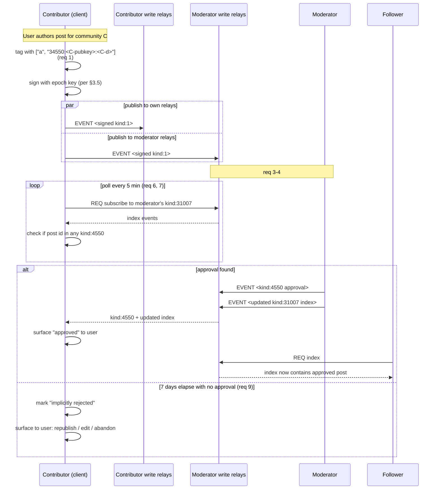

# ADR-014: NIP-72 contributor submission flow (sender-side normative guidance)

**Date:** 2026-05-23
**Status:** Accepted
**Decision makers:** Liam Helmer (architect); star-chamber providers: gpt-5 (via Fuel-IX, two-instance parallel review); local Claude subagent

## Context

§8 specifies the NIP-72 moderation flow comprehensively for the moderator side (candidate fetch, `kind:4550` approval issuance, `kind:31007` index update, `kind:5` revocation per ADR-007) and the follower side (read moderator indexes, count approvals, render approved posts). The contributor side — what a user does to submit a post to a `public_moderated` community — has no normative guidance in v0.2.0:

- Which relays should the contributor publish to for moderator discoverability? §8.1's sequence diagram (lines 2630–2635) shows "posting for room's topic" with no MUST or SHOULD on relay choice.
- What tags must a candidate post carry to be discoverable as a community submission? NIP-72 uses `["a", "34550:<pubkey>:<d-tag>"]`; the spec does not specify whether Heterodyne adopts that or uses its own convention.
- How does a contributor detect that their post is pending approval? The sequence diagram shows "pending mod approval" status but provides no normative detection mechanism.
- What happens to a post that never receives approval? §8.4 establishes "silence is rejection" but provides no MUST on contributor wait time before concluding rejection.

NIP-72's own specification is sufficiently vague that implementations diverge; Heterodyne's composition of NIP-72 over Matrix needs to be specific. Without contributor-side normative guidance, contributors to `public_moderated` rooms have no protocol to implement against.

## Decision

Specify the contributor-side NIP-72 submission flow: community-address tagging, moderator-relay publishing recommendation, pending-approval detection mechanism, and implicit-rejection timeout. The "silence is rejection" model from §8.4 is preserved — v0.2 does NOT introduce an explicit moderator-rejection event.

## Requirements (RFC 2119)

### Community address tagging

1. Contributors submitting candidate posts to a `public_moderated` community room MUST tag the post with the NIP-72 community address tag:
   ```
   ["a", "34550:<community-pubkey-hex>:<community-d-tag>"]
   ```
   where `<community-pubkey-hex>` is the persona npub that originated the community (per NIP-72) and `<community-d-tag>` is the community's `d` tag value.
2. The community address tag MUST be present in the candidate post's NIP-01 `tags` array before the contributor signs the event. Adding the tag post-signature would invalidate the BIP-340 signature.

### Moderator-relay publishing

3. Contributors SHOULD publish candidate posts to the moderators' NIP-65 write relays. The moderator set is discovered from the `m.heterodyne.moderators.v1` state event of the `public_moderated` room: the listed moderator npubs are resolved via the standard discovery walk (§7.3) to their `kind:10002` outbox lists, and the union of their write relays forms the recommended publish set.
4. Contributors MUST also publish to their own NIP-65 write relays (per existing §6 publishing requirements). The two relay sets MAY overlap; the union is used.

### Client identification tag (optional)

5. Contributors MAY add a `["client", "heterodyne"]` tag for moderator UI filtering. This tag is informational; moderators MAY use it to prioritize Heterodyne-originated submissions but MUST NOT use it as a filter that excludes non-Heterodyne submissions.

### Pending-approval detection

6. After submission, contributors RECOMMENDED to poll each moderator's `kind:31007` feed index (per ADR-005 / ADR-006) every 5 minutes for the candidate post id appearing in a `kind:4550` approval event.
7. The polling cadence is RECOMMENDED 5 minutes; clients MAY use exponential backoff after the first 30 minutes (e.g., 5min → 10min → 30min → 1hr) to reduce relay load. Polling MUST stop when an approval is detected or the implicit-rejection timeout (req 9) elapses.
8. Clients MAY subscribe via NIP-01 REQ to moderator indexes in real-time as an alternative to polling, provided the subscription respects each moderator's relay set.

### Implicit rejection

9. If no `kind:4550` approval appears within 7 days of the candidate post's `created_at`, the post MUST be treated as rejected by all conformant clients. The contributor's client MUST surface "post not approved within 7-day window" to the user with the option to:
   - (a) Republish unchanged (rare; useful if the contributor believes the moderator queue was overwhelmed).
   - (b) Republish with edits (new post, new id).
   - (c) Abandon.
10. v0.2 does NOT define an explicit moderator-rejection event. The "silence is rejection" model from §8.4 is preserved.

### Backoff after multiple rejections

11. Contributors that have had three consecutive posts implicitly rejected from a single `public_moderated` community SHOULD surface a warning to the user that "the community may not be accepting your submissions." This is a UX hint, not a protocol-level enforcement.

### Interaction with ADR-013 anti-abuse

12. Candidate posts to `public_moderated` communities are subject to the same NIP-42 AUTH / NIP-13 PoW requirements as any other public Nostr write (per ADR-013). Relay rejection of a candidate post follows ADR-010 transient/permanent semantics independent of the community moderation flow.

## Rationale

The community-address tag (req 1) is the load-bearing discoverability mechanism: without it, moderators have no way to know a post is a submission to their community. NIP-72's specification of the tag format is followed verbatim; Heterodyne does not invent a parallel convention.

Moderator-relay publishing as SHOULD (req 3) acknowledges that contributor relay choice is operational policy, not a wire-format requirement. A contributor who publishes only to relays the moderators don't read silently fails to submit — but that's a UX problem, not a protocol violation. Making the moderator-relay publishing MUST would force contributors to perform discovery walks before every submission, which is operationally heavy.

The 7-day implicit-rejection window (req 9) balances moderator latency (moderators may take days to review) against contributor patience (the user shouldn't wait forever to know their post is dead). A 7-day window is conservative; specific communities may set tighter expectations via out-of-band documentation but cannot tighten the protocol-level timeout.

Preserving the "silence is rejection" model (req 10) reflects the architect's design choice from the v0.1 era: explicit rejection events would leak information about moderator decisions (which moderators rejected, when, what the rejection reason was) that NIP-72 deliberately keeps private. v0.2 holds this choice.

The polling-with-exponential-backoff guidance (req 7) addresses relay load: 5-minute polling for the first 30 minutes catches fast approvals; backoff after that reduces traffic for long-pending submissions.

The optional `["client", "heterodyne"]` tag (req 5) is intentionally permissive — moderators that want to surface Heterodyne-originated content can do so without excluding others. Heterodyne does not gatekeep community participation.

## Alternatives Considered

### (A) Add an explicit moderator-rejection event
- **Pros:** Contributors get immediate feedback; no 7-day wait.
- **Cons:** Leaks moderator-decision metadata; conflicts with §8.4's "silence is rejection" model; expands moderator workflow burden (now they must EXPLICITLY reject as well as approve).
- **Why rejected:** Preserves §8.4 model.

### (B) MUST publish to moderator relays (not SHOULD)
- **Pros:** Guarantees submission discoverability.
- **Cons:** Forces discovery walk before every submission; operationally heavy; user has no fallback if moderator relays are temporarily unreachable.
- **Why rejected:** SHOULD is the right fit; failed-to-discover-moderators is a soft failure.

### (C) Define a Heterodyne-specific community tag (instead of NIP-72's `["a", "34550:..."]`)
- **Pros:** Cleaner namespace.
- **Cons:** Breaks NIP-72 interop; cross-community discoverability fails.
- **Why rejected:** Heterodyne uses existing NIPs where they already exist (CLAUDE.md design principle).

### (D) Shorter implicit-rejection window (e.g., 24 hours)
- **Pros:** Faster user feedback.
- **Cons:** Communities with weekend-only moderator availability would routinely time out legitimate submissions.
- **Why rejected:** 7 days is conservative and matches typical moderator-availability patterns.

## Assumed Versions (SHOULD)

- NIP-72 (community moderation): stable.
- NIP-01 (relay protocol): stable.
- NIP-65 (outbox): stable.
- NIP-09 (kind:5 deletions, used by moderator for revocation per ADR-007): stable.

## Diagram

Contributor submission and approval-detection sequence.

<details><summary>Mermaid source</summary>



</details>

## Consequences

- §8.0 or §8.1.1 (placement TBD by spec editor): new "Contributor submission flow" subsection containing reqs 1–11.
- §8.4 "silence is rejection" model preserved; cross-referenced from req 10.
- §6 publishing requirements remain unchanged; contributor-side relay publishing is additive.
- §12 capability negotiation: no new capabilities required (contributor flow is OPTIONAL behavior on top of baseline NIP-72).
- Test vectors required (per ADR-011): `moderation/contributor/community-address-tag`, `moderation/contributor/approval-detection-via-polling`, `moderation/contributor/implicit-rejection-7d-window`.
- First-party client implementation: contributor submission UX with approval polling and 7-day timeout.
- ADR-013 anti-abuse: candidate posts subject to same AUTH/PoW requirements (req 12).
- ADR-010 asymmetric delivery: candidate posts subject to same transient/permanent semantics for the publishing step.

## Council Input

Star-chamber's review did not flag specific concerns with the contributor flow synthesis. The submission-flow specification is operationally straightforward; the main design choice (preserving "silence is rejection" vs adding explicit rejection events) was settled by the architect's broader design preference for not leaking moderator decision metadata.
