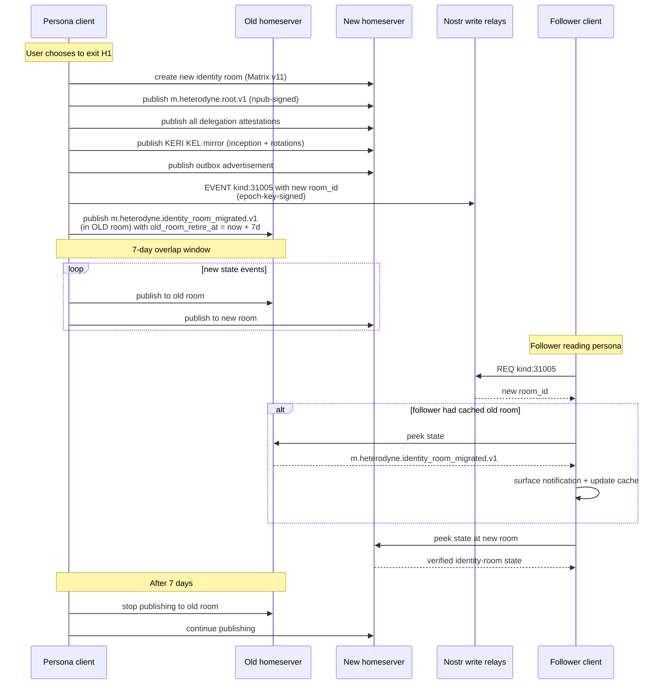

# ADR-015: Voluntary homeserver-exit procedure (identity-room migration)

**Date:** 2026-05-23
**Status:** Accepted
**Decision makers:** Liam Helmer (architect); star-chamber providers: gpt-5 (via Fuel-IX, two-instance parallel review); local Claude subagent

## Context

The Heterodyne v0.2.0 spec describes the identity room as "disposable" (§3.2 lines 348–368) and correctly specifies the compromise-driven case: a persona may abandon a compromised identity room and publish a fresh `kind:31005` pointer to a new room. §3.7 (lines 898–921) covers failure modes for the cold-root-loss path.

The spec is silent on the **voluntary homeserver-exit** case: a user who wants to move their Heterodyne presence from homeserver H1 to homeserver H2 because H1 is shutting down, raising prices, or being deplatformed. Specific gaps:

1. No procedure for re-publishing identity-room state to a new room ID on H2 — or acknowledgement that this requires re-signing all attestations under the same npub root.
2. No migration pointer mechanism for followers to discover that the persona's identity room moved.
3. No procedure for what private-room members should do when the homeserver hosting their rooms is exiting (the architect chose to defer this with an explicit non-goal).
4. Config-room migration (§3.8) — the architect's design from ADR-009 already handles this via the mutual-membership and failover machinery; this ADR needs to cross-reference rather than redefine.

Homeserver exit is a real operational scenario that defines the practical censorship-resistance of the system. Without a normative exit procedure, users on a shutting-down homeserver effectively lose their identity-room state and follower relationships.

## Decision

Specify the voluntary identity-room migration steps explicitly: create new room on the target homeserver, re-publish all v0.2 identity-room state, publish a new `kind:31005` pointer, publish a migration announcement in the old room, wait for the follower-cache-expiry period before retiring the old room. Config-room migration delegates to ADR-009's existing failover machinery. Private-room migration is an explicit non-goal for v0.2.

## Requirements (RFC 2119)

### Scope and trigger

1. Homeserver-exit is defined as the **voluntary** migration of a persona's identity room (and optionally config rooms) from a source homeserver H1 to a target homeserver H2. The persona retains the same npub root and KERI key event log throughout.
2. This ADR specifies voluntary exit only. Compromise-driven abandonment (cold-root loss, identity-room takeover, etc.) is covered by existing §3.7 procedures and is NOT modified by this ADR.

### Identity-room migration

3. The persona MUST perform the migration steps in this order:
   - (a) Create the new identity room on H2 with the pinned Matrix room version per ADR-002 (v11 as of that ADR).
   - (b) Re-publish all v0.2 identity-room state events to the new room: root attestation (`m.heterodyne.root.v1`), all currently-active delegation attestations (`m.heterodyne.delegation.v1`), the full KERI key event log mirror (`m.heterodyne.keri_inception.v1` and all `m.heterodyne.keri_rotation.v1` events), and the outbox advertisement (`m.heterodyne.outbox.v1`). The npub root signs the root attestation; the current epoch key signs the delegations and outbox per existing §3 conventions.
   - (c) Publish a new `kind:31005` (identity pointer) event with `matrix_identity_room` pointing to the new room on H2. Per NIP-01 replaceable-event semantics, this supersedes the prior `kind:31005`.
   - (d) Publish `m.heterodyne.identity_room_migrated.v1` as a state event in the **OLD** room with shape:
     ```json
     {
       "new_room_id": "!opaque:h2",
       "new_homeserver": "h2",
       "migrated_at": <unix-seconds>,
       "old_room_retire_at": <unix-seconds + 7 * 86400>
     }
     ```
     State key MUST be empty string.
   - (e) Wait one follower-cache-expiry period (RECOMMENDED 7 days, matching `old_room_retire_at`) before ceasing to publish to the old room or leaving the old room's homeserver.

4. The re-publishing in step 3(b) MUST use the existing v0.2 wire formats. Re-publication does NOT count as a new attestation for KERI sequence-number purposes; the KEL is the persona's history, not the room's history, so re-mirroring an inception or rotation event into a new room does NOT increment `s`.

5. During the 7-day overlap window, the persona's clients MUST publish all new state events to BOTH the old and new identity rooms. Followers may be reading either room depending on cache freshness.

### Follower discovery and migration

6. Followers' clients observing `m.heterodyne.identity_room_migrated.v1` in a persona's identity room MUST:
   - (a) Surface a one-time notification to the user: "Persona <npub> has moved to <new_homeserver>." (Optional UX; the protocol-level requirement is just to switch lookup.)
   - (b) Update their cached identity-room reference to the new room ID for any lookup occurring after `migrated_at`.
   - (c) Verify the new `kind:31005` pointer corroborates the migration: the kind:31005 `matrix_identity_room` MUST equal the `new_room_id` from the migration event. If they disagree, the kind:31005 wins (per existing §3.2 authoritative-pointer rule), but the client MUST log the disagreement for security review (consistent with state-downgrade logging per ADR-001 / ADR-007).

### Interaction with kind:31005 race tiebreaker

7. A `m.heterodyne.identity_room_migrated.v1` state event in the OLD room takes precedence over later `kind:31005` events with lower `created_at` than `migrated_at` — the migration is the authoritative signal regardless of stale pointer publication.
8. ADR-009 req 21 (kind:31005 tiebreaker) is unchanged; this ADR adds one additional rule that applies only during a confirmed migration window: between `migrated_at` and `old_room_retire_at`, the migration pointer is authoritative.

### Config-room handling

9. The persona's existing delegated MXIDs MAY remain unchanged during a homeserver exit; the exit is about the identity room, not necessarily the MXIDs. If the persona is also moving an MXID to H2 (e.g., creating a new MXID @persona:h2 with a fresh delegation), the existing ADR-009 mutual-membership and failover machinery handles config-room election: the new MXID's config room is created on H2, peer MXIDs invite it, and active-room failover proceeds normally.
10. If the persona is RETIRING an MXID on H1 as part of the exit, the existing single-MXID revocation procedure (ADR-009 reqs 22–25) applies. The MXID's config room SHOULD be tombstoned (ADR-009 req 13) before revocation to ease cleanup.

### Private rooms — explicit non-goal for v0.2

11. Private rooms (`private_verifiable`, `private_deniable`, `dm_verifiable`, `dm_deniable`) remain bound to the homeserver they were created on. v0.2 does NOT define an export/import mechanism for private-room history or Megolm session keys across homeservers.
12. Users wishing to migrate private-room content to a new homeserver MUST recreate the room on H2, manually re-invite members, and re-share content out-of-band. A future spec version MAY define a private-room migration protocol.
13. Clients SHOULD warn the user during the homeserver-exit flow that private-room history will not be migrated automatically.

### Conflict with KERI rotation

14. A homeserver-exit MAY be combined with a KERI rotation (per ADR-003 `kind:31003`) — for example, the user takes the opportunity to rotate epoch keys when moving servers. The rotation event MUST be published to BOTH the old and new identity rooms during the overlap window per req 5.

## Rationale

Splitting the migration into discrete steps (3a–3e) with the old-room migration announcement (3d) as the load-bearing signal mirrors the pattern already used for `kind:31005` identity pointers: the persona signals the authoritative new location, followers update their caches, and the old location remains valid for a grace window.

The 7-day overlap window (req 5) balances follower-cache freshness (most clients refresh identity-room state daily or weekly) against the operational cost of dual-publishing. Some followers will be offline for >7 days; their next sync will discover the migration via the new `kind:31005`.

The reuse of ADR-009's config-room machinery (reqs 9–10) avoids defining parallel migration semantics for config rooms. The failover and tombstone-and-retry mechanisms in ADR-009 already handle homeserver unreachability; voluntary exit is just a planned version of unreachability.

Deferring private-room migration (reqs 11–13) is a deliberate scope choice. Private-room export requires Matrix room-export semantics, Megolm session key migration, member re-acknowledgement, and consideration of forward secrecy implications (sharing old session keys with the new room weakens forward secrecy). These are substantial design decisions that warrant their own ADR after first-party-client experience.

Allowing the migration to combine with KERI rotation (req 14) reflects operational reality: users often combine "moves" (server, key, identity refresh) into single events for operational convenience.

## Alternatives Considered

### (A) Define a private-room export/import mechanism now
- **Pros:** Complete migration story.
- **Cons:** Requires multi-room Matrix coordination, Megolm session key handling, forward-secrecy analysis; would expand this ADR to 3-4x current size.
- **Why rejected:** Deferred as explicit non-goal per req 11.

### (B) Skip the migration state event in the old room (rely only on new kind:31005)
- **Pros:** Smaller wire-format change.
- **Cons:** Followers reading the old room (e.g., during peek per ADR-001) get no signal that the room is being retired; they'd see a stale identity room until their next kind:31005 fetch.
- **Why rejected:** The old-room migration announcement is the cheap, in-band signal that costs nothing and aids followers.

### (C) Shorter overlap window (e.g., 24 hours)
- **Pros:** Faster migration completion.
- **Cons:** Offline-for->24-hours followers would experience identity-room invalidity.
- **Why rejected:** 7 days matches typical follower-sync cadence.

### (D) Mandatory MXID migration alongside identity-room migration
- **Pros:** Bundles the operations.
- **Cons:** Forces the user to relocate Matrix accounts when only the identity room needs to move.
- **Why rejected:** Identity room and MXIDs are independently movable.

## Assumed Versions (SHOULD)

- Matrix room version: v11 (per ADR-002).
- NIP-01 replaceable-event semantics: stable.
- ADR-002 (Heterodyne-only private rooms, Matrix v11 pin): foundational.
- ADR-009 (multi-homing config rooms): config-room migration delegates to ADR-009 machinery.

## Diagram

Identity-room migration sequence.

<details><summary>Mermaid source</summary>



</details>

## Consequences

- New normative subsection (§3.10 or §10.6): voluntary homeserver-exit procedure.
- New state event type: `m.heterodyne.identity_room_migrated.v1`.
- §3.2 (authoritative kind:31005 pointer) cross-referenced for migration-period precedence.
- ADR-009 mutual-membership and failover machinery cross-referenced for config-room handling.
- ADR-003 KERI: re-publishing the KEL mirror to the new identity room does NOT increment KERI sequence numbers (req 4 clarification).
- Test vectors required (per ADR-011, SKIPPABLE for read-only clients): `homeserver-exit/identity-room-migration`, `homeserver-exit/migration-pointer-precedence`, `homeserver-exit/keri-rotation-during-exit`.
- Private-room migration explicitly deferred; user UX must warn appropriately (req 13).
- First-party client implementation: identity-room export, migration UX, follower-cache invalidation logic.

## Council Input

Star-chamber's review did not surface specific concerns with the homeserver-exit synthesis. The procedure is operationally clean and leverages existing ADR-002 (room v11) and ADR-009 (config-room failover) machinery cleanly. The private-room non-goal was unchallenged.
