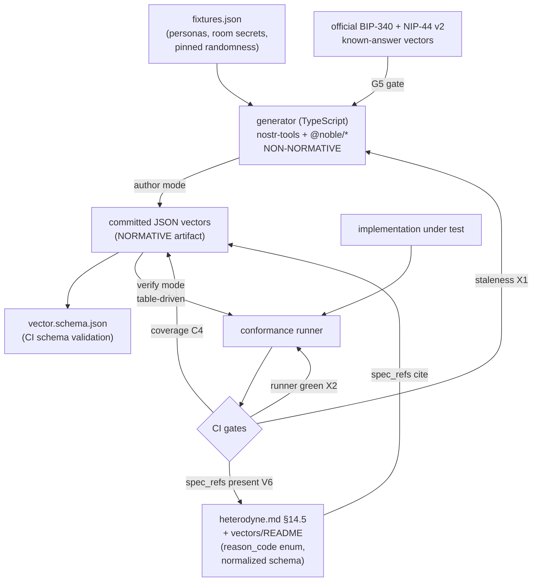

# ADR-024: Conformance test-vector suite — authoring model, schema, and reproduction

**Date:** 2026-05-25
**Status:** Accepted
**Decision makers:** liam.helmer (maintainer) + star-chamber (gemini-3.1-pro, gpt-5.4) + codex (gpt-5) council seat

> **Superseded in part (2026-07-31, ADR-037).** The F1 room-secret fixture,
> E1/E2 room-secret-to-HKDF-to-NIP-44 and Matrix-room context requirements,
> and related fixture/diagram claims are retired. The generator, schema,
> deterministic crypto, independent KAT, coverage, and runner architecture
> remain accepted. During 0.x, ADR-037 permits stale current vector retirement;
> current IDs are not immutable until 1.0.

## Context

The spec §14.3 defines an exhaustive vector coverage map (~22 categories) and
`docs/spec/vectors/README.md` defines the per-file JSON shape, but **no vector
files have been authored**. §14.2 is absolute: "No tolerance is permitted.
'Close enough' semantic equivalence is not conformance." A `produce` vector
must therefore carry the **real wire bytes**, and a conformant client must
regenerate them byte-identically.

Every Heterodyne primitive is deterministic *iff all randomness is pinned*:
SHA-256 event ids over the NIP-01 canonical array (§3.0.1), BIP-340 Schnorr
signatures (aux_rand-dependent bytes), HKDF-SHA256 room/post/index key
derivation (§6.7.4, §6.10), and NIP-44 v2 symmetric encryption (nonce-dependent
bytes). Megolm transport ciphertext is **not** reproducible and is out of
scope. Hand-authoring a valid Schnorr signature or NIP-44 ciphertext is
infeasible, so byte-exact vectors require **running real crypto** over pinned
fixtures.

This ADR fixes the authoring model, the vector file schema, the determinism
and reproduction policy, the consume-vector runner contract, and the spec
amendments needed to make the suite normative and auditable across the 0.x
lifetime. It does not change any wire format; it is conformance-tooling scope.

## Decision

1. **Executable corpus via a non-normative generator.** A TypeScript
   generator (`nostr-tools` + `@noble/curves`/`hashes`/`ciphers`) computes the
   byte-exact outputs from pinned fixtures, re-verifies them, and doubles as
   the conformance **runner**. The committed JSON vectors are the single
   normative artifact; the generator is explicitly non-normative tooling.

2. **Full coverage.** Author every §14.3 category — the 17 baseline-mandatory,
   the 2 strict-mode, the 2 skippable (`encryption/mls-migration/`,
   `homeserver-exit/`), and the 3 OPTIONAL feature categories (`redundancy/`,
   `social-recovery/`, `relay-profile/`).

3. **Hybrid fixtures.** A shared `fixtures.json` defines named personas
   (cold-root + epoch keypairs), room ids, room secrets, and the pinned-
   randomness policy. Each category gets its own keyset; each vector inlines
   every byte needed to run standalone.

4. **Formal consume contract.** `expected_output` for `consume` vectors is
   `{verdict, reason_code, normalized?, warnings?}` with a closed `reason_code`
   enum and a normalized view limited to protocol-visible facts.

5. **Versioned, immutable vectors.** Each file carries `spec_version`,
   `vector_schema_version`, `spec_refs`, and an immutable `vector_id`; an
   incompatible behavior change mints a new `vector_id` rather than overwriting.

6. **Canonical comparison.** `produce`/`round-trip` `expected_output` stores
   both the exact canonical wire string and the decoded object; conformance
   compares canonical bytes, never pretty-printed JSON. Round-trip byte-identity
   applies **only to the NIP-01 canonical event serialization**, never relay
   framing or echo.

7. **Spec amendment.** Add a §14.5 "Vector reproduction and schema" subsection
   to `heterodyne.md` and expand `vectors/README.md` with the reason_code enum,
   normalized-view schema, determinism policy, and the runner contract.

Council review (integrated below) further requires explicit transport scope,
a bounded table-driven runner, and an independent crypto cross-check.

## Requirements (RFC 2119)

### Generator and runner

- **G1.** The repository MUST contain a generator under
  `docs/spec/vectors/generator/` written in TypeScript, depending only on
  audited libraries (`nostr-tools`, `@noble/curves`, `@noble/hashes`,
  `@noble/ciphers`), that computes every cryptographic output in the suite.
- **G2.** The generator MUST be documented as **non-normative tooling**; the
  committed JSON vector files MUST be the sole normative artifact. An
  implementation MUST NOT be required to use the generator, TypeScript, or any
  named library to claim conformance.
- **G3.** The generator MUST provide an `author` mode (compute outputs and
  write vector files) and a `verify` mode (the conformance runner).
- **G4 (table-driven runner — anti-shadow-spec).** The `verify` runner MUST be
  table-driven: it parses each vector, feeds `input` to the implementation
  under test, and compares the implementation's result against the vector's
  declared `expected_output` and (where present) `decision_trace`. The runner
  MUST NOT embed normalization, bridge/routing, moderation, or policy logic
  beyond mechanical schema validation and byte comparison. The spec — not the
  runner — is the normative source.
- **G5 (independent crypto cross-check).** The generator MUST gate its own
  correctness against external known-answer vectors before its outputs are
  trusted: it MUST reproduce the official BIP-340 test vectors and the official
  NIP-44 v2 test vectors, and CI MUST fail if either gate fails. Generator
  output MUST be reviewed as a committed artifact, never accepted solely
  because CI regenerated it.

### Coverage

- **C1.** This pass MUST author at least one vector for every category in the
  §14.3 coverage map, including `redundancy/`, `social-recovery/`, and
  `relay-profile/`.
- **C2.** Each baseline-mandatory category MUST contain vectors covering every
  behavior enumerated for it in §14.3 (e.g. `verification/` MUST include
  bad-sig, delegation-mismatch, revoked-key-post-revocation, and backdated-
  event cases).
- **C3.** Each `produce`/`round-trip` category whose behavior is reproducible
  MUST include real crypto bytes; categories that are purely logical (e.g.
  `bridge/` index-update outcomes, `room-kind/` mapping, `versioning/`
  tolerance) MAY be `consume`-only and require no live crypto.
- **C4.** CI MUST fail if any §14.3 category directory is empty or missing.

### Fixtures and determinism

- **F1.** A `docs/spec/vectors/fixtures.json` MUST define named personas
  (cold-root pubkey + private key, epoch keypairs), Matrix room ids, room
  secrets with `key_id`s, and the pinned-randomness policy.
- **F2.** Distinct vector categories MUST use distinct keysets by default, so a
  fixture change in one category cannot silently alter another.
- **F3.** Every vector MUST inline (or reference by id into `fixtures.json`)
  all bytes required to execute it standalone; a runner MUST NOT need any
  input not present in the vector plus the referenced fixtures.
- **F4 (signing determinism).** All BIP-340 signatures in the suite MUST be
  produced with `aux_rand` = 32 zero bytes. Conformance for `produce` vectors
  is defined against signatures produced with this fixed `aux_rand`.
- **F5 (encryption determinism).** Every NIP-44 v2 nonce MUST be pinned and
  carried explicitly in the vector `input` so a consumer can reproduce the
  ciphertext; nonces MUST NOT be generated randomly at author time.
- **F6 (time determinism).** Every vector whose verdict depends on time
  (delegation expiry/revocation windows, ±5-minute root-attestation skew,
  KERI authority-at-`created_at`) MUST carry a `simulated_clock` value that the
  runner uses as "now"; verdicts MUST NOT depend on wall-clock time.
- **F7.** `created_at` values MUST be fixed constants (a documented
  `TEST_EPOCH` plus per-vector offsets), never generated at author time.

### Vector file schema

- **S1.** Every vector file MUST contain: `vector_id` (immutable),
  `vector_schema_version`, `spec_version`, `spec_refs` (array of spec section
  ids), `description`, `direction` (`produce`|`consume`|`round-trip`),
  `input`, `expected_output`, and MAY contain `fixtures`, `simulated_clock`,
  `decision_trace`, `transport_context`, and `notes`.
- **S2.** `vector_id` MUST be immutable for the life of the vector; an
  incompatible behavior change MUST mint a new `vector_id` (the prior vector is
  retired or superseded), and MUST NOT silently overwrite the prior assertion.
- **S3.** A JSON Schema at `docs/spec/vectors/schema/vector.schema.json` MUST
  define the file shape, and CI MUST validate every vector against it.

### Consume contract

- **V1.** `consume` `expected_output` MUST be
  `{verdict: "accept"|"reject", reason_code?, normalized?, warnings?}`.
- **V2.** On `reject`, `reason_code` MUST be present and MUST be a member of the
  closed enum defined in `vectors/schema/reason-codes.md`, seeded from the
  §4.5 reject reasons and extended per section.
- **V3 (reason_code is test vocabulary).** `reason_code` is a diagnostic/test
  identifier, NOT a normative wire API; implementations MUST NOT be required to
  emit these strings on the wire. The runner maps an implementation's rejection
  to the expected `reason_code`.
- **V4 (precedence).** When an input would fail multiple checks, the expected
  `reason_code` MUST be the first failing check in the §4.5 evaluation order
  (cheapest checks first). This makes multi-fault `consume` vectors
  deterministic across conforming implementations.
- **V5 (normalized scope).** `normalized` MUST contain only protocol-visible
  facts (e.g. event id, pubkey, kind, content/tags or their digest, room kind,
  persona cold-root, delegation/index-update effect). It MUST NOT encode
  client-internal data structures.
- **V6 (spec-traceability).** Every distinct `reason_code` and every
  `normalized` field name MUST cite the spec section it derives from (in
  `reason-codes.md` and the schema respectively), and CI MUST fail on any
  `reason_code` or `normalized` field lacking a citation.

### Produce / round-trip contract

- **P1.** `produce`/`round-trip` `expected_output` MUST store both the exact
  canonical wire string (the NIP-01 serialization that was hashed; the NIP-44
  payload string for encrypted cases) and the decoded object, plus the derived
  `id` and `sig` where applicable.
- **P2.** Conformance for `produce`/`round-trip` MUST be evaluated by comparing
  canonical bytes, never re-serialized/pretty-printed JSON.
- **P3 (round-trip surface).** A `round-trip` vector MUST declare a
  `comparison_surface`, and byte-identity MUST be asserted only over the NIP-01
  canonical event serialization (the bytes producing `id`/`sig`) — never the
  relay WebSocket frame, the `["EVENT", ...]` envelope, or a relay's echoed
  bytes. Publication-acceptance and retrieval-equivalence MUST be separate
  assertions from byte-identity.
- **P4 (relay-mutation vectors).** `interop/` MUST include `consume` vectors in
  which a relay reordered object keys, escaped Unicode/slashes, altered
  insignificant whitespace, or changed numeric formatting, asserting the
  verifier hashes `nip01_raw` directly and yields `nip01_raw_mismatch` (or
  accepts via the canonical bytes) rather than re-serializing the parsed object.

### Encryption and transport scope

- **E1 (opaque Megolm, explicit negative scope).** Vectors in `broadcast/`,
  `index/`, and `encryption/` MUST state that they do NOT validate Matrix /
  Megolm wire behavior (session rotation, sender-key/device trust, replay,
  withheld keys, history visibility, redaction, Matrix event authorization);
  they test the **decrypted payload** and the room-secret→HKDF→NIP-44 chain.
- **E2 (context-binding vector).** Each encrypted category MUST include at
  least one vector proving the decrypted payload is bound to the expected
  room/event context — i.e. that `key_id`→room-secret→`post_key`/`index_key`
  derivation is tied to the correct `matrix_room_id` salt — not merely that the
  ciphertext decrypts to well-formed JSON.
- **E3 (transport adapter boundary).** `vectors/README.md` MUST define the
  Matrix→protocol adapter hand-off contract (Matrix event type, room id, sender
  MXID, event id / `origin_server_ts` where used, decrypted cleartext field,
  and the permanent/transient failure predicates of §6.4.1), and the
  transport-sentinel vectors MUST target that boundary.
- **E4 (strict vs base surfaces).** For each `*/strict-mode/` category, vectors
  MUST pair the base-mode outcome (typically `{accept, warnings:[...]}`) with
  the strict-mode outcome (`{reject, reason_code}`) for the same input, so
  `warnings[]` is bounded and the strict delta is explicit.

### Versioning, CI, and documentation

- **X1.** CI MUST regenerate all crypto-bearing vectors to a scratch location
  and fail if the committed bytes differ (staleness gate).
- **X2.** CI MUST run the `verify` runner over the full suite and fail on any
  mismatch.
- **D1.** `heterodyne.md` MUST gain a §14.5 "Vector reproduction and schema"
  subsection covering the `aux_rand`/nonce/`simulated_clock`/`created_at`
  pinning policy, `vector_schema_version` + `vector_id` immutability, and
  pointers to the reason_code enum and normalized schema.
- **D2.** `vectors/README.md` MUST be expanded with the full vector schema, the
  closed reason_code enum, the normalized-view schema, the transport adapter
  boundary, and the determinism policy.

## Rationale

§14.2's zero-tolerance rule forces real bytes, which forces a generator; the
nostr ecosystem's audited `@noble`/`nostr-tools` stack already passes the
official NIP-44 v2 vectors, minimizing the risk that the generator itself is
wrong (further guarded by G5's external KAT gate). Keeping the JSON normative
and the generator non-normative preserves the spec's implementation-agnostic
stance. The hybrid fixture model and immutable `vector_id`s keep the suite
DRY, reviewable, and auditable across 0.x churn. The table-driven runner plus
mandatory `spec_refs` is the council's key safeguard against the suite quietly
becoming a second normative implementation that drifts from the prose spec.

## Alternatives Considered

### Data-only vectors (no generator)
- Pros: keeps the repo code-free; preserves implementation-agnostic posture.
- Cons: cannot satisfy §14.2 byte-identical `produce` for any signed/encrypted
  category; pushes the hardest interop problems onto implementers.
- Why rejected: byte-exact crypto cannot be hand-authored; coverage would be
  fundamentally incomplete.

### Python or Rust generator
- Pros: broader install base (Python); strong determinism (Rust).
- Cons: no turnkey NIP-44 v2 in Python (hand-glued ChaCha20+HMAC, error-prone);
  Rust adds the heaviest toolchain to a code-free repo.
- Why rejected: TypeScript+noble is the idiomatic Nostr stack with a NIP-44 v2
  that already passes the official vectors.

### Full transport-normative vectors (include Megolm artifacts)
- Pros: maximal end-to-end coverage of encrypted flows.
- Cons: Megolm ciphertext is non-reproducible; brittle against Matrix-stack and
  library churn; turns the suite into a Matrix-crypto test rather than a
  Heterodyne-conformance test.
- Why rejected: incompatible with the determinism model; replaced by opaque
  Megolm + explicit negative scope + transport-sentinel + context-binding
  vectors (E1–E3).

### Free-form `expected_output` / verdict-only consume
- Pros: fastest to start.
- Cons: reject reasons fragment; negative (MUST NOT) tests become weak and
  non-comparable across implementations.
- Why rejected: undermines the value of the suite for the 70 MUST NOT clauses.

## Assumed Versions (SHOULD)

- Node.js: 22 LTS — generator runtime
- TypeScript: 5.x
- `nostr-tools`: 2.x — NIP-01 + NIP-44 v2 reference
- `@noble/curves`: 1.x (secp256k1 / BIP-340 schnorr)
- `@noble/hashes`: 1.x (sha256, hkdf, hmac)
- `@noble/ciphers`: 1.x (chacha20)

## Diagram

<!-- renderer-unavailable: no Kroki/SVG renderer configured; Mermaid source only -->

Mermaid source

## Consequences

- The repo gains a dev-only Node/TypeScript toolchain under
  `vectors/generator/`; the protocol remains language-agnostic.
- `heterodyne.md` §14 grows a §14.5 subsection and `vectors/README.md` is
  substantially expanded (reason_code enum, normalized schema, transport
  boundary, determinism policy).
- A new closed `reason_code` enum becomes a maintained, spec-traced artifact.
- Implementations can run the committed JSON suite in any language; the runner
  is provided as a convenience, not a requirement.
- Follow-on work (phase 2/3): scaffold the generator, author fixtures, then
  author vectors category-by-category, baseline-first within the full-coverage
  goal.

## Council Input

Two independent council seats (star-chamber: gemini-3.1-pro + gpt-5.4; codex:
gpt-5) reviewed the synthesized architecture and converged on the same
load-bearing gaps, all integrated above without relitigating the locked
decisions:

- Make opaque-Megolm scope **explicit** and add a context-binding vector per
  encrypted category (E1, E2); define the Matrix→protocol adapter boundary
  (E3); add transport-sentinel consume vectors.
- **Bound the runner** so it cannot become a shadow spec: table-driven, with
  every `reason_code`/`normalized` field citing a spec section (G4, V6).
- Constrain round-trip byte-identity to the **NIP-01 canonical serialization**
  with an explicit `comparison_surface` (P3); add relay-mutation vectors (P4).
- Add `simulated_clock` for time-dependent verdicts (F6); pin NIP-44 nonces in
  `input` (F5).
- Declare `reason_code` as **test vocabulary** with §4.5-ordered precedence
  (V3, V4) to avoid flaky consume tests.
- Define **strict-vs-base acceptance surfaces** so `warnings[]` is bounded (E4).
- **Independently cross-check** generator output against official KAT vectors
  (G5) so a generator bug cannot fossilize wrong "normative" bytes.
