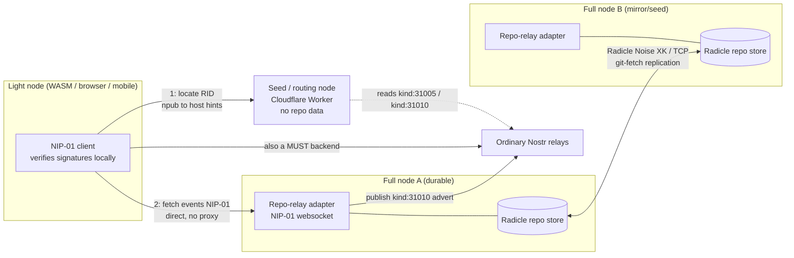

# ADR-026: Radicle-as-core substrate — repo relays and full/seed/light node topology

**Date:** 2026-07-01
**Status:** Accepted
**Decision makers:** user + `/codex:rescue` review (star-chamber unavailable this session — no configured provider had a working API key)

## Context

Through v0.3.0 Heterodyne treated **Matrix as the core transport and
container** and **Nostr as the identity/authenticity layer**. This
buys E2EE, stateful membership, and federated resilience, but it also
makes the persona's durable presence depend on a homeserver, and it
keeps content censorship-resistance limited to what relays provide.

This ADR records a **substrate pivot**: make **Radicle** (peer-to-peer
git, the Heartwood 1.x stack) a first-class publishing/storage
substrate for Nostr events, keep Nostr relays as a co-equal backend,
and demote Matrix to an OPTIONAL layer (ADR-029). The motivation is
stronger censorship resistance (repos replicate P2P by follower/peer
seeding), tiered privacy (ADR-028), organizations/collaboration as a
native primitive (ADR-027), and interest-driven redundancy: peers who
opt to seed a persona's repo thereby mirror its content, so redundancy
scales with interest (opt-in seeding, not automatic
popularity-weighting).

The redesign research (`docs/research/2026-07-01-radicle-nostr-pivot-research.md`)
established the load-bearing constraints that shape this decision:

- A Radicle repo can store arbitrary signed objects and behaves as a
  replicated, signed append log (Collaborative Objects are exactly
  this), so it can hold Nostr events.
- A full Radicle node is a **persistent native daemon speaking Noise
  XK over raw TCP** plus the git wire protocol. **Browsers and mobile
  cannot run a full node** (no raw TCP / WASI sockets); `radicle-httpd`
  gives browsers only read access.
- Replication is **announce-then-fetch via explicit seeding**; there
  is no real-time content push and ephemeral nodes fail to propagate,
  so a durably-connected node is required to publish reliably.

The design therefore cannot put Radicle's native transport in front of
browser/mobile clients. It must expose a browser-native wire and keep
Radicle behind it.

## Decision

**Nostr signed events remain the canonical content unit. A Heterodyne
client MUST be able to read and write those events over two co-equal
backends — ordinary Nostr relays and "repo relays" — and the Radicle
git/replication layer lives entirely behind the repo relay.**

- **Repo relay.** A *repo relay* is a **NIP-01-compatible relay
  endpoint** (the ordinary Nostr websocket wire) served by a full
  node, whose event store is a **Radicle git repository**. At the wire
  level a client cannot distinguish a repo relay from a plain Nostr
  relay; the difference is what is behind it — a Radicle-replicated,
  delegate-signed git store rather than a single relay's database.
  Nostr's Noise-free websocket wire means browser/mobile clients use
  repo relays with no new transport.

- **Three node types.**
  - **Full node** — runs a Radicle node (Noise XK / TCP gossip +
    git-fetch replication) AND a NIP-01 **repo-relay adapter** over its
    repo store. It stores repos, replicates them peer-to-peer, and
    serves events to clients over websocket. Full nodes are the only
    nodes that hold content.
  - **Routing node** (named to avoid collision with Radicle *seeding*,
    which means storing and replicating a repo — a routing node does
    neither). A stripped-down
    node that **does not clone repos**. It answers "which full nodes
    currently serve the repo relay for this npub / RID?" from
    Nostr-native advertisements only (see discovery below), needs no
    Radicle participation, and is therefore runnable in a constrained
    edge runtime (e.g. Cloudflare Workers). It MUST NOT be required to
    proxy content.
  - **Light node** — a client (including WASM/browser) that queries a
    routing node, then connects **directly** to a full node's repo
    relay to fetch content and verifies every event's Nostr signature
    locally. It pulls no content through the routing node, so it need
    not trust the routing node with content.

- **Write path.** Authoring a Nostr event is a client operation
  (secp256k1 publishing key). *Committing that event into a Radicle
  repo* — signing git refs / COBs with an Ed25519 NID — is a
  **full-node operation**: a light node submits its Nostr-signed event
  to a repo relay run by a full node the persona controls (or that
  accepts authenticated writes), and the full node persists it under
  its delegate NID. Event authenticity is the Nostr signature (verified
  by all readers); the git-ref signature is storage attestation, not
  authorship. A device that cannot run a full node therefore needs no
  NID of its own (ADR-027) and relies on a persona-controlled full node
  for repo writes; until a client-signed Radicle change envelope is
  specified, browser-only devices MUST NOT be assumed to write Radicle
  refs directly.

- **Event storage layout.** Nostr events live in the repo under a
  reserved Heterodyne namespace (`refs/cobs/xyz.heterodyne.*` for
  collaborative objects such as threads; an event-id-addressed
  append-log ref layout for a persona's own outbox). The concrete ref
  namespace, COB type registry, NIP-01 filter→git-read mapping, and
  retention/GC/quota rules are normative spec work (§10) and MUST be
  fixed before repo relays are declared conformant; Radicle's fetch
  size limits (special-refs and data-refs caps) bound per-fetch size.

- **Discovery.** The `kind:31005` identity pointer is repurposed from
  "npub → Matrix room" to **"npub → Radicle Repository ID (RID) + host
  hints"** (cold-root/epoch-signed as today). A new
  **`kind:31010` node/repo advertisement** (from the reserved
  31010–31099 range) maps an RID to the network addresses of full
  nodes currently serving its repo relay. Each advertisement is
  **signed by the advertising full node's Ed25519 NID**, carries the
  RID, the reachable endpoint(s), an **expiry**, and a **proof the node
  actually holds the repo** (e.g. a signed statement over the current
  canonical head); routing nodes aggregate these and MUST drop expired
  or unverifiable ads. Clients treat ads as hints only and verify
  content independently.

- **Equivalence and ordering.** The two backends are interchangeable
  *sources* of the same event: the Nostr event `id` (sha256 of the
  serialized event) is the dedup key, and the `kind:31007` feed index
  remains the canonical **ordering/curation authority** regardless of
  which backend served a post. The `kind:31007` index is itself
  published to both backends.

- **Trust decomposition.** Content integrity rests on Nostr
  signatures, not on infrastructure: a routing node sees *which* repos a
  client asks about (a metadata leak) but never content, so it cannot
  tamper; a full node cannot forge events (they are npub-signed and
  client-verified) and can only withhold, which a light node routes
  around using other hosts from the routing node's list and the Nostr-relay
  backend.

## Requirements (RFC 2119)

- A conforming client MUST implement reading and writing Nostr events
  over **repo relays** (NIP-01 wire, git-backed) and MUST implement
  reading and writing Nostr events over **ordinary Nostr relays**. It
  SHOULD implement Matrix for discussion/DMs/calls/encrypted rooms
  (ADR-029).
- A repo relay MUST present the NIP-01 websocket wire and MUST NOT
  require any client to speak Radicle's Noise XK / TCP transport or the
  git wire protocol. All Radicle replication MUST be confined to
  full-node-to-full-node communication.
- A repo relay MUST persist an accepted event as a signed object in its
  backing Radicle repository and MUST reject events whose Nostr
  signature does not verify.
- A full node MUST verify that a repo's canonical refs are
  delegate-signed (Radicle `rad/sigrefs` + identity-document threshold)
  before serving events derived from them, and MUST namespace
  non-delegate contributions per Radicle's signed-ref model.
- A seed/routing node MUST answer repo-location queries using only
  Nostr-native advertisements (`kind:31005`, `kind:31010`) and MUST NOT
  be required to store repository content or participate in Radicle
  gossip. A routing node MAY offer an optional content cache, which MUST
  NOT be on the integrity path.
- A light node MUST fetch content directly from full-node repo relays
  (or Nostr relays), MUST NOT be required to fetch content through a
  routing node, and MUST verify each event's Nostr signature locally
  before display or storage.
- Clients MUST deduplicate events observed across backends by Nostr
  event `id`, and MUST treat the persona's current `kind:31007` feed
  index as the ordering/curation authority irrespective of which
  backend served an event.
- The `kind:31005` identity pointer MUST carry the persona's canonical
  RID and MAY carry full-node host hints; it MUST remain
  cold-root/epoch-signed per §3.2/§3.5. A persona MUST publish its
  `kind:31005` pointer to Nostr relays and SHOULD mirror it into its
  identity repo.
- Full nodes serving a persona's repo relay SHOULD publish a
  `kind:31010` advertisement so routing nodes can route to them. A
  `kind:31010` advertisement MUST be signed by the advertising node's
  Ed25519 NID and MUST carry the RID, reachable endpoint(s), an expiry,
  and a proof of repo possession (a signature over the current
  canonical head); routing nodes MUST discard expired or unverifiable
  advertisements, and clients MUST treat advertisements as hints and
  verify content independently of routing.
- Signing Radicle refs/COBs is a full-node operation: a light node
  MUST author Nostr events with its secp256k1 publishing key and submit
  them to a persona-controlled (or authenticated-write) repo relay for
  commitment; browser-only devices MUST NOT be assumed to sign Radicle
  refs directly until a client-signed Radicle change envelope is
  specified. Event authenticity MUST rest on the Nostr signature, not
  on the git-ref signature.
- A persona MUST be reachable through at least one durably-connected
  full node for its content to replicate reliably (ephemeral nodes do
  not propagate); a client SHOULD warn when a persona has no advertised
  durable host.

## Rationale

Keeping the Nostr event as the canonical unit preserves the project's
identity/portability value and vanilla-Nostr interop while letting git
add durability and censorship resistance. Exposing the repo relay as an
unchanged NIP-01 wire is the single move that dissolves the
browser/mobile blocker: the raw-TCP/Noise-XK constraint lives only
between full nodes, never in a client. The seed/light split is what
makes the trust story better than the old blind-homeserver model rather
than worse — the routing tier is stripped of content and the content
tier is stripped of authority (signatures do the work), so neither is a
single trusted point.

## Alternatives Considered

### Git replaces Nostr relays (single content plane in git)
- Pros: least duplication; one store.
- Cons: loses real-time and cheap mobile interaction; kills vanilla-Nostr
  interop; forces browser clients through an httpd gateway for
  everything.
- Why rejected: user chose two co-equal MUST backends (Q2); relays are
  the mobile-native real-time layer Radicle structurally lacks.

### Browser participates in Radicle replication (WS/WebRTC→TCP bridge carrying Noise XK)
- Pros: preserves a pure no-infrastructure vision.
- Cons: does not exist; large protocol/engineering lift; still needs a
  bridge server; no benefit over a NIP-01 repo relay for a social client.
- Why rejected: strictly dominated by the repo-relay adapter.

### Seed node participates in Radicle inventory gossip to build routing
- Pros: authoritative routing table.
- Cons: requires Noise XK / TCP, so it cannot run in an edge/Worker
  runtime; defeats the stripped-down goal.
- Why rejected: routing from Nostr advertisements keeps the routing node
  edge-deployable and off the content path.

## Assumed Versions (SHOULD)

- Radicle / Heartwood: 1.9.x ("Hawthorn", 2026-05) — identity doc,
  signed refs, canonical reference rules (`xyz.radicle.crefs`), private
  repos.
- `radicle-cob`: 0.20.x — Collaborative Objects (on-ref/on-disk format
  is the stable contract, not the crate API).
- Nostr: NIP-01 (events/relay wire), NIP-65 (relay lists), NIP-10 /
  NIP-25 (threading/reactions), NIP-34 referenced as prior art for
  git-over-Nostr.
- Transport constants (informative, from Heartwood source): Noise XK,
  TCP :8776, gossip ~6 s, target ~8 outbound peers, `.onion` via SOCKS5.

## Diagram

<!-- renderer unavailable: Mermaid source only -->

Mermaid source

## Consequences

- Introduces three normative node roles and a new relay flavor; the
  bridge/client-model section (§10) and discovery section (§7) are
  rewritten, and the conformance vectors (§14) must cover the repo-relay
  wire, seed routing, and light-node signature verification.
- `kind:31005` semantics change (room → RID + hosts) and `kind:31010`
  is newly allocated; the kind table (§4/§ event registry) is updated.
- Adds several Radicle/repo-relay threat surfaces to the model (§13):
  routing-node query metadata (which repos a client wants), full-node
  read metadata (who fetched what and when), private-repo
  membership-graph leakage (the allow list), request timing, storage
  exhaustion, and selective withholding/censorship by a full node.
  These are bounded by the trust decomposition (rotate/self-host
  routing nodes; multiple hosts + Nostr-relay fallback; signatures for
  integrity) but each needs an explicit mitigation entry.
- Redundancy is **opt-in seeding**, not automatic popularity-weighted
  replication: a repo is mirrored by exactly the set of peers who
  *choose* to seed it (Radicle has no "replicate because it's
  trending" mechanism). In practice followers seeding accounts they
  follow yields redundancy that scales with interest, but the client
  MUST surface host-count and durable-host warnings rather than assume
  it. ADR-020's mirroring model is reframed as this opt-in Radicle
  seeding rather than Matrix room replication.
- Onion reachability (ADR-019) extends to repo relays, routing nodes, full
  nodes, and Nostr relays; see the versioning/migration note in ADR-029
  and the security follow-ups.

## Council Input

Star-chamber was unavailable this session (no configured provider had
a working API key). Per user direction, architecture review ran via
`/codex:rescue`. Its blocking and should-fix findings were integrated
into this ADR set before acceptance — for ADR-026: the full-node-only
Radicle write path, the `kind:31010` signed/expiring advertisement
with repo-possession proof, the routing-node rename (vs Radicle
seeding), the reframing of redundancy as opt-in seeding, the reserved
event-storage namespace, and the expanded repo-relay threat surfaces.
