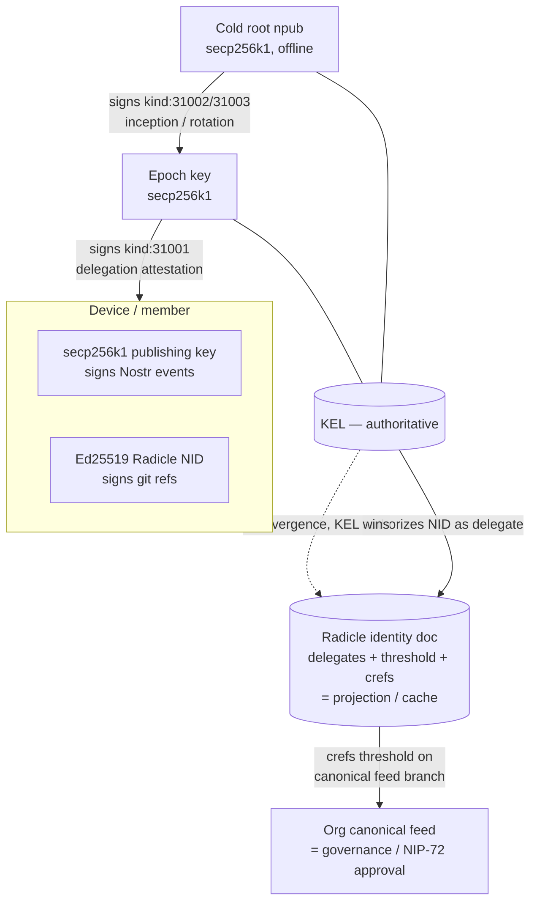

# ADR-027: KERI ↔ Radicle identity reconciliation, and organizations as first-class personas

**Date:** 2026-07-01
**Status:** Accepted (partially superseded by ADR-032: for the key-material class {31002, 31003, 31001}, relay-primary discovery and SHOULD-level repo mirroring are replaced by repo authority, spec §3.9.10.1)
**Decision makers:** user + `/codex:rescue` review (star-chamber unavailable this session)

## Context

ADR-026 makes Radicle repos a core substrate. Radicle has its own
identity model — a repo **identity document** (Canonical JSON with
`delegates` + `threshold` + `payload`, exposed at `refs/rad/id` and
managed through Radicle's `id` mechanism; the exact COB-vs-special-ref
storage detail is verified before any normative dependence) whose
**delegates are Ed25519 Node IDs (NIDs)**, plus per-ref-pattern
**canonical reference rules** (`xyz.radicle.crefs`, each with an
`allow` set of DIDs or the keyword `"delegates"` and a `threshold`).
The `crefs` semantics are load-bearing for org governance and MUST be
independently verified against the target Heartwood release before the
spec depends on them normatively. Crucially, Radicle **has no
native key rotation and no multi-device identity** — each device is its
own NID, and a lost key means a new NID.

Heterodyne's identity is a Nostr `secp256k1` npub anchored by a KERI
cold root with rotating epoch keys, and a **`kind:31001` delegation
attestation** already authorizes delegated publishers (through v0.3.0,
Matrix MXIDs). Radicle uses Ed25519; Nostr uses secp256k1/Schnorr;
there is no algebraic relation between the curves, so any binding must
be by attestation. KERI is curve-agnostic (pre-rotation commits to a
digest of the next key), which makes it the natural anchor for both key
types.

Two questions must be answered together: (1) how the KERI key event log
(KEL) and the Radicle identity document stay reconciled without
inheriting Radicle's no-rotation weakness, and (2) how
"organizations and collaboration as first-class" is expressed, given a
published Nostr event carries exactly one Schnorr signature.

## Decision

**The KEL stays the single authority for all key lifecycle; the Radicle
identity document is a derived projection of it. An organization is a
first-class persona whose repo delegates and `crefs` thresholds encode
shared publishing authority; a plain user is the one-delegate degenerate
case.**

- **KEL-authoritative, identity-doc-projected.** Root inception and
  rotation remain cold-root-signed `kind:31002/31003`; delegations
  remain epoch-key-signed `kind:31001`. The `kind:31001` delegation
  attestation is **extended to target an Ed25519 Radicle NID** (in
  addition to its existing publisher-target semantics). A device's NID
  becomes a Radicle **delegate** only after a valid `kind:31001`
  authorizes it. The Radicle identity-doc `delegates` set is a cache of
  currently-authorized NIDs; **on any divergence, clients trust the
  KEL** — a KEL revocation invalidates a delegate even if the identity
  doc still lists it.

- **Two keys per device.** A device carries a **secp256k1
  publishing/epoch key** (signs the actual Nostr events, preserving
  vanilla-Nostr interop and single-signature validity) and an **Ed25519
  Radicle NID** (signs git refs and participates in replication). One
  `kind:31001` attestation binds both to the persona.

- **Org = first-class persona.** An organization has its own npub +
  KERI cold root and a content/identity repo whose **delegates are the
  member/admin device NIDs**, with `crefs` rules encoding governance
  (e.g. the canonical feed branch requires M-of-N admin sign-off, while
  each member's own namespace branch needs only that member). A plain
  user is the same model with one delegate and threshold 1, so "user"
  and "org" share one identity model.

- **Dual-authorized membership.** A member keeps their own separate
  persona. Adding their device NID to an org requires **both** the
  member's own KEL (proving they control the device) **and** the org's
  admin threshold (proving the org admitted them).

- **Single-signature reconciliation.** A published org Nostr event
  carries **one** signature from the **org's epoch key** (vanilla-Nostr
  interop). M-of-N governance lives at the **repo/`crefs` layer**: "the
  org approved this post" is proven by the event being reachable from
  the threshold-signed canonical feed branch, not by a multi-signature
  on the event. True threshold *signing* of the epoch key (FROST-style
  secp256k1) is explicitly **deferred as future work**.

- **Two parallel editorial-gating mechanisms, not one folding into the
  other.** `crefs` is *repo governance* (which refs are canonical),
  whereas NIP-72 is an *approval-event* model (`kind:4550`, moderator
  indexes, `kind:5` revocation, as-of evaluation). For Radicle-hosted
  communities Heterodyne defines a native **Radicle editorial-gating
  mode**: a post is editorially approved iff it is reachable from the
  `crefs`-threshold-approved canonical feed branch. For relay-hosted or
  interoperating communities, the existing NIP-72 `kind:4550` flow (§8,
  ADR-014) is retained unchanged. A community MAY use either or both;
  the two are distinct mechanisms answering the same question.

## Requirements (RFC 2119)

- A `kind:31001` delegation attestation MUST be able to authorize an
  Ed25519 Radicle NID as a delegated publisher, and MUST be
  epoch-key-signed per §3.3/§3.5. A device's secp256k1 publishing key
  and its Ed25519 NID MUST both be bound by that attestation.
- NID binding MUST be **bidirectional**: the attestation MUST carry
  both the epoch key's Schnorr signature over the binding payload
  (npub + NID + purpose) AND the NID's Ed25519 signature over the same
  payload (proof the persona controls the NID). Verifiers MUST reject a
  `kind:31001` NID binding lacking either signature.
- A device that cannot run a Radicle full node (e.g. browser-only) MAY
  be authorized with only a secp256k1 publishing key and no NID; its
  repo writes are performed by a persona-controlled full node (ADR-026
  write path). Only devices that participate in Radicle replication
  need an NID.
- A conforming verifier MUST treat the KEL as authoritative over the
  Radicle identity document: a NID absent from, or revoked by, the KEL
  MUST NOT be honored as a delegate even if the identity doc lists it,
  and refs signed by such a NID MUST be rejected.
- A persona SHOULD mirror its KEL (`kind:31002/31003/31001`) into its
  identity repo for durability, and MUST also publish it to Nostr
  relays; the relay-published KEL remains the primary discovery path.
- Adding or removing a device MUST be reflected in both the KEL
  (publish/revoke `kind:31001`) and the Radicle identity document
  (`rad id update` accepted by delegate quorum); clients MUST tolerate
  the identity doc lagging the KEL and MUST resolve using the KEL.
- Delegate-set updates MUST be **add-before-remove**: a replacement NID
  MUST be added to the Radicle delegate set (and reach quorum) before
  the NID it replaces is rescinded, so the identity doc never drops
  below its threshold. If the KEL's live delegates fall below the
  Radicle quorum required to update the identity document (a deadlock,
  since Radicle has no native rotation), the persona MUST re-anchor:
  incept a fresh repo/RID whose delegate set matches the current KEL
  and republish `kind:31005` to point at it. Clients MUST follow the
  cold-root-signed `kind:31005` to the new RID, exactly as for a
  compromised-container migration.
- Published Nostr events (including org events) MUST carry exactly one
  valid Schnorr signature from the signing persona's current epoch key;
  org governance MUST NOT be expressed as a multi-signature on the
  event itself in this version.
- An organization MUST be modeled as a persona with its own npub + KERI
  cold root and a repo whose `delegates`/`threshold`/`crefs` encode its
  governance. A conforming client MUST evaluate org-post canonicity by
  the `crefs` rule on the canonical feed branch (delegate-threshold
  reachability), not by inspecting the event signature alone.
- For an org persona, both the posts AND the `kind:31007` feed index
  MUST be reachable from a `crefs`-approved canonical ref before a
  client treats them as canonical. A single-signature `kind:31007` (or
  post) published to ordinary relays by a lone holder of the org epoch
  key, but NOT reachable from the threshold-approved branch, MUST NOT
  be treated as the org's canonical feed — this is what prevents a
  rogue epoch-key holder from bypassing `crefs` governance via the
  relay backend.
- Adding a member's device NID to an org's delegate set MUST be
  authorized by both the member's KEL and the org's admin threshold;
  either alone MUST be insufficient.
- A client MUST support the Radicle editorial-gating mode (approval =
  `crefs`-reachable on the canonical feed branch) for Radicle-hosted
  communities, and MUST support the NIP-72 `kind:4550` approval flow
  (§8, ADR-014) for relay-hosted/interoperating communities. These are
  distinct mechanisms; a community MAY use either or both, and clients
  MUST NOT treat one as a substitute for the other's semantics.
- A client MAY implement FROST-style threshold signing of an org epoch
  key when available; absent it, clients MUST NOT assume an org event's
  single signature proves multi-party approval — only `crefs`
  reachability does.

## Rationale

Anchoring all rotation/revocation in the KEL means Radicle's lack of
rotation never becomes Heterodyne's problem: the identity doc is a
cache that can lag or be rebuilt from the authoritative KEL. Reusing
`kind:31001` keeps the change minimal — the delegated-publisher slot
that held MXIDs now holds NIDs. Modeling orgs as personas with
`crefs`-governed repos gives genuine first-class organizations using
native Radicle mechanisms and collapses NIP-72 moderation into a repo
rule, while keeping every published event a normal single-signed Nostr
event so vanilla clients and the two-backend model (ADR-026) are
unaffected. Deferring FROST avoids betting the whole org feature on
immature threshold-signature tooling.

## Alternatives Considered

### Radicle identity doc becomes the delegate source of truth
- Pros: single native authority; no double write.
- Cons: reintroduces Radicle's no-rotation/no-multi-device weakness at
  the device layer; two authorities with no tiebreak; Ed25519 root
  cannot sign Nostr events.
- Why rejected: the KEL already solves rotation cleanly (Q1/F4).

### Org identity is threshold-signed (FROST secp256k1) from day one
- Pros: cryptographic multi-party control of the event signature itself.
- Cons: immature secp256k1 FROST tooling; blocks the entire org feature
  on a hard crypto dependency; heavier UX.
- Why rejected: `crefs`-layer governance delivers first-class orgs now;
  FROST is additive later (F5).

## Assumed Versions (SHOULD)

- Radicle / Heartwood: 1.9.x — identity doc, `xyz.radicle.crefs`
  canonical reference rules (introduced 1.3.0, symbolic refs 1.9.0).
- KERI: curve-agnostic profile per §3.5; CESR derivation codes name the
  cipher suite (Ed25519 `B`/`D`/`0B`, secp256k1 `1AAA`/`1AAB`/`0C`).
- Nostr: NIP-01 (single-signature events), NIP-72 (moderated
  communities, interop), NIP-39 (external-identity binding pattern for
  NID ↔ npub attestation).

## Diagram

<!-- renderer unavailable: Mermaid source only -->

Mermaid source

## Consequences

- §3.3 (delegations) and §3.5 (KERI) are amended so `kind:31001`
  targets Ed25519 NIDs and defines the two-keys-per-device binding;
  §3.9's identity-reconciliation rules gain the KEL-over-identity-doc
  precedence.
- The room taxonomy's moderation story (§8, ADR-014/017) gains a
  Radicle-native path: NIP-72 approval as a `crefs` threshold; the
  relay-only `kind:4550` path is retained for interop.
- Unifying user and org means the spec must handle threshold>1 personas
  throughout; conformance vectors (§14) add org membership, `crefs`
  canonicity, and KEL/identity-doc divergence cases.
- A residual risk is recorded: because an org epoch key is
  operationally held pending FROST, a rogue key-holder can sign an
  event, but it is non-canonical unless it also clears the `crefs`
  threshold on the feed branch; documented in the threat model with
  FROST as the eventual mitigation.

## Council Input

Star-chamber unavailable this session; review via `/codex:rescue` per
user direction. Blocking/should-fix findings integrated before
acceptance — for ADR-027: bidirectional NID proof-of-possession, the
add-before-remove ordering plus emergency re-inception path for the
KEL/identity-doc deadlock, the org `kind:31007` `crefs`-reachability
rule that closes the rogue-epoch-key relay bypass, the reframing of
NIP-72 and `crefs` as two parallel editorial-gating mechanisms, the
NID-optional light-device clarification, and softened identity-doc
storage wording pending Heartwood-release verification.

## Verification addendum (2026-07-05)

Empirically verified against `rad`/`radicle-node` 1.9.1 and the
Heartwood source at tag `releases/1.9.1`, closing the assumptions this
ADR left open pending verification:

- **Identity-doc storage form** (Context, "the exact COB-vs-special-ref
  storage detail is verified before any normative dependence").
  Verified: the identity document is a `xyz.radicle.id` COB; `refs/rad/id`
  is a local per-node convenience pointer to that COB's tip, not a
  second, independent storage form.
- **`rad id update` / delegate-quorum mechanism** (Requirements, "the
  Radicle identity document (`rad id update` accepted by delegate
  quorum)"; the add-before-remove deadlock rule). Verified: revisions to
  the identity doc (delegate, threshold, or payload changes) are adopted
  once a **majority** of the live delegate set signs via `rad id accept`
  - the document's own `threshold` field governs `defaultBranch`/`crefs`
  canonical-ref acceptance, not its own revisions. These are now named as
  two distinct mechanisms so the ADR's "quorum" language is not read as
  the same thing as the `threshold` field. No force/override/emergency
  path exists in 1.9.1, confirming the ADR's re-anchor escape (fresh
  RID + cold-root `kind:31005`) as the only way out of a below-majority
  deadlock.
- **`crefs` semantics** (Context, "the `crefs` semantics are load-bearing
  for org governance and MUST be independently verified against the
  target Heartwood release before the spec depends on them normatively").
  Verified: `xyz.radicle.crefs` per-ref canonical rules are fully
  implemented and CLI-documented in 1.9.1. Promoted from "must be
  verified" to "verified, still OPTIONAL" - baseline org canonicity
  (the `defaultBranch` delegate-threshold rule) intentionally does not
  depend on it, unchanged from this ADR's decision.
