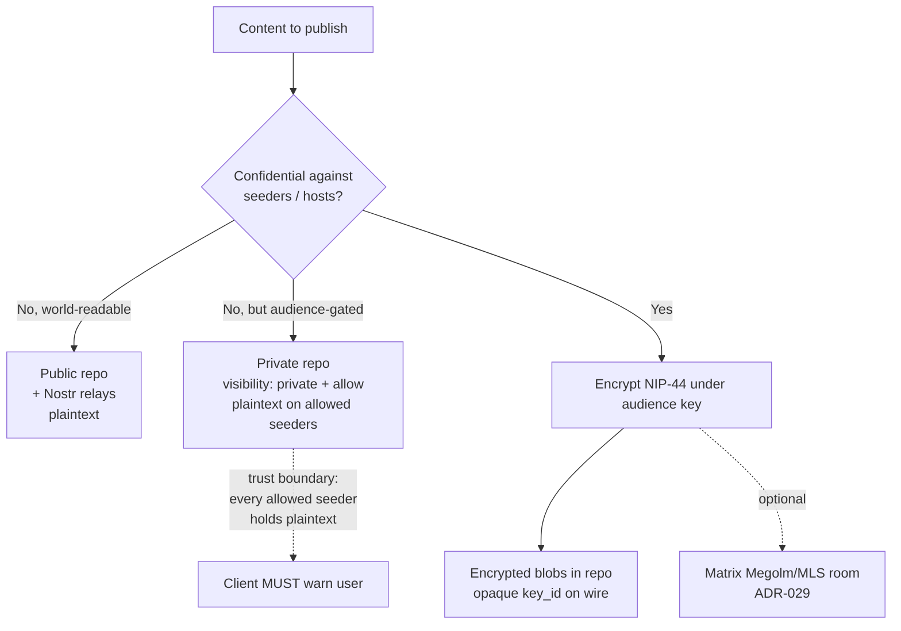

# ADR-028: Privacy tiers — repo visibility and encrypted-blobs-in-repo

**Date:** 2026-07-01
**Status:** Accepted
**Decision makers:** user + `/codex:rescue` review (star-chamber unavailable this session)

## Context

The v0.3.0 privacy model for broadcast content leaned on Matrix:
private broadcast posts were room-key-wrapped Nostr events published to
relays, with the encrypt-once-for-the-room key distributed via a
Megolm-encrypted room-secret state event. With Matrix demoted to
OPTIONAL (ADR-029) and Radicle repos now a core backend (ADR-026), the
privacy tiers must be redefined in terms of repo visibility and
app-layer encryption, without depending on the optional Matrix layer.

The governing constraint comes straight from the research: **Radicle
private repos are NOT encrypted at rest.** "Private" means *selective
replication only* — the repo is invisible and unfetchable to non-allowed
nodes, and the transport is Noise-encrypted, but the content is
**plaintext git objects on every allowed/seed node**. Radicle's own
docs warn that any node added to the allow list "will have visibility
to the data." This is the inverse of the blind-homeserver/Megolm model:
strong against the public and on-the-wire observers, weak against a
malicious or compromised allowed seeder.

The user explicitly wanted a new tier — "unencrypted but not
discoverable" — which maps precisely onto a Radicle private repo, and
chose (Q4-A) to also support confidential broadcast without Matrix by
committing app-layer-encrypted blobs into a repo.

## Decision

**Three explicit privacy tiers, each with a stated trust boundary, and
confidentiality is a property of git + app-layer crypto rather than of
the optional Matrix layer.**

1. **Public** — a **public Radicle repo**: world-readable,
   world-seedable, and mirrored to ordinary Nostr relays. Content is
   plaintext Nostr events. Confidential against no one; this is the
   `public_broadcast` analog.

2. **Unencrypted-but-not-discoverable** — a **private Radicle repo**
   (`visibility: private` + an `allow` list of delegate DIDs). Readable
   by allowed seeders (= the intended audience/members); **invisible and
   unfetchable to the public and to non-allowed nodes**; NOT
   confidential against members or any node the owner allows to seed.
   This is the user's new tier and it is the default for audience-scoped
   content where the audience is trusted to hold plaintext.

3. **Encrypted** — content **encrypted before it is committed** (NIP-44
   symmetric ciphertext under a Heterodyne room/audience key), stored as
   **encrypted blobs in a repo** (public or private), and/or carried in
   an OPTIONAL Matrix Megolm/MLS room (ADR-029). Confidential against
   **everyone** who is not a key-holder, **including seeders and rented
   full nodes**. This tier replaces v0.3.0's room-key-wrapped
   `private_broadcast`: git is the blind ciphertext transport instead of
   relays, and no Matrix dependency is required.

The `kind:31007` feed index and any on-the-wire descriptors for tier 3
MUST NOT leak audience-identifying data (RID, entries, relay hints) in
cleartext, mirroring the v0.3.0 room-key-wrap discipline (§6.7.4/§6.10)
— only an opaque `key_id` is visible.

## Requirements (RFC 2119)

- A conforming client MUST support all three tiers: public repo,
  private repo ("unencrypted-but-not-discoverable"), and
  encrypted-blobs-in-repo. It SHOULD additionally support Matrix
  encrypted rooms (ADR-029) for real-time confidential discussion.
- A client MUST present the private-repo tier's trust boundary to the
  user without ambiguity: content is **plaintext on every allowed
  seeder**, and the allow list SHOULD be limited to people/devices the
  persona trusts with plaintext. A client MUST NOT describe a private
  repo as "encrypted" or "confidential against members."
- For the encrypted tier, a client MUST encrypt content (NIP-44 v2 or a
  successor named in the spec) under an audience/room key **before**
  committing it to any repo or publishing it to any relay, and MUST NOT
  write plaintext of encrypted-tier content to a repo, relay, or seed
  node.
- Encrypted-tier events and their `kind:31007` index MUST expose only an
  opaque `key_id` on the wire; the RID, index entries, relay hints, and
  page links MUST live inside the encrypted payload or an in-audience
  descriptor, per the §6.7.4/§6.10 discipline carried forward.
- Audience-key distribution for the encrypted tier MUST NOT depend on
  Matrix. The concrete mechanism is a reserved **`kind:31011`
  audience-key-wrap event**: the audience/room key is NIP-44-wrapped
  **once per recipient** to that recipient's npub and published to the
  repo/Nostr backends, addressed so each member can locate and unwrap
  their copy. The audience roster (recipient set) is the persona's
  signed membership list, not a Matrix room. A client MAY additionally
  use a Matrix room-secret event when an OPTIONAL Matrix room is in
  use, but MUST NOT require it.
- The encrypted tier MUST NOT have a circular bootstrap: a new member
  MUST be able to locate the encrypted object and their wrapped key
  from clear data alone — the opaque `key_id`, the recipient-addressed
  `kind:31011` event, and the RID/host routing (`kind:31005`/`31010`).
  The "in-audience descriptor" carrying RID/entries/relay-hints MUST be
  distributable over the repo/Nostr substrate (not Matrix state), so a
  Matrix-free member can join and decrypt.
- A private repo distinguishes two permissions that MUST NOT be
  conflated: the **`delegates`** set (identity/canonical-ref
  *governance*, per ADR-027) and the **`visibility.allow`** set (the
  NIDs/nodes permitted to *replicate and read* the repo). Audience
  membership is `visibility.allow`, not delegate authority; a persona
  MAY grant a follower read/replication access without making them a
  governance delegate. Adding a NID to `visibility.allow` MUST be
  treated by the client as granting plaintext read access to that node
  and SHOULD require explicit user confirmation.
- Encrypted-tier key rotation MUST occur on member **removal** (a fresh
  audience key redistributed via `kind:31011` to the remaining roster),
  matching §6.7.4's MUST for room-secret rotation, so removed members
  cannot decrypt future content. It SHOULD NOT occur on member **join**
  (joiners receive the current key forward). Note this excludes removed
  members from *future* content only; content they already held (or its
  ciphertext in repo history) is not retroactively protected.
- Deleting encrypted or private content MUST use Nostr `kind:5`
  deletion plus an updated `kind:31007` index; clients MUST treat git
  history as immutable and MUST NOT rely on repo rewriting for content
  removal.
- Clients MUST warn that deletion is not erasure and that the residue
  is tier-specific: public/private-tier plaintext may persist on every
  node that fetched or seeds the repo, and encrypted-tier ciphertext
  remains in git history (recoverable only by current key-holders).
  Deletion signals intent to conforming clients; it does not guarantee
  removal from other nodes' stores.

## Rationale

Making the tiers a property of repo visibility + app-layer crypto keeps
confidentiality available even when Matrix is absent, satisfying the
"Matrix is optional" goal all the way up to confidential broadcast. The
private-repo tier gives a genuinely new and useful capability
(audience-gated distribution with no ciphertext on untrusted infra),
provided its trust boundary is stated honestly. The encrypted-blobs
tier reuses the existing encrypt-once-for-the-audience key model, simply
swapping relays for git as the blind carrier, so the hard-won metadata
discipline from §6.7.4/§6.10 transfers directly.

## Alternatives Considered

### Require Matrix for anything truly confidential
- Pros: reuses Megolm/MLS; less new crypto plumbing on the git path.
- Cons: breaks "Matrix is optional" for the confidential-broadcast use
  case; ties a core capability to an optional layer.
- Why rejected: user chose encrypted-blobs-in-repo (Q4-A).

### Treat Radicle private repos as sufficient for confidentiality
- Pros: no app-layer crypto; simplest.
- Cons: false security — plaintext on every allowed seeder; fails
  against a malicious member/rented node.
- Why rejected: contradicts the research; the private tier is
  deliberately labeled "not discoverable," not "confidential."

## Assumed Versions (SHOULD)

- Radicle / Heartwood: 1.9.x — private repos (`visibility: private` +
  `allow`), selective replication, Noise XK transport encryption.
- Nostr: NIP-44 v2 (symmetric payload encryption), NIP-01 replaceable
  events (`kind:31007` index), `kind:5` deletions.
- Carry-forward: §6.7.4 (room-key-wrapped index), §6.10 (room-key-wrap
  discipline), ADR-005 (private feed-index wrap).

## Diagram

<!-- renderer unavailable: Mermaid source only -->

Mermaid source

## Consequences

- §5 (room taxonomy) is recast as a repo-visibility taxonomy for
  broadcast content; §6.10 (encrypted broadcast) is rewritten around
  encrypted-blobs-in-repo with Matrix as an optional carrier; §9
  (encryption guarantees) documents the three tiers and their trust
  boundaries.
- A new normative requirement — the private-tier honesty warning —
  enters the client profile and strict mode (§11.7).
- Audience-key distribution over the repo/Nostr substrate (independent
  of Matrix) is new work for the publishing flow (§6) and needs
  conformance vectors (§14).
- The threat model (§13) adds the malicious-allowed-seeder threat for
  the private tier and confirms the encrypted tier's resistance to it.

## Council Input

Star-chamber unavailable this session; review via `/codex:rescue` per
user direction. Blocking/should-fix findings integrated before
acceptance — for ADR-028: the concrete Matrix-independent
`kind:31011` per-recipient audience-key-wrap, the non-circular
bootstrap requirement (clear lookup handle over repo/Nostr, not Matrix
state), separation of governance `delegates` from the
`visibility.allow` replication/read set, upgrading removal-rekey from
SHOULD to MUST, and per-tier deletion/retention permanence warnings.
