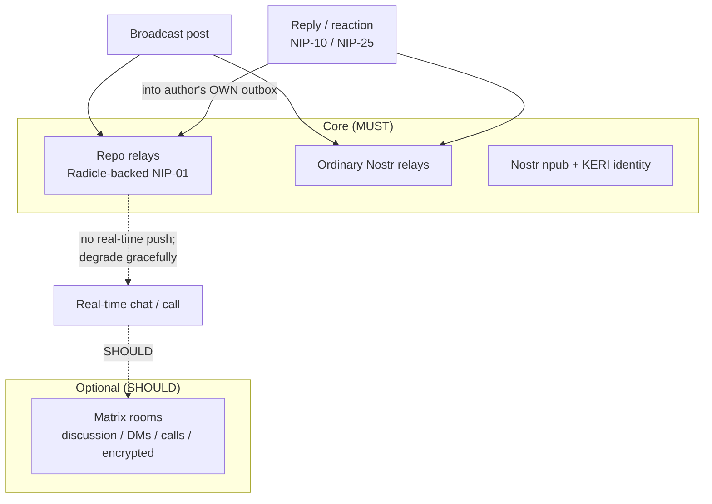

# ADR-029: Matrix demoted to an optional layer; v0.4.0 migration scope

**Date:** 2026-07-01
**Status:** Accepted
**Decision makers:** user + `/codex:rescue` review (star-chamber unavailable this session)

> **Superseded in part (2026-07-31, ADR-037).** Only the Matrix room-secret
> key-delivery alternative is retired. Matrix optionality and its current
> discussion-room role remain accepted.

## Context

ADR-026 through ADR-028 move content, identity, and privacy onto a
Radicle + Nostr substrate. This ADR records the consequence for Matrix
and the overall migration: what changes, what survives, and the version
bump. It also fixes the interaction/real-time model, since removing
Matrix from the core raises the question of where replies, reactions,
DMs, and chat live.

Two facts frame the interaction question. First, Radicle replication is
announce-then-fetch with no real-time content push — good for async
feeds, poor for chat. Second, a persona's own repo is single-writer (its
delegates), so a follower cannot write a reply into the author's repo.
Both point to Nostr's outbox model for asynchronous interaction and to
Matrix for real-time confidential discussion.

## Decision

**Matrix becomes an OPTIONAL layer (SHOULD-level) for interactive
discussion groups, DMs, calls, and encrypted rooms; it is no longer
required for conformance. Asynchronous public interaction uses the
Nostr outbox model over the two core backends. The whole change ships as
v0.4.0.**

- **Matrix scope.** A conforming client SHOULD implement Matrix for
  discussion groups, DMs, calls, and encrypted rooms, for full
  interoperability with the existing ecosystem and for real-time
  confidential conversation. Matrix is no longer a core transport or
  container; nothing in the identity, publishing, discovery, or privacy
  path may depend on it.

- **Interaction model (outbox).** Reactions and replies are Nostr
  events (NIP-25 reactions, NIP-10 replies) that each user writes into
  **their own** repo relay and to Nostr relays, referencing the target
  event `id`. Thread assembly is scatter-gather across repliers'
  outboxes and relays. Full nodes MAY materialize hot threads or
  org-scoped discussions as a Radicle Collaborative Object
  (`xyz.heterodyne.thread`) as an optimization, but the outbox is the
  base layer. Real-time chat, DMs, and calls are the province of the
  OPTIONAL Matrix layer.

- **Versioning.** This is a 0.x breaking substrate change and ships as
  **v0.4.0** under the semver-0.x rule (§12.1): any 0.x release MAY
  break the prior one.

- **Migration scope** (recorded so the spec rewrite is bounded):
  - **Rewritten:** §5 (room taxonomy → repo-visibility taxonomy + the
    optional Matrix discussion kinds), §7 (discovery → seed-node routing
    and `kind:31005` RID pointer), §10 (bridge/client model → full /
    seed / light node roles + repo-relay adapter), §6.10 (encrypted
    broadcast → encrypted-blobs-in-repo), §9 (encryption guarantees →
    three tiers).
  - **New:** repo-relay NIP-01-over-git interface, seed/routing-node
    spec (edge-runtime compatible), light-node spec (WASM), `kind:31010`
    node advertisement, org/`crefs` governance and NIP-72-via-`crefs`.
  - **Reframed:** ADR-020 mirroring (Radicle seeding is now the
    mirroring/redundancy engine), ADR-017 taxonomy, ADR-019 Tor
    (extended to Radicle transport + repo/seed endpoints), ADR-001/002
    (scoped to the OPTIONAL Matrix layer).
  - **Largely intact:** §3.5 KERI identity (with `kind:31001` now
    targeting NIDs per ADR-027), §11.6 ATProto attached outbox, the
    §14 test-vector floor (extended with new vectors).

## Requirements (RFC 2119)

- A conforming client SHOULD implement Matrix rooms for discussion
  groups, DMs, calls, and encrypted real-time conversation, for full
  interoperability. A client that omits Matrix MUST still be fully
  conformant for identity, publishing, discovery, and all three privacy
  tiers.
- No conformance requirement in the identity, publishing, discovery, or
  privacy path MUST depend on Matrix; any such dependency is a defect.
- Reactions and replies MUST be publishable as Nostr events (NIP-25 /
  NIP-10) into the author's own outbox (repo relay and Nostr relays),
  referencing the target event `id`; clients MUST NOT require write
  access to another persona's repo to reply or react.
- Clients MUST assemble threads by gathering events that reference a
  target `id` across the outbox/relay backends and MUST deduplicate by
  event `id`. A full node MAY materialize a thread as an
  `xyz.heterodyne.thread` COB; clients MUST treat such a COB as an
  optimization, not the source of truth.
- Real-time delivery guarantees MUST NOT be assumed from the repo
  substrate (announce-then-fetch, no push); clients requiring real-time
  interaction SHOULD use the OPTIONAL Matrix layer and MUST degrade
  gracefully to async outbox interaction when it is absent.
- The specification MUST be published as v0.4.0 and MUST state that it
  breaks v0.3.0 per the semver-0.x rule; migration guidance for existing
  v0.3.0 personas (republishing `kind:31005` as an RID pointer,
  standing up a full node) SHOULD be provided.
- Onion reachability (ADR-019) MUST extend to repo relays, seed nodes,
  full nodes, and Nostr relays; full-node Radicle replication SHOULD be
  able to run over `.onion` (Radicle SOCKS5 Tor support), and light
  clients retain the WebSocket-PT bridge caveat. Egress-over-Tor remains
  opt-in; strict mode (§11.7) keeps it default-on.

## Supersession of v0.3.0 Matrix MUSTs

The v0.4.0 spec rewrite MUST replace every v0.3.0 requirement that
makes Matrix load-bearing. This table is the checklist; each row is a
MUST for the rewrite.

| v0.3.0 requirement (Matrix-dependent) | v0.4.0 disposition |
|---|---|
| §3.2 — a persona MUST have a Matrix identity room | **Superseded.** Identity is npub + KERI + the `kind:31005` RID pointer (ADR-026). A Matrix identity room becomes an OPTIONAL container only. |
| §3.3 — delegation attestations target Matrix MXIDs | **Superseded.** `kind:31001` targets Ed25519 NIDs (ADR-027); MXID delegation exists only within the optional Matrix layer. |
| §10.1 — every client is a full Matrix + Nostr client | **Superseded.** Every client is a Nostr + repo-relay client; Matrix is SHOULD-level. |
| §6.7.4 / §7.2 — private feed descriptors and key delivery live in Matrix state | **Superseded.** Encrypted-blobs-in-repo + `kind:31011` audience-key-wrap (ADR-028); Matrix room-secret is an optional alternative. |
| §3.8 — encrypted Matrix config room for per-device/persona state | **Downgraded to OPTIONAL.** Config/state sync moves to the repo/Nostr substrate; a Matrix config room MAY still be used. |
| §5 — room taxonomy defined in Matrix room kinds | **Recast.** Broadcast is a repo-visibility taxonomy (ADR-028); discussion room kinds become the optional-Matrix taxonomy. |
| `kind:31007` feed index (already Nostr-native) | **Intact**, with ordering-authority + `crefs`-reachability rules (ADR-026/027). |

A conformant Matrix-free client MUST satisfy the v0.4.0 replacements in
every row above; any residual normative dependence on Matrix outside
the optional discussion/DM/call/encrypted-room layer is a defect.

## Rationale

Demoting Matrix rather than deleting it keeps its genuine strengths
(real-time E2EE discussion, calls, and a large existing network) as an
opt-in while removing the homeserver from the critical path. The outbox
model is the natural fit for Radicle's single-writer repos and for
async feeds, and it makes Matrix truly optional for basic public
interaction. Shipping as a single v0.4.0 with an explicit migration
scope keeps the large spec rewrite legible and bounded.

## Alternatives Considered

### Keep Matrix as a co-equal core backend (three MUST substrates)
- Pros: real-time everywhere; no capability regression.
- Cons: re-imposes the homeserver dependency the pivot is meant to
  shed; three mandatory substrates is a heavy client burden.
- Why rejected: user set Matrix at SHOULD (Q2), core at git + relays.

### Remove Matrix entirely
- Pros: fewer moving parts; one fewer protocol.
- Cons: loses real-time E2EE chat/calls and ecosystem interop with no
  in-substrate replacement.
- Why rejected: user wants Matrix retained (SHOULD) for interop and
  real-time confidential discussion.

## Assumed Versions (SHOULD)

- Matrix: room version "11"; Megolm today, MLS per ADR-012 when mature
  (now scoped to the optional layer).
- Nostr: NIP-10 (threads), NIP-25 (reactions), NIP-01 (`kind:5`
  deletions), NIP-65 (relay lists).
- Spec target: Heterodyne 0.4.0.

## Diagram

<!-- renderer unavailable: Mermaid source only -->

Mermaid source

## Consequences

- The spec advances to v0.4.0 with the rewrite scope above; the
  CHANGELOG and README positioning (ADR-025) are updated to describe a
  Radicle + Nostr core with optional Matrix.
- A capability regression is accepted and documented: without the
  OPTIONAL Matrix layer, there is no real-time confidential discussion —
  async outbox interaction only.
- Conformance (§14) is split so a Matrix-free client can be fully
  conformant; new vectors cover outbox threading and the optional-Matrix
  boundary.
- ADR-020's Matrix room mirroring is superseded by Radicle seeding as
  the redundancy engine; the ADR is reframed rather than deleted.

## Council Input

Star-chamber unavailable this session; review via `/codex:rescue` per
user direction. The most important finding — that Matrix-free
conformance contradicted retained v0.3.0 Matrix MUSTs — is addressed
by the new "Supersession of v0.3.0 Matrix MUSTs" section, which is a
per-row checklist for the v0.4.0 rewrite.
