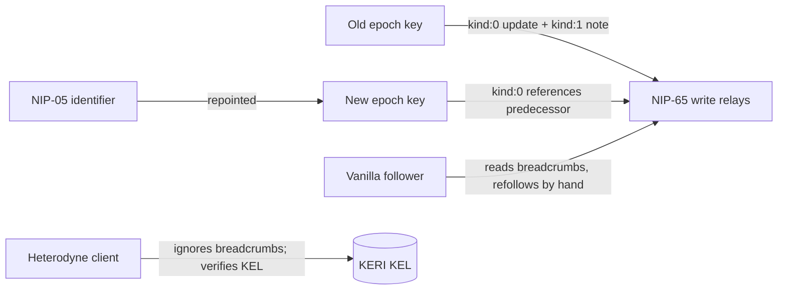

# ADR-031: Vanilla-Nostr reachability - rotation breadcrumbs, no bridge

**Date:** 2026-07-07
**Status:** Proposed (codex review complete; awaiting acceptance)
**Decision makers:** user (design direction); codex review integrated

## Context

Heterodyne's vanilla-Nostr compatibility is relay-level, not
social-graph-level (§11.2): posts are signed by rotating epoch keys
(§3.5.0), so a vanilla client such as iris follows the *epoch key*, and
every epoch rotation silently breaks that follow. §11.3 currently
declares bridging this gap out of scope entirely.

The user direction narrows the problem rather than reopening the
bridge question: do NOT build machine verification for vanilla
clients; DO leave human-followable breadcrumbs so a non-Heterodyne
follower can find the successor key after a rotation. Separately,
confirm the other direction - a Heterodyne client following plain
Nostr users and events that carry no Heterodyne constructs at all -
as a first-class case (§11.4 already drafts this).

## Decision

**No bridge and no new requirement on vanilla clients. Vanilla
followers follow the persona's current publishing key(s), and on
epoch rotation the persona leaves unauthenticated, human-followable
breadcrumbs from the retiring key to the successor. Following vanilla
Nostr users remains first-class.**

1. **Supported reduced-guarantee mode, stated honestly.** A vanilla
   Nostr user follows one or more of the keys the persona publishes
   with. This is a supported interop mode with no delegation
   awareness, no KEL verification, and follows that break on rotation
   unless the human follows the breadcrumbs.

2. **Rotation breadcrumbs.** On a routine (non-compromise) epoch
   rotation - after the rotation has been accepted into the KEL and
   while the old key is still available - the persona publishes from
   the OLD key to its NIP-65 write relays:
   - an updated `kind:0` profile whose `about` (and website field)
     point at the successor npub. The old profile's `nip05` field
     MUST NOT be set to an identifier that has been repointed to the
     successor: that fails NIP-05 validation under the old key, and
     vanilla clients may hide or warn on the profile, burying the
     breadcrumb; and
   - a final plain `kind:1` note announcing that the account continues
     at the successor key.
   The NEW key's `kind:0` SHOULD reference the predecessor so the
   trail is walkable in both directions. After the breadcrumbs are
   published, the retired epoch secret SHOULD be destroyed - a
   destroyed key cannot be compromised later and used to overwrite
   its own breadcrumbs.

3. **NIP-05 continuity.** Where the persona holds a NIP-05
   identifier, the identifier SHOULD be repointed to the current epoch
   key at each rotation. DNS/HTTPS survives rotation, making NIP-05
   the most durable breadcrumb for vanilla clients that resolve it.

4. **Breadcrumbs carry no authority.** Heterodyne clients MUST ignore
   breadcrumbs for verification purposes - the KEL and the §3.6
   authority ladder remain the only authority over key succession. A
   breadcrumb is advisory UI-level data for humans on vanilla
   clients. Post-acceptance old-key breadcrumbs are a narrow,
   explicitly permitted exception to the rule that superseded epoch
   keys stop signing new content: they are vanilla-interop artifacts,
   not Heterodyne-authenticated content - they MUST NOT enter §4.5
   verification, and neither emitting nor encountering them is a
   conformance violation.

5. **Compromise honesty.** A compromise-driven rotation cannot produce
   a trustworthy breadcrumb: the retiring key is attacker-held and can
   point vanilla followers anywhere. Nor are routine breadcrumbs
   durable: `kind:0` is replaceable, so a retired key compromised
   weeks later can overwrite its own breadcrumb (or bury it under a
   louder `kind:1`) to redirect vanilla followers - hence the
   destroy-after-publication step above. Breadcrumbs are best-effort
   and time-sensitive; clients and documentation MUST NOT claim they
   are reliable under compromise, and no client may auto-follow from
   them. This is inherent to vanilla Nostr and is exactly the bridge
   this ADR declines to build.

6. **Following vanilla users is core.** §11.4 is affirmed: a
   Heterodyne client MUST treat plain Nostr events and authors with no
   Heterodyne constructs (no `kind:31005` pointer, no delegations,
   relay-only) as first-class follow targets - Nostr signature
   verification only, NIP-65 subscription, NIP-17 DM fallback, and an
   external-identity indicator for the reduced guarantees.

## Requirements (RFC 2119)

- On a routine epoch rotation, a client SHOULD publish the breadcrumb
  pair (old-key `kind:0` update + old-key `kind:1` successor note) to
  the persona's NIP-65 write relays only after the rotation has been
  accepted into the KEL and before the old key is retired, SHOULD
  reference the predecessor from the new key's `kind:0`, and SHOULD
  destroy the retired epoch secret once the breadcrumbs are published.
- The old-key `kind:0` MUST NOT carry a `nip05` identifier that has
  been repointed to the successor key.
- A client MUST NOT follow, refollow, or switch follow targets
  automatically on the basis of a breadcrumb; acting on one is a
  human decision.
- A persona with a NIP-05 identifier SHOULD repoint it to the current
  epoch key as part of the rotation flow.
- A Heterodyne client MUST NOT treat any breadcrumb event as
  authoritative for key succession; verification remains the KEL per
  §3.6. Breadcrumbs MUST NOT be inputs to the §4.5 checks; as
  advisory vanilla-interop artifacts they are a permitted narrow
  exception to superseded-key signing rules, and publishers emitting
  them (post-KEL-acceptance) and verifiers encountering them remain
  conformant.
- Documentation and client UI MUST NOT describe breadcrumbs as secure
  or as surviving key compromise.
- A Heterodyne client MUST support following vanilla Nostr-only
  authors per §11.4 and MUST render the external-identity indicator
  for them.

## Rationale

The breadcrumb pair uses only `kind:0` and `kind:1` - the two event
kinds every vanilla client already renders - so it requires nothing
from the vanilla ecosystem, which is the entire constraint. Keeping
breadcrumbs advisory preserves the clean split established in §11.3:
Heterodyne-aware clients verify via the KEL; vanilla clients get
best-effort human-followable continuity. Declining a stable
vanilla-facing key keeps a single rotation discipline and avoids a
permanent second identity surface.

## Alternatives Considered

### Stable non-rotating vanilla-facing publishing key
- Pros: vanilla follows never break.
- Cons: a permanent key weakens rotation hygiene, creates a second
  long-lived identity surface, and invites confusion about which key
  is canonical.
- Why rejected: user direction is breadcrumbs, not a parallel key.

### NIP-26 delegation tags on posts
- Pros: a standardized attribution pointer exists in the tag.
- Cons: effectively unadopted by vanilla clients; deprecated in
  practice; would not fix follows anyway.
- Why rejected: no real-world rendering support.

### KEL-aware discovery bridge for vanilla clients
- Pros: machine-verified continuity.
- Cons: requires vanilla clients to change - the thing §11.3 already
  scoped out and the user explicitly does not propose.
- Why rejected: out of scope by direction; §11.3's boxed note stands.

## Assumed Versions (SHOULD)

- NIP-01 (`kind:0`, `kind:1`), NIP-05 (DNS-based identifiers), NIP-65
  (relay lists); §11.2-§11.4 as drafted in 0.4.x.

## Diagram

<!-- renderer unavailable: Mermaid source only -->

Mermaid source

## Consequences

- §3.5 (rotation) gains the breadcrumb publication step as SHOULD.
- §11.2/§11.3 are softened at the edges: the "out of scope" boxed note
  stands for machine verification, with a pointer to the advisory
  breadcrumb mechanism; §11.4 is unchanged.
- The threat model notes the compromise limitation of breadcrumbs
  explicitly so no security weight is ever attached to them.
- Minimal vector surface: breadcrumb events are ordinary kind:0/kind:1
  events; at most a rotation-flow vector asserting the SHOULD ordering
  (breadcrumbs before retirement).

## Council Input

Drafted this session from user design direction (no bridge;
breadcrumbs for non-Heterodyne followers; Heterodyne-follows-vanilla
affirmed). Codex round 1 (2026-07-08, `codex:codex-rescue`) returned
1 should-fix / 2 nit findings, all integrated: retired-key
later-compromise honesty with destroy-after-publication and a
no-auto-follow rule; the old-key `nip05` field pitfall; and
publish-after-KEL-acceptance ordering. Codex round 2 added one
should-fix, integrated: post-acceptance old-key breadcrumbs are
declared a narrow advisory exception to superseded-key signing rules,
outside §4.5 verification. Round 3 verified that resolution with no
remaining ADR-031 findings. Review complete; awaiting acceptance.
