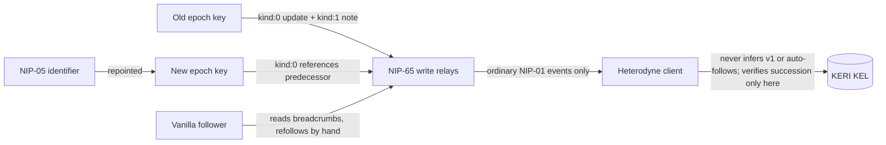

# ADR-031: Vanilla-Nostr reachability - rotation breadcrumbs, no bridge

**Date:** 2026-07-07
**Status:** Accepted
**Decision makers:** user (design direction); codex review integrated

## Family-allocation amendment (2026-07-19)

ADR-033 split this proposal across the protocol family before acceptance.
The split is exact:

| Family document | Allocation |
|---|---|
| `Core` | Breadcrumb production during rotation and the verification exclusion that gives breadcrumbs no identity authority. |
| `Social` | Following vanilla Nostr authors, manual refollow behavior, reduced-guarantee presentation, and related UI. |

Registry revision 1 records the Core production profiles
`heterodyne-core-rotation-breadcrumb-profile-v1` for `kind:0` and
`heterodyne-core-rotation-breadcrumb-note-v1` for `kind:1`. Both profiles are
non-stamping, so their signed bytes remain legible to vanilla Nostr clients.
Their immutable discriminators are
`production-rule:adr-031-kind0-v1` and
`production-rule:adr-031-kind1-v1`. Those discriminator strings describe
trusted local **producer rules** in the registry; they are not tags, content
markers, or consumer-visible wire classifiers. A consumer MUST NOT infer
either v1 profile from relay bytes.

The qualified integration targets are
`heterodyne:core/0.5.0#core-kel-rotation`,
`heterodyne:core/0.5.0#core-version-stamps`, and
`heterodyne:social/0.5.0#social-following`. These replace the candidate
monolith targets in the original proposal.

**Historical monolith reference label.** Every unqualified `§...` reference
in the original text below refers only to the frozen 0.4.0 monolith and is
historical context, not a current integration target. If original allocation
language conflicts with this amendment, this amendment controls.

## Acceptance reconciliation (2026-08-03)

This reconciliation makes explicit the producer/consumer boundary implied by
the non-stamping decision:

- A producer recognizes a v1 breadcrumb only inside its trusted rotation
  workflow. That context consists of the prior accepted KEL state, an accepted
  routine successor rotation for the same persona, the retiring and successor
  epoch keys, the persona's selected NIP-65 write-relay set, and the exact
  candidate `kind:0`/`kind:1` pair. The pair is emitted after KEL acceptance
  and before destruction of the retiring secret.
- Relay bytes do not carry that context. An unstamped `kind:0` or `kind:1`
  without `kel_head` is ordinary upstream Nostr on consumption, even if its
  prose looks like a continuation notice. A consumer verifies its NIP-01
  signature and may present it as advisory, reduced-assurance external
  content; it MUST NOT use it as KEL succession evidence, identity authority,
  or a reason to change a follow automatically.
- A vector or API MUST NOT smuggle producer knowledge into the consumer by
  supplying a hidden `role`, profile identifier, or equivalent oracle. In
  particular, a retiring Alice key pointing at an unrelated Bob key is not a
  valid positive breadcrumb example merely because a fixture labels it one.
- The v1 discriminators and registry histories 1 through 3 are immutable. If
  a future profile needs machine-recognizable signed bytes, it MUST allocate a
  v2 profile with an in-band marker rather than reinterpret v1 or rewrite an
  existing history.

This section controls where the original proposal was ambiguous.

## Context

Heterodyne's vanilla-Nostr compatibility is relay-level, not
social-graph-level (§11.2): posts are signed by rotating epoch keys
(§3.5.0), so a vanilla client such as iris follows the *epoch key*, and
every epoch rotation silently breaks that follow. §11.3 currently
declares bridging this gap out of scope entirely.

The user direction narrows the problem rather than reopening the
bridge question: do NOT build machine verification for vanilla
clients; DO leave human-followable breadcrumbs so a non-Heterodyne
follower can find the successor key after a rotation. Separately,
confirm the other direction - a Heterodyne client following plain
Nostr users and events that carry no Heterodyne constructs at all -
as a first-class case (§11.4 already drafts this).

## Decision

**No bridge and no new requirement on vanilla clients. Vanilla
followers follow the persona's current publishing key(s), and on
epoch rotation the persona leaves unauthenticated, human-followable
breadcrumbs from the retiring key to the successor. Following vanilla
Nostr users remains first-class.**

1. **Supported reduced-guarantee mode, stated honestly.** A vanilla
   Nostr user follows one or more of the keys the persona publishes
   with. This is a supported interop mode with no delegation
   awareness, no KEL verification, and follows that break on rotation
   unless the human follows the breadcrumbs. Conversely, Heterodyne
   consumers accept an unstamped `kind:0` or `kind:1` without `kel_head`
   as ordinary upstream Nostr after successful NIP-01 signature
   verification. Such content is external and advisory: it conveys no
   Heterodyne identity authority even when its prose resembles a
   breadcrumb.

2. **Rotation breadcrumbs.** On a routine (non-compromise) epoch
   rotation, the producer first verifies from trusted local state that
   the prior KEL is accepted, that the accepted successor rotation is
   for the same persona, that the old key is the retiring epoch key,
   and that the new key is the successor epoch key. After the rotation
   has been accepted into the KEL and while the old secret is still
   available, the producer constructs one exact candidate pair and
   publishes it from the OLD key to the write-relay set selected for
   that workflow:
   - an updated `kind:0` profile whose `about` (and website field)
     point at the successor's NIP-19 `npub`. The old profile's `nip05` field
     MUST NOT be set to an identifier that has been repointed to the
     successor: that fails NIP-05 validation under the old key, and
     vanilla clients may hide or warn on the profile, burying the
     breadcrumb; and
   - a final plain `kind:1` note announcing that the account continues
     at the successor key.
   The NEW key's `kind:0` SHOULD reference the predecessor so the
   trail is walkable in both directions. After the breadcrumbs are
   published, the retired epoch secret SHOULD be destroyed - a
   destroyed key cannot be compromised later and used to overwrite
   its own breadcrumbs. A Nostr event's `pubkey` field remains the
   canonical 32-byte lowercase hexadecimal x-only public key; prose
   intended for humans uses the actual bech32 NIP-19 `npub`, never raw
   hexadecimal mislabeled as an `npub`.

3. **NIP-05 continuity.** Where the persona holds a NIP-05
   identifier, the identifier SHOULD be repointed to the current epoch
   key at each rotation. DNS/HTTPS survives rotation, making NIP-05
   the most durable breadcrumb for vanilla clients that resolve it.

4. **Breadcrumbs carry no authority.** Heterodyne clients MUST ignore
   breadcrumbs for verification purposes - the KEL and the §3.6
   authority ladder remain the only authority over key succession. A
   breadcrumb is advisory UI-level data for humans on vanilla
   clients. The v1 production profiles are identified solely by the
   trusted local workflow context named above, including the exact
   candidate pair, never by inspecting relay bytes. Post-acceptance
   old-key breadcrumbs are a narrow, explicitly permitted exception to
   the rule that superseded epoch keys stop signing new content: they
   are vanilla-interop artifacts, not Heterodyne-authenticated content.
   They carry no `kel_head`, MUST NOT enter §4.5 verification, and
   neither emitting a locally validated pair nor encountering ordinary
   signed upstream events is a conformance violation. Consumers MUST
   NOT infer a breadcrumb profile, KEL succession, authority, or an
   automatic follow change from a `kind:0` or `kind:1`.

5. **Producer-only v1 classification is immutable.** Registry
   discriminators `production-rule:adr-031-kind0-v1` and
   `production-rule:adr-031-kind1-v1` name local production rules; they
   never appear on the wire. The producer's trusted inputs MUST bind
   the prior accepted KEL, the accepted same-persona routine rotation,
   retiring key, successor key, write-relay set, and exact candidate
   pair. A pair naming an unrelated persona's key is invalid. Neither
   a consumer nor a conformance vector may substitute a caller-provided
   `role`, profile name, expected identity, or other hidden oracle for
   those inputs. Registry histories 1 through 3 and both v1
   discriminators MUST remain unchanged. A later machine-recognizable
   design MUST allocate a distinct v2 profile and signed in-band
   marker.

6. **Compromise honesty.** A compromise-driven rotation cannot produce
   a trustworthy breadcrumb: the retiring key is attacker-held and can
   point vanilla followers anywhere. Nor are routine breadcrumbs
   durable: `kind:0` is replaceable, so a retired key compromised
   weeks later can overwrite its own breadcrumb (or bury it under a
   louder `kind:1`) to redirect vanilla followers - hence the
   destroy-after-publication step above. Breadcrumbs are best-effort
   and time-sensitive; clients and documentation MUST NOT claim they
   are reliable under compromise, and no client may auto-follow from
   them. This is inherent to vanilla Nostr and is exactly the bridge
   this ADR declines to build.

7. **Following vanilla users is Social.** The historical §11.4 behavior is
   affirmed: a Heterodyne client MUST treat plain Nostr events and
   authors with no Heterodyne constructs (no `kind:31005` pointer, no
   delegations, relay-only) as first-class follow targets after NIP-01
   signature verification. Their authority remains the signing Nostr
   key only. The client uses NIP-65 subscription, NIP-17 DM fallback,
   and an external-identity indicator for the reduced guarantees; it
   MUST NOT project KEL continuity or silently refollow a purported
   successor.

## Requirements (RFC 2119)

- On a routine epoch rotation, a client SHOULD publish the breadcrumb
  pair (old-key `kind:0` update + old-key `kind:1` successor note) to
  the persona's NIP-65 write relays only after the rotation has been
  accepted into the KEL and before the retiring secret is destroyed, SHOULD
  reference the predecessor from the new key's `kind:0`, and SHOULD
  destroy the retired epoch secret once the breadcrumbs are published.
- Before producing either v1 event, the rotation workflow MUST bind trusted
  local evidence for the prior accepted KEL, an accepted routine rotation for
  the same persona, the retiring and successor epoch keys, the selected
  NIP-65 write-relay set, and the exact candidate pair. A purported successor
  belonging to another persona MUST fail production.
- The old-key `kind:0` MUST NOT carry a `nip05` identifier that has
  been repointed to the successor key.
- A client MUST NOT follow, refollow, or switch follow targets
  automatically on the basis of a breadcrumb; acting on one is a
  human decision.
- A persona with a NIP-05 identifier SHOULD repoint it to the current
  epoch key as part of the rotation flow.
- A Heterodyne client MUST NOT treat any breadcrumb event as
  authoritative for key succession; verification remains the KEL per
  §3.6. Breadcrumbs MUST NOT be inputs to the §4.5 checks; as
  advisory vanilla-interop artifacts they are a permitted narrow
  exception to superseded-key signing rules, and publishers emitting
  them (post-KEL-acceptance) and verifiers encountering them remain
  conformant.
- On consumption, an unstamped `kind:0` or `kind:1` without `kel_head` MUST
  be classified only as ordinary upstream Nostr after NIP-01 signature
  verification. A consumer MUST NOT infer either v1 production profile from
  relay bytes or from a caller-supplied `role`, profile identifier, expected
  identity, or equivalent hidden oracle.
- The discriminators `production-rule:adr-031-kind0-v1` and
  `production-rule:adr-031-kind1-v1` and registry histories 1 through 3 MUST
  remain unchanged. A future machine-recognizable profile MUST allocate a new
  v2 discriminator and signed in-band marker.
- Documentation and client UI MUST NOT describe breadcrumbs as secure
  or as surviving key compromise.
- A Heterodyne client MUST support following vanilla Nostr-only
  authors per §11.4 and MUST render the external-identity indicator
  for them.

## Rationale

The breadcrumb pair uses only `kind:0` and `kind:1` - the two event
kinds every vanilla client already renders - so it requires nothing
from the vanilla ecosystem, which is the entire constraint. Keeping
breadcrumbs advisory preserves the clean split established in §11.3:
Heterodyne-aware clients verify via the KEL; vanilla clients get
best-effort human-followable continuity. Declining a stable
vanilla-facing key keeps a single rotation discipline and avoids a
permanent second identity surface. Keeping v1 classification solely inside
the trusted producer workflow avoids an impossible consumer promise: the
non-stamping events intentionally contain no Heterodyne marker. Consumers can
therefore verify only ordinary NIP-01 authorship and present the result as
external, while producer conformance can still prove that an exact
same-persona pair was emitted at the correct point in a routine rotation.

## Alternatives Considered

### Stable non-rotating vanilla-facing publishing key
- Pros: vanilla follows never break.
- Cons: a permanent key weakens rotation hygiene, creates a second
  long-lived identity surface, and invites confusion about which key
  is canonical.
- Why rejected: user direction is breadcrumbs, not a parallel key.

### NIP-26 delegation tags on posts
- Pros: a standardized attribution pointer exists in the tag.
- Cons: effectively unadopted by vanilla clients; deprecated in
  practice; would not fix follows anyway.
- Why rejected: no real-world rendering support.

### KEL-aware discovery bridge for vanilla clients
- Pros: machine-verified continuity.
- Cons: requires vanilla clients to change - the thing §11.3 already
  scoped out and the user explicitly does not propose.
- Why rejected: out of scope by direction; §11.3's boxed note stands.

## Assumed Versions (SHOULD)

- NIP-01 (`kind:0`, `kind:1`), NIP-05 (DNS-based identifiers), NIP-65
  (relay lists); §11.2-§11.4 as drafted in 0.4.x.

## Diagram

<!-- renderer unavailable: Mermaid source only -->

Mermaid source

## Consequences

- Core rotation at `heterodyne:core/0.5.0#core-kel-rotation` owns breadcrumb
  production, while `heterodyne:core/0.5.0#core-version-stamps` keeps both
  registered profiles non-stamping and outside identity verification.
- Social following and reduced-guarantee presentation integrate at
  `heterodyne:social/0.5.0#social-following`; machine verification for
  vanilla clients remains out of scope.
- The threat model notes the compromise limitation of breadcrumbs
  explicitly so no security weight is ever attached to them.
- The minimum vector surface covers trusted same-persona producer context,
  exact candidate-pair and relay-set binding, post-KEL/pre-destruction
  ordering, old-profile NIP-05 hygiene, compromise-driven non-production,
  NIP-01-only consumer classification, rejection of unrelated-successor and
  hidden-`role` fixtures, and the manual-only follow decision. No vector may
  claim that relay bytes identify a v1 production profile.

## Council Input

Drafted this session from user design direction (no bridge;
breadcrumbs for non-Heterodyne followers; Heterodyne-follows-vanilla
affirmed). Codex round 1 (2026-07-08, `codex:codex-rescue`) returned
1 should-fix / 2 nit findings, all integrated: retired-key
later-compromise honesty with destroy-after-publication and a
no-auto-follow rule; the old-key `nip05` field pitfall; and
publish-after-KEL-acceptance ordering. Codex round 2 added one
should-fix, integrated: post-acceptance old-key breadcrumbs are
declared a narrow advisory exception to superseded-key signing rules,
outside §4.5 verification. Round 3 verified that resolution with no
remaining ADR-031 findings. The 2026-08-03 acceptance reconciliation closed
the producer-only classification, same-persona workflow binding, consumer
non-inference, and immutable-v1 rules. Review complete; accepted.
