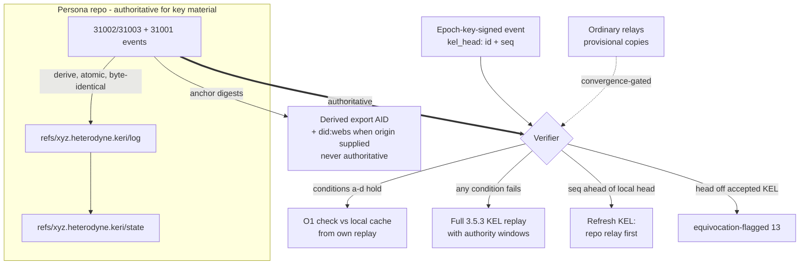

# ADR-032: radicle-keri alignment - kel_head binding, repo authority for key events, materialized KEL refs, did:webs export

**Date:** 2026-07-09
**Status:** Accepted (2026-07-12; default-model codex review: accept)
**Decision makers:** user (design direction); codex review

## Context

The user asked whether radicle-dev/radicle-keri (an early KERI
implementation mapped out for Radicle) is overlapping or usable.
Research (docs/research/2026-07-08-radicle-keri-compat-research.md):
a dormant Rust exploration (Nov-Dec 2022, pre-Heartwood, KEL write
path `todo!()`, vendored keriox 0.8.2, RUSTSEC-2022-0093) - no
reusable code, but a design README with three durable ideas: (a)
signed refs reference the identity state in force at signing (O(1)
point-in-time key-state lookup), (b) a dual commit-chain layout (raw
KEL chain + materialized key-state chain), (c) Radicle-team prior art
validating §3.9.10's KEL-over-identity-doc stance. KERI10JSON/CESR on
the wire was rejected (breaks the NIP-01/`nip01_raw` invariant).

A parallel questionnaire (local subagent + codex) converged on three
decision areas; the user chose stronger options than recommended on
all three and added two directions: (1) wire-level `kel_head` tag;
(2) normative MAY/SHOULD materialized-KEL ref profile now; (3)
normative did:webs export; (4) the repo backend is authoritative for
key-related events (relays can lose notes; the repo is eventually
consistent); (5) revocation of commits under compromised keys on the
roadmap alongside the client/node work.

This ADR aligns with radicle-keri's design ideas, not its code, era,
or wire formats. Org personas follow the same rules as individual
personas; no org-specific carve-outs are introduced.

## Decision

**Adopt radicle-keri's point-in-time binding and dual-chain layout as
Heterodyne-native constructs, make the repo the authoritative backend
for key-material events, and open a normative did:webs export at the
boundary - while KERI-native wire formats never appear on the wire.**

1. **Prior art, no code.** radicle-keri is cited as prior art for
   git-anchored KELs, the materialized key-state chain, and
   KEL-over-identity-doc reconciliation (§3.9.10). Its code is not
   reused. A reference entry is added to AGENTS.md.

2. **Wire-level `kel_head` tag.** Every epoch-key-signed Heterodyne
   event carries `["kel_head", "<kel event id>", "<seq>"]`: the
   64-hex Nostr event id and decimal `seq` of the latest KEL event
   the signer had accepted at signing time. Semantics:
   - **Advisory, never authoritative.** §3.5.3 KEL replay remains the
     authority. A verifier MUST NOT accept an event solely because
     its `kel_head` checks out, and MUST NOT reject an
     otherwise-valid event solely because its `kel_head` is stale -
     staleness is normal propagation lag.
   - **Authority windows and compromise declarations.**
     `established_at(E)` is the `created_at` of the accepted KEL
     event whose `epoch_key` establishes E; E's authority window is
     `[established_at(E), established_at(successor))`, unbounded with
     no successor. A compromise-declaring `kind:31003` MUST carry
     exactly one `["compromise_since", "<unix-seconds>"]` tag; a
     routine rotation MUST NOT carry it, and `compromise_since` MUST
     NOT exceed the rotation's `created_at`. With
     `effective_compromise_since = min(compromise_since, rotation
     created_at)`, the superseded key is non-authoritative for every
     non-breadcrumb event whose `created_at >=
     effective_compromise_since - 300` (the spec's +/-5-minute skew
     constant, applied conservatively so boundary events cannot
     escape by skew), regardless of `kel_head`, under BOTH the
     accelerator and full replay - closing the backdated-event hole
     in a `created_at`-only check.
   - **O(1) accelerator - decision-equivalent or not at all.** A
     verifier MAY check the signing key against materialized key
     state at the referenced head instead of replaying ONLY when
     decision-equivalent to full §3.5.3 replay over its accepted KEL:
     (a) the referenced event is on the accepted KEL; (b) the event's
     `created_at` falls within that head's authority window; (c) no
     later accepted KEL event retroactively invalidates the signing
     key at `created_at` (a `compromise_since` covering it); and (d)
     no head-ahead or otherwise pending KEL refresh exists - an
     attempted but failed refresh does NOT satisfy (d); until a
     successful refresh establishes the accepted head, the verifier
     MUST either run full replay over a complete authoritative
     candidate set or hold the event provisional, and MUST NOT report
     final acceptance. If any of (a)-(d) cannot be established, fall
     back to full replay before surfacing the event as verified.
   - **Accelerator state source.** "Materialized key state" here is a
     verifier-local cache built from the verifier's own completed
     replay of the accepted KEL. The optional
     `refs/xyz.heterodyne.keri/state` ref MUST NOT establish
     acceptance; a verifier MAY use it to populate its cache only
     after independently matching it to the accepted KEL.
   - **Withdrawal.** If later full verification or a KEL update
     contradicts an acceptance made via the accelerator or under
     provisional key state (item 3), the verifier MUST withdraw the
     acceptance signal, flag per §13, and mark dependent events
     unresolved until reverified.
   - **Rotation liveness signal.** A `kel_head` with `seq` ahead of
     the verifier's accepted head signals an unseen rotation; the
     verifier SHOULD refresh the KEL (repo relay first) before
     deciding - the wire-level tag's distinctive benefit.
   - **Equivocation tripwire.** A structurally valid `kel_head`
     naming an event off the persona's accepted KEL MUST produce the
     `equivocation-flagged` verification outcome and MUST be surfaced
     through the implementation's security-warning interface.
   - **Scope.** Epoch-key-signed events MUST carry `kel_head`. KEL
     events (`kind:31002`/`kind:31003`) are excluded regardless of
     signer - including `none`-strategy rotations signed by the prior
     epoch key - because they chain via `prior_digest`; KEL-event
     freshness comes from replay ordering, never from `kel_head`.
     Cold-root-signed events MAY carry it; DR wire events signed by
     device/session keys (§5.7, ADR-030 RPC rumors) and ADR-031
     breadcrumbs are excluded entirely. Full matrix after item 6.

3. **Repo authority for key-material events.** The key-material class
   is exactly {`kind:31002`, `kind:31003`, `kind:31001`} (closed).
   Publication is unchanged - these events MUST still be published to
   BOTH backends. Authority changes:
   - **Authoritative set.** The repo-carried set is the set of valid
     key-material events reachable from the verified canonical
     event-storage refs at the current repo head. Conflicts are keyed
     by `(cold_root, s)` for KEL events and by the NIP-01 replaceable
     address `(pubkey, 31001, d)` for delegations. A verifier MUST
     reject a repo head that regresses below a previously finalized
     canonical head unless an authenticated re-anchor (§3.9/ADR-027)
     authorizes it; node retention/GC MUST NOT drop key-material
     events reachable from finalized history.
   - **Provisional acceptance contract.** A key-material event seen
     only on relays is *provisional*, under a declared verifier
     policy: `provisional-accept` (default) - apply the event (e.g.,
     fresh posts under a just-rotated key) but mark that key state
     and every derived acceptance provisional, never
     reported final; or `deny-until-repo` (strict) - key-material
     events take effect only once repo-carried. Repo-carried hardens
     provisional to final. Provisional status MUST NOT harden while
     the repo is unreachable.
   - **Convergence-gated withdrawal.** Absence-triggered withdrawal
     requires causal convergence, not mere reachability. KEL event at
     `seq` N: withdraw only when the verified repo-carried KEL head
     has `seq >= N` and the event at N is missing or different (the
     hash chain makes `seq` a true causality marker). `kind:31001`:
     its `kel_head` proves nothing about repo convergence, so absence
     alone NEVER withdraws - withdrawal requires a
     canonically-included conflicting event at its replaceable
     address, an explicit revocation, or a verified repo-ingestion
     checkpoint (a monotonic watermark over the canonical
     event-storage head, defined at §10.1.2 integration) proving the
     repo processed submissions at or beyond the delegation's
     acknowledged submission. A causally behind replica leaves
     provisional status unchanged; a conflicting canonical event MAY
     trigger immediate withdrawal (item-2 semantics, §13 flag).
   - Light nodes without repo access operate in `provisional-accept`
     permanently reduced-assurance mode and MUST upgrade their view
     from the repo relay when reachable.
   - The **bootstrap-discovery class** (`kind:31005` pointer,
     `kind:31010` node ads) is OUT of the key-material class: these
     events LOCATE repos, so repo authority over them would be
     circular. Their §3.9/ADR-027 rules stand; the class is closed,
     so nothing else can reintroduce the circularity.
   - The §3.6 authority ladder's KEL row is amended to name the
     repo-carried KEL as the canonical source.
   - **Supersession.** For the closed key-material class this ADR
     supersedes ADR-027's relay-primary discovery and SHOULD-level
     repo mirroring (dual publication + repo authority now govern),
     and amends ADR-030 enrollment confirmation: a session device's
     relay observation of its `kind:31001` confirms *provisional*
     enrollment under `provisional-accept`; final enrollment requires
     repo confirmation (immediate at the issuing full node), and
     `deny-until-repo` verifiers treat the device as unenrolled until
     then.
4. **Materialized KEL ref profile (normative, optional).** A
   repo-relay storage profile adopting radicle-keri's dual-chain
   layout, under a NEW reserved namespace
   `refs/xyz.heterodyne.keri/*` - NOT under `refs/cobs/`, which
   §10.1.2 reserves for CRDT-merged collaborative objects; these
   chains are linear derived projections:
   - `refs/xyz.heterodyne.keri/log` - one commit per accepted KEL
     event in `seq` order; sole parent is the prior event's commit
     (the inception commit is parentless).
   - `refs/xyz.heterodyne.keri/state` - key-state chain; each state
     commit has two parents in normative order: the prior state
     commit, then the producing log commit (the first state commit
     has the inception log commit as sole parent). `git log` walks
     the audit trail; each state is O(1)-addressable from its event.
   - **Complete object recipe (byte-identical derivation).** Each log
     commit's tree holds exactly one entry: mode `100644`, path
     `event.nip01`, content the event's exact `nip01_raw` bytes. Each
     state commit's tree holds exactly one entry: mode `100644`, path
     `state.json`, content the key-state document canonicalized per
     RFC 8785 (JCS) against the schema pinned at spec integration.
     Author and committer are exactly
     `Heterodyne KERI <keri@heterodyne.invalid>`; both timestamps are
     the event's decimal `created_at` with offset `+0000`; the commit
     message is the lowercase 64-hex event id followed by exactly one
     LF; no `encoding`, `gpgsig`, or other optional headers. Two
     conforming nodes MUST derive byte-identical chains from the same
     accepted KEL.
   - **Atomicity and coherence.** Rebuild and update MUST occur as
     one atomic multi-ref transaction (compare-and-swap on both
     refs); an empty accepted KEL deletes both refs in that
     transaction; a backend unable to provide multi-ref atomicity
     MUST NOT claim this profile. Re-derivation on divergence is a
     full atomic rebuild, never an incremental patch. Readers MUST
     check both tips derive from the same accepted KEL head before
     using either as a cache.
   - Conformance: repo relays MAY implement; full nodes SHOULD. When
     implemented, layout and recipe MUST be followed. Derived, never
     authoritative: on divergence the events win and the node MUST
     re-derive; the refs are not an input to §4.5 verification.

5. **Normative did:webs export (boundary only).**
   - **Non-goal statement (normative).** NIP-01 with `nip01_raw` is
     the wire; KERI10JSON/CESR MUST NOT appear as a Heterodyne wire
     or storage format; canonical-KERI forms exist only as derived
     export artifacts.
   - **Derived export AID, not signature conversion.** A
     signature-preserving transformation of the Heterodyne KEL into
     canonical KERI events is impossible: Nostr signatures verify
     over NIP-01 serialization, not KERI/CESR; historical epoch
     secrets are destroyed and the cold root is offline; and the
     Heterodyne KEL carries no canonical-KERI next-key commitments.
     The export is therefore a derived interoperability identity: a
     full node SHOULD be able to maintain, per persona with operator
     consent, an export-specific KERI AID - incepted once with
     export-held keys - whose KEL anchors digests of the persona's
     accepted Heterodyne KEL events in order, and whose DID document
     names the persona npub as its canonical Heterodyne subject.
     keripy verifies the export AID's own KEL and anchored digests;
     persona authority remains solely the Heterodyne KEL; the export
     AID/DID MUST NOT be treated as an alternate authoritative
     identity.
   - **Origin-independent package vs origin-bound artifacts.**
     Without an operator web origin a full node SHOULD still produce
     the origin-independent export package (the export AID's CESR
     stream + anchored-digest map). did:webs-specific artifacts
     (`did.json`, `keri.cesr`, designated aliases - and the did:webs
     identifier itself, which embeds host and path) are produced only
     when an operator origin and path are supplied; absence without
     an origin is NOT an export failure, nor is a missing served
     document a protocol error.
   - **Failure and degraded semantics.** Security-relevant state MUST
     NOT be omitted or altered in a served artifact. Unmappable
     security-relevant state fails with `UNMAPPABLE_FEATURE` (no
     semantics-preserving mapping exists), `UNSUPPORTED_CRYPTO_SUITE`
     (mapping exists, crypto suite unavailable locally), or
     `INCOMPLETE_EXPORT` (required source events unavailable).
     Non-security metadata omissions MAY be `degraded` with explicit
     warning codes and MUST NOT be labeled complete.
   - **Informative npub<->AID mapping.** The spec gains a note
     mapping the persona npub to a secp256k1 KERI basic prefix, so
     reviewers can read the KEL in KERI terms.

6. **Roadmap: compromised-key content revocation.** The
   `compromise_since` declaration is specified NOW (item 2); the
   node-side tooling that identifies and revokes/quarantines repo
   commits authored inside the declared window is roadmap work
   scheduled alongside the first-party client. It interacts with
   `kind:5` deletions and §6.10.4 branch-scrub semantics; a
   milestone, not 0.4.x spec surface.

### Per-kind applicability matrix

| Class | `kel_head` | Repo-authoritative |
|---|---|---|
| `kind:31002`/`31003` (all, incl. `none`-strategy signed by the prior epoch key) | MUST NOT - chain via `prior_digest` | Yes |
| `kind:31001` delegations | MUST | Yes |
| `kind:31000` root attestations (epoch-key-signed per §3.2; the cold root is never brought online for them) | MUST | No |
| `kind:31005` pointer, `kind:31010` node ads | MUST when epoch-key-signed; MAY when cold-root-signed (re-anchor) | No - bootstrap class |
| All other epoch-key-signed kinds (posts, `31007` index, outbox, approvals, lists) | MUST | No - content, co-equal backends |
| Genuinely cold-root-signed events | MAY | No |
| Device/session-key DR wire + ADR-030 RPC rumors; ADR-031 breadcrumbs | MUST NOT | No |

ADR-030 coherence: enrollment is evaluated at the persona's full
node (no added latency); observers apply the item-3 contract.

## Requirements (RFC 2119)

Binding (`kel_head`):

- Every epoch-key-signed Heterodyne event MUST carry exactly one
  `kel_head` tag `["kel_head", "<64-hex event id>", "<decimal seq>"]`
  naming the latest KEL event the signer had accepted at signing
  time, per the applicability matrix.
- A compromise-declaring `kind:31003` MUST carry exactly one
  `compromise_since` tag (routine rotations MUST NOT); an accepted
  declaration makes the superseded key non-authoritative for
  non-breadcrumb events per the item-2 window formula
  (`effective_compromise_since` minus the 300 s skew constant) under
  both replay and the accelerator; `compromise_since` MUST NOT
  exceed the rotation's `created_at`.
- A verifier MUST NOT treat `kel_head` as authoritative. The
  accelerator is permitted only under decision-equivalence conditions
  (a)-(d) of item 2, sourced from a verifier-local cache built by its
  own completed replay - never from the git `state` ref directly. A
  failed refresh does not satisfy (d): hold provisional or fully
  replay; MUST NOT report final acceptance. A stale `kel_head` MUST
  NOT by itself invalidate an event. On later contradiction the
  verifier MUST withdraw, flag per §13, and mark dependents
  unresolved.
- A structurally valid `kel_head` naming an event off the accepted
  KEL MUST produce the `equivocation-flagged` outcome and MUST be
  surfaced via the security-warning interface.

Repo authority (key-material class):

- Key-material events (exactly `kind:31002`, `31003`, `31001`) MUST
  be published to both backends. The authoritative set is the valid
  events reachable from the verified canonical refs at the repo head;
  conflicts key by `(cold_root, s)` and `(pubkey, 31001, d)`. A
  verifier MUST reject a regressing repo head absent an authenticated
  re-anchor; retention/GC MUST NOT drop key-material events reachable
  from finalized history.
- Relay-only key-material events are provisional under a declared
  policy (`provisional-accept` default / `deny-until-repo`);
  repo-carried hardens to final; withdrawal on absence is
  convergence-gated per item 3 (KEL: repo head `seq >= N`; 31001:
  conflict, revocation, or ingestion checkpoint - never bare
  absence); provisional MUST NOT harden while the repo is
  unreachable.
- Bootstrap-discovery events (`kind:31005`, `kind:31010`) MUST NOT be
  subjected to the repo-authority rule.
- For the key-material class, this ADR supersedes ADR-027
  relay-primary discovery and amends ADR-030 enrollment finality
  (relay observation = provisional; repo confirmation = final).

Materialized refs:

- A repo relay MAY, and a full node SHOULD, maintain
  `refs/xyz.heterodyne.keri/log` and `.../state` per the item-4
  layout and complete object recipe; derivation MUST be
  byte-identical across nodes; updates MUST be atomic multi-ref
  transactions (empty KEL deletes both refs); backends without
  multi-ref atomicity MUST NOT claim the profile; the refs MUST NOT
  be inputs to §4.5 verification.

did:webs export:

- KERI10JSON/CESR MUST NOT be used as a Heterodyne wire or storage
  format. A full node SHOULD implement the derived-export-AID
  capability (item 5), MUST NOT enable it for a persona without
  operator consent, and once enabled SHOULD maintain the AID and
  produce the origin-independent package; origin-bound did:webs
  artifacts require an operator origin (absence without one is not a
  failure). Security-relevant state MUST NOT be omitted or altered:
  failures use the fixed taxonomy; non-security omissions MAY be
  `degraded` with warning codes, never labeled complete. Exported
  AIDs/DIDs MUST NOT be treated as authoritative; the npub remains
  canonical.

## Rationale

The wire-level `kel_head` does double duty: radicle-keri's O(1)
point-in-time lookup plus a rotation liveness signal every follower
receives with ordinary content; its weaknesses (author-asserted,
stale in normal operation) are neutralized by advisory status,
decision-equivalence gating, and `compromise_since`, which also
gives full replay a retroactive cutoff it lacked. Repo authority
fixes an inherited asymmetry: relays may forget, but key state must
never regress; the closed class, convergence gating, and rollback
rejection keep it deterministic without deadlocking bootstrap.

The materialized layout is specified now with a complete object
recipe because a normative-but-ambiguous derivation is worse than
none: byte-identical chains make the profile a convergence point for
any Radicle-ecosystem KERI revival. did:webs is the priciest choice;
the derived-export-AID design makes it honest - implementable without
resurrecting destroyed secrets, keripy-verifiable, version-pinned,
and structurally incapable of competing with the npub for authority.

## Alternatives Considered

- **Storage-side trailer only** (generators' recommendation): no
  wire growth, but no liveness signal. Rejected: user chose
  wire-level; the signal is real.
- **No point-in-time binding**: zero surface, but O(KEL) historical
  verification. Rejected: the binding is radicle-keri's core idea.
- **Informative-only ref layout**: no vectors during 0.x churn, but
  divergent early layouts. Rejected: user chose normative.
- **Signature-preserving KERI conversion**: keripy could verify
  history directly. Rejected as impossible (NIP-01 vs CESR bytes,
  destroyed secrets, no next-key commitments); the derived export
  AID replaces it.
- **Native KERI10JSON/CESR wire**: maximal tool compatibility.
  Rejected: breaks `nip01_raw` and vanilla-relay carriage; now a
  normative non-goal.

## Assumed Versions (SHOULD)

- radicle-keri at last commit (2022-12-15) - design README only.
- KERI: ToIP KSWG spec (draft); primary citation arXiv 1907.02143.
  CESR: ToIP draft. did:webs: ToIP draft v0.9.x - the export pins the
  exact revision at spec-integration time. RFC 8785 (JCS) for
  `state.json`.
- keripy (current stable) as the canonical-KERI reference consumer;
  THCLab keriox 0.17.x (EUPL-1.2) as the Rust core candidate - NOT
  the vendored 0.8.2.
- Radicle / Heartwood 1.9.x; Nostr NIP-01 (`nip01_raw` invariant).

## Diagram

<!-- renderer unavailable: Mermaid source only -->

Mermaid source

## Consequences

The normative deltas take effect only when integrated into the spec;
until integration lands, current spec text remains authoritative, and
the integration pass MUST land in full before the next 0.x release
claiming this ADR. Integration targets:

- §3.0: `kel_head` tag registered; schema and scope table.
- §3.2.1: root attestations gain the `kel_head` MUST; §3.3.1/§3.3.2:
  delegation schemas (incl. Matrix and ADR-030 session-device
  delegations) gain `kel_head` and provisional/final enrollment
  states.
- §3.5.1/§3.5.2: authority-window definition; `compromise_since` on
  rotation events.
- §3.5.3/§4.5: decision-equivalent accelerator, liveness refresh,
  provisional contract, convergence-gated withdrawal, withdrawal
  lifecycle, equivocation-flagged outcome, repo-primary discovery.
- §3.6/§3.6.1: ladder KEL row names the repo-carried KEL; cache and
  provisional-state invalidation rules.
- §3.7/§7: repo-unreachable reduced-assurance behavior;
  discovery/bootstrap reconciliation with repo-primary key material.
- §3.9/§3.9.10: key-material authority rule beside the
  KEL-over-identity-doc rule; bootstrap-class exclusion; rollback
  rejection and re-anchor interaction.
- §10.1.2/§10.3: materialized-KEL profile with the object recipe;
  namespace table gains `refs/xyz.heterodyne.keri/*`; §10.2 full-node
  capability obligations (export package production).
- §11: did:webs export section - non-goal, derived export AID,
  origin split, failure/degraded semantics, npub<->AID note, pins.
- §13 + docs/security/threat-model.md: lying/stale `kel_head`,
  forked-head equivocation, backdating under compromise, relay
  suppression of key material, stale-replica withdrawal races, repo
  rollback, export-AID misuse.
- §14: a MUST-to-vector coverage matrix: `kel_head`
  absent/duplicate/malformed/mismatched; forbidden on
  `31002`/`31003`/DR wire/breadcrumbs; mandatory on `31000`/`31001`;
  accelerator decision-equivalence incl. backdated `compromise_since`
  cases; failed-refresh non-satisfaction;
  no-harden-while-unreachable; convergence-gated withdrawal with a
  stale replica; `(pubkey, 31001, d)` conflict; dependent-event
  unresolved transitions; refs-never-authority; byte-identical
  derivation (incl. empty-KEL deletion, atomic rebuild); export AID
  anchoring; origin-absent artifacts; degraded-vs-fail; CESR-on-wire
  rejection; equivocation-flagged outcome; mandatory `kel_head` on
  the ADR-030 epoch-key invite; export-AID/DID substitution for npub
  authority rejected. The reason-code registry
  (`docs/spec/vectors/schema/reason-codes.json`) gains the export
  failure codes and outcomes (provisional, withdrawn,
  equivocation-flagged).
- ADR-027/ADR-030: supersession/amendment notes added to their
  Status blocks at integration time.
- AGENTS.md: radicle-keri prior-art entry; did:webs/keripy/keriox
  entries with verification dates. CLAUDE.md milestones:
  compromised-key commit revocation alongside the client/node work.

## Council Input

Research subagent produced
docs/research/2026-07-08-radicle-keri-compat-research.md. Question
generation ran in parallel (local subagent + codex; star-chamber
unavailable); the user selected stronger options than recommended on
all three questions and added the repo-authority rule and the
revocation roadmap item. Rounds 1-3 ran on `gpt-5.3-codex-spark`
(via a stale codex broker, since restarted) and reached accept; per
user direction the review was redone on the default model. Round 4
(2026-07-10): 6 blocking / 8 should-fix / 1 nit, all integrated
(`compromise_since` authority windows; convergence-gated withdrawal;
authoritative-set/rollback/GC definition; ADR-027/030 supersession;
complete object recipe; derived-export-AID redesign; `kind:31000`
matrix correction; and more). Round 5 verified 12 of 15; its 3
partials and 1 contradiction are integrated: the window-derivation
formula (`established_at`, `effective_compromise_since`, 300 s
skew); the checkpoint-gated `31001` absence rule (bare absence never
withdraws); two added vector cases; consent-aligned export
requirements. Round 6 verified all four resolved, no new
contradictions: accept. Awaiting user acceptance.
