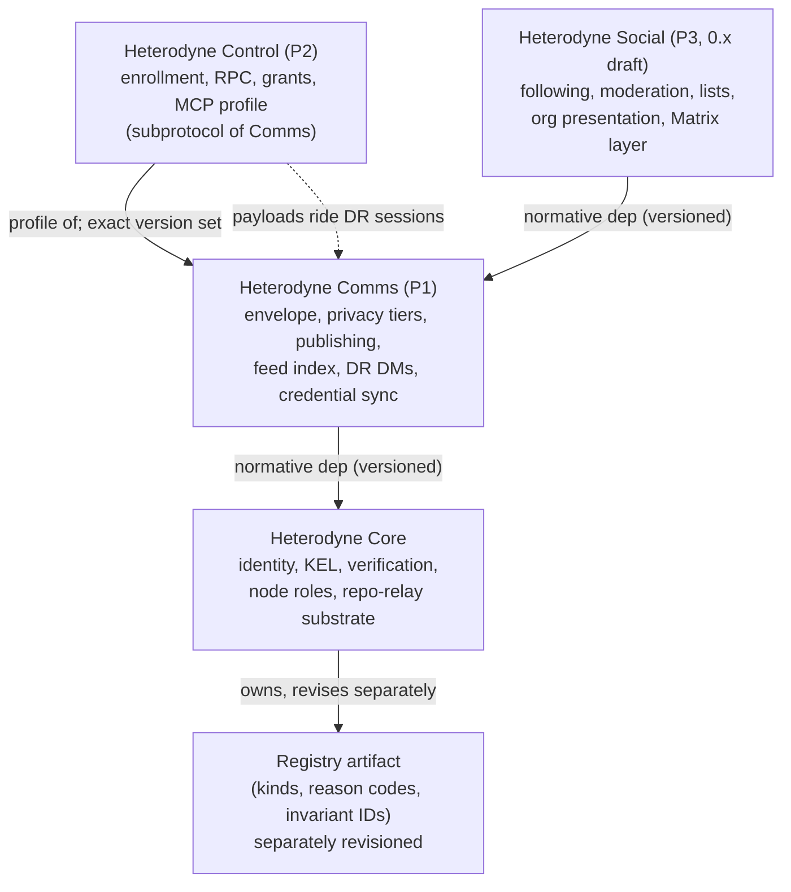

# ADR-033: Four-document protocol family - Core, Comms, Control, Social

**Date:** 2026-07-16
**Status:** Accepted (2026-07-16; default-model codex reviews rounds 1-5;
round 5: accept with no findings)
**Decision makers:** user (questionnaire); codex review

## Context

The user identified three fundamental protocols inside the single
`docs/spec/heterodyne.md` 0.4.x draft: (1) secure persona communication over
Nostr for any persona, human or nonhuman (identity, 1-1 messaging, 1-many
publishing); (2) command and control over Nostr (human-to-agent and
agent-to-subagent: enrollment, RPC, grants); (3) a social media protocol,
still to be fleshed out, that uses (1) for person-to-person communication and
(2) for communication between a person's own devices. The goal: release and
stabilize (1) and (2) while (3) stays under review.

Research (docs/research/2026-07-15-three-protocol-split-research.md) mapped
every spec section to a protocol, verified the dependency graph is acyclic,
surveyed prior art (atproto, KERI/ACDC, DIDComm v2, Matrix, ActivityStreams,
Nostr NIPs), and took the IETF downref rule (RFC 3967 / BCP 97) as the model
for the family's own constraint: a maturing document cannot depend on
artifacts a draft still churns. It also corrected the framing: only ADR-030
seeds protocol (2); ADR-031 (rotation breadcrumbs) is identity-interop.

A questionnaire (local subagent + codex star-chamber replacement, merged)
settled five decisions, fixed for this ADR:

1. Extract a full Foundation document beneath the three protocols.
2. Sibling spec documents in this repo; shared vector tree; per-document
   versions and git tags; separate repos deferred as a later graduation step.
3. Protocol (2) is normatively a subprotocol/profile of protocol (1),
   DIDComm-v2 style.
4. Own-device communication splits by trust class: credential plane
   (key-material/recovery-state transfer between fully-delegated trusted
   devices) stays in (1); control plane (config mutations, remote actions,
   session devices, agent RPC) is (2).
5. Thin P1: all social-shaped behavior (mute lists, following,
   replies/threading, org social surface, moderation) moves to (3).

## Decision

**Split `docs/spec/heterodyne.md` into four sibling normative documents in
this repository - Heterodyne Core (foundation), Heterodyne Comms (P1),
Heterodyne Control (P2, a Comms profile), and Heterodyne Social (P3, draft) -
with a strictly one-directional dependency graph, a separately revisioned
Core-owned registry artifact, owner-stamped qualified versions, and an
executable Thin-P1 closure list.**

The split is not mechanical - it changes version grammar, kind ownership,
conformance classes, and signed wire data - and executes as a follow-up
phase only after this ADR is accepted.

## Requirements (RFC 2119)

### A. Document set and dependency direction

1. The normative spec MUST become four sibling documents:
   `docs/spec/heterodyne-core.md` (Core), `docs/spec/heterodyne-comms.md`
   (Comms), `docs/spec/heterodyne-control.md` (Control),
   `docs/spec/heterodyne-social.md` (Social).
2. Normative dependencies MUST form this DAG and nothing else:
   Core <- Comms <- Control, Core <- Comms <- Social. A lower document MUST
   NOT normatively reference a higher one, and Social MUST NOT normatively
   depend on Control: a deployment wanting social plus own-device control
   composes conformance claims at the client level (req 30). A local
   downref rule modeled on IETF BCP 97 applies per type: documents are
   ordered 0.x < 1.0+ and a
   document MUST NOT normatively depend on a document at a lower level;
   registry entries are ordered draft < stable < frozen, a 1.0+ document
   MUST NOT normatively require a non-frozen entry, and a 0.x document MAY
   reference entries in any state.
3. Control is a subprotocol/profile of Comms: it defines no transport of its
   own and its payloads ride Comms double-ratchet sessions. Its conformance
   claim MUST be expressed as "Core + Comms conformant + Control profile".
4. `docs/spec/heterodyne.md` becomes a short non-normative family overview
   and document map. The final 0.4.x monolith MUST be preserved at a frozen
   archive path, and an old-section-to-new-anchor map MUST be published so
   ADRs and external links remain resolvable.

### B. Document boundaries

5. **Core** owns: KERI cold-root/epoch identity (KEL, rotation, compromise
   windows, replay), npub canonicality, `nip01_raw` canonical serialization,
   the verification algorithm (`kel_head` accelerator, provisional
   acceptance, repo authority - the ADR-032 material), root attestation,
   `kind:31005` identity pointer, `kind:31001` NID delegations, node roles,
   repo-relay substrate + NIP-01 adapter + materialized KEL refs,
   `kind:31010` node ads, Tor reachability, generic threshold authority for
   org/threshold personas, social recovery (recast per req 13), KERI social
   witnesses, did:webs export, the versioning and capability-negotiation
   mechanism, conformance/vector methodology, and the core threat model.
6. Core MUST be self-contained downward: it defines a generic
   encrypted-repository primitive parameterized by an encryption profile
   supplied by the instantiating higher document, plus a complete
   Core-owned protection profile for the local-only keys repository
   (at-rest store protection, NIP-49 wrapping) with no Comms dependency.
   The config repository's concrete encryption profile (Tier-3
   audience-key encryption and `enc/<key_id>` rotation) is Comms-owned and
   is bound to the Core primitive by Comms, never by Core. Payload schemas
   stored inside these repositories are allocated explicitly: Core owns
   identity and storage metadata (cold-root, epoch, and NID key material,
   NIP-49 wrapping, config-repository location); Comms owns audience-key
   and ratchet key material plus the repository-encryption profile; Social
   owns mute, feed-preference, and followed-repositories payloads.
7. **Comms** owns: the Nostr-native canonical event envelope;
   repo-visibility privacy tiers (public repo, private repo, Tier-3
   encrypted blobs with `kind:31011`/`kind:31012` audience keys and
   `enc/<key_id>` rotation); publishing flow (destination set, fan-out,
   idempotency); `kind:31007` feed index as generic outbox canonical
   ordering; event retrieval/backfill; outbox advertisement; generic feed
   and outbox location discovery; double-ratchet DMs (invites
   `kind:30078`, `kind:1060` wire, NIP-17 fallback, no-repo/no-backfill)
   with the acceptance-gating hook (req 16); credential-plane device sync
   (req 17); the subprotocol-negotiation frame (req 25); application of
   Core threshold authority to org-owned Comms posts and indexes (req 12);
   confidentiality invariants and forward-secrecy posture.
8. **Social** owns: replies/reactions/threading semantics,
   following/social-graph semantics, transitive social discovery,
   cross-persona advertisement, reply inboxes, moderation (NIP-72 approvals
   and Radicle editorial gating), personal mute lists and NIP-51 sets and
   community policy lists, NIP-32 labels, web-of-trust, org community and
   editorial and feed-presentation semantics, mixed-tier fan-out, starter
   packs, ATProto attached outbox, and the entire Matrix layer (MXID
   delegation, wrapped/bare envelopes, discussion rooms, Megolm/MLS, config
   room, homeserver exit, personal headless bridge, homeserver requirements,
   vanilla-Matrix interop, fallback rendering). Matrix MUST remain an
   optional feature INSIDE Social: a Matrix-free client can be fully
   Social-conformant, and Social and Social+Matrix are distinct claims.
9. The Thin-P1 closure list MUST be executed during the split - each of the
   following current leaks becomes Social policy or a generic lower-layer
   extension point: the §5.7.4 follow/reply/web-of-trust DM gate (becomes
   the req-16 hook); §3.8 private mutes and feed preferences (Social-owned
   payloads); the §3.8.7 followed-repositories list (Social-owned payload
   over Core storage); §7.3 follower-oriented discovery (Social); §6.7
   moderator-specific index rules (Social); the §3.0 declaration that
   NIP-51 lists are core constructs (retracted; NIP-51 handling becomes a
   Social profile, req 24).
10. Multi-homing splits: KERI/Radicle reconciliation, pointer resolution,
    and multi-full-node seeding are Core; Matrix MXID election, leases, and
    failover (§3.9.1-§3.9.7) are Social. The unqualified "multi-homing"
    label MUST NOT be used for the Core half.
11. Core discovery ends at npub -> RID -> serving node -> authoritative key
    material. Comms owns generic feed/outbox location. Social owns
    following, transitive discovery, cross-persona ads, and reply inboxes.
12. Org personas: Core defines generic delegate-threshold authority as an
    identity primitive; Comms MUST apply it to all org-owned Comms posts and
    feed indexes so that a lone org epoch-key holder cannot bypass
    delegate-threshold governance via relays (preserving the §6.7.0
    invariant); Social owns only community, editorial, and org-feed
    presentation semantics.
13. Core social recovery MUST be recast in social-neutral terms: recovery
    peers, declared witnesses, cached identity material, cold-root
    re-anchor. Social MAY bind those roles to follows, mutual follows,
    friends, and Matrix identity-room caches.
14. ADR-031 MUST be amended before acceptance: breadcrumb production and
    verification exclusion land in Core; following vanilla users and related
    UI land in Social.
15. ADR-030 integrates into Control PLUS bounded amendments to the lower
    documents: Core (registry and delegation extensibility for the
    session-device subtype), Comms (epoch-key invite, undelegated enrollment
    initiator, DR contexts, subprotocol negotiation). Control owns
    enrollment, RPC framing, grants, tokens, and MCP/agentic semantics.
    ADR-030 MUST be amended before its acceptance to conform to reqs 15,
    17, and 25, and MUST NOT be integrated into the monolith.

### C. DM acceptance-gating hook

16. Comms MUST define a normative hook contract: authentication precedes
    policy (the hook runs only after all cryptographic checks pass, and
    policy MUST NOT bypass or substitute for them); enumerated hook inputs
    and outcomes (at minimum accept, hold-as-message-request, reject);
    a Comms-native default policy; message-request behavior that emits no
    receipts or other sender-observable signals before acceptance; and
    separate gating contexts for ordinary DMs, credential-plane sync, and
    Control enrollment. Social's mute-list/web-of-trust policy is one
    pluggable implementation and MAY tighten admission but MUST NOT loosen
    or bypass Comms checks.

### D. Credential plane vs control plane

17. "Fully-delegated trusted device" MUST be a cryptographic authorization
    class, not a UI notion: credential-plane sync (keys-repository transfer
    over a DR self-DM) MUST require a durable NID-bearing `kind:31001`
    delegation plus an explicit credential-sync authorization, and MUST
    reject NID-less session devices. The credential-sync authorization MUST
    be signed, bound to the target NID and to the credential-sync purpose,
    KEL-validated, and revocable; its exact schema is defined in the split
    phase. ADR-030's rule that epoch, audience,
    and NID secrets never leave the full node is scoped to the
    Control/session-device path and does not prohibit Comms credential-plane
    sync between devices holding the req-17 authorization.

### E. Registries

18. The kind-number registry, the reason-code vocabulary, and the security
    invariant identifiers move into a Core-owned, separately revisioned
    registry artifact with its own monotonic revision, formally excluded
    from Core's semver: adding or changing a non-Core-owned entry MUST NOT
    bump Core's version. Every document release, release manifest,
    capability advertisement, vector, and coverage manifest MUST pin the
    registry revision (or an immutable entry-set digest) it was produced
    against, so any conformance claim can reproduce the exact kind,
    reason-code, and invariant allocation set in force when it was made.
19. The kind registry schema MUST carry, per kind: allocation authority,
    base-schema owner document, stability status (frozen | stable | draft),
    and optional per-profile owners with discriminators. Profile
    discriminators are immutable: any semantic change to a profile MUST
    allocate a new discriminator or profile identifier, so a historical
    relay-published event is unambiguously bound to one profile revision
    without carrying a version. Known dual-use entries: `kind:31001` (Core
    base schema; Control session-device profile, req 24), `kind:31007`
    (Comms base; Social org-presentation profile), and adopted upstream
    kinds (external semantic owner, req 24) - including `kind:0` and
    `kind:1`, whose Core breadcrumb production profiles (amended ADR-031)
    are non-stamping.
20. Freeze rule: before any document claims 1.0, every registry entry it
    normatively requires MUST be frozen. Entry states transition
    monotonically (draft -> stable -> frozen); a frozen entry MUST NOT be
    semantically mutated, removed, or reassigned - corrections allocate a
    new entry.
21. 1.0 downref gates beyond the registries: the nostr-double-ratchet wire
    protocol MUST be extracted and frozen (as the current spec already
    promises) before Comms claims 1.0; Core MUST pin or locally profile any
    draft KERI behavior it normatively uses.

### F. Versioning and wire stamping

22. Versions are qualified identifiers `<doc-id>/<semver>` with doc-ids
    {core, comms, control, social}; Core MUST define the formal grammar.
    The qualified string is not itself semver and MUST NOT be fed to bare
    semver parsers; the semver component carries the compatibility rules.
23. Core MUST define version placement per event class: kinds whose content
    is Heterodyne-defined JSON keep an in-content `spec_version`; Heterodyne
    kinds with empty or non-JSON content carry a defined version tag; adopted
    upstream events without a stamping profile are unstamped, and an event
    opted into a stamping profile (req 24) carries the profile owner's
    stamp via the version tag, never by altering the upstream content
    shape; the DR outer wire
    (`kind:1060`/`kind:1059`) MUST NOT carry any version marker (metadata
    privacy); DR inner rumors stamp inside ciphertext. This changes signed
    bytes and event ids and is an allowed 0.x break.
24. Owner-stamp rule: only core, comms, and social versions are ever
    stamped, and an event carries exactly one stamp - the base-schema
    owner's version - unless a registry profile overrides it. Adopted
    upstream kinds are unstamped by default; each profile registered on an
    upstream kind MUST declare itself stamping or non-stamping. A stamping
    profile's in-band discriminator opts the event into the profile
    owner's ownership and stamp (the Social-profiled `kind:10000` mute
    list stamps social/<semver>; a plain upstream NIP-51 event remains an
    unstamped interoperability input; Social defines the profile marker).
    Non-stamping profiles bind production and consumption rules with no
    stamp (the `kind:0`/`kind:1` breadcrumb profiles, which MUST stay
    legible to vanilla Nostr). Control has no stamping authority anywhere:
    a relay-published Control-profiled event stamps its base-schema
    owner's version (the session-device `kind:31001` stamps core/<semver>)
    and is version-bound by its immutable discriminator (req 19);
    session-carried Control payloads ride Comms-owned generic
    subprotocol-carrier rumor kinds, stamp comms/<semver> inside ciphertext
    (req 23), and are version-bound by the req-25 negotiation.
25. Control MUST NOT stamp a version on any wire event; the rumor kinds
    that carry Control payloads are Comms-owned generic subprotocol
    carriers. Comms MUST provide a minimal subprotocol-negotiation frame
    (protocol id + supported Control versions) that runs inside the
    session before any session-carried Control payload is interpreted; the
    negotiated Control version MUST be retained in local audit records.
    Relay-published Control-profiled events are outside session negotiation
    and are version-bound per reqs 19 and 24. The Comms stamp identifies
    the carrier version only.
26. Each Control release MUST declare an exact set of supported Comms
    versions while either document is 0.x (bounded ranges are permitted only
    from 1.0), plus required Comms features (at minimum the DR feature).
27. Migration rule for 0.4 history: unqualified "0.4.0" stamps map to the
    archived monolith; the missing-stamp inference applies only to
    Heterodyne-allocated kinds the monolith stamped (unstamped adopted
    upstream events, including post-split non-stamping profiles, are never
    legacy-inferred); a documented owner-inference rule covers legacy
    events; existing signed events MUST NOT be restamped and remain
    authoritative as signed.
28. Lineage: all four documents start at 0.5.0 as four first releases
    descended from monolith 0.4.x (stated explicitly; not a synchronized
    family version), with per-document git tags (core/v0.5.0, ...), one
    CHANGELOG.md with per-document sections, and a release manifest per tag
    recording the exact cross-document dependency combination.
29. Capability advertisements MUST always include Core (every implementation
    is Core-conformant) with a stable bootstrap parse path, and MUST carry
    per-document supported-version sets. The guarantee that no event stamps
    a version its consumer never negotiated applies to peer-bound sessions
    only; for asynchronous broadcast, a consumer encountering an unknown or
    unsupported stamped version MUST apply Core's unknown-version handling
    (reject or degrade, descending from the monolith's §12 rules).

### G. Conformance classes and strict mode

30. Conformance classes: Core (every implementation); Core+Comms =
    "Heterodyne persona"; Control profile (feature-qualified: the Comms DR
    feature MUST be required even where base Comms conformance permits
    omitting DM support); Social (exact-version conformance claims while
    0.x, explicitly unstable); Social+Matrix (per req 8). Conformance
    claims MUST name required features, not only documents.
31. The legacy uppercase "CORE" label (used for DM and Matrix-independence
    claims in the 0.4 monolith) MUST be retired and renamed to avoid
    collision with the Heterodyne Core document name.
32. Strict mode splits into per-document profiles with stable profile IDs
    and explicit composition rules (which combinations may be claimed
    together); strict-mode claims appear in capability advertisements and
    conformance reports.
33. §13 and docs/security/threat-model.md split by owner with namespaced
    invariant IDs (CORE-I*, COMMS-I*, CONTROL-I*, SOCIAL-I*); mixed
    invariants (current I1, I3, I6, I7) are decomposed; Control's encrypted
    audit requirement MUST NOT depend on a Social invariant.

### H. Cross-document referencing and migration

34. Stable document IDs and permanent section anchors MUST be defined;
    normative cross-document references MUST be version-bound (document id +
    version + anchor), not bare relative links to the current checkout.
35. Migration sequencing MUST be: (0) this ADR accepted; (1) the in-flight
    ADR-032 spec integration lands in the monolith first; (2) the four-way
    split executes (including the closure list, registry artifact, version
    grammar, conformance classes, and companion-doc updates); (3) ADR-030
    integrates into Control (+ bounded lower-document amendments, req 15)
    and amended ADR-031 into Core, upon their respective acceptance. ADR
    numbering and `docs/adr/` remain global to the repo.
36. Companion documents MUST be updated in the split phase:
    docs/architecture.md becomes the non-normative family architecture (with
    the four-layer dependency graph); README.md, CLAUDE.md, AGENTS.md,
    docs/glossary.md (non-normative index; shared normative terminology
    moves into Core, document-local terms into their owners),
    docs/security/threat-model.md, vector documentation and schema, and
    research/INDEX.md all stop describing a single normative specification.
    The `docs/spec/extensions/{nips,mscs}/` indexes remain upstream-facing
    extraction indexes (not containers for sibling protocols) and their
    stale monolith anchors are re-qualified.

### I. Vectors and coverage

37. The fixture schema becomes version-neutral: `fixtures.json` carries a
    document-version map instead of a single `spec_version`; the generator's
    hard-coded SPEC_VERSION is replaced. Every vector carries
    `owner_document`, `owner_version`, and `dependency_versions` where
    applicable.
38. Owner assignment is per vector, not per category. Corrections to the
    category-level draft mapping: existing `envelope/` vectors are Matrix
    wrapped/bare behavior and belong to Social - Comms gets new Nostr-native
    envelope vectors; `interop/` splits (Social wrapped/bare/follow vs Core
    `kind:31005`); `org/001-003` are Core identity governance, `org/004` is
    Comms org-content authorization; existing `redundancy/` vectors are
    Matrix mirrors and belong to Social - Core gets new Radicle multi-host
    redundancy vectors; `social-recovery/` splits per vector
    (social-neutral recovery-mechanism vectors to Core;
    follower/mutual-follow/friend-cache policy vectors to Social, per
    req 13); `config-backup/` splits per vector along the req-6 payload
    allocation (Core identity/storage metadata; Comms repository-encryption
    profile and audience/ratchet material; Social payloads). Any vector
    whose behavior changes under the split MUST receive a new vector id;
    existing vector ids are immutable.
39. The generator MUST emit one machine-readable coverage manifest (vector
    id, owner, profile, qualified spec references, dependency versions) and
    derive from it four filtered per-document coverage maps plus one family
    aggregate; hand-maintained parallel maps MUST NOT exist.
40. Control MAY publish an explicitly incomplete 0.5 draft with no
    vector-conformance claim, but MUST NOT claim the Control profile with
    zero vectors; the minimum corpus is ADR-030's list (enrollment
    binding/finality, stale invite rejection, grant enforcement including
    security-policy write refusal, request replay/expiry, token atomicity
    and issuer binding, revocation/inactivity lapse,
    capability-exchange-before-invocation, agent execution
    default-deny/cancellation).
41. Acceptance-gating coverage spans three documents: Comms vectors for hook
    ordering, outcomes, and no-receipt message requests; Social vectors for
    mute/web-of-trust policy; Control vectors for enrollment
    challenge/token gating that does not depend on Social state.
42. The reason-code artifact remains one file but only as a container: each
    code carries owner, status, and first-version metadata; each document's
    conformance set selects only its owned or normatively required subset;
    bare section references are replaced with qualified document anchors.

## Rationale

- Full Foundation extraction gives the shared registries and verifier an
  owner no protocol's release cadence holds hostage (KERI/ACDC, atproto).
- One repo with per-document versions and tags delivers the "P1/P2 stable,
  P3 draft" signal at near-zero migration cost (Matrix precedent).
- Control-as-profile is honest about Control riding Comms' wire and
  dissolves the dual-stamp problem (DIDComm v2 subprotocol precedent).
- The credential/control split follows the documents' own trust classes:
  durable NID-bearing devices replicate key state; session devices never do.
- Thin P1 gives Comms an atproto-like "secure speech" scope; the review
  made it an executable closure list and restored the one security
  invariant thinning would have dropped (org threshold authority, req 12).

## Alternatives Considered

- Fold foundation into P1: matches the "3 fundamental things" framing, but
  P1's 1.0 bar absorbs all remaining KERI churn and the registries get no
  neutral owner (rejected by questionnaire decision 1).
- Identity-only extraction: topology and the kind registry still have no
  home; the downref problem is only half-solved.
- Separate repos now: 3-4x CI/vector plumbing and published shared fixtures
  while Control has zero vectors; deferred as an explicit graduation step.
- One partitioned document / core-plus-extensions tier: no legible
  per-document stability signal; "extension" framing undersells co-equal
  protocols and converges on sibling docs anyway.
- Co-equal Control with its own wire stamp: the independence is fictional
  (no transport of its own); dual-stamping is a wire cost paid purely for
  positioning.
- Broad P1 or mechanism-vs-policy split: user chose Thin P1; the closure
  list (req 9) and hook contract (req 16) resolve the dependencies these
  were meant to avoid.
- P2 owns all own-device communication: puts backup/recovery on the least
  mature protocol's critical path and conflicts with ADR-030's key-custody
  rule.

## Assumed Versions (SHOULD)

- Radicle Heartwood: 1.9.x (verified against 1.9.1)
- nostr-double-ratchet: 0.0.138 (deliberate exact pin; extraction/freeze is
  a Comms 1.0 gate, req 21)
- nostr-tools 2.x; @noble/* as pinned by the vector generator
- MCP (Model Context Protocol): revision 2025-11-25
- KERI: ToIP KSWG draft; arXiv 1907.02143

## Diagram

<!-- SVG renderer unavailable; Mermaid source below is authoritative -->

Mermaid source

A social client's own-device control-plane usage is client-level
conformance-claim composition (reqs 2 and 30), not a document dependency,
and is deliberately absent from the graph.

## Consequences

- The split executes in a follow-up phase (after this ADR is accepted and
  the in-flight ADR-032 integration lands in the monolith): four documents,
  the registry artifact, the qualified version grammar, per-event-class
  stamp placement (a signed-bytes 0.x break), conformance classes, strict
  mode profiles, threat-model decomposition, and companion-doc updates.
- The vector corpus is reworked per vector (owner metadata, corrected
  assignments, new Comms envelope and Core redundancy vectors, split
  config-backup and interop categories) with a generator-emitted coverage
  manifest; the Control corpus is authored before any profile claim.
- ADR-030 and ADR-031 require amendments before acceptance (reqs 14-15);
  their integrations target the new documents, never the monolith.
- The 0.4.x monolith is archived with a section-to-anchor map; the
  uppercase "CORE" conformance label is retired.
- Comms 1.0 gains explicit downref gates: frozen registry entries, an
  extracted/frozen DR wire spec, and pinned KERI behavior in Core.
- Security-significant behaviors decided here and visible to implementers:
  the DM acceptance hook with receipt suppression before acceptance
  (req 16); the signed, NID- and purpose-bound, KEL-validated, revocable
  credential-sync authorization class (req 17); org threshold-authority
  enforcement below Social (req 12); exact Control-to-Comms pinning with
  session-scoped subprotocol negotiation (reqs 25-26);
  registry-revision pinning across releases, capability advertisements,
  vectors, and coverage manifests (req 18); and the distinct Social vs
  Social+Matrix conformance claims (req 8).

## Council Input

- Question generation ran in parallel (local subagent + codex as the
  star-chamber replacement); merged sets converged on foundation extraction
  and one-repo packaging; the user overrode one recommendation (Thin P1).
- Codex architecture review round 1 (default model, 2026-07-16): "needs
  another round" - 20 BLOCKING, 13 SHOULD-FIX, 1 NIT across soundness,
  version choices, missing concerns, and testability; all integrated as
  requirements above.
- Codex ADR-text review round 2 (default model, 2026-07-16): "needs another
  round" - 5 BLOCKING, 6 SHOULD-FIX; all integrated (stamp rules, DAG
  diagram, registry-revision pinning, per-vector splits, credential-sync
  authorization properties, RFC 2119 normalization).
- Codex ADR-text review round 3 (default model, 2026-07-16): "needs another
  round" - 4 BLOCKING, 1 SHOULD-FIX, 2 NIT; all integrated (keys-repository
  protection profile, stamping/non-stamping profiles, Comms-owned Control
  carriers, immutable discriminators, scoped legacy inference).
- Codex ADR-text review round 4 (default model, 2026-07-16): "needs another
  round" - 1 BLOCKING, 2 SHOULD-FIX, 1 NIT; all integrated (req-23 scope,
  frozen-entry immutability, ADR-030 amendment mandate, BCP 97 as model).
- Codex ADR-text review round 5 (default model, 2026-07-16): "accept" - no
  BLOCKING, SHOULD-FIX, or NIT findings; all four round-4 fixes verified.
