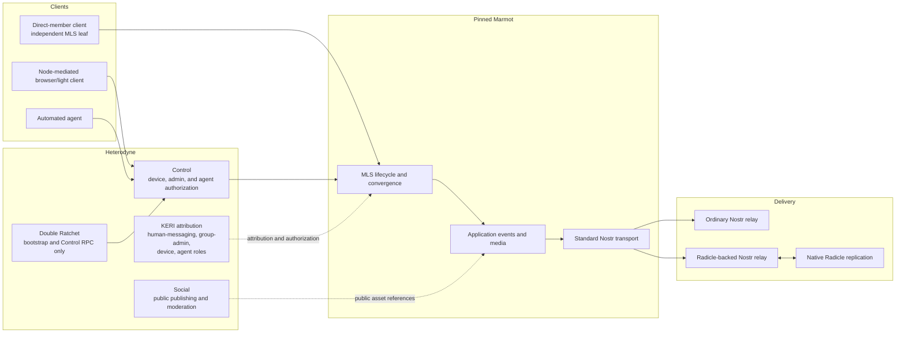
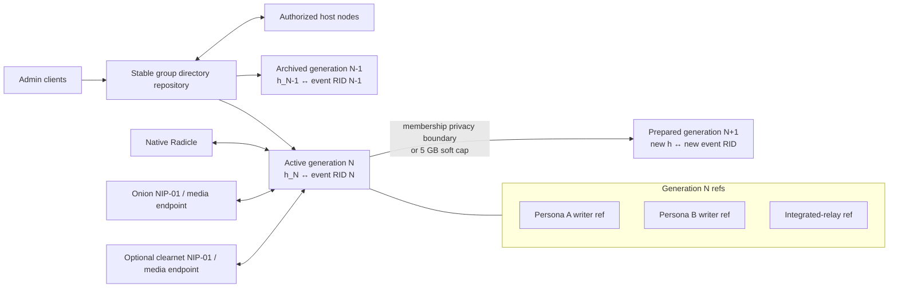

# ADR-040: Marmot and Radicle Group Messaging

**Status:** Accepted

**Date:** 2026-08-06

This archived record captures the decision at acceptance time. It is
non-canonical; the live specification family and normative artifacts contain
the complete protocol.

## Goal

Replace Heterodyne's Matrix-based private and group communication model with
Marmot, while preserving Heterodyne's KERI identity, multi-device and agent
control, Radicle replication, and public Social layers.

Heterodyne adopts Marmot as the canonical conversation engine. Heterodyne does
not fork Marmot's MLS state machine, application messages, media encryption, or
Nostr transport. It adds external identity attribution, authorization,
repository profiles, and deployment adapters around those surfaces.

The result supports:

- ordinary Marmot clients and relays for standard-compatible groups;
- Radicle-backed storage and synchronization for Heterodyne clients;
- non-discoverable, Radicle-only private groups that retain Marmot
  cryptography and event formats;
- direct-member and node-mediated clients;
- attributed, policy-constrained agent participation;
- two-member Marmot groups for ordinary direct conversations;
- Radicle persona inboxes for first contact, replies, and reactions.

## Non-goals

This change does not:

- define a second MLS protocol or change Marmot convergence;
- introduce a Heterodyne-specific Marmot application component;
- copy Marmot's normative text into Heterodyne;
- retain Matrix, Megolm, Matrix rooms, or Matrix bridges;
- use Marmot's draft multi-device External Commit profile;
- make Radicle delegates group administrators;
- use Double Ratchet as a second user-facing chat system;
- require a TURN service or direct client-to-node connectivity;
- claim that retention expiration erases independently replicated Git data.

## Dependency and authority

Heterodyne pins Marmot commit
`4ad4ae21479c3f3fa9950c6fc4556a76941a62e1` until Marmot publishes a suitable
stable tagged release. Updating the pin is a material protocol change and
requires an ADR, complete specification integration, artifact updates, and
conformance review in the same patch.

Marmot remains authoritative for:

- MLS group creation, membership, proposals, commits, Welcomes, and
  convergence;
- account credentials and account-to-leaf proofs;
- unsigned Nostr-shaped application events;
- group messaging, edits, replies, reactions, and group-scoped long-form
  content;
- encrypted-media v2;
- Nostr KeyPackage, Welcome, and kind-445 transport envelopes;
- publish-before-apply behavior and retained MLS state.

Heterodyne remains authoritative for:

- KERI controller, persona, device, admin, and agent-role attribution;
- Control authorization and node-mediated access;
- OIDC workload tokens and mandatory automation attribution;
- Radicle repository layout, admission, retention, and replica operation;
- public/audience publishing, public communities, moderation, citations, and
  durable Social assets.

An event can be valid Marmot without carrying currently valid Heterodyne KERI
attribution. Missing, stale, or revoked KERI evidence removes verified
Heterodyne attribution and authorization; it does not rewrite Marmot group
history or convergence.

## Architecture



Matrix and Megolm have no place in this architecture.

## Identity and client participation

### Marmot account roles

Each persona has a stable `human-messaging` Marmot account key delegated by its
KERI controller. Its private key remains on a full or recovery node. Devices
have independent MLS leaf keys. A full or recovery node uses Control authority
to produce Marmot's standard account-to-leaf proof for each authorized device.

A separate stable `group-admin` Marmot account role performs group
administration. It is held only by designated full or recovery nodes.
Separately governed automation uses `agent:<role-id>` accounts. A generic full
node normally has one agent role; a newsletter, news aggregator, or comparable
pipeline may have a distinct role and key.

Group privilege is account-scoped. Independent device leaves do not share leaf
keys merely to share privilege.

### Leaf ownership

Independent leaf keys are the default. An encrypted leaf backup or transfer is
allowed only as an exclusive takeover: the old instance is deactivated or
fenced before the restored instance becomes active. Concurrent use of one leaf
by multiple devices is invalid.

Heterodyne does not adopt Marmot's draft multi-device External Commit feature.
New devices use standard KeyPackages, Add commits, and Welcomes.

### Client modes

A `direct-member` client owns an independent MLS leaf and can communicate
without a full node after admission. It receives history from its join epoch.

A `node-mediated` client owns no group leaf. A designated full or recovery node
participates in the group and exposes grant-filtered conversation operations
and retained history through Control. MLS secrets do not leave that node.
Browser/light clients may use either mode where their capabilities permit.
Agents must use node-mediated Control.

An exclusive leaf restore may recover retained history and epoch secrets
included in its encrypted backup. Heterodyne does not automatically export old
epoch secrets to a new independent leaf.

## Conversation boundaries

Ordinary user-facing one-to-one chats are two-member Marmot groups. Double
Ratchet is retained only for point-to-point bootstrap, device and agent RPC,
and token issuance through Control.

Marmot owns private conversation content, replies, reactions, attachments,
edits, and group-scoped long-form messages. Heterodyne Social owns durable
public or audience assets that require a Radicle identifier, history, feed,
stable link, citation, moderation, or later broader publication. Public
community discussion remains Social rather than an open Marmot chat.

Delivery configuration is per group and client:

- `failover` uses a preferred target and falls back after rejection, timeout,
  or unavailability;
- `redundant` submits the same signed Marmot event through all configured
  targets immediately.

The first valid durable acknowledgement satisfies publish-before-apply.
Outstanding redundant attempts continue, and event-ID deduplication prevents a
second logical message.

## Group profiles

### Standard-compatible group

A standard-compatible group uses Marmot's unmodified Nostr transport. Ordinary
Marmot clients can join and communicate through advertised Nostr relays.
Heterodyne clients may additionally use Radicle-backed storage. The Radicle
layer never changes the bytes visible to a standard client.

### Heterodyne-private group

A Heterodyne-private group is non-discoverable and Radicle-only. Its static
directory and routing-generation event repositories are private Radicle
repositories. Admission requires an admin to authorize the persona's Radicle
NID and privately deliver the repository and group bootstrap information to
that persona.

This profile still uses valid Marmot MLS state, application events, media, and
transport-envelope bytes. It is not interoperable with an ordinary Marmot
client because discovery, admission, and synchronization require Heterodyne's
private Radicle profile. The incompatibility stops at that transport and
admission boundary.

Private groups fail closed when no authorized Radicle route is available.
They never fall back to an undeclared public relay.

## Repository topology

Each group has one stable directory repository and a sequence of event
repositories. Event repositories are defined by Heterodyne routing generations,
not by every MLS epoch.



### Static group directory

The static repository carries stable group identification, public profile
fields, public policy, host announcements, sealed invites, routing bindings,
retention data, membership-related administration, mute lists, and moderation
metadata.

A discoverable group has a public static repository. Public fields are
plaintext. Event-repository locators, private membership data, private
administrative records, and other sensitive fields are encrypted for current
members. Invites are individually sealed to their recipients. A public-group
policy may explicitly publish normally private fields.

A non-discoverable group has a private static repository. Its Radicle allowlist
is an admission boundary. Sensitive records remain encrypted at the
application layer for defense in depth because private Radicle repositories
provide selective replication rather than encrypted storage.

After a member is removed, hosts remove its NID from future repository
replication and the member cannot decrypt newly published directory records.
Old clones and objects remain subject to the non-erasure rule.

### Routing generation

Marmot's `h` tag is the current random `nostr_group_id`; it is not the MLS epoch
number. One Heterodyne routing generation maps one-to-one to one `h` and one
event-repository RID.

A new routing generation rotates both the `nostr_group_id` and the active
event repository:

- when a member is added or removed;
- when the active repository reaches the 5 GB logical soft cap;
- when an admin explicitly rotates routing after compromise or operational
  failure.

Other MLS commits do not rotate the event repository. A routing update itself
creates an MLS epoch, so Heterodyne must not describe repositories as rotating
after every MLS epoch.

For an addition, the prepared repository and new `h` are included in the Add
transition so the Welcome delivers the resulting routing state to the new
member. For a removal, the removal commit becomes canonical first. A remaining
admin then publishes a separate routing update from the post-removal state,
matching Marmot's routing-privacy sequence.

The 5 GB threshold is computed from the logical unique sizes of stored event
objects and encrypted media objects rather than Git packfile size. Crossing it
stops new application/media admission and initiates rotation. The soft cap
never blocks commits, proposals, or other bounded control traffic needed to
repair or rotate the group.

### Event repository

An event repository is append-only at the logical protocol layer. It has no
merged canonical message branch.

Routing-generation event repositories are private by default for both
discoverable and non-discoverable groups. This limits exposure of writer refs,
traffic patterns, repository relationships, and encrypted history. A group may
explicitly authorize public Radicle replication, but doing so is a metadata
disclosure decision independent of Marmot's content encryption. Ordinary
Marmot clients do not need repository access; they use an advertised Nostr
relay.

Each native Radicle writer publishes to its own NID ref. An integrated relay
publishes relay-ingested events to a designated relay ref. Hosts replicate the
valid refs. Logical repository contents are the union of valid objects
reachable from authorized refs, deduplicated by Nostr event ID or encrypted
media object hash.

Radicle writer identity is storage provenance only. Marmot sender
authentication comes from the decrypted MLS message. A relay cannot infer the
Marmot sender from kind-445's fresh ephemeral event key.

Events are indexed by exact Nostr event ID and `h`. Encrypted media is indexed
by ciphertext hash and the Heterodyne `radicle-v1` locator profile. A message
may advertise both `radicle-v1` and standard Marmot/Blossom locators.
Unsupported locators retain Marmot's normal skip behavior.

### Exact-byte rule

Every stored message object is the exact serialized signed Marmot/Nostr event.
A native writer creates the standard event before committing it. A relay
commits a received event unchanged. A Nostr interface reads the stored bytes
and returns or republishes them unchanged.

Radicle commits and indexes do not re-sign, wrap, translate, or reinterpret the
event. The exact same kind-445 bytes and encrypted media ciphertext are
available through native Radicle, onion NIP-01/media access, and optional
clearnet NIP-01/media access.

The only permitted “translation” is between repository file/index lookup and
the NIP-01 or media-server request/response interface.

## Relays and hosts

An optional full-node feature,
`comms.radicle-backed-marmot-relay.v1`, exposes a standard NIP-01 relay backed
by event repositories. It may be onion-only, clearnet-only, or both. It is not
a baseline requirement for every full node.

The relay maps `h` directly to an event repository. It does not need the stable
group identifier, member list, MLS epoch, admin policy, or static repository.
It verifies the visible NIP-01 envelope and commits exact bytes to its relay
ref.

Because kind-445 uses a fresh ephemeral event key, an optional write allowlist
cannot use the event pubkey as member identity. Restricted relays use NIP-42
connection authentication with an authorized stable Marmot account or active
KERI-delegated device/agent key. This is anti-abuse admission only; MLS remains
the sender authenticator.

Groups have one or more host nodes. Admin nodes are hosts by default. Hosts:

- replicate the static, active, and retained archive repositories;
- advertise permitted Radicle, onion, and clearnet access;
- enforce repository admission and retention;
- create prepared repositories and routing bindings;
- initiate authorized membership and routing commits;
- preserve Control and KERI authorization boundaries.

Light clients do not require Radicle NIDs unless they use native Radicle
membership. Standard clients can remain Nostr-only.

## Host authority and equivocation

Radicle delegates are replication operators, not group authorities. Neither a
Radicle default branch nor delegate threshold selects Marmot group state.

Static-repository changes are signed announcements. A routing binding includes:

- stable group identifier;
- new `h`;
- event-repository RID and genesis-manifest digest;
- previous routing-generation reference;
- authorized host set and advertised interfaces;
- retention metadata;
- signing admin and the Marmot routing commit it accompanies.

A client accepts a binding only when:

1. the signer was an active Marmot group admin;
2. the signer authored the canonical Marmot routing commit establishing the
   same `h`; and
3. the repository's genesis manifest matches the binding.

Other authorized hosts may advertise replicas and endpoints for the bound RID.
They cannot substitute another repository.

Concurrent routing commits are resolved by Marmot convergence. Prepared
repositories attached to losing commits are abandoned and eventually
garbage-collected. Two different bindings for the canonical `h` are admin
equivocation. Radicle-native transition fails closed, clients retain the last
valid generation or use an already authorized standard Nostr path, and an
admin repairs the group with a new routing rotation.

## Rotation transaction

```mermaid
stateDiagram-v2
    [*] --> Active
    Active --> Preparing: membership boundary, 5 GB, or admin rotation
    Preparing --> Publishing: new repo, random h, genesis, binding, host replicas ready
    Publishing --> Active: publication fails; old generation remains active
    Publishing --> Applying: old-h routing commit receives durable acknowledgement
    Applying --> NewActive: apply new epoch and h; publish encrypted directory entry
    NewActive --> Overlap: prior generation retained for rollback/history
    Overlap --> Expired: signed retention period ends
    Expired --> [*]: stop serving and announce removal; garbage-collect where possible
```

Preparation happens off-path. The new repository does not become authoritative
until its Marmot routing commit is durably published through the old
generation. If publication fails, the old generation remains active and the
prepared repository is retried or abandoned.

For native Radicle publication, durable acknowledgement requires:

- the exact event and referenced objects committed to the writer's ref;
- those objects durable locally;
- the ref announcement accepted by at least one configured host.

For integrated Nostr publication, the relay returns NIP-01 `OK` only after:

- event ID, signature, tag cardinality, `h`, and local limits validate;
- exact bytes are durably committed to the relay ref.

Standard-compatible groups may try another host, a direct Radicle peer, or an
ordinary Nostr relay. Heterodyne-private groups queue locally and fail closed
when no authorized route exists.

Clients monitor the current generation and the prior routing IDs required by
Marmot's rollback horizon. Additional archives remain available according to
the signed group retention policy.

## Retention

When an archive expires, conforming hosts remove it from the encrypted active
directory, stop advertising and seeding its refs, and remove local refs.
Conforming clients stop requesting or serving it and garbage-collect local
objects where their storage system permits.

NIP-40 expiration remains part of exact kind-445 bytes where Marmot requires
it. Repository-level retention complements rather than rewrites event
expiration.

Expiration is not erasure. Independent Radicle peers, Git objects, exports, and
backups may survive. Protocol and UI language must state this limitation.

## Persona repository inbox

A persona repository may publish Marmot KeyPackages and expose a contributor-
ref inbox. The inbox is a delivery binding, not a canonical-profile write.
Sender refs are never merged into the persona's canonical profile branch.

When no direct-message group exists, a sender:

1. retrieves and consumes one recipient KeyPackage;
2. creates a standard two-member Marmot group;
3. produces the exact Welcome transport artifact;
4. produces the first exact kind-445 event;
5. commits an atomic contact bundle on its sender-specific Radicle ref in the
   recipient persona repository.

The first application event may be a DM, reply, or reaction referencing a
public or privately shared Heterodyne asset. All initial DMs and reactions use
this mechanism; Heterodyne does not define a one-shot encrypted payload.
Subsequent communication uses the established group's routing-generation
repository. A later reaction from the same sender reuses an existing suitable
DM group.

The recipient validates the Welcome and first event before joining or
presenting the request as an accepted conversation. Ignoring or rejecting a
request does not mutate the sender's ref or create global moderation power.

A private persona repository accepts inbox refs only from Radicle NIDs already
authorized to replicate it. Unknown first contact must use a public inbox or
another authorized bootstrap path.

### Public inbox quarantine

Unknown public-inbox refs enter a pull-based quarantine:

- the client fetches a bounded bootstrap manifest before larger objects;
- the manifest identifies sender NID, consumed KeyPackage, event IDs, object
  sizes, and automation status;
- no unknown bundle can trigger automatic media retrieval;
- encrypted media locators are fetched only after explicit policy or user
  action;
- duplicate KeyPackage use, malformed artifacts, muted senders, excess local
  rate, unsupported capabilities, and objects over local limits are discarded;
- seed and host nodes may impose stricter quotas without changing protocol
  validity.

Public-inbox admission is local and persona-scoped. Publishing a ref does not
force its visibility, acceptance, or replication.

## Automated agents

Radicle carriage does not create an alternate agent-authorship path.

An AI or programmatic principal uses the existing built-in OIDC issuer and a
five-minute, sender-constrained workload token. The token scopes the exact
group, permitted application kinds, media types, object size, rate, and burst.
The agent submits intent through Control and receives no account key, MLS leaf
secret, agent-role private key, or repository credential.

The full node validates active authority, constructs the unsigned inner Marmot
application event, inserts canonical automation-attribution tags, and sends it
through the authorized full-node-held agent-role leaf. Verification binds:

- inner application-event pubkey;
- MLS sender account;
- KERI agent role;
- workload-token role and scope;
- automation-attribution tags.

Unsupported application kinds fail closed. Public persona-inbox quarantine
retains automation labels and may filter agents independently.

## Media

Marmot encrypted-media v2 remains the media format and cryptographic authority.
Heterodyne retains `radicle-v1` as a locator and storage profile. Messages may
carry repeated locators, including both Radicle and Blossom locations.

Radicle-native readers locate media by ciphertext hash from the event
repository and its advertised object stores. NIP-01/media readers obtain the
same ciphertext through onion or clearnet endpoints. A locator that a standard
Marmot client does not understand is skipped under Marmot's normal rules and
does not invalidate the message.

## Future Marmot identity proposal

Heterodyne should later draft a narrow upstream Marmot identity proposal for
optional KERI attribution. It must retain Marmot's 32-byte Nostr account as the
credential identity and retain the standard account-to-leaf proof. KERI would
add controller, role, rotation, and revocation attribution above Marmot
validity and must never determine MLS convergence.

The proposal should use Marmot's current contribution format at the time it is
submitted rather than reviving the deprecated MIP-era format.

## Specification integration

The implementation patch rewrites the prepared, unreleased 0.5.0 family in
place.

`heterodyne-core.md` gains KERI-to-Marmot role bindings, persona-to-Radicle-NID
bindings, host roles, private-repository admission, and related registry
material.

`heterodyne-comms.md` gains the pinned Marmot dependency, group profiles,
conversation boundary, routing generations, repository formats, relay profile,
exact-byte rule, media locators, persona inbox, retention, and failure
behavior. Double Ratchet becomes Control/bootstrap-only.

`heterodyne-control.md` gains leaf authorization, designated-node group
operations, host authorization, NID admission/removal, routing rotation,
node-mediated conversation operations, and agent-group operations.

`heterodyne-social.md` becomes public Social only. It retains public publishing,
feeds, communities, moderation, and references used by private replies or
reactions. Matrix is removed entirely.

The patch also updates:

- registries and registry digests;
- JSON schemas for repository manifests, bindings, and inbox bundles;
- release metadata and profile/invariant inventories;
- threat model and architecture documentation;
- all generated coverage tables and conformance vectors.

The accepted protocol ADR and complete specification/artifact integration
belong in the same patch. The accepted ADR is archived before merge, after
which the specification stands alone.

## Conformance

The normative corpus must cover:

- exact kind-445 and encrypted-media byte identity across native Radicle,
  onion, and clearnet interfaces;
- interoperability of standard-compatible groups with an unmodified Marmot
  implementation;
- valid Marmot cryptography and payloads inside a Heterodyne-private group,
  with required Radicle discovery and admission;
- static-directory public/private field handling and sealed invitations;
- routing-generation bindings, genesis verification, previous-generation
  linkage, and host announcements;
- per-writer and relay refs, union construction, event-ID deduplication, and
  rejection of unauthorized refs;
- relay routing by `h` without group or MLS knowledge;
- concurrent Marmot routing commits, abandoned losing repositories, conflicting
  bindings, and admin equivocation;
- two-stage removal and routing rotation;
- 5 GB logical-size rollover while bounded control traffic remains available;
- durable Radicle and Nostr acknowledgement behavior;
- standard failover, redundant delivery, private-group fail-closed behavior,
  and missing-host recovery;
- rollback-horizon overlap, archive expiration, local garbage collection, and
  explicit non-erasure;
- public and private persona-inbox bootstrap, atomic Welcome/first-event
  bundles, KeyPackage replay rejection, quarantine limits, and lazy media
  retrieval;
- OIDC-authorized agent messages and canonical automation attribution;
- `radicle-v1` plus standard Marmot media locator handling.

Matrix profiles, invariants, schemas, and vectors are removed from the live
0.5.0 corpus rather than retained as deprecated options.

## Acceptance criteria

The implementation is complete when:

1. the four live specifications stand on their own and contain no Matrix
   behavior;
2. Marmot responsibilities are adopted by reference at the pinned commit
   without copied or divergent normative rules;
3. both group profiles and the persona-inbox bootstrap are fully specified and
   machine-vector-covered;
4. Radicle-backed relays preserve exact event and media bytes;
5. KERI, Control, and agent authorization remain external to Marmot
   convergence;
6. registry, schema, release, threat-model, architecture, and vector artifacts
   agree;
7. the family and vector verification commands pass.
