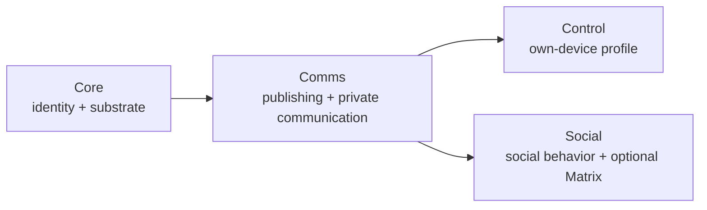
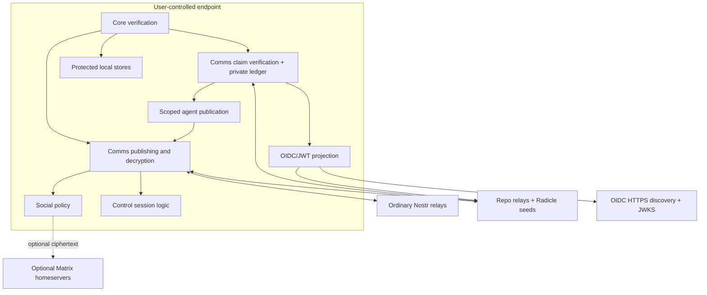

# Heterodyne protocol-family architecture

This is a non-normative guide to the family and its design rationale.

[`docs/spec/heterodyne.md`](spec/heterodyne.md) is the non-normative family
map. Normative authority is divided among:

- [Heterodyne Core](spec/heterodyne-core.md)
- [Heterodyne Comms](spec/heterodyne-comms.md)
- [Heterodyne Control](spec/heterodyne-control.md)
- [Heterodyne Social](spec/heterodyne-social.md)

The former monolith's 0.4.0 bytes remain frozen in
[the archive](spec/archive/heterodyne-0.4.0.md), with a complete
[old-section anchor map](spec/archive/heterodyne-0.4.0-anchor-map.md).

## 1. The exact dependency DAG

```text
Core <- Comms <- Control
Core <- Comms <- Social
```

The arrows point from dependency to dependent. Core has no family dependency.
Comms depends on Core. Control and Social depend on Comms and Core, but never on
each other. An implementation may compose Control and Social conformance at the
client level without creating another document edge.



This shape lets identity and communication mature without requiring Social to
stabilize, and keeps a remote-control feature from becoming a dependency of
human social behavior.

## 2. Core: identity and substrate

Core answers four questions: who is the persona, which keys currently act for
it, where is its authoritative repository material, and how does a client
verify what it fetched?

A persona is anchored by a cold-root Nostr npub and an accepted KERI key-event
log. A rotating epoch key signs routine events. A Radicle Node ID is a separate
Ed25519 principal and becomes a persona delegate only through a binding signed
by both the epoch key and the NID. Neither a repository, an MXID, nor an export
DID replaces the npub.

Core defines public-reader, authenticated-light, full-node, and supporting
routing roles. A full node runs Radicle and a NIP-01 repo-relay adapter,
publishes one or more clearnet Nostr relays when it wants to support every
browser client, and is a persistent v3 onion service by default. Its backend
egress uses Tor by default. A routing node holds no content and returns only
verified location hints.

Light clients fetch from ordinary or repository relays and verify locally.
Non-browser WASM clients should embed an outbound-only Tor client. Browser
tabs cannot open arbitrary Tor circuits; they either reach clearnet relays or
use an authenticated shared websocket/WebRTC relay whose server side reaches
the full node's onion service. That relay is provider-independent, is not an
authority, and makes the browser's reduced assurance visible. Direct
client-to-node WebRTC/TURN is outside the base profile because it can expose a
Tor node's network location and is unnecessary for NAT traversal through Tor.

Core also owns exact NIP-01 bytes, `nip01_raw`, the revisioned registry,
qualified version grammar, capability bootstrap, protected-repository
primitives, the local keys-repository profile, and base conformance.

Identity discovery stops at the signed npub → RID → serving-node path and
authoritative key material. Multi-host seeding makes a persona resilient to one
full-node loss. KEL/Radicle reconciliation and cold-root re-anchor handle
conflicts; relationship-based discovery and friend-oriented recovery policy
belong to Social instead.

Core's generic threshold authority separates two Radicle mechanisms: the
identity-document revision majority and the document's canonical-ref
threshold. Organizations use the same identity primitive as individuals.
Comms applies it to org-owned posts and indexes; Social applies it to community
presentation and editorial policy.

## 3. Comms: content delivery and confidential communication

Comms turns Core identity and repositories into a generic authenticated
communication layer. It owns the Nostr-native envelope, publication and
fan-out, canonical feed ordering, retrieval, backfill, delivery discovery,
privacy tiers, direct messages, credential-plane device sync, and encrypted
subprotocol negotiation.

### 3.1 Privacy tiers

| Tier | Storage form | Honest boundary |
|---|---|---|
| Tier 1 | Public signed events | Confidential against no one |
| Tier 2 | Plaintext in a private Radicle repository | Hidden from non-members, readable by every allowed seeder |
| Tier 3 | Audience-key ciphertext committed before storage | Confidential against carriers and non-key-holders |

Tier 3 solves audience-scale encryption by encrypting content once and wrapping
the audience key per recipient. It does not provide forward secrecy: an exposed
audience key reads retained ciphertext for that generation. Branch rotation and
scrubbing reduce cooperative retention but do not guarantee erasure.

### 3.2 Direct messages and device sync

Two-party direct messages use a double ratchet over Nostr events. Outer
messages are relay-carried, never repository-committed, and have no backfill.
The ratchet gives forward secrecy and post-compromise security when message
keys are deleted. NIP-17 remains a compatibility fallback with weaker
properties.

Credential-plane sync is deliberately separate from Control. It moves key and
recovery state only between durable NID-bearing devices with an explicit,
revocable credential-sync authorization. A NID-less Control session device can
never qualify.

### 3.3 Key claims, private authority, and public projection

Comms also owns atomic signed claims about typed keys. Cryptographic validity
is evaluated before trust, and authorization claims are usable only after
fresh subject proof and confirmation in the persona's canonical encrypted
private claim ledger. The ledger is multi-writer: monotonic revocations and
authority reductions win, while incompatible policy changes remain conflicted
and fail closed.

OIDC discovery, JWKS, ID Tokens, RFC 9068 access tokens, and draft-21 status
lists project selected active claim state to ordinary third parties. They are
not the canonical authorization plane. Public HTTPS material has a
byte-identical, cold-root-scoped Radicle continuity tree; private claims,
consent, issuance mappings, reader membership, audience keys, and signing
secrets never enter that tree. Signing keys are separately wrapped only to
active issuer nodes, which must mint from a canonical checkpoint no more than
300 seconds old.

### 3.4 Universal public reader

A shareable launcher URL carries its persona or event target only in the
fragment. The static web origin therefore serves the same client bytes without
receiving the target in an HTTP request. The downloaded client parses and
validates the target locally, applies bounded SSRF-safe relay hints, resolves
the persona and signed public indexes, and renders verified Tier 1 only. The
same browser client may later authenticate to a full node without reloading,
but public and authenticated state remain separate and logout clears the
authenticated state.

### 3.5 Automated authorship

An AI or programmatic principal never signs as a human device. A full node
holds one or more stable `agent:<role-id>` private keys and exposes only an
intent-level publication operation. The workload obtains a temporary,
sender-constrained token from the persona's built-in OIDC issuer. The node
intersects that token with current private-ledger authorization and finite
kind, feed, resource, size, rate, and burst limits; it then replaces caller
attribution, adds the canonical automation label, and signs with the selected
role key. Any missing or stale binding fails closed. A generic node usually
uses one agent role, while independently governed pipelines may use separate
stable roles.

## 4. Control: a profile, not a transport

Control rides accepted Comms double-ratchet sessions and generic Comms
subprotocol carriers. It owns enrollment, grants, RPC framing, side-effect
audit, session devices, and agentic/MCP semantics. It owns no wire stamp and
defines no transport.

The current Control 0.5.0 document is incomplete. Its relay-affinity and
automated-agent subsets now have schemas and positive/negative vectors, but the
remaining Control enrollment and session requirements still prevent a
conformance claim. The strict-profile identifier remains reserved-inactive.

Control audit protection depends only on Core, Comms, and Control rules. A
Social or Matrix implementation is never required to protect Control audit
records.

## 5. Social: policy and optional Matrix

Social owns human-facing graph and policy semantics: following, replies,
reactions, threading, cross-persona advertisements, reply inboxes, mixed-tier
fan-out, moderation, personal lists, community policy, web-of-trust filtering,
organization presentation, starter packs, and ATProto attachment.

Social uses Comms events and delivery without changing their cryptographic
acceptance rules. Its direct-message admission policy is a tighten-only Comms
hook: mutes or social trust may hold or reject a cryptographically valid
request, but can never turn an invalid request into acceptance.

Moderation has two parallel editorial gates. NIP-72 approvals are checked
against the moderator declaration at a repository, Matrix, or reduced-assurance
relay anchor. Radicle editorial gating instead requires reachability from the
delegate-threshold canonical history. NIP-32 labels and web-of-trust scores are
advisory client policy and never a third authority mechanism.

Agent-policy receipts follow the same no-global-authority rule. A receipt is
public evidence, not a mute. Only a policy list the reader explicitly
subscribes to—and whose current canonical repository history verifies—changes
that reader's local visibility. A reference client may enable a visible
default list, but the user can inspect, disable, or replace it. Remediation
mutes and rotates only the offending agent role key, never the persona or epoch
key.

Matrix is an optional feature inside Social. It supplies real-time public and
private discussion, encrypted state, MXID delegation, room coordination,
Megolm/MLS, and client-side bridging. A Matrix-free client can be fully Social
conformant; `Social` and `Social+Matrix` are separate claims.

## 6. Data and trust flow



Backends carry bytes and metadata; they do not establish persona authority.
Protected plaintext is processed on user-controlled endpoints. Redundancy
comes from independent relays and repository seeders rather than trust in one
service.

## 7. Registry, versions, and wire ownership

The Core-owned registry assigns kind base schemas, immutable profile
discriminators, reason codes, and namespaced security invariants. Registry
revision is independent of Core semver so a Social allocation does not force a
Core release.

Document versions are qualified identifiers: `core/<semver>`,
`comms/<semver>`, `control/<semver>`, and `social/<semver>`. Only Core, Comms,
and Social own event stamps. Control payload versions are selected through
Comms negotiation; Control never adds a wire stamp.

An adopted upstream Nostr event stays unstamped unless a registered profile
with an immutable discriminator opts it into stamping. Existing signed 0.4.0
events remain authoritative as signed and are never restamped.

### 7.1 Protected state and backups

Core owns the local keys-repository profile and the generic protected-container
primitive. Comms owns audience/ratchet material and the config-repository
encryption profile. Social owns mute, feed-preference, and
followed-repository payloads stored through those lower primitives.

The config repository is private and unadvertised, but traffic can still reveal
that an unknown repository is being accessed. The keys repository remains
local-only and is synchronized only through authorized credential-plane
transfer or offline restore. Removable-media backups cover identity material
and produced/followed repositories; no backup turns stale key state into
authority.

## 8. Conformance and strict profiles

The conformance classes are:

| Claim | Required composition |
|---|---|
| Core | Core document and required features |
| Heterodyne persona | Core+Comms |
| Control profile | Core+Comms plus required Comms features and active Control profile; currently unavailable |
| Social | Core+Comms+Social without mandatory Matrix |
| Social+Matrix | Complete Social plus every required Matrix feature |

Strict mode is no longer one monolith-wide switch. Stable profiles compose in
the same downward direction:

- `heterodyne-core-strict-v1`
- `heterodyne-comms-strict-v1` → Core strict
- `heterodyne-comms-strict-v2` → Core strict, plus public-reader and agent invariants
- `heterodyne-control-strict-v1` → Core strict + Comms strict
- `heterodyne-social-strict-v1` → Core strict + Comms strict
- `heterodyne-social-matrix-strict-v1` → Social strict
- `heterodyne-social-strict-v2` → Comms strict v2 plus agent-policy invariants
- `heterodyne-social-matrix-strict-v2` → Social strict v2

The Control profile remains reserved-inactive. Capabilities advertise only
profiles actually met; unknown IDs provide no inferred capability. Reports pin
versions, registry state, features, invariant membership, prerequisite
profiles, and applicable vector results.

## 9. Security ownership

Security invariant IDs follow document ownership:

- `CORE-I-*` covers persona authority, dual-proof NID delegation, verification,
  decentralized identity discovery, and Core key storage.
- `COMMS-I-*` covers Tier 3 confidentiality, Tier 2 honesty, Comms private
  state, client-side delivery, decentralized delivery discovery, claim
  authenticity/attenuation, private-ledger authority, issuer confinement and
  continuity, minimized release, JWT separation, token-status integrity,
  Tier-1-only public reading, and bound/attributed automated authorship.
- `CONTROL-I-*` covers audit protection, session-device key confinement,
  ingress-relay affinity, and the intent-only scoped agent boundary.
- `SOCIAL-I-*` covers private Social state, decentralized graph evaluation,
  subscriber-local agent policy, scoped remediation, and optional Matrix
  identity/encryption/bridging.

See [the threat model](security/threat-model.md) for actors, residual metadata,
and threat-to-invariant mapping.

## 10. Interoperability and reachability

Vanilla Nostr relays carry ordinary NIP-01 events and may ignore Heterodyne
profiles. Adopted upstream events remain upstream-compatible unless an explicit
registered profile opts in. Repo relays are NIP-01-facing strict supersets;
light clients never need Radicle or git on the wire.

Full nodes provide persistent v3 onion reachability and use Tor for backend
egress by default. Public-reader and authenticated-light clients should provide
outbound Tor, including an outbound-only embedded Tor client in suitable
non-browser WASM hosts. A browser without Tor can operate through shared
clearnet relays or an authenticated onion-reaching relay only in explicit
reduced-assurance mode. Tor reduces destination and location leakage but does
not eliminate timing or volume analysis.

Matrix homeservers remain vanilla. Social+Matrix encryption, wrapped-event
verification, state protection, and bridging run in clients. Bare messages
remain visible with an attribution warning, while wrapped messages carry a
transferable Nostr proof.

## 11. Why these boundaries

The split follows authority rather than UI screens. Core is usable anywhere a
persona and verifiable repository bootstrap are needed. Comms is useful to
human or nonhuman personas without implying social-media policy. Control adds
own-device authority without becoming part of ordinary communication. Social
can evolve rapidly without blocking identity, messaging, or control work.

This also enforces a local downref discipline: a lower, more stable document
never requires a higher, less mature one. It keeps optional Matrix behavior out
of identity and Control audit guarantees and gives each wire behavior one
schema owner and one version stamp.

## 12. Open pre-1.0 work

The principal architecture work still open is the complete repo-relay
server/storage contract, a frozen Comms double-ratchet wire profile, broader
cross-implementation KERI recovery testing, Social Matrix/MLS validation, and
completion of the remaining Control enrollment/session schemas and vectors.
These are owned work items rather than reasons to blur the family boundaries.
