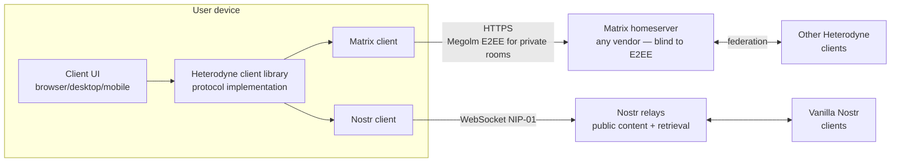

# Architecture overview

This document is a non-normative introduction to Heterodyne for new
contributors. The normative specification is at
[`spec/heterodyne.md`](spec/heterodyne.md).

The spec is in its **0.x phase — in flux until 1.0**: everything is
subject to change and any `0.x` release MAY break the prior one
(semver 0.x rule; see spec §12.1). This overview refers to the spec
as **0.x** rather than a single point version.

## What we're building

Heterodyne is a decentralized social network protocol. A user's identity
is a Nostr `secp256k1` keypair. Broadcast content is Nostr-native;
discussion and membership-gated interaction use Matrix rooms. The
combination gives:

| Property | Comes from |
|---|---|
| Cryptographic authenticity; key portability across homeservers; forwardability to vanilla Nostr | Nostr |
| End-to-end group encryption (Megolm today, MLS in flight); stateful access control; federated transport; censorship resistance at the server layer; native moderation primitives | Matrix |
| Multi-homing, persona-preserving key rotation, pseudonymous attribution with optional transferable proof | Heterodyne's composition |

## The load-bearing decisions

The design rests on the choices below, each recorded with rationale
so future contributors understand why we picked what we picked.

### 1. Event envelope: verbatim Nostr inside Matrix where Matrix carries the event

Where Heterodyne carries an event over Matrix, the wrapped form
(`m.heterodyne.note.v1`) embeds the full signed Nostr event
verbatim. Matrix is "just transport." This gives:

- A wrapped event can be lifted into vanilla Nostr 1:1 with no
  transformation. Same `id`, same signature, same kind.
- Authenticity survives transport: if the event leaks past the Matrix
  layer, the Nostr signature still proves origin.

Where Heterodyne carries an event over Nostr (the default for
`public_broadcast` and `private_broadcast` posts — see Decision 4
below), the event is a NIP-01-compliant Nostr event on a relay. Public
broadcasts are plaintext; private broadcasts are room-key-wrapped before
signing and relay publication.

Discussion traffic and reactions/replies default to bare Matrix events:
attributable to the sender's npub through delegation, but without a
transferable third-party proof. A sender can opt into that proof with
`heterodyne_nostr_sig` or a wrapped `m.heterodyne.note.v1`; this is an
authenticity badge, not a deniability mode.

See spec §4.

### 2. Identity: npub canonical, Matrix accounts are delegated publishers

The npub is the authoritative identity. Matrix accounts are
*delegated publishers* bound by epoch-key-signed attestations in a
per-persona **identity room**. Multiple personas are first-class.

The identity room is a **disposable container** — if it is
compromised at the Matrix layer (homeserver power-level takeover),
the persona publishes a fresh NIP-01 `kind:31005` identity pointer
naming a new room, and followers' clients prioritize the latest
pointer over locally cached room IDs. The npub does not change;
only the Matrix container moves.

Vanilla Nostr's key-rotation pain (rotating means abandoning your
followers) is solved by committing to **KERI** (Key Event Receipt
Infrastructure) for root inception and rotation: explicit sequence
numbering, threshold witnesses, deterministic fork resolution. The
v0.1.4 single-key successor/predecessor chain was retired in v0.2.0
because it was vulnerable to "fork-freezing" attacks. The normative
KERI payload schemas are now in spec §3.5; the Cold Root + Epoch Keys
design remains background rationale.

Delegation acknowledgement no longer requires a Matrix MSK
signature; the homeserver's normal `/send/state` authorization on
the epoch-key-signed delegation event is sufficient.

See spec §3.

### 3. Outbox model: every author admins their own rooms

A Heterodyne user broadcasts via Matrix rooms they own. Each circle —
friends, close friends, work, public — is a separate room with different
membership. The client surfaces "distribution lists" and "friend
circles"; Matrix power levels are the implementation detail and stay
hidden from the user.

This splits the censorship-resistance burden: relays carry broadcast
events and feed indexes, while Matrix federation carries room state,
membership, and discussion. The user gains stateful, fine-grained
membership control. The cost is that "follow" often becomes "join the
broadcaster's room," which is heavier than Nostr's pure follow-list
approach but unlocks the moderation and encryption story.

See spec §7.

### 4. Public content lives on Nostr; feed indexes are Nostr-native too

Public Heterodyne broadcast content (`public_broadcast` posts) lives on
Nostr relays, as do the per-room **feed indexes** (`kind:31007`) that
record each persona's curated post order. Moderated
`public_discussion` communities also use Nostr for moderator approval
events and per-moderator approval indexes. Public Matrix rooms hold
standard room state, moderation state, optional archive pointers, and
members' reactions/replies. Vanilla Matrix clients peeking at a
`public_broadcast` room see reactions/replies, not the persona's
broadcast posts; that's the design.

This is a v0.2.0 change from v0.1.4. v0.1.4 stored feed indexes
as Matrix state events (`m.heterodyne.feed_status.v1`), but that
made the index mutable by anyone with state-write power in the
room — a hostile homeserver admin could silently rewrite a
persona's curated feed without breaking any cryptographic
invariant. Moving the index onto Nostr makes it epoch-key-signed and
tamper-evident: only the persona's current KERI-authorized epoch key can
produce a `kind:31007` for that persona.

Private discussion (`private_discussion`, including two-party DMs)
continues to ride inside the encrypted Matrix room. Private broadcast
(`private_broadcast`) is different: posts are Nostr events whose content
is NIP-44-v2 symmetric ciphertext under a room key derived from an
explicit Heterodyne room secret (a random 32-byte value distributed via
a Megolm-encrypted `m.heterodyne.room_secret.v1` state event), and
the feed index is also room-key-wrapped. Both the index and the posts
carry only an opaque `key_id` and never the room id, entries, relay
hints, or page links on the wire — those live in the encrypted payload
and the in-room descriptor. Indexes are bounded at 500
entries per page; public indexes use visible `previous_index` tags,
while private indexes carry page links in encrypted payloads.

This split plays each protocol to its strengths:

- Nostr relays are well-suited to high-volume public broadcast and
  to npub-anchored replaceable indexes.
- Matrix rooms are well-suited to membership-gated state — what
  remains in the room is the moderator list, encryption posture,
  and room kind / configuration.

Events are classified per kind as **indexed** (appear in
`kind:31007`: microblogs, long-form, classifieds) or
**non-indexed** (reactions, zaps, follow lists, deletions —
visible but rendered contextually). A publisher MAY override
per-event via a `heterodyne_index` tag. See spec §6.8.

**Retrieval.** Receivers fetch events referenced from a
public `kind:31007` `e` tags or private decrypted index entries via
Nostr relays (Channel 1) or, as a fallback, via the publisher's
optional user-hosted HTTPS archive advertised as
`m.heterodyne.archive.v1` in the identity room (Channel 2). The spec
does NOT host an archive service; archive infrastructure is each
publisher's responsibility. Matrix-DM backfill requests / responses /
pushes are **forbidden** in v0.2.0 (DoS / rate-limit vector); events
not retrievable via the two channels are considered permanently lost.

### 4b. Bridge: pure client-side, any homeserver works unmodified

There is no Heterodyne appservice and no homeserver modification. Every
client is a full Matrix + Nostr client. The cross-protocol logic is
part of the client implementation. The spec is language- and
runtime-agnostic; protocol conformance is determined by the normative
spec, with authored test vectors (§14) serving as the interoperability
suite rather than prescribing language or packaging choices.

This is the design choice that protects the blind-server property: a
homeserver-side bridge would see plaintext before Matrix encryption and
break the privacy story.

Per-MXID portability is provided by a dedicated **encrypted client
configuration room** (§3.8) that holds user preferences, per-persona
private state including mute lists, and Heterodyne-specific key
backups. A new device of the same MXID joins this room and re-syncs
configuration immediately.

See spec §10 (bridge model) and §3.8 (config room).

### 5. DMs: pure Matrix with optional Nostr wrap

Direct messages are two-member `private_discussion` rooms with normal
`m.room.message` semantics. A Heterodyne client adds an OPTIONAL
`heterodyne_nostr_sig` field for senders who want a transferable proof
on a specific message. By default DMs are attributable in-room via
delegation but do not carry a portable Nostr proof.

This makes vanilla Matrix clients render Heterodyne DMs natively, with
zero special handling — a substantial UX win for cross-network
conversations.

See spec §4.3, §4.4.

### 6. Moderation: Matrix is the floor, Heterodyne is the editorial ceiling

Matrix room-level ACLs (power levels, kicks, bans, server ACLs, MSC2313
policy rooms) decide who is in a room. NIP-72-style moderator approval
signatures, when used, decide whose posts surface in the feed view of a
public moderated community.

The two systems answer different questions and don't conflict. A user
banned from a room never publishes there. A user in the room whose posts
aren't moderator-approved is invisible in the curated feed but still
visible to anyone subscribed to the raw room.

See spec §8.

### 7. ATProto as a decorative attached outbox (and KERI witness)

ATProto is **not** a Heterodyne identity layer. It is treated the
same way vanilla Nostr relays are: a publish target a persona MAY
opt in to mirroring a subset of their public feed to. The motivation
is purely adoption — Bluesky has cultural visibility Nostr and Matrix
don't, and mirroring a feed there is a low-friction discovery funnel.

The persona's canonical identity remains the npub anchored in the
Matrix identity room. A cryptographically verifiable npub ↔ DID
binding (double-signed: npub signs DID, DID signs npub) lets each
side surface "verified counterpart" trust signals without elevating
ATProto to a trust root. Private E2EE content never mirrors.

Independently of mirroring, the ATProto signing key MAY co-sign a
persona's KERI inception and rotation events (see the Cold Root +
Epoch Keys design) as a peer witness. ATProto's auditable
DID-document key history makes it a strong continuity witness for
the `none`-strategy rotation case, where no cryptographic chain to
the prior cold root exists. The witness signature is additive — it
does not satisfy any MUST signature requirement.

This is the v0.1.4 addition. Its scope is bounded: opt-in per room
and per kind, off by default, and reversible (removing ATProto
support is a local change). The template — per-protocol binding,
mirror outbox, optional KERI witness role — is reusable for future
ecosystems should one emerge with stronger adoption signal.

See spec §11.6.

### 8. Embedded Tor: onion reachability is a universal client requirement

Privacy-focused Nostr relays and Matrix homeservers increasingly live
on `.onion`. If a Heterodyne client cannot reach them, they are
advertised-but-unreachable — second-class. To make onion-hosted feeds
and relays first-class, embedded Tor is a **universal client conformance
requirement**, not an optional add-on.

Two capabilities are deliberately kept separate, because conflating them
is the easy mistake:

- **Onion reachability** — can the client *connect to* a `.onion`
  endpoint? This is a Universal MUST on every platform. The client ships
  Tor *as part of the application* (a bundled library, native binding,
  or WASM build), rather than depending on a separately installed Tor
  daemon or an external SOCKS5 proxy. The one platform that cannot open
  the raw TCP sockets Tor needs — browser/WASM runtimes — satisfies the
  MUST by tunneling embedded Tor through a WebSocket pluggable-transport
  bridge (experimental, bridge-dependent), and surfaces an indicator
  when no bridge is reachable. Native desktop, Node.js, and mobile apps
  embed Tor directly (Onion Browser and Orbot already do this on iOS).

- **Egress-over-Tor** — does the client route the *user's own* traffic
  over Tor to hide their network location? This is opt-in,
  off-by-default, behind a prominent toggle. Keeping it opt-in protects
  the compatibility-first stance: no surprise latency/battery cost, no
  breakage on Tor-blocking networks. The strict-mode profile (spec
  §11.7) elevates it to default-on.

Why this doesn't violate the §1 "does not define a transport" non-goal:
requiring that a client can *reach* an existing transport is a
conformance property, not the definition of a new one. Tor is composed,
exactly as clearnet TCP/TLS is. The requirements are written in terms of
capability and reachability — never a named library, daemon, or version
— preserving implementation-agnosticism. Egress-over-Tor upgrades the
passive-network-observer and cross-persona-metadata-linking threats from
"deferred future work" to in-scope mitigations; Tor-level traffic
analysis remains a documented residual limitation.

See spec §7.7 and ADR-019.

### 9. Redundancy and social recovery: survive losing a homeserver

A persona's identity and content should not die with one homeserver.
Two complementary layers address this, both built from Matrix and Nostr
as they exist — no new replication protocol.

**Infrastructure layer — mirroring (ADR-020).** A persona MAY keep
full-replica mirrors of its identity room and broadcast rooms across the
homeservers it controls. One replica is the primary (the room named by
the cold-root `kind:31005` pointer / `kind:31007` feed index); the rest
are warm standby, tied together by an `m.heterodyne.mirror_group.v1`
state event. On primary failure the persona *promotes* a replica by
republishing `kind:31005`. The insight that keeps this cheap: private
broadcast bodies already live room-key-wrapped on relays (§6.10), so a
mirror room carries state + the Megolm follower keyring + bare in-room
traffic, not N copies of every post — and the keyring re-keys on member
*removal*, not on join. Voluntary homeserver-exit (§3.10) collapses into
"promote a replica," so there is one redundancy model, not two.

**Cross-MXID config sync (ADR-020).** The same mirror substrate
resolves the long-standing sync deferral: §3.9.1 already makes every
delegated MXID a member of every other's config room, so
`persona_config` / `user_prefs` / `key_backup` sync over that existing
mutual membership with no new room.

**Social layer — friend-cache + vouching (ADR-021).** When *every*
persona-run homeserver is gone, infrastructure redundancy is exhausted
and recovery falls to the social graph, in three beats:

- *Friend-cache.* Followers cache the persona's identity-room state
  (followers MAY, mutuals SHOULD, declared §3.5 witnesses MUST),
  filtered to only the persona's own signed feed/identity events plus
  KERI events — both cheap and poisoning-resistant.
- *Re-anchor.* A fresh cold-root `kind:31005` on relays is the
  authoritative new-room pointer, with the cache as trust bridge and
  fallback.
- *Vouching.* Key continuity is re-established through the existing KERI
  witness machinery in two tiers: authoritative declared witnesses, plus
  an advisory-only informal `kind:31008` vouch tier that is never counted
  toward the threshold and feeds only a manually-confirmed promotion
  snowball. The human "is this really you?" check is deliberately left
  out of band — standardizing it would create one capturable surface.

`did:key` (ADR-022) is added precisely so a friend's bare key can be a
declared witness without any DID-document resolution.

See spec §3.8.4, §3.11, §3.12, §3.5.5, §10.6 and ADR-020/021/022.

## High-level diagram

Public broadcast content and feed indexes flow over Nostr relays; Matrix
carries the room state and member interactions for the rooms that
organize that content. Private discussion uses Matrix end-to-end
encrypted transport. Private broadcast uses Matrix membership/Megolm as
the keyring while the room-key-wrapped posts and indexes live on the
room's advertised relays. The user's client is the only place that sees
Nostr signatures and Matrix plaintext together.

## Where `mxdx` fits

Heterodyne and `mxdx` are sibling projects that share architectural DNA:

- Hard invariant that every Matrix event in a private context is E2EE,
  including state events (MSC4362).
- OS keychain integration for sensitive material at rest.
- Pure client-side bridge: no protocol-specific homeserver
  modifications; vanilla homeservers handle Heterodyne traffic.

Heterodyne is **not** a fork of `mxdx` and does not depend on its code.
The protocols are different (one is fleet-management with PTYs and
WebRTC; the other is social with Nostr events and pub/sub). Beyond
the shared invariants above, Heterodyne is implementation-agnostic:
the spec does not prescribe a language, runtime, or shared core for
clients.

## Open design questions

All current (0.x) spec sections are drafted. The remaining open
questions are follow-up work that does not block the current draft:

- ~~**Cross-MXID persona-private state synchronization.**~~ *Resolved
  (ADR-020).* Rather than a new persona-private room, sync rides the
  mutual config-room membership §3.9.1 already establishes:
  `persona_config` / `user_prefs` / `key_backup` synchronize across the
  persona's config rooms via ordinary Matrix state replication
  (`device_inventory` stays per-room). See §3.8.4 and decision 9 above.
- **`matrix:` URI refactor of §7 outbox schemas.** Newer constructs
  (§3.8 config-room pointer, §11.3 identity pointer) use `matrix:`
  URIs. The §7 outbox schemas still use the legacy `{room_id, via}`
  structured form for backward source compatibility. A future
  revision can migrate them; not urgent.
- **MLS implementation validation.** §9.2 defines the migration
  procedure, but Matrix MLS support still needs first-party client
  validation against real SDK behavior before it can be treated as
  operationally mature.
- **Conformance reporting formalization.** §14.4 leaves the
  conformance-claim mechanism informal. A future spec version may
  define a conformance manifest format consumable by a registry.
- **Canonical topic taxonomy.** The spec lets clients pick reverse-DNS
  namespaces (§5.1), but a recommended common set (under
  `org.heterodyne.topics`) would improve discoverability. Defer until
  there's actual usage to draw from.
- **Transitive join-rule consistency.** §7.2 recommends `restricted`
  join rules (MSC3083) for advertised inner rooms; should the spec
  formalize a check that inner rooms are at least as restrictive as
  their advertiser?
- **Megolm session establishment under robust batched delivery.**
  §6.4's "robust batched delivery" semantics interact with the latency
  of Megolm session setup for fresh members. Worth a worked example
  in the test vectors.
- **Persona switching UX.** Multiple personas (§3.4) are a first-class
  feature, but the spec is silent on how clients SHOULD present
  switching. UX-only — defer to client implementation.
- **Out-of-scope security threats.** Compromised user devices, traffic
  analysis under Tor-routed Matrix federation, and post-quantum
  adversaries are explicitly out of scope for the current 0.x spec
  (see threat model). Each is a future-spec-version question.
