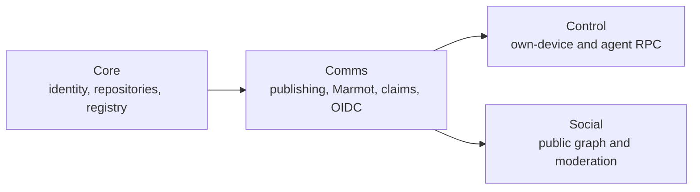
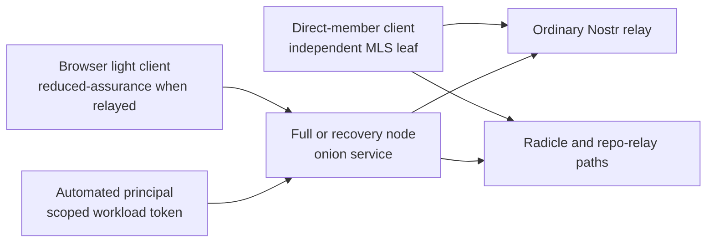
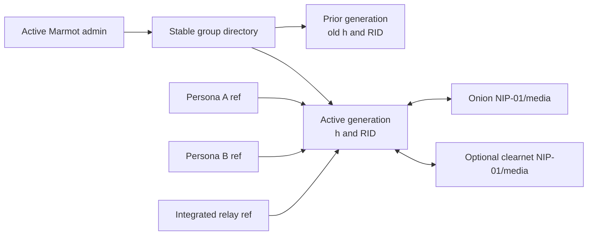

# Heterodyne architecture

This document is a non-normative explanation of the protocol family. The
versioned documents under [`docs/spec/`](spec/) and their registries, schemas,
release manifests, and vectors are authoritative.

The family documents are [Core](spec/heterodyne-core.md),
[Comms](spec/heterodyne-comms.md), [Control](spec/heterodyne-control.md), and
[Social](spec/heterodyne-social.md).

## 1. Family boundaries

```text
Core <- Comms <- Control
Core <- Comms <- Social
```



Core owns the KERI-anchored persona, Nostr and Radicle identifiers, repository
authority, transport roles, versioning, and conformance vocabulary. Comms owns
privacy tiers, publication, Marmot conversations and media, Radicle-backed
conversation storage, claims, the private ledger, and OIDC/JWT projection.
Control owns grant-filtered access to a person's own full node. Social owns
public following, interactions, community policy, moderation, presentation,
and durable social assets.

Control and Social are siblings. Neither may acquire authority over the other
through an implementation shortcut.

## 2. Identity and trust

A persona is rooted in a cold-root Nostr public key and its accepted KERI key
event log. Epoch keys perform routine signing. Radicle NIDs, Marmot accounts,
devices, group administrators, hosts, and agent roles are attributed by
current KERI evidence without becoming alternate persona roots.

Marmot validity and MLS convergence remain independent of Heterodyne
attribution. Revoked or stale KERI evidence removes verified Heterodyne
authority; it does not rewrite converged group history.

Full nodes hold sensitive role and account keys. Devices normally use
independent MLS leaf keys. A leaf backup is an exclusive takeover, not a way
to run the same leaf concurrently on several devices.

## 3. Roles, reachability, and transport

Full nodes are persistent onion services by default and use Tor for backend
egress by default. They may also publish clearnet endpoints. Authenticated
light clients should implement outbound-only Tor where their runtime permits.
A browser tab that cannot do so may use an authenticated shared relay, but the
client must identify that path as reduced-assurance.

A public reader needs no persona secrets. It downloads a static browser client,
resolves a fragment-only public link from known or discovered clearnet relays,
verifies locally, and renders only Tier 1 material. The hosting origin does not
receive the fragment target.



## 4. Publishing and privacy

Tier 1 is public. Tier 2 is plaintext selectively replicated to authorized
Radicle nodes and must be presented honestly as a replication boundary rather
than encryption. Tier 3 is encrypted before any carrier or repository receives
it. Ordinary relays and repository relays preserve signed event bytes.

The universal public launcher provides a stable path into verified Tier 1
content. It is not a centralized identity or content directory.

## 5. Marmot conversations

Marmot is the canonical conversation engine. The pinned upstream implementation
owns MLS membership and convergence, account-to-leaf proofs, application
events, replies, reactions, edits, encrypted media, and ordinary Nostr
transport. Heterodyne adds KERI attribution, Control authorization, Radicle
storage and admission, and deployment adapters.

Ordinary one-to-one conversations are two-member Marmot groups. Direct-member
clients own independent leaves. Node-mediated browser/light clients use
grant-filtered Control operations while MLS and repository secrets remain on a
designated node. Routine Control itself uses a separate two-member Marmot group
between the light client and that full node, with short-lived node-scoped
authorization layered above Marmot sender authentication.

Standard-compatible groups remain usable through ordinary Marmot relays.
Heterodyne-private groups use private Radicle discovery and admission but keep
valid Marmot cryptography and event bytes.

## 6. Radicle-backed group storage

Each group has a stable directory repository plus routing-generation event
repositories. One routing generation maps one Marmot `h` value to one event
repository RID. Membership changes, explicit recovery, or the 5 GB logical
soft cap rotate the routing generation; unrelated MLS commits do not.



Writers publish append-only objects on their own authorized refs; integrated
relays use a relay ref. Logical contents are the deduplicated union of valid
authorized refs. Radicle provenance never substitutes for Marmot sender
authentication.

Every interface preserves exact signed Marmot event bytes and exact encrypted
media ciphertext. Repository commits and indexes do not wrap, translate, or
re-sign content. A Radicle-backed relay routes by `h` and need not learn the
stable group identity, member list, or MLS epoch.

Radicle delegates replicate; active Marmot administrators authorize. A routing
binding is accepted only when its admin, canonical Marmot routing commit, `h`,
RID, and repository genesis agree. Equivocation fails closed.

## 7. Retention and persona inboxes

Signed group retention policy determines which archived routing generations
conforming hosts advertise and seed. Expiration stops conforming service and
permits local garbage collection; it does not erase independent Git objects,
clones, exports, or backups.

A persona repository may expose a contributor-ref inbox containing a bounded,
atomic Marmot Welcome and first-event bundle. This bootstraps a two-member
group for first contact, private replies, or private reactions. Sender refs are
never merged into the canonical profile branch. Unknown public refs remain in
pull-based quarantine and cannot trigger automatic media retrieval.

## 8. Control and automated principals

Each light client uses a private non-delegated Nostr key and one pairwise
Marmot group per full node. Group membership is enrollment-only until OAuth
Device Authorization commits a persona-wide entitlement to encrypted private
Radicle state. Each node then issues its own five-minute, node-audience JWT
bound to the client's Marmot account and exact group. Extended tokens require
separate consent and may never exceed sixty minutes.

Control exposes only methods and objects allowed by current entitlement and
token scope. Mutations reserve a stable operation ID before effects. A client
fails over sequentially and repeats a mutation only when it is inherently
idempotent or another node can prove the committed result; otherwise it
surfaces an indeterminate outcome. A node-mediated client receives rendered or
encrypted results appropriate to its grant, never account, leaf, epoch,
repository, or role secrets.

An AI or programmatic principal submits intent through Control using a scoped,
temporary, sender-constrained workload token from the node's OIDC issuer. The
full node validates current authority, constructs the Marmot or public event,
adds canonical automation attribution, and signs with a full-node-held stable
agent role. The agent never receives that key and there is no fallback to a
human device key or unlabeled publication.

Portable recovery is independent of baseline Control. Private Radicle is the
primary network recovery path. A locked epoch NIP-59 inbox is used only to
register a new full/recovery node when no authorized device can approve it.
The epoch key is relocked before transfer begins, and authority activates only
after exact repository heads and object digests verify. Oversized immutable
objects may use a separately advertised SFTP profile on a fresh per-grant
client-authorized onion, isolated from the Radicle service and restricted to a
rooted, finite, expiring transfer view.

## 9. Social

Social is the public policy and presentation layer. It covers follows, public
replies and reactions, feeds, NIP-72 communities, moderation, mute and policy
lists, public durable assets, and optional ATProto attachment. Private replies
or reactions start or reuse a Marmot conversation and may reference the public
asset.

Moderation remains subscriber-local. Receipts inform; only a verified policy
list to which a client explicitly subscribes changes local visibility.

## 10. Availability and residual trust

Multiple relays, hosts, writers, and locators improve availability but do not
create new identity or group authority. Full nodes, Nostr relays, Radicle
hosts, and repository relays can observe metadata and can omit, delay, or
reorder traffic. Local signature, KERI, MLS, grant, and repository-binding
verification remains mandatory.

The four documents are independently versioned. Exact document versions,
registry revision or digest, features, and strict profiles must travel with
every conformance claim. The family is in its 0.x phase and may make breaking
changes before 1.0.
