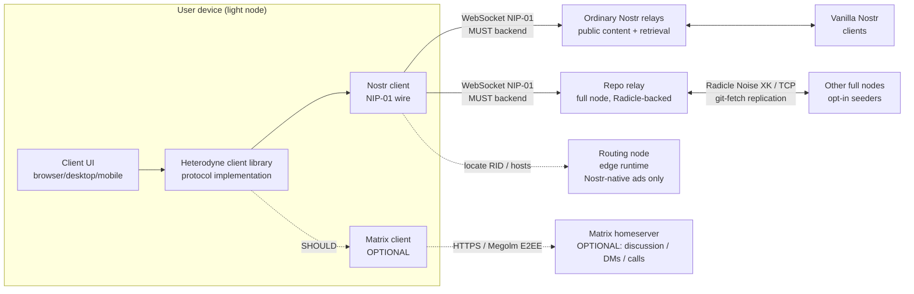

# Architecture overview

This document is a non-normative introduction to Heterodyne for new
contributors. The normative specification is at
[`spec/heterodyne.md`](spec/heterodyne.md).

The spec is in its **0.x phase — in flux until 1.0**: everything is
subject to change and any `0.x` release MAY break the prior one
(semver 0.x rule; see spec §12.1). This overview refers to the spec
as **0.x** rather than a single point version.

> **Substrate pivot (v0.4.0, ADR-026 through ADR-029).** As of v0.4.0
> Heterodyne runs **Nostr signed events over a Radicle + Nostr core
> substrate, with Matrix demoted to an OPTIONAL layer**. Nostr events
> are carried over two co-equal MUST backends - ordinary Nostr relays
> and Radicle-backed **repo relays** - and confidentiality is a property
> of repo visibility plus app-layer encryption rather than of a
> homeserver. Matrix is a SHOULD-level layer for real-time group
> discussion, calls, and encrypted rooms (two-party DMs also have a
> CORE, Matrix-free double-ratchet path, §5.7); a Matrix-free client is
> fully conformant. This overview reflects the pivot throughout; for
> MUST/SHOULD detail defer to the normative spec (§5 repo-visibility
> taxonomy, §7 discovery and node roles, §9 privacy tiers, §10 node
> topology) and to ADR-026..029, which are authoritative. See
> [`adr/`](adr/).

## What we're building

Heterodyne is a decentralized social network protocol. A user's identity
is a Nostr `secp256k1` keypair. Broadcast content is Nostr-native,
carried over ordinary Nostr relays and Radicle-backed repo relays;
real-time discussion and membership-gated interaction use the OPTIONAL
Matrix layer. The combination gives:

| Property | Comes from |
|---|---|
| Cryptographic authenticity; key portability across servers; forwardability to vanilla Nostr; the canonical content unit | Nostr |
| Durable peer-to-peer content replication behind a NIP-01 wire; signed git storage; repo-visibility privacy tiers; org governance via delegates + threshold (with optional per-ref `crefs`) | Radicle (core) |
| End-to-end group encryption (Megolm today, MLS in flight); stateful access control; federated real-time transport; native moderation primitives | Matrix (OPTIONAL) |
| Multi-homing, persona-preserving key rotation, pseudonymous attribution with optional transferable proof, forward-secret Matrix-free DMs | Heterodyne's composition |

## The load-bearing decisions

The design rests on the choices below, each recorded with rationale
so future contributors understand why we picked what we picked.

### 1. The canonical unit is a Nostr signed event, read/written over two backends

A Heterodyne content item is a NIP-01-compliant Nostr signed event.
Every conforming client MUST be able to read and write those events
over two co-equal backends:

- **Ordinary Nostr relays** - the plain NIP-01 websocket wire.
- **Repo relays** - a NIP-01 websocket endpoint served by a full node
  whose event store is a **Radicle git repository**. At the wire level
  a client cannot tell a repo relay from a plain relay; the difference
  is what is behind it, a Radicle-replicated, delegate-signed git store
  rather than one relay's database.

The two backends are interchangeable *sources* of the same event: the
Nostr event `id` (sha256 of the serialized event) is the dedup key, so
a client that sees a post on both backends keeps one copy. Content
authenticity always rests on the Nostr signature, verified locally by
every reader; a repo relay's git-ref signature is a storage attestation,
not authorship.

When the OPTIONAL Matrix layer carries an event, the wrapped form
(`m.heterodyne.note.v1`) embeds the full signed Nostr event verbatim,
so it can be lifted into vanilla Nostr 1:1 (same `id`, same signature,
same kind) and its authenticity survives the transport. Matrix-layer
discussion traffic and reactions/replies default to bare Matrix events:
attributable to the sender's npub through delegation, but without a
transferable third-party proof. A sender can opt into that proof with
`heterodyne_nostr_sig` or a wrapped `m.heterodyne.note.v1`; this is an
authenticity badge, not a deniability mode.

See spec §4 and ADR-026.

### 2. Identity: npub canonical, anchored by KERI and a `kind:31005` RID pointer

The npub is the authoritative identity, independent of any server.
The public discovery anchor is the Nostr-native **`kind:31005`
identity pointer**, which maps **npub → Radicle Repository ID (RID) +
optional full-node host hints** and is cold-root/epoch-signed. A
persona publishes it to Nostr relays and SHOULD mirror it into its
identity repo. Multiple personas are first-class.

The RID pointer is what makes the persona's presence relocatable: if a
serving full node is lost, or (in the OPTIONAL Matrix layer) an
identity room is compromised, the persona republishes `kind:31005` and
followers' clients prioritize the latest pointer over cached
locations. The npub does not change; only the container moves. A
Matrix identity room is now an OPTIONAL container, not the identity
anchor.

Devices are *delegated publishers* bound by epoch-key-signed
`kind:31001` attestations. A device that participates in Radicle
replication carries **two keys**: a **secp256k1 publishing/epoch key**
that signs the actual Nostr events (preserving vanilla-Nostr interop
and single-signature validity) and an **Ed25519 Radicle Node ID
(NID)** that signs git refs. One attestation binds both to the persona
with a bidirectional proof (the epoch key signs the binding and the
NID signs it back). A browser-only / light device that cannot run a
full node needs no NID; its repo writes are performed by a
persona-controlled full node (Decision 3, ADR-027). In the OPTIONAL
Matrix layer the same attestation slot can instead target a Matrix
MXID.

Vanilla Nostr's key-rotation pain (rotating means abandoning your
followers) is solved by committing to **KERI** (Key Event Receipt
Infrastructure) for root inception and rotation: explicit sequence
numbering, threshold witnesses, deterministic fork resolution. The
v0.1.4 single-key successor/predecessor chain was retired in v0.2.0
because it was vulnerable to "fork-freezing" attacks. The normative
KERI payload schemas are in spec §3.5; the Cold Root + Epoch Keys
design remains background rationale.

Radicle has its own identity model - a repo identity document listing
Ed25519 NID `delegates` and a `threshold`, plus `crefs` canonical-ref
rules - but it has no native key rotation. Heterodyne keeps the KERI
key event log (KEL) as the single authority and treats the Radicle
identity document as a derived projection: on any divergence, clients
trust the KEL, so a KERI revocation invalidates a delegate even if the
identity doc still lists it. See spec §3 and ADR-027.

### 3. Outbox model: every author writes into their own repo

A Heterodyne persona broadcasts into repos it controls, served to the
world through repo relays and mirrored to ordinary Nostr relays. Each
audience - public, friends, work - is a separate feed, scoped by the
repo-visibility tier it is published under (Decision 4). The client
surfaces "distribution lists" and "friend circles"; the repo's
`delegates`, `threshold`, `visibility.allow` set (with optional per-ref
`crefs`) are the implementation detail.

A persona's repo is single-writer (its delegates), so committing an
event into it is a **full-node operation**: authoring the Nostr event
is a client operation with the secp256k1 publishing key, and a light
device submits its signed event to a persona-controlled full node's
repo relay, which persists it under a delegate NID. Because a follower
cannot write into the author's repo, **asynchronous interaction uses
the Nostr outbox model**: reactions (NIP-25) and replies (NIP-10) are
events each user writes into their *own* outbox (their repo relay and
Nostr relays), referencing the target event `id`. Threads are assembled
scatter-gather across repliers' outboxes and deduplicated by event
`id`. A full node MAY materialize a hot thread as a Radicle
Collaborative Object (`xyz.heterodyne.thread`) as an optimization, but
the outbox is the source of truth. Real-time chat and calls are the
province of the OPTIONAL Matrix layer, and clients MUST degrade
gracefully to async outbox interaction when Matrix is absent; two-party
DMs additionally have a CORE, Matrix-free mechanism (Decision 5).

This splits the censorship-resistance burden: repo relays and Nostr
relays carry broadcast events and feed indexes, Radicle replicates the
repos peer-to-peer among opt-in seeders, and (optionally) Matrix
federation carries real-time discussion.

See spec §6.5, §7 and ADR-029.

### 4. Broadcast privacy is a repo-visibility tier, not a room type

Confidentiality is a property of **repo visibility plus app-layer
encryption**, not of a homeserver. Every broadcast post is a
Nostr-signed event; the tier it is published under sets who can read
it. There are three tiers, each with a trust boundary a client MUST
state to the user honestly:

- **Tier 1 - Public repo.** A world-readable, world-seedable Radicle
  repo, mirrored to ordinary Nostr relays. Plaintext. Confidential
  against no one. This is the analog of the retired `public_broadcast`.
- **Tier 2 - Private repo ("unencrypted-but-not-discoverable").** A
  Radicle repo with `visibility: private` and an `allow` list. It is
  **invisible and unfetchable** to non-allowed nodes, but the content
  is **plaintext git objects on every allowed seeder** - so it is NOT
  confidential against members or any node the owner lets seed. A
  client MUST NOT call it "encrypted." This is the user-requested new
  tier for audience-scoped content where the audience is trusted with
  plaintext.
- **Tier 3 - Encrypted-blobs-in-repo.** Content encrypted with NIP-44
  v2 under an audience/room key **before** it is committed, stored as
  encrypted blobs in a repo (public or private). Confidential against
  **everyone** who is not a key-holder, including seeders and rented
  full nodes. This replaces the v0.3.0 room-key-wrapped
  `private_broadcast`: git is the blind ciphertext transport instead of
  relays, and no Matrix dependency is required.

The per-persona **feed indexes** (`kind:31007`) that record each
curated post order are Nostr-native replaceable events published to
both backends, and remain the canonical **ordering/curation authority**
regardless of which backend served a post. This dates to a v0.2.0
change: v0.1.4 stored the index as a Matrix state event, which let
anyone with state-write power silently rewrite a persona's feed.
Moving it onto Nostr makes it epoch-key-signed and tamper-evident.

For Tier 3, both the index and the posts expose only an opaque `key_id`
on the wire; the RID, entries, relay hints, and page links live inside
the encrypted payload or an in-audience descriptor. Audience-key
distribution does NOT depend on Matrix: a reserved **`kind:31011`
audience-key-wrap event** NIP-44-wraps the audience key **once per
recipient** to that recipient's npub over the repo/Nostr substrate, so
a Matrix-free member can locate and unwrap their copy from clear data
alone. The audience key rotates on member **removal** (redistributed
via `kind:31011` to the remaining roster), so removed members cannot
read future content. A private repo separates two permissions that MUST
NOT be conflated: `delegates` (identity/canonical-ref governance) and
`visibility.allow` (the nodes allowed to replicate and read).

Events are classified per kind as **indexed** (appear in `kind:31007`:
microblogs, long-form, classifieds) or **non-indexed** (reactions,
zaps, follow lists, deletions - visible but rendered contextually). A
publisher MAY override per-event via a `heterodyne_index` tag. See spec
§6.8.

**Retrieval.** Receivers fetch events referenced from a public
`kind:31007` `e` tag or a decrypted Tier 3 index entry from a full
node's repo relay or an ordinary Nostr relay (Channel 1), or, as a
fallback, from the publisher's optional user-hosted HTTPS archive
(Channel 2). The spec does NOT host an archive service. Matrix-DM
backfill requests / responses / pushes are **forbidden** (DoS /
rate-limit vector); events not retrievable via the two channels are
considered permanently lost. **Deletion is not erasure**: `kind:5`
deletion plus an updated `kind:31007` signals intent, but public /
private-tier plaintext may persist on every node that seeded the repo,
and Tier 3 ciphertext remains in immutable git history.

Every repo that carries encrypted blobs (Tier 3 content repos and the
config repository of Decision 9) lays its ciphertext out **one branch
per audience-key generation**, `refs/heads/enc/<key_id>`; the
`defaultBranch` carries no ciphertext. Rotating an audience key creates a
fresh `enc/<key_id'>` branch and force-deletes the retired one from the
signed ref set, so cooperating seeds converge to a ref tree without the
old ciphertext. This scrub is deliberately framed as **cooperative
hygiene, not cryptographic erasure**: a hostile or offline seed MAY keep
the old branch, and copies already on ordinary Nostr relays are
untouched. That honesty flows from Tier 3's forward-secrecy posture -
the audience key is **static**, so a key compromise decrypts every past
post under its `key_id`, and rotation limits only *future* exposure
(spec §9.5). This is the sharpest contrast with the CORE DMs of Decision
5, which are forward-secret.

See spec §5, §6, §9 and ADR-028.

### 4b. Node topology: full / routing / light, and the repo-relay adapter

There is no Heterodyne appservice and no homeserver or Radicle-node
software modification. The cross-protocol logic is part of the client.
The spec is language- and runtime-agnostic; conformance is determined
by the normative spec, with authored test vectors (§14) as the
interoperability suite. There are three node roles:

- **Full node.** Runs a Radicle node (Noise XK / TCP gossip + git-fetch
  replication) **and** a NIP-01 **repo-relay adapter** over its repo
  store. Full nodes are the only nodes that hold content; a persona
  needs at least one durably-connected full node to replicate reliably,
  because Radicle replication is announce-then-fetch with no real-time
  push and ephemeral nodes do not propagate.
- **Routing node.** A stripped-down, edge-runtime-deployable node (e.g.
  a Cloudflare Worker) that does NOT clone repos and holds no content.
  It answers "which full nodes serve the repo relay for this npub /
  RID?" from Nostr-native advertisements (`kind:31005`, `kind:31010`)
  only, so it needs no Radicle participation. ("Routing," not "seed,"
  to avoid collision with Radicle *seeding*, which means storing and
  replicating a repo.) It MUST NOT be required to proxy content.
- **Light node.** A client (including WASM / browser / mobile) that
  queries a routing node, then connects **directly** to a full node's
  repo relay (or an ordinary Nostr relay) to fetch content, and
  **verifies every event's Nostr signature locally**. It pulls no
  content through the routing node.

The repo-relay adapter is the move that unblocks browser and mobile
clients: they speak plain NIP-01 websocket, and Radicle's raw-TCP /
Noise-XK transport lives only between full nodes, never in front of a
client. The trust story improves rather than regressing: a routing node
sees which repos a client asks about (a metadata leak) but never
content, so it cannot tamper; a full node cannot forge npub-signed,
client-verified events and can only withhold, which a light node routes
around using other hosts and the Nostr-relay backend.

Client state portability moves onto the repo/Nostr substrate, split by
sensitivity across three core carriers (spec §3.8.6-§3.8.8): a
per-persona **config repository** (an unadvertised private Radicle repo
of encrypted blobs) holds non-key private state - preferences, private
config, device inventory; a strictly local-only **keys repository**
(never Radicle-replicated) holds key material - the NIP-49-wrapped
`nsec`, epoch/NID secrets, held audience keys, the config-repo pointer -
and syncs between a user's own devices only over an encrypted CORE DM or
an offline restore; and mute lists ride the NIP-51 carrier (Decision 6)
as ordinary events on both backends. A RECOMMENDED removable-media (USB)
backup covers produced and followed repos, config repositories, and the
encrypted keys repository, restored keys-repo -> config-repo -> content.
The OPTIONAL Matrix encrypted config room (§3.8) MAY still mirror this
state but is no longer required, and the core carriers win on divergence.

See spec §7 (discovery / node roles) and §10 (node topology and the
repo-relay adapter), and ADR-026.

### 5. Direct messages (CORE double ratchet) and real-time discussion (OPTIONAL Matrix)

**Two-party DMs are CORE and Matrix-free.** Two personas message each
other with a Signal-style **Double Ratchet carried in Nostr events** -
the nostr-double-ratchet wire, with NIP-44 v2 payload encryption. This
gives **forward secrecy and post-compromise security** (unlike the
static-key Tier 3 broadcast of Decision 4) and hides conversation
metadata from relays: each `kind:1060` ratchet message is signed by a
fresh per-message key derived from the ratchet, *not* the sender's epoch
key, so a relay cannot link a conversation's messages to each other or
to either persona. Invites are addressable `kind:30078` events and
invite responses are gift-wrap-shaped `kind:1059`. Ratchet ciphertext
MUST NOT be committed to a repo or stored by a repo relay, and there is
no DM backfill - so losing local ratchet state loses history, the
honest cost of forward secrecy. DM support is a RECOMMENDED client
feature; a client that offers DMs MUST implement this mechanism, so any
two DM-capable clients interoperate without Matrix. DMs to
vanilla-Nostr-only recipients fall back to NIP-17 gift-wrap, which has
no forward secrecy.

The Heterodyne addition over the base wire is **delegation binding**: a
session MUST bind to the peer persona through a currently-valid
`kind:31001` delegation whose authority chains to the peer's cold root
via the KEL, so a DM is a conversation with a *verified delegated
device* under the same attribution model as everything else (Decision
2). This pattern - a double ratchet over the nostr-double-ratchet wire -
is adopted from the production iris-client Nostr client and adapted with
Heterodyne's delegation binding.

**Real-time group discussion and calls stay in the OPTIONAL Matrix
layer** (SHOULD-level). Because the repo substrate is announce-then-fetch
with no real-time push, a client that requires live group interaction
SHOULD use Matrix and MUST degrade gracefully to async outbox
interaction (Decision 3) when it is absent. A Matrix two-member
`private_discussion` room is an *additional* DM surface, not a substitute
for the CORE mechanism; a client that omits Matrix entirely is fully
conformant for identity, publishing, discovery, DMs, and all three
privacy tiers.

See spec §5.7 (CORE DMs), §5.4, §5.5, §4.3, §4.4 and ADR-029.

### 6. Moderation: NIP-72 approval or the Radicle delegate-threshold canonical-branch editorial gate

Editorial gating - whose posts surface in a community's curated feed -
has two parallel mechanisms answering the same question, and a
community MAY use either or both:

- **Radicle editorial-gating mode.** For a repo-hosted community, a
  post is editorially approved iff it is reachable from the
  delegate-threshold-approved canonical feed branch (the commit a
  threshold of delegates agree on). Governance lives at the repo layer:
  the canonical branch requires M-of-N admin sign-off. Radicle's finer
  per-ref `xyz.radicle.crefs` mechanism is an OPTIONAL refinement on
  top, verified against Heartwood 1.9.1; baseline canonicity does not
  depend on it, a scoping choice rather than a verification hedge.
- **NIP-72 approval.** The `kind:4550` moderator-approval flow (§8,
  ADR-014) is a CORE mechanism: approvals are vanilla NIP-72 events
  published to Nostr relays and referenced from the moderator's
  `kind:31007` index. The moderator set and threshold live in a
  **`kind:34550`** community-definition event on both core backends
  (moderators listed by permanent cold-root npub; the threshold is a
  Heterodyne `["approvals_required", "<N>"]` extension tag, absent = 1
  and vanilla-NIP-72-compatible) - no Matrix room is required. What each
  counted approval needs is an **anchor** that fixes the moderator set
  as-of the approval: for a repo-hosted community the anchor is the
  approval's introducing commit, resolved against the `kind:34550`
  revision in that commit's ancestor history (git-native "state at
  event"); for a Matrix-hosted community it is an
  `m.heterodyne.approval.v1` event resolved by Matrix state; and a
  relay-only community falls back to signed `created_at`, a
  reduced-assurance mode because timestamps are author-forgeable.
  Because the repo anchor rests on the same delegate-threshold sigrefs
  that govern the repo, the only parties who could rewrite moderation
  history are the same delegates who already control the moderator list.

Organizations are first-class personas whose repo `delegates` and
`threshold` (with optional per-ref `crefs`) encode governance (a plain
user is the one-delegate, threshold-1 degenerate case). A published org
event still carries exactly **one** Schnorr signature from the org's
epoch key; "the org approved this" is proven by reachability from the
delegate-threshold-approved canonical feed branch, not by a
multi-signature on the event. For an org, both the posts and the
`kind:31007` index MUST be reachable from that canonical feed branch
before a client treats them as canonical, which stops a rogue epoch-key
holder from bypassing governance via the relay backend.

Underneath editorial gating sits a **personal and community filtering
layer**, all on the core NIP-51 carrier. A persona's mutes are an
epoch-key-signed `kind:10000` list (public entries as clear tags,
private entries NIP-44-encrypted to self, re-encrypted on rotation),
published to both backends; the NIP-51 private-item pattern is adopted
from iris-client and adapted with Heterodyne's epoch-key derivation.
Community blocklists ride the same carrier: a **policy persona**
publishes `kind:10000` / `kind:30007` / `kind:30000` lists a community
adopts by tag in its `kind:34550` definition. NIP-32 `kind:1985` labels
add a graded, advisory annotation signal that gates nothing on its own.
On top, clients run a non-normative **web-of-trust filter** - follow
distance from `kind:3` graphs plus an "overmuted ratio" that downranks
authors whom more of the user's network mutes than follows, a
crowd-moderation pattern proven in iris-client and enabled here by the
subscribable NIP-51 carrier. Because a repo relay's event store is git,
list revisions are tamper-evident, so a client can detect a relay
serving a stale list and prefer the newest verifiable revision.

In the OPTIONAL Matrix layer, room-level ACLs (power levels, kicks,
bans, server ACLs) still decide who is in a discussion room, and
MSC2313 policy rooms are an additional blocklist carrier, but that is a
property of the optional layer, not the moderation floor.

See spec §8, §8.5, §8.6, §8.9, §8.10, §6.7.0 and ADR-027.

### 7. ATProto as a decorative attached outbox (and KERI witness)

ATProto is **not** a Heterodyne identity layer. It is treated the
same way vanilla Nostr relays are: a publish target a persona MAY
opt in to mirroring a subset of their public feed to. The motivation
is purely adoption — Bluesky has cultural visibility Nostr and Matrix
don't, and mirroring a feed there is a low-friction discovery funnel.

The persona's canonical identity remains the npub anchored by KERI and
the `kind:31005` RID pointer (Decision 2). A cryptographically
verifiable npub ↔ DID binding (double-signed: npub signs DID, DID signs
npub) lets each side surface "verified counterpart" trust signals
without elevating ATProto to a trust root. Encrypted-tier content never
mirrors.

Independently of mirroring, the ATProto signing key MAY co-sign a
persona's KERI inception and rotation events (see the Cold Root +
Epoch Keys design) as a peer witness. ATProto's auditable
DID-document key history makes it a strong continuity witness for
the `none`-strategy rotation case, where no cryptographic chain to
the prior cold root exists. The witness signature is additive — it
does not satisfy any MUST signature requirement.

This is the v0.1.4 addition. Its scope is bounded: opt-in per feed and
per kind, off by default, and reversible (removing ATProto support is a
local change). The template - per-protocol binding, mirror outbox,
optional KERI witness role - is reusable for future ecosystems should
one emerge with stronger adoption signal.

See spec §11.6.

### 8. Embedded Tor: onion reachability is a universal client requirement

Privacy-focused Nostr relays, repo relays, routing nodes, full nodes,
and (optional) Matrix homeservers increasingly live on `.onion`. If a
Heterodyne client cannot reach them, they are advertised-but-unreachable
- second-class. To make onion-hosted feeds and endpoints first-class,
embedded Tor is a **universal client conformance requirement**, not an
optional add-on. Onion reachability extends to every Heterodyne
endpoint type, and full-node Radicle replication SHOULD be able to run
over `.onion` (Radicle SOCKS5 Tor support).

Two capabilities are deliberately kept separate, because conflating them
is the easy mistake:

- **Onion reachability** — can the client *connect to* a `.onion`
  endpoint? This is a Universal MUST on every platform. The client ships
  Tor *as part of the application* (a bundled library, native binding,
  or WASM build), rather than depending on a separately installed Tor
  daemon or an external SOCKS5 proxy. The one platform that cannot open
  the raw TCP sockets Tor needs — browser/WASM runtimes — satisfies the
  MUST by tunneling embedded Tor through a WebSocket pluggable-transport
  bridge (experimental, bridge-dependent), and surfaces an indicator
  when no bridge is reachable. Native desktop, Node.js, and mobile apps
  embed Tor directly (Onion Browser and Orbot already do this on iOS).

- **Egress-over-Tor** — does the client route the *user's own* traffic
  over Tor to hide their network location? This is opt-in,
  off-by-default, behind a prominent toggle. Keeping it opt-in protects
  the compatibility-first stance: no surprise latency/battery cost, no
  breakage on Tor-blocking networks. The strict-mode profile (spec
  §11.7) elevates it to default-on.

Why this doesn't violate the §1 "does not define a transport" non-goal:
requiring that a client can *reach* an existing transport is a
conformance property, not the definition of a new one. Tor is composed,
exactly as clearnet TCP/TLS is. The requirements are written in terms of
capability and reachability — never a named library, daemon, or version
— preserving implementation-agnosticism. Egress-over-Tor upgrades the
passive-network-observer and cross-persona-metadata-linking threats from
"deferred future work" to in-scope mitigations; Tor-level traffic
analysis remains a documented residual limitation.

See spec §7.7, ADR-019 and ADR-029.

### 9. Redundancy and social recovery: survive losing a full node

A persona's identity and content should not die with one full node.
Two complementary layers address this, built from Radicle and Nostr as
they exist - no new replication protocol.

**Infrastructure layer - opt-in Radicle seeding (ADR-020, reframed by
ADR-026).** Redundancy is a property of who seeds the persona's repo.
Any peer MAY seed a repo; each seeding full node thereby holds a full
replica, so redundancy scales with interest (followers seeding accounts
they follow), not with automatic popularity-weighting - Radicle has no
"replicate because it's trending" mechanism. A persona is reachable
through every full node that serves its repo relay, tracked by
`kind:31010` node advertisements. Losing a serving full node degrades
to another host from the routing node's list plus the Nostr-relay
backend; if the persona's last durable host is lost, it re-anchors by
republishing `kind:31005` to a new RID. The client MUST surface
host-count and durable-host warnings rather than assume replication.
Voluntary host-exit collapses into "point `kind:31005` at another RID,"
so there is one redundancy model, not two.

**Client-state sync (ADR-020).** Client state syncs over the repo/Nostr
substrate on the three carriers of Decision 4b: non-key private state in
the unadvertised **config repository**, key material in the local-only
**keys repository** (synced device-to-device over an encrypted CORE DM or
an offline restore, never replicated), and a RECOMMENDED removable-media
(USB) backup as the durable floor. A new device re-syncs without a Matrix
config room. When the OPTIONAL Matrix layer is in use, the mutual
config-room membership of §3.9.1 remains an alternative mirror.

**Social layer - friend-cache + vouching (ADR-021).** When *every*
persona-run full node is gone, infrastructure redundancy is exhausted
and recovery falls to the social graph, in three beats:

- *Friend-cache.* Followers cache the persona's signed identity and
  feed events (followers MAY, mutuals SHOULD, declared §3.5 witnesses
  MUST), filtered to only the persona's own signed feed/identity events
  plus KERI events - both cheap and poisoning-resistant.
- *Re-anchor.* A fresh cold-root `kind:31005` on relays is the
  authoritative new-RID pointer, with the cache as trust bridge and
  fallback.
- *Vouching.* Key continuity is re-established through the existing KERI
  witness machinery in two tiers: authoritative declared witnesses, plus
  an advisory-only informal `kind:31008` vouch tier that is never counted
  toward the threshold and feeds only a manually-confirmed promotion
  snowball. The human "is this really you?" check is deliberately left
  out of band - standardizing it would create one capturable surface.

`did:key` (ADR-022) is added precisely so a friend's bare key can be a
declared witness without any DID-document resolution.

See spec §3.11, §3.12, §3.5.5 and ADR-020/021/022/026.

## High-level diagram

Broadcast content and feed indexes are Nostr signed events carried over
two co-equal backends: ordinary Nostr relays and repo relays (NIP-01
endpoints backed by a Radicle git store). Radicle's peer-to-peer
replication lives entirely between full nodes and never sits in front of
the client. A routing node resolves npub → RID + host hints from
Nostr-native advertisements without holding content; the light-node
client fetches directly from a full node and verifies every event's
Nostr signature locally. Broadcast confidentiality is set by
repo-visibility tier plus app-layer NIP-44 encryption, not by a server.
The OPTIONAL Matrix layer carries real-time group discussion and calls
(and an additional DM surface); two-party DMs also have a CORE,
Matrix-free double-ratchet path over Nostr, and a Matrix-free client is
fully conformant.

## Where `mxdx` fits

Heterodyne and `mxdx` are sibling projects that share architectural
DNA. Since the v0.4.0 pivot the Matrix-specific habits apply to
Heterodyne's OPTIONAL Matrix layer, while the client-side, no-server-
modification habit now applies to repo relays, routing nodes, and full
nodes too:

- Hard invariant that every Matrix event in a private context is E2EE,
  including state events (MSC4362) - relevant when the OPTIONAL Matrix
  layer is used.
- OS keychain integration for sensitive material at rest (nsec, the
  Ed25519 NID, and any Matrix keys).
- Pure client-side model: no protocol-specific server modifications;
  vanilla Nostr relays, Radicle nodes, and (optional) Matrix
  homeservers handle Heterodyne traffic unmodified.

Heterodyne is **not** a fork of `mxdx` and does not depend on its code.
The protocols are different (one is fleet-management with PTYs and
WebRTC; the other is social with Nostr events, git-backed repos, and
pub/sub). Beyond the shared invariants above, Heterodyne is
implementation-agnostic: the spec does not prescribe a language,
runtime, or shared core for clients.

## Open design questions

All current (0.x) spec sections are drafted. The remaining open
questions are follow-up work that does not block the current draft:

- ~~**Cross-device persona-private state synchronization.**~~ *Resolved
  (ADR-020, reframed by ADR-026).* Per-persona config, preferences, and
  key backups sync over the repo/Nostr substrate (Decision 4b); the
  OPTIONAL Matrix config room remains an alternative carrier when that
  layer is in use. See decision 9 above.
- **Repo-relay storage contract (§10).** The reserved ref namespace
  (`refs/cobs/xyz.heterodyne.*` and the outbox append-log layout), the
  COB type registry, the NIP-01-filter → git-read mapping, and
  retention / GC / quota rules must be fixed before a repo relay can be
  declared conformant (ADR-026). Radicle's per-fetch size limits bound
  this - verified against Heartwood 1.9.1 as hardcoded defaults with no
  CLI or node-config override (5 MiB special refs, 5 GiB data refs).
- **`matrix:` URI refactor of §7 outbox schemas (OPTIONAL Matrix
  layer).** The OPTIONAL Matrix outbox listings still use the legacy
  `{room_id, via}` structured form for backward source compatibility,
  while newer Matrix-layer constructs use `matrix:` URIs. A future
  revision can migrate them; not urgent.
- **MLS implementation validation (OPTIONAL Matrix layer).** §9.2
  defines the migration procedure, but Matrix MLS support still needs
  first-party client validation against real SDK behavior before it can
  be treated as operationally mature.
- **Conformance reporting formalization.** §14.4 leaves the
  conformance-claim mechanism informal. A future spec version may
  define a conformance manifest format consumable by a registry.
- **Canonical topic taxonomy.** The spec lets clients pick reverse-DNS
  namespaces (§5.1), but a recommended common set (under
  `org.heterodyne.topics`) would improve discoverability. Defer until
  there's actual usage to draw from.
- **Transitive join-rule consistency (OPTIONAL Matrix layer).** §7.2
  recommends `restricted` join rules (MSC3083) for advertised inner
  rooms; should the spec formalize a check that inner rooms are at least
  as restrictive as their advertiser?
- **Megolm session establishment under robust batched delivery
  (OPTIONAL Matrix layer).** §6.4's "robust batched delivery" semantics
  interact with the latency of Megolm session setup for fresh members.
  Worth a worked example in the test vectors.
- **FROST threshold signing for orgs.** Org governance lives at the
  delegate-threshold canonical-feed-branch layer today; true threshold
  *signing* of an org epoch key (FROST-style secp256k1) is deferred as
  future work (ADR-027), so a rogue epoch-key holder is bounded by
  canonical-branch reachability rather than cryptographically prevented
  from signing.
- **Persona switching UX.** Multiple personas (§3.4) are a first-class
  feature, but the spec is silent on how clients SHOULD present
  switching. UX-only - defer to client implementation.
- **Out-of-scope security threats.** Compromised user devices, traffic
  analysis under Tor, repo-relay / routing-node metadata leakage, and
  post-quantum adversaries are explicitly out of scope for the current
  0.x spec (see threat model). Each is a future-spec-version question.
