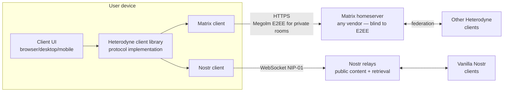

# Architecture overview

This document is a non-normative introduction to Heterodyne for new
contributors. The normative specification is at
[`spec/heterodyne.md`](spec/heterodyne.md).

## What we're building

Heterodyne is a decentralized social network protocol. A user's identity
is a Nostr `secp256k1` keypair. The user's content is carried over Matrix
rooms. The combination gives:

| Property | Comes from |
|---|---|
| Cryptographic authenticity; key portability across homeservers; forwardability to vanilla Nostr | Nostr |
| End-to-end group encryption (Megolm today, MLS in flight); stateful access control; federated transport; censorship resistance at the server layer; native moderation primitives | Matrix |
| Multi-homing, persona-preserving key rotation, deniability-on-demand | Heterodyne's composition |

## The load-bearing decisions

The design rests on the choices below, each recorded with rationale
so future contributors understand why we picked what we picked.

### 1. Event envelope: verbatim Nostr inside Matrix where Matrix carries the event

Where Heterodyne carries an event over Matrix, the wrapped form
(`m.heterodyne.note.v1`) embeds the full signed Nostr event
verbatim. Matrix is "just transport." This gives:

- A wrapped event can be lifted into vanilla Nostr 1:1 with no
  transformation. Same `id`, same signature, same kind.
- Authenticity survives transport: if the event leaks past the Matrix
  layer, the Nostr signature still proves origin.

Where Heterodyne carries an event over Nostr (the default for
public broadcast and moderated rooms — see Decision 4 below), the
event is just a NIP-01-compliant Nostr event on a Nostr relay. The
Matrix room references it by ID from `feed_status`.

Wrap is **optional inside E2EE Matrix rooms** — senders can choose
deniability per event. In `private_community` rooms wrap is the
sensible default but the sender can opt out per message. In DMs the
default flips: bare by default, with an opt-in
`heterodyne_nostr_sig` field for explicit authenticity.

See spec §4.

### 2. Identity: npub canonical, Matrix accounts are delegated publishers

The npub is the authoritative identity. Matrix accounts are
*delegated publishers* bound by double-signed attestations in a
per-persona **identity room**. Multiple personas are first-class. Vanilla
Nostr's key-rotation pain (rotating means abandoning your followers) is
solved by an explicit identity-chain mechanism: an outgoing npub points
to its successor; the successor points back; followers walk the chain
transparently.

See spec §3.

### 3. Outbox model: every author admins their own rooms

A Heterodyne user broadcasts via Matrix rooms they own. Each circle —
friends, close friends, work, public — is a separate room with different
membership. The client surfaces "distribution lists" and "friend
circles"; Matrix power levels are the implementation detail and stay
hidden from the user.

This places the censorship-resistance burden on Matrix federation rather
than on Nostr relays. The user gains stateful, fine-grained membership
control. The cost is that "follow" becomes "join the broadcaster's
room," which is heavier than Nostr's pure follow-list approach but
unlocks the moderation and encryption story.

See spec §7.

### 4. Public content lives on Nostr; Matrix public rooms hold indexes

Public Heterodyne content (posts in `public_broadcast` and
`public_moderated` rooms) lives on Nostr relays. The corresponding
Matrix rooms hold only **indexes** (`m.heterodyne.feed_status.v1`
state events that reference Nostr event IDs in display order, with
per-entry retrieval hints) and standard room state (kind, moderators,
power levels). Vanilla Matrix clients peeking at a `public_broadcast`
room see an effectively empty timeline; that's the design.

Private E2EE content (`private_community`, DM) continues to ride
*inside* the Matrix room — leaking encrypted-room content to public
Nostr relays would defeat the encryption. The same `feed_status`
mechanism still applies there, encrypted alongside the wrapped events.

This split plays each protocol to its strengths:

- Nostr relays are well-suited to high-volume public broadcast and
  already provide the open ingress/egress model public content needs.
- Matrix rooms are well-suited to membership-gated state — exactly
  what a curated feed index, moderator list, and approval log are.

Events are classified per kind as **indexed** (appear in feed_status:
microblogs, long-form, classifieds) or **non-indexed** (reactions,
zaps, follow lists, deletions — visible but rendered contextually).
A publisher MAY override per-event via a `heterodyne_index` tag.
See spec §6.8.

**Retrieval.** Receivers fetch events referenced from a `feed_status`
entry primarily via the entry's own `retrieval_hints` — Nostr relay
URLs and/or an HTTPS archive URL the publisher operates. The spec
does NOT host an archive service; archive infrastructure is each
publisher's responsibility. As an encrypted-DM fallback for events
that can't be retrieved (lost Megolm sessions, expired hints), spec
§6.9 defines `retrieval_request`/`retrieval_response`/`retrieval_push`
event types.

### 4b. Bridge: pure client-side, any homeserver works unmodified

There is no Heterodyne appservice and no homeserver modification. Every
client is a full Matrix + Nostr client. The cross-protocol logic is
part of the client implementation. The spec is language- and
runtime-agnostic; conformance is determined by the test vectors (§14)
rather than by language or packaging choice.

This is the design choice that protects the blind-server property: a
homeserver-side bridge would see plaintext before Matrix encryption and
break the privacy story.

Per-MXID portability is provided by a dedicated **encrypted client
configuration room** (§3.8) that holds user preferences, per-persona
private state including mute lists, and Heterodyne-specific key
backups. A new device of the same MXID joins this room and re-syncs
configuration immediately.

See spec §10 (bridge model) and §3.8 (config room).

### 5. DMs: pure Matrix with optional Nostr wrap

Direct messages reuse Matrix DM rooms with `m.room.message` semantics. A
Heterodyne client adds an OPTIONAL `heterodyne_nostr_sig` field for
senders who want explicit authenticity on a specific message. By default
DMs are deniable in the same way encrypted Matrix DMs already are.

This makes vanilla Matrix clients render Heterodyne DMs natively, with
zero special handling — a substantial UX win for cross-network
conversations.

See spec §4.3, §4.4.

### 6. Moderation: Matrix is the floor, Heterodyne is the editorial ceiling

Matrix room-level ACLs (power levels, kicks, bans, server ACLs, MSC2313
policy rooms) decide who is in a room. NIP-72-style moderator approval
signatures, when used, decide whose posts surface in the feed view of a
public moderated community.

The two systems answer different questions and don't conflict. A user
banned from a room never publishes there. A user in the room whose posts
aren't moderator-approved is invisible in the curated feed but still
visible to anyone subscribed to the raw room.

See spec §8.

### 7. ATProto as a decorative attached outbox (and KERI witness)

ATProto is **not** a Heterodyne identity layer. It is treated the
same way vanilla Nostr relays are: a publish target a persona MAY
opt in to mirroring a subset of their public feed to. The motivation
is purely adoption — Bluesky has cultural visibility Nostr and Matrix
don't, and mirroring a feed there is a low-friction discovery funnel.

The persona's canonical identity remains the npub anchored in the
Matrix identity room. A cryptographically verifiable npub ↔ DID
binding (double-signed: npub signs DID, DID signs npub) lets each
side surface "verified counterpart" trust signals without elevating
ATProto to a trust root. Private E2EE content never mirrors.

Independently of mirroring, the ATProto signing key MAY co-sign a
persona's KERI inception and rotation events (see the Cold Root +
Epoch Keys design) as a peer witness. ATProto's auditable
DID-document key history makes it a strong continuity witness for
the `none`-strategy rotation case, where no cryptographic chain to
the prior cold root exists. The witness signature is additive — it
does not satisfy any MUST signature requirement.

This is the v0.1.4 addition. Its scope is bounded: opt-in per room
and per kind, off by default, and reversible (removing ATProto
support is a local change). The template — per-protocol binding,
mirror outbox, optional KERI witness role — is reusable for future
ecosystems should one emerge with stronger adoption signal.

See spec §11.6.

## High-level diagram

Public content flows over Nostr relays; Matrix carries indexes
(`feed_status` state events) and standard room state for the public
rooms that organize that content. Private rooms use Matrix end-to-end
encrypted transport for both content and indexes — the homeserver
routes ciphertext only. The user's client is the only place that
sees Nostr signatures and Matrix plaintext together.

## Where `mxdx` fits

Heterodyne and `mxdx` are sibling projects that share architectural DNA:

- Hard invariant that every Matrix event in a private context is E2EE,
  including state events (MSC4362).
- OS keychain integration for sensitive material at rest.
- Pure client-side bridge: no protocol-specific homeserver
  modifications; vanilla homeservers handle Heterodyne traffic.

Heterodyne is **not** a fork of `mxdx` and does not depend on its code.
The protocols are different (one is fleet-management with PTYs and
WebRTC; the other is social with Nostr events and pub/sub). Beyond
the shared invariants above, Heterodyne is implementation-agnostic:
the spec does not prescribe a language, runtime, or shared core for
clients.

## Open design questions

All v0.1 spec sections are drafted. The remaining open questions are
follow-up work that does not block v0.1:

- **Cross-MXID persona-private state synchronization.** A persona
  with multiple delegated MXIDs has separate config rooms (§3.8) per
  MXID; persona-scoped private state (mutes, prefs) does not auto-sync
  across them in v0.1. A future spec version may define a
  persona-private encrypted room joined by all the persona's MXIDs.
  Defer until usage demand is clear.
- **`matrix:` URI refactor of §7 outbox schemas.** New constructs in
  v0.1 (§3.8 config-room pointer, §3.5 successor URI, §11.3 identity
  pointer) use `matrix:` URIs. The §7 outbox schemas still use the
  legacy `{room_id, via}` structured form for backward source
  compatibility. A minor-version bump can migrate them; not urgent.
- **MLS migration procedure.** §9.2 reserves
  `m.heterodyne.encryption_version.v1` and the `algorithm` field, but
  the actual migration procedure (re-key, member re-acknowledgement,
  atomic flip) is deferred to a future spec version when Matrix MLS
  is stable enough across client libraries to depend on.
- **Conformance reporting formalization.** §14.4 leaves the
  conformance-claim mechanism informal. A future spec version may
  define a conformance manifest format consumable by a registry.
- **Canonical topic taxonomy.** The spec lets clients pick reverse-DNS
  namespaces (§5.1), but a recommended common set (under
  `org.heterodyne.topics`) would improve discoverability. Defer until
  there's actual usage to draw from.
- **Transitive join-rule consistency.** §7.2 recommends `restricted`
  join rules (MSC3083) for advertised inner rooms; should the spec
  formalize a check that inner rooms are at least as restrictive as
  their advertiser?
- **Megolm session establishment under robust batched delivery.**
  §6.4's "robust batched delivery" semantics interact with the latency
  of Megolm session setup for fresh members. Worth a worked example
  in the test vectors.
- **Persona switching UX.** Multiple personas (§3.4) are a first-class
  feature, but the spec is silent on how clients SHOULD present
  switching. UX-only — defer to client implementation.
- **Out-of-scope security threats.** Compromised user devices, traffic
  analysis under Tor-routed Matrix federation, and post-quantum
  adversaries are explicitly out of scope for v0.1 (see threat model).
  Each is a future-spec-version question.
