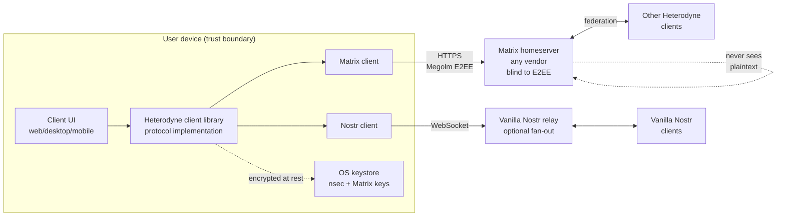
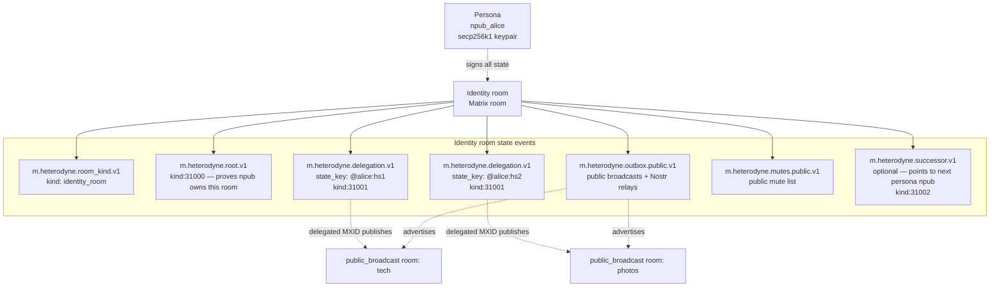
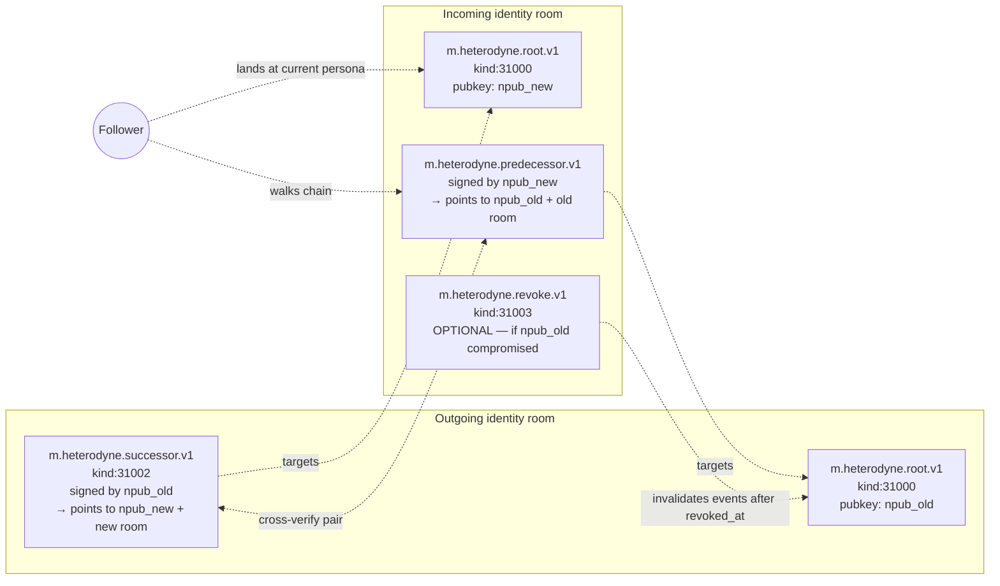
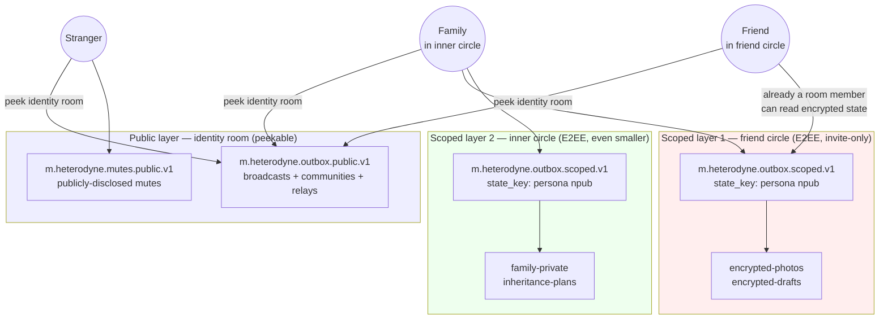

# Heterodyne Protocol Specification

**Version:** 0.1.4 (DRAFT — add ATProto attached outbox + social witnesses)
**Status:** Working draft. v0.1.4 adds an OPTIONAL ATProto (at://)
attached outbox: a non-load-bearing mirror that lets personas
publish a public subset of their Heterodyne feed to ATProto for
adoption reach, with cross-signed npub ↔ DID binding for
identifiability. The ATProto-side signing key MAY also act as a
KERI-style social witness on root inception and rotation events
(see Cold Root + Epoch Keys design,
`docs/superpowers/specs/2026-05-21-cold-root-epoch-keys-design.md`).
v0.1.3 introduced the prior design pivot: public Matrix rooms hold
only indexes and state, with the actual Nostr events on Nostr
relays. Private (E2EE) rooms continue to carry full encrypted
content. The spec also defines an indexed-vs-non-indexed event
classification, a per-kind default indexing policy, and a
retrieval/backfill mechanism. The spec is implementation-agnostic
— language and runtime choices are out of scope.

## System overview



Heterodyne is a decentralized social network protocol that composes
Nostr identity with Matrix transport. A persona's identity is a Nostr
`secp256k1` keypair (npub/nsec). Public content rides over Nostr
relays (high-volume broadcast); private E2EE content rides over
Matrix rooms (group encryption, stateful access control). Matrix
rooms additionally hold low-volume **indexes** that reference the
events belonging to a persona's feed, plus room state (membership,
moderation, configuration). The cross-protocol bridge is purely
client-side — no homeserver or relay modification is required, and
no specific language or runtime is prescribed.

This document is the normative specification for the Heterodyne protocol: a
decentralized social network built by publishing Nostr events into Matrix
rooms. It is the single source of truth that any independently-implemented
Heterodyne client MUST follow to interoperate.

The keywords MUST, MUST NOT, REQUIRED, SHALL, SHALL NOT, SHOULD, SHOULD NOT,
RECOMMENDED, MAY, and OPTIONAL in this document are to be interpreted as
described in [RFC 2119](https://www.rfc-editor.org/rfc/rfc2119).

## Table of contents

1. [Scope and non-goals](#1-scope-and-non-goals)
2. [Terminology](#2-terminology)
3. [Identity model](#3-identity-model) — **drafted**
4. [Event envelope](#4-event-envelope) — **drafted**
5. [Room taxonomy](#5-room-taxonomy) — **drafted**
6. [Publishing flow](#6-publishing-flow) — **drafted**
7. [Discovery and subscription](#7-discovery-and-subscription) — **drafted**
8. [Moderation](#8-moderation) — **drafted**
9. [Encryption guarantees](#9-encryption-guarantees) — **drafted**
10. [Bridge and client model](#10-bridge-and-client-model) — **drafted**
11. [Interoperability with vanilla Nostr and vanilla Matrix](#11-interoperability) — **drafted**
12. [Versioning and capability negotiation](#12-versioning-and-capability-negotiation) — **drafted**
13. [Security model](#13-security-model) — **drafted** (companion analysis in [`../security/threat-model.md`](../security/threat-model.md))
14. [Conformance and test vectors](#14-conformance-and-test-vectors) — **drafted** (vectors authored incrementally in [`vectors/`](vectors/))

## 1. Scope and non-goals

### 1.1 Scope

Heterodyne defines:

- An **identity model** binding a Nostr `secp256k1` keypair (the canonical
  identity) to one or more Matrix accounts that act as delegated publishers.
- An **event envelope** for carrying signed Nostr events inside Matrix
  events, with an explicit deniability mode where the Nostr signature is
  omitted.
- A **room taxonomy** distinguishing public broadcast, public moderated,
  private community, and direct-message rooms, each with conventional
  Matrix configurations.
- A **publishing flow** describing how a client fans out a single
  user-level post to one or more rooms and optionally to vanilla Nostr
  relays.
- A **discovery mechanism** so followers can locate an identity's outbox
  rooms and alternate addresses without consulting a central directory.
- A **moderation layering** combining Matrix room-level ACLs with
  NIP-72-style approval signatures for editorial control.
- A **bridge model** that is purely client-side; no homeserver software
  modifications are required.

### 1.2 Non-goals

Heterodyne explicitly does not:

- Define a new transport, relay protocol, or homeserver. It composes the
  Matrix and Nostr networks as they exist.
- Reserve new Nostr event kinds for user content. Existing NIP-defined
  kinds are used verbatim inside the envelope. (A small range of
  Heterodyne-reserved kinds for identity-room state events is defined in
  §3; these never appear as user-visible posts.)
- Provide a global directory of users. Discovery is consent-driven and
  relationship-mediated.
- Replace or compete with vanilla Nostr or vanilla Matrix. A Heterodyne
  user can interact with both networks; a vanilla client of either can
  interact with a Heterodyne user with reduced fidelity.

## 2. Terminology

Defined terms appear in **bold** on first use. The canonical glossary is
[`../glossary.md`](../glossary.md); the most load-bearing terms are
restated here.

- **npub** / **nsec** — a user's Nostr public key (`secp256k1`,
  bech32-encoded with `npub1...` prefix) and secret key (`nsec1...`
  prefix). The npub is the canonical Heterodyne identity.
- **Persona** — a distinct Heterodyne identity (one npub, one identity
  room, one set of delegations). A user MAY hold multiple personas; the
  protocol does not link them.
- **Identity room** — a Matrix room owned by the persona's identity holder
  whose state events bind the npub to its delegated Matrix accounts,
  declare its outbox rooms, and record key-rotation chains.
- **Delegation** — a state event in an identity room authorizing a specific
  Matrix MXID to publish events on behalf of the persona's npub.
  Double-signed by both the npub and the MXID.
- **Outbox room** — a Matrix room where a persona broadcasts content. The
  persona is the room admin. Per-category (public, close-friends, work,
  custom labels).
- **Friend circle** / **distribution list** — UX terms for a categorized
  outbox room. Implementation is just a Matrix room with appropriate power
  levels.
- **Wrap mode** — whether a published event carries the full signed Nostr
  payload (**wrapped**, authentic, forwardable to vanilla Nostr) or only
  Matrix-layer content (**bare**, deniable inside an E2EE room).
- **Identity chain** — the linked succession of npubs a persona has rotated
  through. Followers walk the chain to follow a persona across key
  rotations.
- **`matrix:` URI** — the canonical reference format for Matrix rooms,
  events, and users used in this spec, per MSC2312. Form:
  `matrix:roomid/<id-without-bang>:<server>?via=<server>&via=<server>`
  for room-by-id; `matrix:r/<alias-without-hash>:<server>` for
  room-by-alias; `matrix:u/<user-without-at>:<server>` for user. New
  constructs in this spec (e.g., the config-room pointer in §3.8)
  reference rooms via `matrix:` URIs. Earlier sections (§7 outbox
  schemas) use a structured `{room_id, via}` form which is equivalent
  and remains valid; the URI form is REQUIRED only where explicitly
  stated.

## 3. Identity model

### 3.0 Nostr kind allocations

Heterodyne uses existing Nostr event kinds wherever a NIP already
defines the semantics, and reserves a small range (31000-31099) for
Heterodyne-specific state events. Implementations MUST NOT allocate
new kinds outside the reserved range without a spec amendment.

| Kind | Use | Defined in | NIP origin |
|------|-----|------------|------------|
| 1 | Short-form text note (microblog) | §4.2 | NIP-01 / NIP-10 |
| 3 | Follow list (contact list) | §7.4 (OPTIONAL emit for interop) | NIP-02 |
| 4 | Encrypted DM | NOT USED — deprecated upstream | NIP-04 |
| 7 | Reaction | §4.2 | NIP-25 |
| 1984 | Reporting | §8 (community moderation interop) | NIP-56 |
| 4550 | Community post approval | §8.1 | NIP-72 |
| 9734 | Zap request | §7.1 reply-inbox interop | NIP-57 |
| 9735 | Zap receipt | §7.1 reply-inbox interop | NIP-57 |
| 10002 | Relay list metadata | §7.1 `nostr_relays` interop | NIP-65 |
| 17 | Sealed/gift-wrapped DM | §11.4 (vanilla-Nostr-only DMs) | NIP-17 |
| 30023 | Long-form content (article) | §4.2, §11.5 | NIP-23 |
| 30024 | Long-form content (draft) | §4.2 | NIP-23 |
| 30402 | Classified listing | §4.2 (interop only) | NIP-99 |
| **31000** | **Heterodyne: root attestation** | §3.2.1 | Heterodyne-reserved |
| **31001** | **Heterodyne: delegation attestation** | §3.3 | Heterodyne-reserved |
| **31002** | **Heterodyne: successor attestation** | §3.5 | Heterodyne-reserved |
| **31003** | **Heterodyne: revocation attestation** | §3.5.1 | Heterodyne-reserved |
| **31004** | **Heterodyne: related-persona attestation** | §7.5 | Heterodyne-reserved |
| **31005** | **Heterodyne: identity pointer (cross-protocol)** | §11.3 | Heterodyne-reserved |
| 31006-31099 | RESERVED for future Heterodyne use | — | — |

All Heterodyne-reserved kinds (31000-31099) follow Nostr's addressable
event convention (NIP-01) for the 30000-39999 range: they are
replaceable by the `(pubkey, kind, d)` tuple. Heterodyne attestations
that should have exactly one canonical instance per persona (root,
current successor, identity pointer) use a `["d", ""]` tag (empty
identifier); attestations that may have multiple instances
(delegations keyed by MXID, revocations keyed by revoked npub) use a
non-empty `d` tag whose value matches the corresponding Matrix state
event's `state_key`.

### 3.0.1 Canonical Nostr serialization

Every embedded Nostr event in this specification — whether inside a
Heterodyne state event, inside an `m.heterodyne.note.v1` envelope, or
attached via `heterodyne_nostr_sig` — MUST be serialized for signing
exactly as defined by NIP-01: the JSON array

```
[0, pubkey, created_at, kind, tags, content]
```

with no whitespace, with strings JSON-escaped per RFC 8259, and with
the array UTF-8-encoded before SHA-256 hashing to produce the event
`id`. The `tags` array preserves the order chosen by the producer;
implementations MUST NOT reorder tags during transport. The `sig`
field is the Schnorr signature over the resulting 32-byte hash, per
BIP-340 / NIP-01.

Implementations MUST NOT invent a Heterodyne-specific canonical form.
Matrix-layer canonicalization (Matrix Canonical JSON) is applied
independently by the Matrix SDK; the two canonicalizations do not
interact.

### 3.1 The npub is canonical

A Heterodyne identity is a Nostr `secp256k1` keypair, referred to by its
public key in bech32 form (`npub1...`). The npub is the authoritative
subject of all attestations made by or about this identity. Matrix
accounts in this specification are *delegated publishers* of the npub, not
identities in their own right.

A single human MAY hold any number of npubs (personas). The protocol does
not attempt to link personas to humans; this is a deliberate privacy
property.

### 3.2 Identity room

For each persona an identity holder maintains, there MUST exist exactly
one **identity room**: a Matrix room whose state binds the npub to the
rest of the persona's Heterodyne configuration. The identity room SHOULD
be created on a homeserver the identity holder controls or trusts; it MAY
be replicated across homeservers via standard Matrix federation for
resilience.



The identity room is intentionally peekable: any party MUST be able to
join or peek it and read its state to verify a persona. State events
that contain audience-restricted content (private mutes, capabilities)
live elsewhere — in the per-MXID config room (§3.8) or in scoped
contexts (§7.2, §12.2).

The room MUST contain:

- An `m.heterodyne.room_kind.v1` state event with
  `kind: "identity_room"` (§5.1).
- An `m.heterodyne.root.v1` state event proving npub ownership of the
  room (§3.2.1).
- Zero or more `m.heterodyne.delegation.v1` state events, one per active
  delegated Matrix account, keyed by MXID (§3.3).
- At most one `m.heterodyne.outbox.public.v1` state event listing the
  persona's public-facing outbox (§7.1).
- Zero or more `m.heterodyne.successor.v1`,
  `m.heterodyne.predecessor.v1`, and `m.heterodyne.revoke.v1` state
  events forming the identity chain (§3.5).

The Matrix room ID of the identity room is the persona's canonical
Heterodyne address. Resolving a persona means joining (or peeking) the
room and reading its state.

#### 3.2.1 Root attestation

The `m.heterodyne.root.v1` state event:

```json
{
  "type": "m.heterodyne.root.v1",
  "state_key": "",
  "content": {
    "spec_version": "0.1",
    "nostr_attestation": {
      "id": "<32-byte hex>",
      "pubkey": "<32-byte hex of the npub>",
      "created_at": 0,
      "kind": 31000,
      "tags": [
        ["heterodyne", "root"],
        ["matrix_room", "<this room's room_id>"]
      ],
      "content": "",
      "sig": "<64-byte hex>"
    }
  }
}
```

The `nostr_attestation` field is a valid Nostr event of
Heterodyne-reserved kind `31000` (§3.0), signed by the npub's secret
key per the canonical Nostr serialization (§3.0.1).

Normative verification rules:

- The Nostr `sig` MUST validate against the asserted `pubkey` per
  BIP-340 Schnorr verification.
- The `matrix_room` tag MUST contain the Matrix room ID of the
  identity room itself, as a bare room ID (with leading `!`). Failure
  → reject.
- The `d` tag MUST be present and have empty value (`["d", ""]`) per
  §3.0. Failure → reject (the root attestation is unique per persona;
  duplicates with non-empty `d` are spurious).
- The Nostr `created_at` SHOULD be within a reasonable clock-skew
  tolerance (RECOMMENDED ±5 minutes) of the Matrix
  `origin_server_ts` for the state event. Wider drift SHOULD trigger
  a UI warning but MUST NOT cause hard rejection — clocks drift and
  rooms may be re-published years later.
- The `nostr_attestation.pubkey` MUST be the persona's canonical
  npub. The room MUST NOT contain a second `m.heterodyne.root.v1`
  state event asserting a different pubkey; if Matrix state
  resolution produces a conflict, verifiers MUST treat the room as
  having no valid root and refuse to verify any delegation against
  it.

### 3.3 Delegations

Each Matrix account that publishes on behalf of the npub is bound by an
`m.heterodyne.delegation.v1` state event in the identity room, keyed by
the MXID:

```json
{
  "type": "m.heterodyne.delegation.v1",
  "state_key": "@alice:matrix.org",
  "content": {
    "spec_version": "0.1",
    "nostr_attestation": {
      "id": "<32-byte hex>",
      "pubkey": "<32-byte hex of the npub>",
      "created_at": 0,
      "kind": 31001,
      "tags": [
        ["heterodyne", "delegation"],
        ["matrix_mxid", "@alice:matrix.org"],
        ["matrix_master_key", "<base64 of MXID's cross-signing master public key>"],
        ["valid_until", ""]
      ],
      "content": "",
      "sig": "<64-byte hex from npub>"
    },
    "matrix_acknowledgement": {
      "payload": {
        "delegated_mxid": "@alice:matrix.org",
        "acknowledges_nostr_id": "<the nostr_attestation.id above>",
        "asserts_npub": "<the persona's npub hex>",
        "acknowledged_at": 0
      },
      "signatures": {
        "@alice:matrix.org": {
          "ed25519:<master key ID>": "<base64-encoded Ed25519 signature over Matrix Canonical JSON of payload>"
        }
      }
    }
  }
}
```

The `matrix_acknowledgement.payload` is serialized using Matrix
Canonical JSON (sorted keys, no whitespace, Unicode-escaped) before
signing. The Ed25519 signature MUST be produced by the MXID's
cross-signing **master signing key** (not a device key) — the master
key is the stable, long-lived identity root in Matrix's cross-signing
model and is what verifies the delegation is authorized by the MXID's
true owner rather than by a single device that may later be revoked.

A delegation is **active** if and only if:

1. The Nostr signature on `nostr_attestation` validates against the
   asserted npub per BIP-340.
2. The `matrix_acknowledgement.payload.acknowledges_nostr_id` matches
   `nostr_attestation.id`. (Defends against splicing a different Nostr
   event into the same acknowledgement.)
3. The `matrix_acknowledgement.payload.delegated_mxid` matches the
   state event's `state_key`. (Defends against confusing the
   delegation target.)
4. The `matrix_acknowledgement.payload.asserts_npub` matches
   `nostr_attestation.pubkey`. (Defends against the MXID
   acknowledging a different npub's delegation by accident or by
   homeserver tampering.)
5. The `matrix_acknowledgement.signatures` contains a valid Ed25519
   signature by the MXID's cross-signing master key, verified against
   the master key currently published by the MXID's homeserver via
   `/_matrix/client/v3/keys/query`.
6. `nostr_attestation.tags` includes a `["valid_until", "<unix-seconds>"]`
   tag that is either empty (no expiry) or strictly greater than the
   verifier's current time, within reasonable clock-skew tolerance.
7. No later `m.heterodyne.revoke.v1` state event in this identity
   room names this delegation's attestation `id` (via a
   `["revoked_delegation_id", "<id>"]` tag) or names the delegated
   MXID for retraction.

Receivers verifying a wrapped event (§4.2) MUST check that the event's
`nostr.pubkey` matches the npub asserted by the sender's identity room
and that an active delegation for the sending MXID exists. If verification
fails, the receiver MUST mark the event untrusted; clients MAY render with
a warning or suppress entirely.

### 3.4 Multiple personas

A user MAY operate any number of distinct personas. Each persona has its
own npub, its own identity room, and its own set of delegations. Personas
are not linked at the protocol level. A user's client MAY store
correlations between personas in local-only, encrypted-at-rest storage
for the user's own UI convenience, but MUST NOT publish those
correlations to any room or relay.

### 3.5 Identity chain: persona-preserving key rotation

> **Forward note (v0.1.4).** The Cold Root + Epoch Keys design at
> `docs/superpowers/specs/2026-05-21-cold-root-epoch-keys-design.md`
> rewrites this section for v0.2: identity chain by single-key
> succession is replaced by cold-root + epoch-key hierarchy with
> KERI-style inception and rotation ceremonies co-signed by the
> cold root and the Matrix MSK. Peer witness signatures (including
> ATProto signatures per §11.6.7) MAY be attached to those
> ceremonies as social-continuity attestations. The §3.5 text below
> remains normative for v0.1; §11.6.7 references the future KERI
> events by their working names.

Heterodyne supports persona-preserving key rotation, which vanilla Nostr
does not natively. A persona's npub MAY be rotated by issuing a paired
succession.



The chain is doubly-linked: the outgoing room signs forward, the
incoming room signs back. A follower walking the chain MUST encounter
both directions matching before accepting the rotation.

A persona's npub MAY be rotated by issuing a paired succession:

- The **outgoing npub** publishes `m.heterodyne.successor.v1` in its own
  (outgoing) identity room:

```json
{
  "type": "m.heterodyne.successor.v1",
  "state_key": "",
  "content": {
    "spec_version": "0.1",
    "nostr_attestation": {
      "id": "<32-byte hex>",
      "pubkey": "<outgoing npub hex>",
      "created_at": 0,
      "kind": 31002,
      "tags": [
        ["heterodyne", "successor"],
        ["successor_npub", "<incoming npub hex>"],
        ["successor_identity_room", "<incoming identity room_id>"],
        ["effective_at", "0"]
      ],
      "content": "",
      "sig": "<sig from outgoing npub>"
    }
  }
}
```

- The **incoming npub** publishes `m.heterodyne.predecessor.v1` in the
  incoming identity room, mirror-signed by the new key, referencing the
  same outgoing npub and the outgoing identity room.

The chain is **valid** only when both directions match: both events
reference each other and both signatures verify. Followers MUST walk the
chain to find the persona's current npub before rendering content.

Events signed by the outgoing npub with `created_at` strictly after
`effective_at` MUST be rejected, with the sole exception of the successor
attestation itself.

#### 3.5.0 Chain edge cases

The following normative rules close ambiguities in the chain protocol:

- **Single-side publication.** A successor without a corresponding
  predecessor (or vice versa) is an incomplete rotation. Verifiers MUST
  treat the persona as still being the outgoing npub. Followers MAY
  display a "rotation in progress" indicator if they detect a
  successor with no predecessor pair, but MUST NOT prematurely switch
  the persona's identity.
- **Forked chain.** If an outgoing identity room contains multiple
  `m.heterodyne.successor.v1` state events with the same `state_key`
  (`""`) the latest one by Matrix state resolution wins per standard
  Matrix semantics. If multiple successor events have *different*
  `state_keys` (e.g., a malicious attempt to assert two successors at
  once), the persona is considered to have an undefined rotation;
  verifiers MUST treat the persona as still being the outgoing npub
  and SHOULD warn the user that the chain is malformed. The persona's
  owner can repair by issuing a new successor that supersedes the
  forks.
- **`effective_at` ordering.** The successor's
  `tags.effective_at` MUST be greater than or equal to the
  successor's `nostr.created_at`. Verifiers MUST reject a successor
  whose `effective_at` precedes its own publication — that would
  retroactively invalidate events the outgoing npub validly published
  between `effective_at` and `created_at`. A persona wishing to
  invalidate the past MUST use revocation (§3.5.1) instead, which
  is explicit about the time window being repudiated.
- **Cross-chain timestamp consistency.** The successor's
  `effective_at` and the predecessor's `nostr.created_at` SHOULD be
  within reasonable clock-skew tolerance (RECOMMENDED ±5 minutes).
  Mismatch beyond tolerance SHOULD trigger a UI warning but MUST NOT
  cause hard rejection — clocks drift across federation, and a
  rotation may be split across servers.
- **Loop or self-reference.** A successor that points back to the
  same identity room or to an already-traversed npub in the chain
  MUST be rejected by verifiers. The chain is a strict DAG with no
  cycles.

#### 3.5.1 Revocation

If a key is suspected compromised, the persona issues
`m.heterodyne.revoke.v1` from the **successor** identity room (because the
predecessor's keys may be in attacker hands and therefore cannot be
trusted to self-revoke):

```json
{
  "type": "m.heterodyne.revoke.v1",
  "state_key": "<revoked npub hex>",
  "content": {
    "spec_version": "0.1",
    "nostr_attestation": {
      "id": "<32-byte hex>",
      "pubkey": "<current npub hex>",
      "created_at": 0,
      "kind": 31003,
      "tags": [
        ["heterodyne", "revoke"],
        ["revoked_npub", "<revoked npub hex>"],
        ["revoked_at", "0"],
        ["reason", "compromise"]
      ],
      "content": "",
      "sig": "<sig from current npub>"
    }
  }
}
```

`reason` MUST be one of: `compromise`, `rotation`, `loss`, `other`.

Verifiers MUST reject any event signed by a revoked npub with
`created_at` strictly after `revoked_at`. Events signed before
`revoked_at` retain their validity — the past is not retroactively erased
— subject to a reasonable clock-skew tolerance the client MAY enforce.

### 3.6 Identity discovery

A Heterodyne client resolves "what npub does this Matrix MXID represent?"
by walking from the MXID's Matrix profile to the persona's identity
room and verifying the bindings along the way.

```mermaid
sequenceDiagram
    participant F as Follower client
    participant HS as Sender's homeserver
    participant IR as Identity room
    participant Core as Heterodyne client library

    F->>HS: GET /_matrix/client/v3/profile/{mxid}
    HS-->>F: profile incl. m.heterodyne.identity_room<br/>(matrix: URI of identity room)
    F->>IR: peek (or join) the identity room
    IR-->>F: state events: root, delegations,<br/>outbox, chain
    F->>Core: verify root.nostr_attestation.sig<br/>and matrix_room tag (§3.2.1)
    Core-->>F: root OK / FAIL
    F->>Core: verify delegation for sender MXID<br/>(double signature, active, not revoked, §3.3)
    Core-->>F: delegation active / FAIL
    F->>Core: walk identity chain to current npub<br/>(§3.5 edge cases)
    Core-->>F: current_npub, chain history
    F-->>F: cache result; revalidate on TTL<br/>or on /sync updates
```

Normative algorithm:

1. **Read the Matrix profile.** Fetch the MXID's global Matrix profile
   via `GET /_matrix/client/v3/profile/{mxid}`. The profile MUST be
   the homeserver-side **global account profile** (not a per-device
   nor per-room profile). The custom field
   `m.heterodyne.identity_room` SHOULD be present, holding a
   `matrix:` URI (§2) pointing at the persona's identity room.

2. **Missing profile field.** If the profile lacks
   `m.heterodyne.identity_room`, the MXID is not bound to any
   Heterodyne persona at the protocol layer. Verifiers MUST refuse
   to apply identity-level trust assertions to events from this
   MXID; events from such an MXID in a Heterodyne room are treated
   as vanilla Matrix messages (no Heterodyne authenticity claim).

3. **Peek the identity room.** Resolve the `matrix:` URI to a room
   ID and `via` server hints, then peek via
   `GET /_matrix/client/v3/peek/{roomId}` (or join if peek is not
   permitted by the room).

4. **Verify the root attestation.** Read
   `m.heterodyne.root.v1`; apply the verification rules in §3.2.1.
   On failure, reject the entire chain — without a valid root no
   subsequent attestation can be trusted.

5. **Verify the delegation.** Read the
   `m.heterodyne.delegation.v1` state event keyed by the sender
   MXID. Apply the verification rules in §3.3.

6. **Walk the identity chain.** Apply §3.5 / §3.5.0 to find the
   persona's current npub. If the chain has any unresolved fork or
   incomplete rotation, treat the persona as still being the most
   recent uncontested npub.

7. **Return.** The resolved persona is `{current_npub, outbox
   addresses from §7, chain history, capability advertisement (if
   visible) from §12.2}`.

#### 3.6.1 Caching and revalidation

A Heterodyne client SHOULD cache identity-room state locally to
avoid round-tripping for every event. Cache invalidation:

- Identity-room state MUST be revalidated on a TTL whose default
  SHOULD be no longer than 24 hours. Clients with high-frequency
  user interaction (real-time chat) SHOULD use a shorter TTL
  (RECOMMENDED 1 hour or less).
- Identity-room state MUST be revalidated immediately when the
  Matrix `/sync` endpoint advertises a state delta in the room.
- The cache SHOULD be stored in the per-MXID config room (§3.8.3,
  `identity_room_cache` field) so new devices can resume verification
  from a warm state.
- If a cached delegation's `valid_until` has expired or a successor
  appears in the chain, the cache entry MUST be invalidated even if
  the TTL has not yet elapsed.

### 3.7 Failure modes

- **Identity room unreachable**: if all homeservers replicating the room
  are unavailable, the persona's bindings cannot be verified. Cached
  state MAY be used with an explicit "identity verification stale" UI
  signal. The persona's npub remains usable on vanilla Nostr relays
  regardless.
- **Conflicting state events**: standard Matrix state resolution
  determines winners. Conflicting Heterodyne state is the room admin's
  responsibility to clean up; the spec does not introduce additional
  resolution rules.
- **Compromised delegation**: revoke the delegation per §3.3 and rotate
  Matrix credentials. Already-published events from before the
  delegation's revocation remain valid; subsequent events from that MXID
  fail verification.
- **Compromised root key**: rotate via §3.5 from a clean device. The
  chain preserves persona continuity. Issue a revocation per §3.5.1 to
  invalidate the attacker's window.

### 3.8 Encrypted client configuration room (per MXID)

In addition to per-persona identity rooms (§3.2), every Matrix account
that participates in Heterodyne SHOULD have a single **encrypted
client configuration room**: an E2EE Matrix room whose only members
are the owning MXID's devices, used to store portable client
configuration, per-persona private state, and Heterodyne-specific
backups.

The motivation is portability. A user adding a new device, or
recovering after losing one, joins the config room with their MXID
credentials and immediately re-syncs their preferences, mute lists,
and key material without having to manually reconfigure each client
surface.

#### 3.8.1 Room shape

REQUIRED:

- `m.heterodyne.room_kind.v1.kind`: `config_room`.
- `m.room.encryption.algorithm`: `m.megolm.v1.aes-sha2` (today); MLS
  variant when ready.
- All state events MUST be encrypted (MSC4362).
- `m.room.join_rules`: `invite`. The owning MXID is the sole inviter
  and the sole invitee.
- `m.room.guest_access`: `forbidden`.
- `m.room.history_visibility`: `shared` (so a new device of the same
  MXID, joined later, can read prior state).
- Members: only the owning MXID and their authorized devices. Any
  other member is a misconfiguration and SHOULD be removed.

The room is NOT discoverable by anyone except the owning MXID. Other
users MUST NOT be invited.

#### 3.8.2 Discovery and binding

The owning MXID's Matrix profile SHOULD carry a custom field
`m.heterodyne.config_room` whose value is a `matrix:` URI pointing at
the room:

```
m.heterodyne.config_room: "matrix:roomid/abc123def:matrix.org?via=matrix.org"
```

A new device logging in with the same MXID resolves the URI, joins
the room, and reads its encrypted state to bootstrap configuration.
The first device for a fresh MXID creates the room and writes the
profile field.

#### 3.8.3 Stored state events

The following Heterodyne state events have well-known schemas; a
client MAY store additional vendor-prefixed state events for its own
purposes.

##### `m.heterodyne.user_prefs.v1`

UI and client preferences scoped to this MXID. Schema is intentionally
loose to permit rapid client iteration; clients MUST tolerate unknown
fields.

```json
{
  "type": "m.heterodyne.user_prefs.v1",
  "state_key": "",
  "content": {
    "spec_version": "0.1",
    "ui": {
      "theme": "system | light | dark",
      "feed_density": "comfortable | compact",
      "hide_bare_events": "never | unsigned_only | per_room"
    },
    "notifications": {
      "mentions": true,
      "replies": true,
      "follows": false
    },
    "language_preference": "en"
  }
}
```

The `hide_bare_events` knob implements the per-client
bare-event-display policy from §11.1.

##### `m.heterodyne.persona_config.v1`

Per-persona private state, keyed by the persona's npub. Each persona
this MXID is delegated for gets its own state event.

```json
{
  "type": "m.heterodyne.persona_config.v1",
  "state_key": "<persona npub hex>",
  "content": {
    "spec_version": "0.1",
    "private_mutes": {
      "pubkeys": ["<npub hex>", "<npub hex>"],
      "topics": [{"namespace": "com.example.tags", "tag": "spoilers"}],
      "string_filters": ["regex or literal substring"]
    },
    "feed_preferences": {
      "subscribed_outboxes": ["<matrix: URI>", "<matrix: URI>"],
      "default_post_audience": "<matrix: URI of preferred broadcast room>"
    },
    "identity_room_cache": {
      "matrix_uri": "<matrix: URI of this persona's identity room>",
      "last_synced_at": 0,
      "etag": "<opaque cache validator>"
    }
  }
}
```

##### `m.heterodyne.key_backup.v1`

Encrypted backups of Heterodyne-specific keys. Matrix-native
cross-signing and Megolm session backup are NOT covered here — those
remain the Matrix layer's responsibility via standard Matrix recovery
mechanisms. This event covers Nostr `nsec` backups and any
Heterodyne-specific recovery codes.

```json
{
  "type": "m.heterodyne.key_backup.v1",
  "state_key": "<persona npub hex>",
  "content": {
    "spec_version": "0.1",
    "encrypted_nsec": {
      "algorithm": "<symmetric algorithm identifier, e.g. aes-256-gcm>",
      "ciphertext": "<base64>",
      "wrapping_key_derivation": "<KDF spec, e.g. argon2id with parameters>",
      "wrapping_key_source": "user_passphrase | recovery_phrase | os_keystore"
    }
  }
}
```

The wrapping key SHOULD be derived from a user-controlled secret
(passphrase, recovery phrase, or OS keystore-protected material). The
config room itself is E2EE so the ciphertext is doubly protected: the
homeserver sees only Megolm ciphertext, and a compromised Megolm
session still requires the wrapping secret to recover the nsec.

##### `m.heterodyne.device_inventory.v1`

Bookkeeping of devices that have synced this room.

```json
{
  "type": "m.heterodyne.device_inventory.v1",
  "state_key": "",
  "content": {
    "spec_version": "0.1",
    "devices": [
      {
        "device_id": "<Matrix device id>",
        "client_name": "heterodyne-web",
        "client_version": "0.3.2",
        "first_seen_at": 0,
        "last_seen_at": 0
      }
    ]
  }
}
```

#### 3.8.4 Cross-MXID synchronization (out of scope for v0.1)

A user with multiple delegated MXIDs for the same persona has multiple
config rooms — one per MXID — and persona-scoped state (private mutes
in particular) is NOT automatically synchronized across them. The user
or their client is responsible for any sync.

Future spec versions MAY define a persona-private encrypted room
(joined by all MXIDs delegated to that persona) for true cross-MXID
persona state. Tracked as an open question in
[`../architecture.md`](../architecture.md).

#### 3.8.5 Failure modes

- **Config room unreachable**: client falls back to baseline defaults;
  a banner SHOULD inform the user that their preferences are
  unavailable until the homeserver hosting the config room recovers.
- **Conflicting state from multiple devices**: standard Matrix state
  resolution applies; the device with the latest write wins. Clients
  SHOULD display a "device sync conflict" indicator if they detect
  rapid concurrent writes.
- **Encrypted nsec backup with lost wrapping secret**: persona is
  unrecoverable from this MXID's backup; rotate via §3.5 from a
  device that still holds the nsec.

## 4. Event envelope

### 4.1 Two envelope types

Heterodyne supports two envelope types, distinguished by Matrix event
`type`:

| Event type | Wrap mode | Forwardable to vanilla Nostr | Vanilla Matrix renders | Use |
|---|---|---|---|---|
| `m.heterodyne.note.v1` | wrapped (Nostr-signed) | yes (1:1 unwrap) | partial (via `fallback`) | authenticity required |
| `m.room.message` (with optional `heterodyne_nostr_sig`) | bare or opt-in wrap | only if `heterodyne_nostr_sig` present | yes (natively) | deniability or vanilla compatibility |

Senders choose the mode per-event based on the room-kind defaults (§4.4)
and explicit user override.

### 4.2 Wrapped event (`m.heterodyne.note.v1`)

```json
{
  "type": "m.heterodyne.note.v1",
  "content": {
    "spec_version": "0.1",
    "nostr": {
      "id": "<32-byte hex>",
      "pubkey": "<npub hex>",
      "created_at": 0,
      "kind": 1,
      "tags": [["e", "..."], ["p", "..."]],
      "content": "Hello, decentralized world.",
      "sig": "<64-byte hex>"
    },
    "fallback": {
      "msgtype": "m.text",
      "body": "Hello, decentralized world."
    }
  }
}
```

Normative rules:

- The `nostr` field MUST contain a valid Nostr event per NIP-01.
- The Nostr event MUST be byte-identical to what would be published on a
  vanilla Nostr relay for the same content. Re-publishing to a relay is a
  1:1 lift with no transformation.
- Receivers MUST verify `nostr.sig` against `nostr.pubkey`. Invalid
  signature → reject.
- Receivers MUST verify that `nostr.pubkey` matches the npub bound to the
  sending Matrix MXID via an active delegation in that npub's identity
  room (§3.3). Mismatched pubkey → reject as impersonation.
- The `fallback` field is OPTIONAL but RECOMMENDED for Nostr kinds whose
  content can reasonably be represented as `m.text` (notably kind `1`
  microblog posts). It permits vanilla Matrix clients to render something
  legible. Heterodyne clients MUST ignore `fallback` and render from
  `nostr` directly.
- All Nostr event kinds used inside `nostr` are *existing* NIP-defined
  kinds (1 microblog, 3 follows, 7 reactions, 30023 long-form, 9735 zap
  receipt, …) — Heterodyne does not introduce a new general-purpose kind
  range for user content. The reserved 31000-range identity-room kinds
  defined in §3 appear in state events, never in `m.heterodyne.note.v1`.

### 4.3 Bare event (`m.room.message`)

A **bare event** is a normal Matrix message — `m.room.message` with the
usual `msgtype` semantics — that carries no Nostr signature and therefore
no cross-protocol authenticity guarantee. Inside an E2EE room a bare event
is deniable in the same way any encrypted Matrix message is: only
recipients know the sender, and the sender can claim the homeserver
forged it.

A bare event MAY include an OPTIONAL `heterodyne_nostr_sig` field carrying
a Nostr-signed proof of the same content, for senders who want
authenticity without giving up the `m.room.message` rendering path:

```json
{
  "type": "m.room.message",
  "content": {
    "msgtype": "m.text",
    "body": "I really sent this.",
    "heterodyne_nostr_sig": {
      "id": "<32-byte hex>",
      "pubkey": "<npub hex>",
      "created_at": 0,
      "kind": 1,
      "tags": [["heterodyne", "bare_sig"]],
      "content": "I really sent this.",
      "sig": "<64-byte hex>"
    }
  }
}
```

Normative rules for bare events:

- A receiver that does not understand `heterodyne_nostr_sig` (vanilla
  Matrix client) MUST be able to render the message exactly as a normal
  `m.room.message`. The optional field is purely additive.
- A Heterodyne receiver that finds `heterodyne_nostr_sig` MUST validate
  the embedded Nostr event per NIP-01, verify the signature, and verify
  that the embedded `content` matches the Matrix `body` byte-for-byte
  after Unicode NFC normalization. The identity-room delegation check
  from §3.3 applies. On full success, display an "authenticated"
  indicator; on any failure, display a "signature invalid" indicator but
  still render the message body.

### 4.4 Wrap mode defaults per room kind

The wrap-mode table applies to **events posted as Matrix timeline
messages** inside a room. Note that public Matrix rooms in Heterodyne
v0.1.3 and later hold only indexes and state (§5.2, §5.3) — there
are no timeline messages by default, so the wrap-mode column for
public rooms is effectively N/A. The full Nostr events for public
content live on Nostr relays (§10.5).

| Room kind | Timeline event wrap mode | Override |
|---|---|---|
| `public_broadcast` | N/A — full events are not published to the Matrix room. See §5.2. | If a publisher does send a timeline event into a public room, it MUST be wrapped (`m.heterodyne.note.v1`). |
| `public_moderated` | N/A — full events on Nostr relays, indexes in Matrix. See §5.3. | Same as above. |
| `private_community` | wrapped | sender MAY send bare per-event |
| `dm` | bare | sender MAY include `heterodyne_nostr_sig` |

Rationale: deniability matters most in DMs, authenticity matters
most when full content is in the room. Private communities lean
authentic because trusted peers usually want signature-verified
attribution. Public content lives primarily on Nostr relays where
authenticity is intrinsic to the Nostr event itself; the Matrix room
state references those events by ID via the feed status (§6.7).
See [`../architecture.md`](../architecture.md) for the full design
rationale.

### 4.5 Verification algorithm

A receiving Heterodyne client MUST perform the following checks
before rendering any event. The order matters: cheaper checks come
first so malformed events are rejected without expensive identity-room
resolution.

```
verify(event) -> {accept | reject(reason) | render_as_vanilla}:
    # Step 1: Matrix-layer integrity (delegated to Matrix SDK)
    if not matrix_sdk.verify(event):
        return reject("matrix_layer_failure")

    # Step 2: Branch on event type
    if event.type == "m.heterodyne.note.v1":
        return verify_wrapped(event)
    elif event.type == "m.room.message":
        if "heterodyne_nostr_sig" in event.content:
            return verify_bare_with_sig(event)
        else:
            return render_as_vanilla(event)  # §11.1 hide-bare policy applies
    else:
        # Unknown Heterodyne types under spec_version mismatch (§12.3)
        return render_placeholder(event)


verify_wrapped(event):
    nostr = event.content.nostr
    sender_mxid = event.sender

    # Cheap structural checks first
    if not nip01_well_formed(nostr):
        return reject("nostr_malformed")
    if compute_event_id(nostr) != nostr.id:
        return reject("nostr_id_mismatch")
    if not bip340_verify(nostr.sig, nostr.id, nostr.pubkey):
        return reject("nostr_signature_invalid")

    # Identity-room resolution (cached; §3.6.1)
    identity = resolve_identity(sender_mxid)
    if identity is None:
        return reject("no_heterodyne_identity_for_sender")

    # Delegation check
    delegation = identity.delegations[sender_mxid]
    if delegation is None or not delegation.is_active(now()):
        return reject("delegation_inactive_or_missing")

    # Pubkey binding
    if nostr.pubkey != identity.current_npub and \
       nostr.pubkey not in identity.chain.historical_npubs:
        return reject("pubkey_not_in_persona_chain")

    # Revocation window check (§3.5.1)
    if identity.chain.is_revoked(nostr.pubkey, at=nostr.created_at):
        return reject("event_signed_by_revoked_key_after_revoked_at")

    # Rotation window check (§3.5)
    if identity.chain.is_outgoing(nostr.pubkey, at=nostr.created_at):
        # Sole exception: the successor attestation itself
        if not (nostr.kind == 31002 and nostr.tags has heterodyne=successor):
            return reject("event_signed_by_outgoing_key_after_effective_at")

    return accept(event)


verify_bare_with_sig(event):
    sig = event.content.heterodyne_nostr_sig

    if not nip01_well_formed(sig):
        return reject("sig_malformed", render_anyway=True)
    if not bip340_verify(sig.sig, sig.id, sig.pubkey):
        return reject("sig_invalid", render_anyway=True)

    # Content must match Matrix body byte-for-byte after NFC
    matrix_body_nfc = unicode_nfc(event.content.body)
    if sig.content != matrix_body_nfc:
        return reject("sig_content_mismatch", render_anyway=True)

    # Delegation check (same as wrapped)
    identity = resolve_identity(event.sender)
    if not identity or not identity.delegations[event.sender].is_active(now()):
        return reject("delegation_inactive", render_anyway=True)
    if sig.pubkey != identity.current_npub and \
       sig.pubkey not in identity.chain.historical_npubs:
        return reject("sig_pubkey_not_in_persona", render_anyway=True)
    if identity.chain.is_revoked(sig.pubkey, at=sig.created_at):
        return reject("sig_from_revoked_key", render_anyway=True)

    return accept_authenticated(event)
```

`render_anyway=True` indicates the message body is still rendered to
the user (since `m.room.message` semantics are Matrix-layer) but with
a "signature invalid" indicator surfacing the failure. `accept` and
`accept_authenticated` differ only in the UI affordance the client
attaches.

Receivers MUST NOT silently drop events on verification failure.
Either render with an explicit indicator, or surface the rejection to
the user in a way they can act on (e.g., "this post failed
verification, click for details"). Silent drops mask attacks.

## 5. Room taxonomy

Heterodyne defines five conventional room kinds. Each is a normal Matrix
room; the "kind" is a UX and conformance contract recorded explicitly as
a state event so clients can present appropriate UI and so other
Heterodyne clients know which behaviors apply.

### 5.1 Kind state event

Every Heterodyne-managed room MUST carry an `m.heterodyne.room_kind.v1`
state event with empty state key:

```json
{
  "type": "m.heterodyne.room_kind.v1",
  "state_key": "",
  "content": {
    "spec_version": "0.1",
    "kind": "identity_room | public_broadcast | public_moderated | private_community | dm",
    "topics": [
      {"namespace": "com.example.tags", "tag": "tech"},
      {"namespace": "com.example.tags", "tag": "rust"}
    ]
  }
}
```

The `kind` field MUST be one of:

- `identity_room` — see §3.2; the conventions in §5.2–§5.6 do not
  apply.
- `config_room` — see §3.8; per-MXID encrypted self-state room; the
  conventions in §5.2–§5.6 do not apply.
- `public_broadcast` — unencrypted; admin broadcasts; everyone else
  reads.
- `public_moderated` — unencrypted; multiple posters; moderator approval
  gates the feed view (§8).
- `private_community` — E2EE; invitation-only; multiple posters by
  default.
- `dm` — E2EE; two participants or small group; one-to-one or
  many-to-many conversation.

The `topics` array is OPTIONAL but RECOMMENDED for `public_broadcast`,
`public_moderated`, and `private_community` kinds. It tags the room with
one or more topic identifiers; followers can subscribe selectively.
Topic namespaces SHOULD follow reverse-domain notation
(`com.example.tags`) or recognized ISO classifications, mirroring the
NIP-32 labeling convention. Heterodyne reserves the namespace
`org.heterodyne.topics` for future canonical tags.

### 5.2 `public_broadcast`

A room where a single persona (or a small set of co-administrators)
broadcasts content to subscribers. Most Heterodyne users are expected
to operate multiple `public_broadcast` rooms, each topic-tagged
differently ("my-tech-feed", "my-photography-feed"). Followers
subscribe per-topic by joining the rooms whose tags interest them.

**Content lives on Nostr relays; the Matrix room holds only indexes
and state.** Clients SHOULD NOT publish full Nostr events as Matrix
timeline messages in `public_broadcast` rooms — Nostr relays are
better suited to the volume of events that public broadcasting
produces. The Matrix room holds:

- Room state events (kind state, moderators, etc.).
- One or more `m.heterodyne.feed_status.v1` state events listing the
  Nostr event IDs of the persona's indexed posts in display order,
  with optional per-entry retrieval hints (§6.7, §6.9).
- Optional auxiliary state events (room descriptions, banners, etc.).

Vanilla Matrix clients peeking into a `public_broadcast` room will
see an effectively empty timeline. This is intentional. Followers
who want the actual content subscribe to the persona's Nostr write
relays per their public outbox (§7.1).

REQUIRED:

- `m.room.create.room_version`: latest stable Matrix room version.
- `m.room.encryption`: absent — the room is intentionally unencrypted.
- `m.room.history_visibility`: `world_readable`.
- `m.room.guest_access`: `can_join`.

RECOMMENDED `m.room.power_levels`:

- `users_default`: 0.
- `events_default`: 50 (only the persona and co-admins can post —
  in practice they post nothing into the timeline; this guard
  prevents non-administrators from injecting timeline noise).
- `state_default`: 100 (only the persona controls room state).
- The persona's MXID (and any co-admin MXIDs): 100.

### 5.3 `public_moderated`

Like `public_broadcast` but with multiple contributors whose posts
surface in the moderated feed view only after a moderator approval
signature (§8). Conceptually equivalent to a subreddit or a
moderated mailing list.

**Content lives on Nostr relays; the Matrix room holds only indexes
and state.** Both candidate posts and moderator approval events
(NIP-72 `kind:4550`) live on Nostr relays. The Matrix room state
contains:

- The `m.heterodyne.moderators.v1` state event listing approving
  moderators (§8.2).
- One or more `m.heterodyne.feed_status.v1` state events maintained
  by approving moderators, listing the Nostr event IDs of approved
  posts in display order (§6.7). For multi-moderator rooms, each
  moderator's feed_status is keyed by their npub; receivers combine
  them or apply user-chosen moderator preference.
- Standard room state (room kind, power levels, etc.).

Followers subscribe to the Nostr relays where contributors and
moderators publish, then use the Matrix room's feed_status to
determine which post + approval combinations to surface.

REQUIRED `m.room.create`, `m.room.history_visibility`,
`m.room.guest_access`, `m.room.encryption`: same as
`public_broadcast`.

RECOMMENDED `m.room.power_levels`:

- `users_default`: 0.
- `events_default`: 50 (the room timeline is not used for content;
  prevents non-admin timeline injection).
- `state_default`: 50 (only moderators control state).
- Moderator MXIDs: 50.
- Room owner MXID: 100.

The set of approving moderators MUST be advertised via an
`m.heterodyne.moderators.v1` state event (§8.2).

### 5.4 `private_community`

An E2EE room with invitation-controlled membership. Examples:
friend-circle rooms, work groups, family chats, semi-private interest
communities. Members typically all post; the configuration MAY also be
tuned for broadcast-only by raising `events_default`.

REQUIRED:

- `m.room.create.room_version`: latest stable.
- `m.room.encryption.algorithm`: `m.megolm.v1.aes-sha2` (today); the
  MLS variant once stabilized.
- Encrypted state events: MUST follow MSC4362. Any
  `m.heterodyne.outbox.scoped.v1` (§7.2), moderation, or kind-state
  events MUST be encrypted.
- `m.room.history_visibility`: `shared` or `invited`.
- `m.room.guest_access`: `forbidden`.
- `m.room.join_rules`: `invite`, or `restricted` to a parent Space or
  gating room.

DEFAULT wrap mode: wrapped (`m.heterodyne.note.v1`). Sender MAY opt to
send bare per-event for deniability within the room (§4.4).

RECOMMENDED `m.room.power_levels`:

- `users_default`: 0.
- `events_default`: 0 for chat-style circles; 50 for broadcast-style
  circles. The intended style SHOULD be reflected in the
  `m.heterodyne.room_kind.v1.topics` array as a meta-tag (e.g.,
  `org.heterodyne.style.chat` vs `org.heterodyne.style.broadcast`).
- `state_default`: 50 or 100.
- Owner MXID: 100.

Broadcast-style `private_community` rooms SHOULD additionally
maintain an encrypted feed status (§6.7) per persona, listing the
Nostr event IDs of that persona's posts in display order. The feed
status is an encrypted state event that coexists with the wrapped
posts themselves; see §6.7 for the full schema and verification
rules.

### 5.5 `dm`

A standard Matrix DM room (two-participant or small-group) reused for
Heterodyne direct messaging. Configuration is whatever the Matrix
client SDK produces for a normal DM, with two soft constraints:

- The room MUST be E2EE.
- The `m.heterodyne.room_kind.v1` state event MUST declare
  `kind: "dm"`.

DEFAULT wrap mode: bare (`m.room.message`). Sender MAY include
`heterodyne_nostr_sig` for opt-in authenticity per message (§4.3).

### 5.6 Multi-room patterns

A persona is expected to maintain multiple Heterodyne rooms
simultaneously:

- Exactly one **identity room** (§3.2).
- Zero or more **`public_broadcast`** rooms, typically one per topic
  the persona broadcasts about. A persona SHOULD prefer multiple
  topic-tagged broadcast rooms over a single catchall room; this
  enables topic-selective subscription.
- Zero or more **`public_moderated`** communities the persona admins
  or participates in.
- Zero or more **`private_community`** rooms (friend circles,
  work-project-X, family).
- DM rooms as needed.

A persona MAY aggregate its public broadcast rooms into a Matrix
**Space** (MSC2946) advertised in the persona's public outbox (§7.1).
This gives a "subscribe to all my topics" affordance for followers;
the Space hierarchy lets followers descend to per-topic rooms.

A `private_community` room MAY list further Heterodyne rooms in its
own audience-scoped outbox advertisement (§7.2). This is how a "close
friends" room can advertise "I also keep an encrypted photo room you
can join" to its members without leaking that room's existence to
non-friends.

## 6. Publishing flow

Publishing is the act of taking one user-level intent (a post, a reply,
a reaction, a long-form article) and emitting it to one or more rooms
and zero or more vanilla Nostr relays. Heterodyne defines the structure
of those emissions and a small set of normative idempotency rules; the
spec deliberately leaves *how to schedule, batch, and retry* deliveries
as a client implementation choice.

### 6.1 One signed Nostr event per intent

A single user-level intent MUST correspond to exactly one signed Nostr
event, computed once from the user's nsec. That single event is then
fanned out to multiple destinations. The Nostr event `id` (SHA-256 over
the canonical Nostr serialization) is the idempotency token across the
entire fan-out.

Implementations MUST NOT re-sign the same intent multiple times.
Re-signing would defeat authenticity: receivers would see distinct
event `id`s for the same intent and could not deduplicate.

### 6.2 Destination set

For a single intent, the client computes a destination set. The
destination determines both the wire form and, for indexed events,
whether a feed_status entry is added.

| Destination | Wire form for the event | Feed-status entry? |
|---|---|---|
| `public_broadcast` room | Event is **not** published as a Matrix timeline message. The event goes to the persona's Nostr write relays per NIP-01 (§10.5). | Yes if indexed (§6.8). The feed_status entry includes optional retrieval hints (Nostr relay hints, archive URL). |
| `public_moderated` room | Same — event on Nostr relays, not in the Matrix room. Moderator approval (kind:4550) also on Nostr relays. | Yes if indexed, in the moderator's feed_status keyed by their npub (only after approval is issued). |
| `private_community` (broadcast-style) | `m.heterodyne.note.v1` (wrapped, encrypted under Megolm) in the room. | Yes if indexed, in the persona's feed_status keyed by their npub (§6.7). |
| `private_community` (chat-style) | `m.heterodyne.note.v1` (wrapped) or `m.room.message` (bare), per-event choice. | Typically no; chat rooms use chronological order. |
| `dm` | `m.room.message` (bare) or with `heterodyne_nostr_sig`. | No. |
| Vanilla Nostr relay | The unwrapped Nostr event per NIP-01. | N/A — Nostr relays do not host Heterodyne indexes. |

The destination set is computed from:

- The user's explicit selection ("post to my tech feed and my
  close-friends room").
- The default audiences for the post type (configurable per client).
- The persona's outbox advertisements (§7), especially when replying
  to a specific event or quoting another persona's content.
- Whether the event is indexed by default per its kind (§6.8) — the
  publisher MAY override.

### 6.3 Idempotency

The Nostr event `id` is the canonical idempotency token.

- Receivers SHOULD deduplicate by `id` when the same event arrives via
  multiple paths (e.g., wrapped via Matrix and unwrapped via a Nostr
  relay subscription).
- For Matrix delivery, the client SHOULD use the Nostr event `id`
  directly (the 64-character lowercase hex string) as the `txn_id`
  for `PUT /_matrix/client/v3/rooms/{room}/send/{type}/{txn_id}`.
  Matrix txn_ids are opaque per the Matrix spec, so the hex form
  fits as-is and ties Matrix-layer idempotency to Nostr-layer
  identity. A client that fans the same intent to multiple rooms
  uses the same Nostr `id` as txn_id in each room — Matrix's
  per-room idempotency naturally deduplicates retries within each
  room's scope. Cross-room deduplication remains the receiver's
  responsibility per the rule above.
- For vanilla Nostr delivery, NIP-01 deduplication by `id` is automatic
  at relay level.

### 6.4 Best-effort fan-out: recommended patterns

The spec does NOT mandate a specific fan-out algorithm. Clients MAY
implement any of the following patterns, alone or in combination:

- **Optimistic concurrent.** Dispatch to all destinations in parallel;
  treat each as independent. Surface aggregate success/failure in UI.
  Suitable for low-stakes microblogging.
- **Best-effort with retry queue.** Dispatch concurrently; for each
  destination that fails, queue a retry with exponential backoff. The
  user sees "sent" once the first destination accepts; failures are
  surfaced as transient indicators that resolve as retries succeed.
- **Robust batched delivery.** Withhold the user-visible "sent" state
  until all destinations acknowledge. Suitable for DMs where delivery
  confirmation matters, or for high-value publications where the user
  wants explicit success across every audience.
- **Tiered.** Dispatch to high-priority destinations first (e.g., the
  user's own Matrix outbox rooms), then to secondary destinations
  (vanilla Nostr relays) without blocking user feedback on the latter.

Clients SHOULD surface partial-failure state in UI so the user can
detect when a post failed to reach an audience they care about. Clients
MAY require robust batched delivery for destinations the user
configures as delivery-critical (e.g., DMs to specific recipients,
posts to public broadcast rooms with subscriber counts the user wants
to guarantee).

### 6.5 Replies and threading

A reply is structurally a normal Nostr event of the appropriate kind
(typically `kind:1` for short-form, or NIP-23 `kind:30023` for long-form
comments) with NIP-10 `e` and `p` tags identifying the parent event and
its author. The wrap and fan-out rules above apply unchanged.

A reply's destination set typically includes:

- The room where the parent event was observed (so the conversation
  remains visible to the same audience).
- Optionally, additional rooms the replier wants to broadcast the reply
  to (e.g., quoting a public post into the replier's own
  `public_broadcast` feed).

If the parent author's public outbox (§7.1) advertises a
"reply inbox" hint (analogous to NIP-65's `read` marker), the replier's
client SHOULD include the listed rooms or relays in the destination set
so the parent author observes the reply on infrastructure they
control.

### 6.6 Mixing private Matrix and public Nostr in one fan-out

When a client fans an intent both to a private E2EE Matrix room and to
a public vanilla Nostr relay in the same operation, it publishes:

- To Matrix: the wrapped (or bare) event, inside Megolm.
- To the Nostr relay: the same unwrapped Nostr event, in the clear.

The user is responsible for ensuring this is intended. Clients SHOULD
warn before publishing to a public Nostr relay when the originating
context is a `private_community` or `dm` room — the same user-level
intent SHOULD NOT normally span both private-community Matrix rooms and
public Nostr relays. The warning is a UX guard, not a normative
restriction.

### 6.7 Feed status indexes

In any room used as a broadcast-style feed — whether
`public_broadcast`, `public_moderated`, or `private_community` with
broadcast configuration — the publishing persona (or, for
`public_moderated`, each approving moderator) SHOULD publish a
**feed status** state event. The feed status is the room's canonical
list of indexed Nostr events that belong to the persona's (or
moderator's) feed.

The feed status is **not** a substitute for the content. The
relationship between feed status and content differs by room kind:

| Room kind | Where the full event lives | Feed status is... |
|---|---|---|
| `public_broadcast` | Nostr relays (per the persona's NIP-65 outbox) | Plaintext state event in the Matrix room. Pure index — no Megolm. |
| `public_moderated` | Nostr relays (contributors + moderator approvals) | Plaintext state event per moderator. References approved posts + the approving `kind:4550` event. |
| `private_community` (broadcast) | Encrypted `m.heterodyne.note.v1` wrapped events in the same Matrix room (Megolm-protected) | Encrypted state event per MSC4362. Index lives next to the content; both stay inside the E2EE room. |

The asymmetry — public rooms have content on relays, private rooms
have content in the room — exists because publishing E2EE content to
a public Nostr relay would leak what the encryption is meant to
protect (§6.6). Public events have no such constraint, so they
benefit from Nostr's higher event throughput while the Matrix room
provides the curated index.

#### 6.7.1 `m.heterodyne.feed_status.v1`

```json
{
  "type": "m.heterodyne.feed_status.v1",
  "state_key": "<persona npub hex>",
  "content": {
    "spec_version": "0.1",
    "feed_label": "Optional human-readable description (e.g., \"Alice's photo journal\")",
    "entries": [
      {
        "nostr_event_id": "<32-byte hex>",
        "kind": 1,
        "nostr_created_at": 0,
        "position": 0,
        "matrix_event_id": "$id_if_inside_this_room",
        "retrieval_hints": {
          "nostr_relays": ["wss://relay1.example", "wss://relay2.example"],
          "archive_url": "https://archive.alice.example/heterodyne/<nostr_event_id>",
          "archive_format": "nip-01-json"
        }
      },
      {
        "nostr_event_id": "<32-byte hex>",
        "kind": 4550,
        "nostr_created_at": 0,
        "position": 1,
        "matrix_event_id": null,
        "retrieval_hints": {
          "nostr_relays": ["wss://relay1.example"],
          "approves_nostr_event_id": "<32-byte hex of approved post>"
        }
      }
    ],
    "last_updated_at": 0
  }
}
```

Normative rules:

- For `private_community` rooms the state event MUST be encrypted
  (MSC4362). For public rooms it is plaintext.
- `state_key` is the publishing persona's (or moderator's) npub in
  hex. Each persona/moderator publishing into the same room
  maintains their own feed status independently.
- The Matrix sender of the state event MUST be a currently-active
  delegated MXID for the persona whose npub appears in `state_key`
  (per §3.3). Receivers MUST reject the feed status if the
  delegation check fails.
- Each entry MUST include `nostr_event_id` and `kind`. The `kind`
  field allows clients to filter and group entries without
  retrieving the full event.
- `matrix_event_id` is REQUIRED for `private_community` (the
  wrapped post lives in the same room) and OPTIONAL (typically
  `null`) for public rooms (the post lives on Nostr relays, not in
  the Matrix room).
- `retrieval_hints` is RECOMMENDED. It MAY contain:
  - `nostr_relays`: an array of WebSocket URLs where the event can
    be fetched via standard NIP-01 REQ.
  - `archive_url`: a HTTP(S) URL pattern where the event JSON can
    be fetched. If the URL contains `<nostr_event_id>`, clients
    substitute the entry's event id at retrieval time.
  - `archive_format`: the serialization the archive returns
    (default and only standardized value: `nip-01-json`).
  - For approval entries (`kind: 4550`), `approves_nostr_event_id`
    links the approval to the post it approves so receivers can
    correlate without fetching.
- An entry referencing an event whose verified `nostr.pubkey` does
  not match `state_key` MUST be ignored by receivers — EXCEPT for
  `kind:4550` approval entries, which are by definition signed by
  the moderator (so the moderator's npub matches `state_key`) and
  reference a *different* author's post.
- `entries` is in intended display order; `position` is
  informational and SHOULD match the array index.
- The persona's client SHOULD update the feed status whenever it
  publishes a new indexed post or issues a new approval. Updates
  replace the previous feed status via standard Matrix state
  semantics.

#### 6.7.2 What the feed status enables

Four distinct properties:

1. **Authoritative index.** The feed status is the persona's (or
   moderator's) canonical list of "what belongs in my feed." Posts
   on Nostr relays that are NOT listed are not part of the
   persona's curated feed even if signed by their key (drafts,
   ephemeral posts, off-feed replies).
2. **Curated ordering.** Posts in non-chronological order: pinned
   items, themed sequences, intentional omissions.
3. **Integrity overlay.** A receiver can verify that every claimed
   post actually appears in the feed status. The
   `state_key`-equals-pubkey rule blocks forgery by co-room members
   or by anyone who lacks the persona's delegation.
4. **Retrieval directory.** The per-entry `retrieval_hints`
   eliminate most fetch ambiguity: receivers know where to look
   for each event without needing to send a retrieval request to
   the publisher (§6.9).

#### 6.7.3 Chat-style rooms

For `private_community` rooms configured chat-style
(`events_default = 0`, no single broadcaster, conversational
ordering), the feed status is OPTIONAL and typically unused —
chronological Matrix DAG order is the natural feed. A persona MAY
still publish a feed status keyed by their own npub if they want a
broadcast "wall" view alongside the chat, but it is not the
default pattern.

### 6.8 Indexed vs non-indexed events

Heterodyne classifies events by whether they belong in a persona's
**feed** or are **ephemeral activity** that decorates other events
without standing alone. The classification controls whether the
event is referenced from a `feed_status` entry (§6.7).

- **Indexed events** appear in the persona's feed view. Examples:
  microblog posts, long-form articles, classified listings. The
  publisher's client MUST add a feed_status entry for each indexed
  event it publishes into a feed room.
- **Non-indexed events** are ephemeral or decorative — reactions,
  zap receipts, follow-list updates, deletion requests, status
  changes, moderation reports. They are visible on Nostr relays
  (or in encrypted Matrix rooms for private contexts) but do not
  carry their own feed_status entry. Clients render them
  contextually: a reaction appears under the post it reacts to;
  a zap receipt is shown as an interaction counter; a follow list
  update propagates silently.

#### 6.8.1 Default indexing policy by kind

Clients MUST follow these defaults when publishing or rendering
events, unless the publisher explicitly overrides per-event:

| Nostr kind | Default classification | Notes |
|---|---|---|
| 1 | **indexed** | Short-form microblog post |
| 6 | **indexed** | Repost (NIP-18) — counts as a feed entry |
| 16 | **indexed** | Generic repost |
| 30023 | **indexed** | Long-form content (published article) |
| 30402 | **indexed** | Classified listing |
| 1063 | **indexed** | File metadata |
| 0 | non-indexed | User metadata (profile) |
| 3 | non-indexed | Follow list — metadata, not content |
| 5 | non-indexed | Deletion request |
| 7 | non-indexed | Reaction |
| 8 | non-indexed | Badge award |
| 17 | non-indexed | Sealed DM (private channel only) |
| 30024 | non-indexed | Long-form draft (not yet published) |
| 1984 | non-indexed | Reporting (moderation signal) |
| 4550 | non-indexed | NIP-72 moderation approval — referenced from moderator's feed_status but as a `kind:4550` entry, not as the post it approves |
| 9734 | non-indexed | Zap request |
| 9735 | non-indexed | Zap receipt |
| 10000–10999 | non-indexed | Lists and replaceable metadata (mutes, relay lists) |
| 30000–30099 | non-indexed | Lists (interest sets, etc.) |
| 31000–31099 | non-indexed | Heterodyne-reserved attestations (live in identity rooms, not feed rooms) |

For Nostr kinds not in this table:

- Addressable kinds (30000–39999) that represent persistent
  user-authored content SHOULD default to **indexed**.
- All other kinds SHOULD default to **non-indexed**.

A publisher MAY override the default by setting an explicit
`["heterodyne_index", "true"|"false"]` tag on the Nostr event
before signing. Receivers MUST honor the publisher's explicit tag
over the default when deciding whether the event belongs in the
publisher's feed view.

### 6.9 Event retrieval and backfill

A receiving client may need to fetch a Nostr event referenced from
a feed_status entry that it does not already have in cache. Three
retrieval channels are defined; the first is the default and
covers most cases.

#### 6.9.1 Channel: feed_status retrieval hints (default)

When a client encounters a feed_status entry for an event it does
not have, it MUST consult the entry's `retrieval_hints` (§6.7.1)
first:

1. If `retrieval_hints.nostr_relays` is present, the client SHOULD
   issue a standard NIP-01 REQ to one or more of the listed relays
   with a filter `{ids: ["<nostr_event_id>"]}`. Most events are
   retrievable this way.
2. If NIP-01 retrieval fails (relays unreachable, event expired
   from relay) and `retrieval_hints.archive_url` is present, the
   client SHOULD issue an HTTPS GET against the archive URL. The
   archive_url MAY contain the literal substring
   `<nostr_event_id>` which the client substitutes; if not, the
   URL is treated as a fixed retrieval endpoint that the client
   queries with a `?id=<nostr_event_id>` parameter.

The publisher is **entirely responsible** for any external archive
infrastructure they advertise. Heterodyne does not specify an
archive service, host one, or guarantee availability. Archives are
typically publisher-owned object storage (S3, R2, IPFS gateway,
self-hosted HTTP server) or third-party services the publisher has
chosen. Failure to fetch from an archive is not a protocol error;
the client falls back to channel 2 or surfaces the missing event
to the user.

For events from `public_broadcast` and `public_moderated` rooms,
channels 1 and 2 cover the vast majority of retrieval. The
publisher's outbox advertises Nostr write relays (§7.1); the
feed_status entry includes those same relays as `retrieval_hints`
for efficiency.

#### 6.9.2 Channel: DM retrieval request (encrypted fallback)

For events the requester cannot retrieve via Nostr relays or web
archives — typically encrypted events from a `private_community`
room where the requester has lost cached Megolm sessions, or
events whose retrieval_hints are stale — the requester MAY DM the
publisher with a retrieval request.

The DM uses three new event types. All travel through standard
Matrix DM rooms, so they inherit Megolm encryption.

##### `m.heterodyne.retrieval_request.v1`

Sent in a DM room from requester to publisher:

```json
{
  "type": "m.heterodyne.retrieval_request.v1",
  "content": {
    "spec_version": "0.1",
    "requested_nostr_event_ids": ["<32-byte hex>", "<32-byte hex>"],
    "reason": "backfill | mention_resolution | export | other",
    "reason_note": "Optional human-readable context"
  }
}
```

The publisher's client decides per-event whether to honor the
request. They MAY refuse for any reason: requester not authorized,
event no longer available in the publisher's cache, audience
restrictions (e.g., the event was published to a circle the
requester is no longer part of).

##### `m.heterodyne.retrieval_response.v1`

Reply in the same DM room:

```json
{
  "type": "m.heterodyne.retrieval_response.v1",
  "content": {
    "spec_version": "0.1",
    "in_response_to": "$matrix_event_id_of_request",
    "results": [
      {
        "nostr_event_id": "<32-byte hex>",
        "status": "delivered",
        "nostr_event": {
          "id": "...",
          "pubkey": "...",
          "created_at": 0,
          "kind": 1,
          "tags": [],
          "content": "...",
          "sig": "..."
        }
      },
      {
        "nostr_event_id": "<32-byte hex>",
        "status": "unavailable",
        "reason": "cache_expired | not_authorized | unknown_id | denied"
      }
    ]
  }
}
```

For successful retrievals (`status: delivered`), the `nostr_event`
field carries the full signed Nostr event. The receiver MUST verify
the Nostr signature before treating the event as authentic; a
malicious publisher cannot inject events claiming a third party's
authorship because the signature would not verify.

##### `m.heterodyne.retrieval_push.v1`

A publisher MAY proactively push events to a peer without being
asked, sent unsolicited in a DM room:

```json
{
  "type": "m.heterodyne.retrieval_push.v1",
  "content": {
    "spec_version": "0.1",
    "events": [
      {
        "nostr_event_id": "<32-byte hex>",
        "nostr_event": { "...": "full signed Nostr event" }
      }
    ],
    "push_reason": "you_were_mentioned | thought_you_would_like | follow_up | other",
    "push_note": "Optional context"
  }
}
```

Receivers MUST verify each pushed event's Nostr signature.
Receivers MAY apply rate-limiting and SHOULD surface unsolicited
pushes to the user with reduced prominence (avoiding spam).

#### 6.9.3 What is NOT supported

- **No Heterodyne-defined relay-style fetch service.** The spec
  does not introduce a new wire protocol for bulk historical
  retrieval. Nostr relays already provide this for public events.
- **No automatic re-encryption on demand.** A publisher fulfilling
  a retrieval_request for an encrypted event constructs a
  retrieval_response that includes the *Nostr event itself*, not a
  Megolm re-keying — the recipient verifies via Nostr signature.
  Group key sharing inside a `private_community` room remains the
  Matrix layer's responsibility.
- **No spec-mandated archive service or format negotiation.**
  Publishers describe their own archive in the retrieval_hints;
  receivers either succeed or fall back to channel 2.

## 7. Discovery and subscription

Discovery in Heterodyne is **consent-driven** and
**audience-stratified**. A persona advertises different sets of feeds
to different audiences: public advertisements live in the identity
room where any peeker can read; audience-scoped advertisements live
inside the friend-circle or community rooms they pertain to, visible
only to members.

This design lets a single persona maintain a public face (advertised
to the world) and any number of private faces (advertised only to
chosen audiences) without leaking the existence of the private faces
to outsiders.



Each scoped advertisement is invisible to non-members because the
advertising room is E2EE — the homeserver sees only Megolm
ciphertext, and other users (including other personas) have no
membership and therefore no decryption keys for that room. Discovery
walks layer-by-layer: a follower starts at the public layer and
progresses inward only as they earn membership in each circle.

### 7.1 Public outbox advertisement

The persona's public-facing outbox lives in a single state event in
the identity room.

Room references in this section use the structured form
`{room_id, kind, topics, via}` for backward compatibility with v0.1
implementations. The equivalent `matrix:` URI form (§2) is ALSO
accepted by parsers: where this schema shows `room_id` and `via`
separately, an implementation MAY emit `matrix_uri` instead, holding
a single `matrix:roomid/<id>:<server>?via=<server>` string. Receivers
MUST accept either form. New constructs in the spec (notably §3.8
config-room pointer and §11.3 identity pointer) use the URI form
exclusively.

```json
{
  "type": "m.heterodyne.outbox.public.v1",
  "state_key": "",
  "content": {
    "spec_version": "0.1",
    "broadcasts": [
      {
        "room_id": "!techfeed:matrix.org",
        "kind": "public_broadcast",
        "topics": [{"namespace": "com.example.tags", "tag": "tech"}],
        "via": ["matrix.org", "tuwunel.example"]
      },
      {
        "room_id": "!photos:matrix.org",
        "kind": "public_broadcast",
        "topics": [{"namespace": "com.example.tags", "tag": "photos"}],
        "via": ["matrix.org"]
      }
    ],
    "communities": [
      {
        "room_id": "!fediverse-news:matrix.org",
        "kind": "public_moderated",
        "topics": [{"namespace": "com.example.tags", "tag": "fediverse"}],
        "role": "poster",
        "via": ["matrix.org"]
      }
    ],
    "nostr_relays": [
      {"url": "wss://relay.damus.io", "markers": ["write"]},
      {"url": "wss://relay.example", "markers": ["read", "write"]}
    ],
    "space": "#alice-space:matrix.org",
    "reply_inbox": {
      "rooms": ["!my-mentions:matrix.org"],
      "nostr_relays": [{"url": "wss://relay.example", "markers": ["read"]}]
    }
  }
}
```

Field semantics:

- `broadcasts`: `public_broadcast` rooms the persona admins. Each entry
  includes the room ID, kind, topic tags, and `via` servers as Matrix
  federation join hints.
- `communities`: `public_moderated` rooms the persona participates in
  as poster or moderator. The `role` field indicates relationship.
- `nostr_relays`: NIP-65-compatible relay list with `read`/`write`
  markers. Followers using vanilla Nostr clients consume this list
  directly per NIP-65.
- `space`: OPTIONAL pointer to a Matrix Space (MSC2946) aggregating
  the persona's public broadcast rooms.
- `reply_inbox`: OPTIONAL hint to repliers indicating where the
  persona prefers to observe replies and mentions. Analogous to
  NIP-65's `read` marker. Repliers' clients SHOULD include these
  destinations in the fan-out per §6.5.

This state event is NOT encrypted — its container (the identity room)
is intentionally peekable, and public discovery requires that the
event be readable by anyone.

A persona MUST publish at most one `m.heterodyne.outbox.public.v1`
state event per identity room. Updates replace the previous version
via standard Matrix state semantics.

### 7.2 Audience-scoped outbox advertisement

Inside any `private_community` or community-like room, a persona MAY
publish an `m.heterodyne.outbox.scoped.v1` state event listing
additional feeds visible to members of that specific room:

```json
{
  "type": "m.heterodyne.outbox.scoped.v1",
  "state_key": "<persona npub hex>",
  "content": {
    "spec_version": "0.1",
    "scope_note": "Close friends — these are the private feeds I share with you.",
    "broadcasts": [
      {
        "room_id": "!private-photos:matrix.org",
        "kind": "private_community",
        "topics": [{"namespace": "com.example.tags", "tag": "photos"}],
        "via": ["matrix.org"]
      }
    ],
    "communities": [
      {
        "room_id": "!drafts-circle:matrix.org",
        "kind": "private_community",
        "topics": [{"namespace": "com.example.tags", "tag": "long-form"}],
        "role": "owner",
        "via": ["matrix.org"]
      }
    ],
    "nostr_relays": []
  }
}
```

Rules:

- The state event lives in the **advertising room** (a friend-circle
  or community room), NOT in the identity room. Membership in the
  advertising room is the access gate.
- The advertising room MUST be E2EE; the state event MUST therefore be
  encrypted per §9 and MSC4362.
- `state_key` is the advertising persona's npub in hex. Different
  personas / co-administrators in the same room each get their own
  scoped advertisement, keyed by their own npub.
- Each listed `broadcasts` / `communities` entry SHOULD be joinable by
  the advertising room's current members. Heterodyne RECOMMENDS using
  Matrix's `restricted` join rule (MSC3083) with the advertising room
  (or a containing Space) as the gating room, which makes joinability
  automatic. If the listed feed uses `invite`-only join rules, the
  advertising persona accepts responsibility for issuing invites to
  advertising-room members on request.
- A persona SHOULD only advertise feeds whose topic tags are relevant
  to the advertising room's audience (e.g., do not advertise unrelated
  feeds just because the audience exists). This is a soft norm; the
  spec provides the topic-tag mechanism and trusts clients to curate.
- `nostr_relays` MAY list private or invite-only Nostr relay
  endpoints visible only to the advertising room's members.

### 7.3 Discovery flow

A follower discovering a persona executes the following:

1. **Resolve the persona's npub** from a Matrix MXID per §3.6, or from
   a vanilla Nostr `npub1...` reference.
2. **Find the identity room.** From the MXID's profile field
   `m.heterodyne.identity_room`, or from a Heterodyne-aware vanilla
   Nostr event tag (extraction tracked in
   [`extensions/nips/`](extensions/nips/)).
3. **Read the public outbox** (`m.heterodyne.outbox.public.v1`).
   Choose which advertised feeds (by topic) to subscribe to.
4. **Join chosen rooms.** For `public_broadcast` and
   `public_moderated`, `world_readable` permits peek without joining;
   full subscription is a join. For `private_community`, an invite is
   required.
5. **Once a member of a friend-circle or community room**, read any
   `m.heterodyne.outbox.scoped.v1` state events inside that room to
   discover further feeds gated behind this room's membership.
6. **Repeat step 5 transitively.** Inner circles MAY advertise even
   deeper circles; the discovery walk is finite (no cycles) because
   joining each inner room requires prior membership in its
   advertising room.

A follower's client SHOULD cache discovered outbox state and
revalidate on a TTL; it MUST revalidate on receipt of new outbox state
events via Matrix `/sync`.

### 7.4 Following semantics

"Following" a persona in Heterodyne is not a single act; it is a
collection of room subscriptions and (optionally) Nostr relay
subscriptions:

- Following a persona's public tech feed = joining their topic-tagged
  `public_broadcast` room.
- Following a persona across all public topics = joining their Space
  (if advertised) or each topic-tagged room individually.
- Following a persona privately = being invited to one of their
  `private_community` rooms.
- Following the persona via vanilla Nostr = subscribing to the
  `write`-marked relays in their public outbox per NIP-65.

A follower MAY express their following preferences in a private,
local-only data structure; the spec does NOT require a NIP-02-style
public follow list. Clients MAY OPTIONALLY emit a NIP-02 `kind:3`
event to vanilla Nostr relays for interop with non-Heterodyne Nostr
clients.

### 7.5 Cross-persona advertisement

A persona MAY advertise a relationship to another persona,
double-signed by both npubs:

```json
{
  "type": "m.heterodyne.related_persona.v1",
  "state_key": "<other persona npub hex>",
  "content": {
    "spec_version": "0.1",
    "relation": "same_holder",
    "this_attestation": {
      "id": "<32-byte hex>",
      "pubkey": "<this npub hex>",
      "created_at": 0,
      "kind": 31004,
      "tags": [
        ["heterodyne", "related_persona"],
        ["other_npub", "<other npub hex>"],
        ["relation", "same_holder"]
      ],
      "content": "",
      "sig": "<sig from this npub>"
    },
    "other_attestation": {
      "id": "<32-byte hex>",
      "pubkey": "<other npub hex>",
      "created_at": 0,
      "kind": 31004,
      "tags": [
        ["heterodyne", "related_persona"],
        ["other_npub", "<this npub hex>"],
        ["relation", "same_holder"]
      ],
      "content": "",
      "sig": "<sig from other npub>"
    }
  }
}
```

Rules:

- `relation` is one of: `same_holder` (both personas are operated by
  the same human), `endorses` (this persona vouches for the other),
  `endorsed_by` (this persona is vouched for by the other), or
  `linked` (some other declared relationship spelled out in
  `scope_note`).
- The attestation is valid only if BOTH `this_attestation` and
  `other_attestation` validate against their respective npubs. A
  single-signed cross-persona claim MUST be rejected.
- Cross-persona advertisements MAY live in the public outbox
  context (publicly linking the personas) OR in a scoped outbox
  context (revealing the link only to a chosen audience). The
  containing room's privacy determines the audience.
- A client MUST NOT infer persona relationships from any signal other
  than an explicit, valid, double-signed
  `m.heterodyne.related_persona.v1`.

## 8. Moderation

Heterodyne moderation operates in two strictly independent layers:

- **Matrix layer.** Standard Matrix room access control: power levels,
  kicks, bans, `m.room.server_acl`, subscribable policy rooms
  (MSC2313). Determines **who is in a room**.
- **Heterodyne layer.** NIP-72-style approval signatures by appointed
  moderators determine **whose posts surface in the moderated feed
  view** for `public_moderated` rooms. Optional layered editorial
  curation; orthogonal to membership.

The layers do not interact and conflicts are not possible: a banned
user cannot post (Matrix layer settles it before Heterodyne sees the
event), and an unapproved post is invisible in the curated feed but
remains visible to anyone subscribed to the raw room (Matrix layer
still permits it).

```mermaid
sequenceDiagram
    participant A as Author
    participant N as Nostr relays
    participant R as public_moderated Matrix room<br/>(homeserver; indexes only)
    participant M as Moderator client
    participant F as Follower client

    A->>N: publish kind:1 microblog<br/>tagged for room's topic
    Note over N: Post lives on Nostr.<br/>NOT yet in any feed_status; invisible in moderated view.

    N-->>M: relay subscription delivers candidate
    M->>M: review content; decide to approve

    M->>N: publish kind:4550 approval (NIP-72)<br/>signed by mod npub
    M->>R: update m.heterodyne.feed_status.v1<br/>state_key = mod npub<br/>add entries: kind:1 post + kind:4550 approval

    R->>F: /sync delivers updated feed_status
    F->>F: read entries; resolve retrieval_hints
    F->>N: NIP-01 REQ for post id + approval id
    N-->>F: kind:1 + kind:4550 events

    F->>F: verify approval sig against m.heterodyne.moderators.v1
    F->>F: count approvals ≥ approvals_required ?
    alt approvals met
        F-->>F: render post in moderated feed view
    else approvals not met
        F-->>F: keep out of moderated view<br/>(still visible to raw-Nostr subscribers)
    end

    Note over A,F: If author wants their own post visible:<br/>client renders unapproved posts to the author themselves<br/>marked "pending mod approval"
```

### 8.1 Approval wire form (NIP-72 mirror)

A moderator approval is a vanilla **Nostr `kind:4550` event** as
defined by NIP-72, published to Nostr relays. The Nostr event's
`content` field stringifies the original post being approved per
NIP-72 convention; the Nostr event's tags reference the approved
post's id and author.

Mirroring NIP-72 exactly preserves the protocol-composition principle:
approvals are content (Nostr), Matrix is transport for the index. An
approval read directly from a vanilla Nostr relay is indistinguishable
from one produced by a vanilla NIP-72 client.

A receiving Heterodyne client computing the moderated feed view for a
`public_moderated` room MUST:

1. Read each `m.heterodyne.feed_status.v1` state event in the Matrix
   room. Each is keyed by `state_key = moderator npub`.
2. For each `kind:4550` entry in a moderator's feed_status, resolve
   the underlying Nostr event via the entry's `retrieval_hints`
   (§6.7.1). The entry's `retrieval_hints.approves_nostr_event_id`
   identifies the post the approval applies to.
3. For each candidate post id, count valid approvals across all
   moderators' feed_status events: the approval's Nostr signature
   MUST validate, and the approving `nostr.pubkey` MUST equal the
   `state_key` of the feed_status it appears in AND be a
   currently-active moderator npub per `m.heterodyne.moderators.v1`
   (§8.2).
4. Surface the post in the feed view only if the count meets or
   exceeds `approvals_required` (§8.2).

Moderators MAY also publish kind:4550 approvals to Nostr relays
without updating their Matrix feed_status (for example, in a vanilla
NIP-72 community a moderator also moderates). Such "off-Matrix"
approvals are visible to vanilla Nostr clients and contribute to the
NIP-72 view of the same community, but they do NOT count toward the
Heterodyne moderated view unless the moderator also adds the
approval entry to their feed_status in the Heterodyne Matrix room.
This is intentional: the Matrix feed_status is the authoritative
Heterodyne-view manifest.

### 8.2 Moderator declaration

A `public_moderated` room MUST contain exactly one
`m.heterodyne.moderators.v1` state event with empty state key, listing
the appointed moderators:

```json
{
  "type": "m.heterodyne.moderators.v1",
  "state_key": "",
  "content": {
    "spec_version": "0.1",
    "approvals_required": 1,
    "moderators": [
      {
        "mxid": "@alice:matrix.org",
        "npub": "<32-byte hex of alice's npub>",
        "powers": ["approve"],
        "appointed_at": 0
      },
      {
        "mxid": "@bob:tuwunel.example",
        "npub": "<32-byte hex of bob's npub>",
        "powers": ["approve"],
        "appointed_at": 0
      }
    ]
  }
}
```

Field semantics:

- `approvals_required`: integer, default 1. The minimum number of
  distinct moderator approvals a post needs to surface in the
  moderated feed view. Room admins MAY raise this for high-stakes
  communities (e.g., 2-of-N).
- `moderators[].mxid`: the moderator's Matrix MXID. Used by the Matrix
  layer for power-level mapping (§5.3 recommends PL 50 for moderators).
- `moderators[].npub`: the moderator's persona npub. Used by the
  Heterodyne layer for signature verification of approvals.
- `moderators[].powers`: string array of permitted moderator actions.
  In v0.1 only `"approve"` is defined; reserved for future graduated
  powers (e.g., per-topic approval, sub-moderator hierarchy).
- `moderators[].appointed_at`: Unix seconds; informational.

A moderator is **active** if and only if they appear in the current
`m.heterodyne.moderators.v1` state event AND their identity chain
(§3.5) does not contain a `m.heterodyne.revoke.v1` invalidating the
listed npub at the time of the approval being verified.

#### 8.2.1 Past approvals after moderator removal

Approval validity is evaluated **at the time the approval was
issued**, not at the time of verification. Concretely:

- An approval signed at time T by moderator M who was active at T
  remains valid even if M is later removed from the moderators
  state event, banned from the room, or rotates a key without
  revocation. The approval was authoritative when issued; rewriting
  history would require a new state event that contradicts the
  approval signature, which moderators do not control.
- The exception is **explicit revocation**: if a moderator's npub
  is named in an `m.heterodyne.revoke.v1` event (§3.5.1), approvals
  signed by that npub with `nostr.created_at` strictly after
  `revoked_at` MUST be rejected. Approvals signed before
  `revoked_at` remain valid (the past is not retroactively erased).
- Room admins wishing to invalidate a removed moderator's past
  approvals MUST issue per-post `m.room.redaction` events targeting
  the individual approval events. This is a deliberate UX choice:
  retroactive en-masse de-approval risks reinterpreting the past in
  ways that hurt readers more than they hurt bad moderators.

In practical UX terms: removing a moderator stops them from approving
new posts, but it does NOT unapprove their historical approvals.
Editorial revisionism requires explicit redaction events.

### 8.3 Moderator key rotation

Moderators inherit the identity chain mechanism from §3.5. If a
moderator rotates their npub, their old approvals remain valid as long
as:

1. The rotation's `effective_at` postdates the approval's
   `nostr.created_at`, AND
2. The identity chain validates (paired successor/predecessor events).

A moderator who rotates does NOT need to be re-listed in
`m.heterodyne.moderators.v1` if the old npub is still listed and the
chain leads to the new one. Room admins MAY update the listing for
clarity but it is not required for verification.

When walking a moderator's identity chain, verifiers MUST use the
**`matrix:` URI** form for cross-room references (§2). A moderator's
chain may traverse multiple identity rooms across multiple
homeservers; the URI form preserves the federation `via` hints
necessary to reach each successor room.

### 8.4 No explicit rejection

Mirroring NIP-72: silence is rejection. There is NO
`m.heterodyne.moderation.reject.v1` event. A post without enough valid
approvals does not surface in the moderated feed view; that is the
rejection.

If a moderator wishes to remove an already-approved post (e.g.,
discovered to be abusive after-the-fact), they MUST use the standard
Matrix mechanism: `m.room.redaction` redacts the original event. The
approval signature for the redacted post is then orphaned and SHOULD
be ignored by feed-view computation; clients MAY also redact the
approval for cleanliness.

### 8.5 Personal mute lists

#### Public mutes

A persona's public mute list — npubs the persona has cut off and is
willing to publicly identify as bots, spammers, or unwanted — lives
as a state event in the persona's identity room:

```json
{
  "type": "m.heterodyne.mutes.public.v1",
  "state_key": "",
  "content": {
    "spec_version": "0.1",
    "muted_pubkeys": [
      {"npub": "<hex>", "reason": "spam", "muted_at": 0},
      {"npub": "<hex>", "reason": "bot", "muted_at": 0}
    ],
    "muted_topics": [
      {"namespace": "com.example.tags", "tag": "spoilers"}
    ]
  }
}
```

Reason values are non-normative free-form strings; community
conventions may emerge. Clients SHOULD display them as informational
context.

Public mutes are **subscribable** by other personas. A follower may
inherit a trusted persona's public mutes via NIP-51-style mute set
subscription, mediated entirely by the client (no protocol mechanism
required). This implements the NIP-51 community-curated blocklist
pattern.

#### Private mutes

A persona's private mute list — sensitive entries the persona does NOT
want publicly visible — lives in the persona's
`m.heterodyne.persona_config.v1` state event inside the relevant
MXID's encrypted client config room (§3.8.3, `private_mutes` field).
The config room is E2EE so the list is invisible to the homeserver
and to non-owners.

Cross-MXID synchronization of private mutes is a v0.1 limitation
(§3.8.4): if a persona is delegated to multiple MXIDs, each MXID's
config room holds an independent private mute list. The user (or
client) is responsible for any sync.

### 8.6 Subscribable community blocklists (MSC2313)

Heterodyne uses Matrix's existing MSC2313 policy-rooms mechanism
unmodified for community-level moderation. A `public_moderated` or
`private_community` room MAY subscribe to one or more policy rooms
via standard `m.policy.rule.user`, `m.policy.rule.server`, and
`m.policy.rule.room` events.

Subscription is the room admin's decision; the spec adds nothing new
on top of MSC2313.

### 8.7 Layer independence

The two moderation layers are intentionally independent:

- **Matrix-layer ban**: the user is removed from the room and cannot
  post. Their existing posts in the room MAY be redacted by admins
  but the ban itself does not redact.
- **Heterodyne-layer no-approval**: the user remains in the room and
  can post; their posts are visible in the raw room timeline but do
  NOT surface in the moderated feed view. Effectively a "shadowban"
  for the curated feed only — but transparent: the user can see their
  own unapproved posts, marked as pending or unsurfaced.

Clients SHOULD render unapproved posts to the posting user themselves
(so they know what they sent) but SHOULD NOT render them in the
moderated feed view to other users.

## 9. Encryption guarantees

### 9.1 Inherited normative invariants

Heterodyne inherits the following invariants from sibling project
`mxdx`. They are restated here as Heterodyne normative requirements:

- Every event in a `private_community`, `dm`, or `config_room` MUST be
  end-to-end encrypted, including state events (MSC4362). No
  exceptions.
- A persona's `nsec` MUST be stored encrypted at rest. OS keystore /
  keychain integration SHOULD be used where available. Plaintext
  export SHOULD require explicit user confirmation.
- Bridging logic is purely client-side (§10.1). No homeserver-side
  component is permitted to see plaintext for E2EE rooms.

### 9.2 Megolm today, MLS tomorrow

Heterodyne private rooms today use Megolm (`m.megolm.v1.aes-sha2`).
The spec reserves an explicit migration mechanism to Messaging Layer
Security (MLS) when the Matrix MLS specification and at least one
mature client library implementation stabilize.

A new state event `m.heterodyne.encryption_version.v1` declares the
encryption algorithm in use:

```json
{
  "type": "m.heterodyne.encryption_version.v1",
  "state_key": "",
  "content": {
    "spec_version": "0.1",
    "algorithm": "megolm",
    "migrated_from": null,
    "migrated_at": null
  }
}
```

In v0.1, every Heterodyne private room (`private_community`, `dm`,
`config_room`) MUST have this state event with `algorithm: "megolm"`.

Legacy room handling: if a private room lacks
`m.heterodyne.encryption_version.v1` but does have
`m.room.encryption.algorithm == "m.megolm.v1.aes-sha2"`, conformant
implementations MUST treat the room as if the state event were
present with `algorithm: "megolm"`. The persona's client SHOULD
publish the explicit state event the next time it sends to the room,
to make the room's encryption posture introspectable by future
implementations. This makes adoption non-disruptive: existing E2EE
Matrix rooms can be retrofitted into Heterodyne use without
re-creation.

The MLS migration procedure (re-key, member re-acknowledgement,
atomic flip of `algorithm`, populating `migrated_from` and
`migrated_at`) is deferred to a future spec version; v0.1 simply
reserves the schema slot.

### 9.3 Delegation revocation and Megolm session lifecycle

When a delegation is revoked (§3.3) and the revoked MXID has Megolm
session keys in active rooms:

- Affected rooms SHOULD rotate Megolm keys to deny the revoked device
  the ability to decrypt subsequent messages with extracted session
  keys.
- This is a SHOULD, not a MUST: forced rotation across many rooms is
  expensive and clients MAY trade off against revocation risk per
  room. A `private_community` with high security expectations SHOULD
  rotate; a chat-room with low stakes MAY skip.

Clients implementing the SHOULD path execute the rotation by sending
a fresh Megolm session to remaining members, using the standard
Matrix client-library mechanism. No Heterodyne-specific protocol is
required.

### 9.4 Identity-chain rotation interaction

Identity-chain rotations (§3.5) change the persona's npub but do NOT
change the delegated MXIDs. Megolm sessions are per-Matrix-device,
not per-npub. A persona rotating their npub is therefore invisible to
Megolm: existing room sessions continue, no key rotation is required,
and the new npub publishes a delegation for the same MXIDs.

The cross-protocol effect: the persona's old npub stops signing new
content (per §3.5 verification rules); the new npub signs new content
delegated through the same MXIDs; receiving clients walk the identity
chain to associate the new npub with the persona; Megolm provides the
transport security for both, unchanged.

### 9.5 Forward secrecy asymmetry

Heterodyne combines two cryptographic systems with different forward
secrecy properties. Implementers and users should understand the
asymmetry:

- **Megolm forward secrecy**: Past Megolm sessions cannot be
  decrypted by an attacker who later compromises the current session
  key. Each new session limits exposure of old plaintext.
- **Nostr signature non-secrecy**: A compromised nsec lets an
  attacker forge new events backdated to any timestamp. Old signed
  events themselves remain verifiable (the signature is still valid),
  but the forging asymmetry is real. Mitigation is identity-chain
  rotation (§3.5) and revocation (§3.5.1) with monotonic clock-skew
  tolerance enforcement.

These guarantees do not replace each other. Megolm protects the
*content* of past communications; Nostr signatures protect the
*authorship* of future and past events from forgery in real time but
not from forgery after key compromise. Heterodyne carries both because
they cover different risks.

### 9.6 Backup and recovery

The encrypted client configuration room (§3.8) provides
Heterodyne-specific key backup via
`m.heterodyne.key_backup.v1`. Specifically:

- The persona's `nsec` MAY be backed up wrapped under a
  user-controlled secret (passphrase, recovery phrase, or OS
  keystore-protected material).
- The wrapping key derivation MUST use a memory-hard KDF (Argon2id or
  equivalent) when the wrapping secret is a passphrase or recovery
  phrase.
- The config room itself is E2EE, so the wrapped backup is doubly
  protected: a compromised Megolm session still requires the wrapping
  secret to recover the nsec.

Matrix-native key backup (cross-signing master key, recovery key,
Megolm session backup) remains the Matrix layer's responsibility via
standard Matrix recovery mechanisms. Heterodyne does not replace it.

## 10. Bridge and client model

### 10.1 Pure client-side

The Heterodyne "bridge" is not a separate process. Every Heterodyne
client is simultaneously a Matrix client and a Nostr client; the
cross-protocol translation happens entirely on the user's device. No
appservice, no homeserver modifications, no third-party trust required.

This is a hard requirement, not a recommendation. Any homeserver-side
bridging component would, by virtue of receiving plaintext before Matrix
encryption, defeat the blind-server property that makes Heterodyne's
privacy story coherent.

### 10.2 Client library responsibilities

A conformant Heterodyne client implementation — regardless of
programming language, runtime, or packaging — MUST provide the
following capabilities:

- Nostr event creation, canonical serialization (§3.0.1), and
  signing per BIP-340.
- Matrix event composition with correct wrap-mode handling per §4
  and indexing classification per §6.8.
- Identity-room state management (§3): root attestation,
  delegations, identity chain, revocation, outbox advertisements.
- Per-MXID encrypted configuration room management (§3.8).
- Feed-status publication and retrieval-hint construction (§6.7).
- Event retrieval against the three channels (§6.9): NIP-01 REQ to
  Nostr relays, HTTPS GET against archive URLs, optional DM-based
  retrieval request/response/push.
- Fan-out to vanilla Nostr relays for public content (§10.5).

The spec is **language- and runtime-agnostic**. Clients MAY be
written in any language; MAY package these capabilities as a shared
library, a service, or inline within the application; MAY target
browser, native desktop, mobile, or headless contexts. Test vectors
(§14) are the conformance arbiter — an implementation is conformant
if it passes the vectors, irrespective of its internal architecture.

### 10.3 Personal headless bridge (optional)

A user MAY run a long-running headless Heterodyne client on hardware
they control (laptop, VPS, home server). This is useful for:

- Publishing from non-interactive sources (e.g., a static-site
  generator hook emitting long-form Nostr `kind:30023` events).
- Maintaining a continuous Nostr-relay presence even when no
  interactive client is online.
- Hosting the user's own archive endpoint (referenced from
  `retrieval_hints.archive_url`, §6.7.1, §6.9.1) for events the
  user wants to keep retrievable beyond Nostr relay retention
  windows.

A personal headless client is functionally identical to an
interactive client in every protocol respect. It is *within the
user's trust boundary by construction* and the spec does not
distinguish it from any other client.

### 10.4 What homeservers MUST and MUST NOT do

- A homeserver hosting a Heterodyne user's identity room or outbox rooms
  needs no Heterodyne-specific software. Vanilla Synapse, Dendrite,
  Conduit, Tuwunel, etc. all suffice.
- A homeserver MUST NOT be expected to parse or validate Heterodyne event
  payloads. All such logic is client-side.
- A homeserver operator MAY refuse to host Heterodyne content per their
  acceptable-use policy; if so, the user moves to another homeserver and
  updates their identity-room delegations.

### 10.5 Vanilla Nostr relay interop

Nostr relays are a first-class part of the Heterodyne wire — public
content lives there primarily (§5.2, §5.3, §6.2). A persona's
relays are advertised in their `m.heterodyne.outbox.public.v1`
(§7.1) and referenced from `feed_status.retrieval_hints` (§6.7.1)
so receivers know where to fetch.

A Heterodyne client publishing a public event:

1. Signs the Nostr event once.
2. Publishes it to the persona's Nostr write relays per NIP-01.
3. Adds an entry to the persona's `feed_status.v1` in the relevant
   public Matrix room, including `retrieval_hints.nostr_relays` (and
   optionally `archive_url`).

For content destined for `private_community` rooms or DMs, the Nostr
event MUST NOT be published to a public Nostr relay — that would
defeat the room's E2EE (§6.6). The wrapped event lives only inside
the encrypted Matrix room.

A Heterodyne client publishing a `private_community` event MAY
*also* simultaneously publish the unwrapped Nostr event to relays
the client knows are trusted (e.g., an inbox relay belonging to a
specific other persona). Whether this is appropriate is a per-event
judgment by the user, not a protocol matter.

Symmetric inbound interop: a Heterodyne client MAY subscribe to
vanilla Nostr relays directly. Inbound events from vanilla relays
are presented in the UI exactly as wrapped events from Matrix, with
the same signature check. The delegation check from §3.3 is N/A in
this case (there is no Matrix MXID to bind to); the npub identity
stands on its own Nostr signature.

## 11. Interoperability

Heterodyne intentionally composes Matrix and Nostr without modifying
either. This section specifies graceful behavior in both directions:
how Heterodyne rooms behave when vanilla Matrix clients participate,
and how Heterodyne content appears to vanilla Nostr clients.

### 11.1 Vanilla Matrix clients in Heterodyne rooms

A vanilla Matrix client (one that does not understand `m.heterodyne.*`
event types) may participate in a Heterodyne room and post
`m.room.message` events. Without Heterodyne support they cannot
produce wrapped events or read feed-status state.

What such a client sees, by room kind:

- **`public_broadcast` and `public_moderated`:** the room timeline is
  effectively empty by design — Heterodyne content lives on Nostr
  relays and is referenced from `m.heterodyne.feed_status.v1` state
  events, which a vanilla client cannot interpret. The vanilla client
  sees a quiet room with unknown state events. Any `m.room.message`
  the vanilla client posts is timeline noise. RECOMMENDED room
  power-level defaults (`events_default = 50`; §5.2, §5.3) prevent
  non-administrator timeline posts from non-Heterodyne clients in the
  first place.
- **`private_community`:** the room timeline carries
  `m.heterodyne.note.v1` events that vanilla clients render as
  "unknown event type" (or via the `fallback` field, §11.5). Bare
  `m.room.message` events from vanilla members are visible
  in-timeline alongside the wrapped events.

For bare events that DO end up in any Heterodyne room, the interop
policy resolves at the **client** layer:

- The room itself does not actively reject bare events. Matrix has
  no event-admission machinery suited to this.
- A Heterodyne client receiving a bare event MUST render it with an
  explicit "unauthenticated message" indicator. This is the
  **accept-with-warning** default.
- A Heterodyne client SHOULD offer the user a setting in
  `m.heterodyne.user_prefs.v1` (`hide_bare_events`, §3.8.3) to:
  - `never` — always render bare events with the warning indicator;
  - `unsigned_only` — hide bare events that lack any
    `heterodyne_nostr_sig` (§4.3) attachment;
  - `per_room` — hide bare events room by room based on per-room user
    preference.

Strict rooms MAY operationally reject bare events by configuring a
moderator to issue redactions (§8.4 mechanism) for any non-wrapped
event. This is enforcement by editorial action, not by admission
policy — consistent with §12.3's principle that moderation enforces
contracts that the wire protocol cannot.

### 11.2 Vanilla Nostr clients consuming Heterodyne content

A wrapped Heterodyne event is, by construction (§4.2), a verbatim
Nostr event. When a Heterodyne client fans out to vanilla Nostr relays
per §10.5, vanilla Nostr clients see exactly what they expect:
NIP-01-compliant signed events. No special Heterodyne support is
needed to read.

To encourage adoption, a Heterodyne client SHOULD publish a NIP-89
`kind:31990` application-handler-information event to the persona's
write relays, advertising the canonical Heterodyne client landing
page:

```
# in the kind:31990 event content
{
  "name": "Heterodyne",
  "description": "Decentralized social network running Nostr over Matrix.",
  "url": "https://heterodyne.network/clients"
}
```

Vanilla Nostr clients can surface this as "open in Heterodyne" or
similar UX. The link MAY change as the project evolves; the
canonical pointer is `https://heterodyne.network/clients` and clients
SHOULD use that URL until a future spec version updates it.

### 11.3 Cross-protocol identity verification: `kind:31005`

A vanilla Nostr user who encounters a Heterodyne user's npub on a
relay needs a way to discover the Matrix-side identity room (and
therefore the delegations, identity chain, etc.) without being told
out-of-band.

Heterodyne reserves Nostr `kind:31005` (Heterodyne identity pointer):

```json
{
  "id": "<32-byte hex>",
  "pubkey": "<persona npub hex>",
  "created_at": 0,
  "kind": 31005,
  "tags": [
    ["heterodyne", "identity_pointer"],
    ["matrix_identity_room", "matrix:roomid/<id>:<server>?via=<server>"],
    ["spec_version", "0.1"]
  ],
  "content": "",
  "sig": "<64-byte hex>"
}
```

A persona SHOULD publish this event to the same Nostr write relays
listed in their `m.heterodyne.outbox.public.v1` (§7.1) so vanilla
clients fetching the persona's events can find it incidentally. The
event is addressable per NIP-01 conventions for the 30000 range
(replaceable by `(pubkey, kind, d)` triple — implementations SHOULD
use a `["d", ""]` tag for the canonical version, and MAY publish
additional pointer events with distinct `d` values for staging or
versioned identity rooms).

Vanilla Nostr clients without Heterodyne awareness ignore the unknown
kind. Heterodyne-aware clients (or vanilla clients reachable through
NIP-89 handler discovery, §11.2) follow the pointer for full
verification.

### 11.4 Following vanilla Nostr-only users

A Heterodyne user MAY follow a vanilla Nostr-only user — one without
a Matrix identity room or delegations. Such a follower relationship
is supported as a first-class case:

- The followed npub is treated as a persona with no identity room
  and therefore no delegations.
- Receiving clients verify only the Nostr signature; the §3.3
  delegation check is N/A and is omitted.
- Subscription is via the followed user's NIP-65 write relays.
- DMs to vanilla-Nostr-only users use NIP-44 / NIP-17 over Nostr
  (no Matrix DM room exists since the recipient has no MXID).

This is a reduced-feature case — no E2EE Matrix transport, no
identity-chain rotation support, no scoped outbox advertisement —
but it preserves protocol participation for users who are only on
the Nostr side. Heterodyne clients SHOULD render an "external
identity" indicator so the user understands the reduced guarantees.

### 11.5 `fallback` field for vanilla Matrix rendering

§4.2 defines an OPTIONAL `fallback` field on `m.heterodyne.note.v1`
permitting vanilla Matrix clients to render kind:1 microblog content
as plain `m.text`. Normative guidance:

- For Nostr `kind:1` events: clients SHOULD include `fallback` so
  vanilla Matrix clients see legible text.
- For Nostr `kind:30023` long-form: `fallback` MAY include a short
  excerpt or summary; vanilla clients won't get the rich rendering
  but will see something.
- For Nostr `kind:7` reactions, `kind:9735` zap receipts, and other
  non-text kinds: `fallback` is impractical and SHOULD be omitted.
- A Heterodyne client publishing to a room that contains vanilla
  Matrix members SHOULD warn the user before sending if the event
  type they're sending would be invisible to vanilla clients.

### 11.6 ATProto attached outbox and social witnesses

This section is OPTIONAL for both publishers and consumers. A
Heterodyne implementation that does not implement §11.6 remains
fully conformant.

ATProto (the at:// protocol underlying Bluesky and the broader
ATProto ecosystem) is treated as a **decorative attached outbox** —
analogous to a vanilla Nostr relay fan-out (§10.5), not a load-bearing
identity or transport layer. The canonical persona identity remains
the npub anchored in a Matrix identity room (§3); ATProto is a
publish target a persona MAY opt in to for adoption reach and a
co-signer a persona MAY enlist as a KERI-style social witness on
root events.

#### 11.6.1 Goals and non-goals

Goals:

1. Let a persona publish a subset of their public Heterodyne feed to
   ATProto so Bluesky-native users can read, follow, and reply
   without leaving their preferred client.
2. Provide a cryptographically verifiable bidirectional binding
   between the persona's npub and an ATProto DID, so each side can
   surface "verified Bluesky: @alice.example" / "verified Heterodyne:
   alice's identity room" as a trust signal.
3. Permit the ATProto-side signing key to act as a peer witness on
   `m.heterodyne.keri_inception.v1` and `m.heterodyne.keri_rotation.v1`
   ceremonies (Cold Root + Epoch Keys design §6.6), giving an
   additional social-continuity signal especially for `none`-strategy
   recovery where no cryptographic chain to the prior cold root
   exists.

Non-goals:

- ATProto is **not** the canonical identity. The DID is a peer
  identifier, not a replacement for the npub.
- Private (E2EE) content MUST NOT mirror to ATProto. The §6.6
  invariant that protects encrypted content from leaking to public
  Nostr applies identically here.
- ATProto records do not feed into a persona's Heterodyne
  `feed_status`. The Heterodyne feed remains Nostr-anchored; the
  ATProto mirror is downstream.
- No part of Heterodyne identity rotation or revocation depends on
  ATProto liveness. If the persona's PDS goes down or their DID is
  deplatformed, identity and feed continuity are unaffected.

#### 11.6.2 DID resolution policy

A persona's ATProto identifier is a DID. Heterodyne implementations
SHOULD support:

- `did:web:<host>` — fully decentralized, resolution via HTTPS GET
  against the host's `/.well-known/did.json`. RECOMMENDED for
  personas who own a domain.
- `did:plc:<id>` — resolution via the PLC directory currently
  operated by Bluesky PBC. Heterodyne implementations MAY support
  `did:plc:` but MUST surface to the user that PLC is a centralized
  directory whose operator can refuse updates.

Other DID methods (e.g., `did:key`) are out of scope for v0.1.

Heterodyne clients SHOULD cache resolved DID documents with a
moderate TTL (e.g., 1 hour) and SHOULD invalidate the cache when an
ATProto-signed event under that DID fails signature verification
against the cached signing key.

#### 11.6.3 Binding: `m.heterodyne.atproto_link.v1`

The Heterodyne-side half of the npub ↔ DID binding is a state event
in the persona's identity room:

```json
{
  "type": "m.heterodyne.atproto_link.v1",
  "state_key": "<DID, e.g. did:web:alice.example>",
  "content": {
    "spec_version": "0.1",
    "did": "did:web:alice.example",
    "did_signing_key_id": "<key id from the DID document, e.g. #atproto>",
    "atproto_record_uri": "at://did:web:alice.example/social.heterodyne.identityLink/self",
    "nostr_attestation": {
      "pubkey": "<persona cold-root npub hex>",
      "created_at": 0,
      "kind": 31000,
      "tags": [
        ["heterodyne", "atproto_link"],
        ["did", "did:web:alice.example"],
        ["matrix_identity_room", "matrix:roomid/...:server"]
      ],
      "content": "",
      "sig": "<64-byte hex>"
    },
    "atproto_attestation": {
      "alg": "<DID-document-specified signature algorithm>",
      "sig": "<base64url signature by the DID signing key over the canonical binding payload>",
      "signed_payload_hash": "<32-byte hex SHA-256 of the canonical binding payload>"
    },
    "established_at": 0,
    "revoked_at": null
  }
}
```

Normative rules:

- `state_key` is the DID. Multiple DIDs MAY be linked to the same
  persona by publishing multiple `m.heterodyne.atproto_link.v1`
  state events with distinct state keys.
- The Matrix sender of the state event MUST be a currently-active
  delegated MXID for the persona's npub (§3.3).
- `nostr_attestation.pubkey` MUST equal the persona's current cold-root
  npub (per the Cold Root + Epoch Keys design, this is the cold root;
  in spec versions predating that design's adoption, it is the
  persona's npub per §3.2).
- `nostr_attestation.tags` MUST contain `["did", "<DID>"]` matching
  `state_key` and `["matrix_identity_room", "<matrix: URI>"]`
  matching the identity room containing this event.
- `atproto_attestation.sig` MUST verify under the DID-document signing
  key identified by `did_signing_key_id` over the canonical binding
  payload defined in §11.6.4.
- Receivers MUST verify BOTH signatures before treating the binding
  as authentic. A binding with only one valid signature MUST be
  rejected.
- `revoked_at`, when non-null, supersedes the binding from that
  timestamp forward. Either side MAY revoke unilaterally by
  publishing an updated state event with `revoked_at` set; receivers
  SHOULD reflect revocation in their UI.

The ATProto-side half of the binding is a record on the persona's
PDS under a lexicon Heterodyne registers as `social.heterodyne.identityLink`
(the lexicon definition lives outside this spec; the record content
mirrors the binding payload below). Receivers walking from ATProto
to Heterodyne fetch this record, verify its DID signature, follow
its `matrix_identity_room` pointer, and confirm that the
`m.heterodyne.atproto_link.v1` event in that room agrees.

#### 11.6.4 Canonical binding payload

Both signatures cover the same canonical payload to prevent
half-binding forgery:

```
canonical_binding_payload = JSON-canonical-serialize({
  "spec_version": "0.1",
  "did": "<DID>",
  "did_signing_key_id": "<key id>",
  "matrix_identity_room": "<matrix: URI>",
  "npub": "<persona cold-root npub hex>",
  "established_at": <int>
})
```

The Nostr signature is over the canonical Nostr event serialization
per §3.0.1 (with `content` set to the canonical_binding_payload as
a JSON string). The ATProto signature is over the SHA-256 of the
canonical_binding_payload, per the DID document's signing-algorithm
convention.

#### 11.6.5 Mirror outbox: `m.heterodyne.outbox.atproto.v1`

A persona advertising an ATProto mirror publishes the following
state event in their identity room:

```json
{
  "type": "m.heterodyne.outbox.atproto.v1",
  "state_key": "<DID>",
  "content": {
    "spec_version": "0.1",
    "did": "<DID>",
    "pds_endpoint": "https://pds.alice.example",
    "mirror_rooms": [
      "matrix:roomid/<public_broadcast_room_id>:<server>",
      "matrix:roomid/<public_moderated_room_id>:<server>"
    ],
    "mirror_kinds": [1, 30023],
    "content_adaptation": "truncate_with_link",
    "appended_at": 0
  }
}
```

Field semantics:

- `state_key` MUST equal the DID and MUST correspond to a currently
  active `m.heterodyne.atproto_link.v1` (non-revoked binding).
- `mirror_rooms` MUST be a subset of the persona's
  `public_broadcast` and `public_moderated` rooms. Rooms not listed
  do not mirror.
- `mirror_kinds` is an explicit Nostr-kind allow-list. Only events
  whose Nostr kind is in this list mirror. Events not on the list
  are not mirrored regardless of indexed-vs-non-indexed status (§6.8).
- `content_adaptation` SHOULD be one of:
  - `truncate_with_link` — publish a truncated ATProto record with
    a link back to the canonical Heterodyne event (via either the
    Matrix identity room or a Nostr relay URL from the persona's
    outbox). Suitable for kind:1 microblogs longer than the ATProto
    record limit, and for kind:30023 long-form.
  - `full_or_skip` — publish full content only if it fits within
    ATProto record limits; otherwise skip mirroring for that event.

Default: mirroring is **off**. A persona must explicitly publish
`m.heterodyne.outbox.atproto.v1` listing the rooms and kinds they
want mirrored. Heterodyne clients implementing §11.6 SHOULD provide
UI to compose this state event safely (with previews of what will
mirror).

#### 11.6.6 Mirror publication flow

For each event the persona signs in a room listed in
`mirror_rooms.mirror_kinds`:

1. The client performs the standard Heterodyne publication: Nostr
   relay fan-out (§10.5) plus a feed_status entry in the relevant
   Matrix room (§6.7).
2. The client constructs an ATProto record under the appropriate
   lexicon (default mapping: Nostr kind:1 → `app.bsky.feed.post`;
   kind:30023 → `app.bsky.feed.post` with a link to the canonical
   Heterodyne event). The record SHOULD include a tag or facet
   referencing the canonical Nostr event id so vanilla Bluesky
   clients can deduplicate if they encounter the mirror twice via
   different channels.
3. The client publishes the record to the persona's PDS using
   ATProto's standard publication mechanism.

A mirror publication failure (PDS unreachable, record rejected)
MUST NOT fail the parent Heterodyne publication. Mirror is a
best-effort additional channel; the canonical publication remains
the Nostr relay + Matrix feed_status pair.

Heterodyne clients SHOULD NOT auto-retry mirror publications
aggressively; the persona's content is already canonical on Nostr
and Matrix.

#### 11.6.7 Social witnessing on KERI ceremonies

When a persona has an active `m.heterodyne.atproto_link.v1`, the
DID's signing key MAY co-sign the persona's KERI inception and
rotation events as a **peer witness** (Cold Root + Epoch Keys
design §6.6).

For `m.heterodyne.keri_inception.v1` and `m.heterodyne.keri_rotation.v1`:

- The DID signing key is treated as one peer witness signature
  among the optional witness set.
- The witness signature is over the same canonical inception or
  rotation payload that the cold root and Matrix MSK signatures
  cover.
- An ATProto witness signature is **additive only** — it does not
  satisfy any MUST signature requirement. Inception still requires
  cold root + Matrix MSK. `committed`-strategy rotation still
  requires cold root + Matrix MSK plus the cryptographic chain to
  the prior root. `none`-strategy rotation still requires Matrix
  MSK; ATProto SHOULD be present as a witness because witness
  signatures are the primary continuity signal in that case, but
  the rotation does not become invalid if the persona chose other
  witnesses instead.

Why ATProto is a strong witness candidate:

- The DID document's signing-key history is itself an auditable
  chain (especially `did:web` resolved against HTTPS+DNS, and
  `did:plc:` against the PLC operation log). A future follower
  verifying a `none`-strategy rotation gains a second independent
  cryptographic record of "the persona's owner controlled this DID
  at this timestamp."
- Bluesky-native followers who don't run Heterodyne clients can
  still observe the witness signature on the ATProto side and form
  social-trust judgments about whether to follow the rotation.
- For users whose primary public visibility is on Bluesky, the
  ATProto witness is the most natural social-attestation surface
  available.

A KERI rotation event listing an ATProto witness signature MAY
also reference the ATProto-side record id where the persona has
published a corresponding rotation announcement, so an external
observer can verify the witness signature without trusting the
Heterodyne client that produced the Matrix state event.

#### 11.6.8 Verifier behavior

A Heterodyne client encountering an `m.heterodyne.atproto_link.v1`
MAY:

- Display the linked DID (e.g., `did:web:alice.example`) as a
  verified secondary identifier alongside the persona's primary
  display name, but ONLY after verifying both halves of the
  binding (§11.6.3).
- Surface the link as clickable, opening the ATProto-side identity
  in a Bluesky-compatible client.
- For Bluesky handles backed by `did:web` whose hostname matches a
  domain the persona controls (e.g., `did:web:alice.example` →
  handle `alice.example`), display the handle with a "DNS-anchored"
  badge.

A Heterodyne client encountering an inbound event that *claims* an
ATProto identity binding (e.g., via NIP-89 metadata or a Bluesky
profile crawl) without a verified `m.heterodyne.atproto_link.v1`
in the persona's identity room MUST treat the claim as unverified
and SHOULD NOT display it as authoritative.

For KERI rotation verification (§11.6.7), a Heterodyne client
MAY but is not required to verify ATProto witness signatures.
Clients that do not implement §11.6 ignore the witness signature
and rely on the cold root + Matrix MSK + non-ATProto witnesses,
which is sufficient per §6.6 of the Cold Root + Epoch Keys design.

#### 11.6.9 Adoption-vector rationale

ATProto's cultural visibility — particularly Bluesky's mainstream
user base — exceeds Nostr's and Matrix's combined. Mirroring a
public Heterodyne feed there creates a low-friction discovery
funnel: a Bluesky follower sees the persona's posts in a client
they already use; the verified `m.heterodyne.atproto_link.v1`
binding surfaces a "find me on Heterodyne" affordance; curious
followers can install a Heterodyne client to reach the canonical
identity and private circles.

This is the only motivation for §11.6's existence. The protocol
does not depend on ATProto for any correctness property; the
section exists because empirical adoption needs a funnel, and
ATProto's reach is currently the most pragmatic source of one
without compromising Heterodyne's Nostr-canonical identity model.

If a different attached-outbox ecosystem becomes a stronger
adoption vector in the future, §11.6 is the template for adding
it: per-protocol binding state event, mirror outbox state event,
optional KERI witness role. The current spec defines one such
attached outbox (ATProto); future minor versions MAY define
others.

## 12. Versioning and capability negotiation

### 12.1 Strict semver

Every Heterodyne event content field carries `spec_version` as a
semver-formatted string (`MAJOR.MINOR.PATCH`). The contract is
strict semver:

- **PATCH bump.** Clarification only. No wire-format change.
  Implementations of the prior version remain fully conformant.
- **MINOR bump.** Additive. New OPTIONAL fields, new event types, or
  loosened MUSTs (e.g., changing a MUST to a SHOULD) only. Receivers
  on a prior MINOR version MUST tolerate unknown fields and unknown
  event types per §12.3.
- **MAJOR bump.** Breaking. Field removal, semantic change,
  retirement of an event type, change to a kind number in the
  Heterodyne-reserved 31000 range, or new MUSTs that would reject
  prior-version events. Receivers MUST gate on MAJOR version.

Implementations SHOULD bump MINOR when adding any optional field to
preserve forward compatibility tracking.

### 12.2 Capabilities advertisement

A client advertises its supported spec versions and event types via
`m.heterodyne.capabilities.v1` state events. **By default,
capabilities are advertised in scoped contexts only** —
friend-circle and community rooms (`private_community`) and DM rooms
— **not** in the public identity room. Public capability publication
is a fingerprinting vector; making it scoped-by-default protects
users from passive surveillance correlating client versions to
identities.

The persona MAY opt in to publishing a copy in the public identity
room for convenience; this is purely the user's choice.

Schema:

```json
{
  "type": "m.heterodyne.capabilities.v1",
  "state_key": "@alice:matrix.org",
  "content": {
    "spec_version": "0.1",
    "spec_versions_supported": ["0.1"],
    "event_types": [
      "m.heterodyne.note.v1",
      "m.heterodyne.root.v1",
      "m.heterodyne.delegation.v1",
      "m.heterodyne.successor.v1",
      "m.heterodyne.predecessor.v1",
      "m.heterodyne.revoke.v1",
      "m.heterodyne.outbox.public.v1",
      "m.heterodyne.outbox.scoped.v1",
      "m.heterodyne.related_persona.v1",
      "m.heterodyne.room_kind.v1",
      "m.heterodyne.moderators.v1",
      "m.heterodyne.encryption_version.v1",
      "m.heterodyne.feed_status.v1",
      "m.heterodyne.retrieval_request.v1",
      "m.heterodyne.retrieval_response.v1",
      "m.heterodyne.retrieval_push.v1",
      "m.heterodyne.atproto_link.v1",
      "m.heterodyne.outbox.atproto.v1",
      "m.heterodyne.user_prefs.v1",
      "m.heterodyne.persona_config.v1",
      "m.heterodyne.key_backup.v1",
      "m.heterodyne.device_inventory.v1",
      "m.heterodyne.mutes.public.v1"
    ]
  }
}
```

`state_key` is the publishing MXID, so each device/account in a room
advertises its own capabilities independently. A room with members on
heterogeneous client versions can therefore enumerate the floor.

#### 12.2.1 Publication strategy

To avoid state-event bloat from publishing capabilities in every
scoped room a persona joins, clients SHOULD:

- Publish on first interaction. When the client first sends a
  Heterodyne event into a room (a wrapped note, a bare event with
  sig, an outbox advertisement), it MUST also publish its current
  `m.heterodyne.capabilities.v1` state event in the same room if
  one is not already present.
- Update only on change. Re-publication SHOULD happen only when the
  advertised set actually changes (new event types supported, spec
  version bump). Idle updates are noise.
- Mirror to DM partners on first DM. When opening a DM room, the
  client publishes its capabilities in the DM room so the
  counterparty knows what to expect. This is one event per DM
  relationship, not per message.
- Skip identity room by default. Capabilities MUST NOT be published
  in the persona's identity room unless the user explicitly opts in.
  Public capability publication is a passive-surveillance vector
  (which client version, which device fingerprint) that the spec
  declines to expose by default.

#### 12.2.2 Discovery

A receiver looking up another participant's capabilities reads
`m.heterodyne.capabilities.v1` state events from any room the
receiver and that participant share. Cached results SHOULD be
invalidated when the homeserver's `/sync` advertises new state for
the same `state_key`.

If a receiver cannot find a capabilities event for a sender (e.g.,
strangers in a `public_broadcast` room), the receiver MUST assume
the **v0.1 baseline**: the sender supports only the v0.1 spec, only
the event types listed in §3.0's table, and no optional features
beyond what v0.1 mandates. This baseline is conservative and forward-
compatible.

### 12.3 Mismatch handling

Version mismatches are handled at the **client** layer, not enforced
by the room or the protocol:

- **Receiver on an older spec version sees content from a newer
  sender.** The receiver MUST attempt to render what it understands
  and ignore unknown fields. For wholly unknown event types or
  contents that fail to parse, the receiver SHOULD render a
  placeholder ("event from a newer Heterodyne version — partial
  display") rather than silently drop.
- **Receiver on a newer spec version sees content from an older
  sender.** The receiver applies legacy semantics for any minor or
  patch versions it still supports. For very old versions (defined
  by a future spec deprecation policy), the receiver SHOULD warn.
- **Cross-MAJOR mismatch.** Receivers MUST NOT silently apply
  newer-MAJOR semantics to older-MAJOR content; they SHOULD render a
  "spec version mismatch" indicator and refer the user to upgrade
  paths.

Rooms MAY publish a recommended version (e.g., as a custom field on
`m.heterodyne.room_kind.v1` or as a `topic`-style hint), but **rooms
do NOT enforce version admission**. The wire protocol accepts what it
accepts. Cross-version contracts are enforced editorially by
moderators (§8): if a post is unparseable or undesirable due to
version mismatch, moderators in `public_moderated` rooms simply do not
approve it; in `private_community` rooms, social/admin pressure
applies. The protocol does not gate on version; the people in the
room do.

This is consistent with §11.1's policy: enforce social and editorial
contracts at the human layer, not the wire layer. The wire layer's
job is to deliver bytes; the editorial layer's job is to decide which
bytes count.

## 13. Security model

This section is the spec-internal normative summary of Heterodyne's
security guarantees. The detailed analysis — actors, threats,
mitigations, open questions — lives in the companion document
[`../security/threat-model.md`](../security/threat-model.md). The
threat model is non-normative; this section is normative.

### 13.1 Trust assumptions

A Heterodyne deployment is secure under the following assumptions:

1. The persona's `nsec` is held only by the persona's authorized
   devices. A compromised device implies a compromised persona until
   §3.5.1 revocation completes.
2. The Matrix client SDK on the user's device implements Megolm
   (eventually MLS) correctly. Heterodyne does not re-implement
   transport encryption.
3. The user's choice of homeserver is not assumed honest;
   homeservers are treated as hostile-but-curious (see §13.3).
4. The user's choice of Nostr relay is not assumed honest; relays
   may drop, delay, or refuse events but cannot forge signatures.
5. The user's device is assumed to be free of OS-level malware that
   could extract secrets directly from memory or storage. Defending
   against compromised endpoints is out of scope for v0.1.

### 13.2 Normative security invariants

Heterodyne implementations MUST uphold:

- **I1 — Blind server.** No homeserver MAY see plaintext for any
  event in a `private_community`, `dm`, or `config_room`, including
  state events (§9.1, MSC4362).
- **I2 — Identity integrity.** The npub is the authoritative author
  of every event. Matrix MXIDs are delegated publishers (§3.3) and
  MUST NOT be treated as identities in their own right by any
  Heterodyne client computing trust, attribution, or reputation.
- **I3 — Double-signed delegations.** A delegation is active only
  with both an npub-side Nostr signature AND an MXID-side Matrix
  signature (§3.3). Single-signed delegations MUST be rejected.
- **I4 — Verification before render.** A wrapped event MUST be
  signature-verified and delegation-checked (§4.5) before rendering.
  Failed verification MUST be surfaced to the user, not silently
  passed.
- **I5 — No central directory.** Discovery is consent-driven and
  relationship-mediated (§7). No Heterodyne implementation MAY
  operate or depend on a centralized user registry, persona
  directory, or follow-graph oracle.
- **I6 — At-rest encryption.** The persona's `nsec`, any cached
  identity-room state containing personal information, and any
  private mute lists MUST be stored encrypted at rest (§3.8.3,
  §9.6). OS keystore SHOULD be used where available.
- **I7 — Client-side bridging only.** The cross-protocol bridge runs
  on the user's device or on hardware they control (§10.1, §10.3).
  Server-side bridging components for E2EE rooms are forbidden.

### 13.3 Threat → mitigation map

The following threats from
[`../security/threat-model.md`](../security/threat-model.md) are
mitigated by the cited spec sections:

| Threat | Mitigation section |
|---|---|
| Impersonation via friendly homeserver | §3.3 (delegation), §4.5 (verification), I2/I3/I4 |
| Phantom delegation | §3.3 (double-signed), I3 |
| Stale revocation | §3.5.1 (revocation), §3.6 (cache-then-revalidate) |
| Cross-persona linking via metadata | §3.4 (personas not linked at protocol level), §12.2 (capabilities scoped) |
| Bridge-side plaintext leak | §10.1 (no server-side bridge), I7 |
| Replay across forked identity rooms | Matrix state resolution + §3.5 chain timestamps |
| Backdating attacks by recently-revoked keys | §3.5.1 revoked_at + clock-skew tolerance |
| Hostile relay refusing to deliver | §6.4 multi-destination fan-out |
| Capabilities-fingerprinting surveillance | §12.2 default-scoped advertisement |

For threats that are explicitly out of scope (compromised user
devices, traffic analysis under Tor, post-quantum adversaries) see
the threat model's "Out of scope" section. Future spec versions will
revisit these.

## 14. Conformance and test vectors

A Heterodyne implementation is **conformant to this spec version**
when it produces and accepts events bit-identically to the test
vectors in [`vectors/`](vectors/). This section defines what
"bit-identical" means and lists the canonical coverage map; vectors
themselves are authored incrementally and live in
[`vectors/`](vectors/) with the file format documented in
[`vectors/README.md`](vectors/README.md).

### 14.1 Canonical serialization

Two distinct serializations apply at the two protocol layers:

- **Nostr layer.** The Nostr event `id` is the SHA-256 of the
  canonical Nostr serialization defined in NIP-01:
  `[0, pubkey, created_at, kind, tags, content]` as a JSON array
  with no whitespace, with strings JSON-escaped per RFC 8259, and
  with the array UTF-8-encoded for hashing. Heterodyne does NOT
  redefine this; implementations MUST use the NIP-01 serialization
  byte-for-byte for any event that carries a Nostr signature.
- **Matrix layer.** Matrix events use the Matrix Canonical JSON
  encoding defined in the Matrix spec (sorted keys, no whitespace,
  Unicode-escaped, etc.) for signing and federation. Heterodyne does
  NOT redefine this either; the Matrix client SDK applies it
  transparently.

Implementations MUST NOT invent a third serialization. Heterodyne
test vectors are computed against the union of these two existing
canonicalizations and conformance means matching them exactly.

### 14.2 Conformance verdicts

For each test vector:

- **`produce` vectors**: given the documented inputs, the
  implementation MUST produce the documented `expected_output`
  byte-identically (after the appropriate canonical serialization).
- **`consume` vectors**: given the documented `input` (wire bytes),
  the implementation MUST emit the documented verdict (`accept` or
  `reject` plus reason). For `accept`, the implementation MUST
  produce a normalized view matching `expected_output.normalized`.
- **`round-trip` vectors**: an event lifted from Heterodyne to a
  vanilla Nostr relay and re-ingested MUST be byte-identical at the
  Nostr layer.

No tolerance is permitted. "Close enough" semantic equivalence is not
conformance.

### 14.3 Coverage map

Vectors are authored per spec section. The coverage targets:

| Topic | Spec sections | Vector categories |
|---|---|---|
| `identity/` | §3 | Root attestation; delegation (active, expired, revoked); successor pair; revocation post-window; identity room with full state |
| `config_room/` | §3.8 | Minimal config room; persona_config with private mutes; key_backup with various wrapping algorithms |
| `envelope/` | §4 | Minimal kind:1 wrapped; bare DM with heterodyne_nostr_sig; fallback rendering verification; cross-kind wrapping (1, 7, 30023) |
| `verification/` | §4.5 | Bad sig rejects; delegation mismatch rejects; revoked-key post-revoked_at rejects; backdated event in suspicion window |
| `outbox/` | §7 | Full public outbox; scoped outbox; transitive discovery walk; cross-persona attestation (valid and invalid) |
| `moderation/` | §8 | NIP-72 approval; multi-mod requirement; moderator rotation through identity chain; redaction-of-approved-post |
| `encryption/` | §9 | encryption_version event; delegation-revocation triggering rotation (SHOULD path) |
| `interop/` | §11 | Wrapped → vanilla Nostr roundtrip; bare event with hide-bare preference; vanilla-Nostr-only follow; kind:31005 identity pointer |
| `versioning/` | §12 | Older receiver vs newer sender; capabilities event roundtrip; cross-MAJOR mismatch placeholder rendering |

Vector counts will grow as the spec stabilizes. Any client
implementation claiming conformance to this spec version MUST pass
every vector in `vectors/`. CI enforcement is each implementation's
responsibility.

### 14.4 Conformance reporting

An implementation claiming conformance to a Heterodyne spec version
SHOULD publish:

- The exact spec version (`MAJOR.MINOR.PATCH`) it conforms to.
- The list of vector files it passes.
- Any vectors it intentionally skips, with rationale (e.g.,
  "encryption/01 requires MLS — not yet supported in this
  implementation").

A future spec version may formalize the conformance-reporting
mechanism; v0.1 leaves it to implementations.
