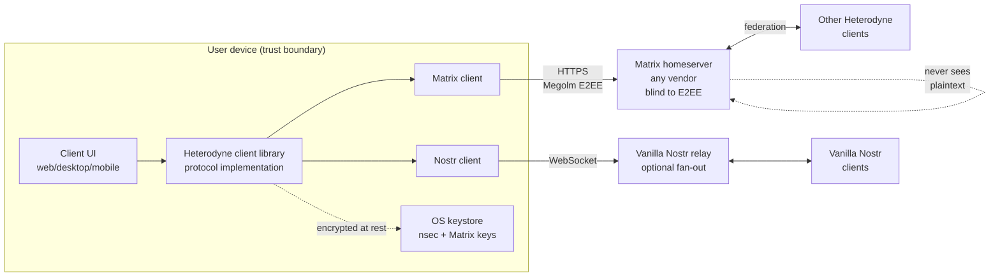
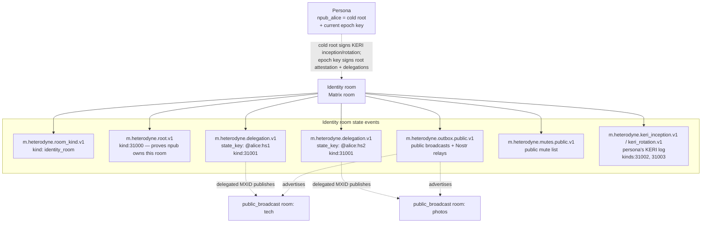
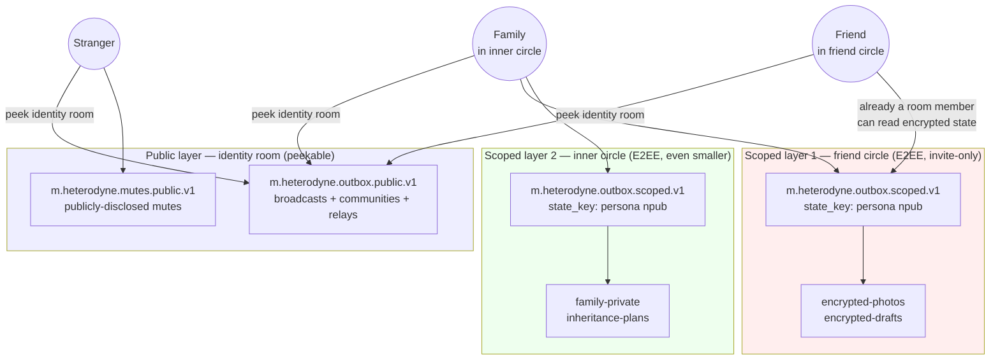

# Heterodyne Protocol Specification

**Version:** 0.3.0 (DRAFT — broadcast/discussion taxonomy, encrypted broadcast, KERI cold-root/epoch signing)
**Status:** Working draft (in-place revisions per project
convention until first-party-client validation closes the
freeze; see `docs/adr/` for the integration ADRs). v0.2.0 makes
substantive structural changes following external review:
(a) the per-room feed index is no longer a Matrix state event —
it is a Nostr replaceable event (`kind:31007`) published to
relays; for private rooms the index content is encrypted under a
Heterodyne room-key derived from the Matrix Megolm session
(§6.7.4, ADR-005), so the canonical feed list cannot be silently
mutated by a hostile homeserver nor read by non-members;
(b) the identity room is reframed as a disposable container,
with the NIP-01 `kind:31005` identity pointer as the
authoritative npub→room mapping that allows the owner to abandon
a compromised room and direct followers elsewhere; (c)
delegation acknowledgement no longer requires a Matrix MSK
signature — the delegation is authenticated by the homeserver's
normal `/send/state` authorization on the npub-signed payload;
(d) the §3.5 single-key successor chain is deleted, and
Heterodyne commits unconditionally to KERI for root inception
and rotation; the Heterodyne KERI profile is inlined in §3.5
(ADR-003); (e) the room taxonomy (ADR-017) is organized on a
broadcast-vs-discussion × public-vs-private axis into four social
kinds (`public_broadcast`, `private_broadcast`,
`public_discussion`, `private_discussion`) plus the `identity_room`
and `config_room` infrastructure kinds — broadcast posts are always
Nostr-signed (room-key-wrapped on relays when private, §6.10),
discussion is bare Matrix by default with an opt-in per-message
signature badge, and no kind claims deniability; (f) Matrix-DM
retrieval backfill is forbidden (Nostr
relays + user-hosted archives only); (g) moderator post-hoc
removal uses Nostr `kind:5` deletion plus an updated
`kind:31007` feed index, not Matrix redaction; (h) security
hardening — scoped ±5 minute clock skew on root attestations
(§3.2.1 NOTE), mandatory SSRF prevention on ATProto DID
resolution, and a mandatory `nip01_raw` canonical-serialization
field on `m.heterodyne.note.v1` to prevent JSON-canonicalization
attacks on signature validation; (i) MSC4362-compatible
encrypted state events are implemented client-side over vanilla
Matrix homeservers (ADR-001); private rooms are Heterodyne-only
(ADR-002); (j) page-integrity hashing via `prev_page_hash` and
normative relay-partition handling (ADR-006); (k) a formal
`heterodyne-strict-mode` client profile for moderation and
state-downgrade enforcement (ADR-007). The Matrix room version
is pinned at `"11"` (ADR-002). v0.1.4 added the OPTIONAL
ATProto attached outbox (§11.6) and KERI social witnesses;
v0.1.3 introduced the Nostr-relays-for-public-content pivot.
The spec is implementation-agnostic — language and runtime
choices are out of scope.

## System overview



Heterodyne is a decentralized social network protocol that composes
Nostr identity with Matrix transport. A persona's identity is a Nostr
`secp256k1` keypair (npub/nsec). The split is by **broadcast vs
discussion**, not simply public vs private: **broadcast** content
(a persona publishing as a persona) rides over Nostr relays and is
always Nostr-signed — in the clear for public broadcasts, and
room-key-wrapped (§6.10) for private broadcasts to a closed
follower set; **discussion** content (many-party conversation, and
reactions/replies) rides over Matrix rooms as bare, attributable
events (group encryption and stateful access control for private
discussion). A persona's curated **feed indexes** are themselves
Nostr replaceable events (`kind:31007`) on the persona's write
relays — encrypted under a Heterodyne room-key for private rooms
(§6.7.4) — so the canonical feed cannot be silently rewritten by any
third party.
The cross-protocol bridge is purely client-side: no homeserver or
relay modification is required, and no specific language or
runtime is prescribed.

This document is the normative specification for the Heterodyne protocol: a
decentralized social network built by publishing Nostr events into Matrix
rooms. It is the single source of truth that any independently-implemented
Heterodyne client MUST follow to interoperate.

The keywords MUST, MUST NOT, REQUIRED, SHALL, SHALL NOT, SHOULD, SHOULD NOT,
RECOMMENDED, MAY, and OPTIONAL in this document are to be interpreted as
described in [RFC 2119](https://www.rfc-editor.org/rfc/rfc2119).

## Table of contents

1. [Scope and non-goals](#1-scope-and-non-goals)
2. [Terminology](#2-terminology)
3. [Identity model](#3-identity-model) — **drafted**
4. [Event envelope](#4-event-envelope) — **drafted**
5. [Room taxonomy](#5-room-taxonomy) — **drafted**
6. [Publishing flow](#6-publishing-flow) — **drafted**
7. [Discovery and subscription](#7-discovery-and-subscription) — **drafted**
8. [Moderation](#8-moderation) — **drafted**
9. [Encryption guarantees](#9-encryption-guarantees) — **drafted**
10. [Bridge and client model](#10-bridge-and-client-model) — **drafted**
11. [Interoperability with vanilla Nostr and vanilla Matrix](#11-interoperability) — **drafted** (incl. §11.7 strict-mode profile, ADR-007)
12. [Versioning and capability negotiation](#12-versioning-and-capability-negotiation) — **drafted**
13. [Security model](#13-security-model) — **drafted** (companion analysis in [`../security/threat-model.md`](../security/threat-model.md))
14. [Conformance and test vectors](#14-conformance-and-test-vectors) — **drafted** (vectors authored incrementally in [`vectors/`](vectors/))

## 1. Scope and non-goals

### 1.1 Scope

Heterodyne defines:

- An **identity model** binding a Nostr `secp256k1` keypair (the canonical
  identity) to one or more Matrix accounts that act as delegated publishers.
- An **event envelope** for carrying signed Nostr events inside Matrix
  events, with a bare default (no Nostr signature) and an OPTIONAL
  per-message signature that adds a transferable authenticity proof.
- A **room taxonomy** on a broadcast-vs-discussion × public-vs-private
  axis — `public_broadcast`, `private_broadcast`, `public_discussion`,
  `private_discussion` (plus the `identity_room` and `config_room`
  infrastructure kinds) — each with conventional Matrix
  configurations.
- A **publishing flow** describing how a client fans out a single
  user-level post to one or more rooms and optionally to vanilla Nostr
  relays.
- A **discovery mechanism** so followers can locate an identity's outbox
  rooms and alternate addresses without consulting a central directory.
- A **moderation layering** combining Matrix room-level ACLs with
  NIP-72-style approval signatures for editorial control.
- A **bridge model** that is purely client-side; no homeserver software
  modifications are required.

### 1.2 Non-goals

Heterodyne explicitly does not:

- Define a new transport, relay protocol, or homeserver. It composes the
  Matrix and Nostr networks as they exist.
- Reserve new Nostr event kinds for user content. Existing NIP-defined
  kinds are used verbatim inside the envelope. (A small range of
  Heterodyne-reserved kinds for identity-room state events is defined in
  §3; these never appear as user-visible posts.)
- Provide a global directory of users. Discovery is consent-driven and
  relationship-mediated.
- Replace or compete with vanilla Nostr or vanilla Matrix. A Heterodyne
  user can interact with both networks; a vanilla client of either can
  interact with a Heterodyne user with reduced fidelity.

## 2. Terminology

Defined terms appear in **bold** on first use. The canonical glossary is
[`../glossary.md`](../glossary.md); the most load-bearing terms are
restated here.

- **npub** / **nsec** — a user's Nostr public key (`secp256k1`,
  bech32-encoded with `npub1...` prefix) and secret key (`nsec1...`
  prefix). The npub is the canonical Heterodyne identity.
- **Persona** — a distinct Heterodyne identity (one npub, one identity
  room, one set of delegations). A user MAY hold multiple personas; the
  protocol does not link them.
- **Identity room** — a Matrix room owned by the persona's identity holder
  whose state events bind the npub to its delegated Matrix accounts,
  declare its outbox rooms, and record key-rotation chains.
- **Delegation** — a state event in an identity room authorizing a specific
  Matrix MXID to publish events on behalf of the persona's npub.
  Double-signed by both the npub and the MXID.
- **Outbox room** — a broadcast room (`public_broadcast` or
  `private_broadcast`, §5.2–§5.3) where a persona broadcasts content.
  The persona is the room admin. Per-category (public, followers-only,
  topic-tagged).
- **Friend circle** / **distribution list** — UX terms for a categorized
  private room (`private_discussion` or `private_broadcast`).
  Implementation is just a Matrix room with appropriate power levels.
- **Broadcast vs discussion** — the primary room axis (§5). A
  **broadcast** room is where a persona publishes *as* a persona:
  posts are always Nostr-signed and live on Nostr relays
  (room-key-wrapped when private, §6.10). A **discussion** room is a
  many-party (or two-party DM) conversation carried as bare Matrix by
  default.
- **Wrap mode** — whether an in-room message carries a Nostr signature
  (**wrapped** `m.heterodyne.note.v1` or a `heterodyne_nostr_sig`,
  authentic and forwardable to vanilla Nostr, giving a transferable
  proof of authorship) or only Matrix-layer content (**bare**). Bare
  is the default for discussion traffic and reactions; it is NOT
  deniable — the author's npub is still attributable via §3.3 (§13.1.2)
  — but it leaves no transferable third-party proof.
- **KERI key event log** — the persona's authoritative key-rotation history
  per §3.5: a sequence of `kind:31002` inception and `kind:31003` rotation
  events committing to successive epoch public keys under a single cold
  root. Followers replay the log to follow a persona across rotations. The
  v0.1.4 single-key successor chain is deprecated (see §3.5).
- **NIP-59 wrapping terminology** — Nostr's gift-wrap mechanism
  (used for vanilla-Nostr DMs per NIP-17, and historically
  considered for Heterodyne private indexes — withdrawn in v0.2.0
  per ADR-005). Three distinct layers per NIP-59:
  - **rumor** — an UNSIGNED Nostr event (e.g., `kind:14` chat
    message rumor per NIP-17). Carries the actual content.
  - **seal** (`kind:13`) — encrypts the rumor under the sender's
    long-term key; SIGNED by the author.
  - **gift wrap** (`kind:1059`) — encrypts the seal under a
    one-time key addressed to a specific recipient; signed by
    that one-time key. One gift wrap event per recipient.

  When the spec mentions "NIP-17 DM kinds" it refers to the
  combination of kinds 14/15 (rumor), 13 (seal), 1059 (gift
  wrap), and 10050 (DM relay list).

- **`matrix:` URI** — the canonical reference format for Matrix rooms,
  events, and users used in this spec, per MSC2312. Form:
  `matrix:roomid/<id-without-bang>:<server>?via=<server>&via=<server>`
  for room-by-id; `matrix:r/<alias-without-hash>:<server>` for
  room-by-alias; `matrix:u/<user-without-at>:<server>` for user. New
  constructs in this spec (e.g., the config-room pointer in §3.8)
  reference rooms via `matrix:` URIs. Earlier sections (§7 outbox
  schemas) use a structured `{room_id, via}` form which is equivalent
  and remains valid; the URI form is REQUIRED only where explicitly
  stated.

## 3. Identity model

### 3.0 Nostr kind allocations

Heterodyne uses existing Nostr event kinds wherever a NIP already
defines the semantics, and reserves a small range (31000-31099) for
Heterodyne-specific state events. Implementations MUST NOT allocate
new kinds outside the reserved range without a spec amendment.

| Kind | Use | Defined in | NIP origin |
|------|-----|------------|------------|
| 1 | Short-form text note (microblog) | §4.2 | NIP-01 / NIP-10 |
| 3 | Follow list (contact list) | §7.4 (OPTIONAL emit for interop) | NIP-02 |
| 4 | Encrypted DM | NOT USED — deprecated upstream | NIP-04 |
| 7 | Reaction | §4.2 | NIP-25 |
| 1984 | Reporting | §8 (community moderation interop) | NIP-56 |
| 4550 | Community post approval | §8.1 | NIP-72 |
| 9734 | Zap request | §7.1 reply-inbox interop | NIP-57 |
| 9735 | Zap receipt | §7.1 reply-inbox interop | NIP-57 |
| 10002 | Relay list metadata | §7.1 `nostr_relays` interop | NIP-65 |
| 14, 15 | NIP-17 chat message rumor (unsigned) | §11.4 (vanilla-Nostr-only DMs) | NIP-17 |
| 13 | NIP-17 / NIP-59 seal (encrypted rumor, signed by author) | §11.4 | NIP-59 |
| 1059 | NIP-17 / NIP-59 gift wrap (encrypts seal; signed by one-time key) | §11.4 | NIP-59 |
| 10050 | NIP-17 DM relay list | §11.4 | NIP-17 |
| 30023 | Long-form content (article) | §4.2, §11.5 | NIP-23 |
| 30024 | Long-form content (draft) | §4.2 | NIP-23 |
| 30402 | Classified listing | §4.2 (interop only) | NIP-99 |
| **31000** | **Heterodyne: root attestation** | §3.2.1 | Heterodyne-reserved |
| **31001** | **Heterodyne: delegation attestation** | §3.3 | Heterodyne-reserved |
| **31002** | **Heterodyne: KERI inception** | §3.5 | Heterodyne-reserved (Cold Root design) |
| **31003** | **Heterodyne: KERI rotation** | §3.5 | Heterodyne-reserved (Cold Root design) |
| **31004** | **Heterodyne: related-persona attestation** | §7.5 | Heterodyne-reserved |
| **31005** | **Heterodyne: identity pointer (authoritative npub→room)** | §3.2, §11.3 | Heterodyne-reserved |
| **31006** | **Heterodyne: cold root backup (NIP-49 encrypted)** | Cold Root design §6 | Heterodyne-reserved |
| **31007** | **Heterodyne: feed index (per persona, per room)** | §6.7 | Heterodyne-reserved |
| 31008-31099 | RESERVED for future Heterodyne use | — | — |

All Heterodyne-reserved kinds (31000-31099) follow Nostr's addressable
event convention (NIP-01) for the 30000-39999 range: they are
replaceable by the `(pubkey, kind, d)` tuple. Heterodyne attestations
that should have exactly one canonical instance per persona (root,
identity pointer, current KERI inception, cold-root backup) use a
`["d", ""]` tag (empty identifier); attestations that may have
multiple instances per persona (delegations keyed by MXID, feed
indexes keyed by `(room_id, page_id)`, KERI rotations keyed by
sequence number) use a non-empty `d` tag whose construction is
defined by the section that introduces the kind.

### 3.0.1 Canonical Nostr serialization

Every embedded Nostr event in this specification — whether inside a
Heterodyne state event, inside an `m.heterodyne.note.v1` envelope, or
attached via `heterodyne_nostr_sig` — MUST be serialized for signing
exactly as defined by NIP-01: the JSON array

```
[0, pubkey, created_at, kind, tags, content]
```

with no whitespace, with strings JSON-escaped per RFC 8259, and with
the array UTF-8-encoded before SHA-256 hashing to produce the event
`id`. The `tags` array preserves the order chosen by the producer;
implementations MUST NOT reorder tags during transport. The `sig`
field is the Schnorr signature over the resulting 32-byte hash, per
BIP-340 / NIP-01.

Implementations MUST NOT invent a Heterodyne-specific canonical form.
Matrix-layer canonicalization (Matrix Canonical JSON) is applied
independently by the Matrix SDK; the two canonicalizations do not
interact.

#### 3.0.1.1 `nip01_raw` field on embedded Nostr events

To prevent Matrix homeservers or intermediary JSON parsers from
silently breaking signature validation by re-serializing the
parsed event object (which may reorder object keys per RFC 8259
§4, normalize numeric representations, or alter whitespace,
any of which would invalidate the NIP-01 signature; note that
JSON ARRAY ordering is preserved by conforming parsers per RFC
8259 §5, but the SURROUNDING object containing the parsed event
fields is not), every `m.heterodyne.note.v1` event MUST
include a `nip01_raw` field at the top of `content` containing the
exact stringified JSON array

```
[0, pubkey, created_at, kind, tags, content]
```

that was UTF-8-encoded and SHA-256-hashed to produce the embedded
Nostr event's `id` and over which the BIP-340 signature was
produced. The parsed `content.nostr` object remains for human and
tool readability, but verifiers MUST hash `content.nip01_raw`
directly (rather than reconstructing the serialization from the
parsed object) when validating the signature. Verifiers MUST
additionally check that the values exposed in `content.nostr`
(`id`, `pubkey`, `created_at`, `kind`, `tags`, `content`, `sig`)
match what is contained in `nip01_raw`; any mismatch MUST cause
rejection.

The same `nip01_raw` requirement applies to:

- Embedded Nostr events inside `m.heterodyne.note.v1` (above).
- Nostr attestations embedded in identity-room state events
  (`m.heterodyne.root.v1`, `m.heterodyne.delegation.v1`, KERI
  inception/rotation, `m.heterodyne.atproto_link.v1`).
- The OPTIONAL `heterodyne_nostr_sig` field on bare events
  (§4.3).

In every case the structural location is the same: a sibling
`nip01_raw` string alongside the parsed `nostr_attestation` /
`heterodyne_nostr_sig` / `nostr` object. Schemas in §3.2.1, §3.3,
§4.2, §4.3, §11.6.3 are amended implicitly by this rule —
implementations MUST emit and check `nip01_raw` even where the
schema example below this point omits it for brevity.

### 3.1 The npub is canonical

A Heterodyne identity is a Nostr `secp256k1` keypair, referred to by its
public key in bech32 form (`npub1...`). The npub is the authoritative
subject of all attestations made by or about this identity. Matrix
accounts in this specification are *delegated publishers* of the npub, not
identities in their own right.

A single human MAY hold any number of npubs (personas). The protocol does
not attempt to link personas to humans; this is a deliberate privacy
property.

### 3.2 Identity room

For each persona an identity holder maintains, there MUST exist at any
given time exactly one **active identity room**: a Matrix room whose
state binds the npub to the rest of the persona's Heterodyne
configuration. The identity room SHOULD be created on a homeserver
the identity holder controls or trusts; it MAY be replicated across
homeservers via standard Matrix federation for resilience.

The identity room is a **disposable container**. The ultimate
authority for "where does this persona live now?" is the persona's
Nostr npub (anchored via KERI per §3.5), not the room ID. If a
Matrix identity room is compromised by a Matrix-layer power-level
takeover (e.g., a malicious homeserver admin elevates themselves
inside the room), the persona's owner MUST abandon the compromised
room and create a fresh identity room on a different
homeserver / room ID, then publish a new NIP-01 replaceable
`kind:31005` identity pointer (§11.3) on the persona's write
relays declaring the new `matrix_identity_room` URI.

Verifiers MUST prioritize the `matrix_identity_room` value carried
by the latest valid `kind:31005` event from the persona's npub
over any locally cached room ID. Cached pointers older than the
authoritative `kind:31005` MUST be discarded.

The npub does not change when the identity room is replaced —
followers' subscriptions, KERI history, and cryptographic identity
all persist. Only the Matrix-layer container moves.



The identity room is intentionally peekable: any party MUST be able to
join or peek it and read its state to verify a persona. State events
that contain audience-restricted content (private mutes, capabilities)
live elsewhere — in the per-MXID config room (§3.8) or in scoped
contexts (§7.2, §12.2).

The room MUST contain:

- An `m.heterodyne.room_kind.v1` state event with
  `kind: "identity_room"` (§5.1).
- An `m.heterodyne.root.v1` state event proving npub ownership of the
  room (§3.2.1).
- Zero or more `m.heterodyne.delegation.v1` state events, one per active
  delegated Matrix account, keyed by MXID (§3.3).
- At most one `m.heterodyne.outbox.public.v1` state event listing the
  persona's public-facing outbox (§7.1).
- Zero or more `m.heterodyne.keri_inception.v1` and
  `m.heterodyne.keri_rotation.v1` state events recording the
  persona's KERI key event log (§3.5).

The persona's canonical Heterodyne address is its **npub** — the KERI
cold-root public key (§3.5.0) — not the identity-room ID. The room ID
is only the persona's *current locator*. Authoritative resolution
follows the latest `kind:31005` identity pointer (§11.3), which the
npub controls, to whichever identity room is current (see the §3.6
authority ladder). Resolving a persona therefore means following that
pointer to the room and reading its state; a cached room ID is never
authoritative on its own.

#### 3.2.1 Root attestation

The `m.heterodyne.root.v1` state event:

```json
{
  "type": "m.heterodyne.root.v1",
  "state_key": "",
  "content": {
    "spec_version": "0.3.0",
    "nostr_attestation": {
      "id": "<32-byte hex>",
      "pubkey": "<32-byte hex of the persona's current epoch key>",
      "created_at": 0,
      "kind": 31000,
      "tags": [
        ["heterodyne", "root"],
        ["matrix_room", "<this room's room_id>"],
        ["cold_root", "<32-byte hex of the persona's npub / cold-root key>"]
      ],
      "content": "",
      "sig": "<64-byte hex by the current epoch key>"
    }
  }
}
```

The `nostr_attestation` field is a valid Nostr event of
Heterodyne-reserved kind `31000` (§3.0), signed by the persona's
**current epoch key** (§3.5.0) per `nip01_raw` (§3.0.1.1). The cold
root is never brought online to sign root attestations: the
`cold_root` tag binds the attestation to the persona's permanent
npub, and the verifier confirms — by replaying the KEL (§3.5.3) —
that the signing epoch key is the one the cold root currently
authorizes. (This is why re-signing a root attestation with a fresh
`created_at`, below, is an epoch-key operation and not a cold-root
ceremony.)

Normative verification rules:

- The Nostr `sig` MUST validate against the asserted `pubkey` per
  BIP-340 Schnorr verification (over `nip01_raw`, §3.0.1.1).
- The `pubkey` MUST be the persona's **current epoch key** as
  determined by replaying the persona's KEL (§3.5.3). A root
  attestation signed by any key that is not the currently
  authoritative epoch key MUST be rejected.
- The `cold_root` tag MUST be present and MUST equal the persona's
  npub (cold-root public key). This is the permanent identity the
  attestation binds to the room.
- The `matrix_room` tag MUST contain the Matrix room ID of the
  identity room itself, as a bare room ID (with leading `!`). Failure
  → reject.
- The `d` tag MUST be present and have empty value (`["d", ""]`) per
  §3.0. Failure → reject (the root attestation is unique per persona;
  duplicates with non-empty `d` are spurious).
- The Nostr `created_at` MUST be within a strict ±5 minute window
  of the verifier's current wall-clock time at the moment of
  verification. Events outside this window MUST be rejected. (This
  hardens against replay of an old signed attestation re-injected
  into a fresh identity room. Genuine re-publication of a long-ago
  attestation is supported by re-signing with the persona's
  current epoch key — the npub bound in the `cold_root` tag is
  unchanged, and the new signature carries a current `created_at`.)

> **NOTE (scope of the ±5 minute rule, ADR-004).** This freshness
> rule applies ONLY to `m.heterodyne.root.v1` root attestation
> events and the Nostr `kind:31000` attestation they wrap. Other
> Heterodyne events (delegations, KERI inception/rotation, feed
> indexes, outbox advertisements, notes) are NOT subject to wall-
> clock freshness enforcement; each has its own freshness mechanism
> (e.g., KERI sequence numbers per §3.5, delegation `valid_until`
> tags per §3.3, replaceable-event semantics for `kind:31007` per
> §6.7). Verifiers MUST NOT apply the ±5 minute rule to other
> event kinds. A persona whose identity room was created long ago
> remains verifiable: the persona simply re-signs the root
> attestation with a current `created_at` whenever it republishes
> the identity-room state — an epoch-key operation; the npub
> (`cold_root` tag) and Matrix room id are unchanged across
> re-publications.
- The `cold_root` tag MUST be the persona's canonical npub. The room
  MUST NOT contain a second `m.heterodyne.root.v1` state event
  asserting a different `cold_root`; if Matrix state resolution
  produces a conflict, verifiers MUST treat the room as having no
  valid root and refuse to verify any delegation against it.

### 3.3 Delegations

Each Matrix account that publishes on behalf of the npub is bound by an
`m.heterodyne.delegation.v1` state event in the identity room, keyed by
the MXID:

```json
{
  "type": "m.heterodyne.delegation.v1",
  "state_key": "@alice:matrix.org",
  "content": {
    "spec_version": "0.3.0",
    "nostr_attestation": {
      "id": "<32-byte hex>",
      "pubkey": "<32-byte hex of the persona's current epoch key>",
      "created_at": 0,
      "kind": 31001,
      "tags": [
        ["heterodyne", "delegation"],
        ["matrix_mxid", "@alice:matrix.org"],
        ["cold_root", "<32-byte hex of the persona's npub / cold-root key>"],
        ["valid_until", ""]
      ],
      "content": "",
      "sig": "<64-byte hex by the current epoch key>"
    }
  }
}
```

The delegation is **acknowledged** by the MXID through the act of
the MXID itself successfully publishing this `m.heterodyne.delegation.v1`
state event into the identity room. The MXID's authentication is
performed by the homeserver's normal `/_matrix/client/v3/rooms/{roomId}/state/{eventType}/{stateKey}`
authorization (Matrix `m.room.power_levels` plus access-token
session). The cryptographic security of the binding rests on the
BIP-340 signature by the persona's **current epoch key** over the
embedded Nostr attestation — the homeserver cannot forge a
delegation for another persona because it does not hold that
persona's epoch-key secret, and the epoch key's authority chains to
the cold-root npub via the KEL (§3.5). The `cold_root` tag names the
persona the delegation is for; the MXID's own identity is
established by Matrix's existing protocol.

This is a simplification from earlier drafts that additionally
required an Ed25519 signature by the MXID's cross-signing master
key. The MSK signature added no security against the threat model
(a homeserver that can forge the MXID's own state events can also
forge MSK signatures on its behalf via /keys/query manipulation)
while adding significant client complexity. The simpler
formulation makes the delegation binding cleaner and easier to
verify.

A delegation is **active** if and only if:

1. The Nostr signature on `nostr_attestation` validates, per BIP-340
   over `nip01_raw` (§3.0.1.1), against the persona's **current epoch
   key**: the `pubkey` MUST be the epoch key that the persona's KEL
   (§3.5.3) had in authority at the time `t` against which the
   delegation is being evaluated, and the `cold_root` tag MUST equal
   the persona's npub.
2. The Matrix state event's `sender` matches the value in
   `state_key` (the MXID published its own delegation). Verifiers
   MUST reject delegations published by any other sender.
3. The `nostr_attestation.tags` includes a `["matrix_mxid", "<mxid>"]`
   tag whose value equals the state event's `state_key`. (Defends
   against confusing the delegation target.)
4. `nostr_attestation.tags` includes a `["valid_until", "<unix-seconds>"]`
   tag that is either empty (no expiry) or strictly greater than the
   verifier's current wall-clock time. Verifiers MAY apply a small
   local clock-skew tolerance (RECOMMENDED: 5 minutes) as a clock-drift
   accommodation. This tolerance is operationally distinct from the
   §3.2.1 ±5-minute freshness rule, which applies only to
   `m.heterodyne.root.v1` root attestation events per ADR-004.
5. The epoch key that signed this delegation was KERI-authoritative
   (§3.5.3) at the evaluation time `t`. A KERI rotation (§3.5, §3.9.9)
   supersedes the epoch and thereby deactivates delegations signed
   under it for any `t` after the rotation's effective time; the
   persona re-signs still-active delegations under the new epoch when
   it rotates.
6. No `m.heterodyne.delegation_revoked.v1` state event for this MXID is
   in effect. If such a state event exists with an `effective_at`
   (clamped per §3.9.7) less than or equal to `t`, the delegation is
   inactive from that time. The Matrix state event is **authoritative**
   for revocation; the paired Nostr `kind:5` deletion (§3.9.7) is a
   relay-side **mirror** so that Nostr-relay-only observers also learn
   of the revocation, and is not itself required for a Matrix verifier
   to treat the delegation as revoked.

Receivers verifying a wrapped event (§4.2) MUST check that the event's
`nostr.pubkey` is the current epoch key of the persona asserted by the
sender's identity room (per KEL replay, §3.5.3) and that an active
delegation for the sending MXID exists. If verification fails, the
receiver MUST mark the event untrusted; clients MAY render with a
warning or suppress entirely.

### 3.4 Multiple personas

A user MAY operate any number of distinct personas. Each persona has its
own npub, its own identity room, and its own set of delegations. Personas
are not linked at the protocol level. A user's client MAY store
correlations between personas in local-only, encrypted-at-rest storage
for the user's own UI convenience, but MUST NOT publish those
correlations to any room or relay.

### 3.5 KERI-based root inception and key rotation

Heterodyne uses **KERI** (Key Event Receipt Infrastructure) for all
root inception, key rotation, and revocation ceremonies. The
v0.1.4 single-key successor / predecessor / revoke chain
(`m.heterodyne.successor.v1` / `m.heterodyne.predecessor.v1` /
`m.heterodyne.revoke.v1`) is **deprecated and removed in v0.2.0**:
it was vulnerable to "fork-freezing" attacks where a holder of a
prior epoch key could publish a forked chain that a subset of
verifiers would race-accept, splitting the persona's followers
between two universes with no protocol-defined reconciliation.

KERI replaces single-key succession with explicit sequence
numbering, threshold witnesses, and deterministic fork resolution
following canonical KERI first-seen ordering at witnesses (per
the trustoverip KERI specification). The Heterodyne KERI profile
is fully normative in this section (the Cold Root + Epoch Keys
companion document at
[`docs/superpowers/specs/2026-05-21-cold-root-epoch-keys-design.md`](superpowers/specs/2026-05-21-cold-root-epoch-keys-design.md)
is INFORMATIVE; design rationale and worked examples only).

#### 3.5.0 Heterodyne KERI profile — primitives

Heterodyne clients MUST implement the following four primitives.
Wire formats are Nostr events using the Heterodyne-reserved
`kind:31002` (inception) and `kind:31003` (rotation), mirrored
into Matrix identity rooms as `m.heterodyne.keri_inception.v1`
and `m.heterodyne.keri_rotation.v1` state events. Both wire
forms carry the SAME normative content; the Matrix mirror is
for in-room visibility and the Nostr form is for relay-side
verifiability.

**Cold root.** A 32-byte BIP-340 (secp256k1) public key generated
on a clean device, held offline as the persona's permanent
identity anchor. The cold-root public key, encoded as the
persona's **npub**, is the persona's permanent, publicly-advertised
identity; throughout this spec "the persona's npub" denotes this
cold-root key. The cold root signs only rare, identity-anchoring
events: inception events (`kind:31002`), `committed`-strategy
rotations (`kind:31003`), and the `kind:31005` identity pointer
(§11.3, cold-root-signed so vanilla Nostr clients can discover the
room by `authors:[npub]`). It never signs routine attestations —
the root attestation (`kind:31000`), delegations (`kind:31001`),
outbox advertisements, feed indexes (`kind:31007`), posts, or
moderator approvals (`kind:4550`); those are signed by the current
epoch key (below). Used as little as possible to minimize exposure;
see §6 of the Cold Root + Epoch Keys companion for ceremony
guidance.

**Epoch key.** A 32-byte BIP-340 public key committed by an
inception or rotation event. All routine Heterodyne attestations
(delegations, outbox advertisements, feed indexes, etc.) are
signed by the CURRENT epoch key. Epochs rotate via `kind:31003`
events.

**Witness.** A persona declared in an inception event's
witness configuration as authorized to first-see and attest
subsequent rotations. Witnesses MAY be other Heterodyne
personas, ATProto DIDs (§11.6.7), or other identifiers
designated by the persona. Each witness has an associated
weight (default: 1); witness thresholds at rotation time
reference these weights.

**Key event log (KEL).** The ordered sequence of inception +
rotation events produced by a persona. Each rotation references
its prior event by digest. The KEL is the authoritative record
of the persona's key continuity.

#### 3.5.1 Inception event schema (`kind:31002`)

```json
{
  "id": "<32-byte hex>",
  "pubkey": "<persona cold-root pubkey hex>",
  "created_at": 0,
  "kind": 31002,
  "tags": [
    ["d", ""],
    ["heterodyne", "keri_inception"],
    ["s", "0"],
    ["epoch_key", "<32-byte hex of the initial epoch key>"],
    ["witness", "<witness-id-1>", "<weight-1>"],
    ["witness", "<witness-id-2>", "<weight-2>"],
    ["threshold", "<integer threshold of cumulative witness weight required for rotation>"]
  ],
  "content": "",
  "sig": "<64-byte hex BIP-340 sig by cold root>"
}
```

Normative rules:

- `pubkey` MUST be the persona's cold-root public key.
- `s` (sequence number) MUST be `"0"` for an inception event.
- `epoch_key` MUST be the initial epoch public key.
- `witness` tags MAY appear zero or more times. Each entry is
  `["witness", "<witness-identifier>", "<weight>"]` where
  `<witness-identifier>` is either a Nostr pubkey hex (for
  Heterodyne witnesses) or an ATProto DID string (for ATProto
  witnesses per §11.6.7).
- `threshold` MUST be present whenever at least one `witness`
  tag exists. Its value is the integer minimum cumulative
  weight required for a rotation to be accepted by verifiers.

#### 3.5.2 Rotation event schema (`kind:31003`)

```json
{
  "id": "<32-byte hex>",
  "pubkey": "<persona cold-root pubkey hex (for committed strategy) OR prior epoch key (for none strategy)>",
  "created_at": 0,
  "kind": 31003,
  "tags": [
    ["d", "<s value, e.g. \"1\">"],
    ["heterodyne", "keri_rotation"],
    ["s", "1"],
    ["prior_digest", "<32-byte hex SHA-256 of the prior event's canonical NIP-01 serialization>"],
    ["strategy", "committed | none"],
    ["epoch_key", "<32-byte hex of the new epoch key>"],
    ["witness", "<witness-id>", "<weight>"],
    ["threshold", "<integer>"]
  ],
  "content": "<concatenated witness attestation signatures, base64-encoded>",
  "sig": "<64-byte hex BIP-340 sig by the controller (cold root or prior epoch key per strategy)>"
}
```

Normative rules:

- `s` MUST be strictly greater than the prior accepted event's
  `s` value.
- `prior_digest` MUST be the SHA-256 of the prior accepted
  event's canonical NIP-01 serialization (NOT the prior
  event's `id` — `id` is also SHA-256 of the same
  serialization, so the values coincide).
- `strategy` MUST be one of `"committed"` (signed by cold root
  with cryptographic chain via `prior_digest`) or `"none"`
  (recovery from cold-root loss; signed by the prior epoch
  key and relying on witness attestations for continuity).
- Witness attestation signatures over the canonical event
  (excluding the controller signature) MUST be concatenated
  into `content` per the schema for the declared witness type
  (BIP-340 hex for Nostr witnesses; DID-signing-scheme bytes
  for ATProto witnesses).

#### 3.5.3 Verifier algorithm — canonical KERI first-seen ordering

Verifiers replay the persona's KEL to determine the current
epoch key. The algorithm follows canonical KERI semantics:

1. Fetch all `kind:31002` and `kind:31003` events for the
   persona's cold-root pubkey from the persona's Nostr write
   relays and from the Matrix identity room.
2. Verify the inception event (`s = 0`): cold-root signature
   MUST be valid; record the initial witness configuration.
3. For each candidate rotation event in `s`-ascending order:
   a. Verify the controller signature per `strategy`
      (`committed`: cold-root sig; `none`: prior epoch key sig).
   b. Verify `prior_digest` equals SHA-256 of the prior
      accepted event's canonical serialization.
   c. Verify each witness attestation in `content` against
      the witness configuration in force at the prior accepted
      event.
   d. Compute the cumulative weight of valid witness
      attestations. The rotation is ACCEPTED only when this
      cumulative weight meets or exceeds the `threshold`
      declared by the prior accepted event.
4. **Fork resolution (canonical KERI first-seen).** When two
   distinct rotation events claim the same `s`, verifiers MUST
   apply KERI's first-seen rule: each witness honors the FIRST
   valid rotation it observed at sequence `s`. A receiver
   constructing the persona's authoritative KEL counts witness
   attestations across the candidate forks; the fork accepted
   by witnesses whose cumulative weight meets `threshold` is
   authoritative. If neither fork meets `threshold`, the KEL
   STALLS at the prior accepted event — no rotation has been
   confirmed — and verifiers MUST surface a "key continuity
   stalled" indicator to the user.
5. Return: the latest accepted rotation's `epoch_key` is the
   persona's current epoch public key; the latest witness
   configuration is in force; routine attestations are
   verified against the current epoch key.

NOTE on the v0.1.x witness rule: an earlier draft used a
"highest cumulative witness weight, lexicographically smallest
event id" tiebreaker rule. That rule diverged from canonical
KERI and had no upstream design rationale; v0.2.0 corrects to
first-seen ordering per ADR-003.

#### 3.5.4 Migration from v0.1.4 single-key chains

Personas that established their identity under v0.1.4's chain
mechanism MUST migrate to a KERI inception before publishing any
v0.2.0 content. The migration ceremony is:

1. The persona publishes a fresh `m.heterodyne.keri_inception.v1`
   state event in their identity room, with sequence number `0`,
   signed by the cold root (the v0.1.4 npub). Witnesses are optional
   but RECOMMENDED. (No Matrix MSK co-signature is required; the MSK
   requirement was retired in v0.2.0 per §3.3.)
2. Any prior `m.heterodyne.successor.v1` / `m.heterodyne.predecessor.v1` /
   `m.heterodyne.revoke.v1` state events MAY remain in room state
   for archival readers but are no longer authoritative.
3. Verifiers implementing v0.2.0 MUST ignore the deprecated state
   event types when a valid KERI inception is present.

A persona that has not migrated by the time a verifier last
synced is treated as still being on v0.1.4 semantics for backward
read compatibility; verifiers MAY surface a "pre-KERI persona"
indicator to the user.

### 3.6 Identity discovery

A Heterodyne client resolves "what npub does this Matrix MXID represent?"
by walking from the MXID's Matrix profile to the persona's identity
room and verifying the bindings along the way.

#### Authority ladder (summary)

When multiple identity-related state sources are present, the
following ranked precedence applies. Higher rows override lower
rows in case of conflict:

| Rank | Source | Authoritative for |
|---|---|---|
| 1 | KERI key event log (§3.5) — `kind:31002` / `kind:31003` events on the persona's Nostr write relays | The persona's current epoch public key and witness configuration. No Matrix or Heterodyne state may contradict the KEL. |
| 2 | `kind:31005` identity pointer (§11.3) on the persona's write relays | The CURRENT authoritative Matrix identity room for the persona. Supersedes the room named by the MXID profile field if they differ. |
| 3 | `m.heterodyne.root.v1` state event in the named identity room | The cold-root pubkey-to-room binding (§3.2). |
| 4 | `m.heterodyne.delegation.v1` state events in the same identity room | Active publisher MXIDs and their dual-authentication binding (§3.3). |
| 5 | Matrix MXID profile field `m.heterodyne.identity_room` | A DISCOVERY HINT pointing at the persona's identity room. Never authoritative on its own; always reconciled against the rank-2 `kind:31005` pointer. |
| 6 | ATProto attached outbox / social-witness signatures (§11.6) | ADDITIVE only — never satisfies any required signature. Useful for "verified Bluesky" UX and as a non-canonical co-signature on KERI rotations. |

A receiver MUST consult sources in ascending rank-priority order
when conflicts appear. The §3.6 procedure below implements this
ladder; the table is provided as a quick reference.

```mermaid
sequenceDiagram
    participant F as Follower client
    participant HS as Sender's homeserver
    participant IR as Identity room
    participant Core as Heterodyne client library

    F->>HS: GET /_matrix/client/v3/profile/{mxid}
    HS-->>F: profile incl. m.heterodyne.identity_room<br/>(matrix: URI of identity room)
    F->>IR: peek (or join) the identity room
    IR-->>F: state events: root, delegations,<br/>outbox, chain
    F->>Core: verify root.nostr_attestation.sig<br/>and matrix_room tag (§3.2.1)
    Core-->>F: root OK / FAIL
    F->>Core: verify delegation for sender MXID<br/>(npub signature + MXID self-publication, §3.3)
    Core-->>F: delegation active / FAIL
    F->>Core: replay KERI key-event log to current epoch<br/>(§3.5)
    Core-->>F: current_epoch_pubkey, KERI history
    F-->>F: cache result; revalidate on TTL<br/>or on /sync updates
```

Normative algorithm:

1. **Read the Matrix profile.** Fetch the MXID's global Matrix profile
   via `GET /_matrix/client/v3/profile/{mxid}`. The profile MUST be
   the homeserver-side **global account profile** (not a per-device
   nor per-room profile). The custom field
   `m.heterodyne.identity_room` SHOULD be present, holding a
   `matrix:` URI (§2) pointing at the persona's identity room.

2. **Missing profile field.** If the profile lacks
   `m.heterodyne.identity_room`, the MXID is not bound to any
   Heterodyne persona at the protocol layer. Verifiers MUST refuse
   to apply identity-level trust assertions to events from this
   MXID; events from such an MXID in a Heterodyne room are treated
   as vanilla Matrix messages (no Heterodyne authenticity claim).

3. **Read identity room state.** Resolve the `matrix:` URI to a
   room ID and `via` server hints. Read the room's state using
   the stable Matrix client-server API. The exact mechanism
   depends on room access:
   - If the room's `m.room.history_visibility` is
     `world_readable`, clients MAY read state via
     `GET /_matrix/client/v3/rooms/{roomId}/state` without
     joining (subject to the homeserver's federation/auth rules).
   - Clients MAY use experimental peek endpoints (MSC2753) when
     the homeserver advertises support; conformance MUST NOT
     depend on this.
   - Otherwise, clients MUST join the identity room. Identity
     rooms are intentionally low-cost to join (they hold only
     state, no timeline) and leaving after a verification fetch
     is acceptable.

4. **Replay the KERI log.** Apply §3.5 to fold every
   `m.heterodyne.keri_inception.v1` and
   `m.heterodyne.keri_rotation.v1` in sequence-number order,
   resolving forks per KERI's deterministic rule, to obtain the
   persona's current epoch public key and witness set. This step
   comes **before** root- and delegation-verification because both
   the root attestation and the delegation are now signed by the
   current epoch key (§3.2.1, §3.3), so the verifier needs the KEL's
   authoritative epoch key first. Pre-KERI personas (still on v0.1.4
   single-key chains) MUST be surfaced with a "pre-KERI" indicator
   (per §3.5.4). The cold-root `pubkey` of the **accepted inception
   event** (`kind:31002`, `s=0`) is the persona's canonical npub for
   this verification attempt; every subsequent check binds to that
   value, breaking the apparent room→KEL→root circularity (the room
   merely *hosts* the KEL; authority flows from the inception
   pubkey).

5. **Verify the root attestation.** Read
   `m.heterodyne.root.v1`; apply the verification rules in §3.2.1,
   confirming the signing `pubkey` is the current epoch key from step
   4 and the `cold_root` tag equals the canonical npub (the accepted
   inception pubkey) established in step 4. On failure, reject the
   entire chain — without a valid root no subsequent attestation can
   be trusted.

6. **Verify the delegation.** Read the
   `m.heterodyne.delegation.v1` state event keyed by the sender
   MXID. Apply the verification rules in §3.3 (signature against the
   epoch key from step 4; check for any `m.heterodyne.delegation_revoked.v1`).

7. **Confirm authoritative identity pointer.** Fetch the latest
   `kind:31005` identity pointer event for the persona's npub
   from their write relays (§11.3). If it names a different
   identity room than the one just verified, the previously
   verified room is no longer authoritative — restart from step 3
   against the room named by the pointer.

8. **Return.** The resolved persona is `{current_epoch_pubkey,
   cold_root_npub, outbox addresses from §7, KERI log, capability
   advertisement (if visible) from §12.2}`.

#### 3.6.1 Caching and revalidation

A Heterodyne client SHOULD cache identity-room state locally to
avoid round-tripping for every event. Cache invalidation:

- Identity-room state MUST be revalidated on a TTL whose default
  SHOULD be no longer than 24 hours. Clients with high-frequency
  user interaction (real-time chat) SHOULD use a shorter TTL
  (RECOMMENDED 1 hour or less).
- Identity-room state MUST be revalidated immediately when the
  Matrix `/sync` endpoint advertises a state delta in the room.
- The cache SHOULD be stored in the per-MXID config room (§3.8.3,
  `identity_room_cache` field) so new devices can resume verification
  from a warm state.
- If a cached delegation's `valid_until` has expired, a KERI rotation
  (§3.5) supersedes the epoch key that signed it, or an
  `m.heterodyne.delegation_revoked.v1` (§3.9.7) appears for the MXID,
  the cache entry MUST be invalidated even if the TTL has not yet
  elapsed.

### 3.7 Failure modes

- **Identity room unreachable**: if all homeservers replicating the room
  are unavailable, the persona's bindings cannot be verified. Cached
  state MAY be used with an explicit "identity verification stale" UI
  signal. The persona's npub remains usable on vanilla Nostr relays
  regardless.
- **Conflicting state events**: standard Matrix state resolution
  determines winners. Conflicting Heterodyne state is the room admin's
  responsibility to clean up; the spec does not introduce additional
  resolution rules.
- **Compromised delegation**: revoke the delegation per §3.3 and rotate
  Matrix credentials. Already-published events from before the
  delegation's revocation remain valid; subsequent events from that MXID
  fail verification.
- **Compromised root key**: rotate via §3.5 (KERI rotation) from a
  clean device. KERI sequence numbering and witness thresholds
  preserve persona continuity and ensure deterministic fork
  resolution. If the cold root is also lost, follow the `none`-strategy
  rotation procedure in the Cold Root + Epoch Keys design.
- **Compromised identity room (Matrix-layer takeover)**: abandon
  the room per §3.2 and publish a fresh `kind:31005` identity
  pointer to redirect followers to a new room.

### 3.8 Encrypted client configuration room (per MXID)

In addition to per-persona identity rooms (§3.2), every Matrix account
that participates in Heterodyne SHOULD have a single **encrypted
client configuration room**: an E2EE Matrix room whose only members
are the owning MXID's devices, used to store portable client
configuration, per-persona private state, and Heterodyne-specific
backups.

The motivation is portability. A user adding a new device, or
recovering after losing one, joins the config room with their MXID
credentials and immediately re-syncs their preferences, mute lists,
and key material without having to manually reconfigure each client
surface.

#### 3.8.1 Room shape

REQUIRED:

- `m.heterodyne.room_kind.v1.kind`: `config_room`.
- `m.room.encryption.algorithm`: `m.megolm.v1.aes-sha2` (today); MLS
  variant when ready.
- All state events MUST be encrypted using MSC4362-compatible
  client-side encryption (ADR-001): the client encrypts the
  state event `content` field as ciphertext and posts via the
  standard `PUT /_matrix/client/v3/rooms/{roomId}/state/{eventType}/{stateKey}`
  endpoint. The homeserver stores the encrypted payload as
  opaque JSON; no server-side MSC4362 support is required.
- `m.room.join_rules`: `invite`. The owning MXID is the sole inviter
  and the sole invitee.
- `m.room.guest_access`: `forbidden`.
- `m.room.history_visibility`: `shared` (so a new device of the same
  MXID, joined later, can read prior state).
- Members: only the owning MXID and their authorized devices. Any
  other member is a misconfiguration and SHOULD be removed.

The room is NOT discoverable by anyone except the owning MXID. Other
users MUST NOT be invited.

#### 3.8.2 Discovery and binding

The owning MXID's Matrix profile SHOULD carry a custom field
`m.heterodyne.config_room` whose value is a `matrix:` URI pointing at
the room:

```
m.heterodyne.config_room: "matrix:roomid/abc123def:matrix.org?via=matrix.org"
```

A new device logging in with the same MXID resolves the URI, joins
the room, and reads its encrypted state to bootstrap configuration.
The first device for a fresh MXID creates the room and writes the
profile field.

#### 3.8.3 Stored state events

The following Heterodyne state events have well-known schemas; a
client MAY store additional vendor-prefixed state events for its own
purposes.

##### `m.heterodyne.user_prefs.v1`

UI and client preferences scoped to this MXID. Schema is intentionally
loose to permit rapid client iteration; clients MUST tolerate unknown
fields.

```json
{
  "type": "m.heterodyne.user_prefs.v1",
  "state_key": "",
  "content": {
    "spec_version": "0.3.0",
    "ui": {
      "theme": "system | light | dark",
      "feed_density": "comfortable | compact",
      "hide_bare_events": "never | unsigned_only | per_room"
    },
    "notifications": {
      "mentions": true,
      "replies": true,
      "follows": false
    },
    "language_preference": "en"
  }
}
```

The `hide_bare_events` knob implements the per-client
bare-event-display policy from §11.1.

##### `m.heterodyne.persona_config.v1`

Per-persona private state, keyed by the persona's npub. Each persona
this MXID is delegated for gets its own state event.

```json
{
  "type": "m.heterodyne.persona_config.v1",
  "state_key": "<persona pubkey hex>",
  "content": {
    "spec_version": "0.3.0",
    "private_mutes": {
      "pubkeys": ["<pubkey hex>", "<pubkey hex>"],
      "topics": [{"namespace": "com.example.tags", "tag": "spoilers"}],
      "string_filters": ["regex or literal substring"]
    },
    "feed_preferences": {
      "subscribed_outboxes": ["<matrix: URI>", "<matrix: URI>"],
      "default_post_audience": "<matrix: URI of preferred broadcast room>"
    },
    "identity_room_cache": {
      "matrix_uri": "<matrix: URI of this persona's identity room>",
      "last_synced_at": 0,
      "etag": "<opaque cache validator>"
    }
  }
}
```

##### `m.heterodyne.key_backup.v1`

Encrypted backups of Heterodyne-specific keys. Matrix-native
cross-signing and Megolm session backup are NOT covered here — those
remain the Matrix layer's responsibility via standard Matrix recovery
mechanisms. This event covers Nostr `nsec` backups and any
Heterodyne-specific recovery codes.

```json
{
  "type": "m.heterodyne.key_backup.v1",
  "state_key": "<persona pubkey hex>",
  "content": {
    "spec_version": "0.3.0",
    "encrypted_nsec": {
      "algorithm": "<symmetric algorithm identifier, e.g. aes-256-gcm>",
      "ciphertext": "<base64>",
      "wrapping_key_derivation": "<KDF spec, e.g. argon2id with parameters>",
      "wrapping_key_source": "user_passphrase | recovery_phrase | os_keystore"
    }
  }
}
```

The wrapping key SHOULD be derived from a user-controlled secret
(passphrase, recovery phrase, or OS keystore-protected material). The
config room itself is E2EE so the ciphertext is doubly protected: the
homeserver sees only Megolm ciphertext, and a compromised Megolm
session still requires the wrapping secret to recover the nsec.

##### `m.heterodyne.device_inventory.v1`

Bookkeeping of devices that have synced this room.

```json
{
  "type": "m.heterodyne.device_inventory.v1",
  "state_key": "",
  "content": {
    "spec_version": "0.3.0",
    "devices": [
      {
        "device_id": "<Matrix device id>",
        "client_name": "heterodyne-web",
        "client_version": "0.3.2",
        "first_seen_at": 0,
        "last_seen_at": 0
      }
    ]
  }
}
```

#### 3.8.4 Cross-MXID synchronization (out of scope for v0.1)

A user with multiple delegated MXIDs for the same persona has multiple
config rooms — one per MXID — and persona-scoped state (private mutes
in particular) is NOT automatically synchronized across them. The user
or their client is responsible for any sync.

Future spec versions MAY define a persona-private encrypted room
(joined by all MXIDs delegated to that persona) for true cross-MXID
persona state. Tracked as an open question in
[`../architecture.md`](../architecture.md).

#### 3.8.5 Failure modes

- **Config room unreachable**: client falls back to baseline defaults;
  a banner SHOULD inform the user that their preferences are
  unavailable until the homeserver hosting the config room recovers.
- **Conflicting state from multiple devices**: standard Matrix state
  resolution applies; the device with the latest write wins. Clients
  SHOULD display a "device sync conflict" indicator if they detect
  rapid concurrent writes.
- **Encrypted nsec backup with lost wrapping secret**: persona is
  unrecoverable from this MXID's backup; rotate via §3.5 from a
  device that still holds the nsec.

### 3.9 Multi-homing coordination (per ADR-009)

The Heterodyne design intuition is one npub on multiple delegated
MXIDs across multiple homeservers. Three coordination problems arise
once a persona has more than one delegated MXID: (a) preventing two
devices from independently signing the same publishable intent; (b)
deterministic resolution of concurrent `kind:31005` identity-pointer
updates; (c) revoking one MXID's delegation without rotating the
persona's npub root.

This subsection specifies the substrate (mutual config-room
membership), the active-leader election protocol, the publish-lease
state event, the kind:31005 race tiebreaker, the single-MXID
revocation procedure, and partition-window recovery semantics.

The design principle is **no unnecessary broadcast**: coordination
state lives in the per-MXID encrypted config rooms (§3.8), which only
the persona's own devices can read. The identity room — observed by
every follower and every federation peer — carries no coordination
state.

#### 3.9.1 Mutual config-room membership

The §3.8 per-MXID config room model is preserved. Each delegated
MXID MUST create its own config room on first publish.

Newly-delegated MXIDs MUST invite every currently-delegated MXID of
the same npub to their new config room and share Megolm history.
Existing delegated MXIDs MUST invite a newly-observed delegated MXID
to their config rooms within 60 seconds of observing the new
delegation attestation in the identity room.

A persona with N delegated MXIDs SHOULD reach a steady state of N
config rooms with N members each. Transient asymmetric membership
during invite propagation MUST NOT cause coordination failure (see
partition-window rules in §3.9.6).

#### 3.9.2 Active-room election

A new state event type `m.heterodyne.active_config_room.v1`
identifies the currently-active config room. State key MUST be empty
string. Shape:

```json
{
  "active_room_id": "!opaque:server",
  "active_room_homeserver": "server",
  "elected_at": <unix-seconds>,
  "election_id": "<uuid-v4>"
}
```

This state event MUST be replicated into EVERY config room of the
persona by the electing device. Receivers reconcile multiple seen
active-room pointers by: max `elected_at`, ties broken by **lex-min
`election_id`**. (This tiebreak rule MUST be applied uniformly across
all instances and uses below — failover, rollback recovery, and
parallel elections.)

**Bootstrap.** The first config room created for the persona (lowest
`m.room.create.origin_server_ts` observed across the persona's
delegations) is the initial active room. On persona creation, the
founding MXID MUST publish the initial
`m.heterodyne.active_config_room.v1` state event in its own config
room.

**Cold-start with a single MXID.** A persona with exactly one
delegated MXID has exactly one config room, which is bootstrap-active
by definition. The active-room pointer MUST still be published
(forward-compatibility for when peer MXIDs join).

#### 3.9.3 Failover

Any non-active-MXID device MAY initiate failover by publishing a new
`m.heterodyne.active_config_room.v1` electing a different config
room when ANY of these triggers fires:

- (a) The MXID hosting the active room has its delegation revoked
  per §3.9.7.
- (b) The active room's homeserver returns 5xx or is network-
  unreachable for >30 seconds on sync attempts.
- (c) The active room receives `m.room.tombstone` (e.g., room
  upgrade or homeserver-initiated retirement).

Tiebreaking between concurrent failover elections uses §3.9.2:
highest `elected_at`, then lex-min `election_id`.

After a successful failover, the new active room MUST contain a
fresh `m.heterodyne.publish_lease.v1` issued by the failover
initiator (resetting the lease on transition).

#### 3.9.4 Tombstone-and-retry for accessible-but-unpublishable rooms

When a config room is reachable for read (sync succeeds) but write
attempts return errors for >5 minutes cumulative across 3 retry
windows, any observing device MUST publish
`m.heterodyne.config_room_tombstone.v1` in the currently-active
config room with shape:

```json
{
  "tombstoned_room_id": "!opaque:server",
  "expires_at": <unix-seconds>,
  "reason": "<short string, e.g. 'write_5xx_timeout'>"
}
```

Default `expires_at`: now + 1 hour. Tombstoned rooms MUST NOT be
elected as active during the tombstone window. After expiry, they
MAY be re-elected only if all other rooms are also tombstoned or
unavailable.

#### 3.9.5 Publish lease

A new state event type `m.heterodyne.publish_lease.v1` lives ONLY
in the currently-active config room. State key MUST be empty string.
Shape:

```json
{
  "holder_mxid": "@alice:h1",
  "expires_at": <unix-seconds>,
  "lease_id": "<uuid-v4>"
}
```

Devices MUST acquire the lease before signing a publishable event.
On lease expiry without renewal, any device MAY acquire by writing a
new state event with a fresh `lease_id`. Concurrent lease writes
resolve by Matrix state-event ordering (last-writer-wins via
origin_server_ts → event id, per Matrix v11 state resolution).

Lease TTL is 60 seconds. The holder SHOULD renew at 30-second
intervals while actively publishing.

#### 3.9.6 Partition-window correctness

During a Matrix federation partition, two devices on different
homeservers MAY each elect different active rooms and each issue a
publish lease in their believed-active room. When the partition
heals and Matrix state resolution converges on a single active room
(per §3.9.2), publish leases issued in rooms that LOST the converged
election MUST be considered void.

Events published under a void lease MUST be re-queued and
re-published using the canonical lease, with the original Nostr
event id reused as the Matrix txn_id (idempotent per §6.3).
Followers seeing both publications via raw relay reads MUST dedupe
by Nostr event id.

#### 3.9.7 Single-MXID revocation

To revoke a single delegation without rotating the npub root, the
persona MUST publish:

- A `kind:5` deletion event (per NIP-09) targeting the delegation
  attestation (`kind:31001`) event id.
- An `m.heterodyne.delegation_revoked.v1` state event in the
  identity room. The state event's `content` MUST embed a
  Nostr-signed revocation attestation by the persona's current
  epoch key (mirroring the dual-authentication model of §3.3 / I3
  for delegations themselves). Shape:
  ```json
  {
    "revoked_mxid": "@alice:h1",
    "effective_at": <unix-seconds>,
    "reason": "<optional short string>",
    "nostr_attestation": {
      "id": "...",
      "pubkey": "<current epoch key hex>",
      "created_at": <unix-seconds>,
      "kind": 5,
      "tags": [
        ["e", "<deleted kind:31001 event id>"],
        ["heterodyne_revoke_mxid", "@alice:h1"],
        ["effective_at", "<unix-seconds>"]
      ],
      "content": "<optional reason>",
      "sig": "<64-byte hex BIP-340 sig by current epoch key>"
    }
  }
  ```

The `effective_at` value MUST be greater than or equal to the
`nostr_attestation.created_at`. Verifiers MUST reject unsigned
revocations and MUST clamp the effective revocation time to
`max(effective_at, deletion-observed-at + local clock-skew
tolerance)` to defend against backdated `effective_at` published by
the revoked MXID immediately before being kicked.

Events signed by the revoked MXID with `created_at >= effective_at`
MUST be marked untrusted by verifiers.

Other delegated MXIDs of the same npub MUST kick the revoked MXID
from all of their config rooms within 60 seconds of observing the
revocation state event.

If the revoked MXID was holding the publish lease at the moment of
revocation, any non-revoked MXID device MUST trigger failover per
§3.9.3 trigger (a).

#### 3.9.8 kind:31005 race tiebreaker

When verifiers see multiple `kind:31005` events for the same npub,
the tiebreaker rule MUST be:

- (a) Highest `created_at`.
- (b) On tie: prefer the event whose `matrix_identity_room` value
  is corroborated by an `m.heterodyne.root.v1` published in that
  room AND has the highest KERI witness count for the persona's
  current epoch (per §3.5.3 first-seen ordering).
- (c) On further tie: lex-min event id.

#### 3.9.9 Interaction with KERI rotation

A KERI rotation event (per §3.5 `kind:31003`) implicitly revokes
ALL delegations whose `nostr_attestation` was signed under the
rotated epoch. The single-MXID revocation procedure in §3.9.7 is
for SELECTIVE revocation without full epoch rotation.

### 3.10 Voluntary homeserver-exit procedure (per ADR-015)

Homeserver-exit is the **voluntary** migration of a persona's
identity room (and optionally config rooms) from a source homeserver
H1 to a target homeserver H2. The persona retains the same npub root
and KERI key event log throughout. This subsection specifies voluntary
exit only; compromise-driven abandonment (cold-root loss, identity-room
takeover) is covered by §3.7 and is NOT modified here.

#### 3.10.1 Identity-room migration steps

The persona MUST perform the migration steps in this order:

1. **Create the new identity room on H2** with the pinned Matrix room
   version per ADR-002 (v11 as of that ADR).
2. **Re-publish all v0.2 identity-room state events** to the new
   room: root attestation (`m.heterodyne.root.v1`), all
   currently-active delegation attestations
   (`m.heterodyne.delegation.v1`), the full KERI key event log mirror
   (`m.heterodyne.keri_inception.v1` and all
   `m.heterodyne.keri_rotation.v1` events), the outbox advertisements
   (`m.heterodyne.outbox.*.v1`). The current epoch key signs the root
   attestation, the delegations, and the outbox per §3 conventions
   (the cold root is not required for any of these — see §3.2.1,
   §3.3). Re-publication does NOT count as a new attestation for KERI
   sequence-number purposes; the KEL is the persona's history, not the
   room's history.

   **WARNING — cold root unsealing.** Publishing the new `kind:31005`
   identity pointer (step 3) is the one part of migration that
   requires unsealing the persona's cold root, because `kind:31005` is
   cold-root-signed so that vanilla Nostr clients can discover the new
   room by the persona's npub (§11.3, §3.5.0). The re-signed root
   attestation, delegations, and outbox in step 2 are epoch-key
   operations and do NOT need the cold root. Clients implementing the
   homeserver-exit UX SHOULD warn the user that voluntary migration
   brings the cold root online for that single `kind:31005` signing
   operation, and SHOULD recommend re-securing the cold root
   immediately afterward.
3. **Publish a new `kind:31005`** (identity pointer) event with
   `matrix_identity_room` pointing to the new room on H2. Per NIP-01
   replaceable-event semantics, this supersedes the prior `kind:31005`.
4. **Publish `m.heterodyne.identity_room_migrated.v1`** as a state
   event in the **OLD** room with state key empty string and shape:
   ```json
   {
     "new_room_id": "!opaque:h2",
     "new_homeserver": "h2",
     "migrated_at": <unix-seconds>,
     "old_room_retire_at": <unix-seconds + 7 * 86400>
   }
   ```
5. **Wait one follower-cache-expiry period** (RECOMMENDED 7 days,
   matching `old_room_retire_at`) before ceasing to publish to the
   old room or leaving the old room's homeserver.

During the 7-day overlap window, the persona's clients MUST publish
all new state events to BOTH the old and new identity rooms.
Followers may be reading either room depending on cache freshness.

#### 3.10.2 Follower discovery and migration

Followers' clients observing `m.heterodyne.identity_room_migrated.v1`
in a persona's identity room MUST:

- Surface a one-time notification: "Persona <npub> has moved to
  <new_homeserver>." (UX-grade; the protocol-level requirement is to
  switch lookup.)
- Update their cached identity-room reference to the new room ID for
  any lookup occurring after `migrated_at`.
- Verify the new `kind:31005` pointer corroborates the migration:
  the kind:31005 `matrix_identity_room` MUST equal the `new_room_id`
  from the migration event. If they disagree, the kind:31005 wins
  per existing §3.2 authoritative-pointer rule, BUT the client MUST
  log the disagreement for security review (consistent with
  state-downgrade logging per ADR-001 / ADR-007).

#### 3.10.3 Interaction with kind:31005 race tiebreaker

A `m.heterodyne.identity_room_migrated.v1` state event in the OLD room
takes precedence over later `kind:31005` events with lower `created_at`
than `migrated_at` — the migration is the authoritative signal
regardless of stale pointer publication. Between `migrated_at` and
`old_room_retire_at`, the migration pointer is authoritative.

#### 3.10.4 Config-room handling

The persona's existing delegated MXIDs MAY remain unchanged during a
homeserver exit; the exit is about the identity room, not necessarily
the MXIDs. If the persona is also moving an MXID to H2 (e.g., creating
a new MXID `@persona:h2` with a fresh delegation), the §3.9
mutual-membership and failover machinery (per ADR-009) handles
config-room election: the new MXID's config room is created on H2,
peer MXIDs invite it, and active-room failover proceeds normally.

If the persona is RETIRING an MXID on H1 as part of the exit, the
single-MXID revocation procedure of §3.9 applies. The MXID's config
room SHOULD be tombstoned (§3.9) before revocation to ease cleanup.

#### 3.10.5 Private rooms — explicit non-goal for v0.2

Private rooms (`private_broadcast`, `private_discussion`,
including two-party DMs) remain bound to the homeserver they
were created on. v0.2 does NOT define an export/import mechanism for
private-room history or Megolm session keys across homeservers.

Users wishing to migrate private-room content to a new homeserver
MUST recreate the room on H2, manually re-invite members, and re-share
content out-of-band. A future spec version MAY define a private-room
migration protocol.

Clients SHOULD warn the user during the homeserver-exit flow that
private-room history will not be migrated automatically.

#### 3.10.6 Conflict with KERI rotation

A homeserver-exit MAY be combined with a KERI rotation (per §3.5
`kind:31003`) — for example, the user takes the opportunity to rotate
epoch keys when moving servers. The rotation event MUST be published
to BOTH the old and new identity rooms during the overlap window.

## 4. Event envelope

### 4.1 Two envelope types

Heterodyne supports two envelope types, distinguished by Matrix event
`type`:

| Event type | Wrap mode | Forwardable to vanilla Nostr | Vanilla Matrix renders | Use |
|---|---|---|---|---|
| `m.heterodyne.note.v1` | wrapped (Nostr-signed) | yes (1:1 unwrap) | partial (via `fallback`) | authenticity / notarization badge |
| `m.room.message` (with optional `heterodyne_nostr_sig`) | bare or opt-in wrap | only if `heterodyne_nostr_sig` present | yes (natively) | discussion default; opt-in signature for a transferable proof |

Broadcast posts (`public_broadcast`, `private_broadcast`) are always
Nostr-signed and live on Nostr relays, not as Matrix timeline events
(§5.2, §5.3, §6.10). The two envelope types above govern **timeline
traffic in discussion rooms** and **reactions/replies in broadcast
rooms**: a bare `m.room.message` is the default, and a wrapped event
or `heterodyne_nostr_sig` is an OPTIONAL per-message authenticity
badge (§4.4). A bare message is not "anonymous" — it is attributable
to its author's npub via the §3.3 delegation — but it carries no
transferable third-party proof of authorship.

### 4.2 Wrapped event (`m.heterodyne.note.v1`)

```json
{
  "type": "m.heterodyne.note.v1",
  "content": {
    "spec_version": "0.3.0",
    "nip01_raw": "[0,\"<pubkey>\",<created_at>,1,[[\"e\",\"...\"],[\"p\",\"...\"]],\"Hello, decentralized world.\"]",
    "nostr": {
      "id": "<32-byte hex>",
      "pubkey": "<pubkey hex>",
      "created_at": 0,
      "kind": 1,
      "tags": [["e", "..."], ["p", "..."]],
      "content": "Hello, decentralized world.",
      "sig": "<64-byte hex>"
    },
    "fallback": {
      "msgtype": "m.text",
      "body": "Hello, decentralized world."
    }
  }
}
```

Normative rules:

- The `nip01_raw` field MUST be present and MUST contain the exact
  canonical NIP-01 serialization that was hashed to produce
  `nostr.id` (§3.0.1.1). Receivers MUST hash this string directly,
  MUST verify the BIP-340 signature against the resulting digest,
  and MUST verify that the parsed contents of `nostr` match the
  fields encoded in `nip01_raw`. Any mismatch MUST cause rejection.
- The `nostr` field MUST contain a valid Nostr event per NIP-01.
- The Nostr event MUST be byte-identical to what would be published on a
  vanilla Nostr relay for the same content. Re-publishing to a relay is a
  1:1 lift with no transformation.
- Receivers MUST verify `nostr.sig` against `nostr.pubkey` using the
  digest of `nip01_raw`. Invalid signature → reject.
- Receivers MUST verify that `nostr.pubkey` is the **current epoch key**
  (§3.5.0) of the persona bound to the sending Matrix MXID via an active
  delegation in that persona's identity room (§3.3) — i.e., the epoch key
  the persona's KEL had in authority at `nostr.created_at` (§3.5.3). A
  pubkey that is not a KERI-authoritative epoch key for that persona →
  reject as impersonation.
- The `fallback` field is OPTIONAL but RECOMMENDED for Nostr kinds whose
  content can reasonably be represented as `m.text` (notably kind `1`
  microblog posts). It permits vanilla Matrix clients to render something
  legible. Heterodyne clients MUST ignore `fallback` and render from
  `nostr` directly.
- All Nostr event kinds used inside `nostr` are *existing* NIP-defined
  kinds (1 microblog, 3 follows, 7 reactions, 30023 long-form, 9735 zap
  receipt, …) — Heterodyne does not introduce a new general-purpose kind
  range for user content. The reserved 31000-range identity-room kinds
  defined in §3 appear in state events, never in `m.heterodyne.note.v1`.

### 4.3 Bare event (`m.room.message`)

A **bare event** is a normal Matrix message — `m.room.message` with the
usual `msgtype` semantics — that carries no Nostr signature and therefore
no *transferable* cross-protocol authenticity proof. It is the default
for discussion-room traffic (§5.4, §5.5) and for reactions/replies in
broadcast rooms (§5.2, §5.3). A bare event is still attributable to its
author's npub: the sending Matrix device is bound to that npub by the
§3.3 delegation, so any room member (and, for unencrypted rooms, any
observer) can resolve the author. Heterodyne therefore does NOT treat
bare events as deniable (§13.1.1); the absence of a Nostr signature
means only that no member can hand a third party a self-verifying proof
of authorship, not that authorship is hidden inside the room.

A bare event MAY include an OPTIONAL `heterodyne_nostr_sig` field carrying
a Nostr-signed proof of the same content, for senders who want a
transferable authenticity proof (a notarization "badge") without giving
up the `m.room.message` rendering path:

```json
{
  "type": "m.room.message",
  "content": {
    "msgtype": "m.text",
    "body": "I really sent this.",
    "heterodyne_nostr_sig": {
      "id": "<32-byte hex>",
      "pubkey": "<pubkey hex>",
      "created_at": 0,
      "kind": 1,
      "tags": [["heterodyne", "bare_sig"]],
      "content": "I really sent this.",
      "sig": "<64-byte hex>"
    }
  }
}
```

Normative rules for bare events:

- A receiver that does not understand `heterodyne_nostr_sig` (vanilla
  Matrix client) MUST be able to render the message exactly as a normal
  `m.room.message`. The optional field is purely additive.
- A Heterodyne receiver that finds `heterodyne_nostr_sig` MUST validate
  the embedded Nostr event per NIP-01, verify the signature, and verify
  that the embedded `content` matches the Matrix `body` byte-for-byte
  after Unicode NFC normalization. The identity-room delegation check
  from §3.3 applies. On full success, display an "authenticated"
  indicator; on any failure, display a "signature invalid" indicator but
  still render the message body.

### 4.4 Wrap mode defaults per room kind

Wrap mode is governed by the **broadcast vs discussion** axis
(§5), not by a per-room verifiable/deniable label. The two rules:

- **Broadcast posts are always Nostr-signed.** In `public_broadcast`
  and `private_broadcast` rooms the persona's posts live on Nostr
  relays (§6.10, §10.5), not in the Matrix timeline, and are signed
  by an epoch key authorized under §3.5. Authenticity is intrinsic
  to broadcasting as a persona; there is no "bare" broadcast post.
  (`public_broadcast` posts are plaintext on relays;
  `private_broadcast` posts are room-key-wrapped, §6.10.)
- **Discussion messages, and reactions/replies in broadcast rooms,
  default to bare.** They are `m.room.message` / `m.reaction`
  Matrix events, attributed to the author's npub via §3.3, with no
  required Nostr signature. A sender MAY attach an OPTIONAL Nostr
  signature (a wrapped `m.heterodyne.note.v1` or a
  `heterodyne_nostr_sig` on a bare event) as a per-message
  authenticity badge.

| Room kind | Persona's own posts | Members' reactions / replies & discussion timeline |
|---|---|---|
| `public_broadcast` | Nostr-signed, plaintext on relays (§6.10). Not in timeline. | bare (`m.room.message` / `m.reaction`); OPTIONAL `heterodyne_nostr_sig` badge. |
| `private_broadcast` | Nostr-signed, room-key-wrapped on relays (§6.10). Not in timeline. | bare, inside the encrypted room; OPTIONAL `heterodyne_nostr_sig` badge. |
| `public_discussion` | N/A — no single "persona" broadcaster. | bare default; OPTIONAL per-message Nostr signature badge. |
| `private_discussion` | N/A. | bare default; OPTIONAL `heterodyne_nostr_sig` badge (in-room notarization). |

Rationale: authenticity follows intent. Broadcasting is the act of
publishing *as* a persona, so it is always signed; discussion is
many-party conversation where a full Nostr signature per message is
unnecessary overhead, because the §3.3 delegation already binds
every message to its author's npub. The OPTIONAL per-message
signature exists for the narrower case where a participant wants a
*transferable* proof a third party can verify. Clients present a
small "signed" badge on signed messages and otherwise render
discussion traffic plainly.
See [`../architecture.md`](../architecture.md) for the full design
rationale.

### 4.5 Verification algorithm

A receiving Heterodyne client MUST perform the following checks
before rendering any event. The order matters: cheaper checks come
first so malformed events are rejected without expensive identity-room
resolution.

```
verify(event) -> {accept | accept_authenticated | accept_attributed
                  | reject(reason) | render_as_vanilla}:
    # Step 1: Matrix-layer integrity (delegated to Matrix SDK)
    if not matrix_sdk.verify(event):
        return reject("matrix_layer_failure")

    # Step 2: Branch on event type
    if event.type == "m.heterodyne.note.v1":
        return verify_wrapped(event)
    elif event.type in ("m.room.message", "m.reaction"):
        if "heterodyne_nostr_sig" in event.content:
            return verify_bare_with_sig(event)
        else:
            # Bare discussion/reaction is the ADR-017 default, NOT hidden.
            return render_bare_attributed(event)
    else:
        # Unknown Heterodyne types under spec_version mismatch (§12.3)
        return render_placeholder(event)


verify_wrapped(event):
    nostr     = event.content.nostr
    nip01_raw = event.content.nip01_raw        # canonical serialization (§3.0.1.1)
    sender_mxid = event.sender

    # Cheap structural checks first. Hash the canonical bytes; never trust
    # the embedded nostr.id, and confirm the parsed event matches nip01_raw.
    if nip01_raw is absent or not nip01_well_formed(nostr):
        return reject("nostr_malformed")
    digest = sha256(nip01_raw)
    if digest != nostr.id or parse_nip01(nip01_raw) != nostr_fields(nostr):
        return reject("nip01_raw_mismatch")
    if not bip340_verify(nostr.sig, digest, nostr.pubkey):
        return reject("nostr_signature_invalid")

    # Identity-room resolution (cached; §3.6.1) yields the persona npub
    # (cold root), the active delegation, and the replayed KERI key event
    # log (KEL).
    identity = resolve_identity(sender_mxid)
    if identity is None:
        return reject("no_heterodyne_identity_for_sender")

    # Delegation check, evaluated at the event's created_at. is_active()
    # honors the §3.3 step-6 m.heterodyne.delegation_revoked.v1 check, with
    # revocation time clamped per §3.9.7 against backdating.
    delegation = identity.delegations[sender_mxid]
    if delegation is None or not delegation.is_active(at=nostr.created_at):
        return reject("delegation_inactive_or_missing")

    # Epoch-key authority. The signing key MUST be the epoch key the
    # persona's KEL had in authority at nostr.created_at (§3.5.3 first-seen
    # replay). This single check subsumes the old historical/revoked/
    # outgoing branches: a key rotated out before created_at is, by
    # definition, not authoritative at created_at.
    if not identity.kel.epoch_key_authoritative_at(nostr.pubkey, t=nostr.created_at):
        return reject("signing_key_not_keri_authoritative_at_created_at")

    return accept(event)


verify_bare_with_sig(event):
    sig = event.content.heterodyne_nostr_sig

    # Recompute the canonical NIP-01 serialization and hash THAT (§3.0.1.1);
    # never trust the embedded sig.id.
    if not nip01_well_formed(sig):
        return reject("sig_malformed", render_anyway=True)
    digest = sha256(nip01_serialize(sig))
    if not bip340_verify(sig.sig, digest, sig.pubkey):
        return reject("sig_invalid", render_anyway=True)

    # Content must match Matrix body byte-for-byte after NFC
    matrix_body_nfc = unicode_nfc(event.content.body)
    if sig.content != matrix_body_nfc:
        return reject("sig_content_mismatch", render_anyway=True)

    # Delegation + epoch-key authority (same model as verify_wrapped)
    identity = resolve_identity(event.sender)
    if not identity or not identity.delegations[event.sender].is_active(at=sig.created_at):
        return reject("delegation_inactive", render_anyway=True)
    if not identity.kel.epoch_key_authoritative_at(sig.pubkey, t=sig.created_at):
        return reject("sig_key_not_keri_authoritative", render_anyway=True)

    return accept_authenticated(event)


render_bare_attributed(event):
    # Bare m.room.message / m.reaction with no Nostr signature: the ADR-017
    # default for discussion traffic and broadcast-room reactions. It is
    # attributable to its author's npub via the §3.3 delegation, and is
    # rendered (never hidden) — the absence of a signature means only that
    # there is no transferable third-party proof, not that authorship is
    # hidden in-room.
    #
    # Attribution is evaluated at the bare event's OWN Matrix room position
    # (its origin_server_ts / DAG position), NOT at verification time, so
    # that a later revocation or epoch rotation does not retroactively
    # un-attribute a message that was validly delegated when it was sent
    # (matching §3.9.7: events from before the revocation's effective time
    # remain attributed). t_event below denotes that position.
    t_event  = event.origin_server_ts
    identity = resolve_identity(event.sender)
    if identity is not None and \
       identity.delegations[event.sender] is not None and \
       identity.delegations[event.sender].is_active(at=t_event):
        return accept_attributed(event)   # show the author's persona, no proof badge
    # Sender had no active Heterodyne delegation at t_event → vanilla Matrix.
    return render_as_vanilla(event)
```

`render_anyway=True` indicates the message body is still rendered to
the user (since `m.room.message` semantics are Matrix-layer) but with
a "signature invalid" indicator surfacing the failure. The three
accept verdicts differ only in the UI affordance the client attaches:
`accept` (wrapped, verified), `accept_authenticated` (bare with a valid
notarization badge), and `accept_attributed` (bare default, attributed
to the author's npub via the delegation but carrying no transferable
proof).

Receivers MUST NOT silently drop events on verification failure.
Either render with an explicit indicator, or surface the rejection to
the user in a way they can act on (e.g., "this post failed
verification, click for details"). Silent drops mask attacks.

## 5. Room taxonomy

Heterodyne defines four conventional social-room kinds (plus the
two infrastructure kinds `identity_room` and `config_room`). Each
is a normal Matrix room; the "kind" is a UX and conformance
contract recorded explicitly as a state event so clients can
present appropriate UI and so other Heterodyne clients know which
behaviors apply.

The taxonomy is organized on two orthogonal axes: **broadcast vs
discussion** and **public vs private**.

- **Broadcast** rooms are where a persona intentionally publishes
  *as that persona*. Content is authored by the room's persona (or
  a small co-admin set), is always Nostr-signed (authenticity is
  intrinsic to broadcasting), and lives on **Nostr relays**, not
  in the Matrix timeline. The Matrix room is a pointer/state
  container: it advertises the relays content is published to,
  hosts the encryption keys for private broadcasts, and carries
  status changes (key rotations, relay/room additions) plus
  members' reactions and replies. A broadcast room is *not* a
  venue for general Matrix traffic.
- **Discussion** rooms are where many participants converse — a
  community, a topic, an event, or a group chat. Messages default
  to **bare Matrix** (`m.room.message` / `m.reaction`); no
  per-message Nostr signature is required, because every message
  is already attributable to its author's npub via the §3.3
  delegation that binds the sending Matrix device to that npub.
  Nostr is OPTIONAL in discussion rooms (§4.4).

This replaces v0.2.0's earlier six-kind, verifiable-vs-deniable
taxonomy (per ADR-017). Authenticity now tracks the
broadcast/discussion axis rather than a separate room label:
broadcasts are signed, discussion is bare-by-default with an
opt-in per-message signature badge. The retired
`public_moderated` kind folds into `public_discussion` (a
moderated community is a discussion room that declares
moderators, §8.2); the retired `private_verifiable`,
`private_deniable`, `dm_verifiable`, and `dm_deniable` kinds fold
into `private_discussion` (two-party DMs are simply two-member
`private_discussion` rooms). Heterodyne does NOT describe any room
kind as offering deniability (§13.1.1).

### 5.1 Kind state event

Every Heterodyne-managed room MUST carry an `m.heterodyne.room_kind.v1`
state event with empty state key:

```json
{
  "type": "m.heterodyne.room_kind.v1",
  "state_key": "",
  "content": {
    "spec_version": "0.3.0",
    "kind": "identity_room | config_room | public_broadcast | private_broadcast | public_discussion | private_discussion",
    "topics": [
      {"namespace": "com.example.tags", "tag": "tech"},
      {"namespace": "com.example.tags", "tag": "rust"}
    ]
  }
}
```

The `kind` field MUST be one of:

- `identity_room` — see §3.2; the conventions in §5.2–§5.5 do not
  apply.
- `config_room` — see §3.8; per-MXID encrypted self-state room; the
  conventions in §5.2–§5.5 do not apply.
- `public_broadcast` — unencrypted broadcast; full (Nostr-signed)
  events AND feed index (`kind:31007`) on Nostr relays; the Matrix
  room holds standard room state and acts as a discovery/metadata
  container that also carries members' reactions/replies (§5.2,
  §6.7).
- `private_broadcast` — E2EE broadcast to a closed follower set;
  Nostr-signed posts are published **room-key-wrapped** (NIP-44 v2
  under the Megolm-derived key, §6.7.4 / §6.10) to the relays
  advertised in the room; the encrypted Matrix room's
  membership/Megolm session is the follower keyring and carries
  members' reactions/replies and status events (§5.3, §6.10).
- `public_discussion` — unencrypted many-party discussion (a
  community, topic room, forum, or open group chat). Messages
  default to bare Matrix; Nostr is OPTIONAL. A moderated community
  (NIP-72) is a `public_discussion` room that additionally declares
  an `m.heterodyne.moderators.v1` state event (§5.4, §8).
- `private_discussion` — E2EE many-party (or two-party DM)
  discussion. Messages default to bare Matrix; Nostr is OPTIONAL
  (§5.5).

Read-back compatibility: clients MAY accept rooms whose kind state
asserts a retired v0.1.x/early-v0.2.0 kind
(`public_moderated`, `private_verifiable`, `private_deniable`,
`dm_verifiable`, `dm_deniable`). When they do, they SHOULD map the
kind to the nearest current kind (`public_moderated` →
`public_discussion`; `private_verifiable`/`private_deniable` →
`private_discussion`; `dm_*` → two-party `private_discussion`) and
surface a "legacy room kind" indicator. New rooms MUST use a
current kind.

The `topics` array is OPTIONAL but RECOMMENDED for all four social
kinds. It tags the room with one or more topic identifiers;
followers can subscribe selectively. Topic namespaces SHOULD follow
reverse-domain notation (`com.example.tags`) or recognized ISO
classifications, mirroring the NIP-32 labeling convention.
Heterodyne reserves the namespace `org.heterodyne.topics` for
future canonical tags.

### 5.2 `public_broadcast`

A room where a single persona (or a small set of co-administrators)
broadcasts content to subscribers. Most Heterodyne users are expected
to operate multiple `public_broadcast` rooms, each topic-tagged
differently ("my-tech-feed", "my-photography-feed"). Followers
subscribe per-topic by joining the rooms whose tags interest them.

**Posts live on Nostr relays; the Matrix room is a pointer/state
container.** Clients MUST NOT publish broadcast post content as
Matrix timeline messages in `public_broadcast` rooms — Nostr relays
are better suited to the volume of events that broadcasting
produces, and the feed index lives on Nostr as well (§6.7). Every
broadcast post MUST be a Nostr event signed by an epoch key
authorized under §3.5 (authenticity is intrinsic to broadcasting
as a persona).

The Matrix room holds:

- Room state events (kind state, moderators, etc.).
- Optional auxiliary state events (room descriptions, banners,
  etc.).
- Status changes — relay-set updates, additional broadcast-room
  pointers, key-rotation notices — published as state events.
- An OPTIONAL `m.heterodyne.archive.v1` state event advertising
  the persona's user-hosted Web Archive (§6.9.2).
- Members' **reactions and replies** to the persona's posts.
  Followers who have joined the Matrix room MAY react/reply with
  bare Matrix events (`m.reaction`, `m.room.message`); these are
  attributed to the reacting persona's npub via §3.3 and are NOT
  indexed (§6.8). Followers who consume via Nostr instead MAY
  react with Nostr `kind:7` events on the relays. Reactions and
  replies are the only regular timeline traffic in a broadcast
  room.

The persona's curated feed for the room is the persona's
`kind:31007` index keyed by `<room_id>:<page_id>` on the persona's
Nostr write relays (§6.7). The Matrix room does **not** carry the
index or the posts.

Vanilla Matrix clients peeking into a `public_broadcast` room will
see only reactions/replies, not the persona's posts. This is
intentional. Followers who want the actual content subscribe to the
persona's Nostr write relays per their public outbox (§7.1) and
fetch their feed index from those same relays.

REQUIRED:

- `m.room.create.room_version`: `"11"` (pinned per ADR-002). Bumping this requires a new ADR.
- `m.room.encryption`: absent — the room is intentionally unencrypted.
- `m.room.history_visibility`: `world_readable`.
- `m.room.guest_access`: `can_join`.

RECOMMENDED `m.room.power_levels`:

- `users_default`: 0.
- `events_default`: 0 (members MAY post reactions/replies; the
  persona's own posts go to Nostr relays, not the timeline). A
  persona that wants a reaction-free broadcast MAY raise this to 50.
- `state_default`: 100 (only the persona controls room state).
- The persona's MXID (and any co-admin MXIDs): 100.

### 5.3 `private_broadcast`

An E2EE room where a persona broadcasts to a **closed follower
set**. The encrypted Matrix room's membership — and the Megolm
(eventually MLS) session shared across that membership — is the
follower keyring: whoever holds the room's outbound session can
read the persona's posts, and only them. Suitable for
followers-only feeds, paid or invite-gated broadcasts, family or
team announcement channels.

**Posts are room-key-wrapped on Nostr relays; the Matrix room
hosts the keys, status, and member interactions.** The persona's
posts are Nostr events whose `content` is NIP-44 v2 encrypted
under the **Heterodyne room key** derived from the room's Megolm
outbound session (§6.7.4 derivation; full post wire form in §6.10),
published to the relays advertised in the room. This is
encrypt-once-for-the-room: the persona encrypts a post a single
time and every authorized follower decrypts it with the room key
they already hold, with no per-recipient NIP-59 gift-wrap. The
Matrix room holds:

- `m.room.encryption` (the Megolm session that derives the room
  key) and standard room state.
- An `m.heterodyne.outbox.scoped.v1` (§7.2) and/or relay-pointer
  state declaring which relays the room-key-wrapped posts and
  index are published to.
- Status changes (key rotations, relay/room-set updates) as
  encrypted state events.
- Members' **reactions and replies** to the persona's posts, as
  bare Matrix events inside the encrypted room (so they are
  Megolm-protected and attributable to the reacting persona's npub
  via §3.3, but not indexed, §6.8).

The persona's feed index for the room is a room-key-wrapped
`kind:31007` (§6.7.4) referencing the room-key-wrapped post event
ids.

REQUIRED:

- `m.room.create.room_version`: `"11"` (pinned per ADR-002). Bumping this requires a new ADR.
- `m.room.encryption.algorithm`: `m.megolm.v1.aes-sha2` (today); the
  MLS variant once stabilized.
- Encrypted state events: MUST follow MSC4362-compatible
  client-side encryption (ADR-001) — clients encrypt state
  event content client-side; the homeserver stores ciphertext
  as opaque content. Any `m.heterodyne.outbox.scoped.v1` (§7.2),
  relay-pointer, moderation, or kind-state events MUST be
  encrypted this way. Receivers MUST treat any unencrypted
  Heterodyne state event in this room as INVALID per §9.1.1
  (state-downgrade resistance).
- `m.room.history_visibility`: `shared` or `invited`.
- `m.room.guest_access`: `forbidden`.
- `m.room.join_rules`: `invite`, or `restricted` to a parent Space or
  gating room.
- Room-key rotation on membership change MUST follow the §6.7.4
  rotation policy (forced Megolm rotation when a member is
  removed/kicked/leaves; republish the latest index — and resume
  posting — under the new room key so excluded members cannot read
  subsequent posts).

RECOMMENDED `m.room.power_levels`:

- `users_default`: 0.
- `events_default`: 0 (members MAY post reactions/replies). A
  persona that wants a reaction-free broadcast MAY raise this to 50.
- `state_default`: 100 (only the persona controls relay pointers and
  keys).
- The persona's MXID (and any co-admin MXIDs): 100.

**Intended audience (ADR-002).** `private_broadcast` rooms are
intended for Heterodyne-aware client populations only — a
non-Heterodyne client cannot derive the room key or interpret the
room-key-wrapped relay posts. Heterodyne clients SHOULD warn before
inviting an MXID whose homeserver has not been observed to carry
Heterodyne activity; the warning is a UX guard, not a hard
rejection.

### 5.4 `public_discussion`

An unencrypted many-party room: a community, a topic room, a forum,
an event channel, or an open group chat. This is the venue for
ongoing conversation among many participants, as distinct from a
broadcast room where one persona publishes.

DEFAULT message form: **bare Matrix** (`m.room.message`,
`m.reaction`, rich replies per §6.5). No per-message Nostr signature
is required: each message is already attributable to its author's
npub via the §3.3 delegation binding the sending Matrix device to
that npub. A client MAY attach an OPTIONAL Nostr signature to a
message it sends (earning a "signed" authenticity badge, §4.3); such
a signature stays local to the room and is NOT rebroadcast to relays
or added to any feed index unless the user takes an explicit
"publish to my feed" action.

**Moderated communities (NIP-72).** A `public_discussion` room
becomes a moderated community when it carries an
`m.heterodyne.moderators.v1` state event (§8.2). Moderators publish
NIP-72 `kind:4550` approval events and per-moderator `kind:31007`
approval indexes on Nostr relays (§8, §6.7); clients render the
moderated/approved view by combining authorized moderators'
indexes, while the unmoderated room timeline remains the live
discussion. This replaces the retired `public_moderated` kind.

REQUIRED:

- `m.room.create.room_version`: `"11"` (pinned per ADR-002). Bumping this requires a new ADR.
- `m.room.encryption`: absent — the room is intentionally unencrypted.
- `m.room.history_visibility`: `world_readable` or `shared`.
- `m.room.guest_access`: `can_join` (open) or `forbidden` (gated).

RECOMMENDED `m.room.power_levels`:

- `users_default`: 0.
- `events_default`: 0 (participants converse freely). Moderated
  communities MAY gate posting via power levels in addition to
  NIP-72 approvals.
- `state_default`: 50 (moderators/owner control state) or 100.
- Moderator MXIDs: 50; room owner MXID: 100.

### 5.5 `private_discussion`

An E2EE many-party room with invitation-controlled membership —
friend circles, work groups, family records, casual planning,
day-to-day group chat — and, in the two-member case, the standard
Heterodyne direct-message room. This single kind replaces the
retired `private_verifiable`, `private_deniable`, `dm_verifiable`,
and `dm_deniable` kinds; two-party DMs are simply two-member
`private_discussion` rooms.

DEFAULT message form: **bare Matrix** (`m.room.message`,
`m.reaction`). The room's confidentiality boundary is the
Megolm/MLS session: non-members cannot decrypt the content. Every
message remains attributable to its author's npub via the §3.3
delegation; Heterodyne does NOT claim deniability for these rooms
(§13.1.1). A sender MAY attach an OPTIONAL `heterodyne_nostr_sig`
(§4.3) per message to produce a transferable authenticity proof
(useful for in-room notarization — agreements, decisions, support
tickets); like all opt-in signatures it stays local unless the user
explicitly publishes it.

REQUIRED:

- `m.room.create.room_version`: `"11"` (pinned per ADR-002). Bumping this requires a new ADR.
- `m.room.encryption.algorithm`: `m.megolm.v1.aes-sha2` (today); the
  MLS variant once stabilized.
- Encrypted state events: MUST follow MSC4362-compatible
  client-side encryption (ADR-001), as in §5.3. Receivers MUST
  treat any unencrypted Heterodyne state event in this room as
  INVALID per §9.1.1.
- `m.room.history_visibility`: `shared` or `invited`.
- `m.room.guest_access`: `forbidden`.
- `m.room.join_rules`: `invite`, or `restricted` to a parent Space or
  gating room.

RECOMMENDED `m.room.power_levels`:

- `users_default`: 0.
- `events_default`: 0 for full-participation circles.
- `state_default`: 50 or 100.
- Owner MXID: 100.

For two-party DMs, the room MUST be E2EE and the
`m.heterodyne.room_kind.v1` state event MUST declare
`kind: "private_discussion"`; other configuration is whatever the
Matrix client SDK produces for a normal DM.

**Intended audience (ADR-002).** `private_discussion` rooms are
intended for Heterodyne-aware client populations only. A
non-Heterodyne Matrix client invited to such a room can read the
Megolm-encrypted timeline normally (if it possesses the session
keys) but cannot interpret encrypted Heterodyne state events or
optional signatures. Heterodyne clients SHOULD warn before inviting
an MXID whose homeserver has not been observed to carry Heterodyne
activity; the warning is a UX guard, not a hard rejection.

### 5.6 Multi-room patterns

A persona is expected to maintain multiple Heterodyne rooms
simultaneously:

- Exactly one active **identity room** (§3.2). The persona MAY
  abandon and replace it under §3.2 / §11.3.
- Zero or more **`public_broadcast`** rooms, typically one per
  topic the persona broadcasts about. A persona SHOULD prefer
  multiple topic-tagged broadcast rooms over a single catchall
  room; this enables topic-selective subscription.
- Zero or more **`private_broadcast`** rooms (followers-only feeds,
  gated or team announcement channels).
- Zero or more **`public_discussion`** communities the persona
  admins or participates in (including moderated NIP-72
  communities).
- Zero or more **`private_discussion`** rooms (friend circles, work
  groups, family records, group chats, and two-party DMs).

A persona MAY aggregate its broadcast rooms into a Matrix **Space**
(MSC2946) advertised in the persona's public outbox (§7.1). This
gives a "subscribe to all my topics" affordance for followers; the
Space hierarchy lets followers descend to per-topic rooms.

A private room MAY list further Heterodyne rooms in its own
audience-scoped outbox advertisement (§7.2). This is how a "close
friends" `private_discussion` room can advertise "I also keep a
followers-only `private_broadcast` feed you can join" to its members
without leaking that room's existence to non-friends.

## 6. Publishing flow

Publishing is the act of taking one user-level intent (a post, a reply,
a reaction, a long-form article) and emitting it to one or more rooms
and zero or more vanilla Nostr relays. Heterodyne defines the structure
of those emissions and a small set of normative idempotency rules; the
spec deliberately leaves *how to schedule, batch, and retry* deliveries
as a client implementation choice.

### 6.1 One signed Nostr event per intent

This rule applies to any intent that **is** published as a Nostr event
— every broadcast post (§5.2, §5.3, §6.10) and any discussion message
the sender opts to sign (§4.3). Bare discussion traffic and bare
reactions/replies are plain Matrix events with no Nostr event and are
out of scope for this rule.

A single such intent MUST correspond to exactly one signed Nostr event,
computed once from the user's nsec. That single event is then fanned
out to multiple destinations. The Nostr event `id` (SHA-256 over the
canonical Nostr serialization) is the idempotency token across the
entire fan-out. For a `private_broadcast` post, the room-key wrapping
(§6.10) is applied to the event `content` *before* signing, so the
signed event id is stable across delivery; re-wrapping under a rotated
room key is a new intent with a new id (§6.10).

Implementations MUST NOT re-sign the same intent multiple times.
Re-signing would defeat authenticity: receivers would see distinct
event `id`s for the same intent and could not deduplicate.

### 6.2 Destination set

For a single intent, the client computes a destination set. The
destination determines both the wire form and, for indexed events,
whether the event is referenced from the persona's feed index
(`kind:31007`, §6.7).

| Destination | Wire form for the event | Feed-index entry? |
|---|---|---|
| `public_broadcast` room | Broadcast post is **not** a Matrix timeline message. The signed Nostr event goes to the persona's Nostr write relays per NIP-01 (§10.5). Members' reactions/replies are bare Matrix events in the room. | Yes if indexed (§6.8). The persona's plaintext `kind:31007` index lists this event. Reactions/replies are not indexed. |
| `public_discussion` room (incl. moderated NIP-72) | Discussion message is a bare `m.room.message` in the Matrix room (OPTIONAL `heterodyne_nostr_sig`). Moderator approval (`kind:4550`) on Nostr relays. | No for bare discussion. Moderator approvals: yes, in the moderator's `kind:31007` index (only after approval). |
| `private_broadcast` room | Broadcast post is **not** a Matrix timeline message. The signed Nostr event, room-key-wrapped per §6.10, goes to the relays advertised in the room. Members' reactions/replies are bare Matrix events inside the encrypted room. | Yes if indexed; the persona's `kind:31007` index for this room is room-key wrapped per §6.7.4. Reactions/replies are not indexed. |
| `private_discussion` (incl. two-party DM) | `m.room.message` (bare, encrypted under Megolm) by default; sender MAY attach `heterodyne_nostr_sig` for in-room notarization. | No by default. DMs do not maintain feed indexes; group `private_discussion` rooms index only events the sender explicitly chose to publish to their feed (§5.5), via a room-key-wrapped `kind:31007` (§6.7.4). |
| Vanilla Nostr relay | The unwrapped Nostr event per NIP-01 (plaintext; room-key-wrapped posts are not published to relays outside the room's advertised set). | N/A — Nostr relays do not host Heterodyne indexes other than `kind:31007` itself. |

The destination set is computed from:

- The user's explicit selection ("post to my tech feed and my
  close-friends room").
- The default audiences for the post type (configurable per client).
- The persona's outbox advertisements (§7), especially when replying
  to a specific event or quoting another persona's content.
- Whether the event is indexed by default per its kind (§6.8) — the
  publisher MAY override per event via the `heterodyne_index` tag.

### 6.3 Idempotency

The Nostr event `id` is the canonical idempotency token.

- Receivers SHOULD deduplicate by `id` when the same event arrives via
  multiple paths (e.g., wrapped via Matrix and unwrapped via a Nostr
  relay subscription).
- For Matrix delivery, the client SHOULD use the Nostr event `id`
  directly (the 64-character lowercase hex string) as the `txn_id`
  for `PUT /_matrix/client/v3/rooms/{room}/send/{type}/{txn_id}`.
  Matrix txn_ids are opaque per the Matrix spec, so the hex form
  fits as-is and ties Matrix-layer idempotency to Nostr-layer
  identity. A client that fans the same intent to multiple rooms
  uses the same Nostr `id` as txn_id in each room — Matrix's
  per-room idempotency naturally deduplicates retries within each
  room's scope. Cross-room deduplication remains the receiver's
  responsibility per the rule above.
- For vanilla Nostr delivery, NIP-01 deduplication by `id` is automatic
  at relay level.

### 6.4 Best-effort fan-out: recommended patterns

The spec does NOT mandate a specific fan-out algorithm. Clients MAY
implement any of the following patterns, alone or in combination:

- **Optimistic concurrent.** Dispatch to all destinations in parallel;
  treat each as independent. Surface aggregate success/failure in UI.
  Suitable for low-stakes microblogging.
- **Best-effort with retry queue.** Dispatch concurrently; for each
  destination that fails, queue a retry with exponential backoff. The
  user sees "sent" once the first destination accepts; failures are
  surfaced as transient indicators that resolve as retries succeed.
- **Robust batched delivery.** Withhold the user-visible "sent" state
  until all destinations acknowledge. Suitable for DMs where delivery
  confirmation matters, or for high-value publications where the user
  wants explicit success across every audience.
- **Tiered.** Dispatch to high-priority destinations first (e.g., the
  user's own Matrix outbox rooms), then to secondary destinations
  (vanilla Nostr relays) without blocking user feedback on the latter.

Clients SHOULD surface partial-failure state in UI so the user can
detect when a post failed to reach an audience they care about. Clients
MAY require robust batched delivery for destinations the user
configures as delivery-critical (e.g., DMs to specific recipients,
posts to public broadcast rooms with subscriber counts the user wants
to guarantee).

#### 6.4.1 Asymmetric delivery failure contract (per ADR-010)

Matrix and Nostr fail independently. The §6.4 patterns above describe
what to attempt; this subsection defines the normative contract for
what counts as "permanently failed" on each transport, how each
asymmetric outcome affects the kind:31007 feed index, and what UX the
client MUST surface.

**Permanent failure predicates.**

A **Nostr relay write** is **permanently failed** if any of:

- (a) The relay returns a NIP-01 `["OK", <id>, false, <reason>]` with
  `reason` starting `"invalid:"`, `"blocked:"`, `"restricted:"`, or
  `"rate-limited:"` where the rate-limit retry-after window exceeds
  1 hour.
- (b) Three consecutive ADR-006 retry windows fail for the same event
  id (no successful write to that relay).
- (c) The relay closes the websocket with an application-level close
  code in the 4000–4999 range.

Anything else MUST be classified as transient (retryable).

A **Matrix room write** is **permanently failed** if any of:

- (a) The homeserver returns HTTP 403 or 404 after three retries with
  2/8/30-second exponential backoff (total elapsed >=40 seconds).
- (b) The client is no longer a member of the room (`m.room.member`
  state shows leave/ban/kick).
- (c) The room has been tombstoned and no successor room is
  reachable.

Anything else (5xx, 429, network errors) MUST be classified as
transient.

**Asymmetric outcomes — Nostr-failed + Matrix-success.**

When all configured write relays (per the persona's NIP-65 outbox for
the publishing epoch key) return permanent failure for an event id,
the event enters **Nostr-failed** state. The corresponding Matrix room
event remains in the room (it was already accepted; un-publishing from
Matrix is not possible). The kind:31007 feed index MUST NOT be updated
to include a Nostr-failed event id. Followers reading the index do not
see the event; followers reading the Matrix room directly do see it
(with no signed Nostr-side counterpart). The publishing client MUST
surface a "not on Nostr — some followers cannot see this" warning to
the user.

**Asymmetric outcomes — Matrix-failed + Nostr-success.**

When the Matrix room write permanently fails (per the predicates
above) but at least one Nostr relay accepted the event, the event
remains in the kind:31007 feed index. The event IS published as far
as Nostr-side discovery is concerned. The publishing client MUST
surface a "Matrix-out-of-sync — re-publish required" warning to the
user. The client MUST queue the event for re-publication once Matrix
connectivity is restored, using the original Nostr event id as the
Matrix txn_id (idempotent per §6.3).

**Destination-level UX granularity (MUST).**

Partial-delivery state MUST be surfaced to the user with
destination-level granularity. Permitted UX shapes include:

- "Posted to 5/7 relays (rejected by [list with reasons]); pending
  Matrix room delivery."
- "Posted to all relays; Matrix room delivery failed (HTTP 403)."
- "Permanent failure on relay X (blocked: spam policy)."

Generic "partial failure" messages without destination-level breakdown
MUST NOT be used.

**Idempotency and re-publication.**

- Re-publication of a Nostr-failed event MUST NOT happen
  automatically (the failure is permanent by definition). The client
  MUST require user action to re-publish, with the option to add or
  switch write relays.
- Re-publication of a Matrix-failed event MAY happen automatically up
  to three attempts with 2/8/30-second exponential backoff. After
  exhaustion, the event MUST be queued for manual re-publication.
- All re-publication MUST reuse the original Nostr event id as the
  Matrix txn_id, ensuring at-most-once Matrix delivery per Nostr
  event id (per §6.3).

**Cross-references.**

- Anti-abuse-driven rejections (per ADR-013 / §10.5.1) follow this
  contract: first rejection due to AUTH-required is TRANSIENT (client
  retries after authenticating); post-authentication rejection is
  PERMANENT per predicate (a) above. NIP-13 PoW insufficient where
  the client cannot meet the target is PERMANENT.
- Partition-window publish-lease void events (per ADR-009 §3.9)
  trigger the re-publication path; the original event id is reused
  so dedup is automatic on the receiver side.

### 6.5 Replies and threading

How a reply is carried depends on where it is sent:

- **In discussion rooms** (`public_discussion`, `private_discussion`)
  and as a reply to a broadcast post inside the broadcast room, a reply
  defaults to a **bare Matrix event** — `m.room.message` with a
  Matrix rich reply (`m.in_reply_to`) referencing the parent — and is
  attributed to the replier's npub via §3.3. No Nostr event is
  produced unless the replier opts in.
- **When the replier wants the reply on their own feed** (e.g., quoting
  a public post into the replier's own `public_broadcast` feed, or a
  notarized reply), the reply is a normal Nostr event of the
  appropriate kind (typically `kind:1`, or NIP-23 `kind:30023` for
  long-form comments) with NIP-10 `e` and `p` tags identifying the
  parent event and its author. The signing and fan-out rules above
  then apply unchanged.

A reply's destination set typically includes:

- The room where the parent event was observed (so the conversation
  remains visible to the same audience). For a broadcast post observed
  via Nostr, the reply MAY instead go to the parent author's reply
  inbox (below).
- Optionally, additional rooms the replier wants to broadcast the reply
  to (e.g., quoting a public post into the replier's own
  `public_broadcast` feed).

If the parent author's public outbox (§7.1) advertises a
"reply inbox" hint (analogous to NIP-65's `read` marker), the replier's
client SHOULD include the listed rooms or relays in the destination set
so the parent author observes the reply on infrastructure they
control.

### 6.6 Mixing private Matrix and public Nostr in one fan-out

When a client fans an intent both to a private E2EE Matrix room and to
a public vanilla Nostr relay in the same operation, it publishes:

- To Matrix: the wrapped (or bare) event, inside Megolm.
- To the Nostr relay: the same unwrapped Nostr event, in the clear.

The user is responsible for ensuring this is intended. Clients SHOULD
warn before publishing to a public Nostr relay when the originating
context is a `private_broadcast` or `private_discussion` room — the
same user-level intent SHOULD NOT normally span both a private Matrix
room and public Nostr relays. The warning is a UX guard, not a
normative restriction.

### 6.7 Feed index (Nostr-native, `kind:31007`)

**Matrix state events MUST NOT be used to carry append-only feed
indexes.** A Matrix state event is mutable by anyone with
sufficient power in the room and would let a hostile homeserver
admin silently rewrite a persona's curated feed without breaking
any cryptographic invariant. Instead, a persona maintains their
feed index by publishing a replaceable Nostr event of
`kind:31007` to their designated write relays (per §7.1). The
index is signed by the persona's **current epoch key** (authorized
under the cold-root KEL, §3.5.0/§3.5.3), so verifiers can check
authenticity — chaining the epoch key back to the persona's npub —
without trusting any intermediary.

This is a substantive v0.2.0 change. The previous
`m.heterodyne.feed_status.v1` Matrix state event from v0.1.4 is
deprecated and MUST NOT be produced by v0.2.0 clients. Verifiers
MAY continue to honor it for read-back compatibility with v0.1.4
publishers, but MUST treat the Nostr `kind:31007` index as
authoritative whenever one is present.

#### 6.7.1 Event shape

```json
{
  "id": "<32-byte hex>",
  "pubkey": "<persona pubkey hex>",
  "created_at": 0,
  "kind": 31007,
  "tags": [
    ["d", "<room_id>:<page_id>"],
    ["heterodyne", "feed_index"],
    ["room", "<matrix room id>"],
    ["feed_label", "Optional human-readable label"],
    ["e", "<nostr_event_id_1>", "<relay_hint_1>"],
    ["e", "<nostr_event_id_2>", "<relay_hint_2>"]
  ],
  "content": "",
  "sig": "<64-byte hex>"
}
```

Normative rules:

- The event MUST be a valid Nostr event per NIP-01, signed by the
  persona's epoch key authorized under §3.5.
- The `content` field MUST be the empty string. All payload data
  lives in tags so the event is forwardable through any
  Nostr-aware tooling.
- The `d` tag MUST be present. Its value is
  `<room_id>:<page_id>` where `room_id` is the Matrix room the
  index describes (or `nostr:public` for room-independent
  whole-persona feeds) and `page_id` is the page identifier (see
  §6.7.2 for paging). The `d` tag enables NIP-01 replaceable-event
  semantics — a new `kind:31007` with the same `d` tag from the
  same pubkey supersedes the prior one.
- `heterodyne` tag MUST equal `feed_index`.
- `room` tag MUST be present and reference the Matrix room
  containing the corresponding `m.heterodyne.room_kind.v1` state
  event (so verifiers can confirm the index is published into a
  Heterodyne context, not free-floating).
- `e` tags carry the indexed Nostr event ids in the persona's
  intended display order. Each `e` tag MAY include a relay hint
  as the third element (NIP-01 convention). Future tags MAY
  carry additional metadata; the first three positions of an `e`
  tag are positionally fixed at `["e", "<event_id>", "<relay_hint>"]`.
- For moderator approvals in moderated `public_discussion`
  communities, the index references the moderator's own
  `kind:4550` approval events (not the underlying contributor
  posts directly). Receivers correlate the approval to the post
  via the approval's tags.

#### 6.7.2 Paging, size limits, and page-chain integrity (ADR-006)

To prevent Nostr-relay event-size limits from constraining the
length of a persona's feed, a single `kind:31007` event MUST NOT
contain more than **500 `e` tags**. Clients SHOULD page at 256
entries to leave room for tag-list growth and relay
margin-of-safety.

When pagination is required, the persona publishes multiple
`kind:31007` events with distinct `page_id` values in their `d`
tags (e.g., `"!room123:server.example:2026-q2"`,
`"!room123:server.example:2026-q1"`, …). Page chaining is
explicit via an OPTIONAL `["previous_index", "<event_id>"]` tag
pointing to the prior page's Nostr event id. Receivers
constructing the persona's full feed walk the chain of
`previous_index` tags backward.

**Page-integrity hashing (REQUIRED for chained pages, ADR-006).**
A `kind:31007` event that includes `["previous_index", "<id>"]`
MUST also include `["prev_page_hash", "<hex-sha256>"]` where
`<hex-sha256>` is the SHA-256 of the prior page's canonical
NIP-01 serialization (the same serialization used to compute
its event `id`). The first page in a chain (no `previous_index`)
MUST omit `prev_page_hash`.

Verifiers traversing a `kind:31007` chain MUST:

1. Verify the BIP-340 signature on each page.
2. Compute the SHA-256 of the prior page's canonical
   serialization and compare it to the current page's
   `prev_page_hash`. A mismatch indicates relay-side page
   substitution; the chain is BROKEN at that point and the
   client MUST surface a "feed integrity error" UI indicator
   to the user.

Backward compatibility: receivers MAY accept legacy chained
pages that lack `prev_page_hash`, but MUST surface a
"legacy / unverifiable chain" indicator. Publishers MUST emit
`prev_page_hash` for any new chained page.

Choice of `page_id` (the value inside the `d` tag) is the
publisher's. For PUBLIC rooms a common convention is a date
suffix (`<room_id>:2026-q2`) or a monotonically increasing
counter (`<room_id>:0001`). For PRIVATE rooms `d` values SHOULD
be opaque per §6.7.4 to avoid leaking the room id to non-member
relay observers. Clients display the publisher's pages in
`created_at`-descending order by default.

**Missing-page handling (REQUIRED, ADR-006).** When a
`previous_index`-linked page does not resolve after a complete
fetch attempt across the persona's published relay set
(definition in §6.9.1), clients MUST surface a "feed truncated
at `<created_at-of-prior-page>` / `<d-tag-of-missing-page>`"
indicator to the user and MUST continue rendering from the most
recent resolvable page. Clients MUST NOT silently treat a
truncated feed as complete history. Clients SHOULD remember
unresolved pages across fetch attempts and retry when new
relays become reachable or the user revisits the feed.

#### 6.7.3 Public rooms — plaintext on relays

For `public_broadcast` rooms and moderated `public_discussion`
communities, the `kind:31007` index is published in plaintext to
the persona's public write relays. Anyone with knowledge of the
persona's npub and any of their write relays can fetch the index.
This is the intended behavior — public feed curation should be
inspectable.

#### 6.7.4 Private rooms — Heterodyne room-key wrap (ADR-005)

Publishing a plaintext `kind:31007` for a private room would leak
the room's existence and the persona's posting cadence (event
ids + timestamps) to anyone subscribed to the persona's relays.
For `private_broadcast` and `private_discussion` rooms (including
two-party DMs), a persona publishing a feed index MUST use the
**Heterodyne room-key wrap** defined in this subsection. The same
wrap protects `private_broadcast` *post content* (§6.10), so a
private broadcast feed and the posts it indexes share one
encrypt-once-for-the-room key.

The NIP-59 gift-wrap path for private indexes that appeared in
earlier drafts has been WITHDRAWN: per-recipient `kind:1059`
events scale poorly for rooms above ~50 members (one event per
member per index update) and the Matrix Megolm session already
provides a per-room shared key the index can ride on. Heterodyne
clients MUST NOT publish private `kind:31007` indexes using
NIP-59 gift-wrap (`kind:1059`) and SHOULD ignore any such events
they observe (defensive against legacy or buggy publishers).

**Room key derivation.** The room key is derived from the active
Matrix Megolm outbound session key for the room:

```
room_key = HKDF-SHA256(
  ikm  = megolm_outbound_session_key (32 bytes),
  salt = matrix_room_id (UTF-8 bytes of the room id including leading `!`),
  info = "heterodyne-index-key-v1",
  L    = 32 bytes
)
```

`HKDF-SHA256` is RFC 5869. The `info` label `"heterodyne-index-key-v1"`
domain-separates this index key from the `"heterodyne-post-key-v1"`
key used for `private_broadcast` post content (§6.10); the two are
derived from the same Megolm session but never share key material.
Heterodyne clients MUST track Megolm session rotations and re-derive
`room_key` whenever the outbound session rotates.

**Encryption.** The `content` field of a `kind:31007` event for
a private room MUST be the NIP-44 v2 *symmetric* encryption of the
index payload using `room_key` directly as the 32-byte NIP-44
conversation key, per the Heterodyne NIP-44 profile defined in
§6.10 (NIP-44 v2's symmetric layer only; no ECDH step). The
index payload is the same JSON structure that would otherwise
appear as plaintext `content` (in current §6.7.1 it is the empty
string with all data in tags; this remains true — the `tags`
list stays in the clear for relay-side addressability).

For private indexes the schema modifies §6.7.1 as follows:

```json
{
  "id": "<32-byte hex>",
  "pubkey": "<persona pubkey hex>",
  "created_at": 0,
  "kind": 31007,
  "tags": [
    ["d", "<opaque-page-identifier>"],
    ["heterodyne", "feed_index"],
    ["heterodyne_wrap", "room_key.v1"],
    ["megolm_session_id", "<active outbound session id>"],
    ["matrix_room", "<room_id>"],
    ["prev_page_hash", "<hex-sha256 of prior page>"],
    ["previous_index", "<prior event id>"]
  ],
  "content": "<NIP-44 v2 encryption of the index payload under room_key>",
  "sig": "<64-byte hex BIP-340 sig by current epoch key>"
}
```

Normative rules for private `kind:31007` events:

- `tags` MUST include `["heterodyne_wrap", "room_key.v1"]` so
  receivers know to attempt room-key decryption rather than
  treat `content` as plaintext.
- `tags` MUST include `["megolm_session_id", "<id>"]` indicating
  which Megolm outbound session derived `room_key`. Receivers
  MUST use this tag to select the correct Megolm session before
  re-deriving `room_key`.
- `tags` MUST include `["matrix_room", "<room_id>"]` to associate
  the index with its room.
- The `["d", "<page-identifier>"]` tag SHOULD be an opaque
  value (e.g., SHA-256 of `persona_pubkey || room_id ||
  page_sequence`) rather than including the literal room id —
  this prevents non-member relay observers from correlating
  page identifiers to known room ids.
- Receivers MUST decrypt by: selecting the Megolm session named
  by `megolm_session_id`; re-deriving `room_key` per the HKDF
  formula above; applying NIP-44 v2 symmetric decryption to
  `content`. As with `private_broadcast` posts (§6.10), the
  access-control primitive is possession of the named Megolm
  session, NOT current Matrix room membership — current membership
  is a UX/soft gate only. A party without the session cannot
  decrypt.

**Rotation policy.** Heterodyne clients MUST trigger a Matrix
Megolm rotation (and therefore a `room_key` rotation) when any
member is removed, kicked, or leaves voluntarily from a
`private_broadcast` or `private_discussion` room. Clients SHOULD
republish the latest `kind:31007` index encrypted under the new
`room_key` within 60 seconds of a forced rotation, so newly
excluded members cannot read subsequent updates. For
`private_broadcast` rooms the same rotation re-keys post content
(§6.10): posts published under the prior key remain readable only
by those who retain the prior Megolm session. Clients MAY accept the existing
Megolm session (and therefore the existing `room_key`) when
new members join — historical indexes encrypted under prior
keys remain readable by those who possess the prior Megolm
sessions, which is expected behavior.

**Backward compatibility.** Receivers MUST NOT honor any
`kind:31007` event for a private room published with
`heterodyne_wrap` absent or set to a value other than
`"room_key.v1"`. The withdrawn NIP-59 gift-wrap path is no
longer recognized.

**When NOT to publish a private index.** For `private_broadcast`
rooms an index is expected — it is the persona's curated feed
over the room-key-wrapped posts (§6.10). For `private_discussion`
rooms a feed index remains at the persona's option: such rooms
can rely on the chronological Matrix DAG instead, and an index
typically covers only the subset of messages the sender
explicitly chose to publish to their feed. The room-key wrap does
not change this tradeoff; it just provides an honest
single-event-per-update wire format for those who choose to
publish.

#### 6.7.5 Verifier algorithm

Given a persona npub and a Matrix room id, a verifier constructs
the persona's curated feed by:

1. Fetching the latest `kind:31007` event for the persona, from
   the persona's NIP-65 write relays, with filter
   `{authors:[npub], kinds:[31007], #d:["<room_id>:*"]}`. For
   pagination, all pages are fetched.
2. For private-room indexes, applying the Heterodyne room-key
   wrap decryption per §6.7.4: select the Megolm session named
   by `megolm_session_id`, re-derive `room_key`, NIP-44 v2
   symmetric decrypt `content`. (Access is gated by possession of
   the named Megolm session, not current room membership;
   a party without the session cannot decrypt.)
3. Verifying each unwrapped `kind:31007`'s BIP-340 signature
   against the persona's currently authorized epoch key (§3.5).
4. Walking `previous_index` tags backward to assemble the full
   ordered list across pages.
5. For each `e` tag, optionally retrieving the referenced event
   per §6.9 (Nostr relay or user-hosted archive).

If multiple `kind:31007` events claim the same `d` tag from the
same pubkey at the same `created_at`, verifiers MUST choose the
one whose event id is lexicographically smallest, mirroring NIP-01
replaceable-event conflict resolution.

#### 6.7.6 What the feed index enables

1. **Authoritative index.** The persona's signed list of "what
   belongs in this room's feed view." Posts on Nostr relays that
   are NOT listed are not part of the persona's curated feed
   even if signed by their key (drafts, ephemeral posts, off-feed
   replies).
2. **Curated ordering.** Posts in non-chronological order: pinned
   items, themed sequences, intentional omissions.
3. **Tamper-evident.** Because the index is npub-signed and
   replaceable per NIP-01, no homeserver or third party can
   silently rewrite it. The persona is the only party whose
   signature is accepted.
4. **Relay-portable.** A persona changing relays continues to
   serve the same index from new relays; the npub-anchored
   signature carries through.
5. **Heterodyne-aware Nostr clients** that do not implement the
   Matrix layer can still consume the persona's curated feed by
   subscribing to `kind:31007` filtered on the persona's pubkey.

### 6.8 Indexed vs non-indexed events

Heterodyne classifies events by whether they belong in a persona's
**feed** or are **ephemeral activity** that decorates other events
without standing alone. The classification controls whether the
event is referenced from a `kind:31007` feed index entry (§6.7).

- **Indexed events** appear in the persona's feed view. Examples:
  microblog posts, long-form articles, classified listings. The
  publisher's client MUST add a `kind:31007` `e`-tag entry for
  each indexed event it publishes into a feed room.
- **Non-indexed events** are ephemeral or decorative — reactions,
  replies, zap receipts, follow-list updates, deletion requests,
  status changes, moderation reports. They are visible on Nostr
  relays (or in Matrix rooms) but are not listed in the feed
  index. Clients render them contextually: a reaction appears
  under the post it reacts to; a zap receipt is shown as an
  interaction counter; a follow list update propagates silently.

**Reactions and replies in rooms (never indexed).** A reaction or
reply posted inside a Matrix room — a broadcast room (§5.2, §5.3)
or a discussion room (§5.4, §5.5) — is by default a **bare Matrix
event** (`m.reaction`, or `m.room.message` with `m.in_reply_to`).
No Nostr signature is required: the event is attributed to its
author's npub via the §3.3 delegation binding the sending Matrix
device to that npub. Such events are NOT added to any `kind:31007`
index and are NOT rebroadcast to relays. A client MAY optionally
Nostr-sign a reaction (`kind:7`) or reply it sends — earning a
"signed" badge — but that signature stays local to the room unless
the user takes an explicit "publish to my feed" action (which would
then make it an indexed event per the policy below). Followers who
consume a public broadcast via Nostr rather than via the Matrix
room MAY instead react with native Nostr `kind:7` events on the
relays.

#### 6.8.1 Default indexing policy by kind

Clients MUST follow these defaults when publishing or rendering
events, unless the publisher explicitly overrides per-event:

| Nostr kind | Default classification | Notes |
|---|---|---|
| 1 | **indexed** | Short-form microblog post |
| 6 | **indexed** | Repost (NIP-18) — counts as a feed entry |
| 16 | **indexed** | Generic repost |
| 30023 | **indexed** | Long-form content (published article) |
| 30402 | **indexed** | Classified listing |
| 1063 | **indexed** | File metadata |
| 0 | non-indexed | User metadata (profile) |
| 3 | non-indexed | Follow list — metadata, not content |
| 5 | non-indexed | Deletion request |
| 7 | non-indexed | Reaction |
| 8 | non-indexed | Badge award |
| 17 | non-indexed | Sealed DM (private channel only) |
| 30024 | non-indexed | Long-form draft (not yet published) |
| 1984 | non-indexed | Reporting (moderation signal) |
| 4550 | non-indexed | NIP-72 moderation approval — referenced from the moderator's own `kind:31007` index as a `kind:4550` entry, not as the post it approves |
| 9734 | non-indexed | Zap request |
| 9735 | non-indexed | Zap receipt |
| 10000–10999 | non-indexed | Lists and replaceable metadata (mutes, relay lists) |
| 30000–30099 | non-indexed | Lists (interest sets, etc.) |
| 31000–31099 | non-indexed | Heterodyne-reserved attestations (live in identity rooms, not feed rooms) |

For Nostr kinds not in this table:

- Addressable kinds (30000–39999) that represent persistent
  user-authored content SHOULD default to **indexed**.
- All other kinds SHOULD default to **non-indexed**.

A publisher MAY override the default by setting an explicit
`["heterodyne_index", "true"|"false"]` tag on the Nostr event
before signing. Receivers MUST honor the publisher's explicit tag
over the default when deciding whether the event belongs in the
publisher's feed view.

### 6.9 Event retrieval and backfill

A receiving client may need to fetch a Nostr event referenced
from a `kind:31007` feed index entry that it does not already
have in cache. Two retrieval channels are defined.

**Automated Matrix-DM-based backfill requests are explicitly
forbidden.** Earlier drafts defined a `m.heterodyne.retrieval_request.v1`
/ `m.heterodyne.retrieval_response.v1` / `m.heterodyne.retrieval_push.v1`
trio of DM event types as an encrypted fallback channel for
events that could not be retrieved via Nostr relays. The mechanism
is removed in v0.2.0 because it created a Matrix-DM DoS / rate-limit
vector — any peer could ask any other peer for arbitrary historical
events, and any publisher could spray unsolicited "pushes" through
DM rooms. The performance / abuse tradeoff did not justify the
small recovery convenience.

Historical retrieval MUST be performed via Channel 1 (Nostr
relays) or Channel 2 (user-hosted Web Archive). If an event is
unavailable via either channel, it is considered **permanently
lost** to the network, and the receiver SHOULD surface it as
missing rather than chasing recovery through ad hoc means.

#### 6.9.1 Channel 1: Nostr relays + complete-fetch-attempt semantics (ADR-006)

The persona's `kind:31007` feed index entries are `e` tags with
relay hints. When a client encounters such an entry for an event
it does not have, it SHOULD issue a standard NIP-01 REQ to the
hinted relay (and to the persona's other NIP-65 write relays as
fallbacks) with filter `{ids: ["<nostr_event_id>"]}`. Most events
are retrievable this way.

A **complete fetch attempt** for a given event id or page id is
defined normatively as:

- At minimum `N = max(3, ceil(len(known_relays) * 0.5))` relays
  queried (where `known_relays` is the union of the persona's
  NIP-65 `read`/`write` relays and any relay hints accompanying
  the `e` tag).
- Each relay query has a default per-relay timeout of **10
  seconds** before being treated as a non-response.
- Per-page retry budget of **3** retries across the configured
  relay set (exponential backoff RECOMMENDED: 1s, 4s, 16s).
- Relay traversal order: hinted relays first, then NIP-65
  `write` relays, then NIP-65 `read` relays.

A page or event is "missing" after a complete fetch attempt
returns no result; clients then apply the missing-page handling
rules in §6.7.2.

Clients MUST publish updates to their NIP-65 relay list
(`kind:10002`) when their relay set changes; readers SHOULD
refresh the persona's relay set before declaring a fetch attempt
complete.

For private-room indexes (Heterodyne room-key wrapped per §6.7.4), Channel 1
also serves the underlying events when the room is a
`private_broadcast` — the room-key-wrapped posts (§6.10) live on
the room's advertised relays and are fetched the same way as the
index, then decrypted with the room key. For optionally-signed
events that live only inside a `private_discussion` Matrix room,
the client uses Matrix's normal `/messages` pagination plus its
locally cached Megolm sessions to back-load history rather than
attempting a Nostr fetch.

#### 6.9.2 Channel 2: user-hosted Web Archive

A persona MAY operate an HTTPS archive of their own historical
Nostr events and advertise it via an optional
`m.heterodyne.archive.v1` state event in their identity room:

```json
{
  "type": "m.heterodyne.archive.v1",
  "state_key": "",
  "content": {
    "spec_version": "0.3.0",
    "archive_url": "https://archive.alice.example/heterodyne/<nostr_event_id>",
    "archive_format": "nip-01-json"
  }
}
```

If `archive_url` contains the literal substring
`<nostr_event_id>`, clients substitute the entry's event id at
retrieval time; if not, the URL is treated as a fixed retrieval
endpoint that the client queries with a `?id=<nostr_event_id>`
parameter.

The publisher is **entirely responsible** for any external
archive infrastructure they advertise. Heterodyne does not
specify an archive service, host one, or guarantee availability.
Archives are typically publisher-owned object storage (S3, R2,
IPFS gateway, self-hosted HTTP server) or third-party services
the persona has chosen. Failure to fetch from an archive is not a
protocol error; the client falls back to surfacing the missing
event to the user.

#### 6.9.3 What is NOT supported

- **No Matrix-DM backfill protocol.** Per the section header
  above, ad hoc DM-based retrieval requests, responses, and
  pushes are forbidden.
- **No Heterodyne-defined relay-style fetch service.** The spec
  does not introduce a new wire protocol for bulk historical
  retrieval. Nostr relays already provide this for public events.
- **No spec-mandated archive service or format negotiation.**
  Publishers describe their own archive in
  `m.heterodyne.archive.v1`; receivers either succeed or surface
  the missing event.

### 6.10 Encrypted broadcast posts — room-key wrap (ADR-017)

`private_broadcast` rooms (§5.3) broadcast a persona's posts to a
closed follower set without per-recipient NIP-59 gift-wrap. The
mechanism is the §6.7.4 Heterodyne room-key wrap, generalized from
feed indexes to **post content**: the persona encrypts each post
once under the room key that every authorized follower can derive
from the room's Megolm session, publishes the single ciphertext
event to the relays advertised in the room, and indexes it in the
room-key-wrapped `kind:31007` feed (§6.7.4). This is the
encrypted analogue of `public_broadcast`, where the same post would
be published in plaintext (§5.2).

**Why not gift-wrap.** Per-recipient `kind:1059` gift-wrap produces
one event per follower per post and scales poorly past a few dozen
followers. The room key is a per-room shared secret the Megolm
session already establishes; riding post content on it is
encrypt-once, decrypt-by-anyone-in-the-room. Clients MUST NOT
publish `private_broadcast` posts via NIP-59 gift-wrap.

**Post key (domain-separated from the index key).** Posts and feed
indexes are both protected by keys derived from the room's Megolm
outbound session, but with **distinct HKDF `info` labels** so the
two never share key material:

```
post_key  = HKDF-SHA256(ikm = megolm_outbound_session_key,
                        salt = matrix_room_id,
                        info = "heterodyne-post-key-v1",  L = 32)
index_key = HKDF-SHA256(ikm = megolm_outbound_session_key,
                        salt = matrix_room_id,
                        info = "heterodyne-index-key-v1", L = 32)
```

`index_key` is the `room_key` of §6.7.4 (unchanged). `post_key` is
new in this section. `salt` is the UTF-8 bytes of the room id
including the leading `!`. A follower derives both from the one
Megolm session they hold, so reading the whole feed still costs one
session, but a compromise scoped to one label does not extend to the
other.

**NIP-44 profile (symmetric).** Heterodyne uses **only the
symmetric encryption layer of NIP-44 v2** — the
ChaCha20 + HMAC-SHA256 construction NIP-44 v2 defines over a 32-byte
conversation key — supplying `post_key` (or `index_key`) directly as
that 32-byte conversation key. Heterodyne does NOT perform NIP-44's
ECDH key-agreement step (there is no per-recipient ephemeral key);
the conversation key comes from the Megolm-derived HKDF above. This
is a Heterodyne profile, not interoperable with a vanilla NIP-44
sender/recipient exchange, and clients MUST treat
`heterodyne_wrap` = `"room_key.v1"` as the signal to apply it.

**Post wire form.** A `private_broadcast` post is a Nostr event of
the normal content kind (e.g., `kind:1`, `kind:30023`) signed by the
persona's current epoch key (§3.5). Its `content` is the NIP-44 v2
symmetric encryption, under `post_key`, of an **inner payload**
object carrying the real content and any sensitive tags:

```json
{
  "id": "<32-byte hex>",
  "pubkey": "<persona pubkey hex>",
  "created_at": 0,
  "kind": 1,
  "tags": [
    ["heterodyne_wrap", "room_key.v1"],
    ["megolm_session_id", "<active outbound session id>"],
    ["matrix_room", "<room_id>"]
  ],
  "content": "<NIP-44 v2 (symmetric, post_key) encryption of the inner payload below>",
  "sig": "<64-byte hex BIP-340 sig by current epoch key>"
}
```

The inner payload (plaintext before encryption) is a JSON object:

```json
{
  "content": "<the post's real Nostr content string>",
  "tags": [["e", "<parent_id>", "<relay>"], ["p", "<pubkey>"], ["t", "topic"]]
}
```

Normative rules for `private_broadcast` posts:

- The event MUST carry `["heterodyne_wrap", "room_key.v1"]`,
  `["megolm_session_id", "<id>"]`, and `["matrix_room", "<room_id>"]`,
  with the same meanings as in §6.7.4. Receivers MUST use
  `megolm_session_id` to select the Megolm session and MUST
  re-derive `post_key` per the HKDF formula above.
- All semantically meaningful tags (NIP-10 `e`/`p` reply tags,
  topic `t` tags, and any other kind-defining tags) MUST be carried
  in the inner payload's `tags` array, NOT in the cleartext event
  `tags`. After decryption, a receiver reconstructs the logical
  Nostr event by taking the decrypted `content` and `tags` together
  with the event's `kind`/`pubkey`/`created_at`/`id`/`sig`; the
  reconstructed `tags` are the inner-payload tags. Only the three
  wrap tags above (plus a `d` tag for replaceable kinds) appear in
  the cleartext `tags`, so non-member relay observers learn nothing
  beyond the room association and posting cadence.
- Wrapping is applied to `content` **before** signing, so the signed
  event `id` is stable across delivery and idempotent per §6.3 /
  §6.1. Re-wrapping the same post under a rotated `post_key` (after a
  §6.7.4 forced rotation) is a NEW intent with a new `id`.
- The persona MUST add each post's event `id` to the room-key-
  wrapped `kind:31007` index for the room (§6.7.4) if the post is an
  indexed kind (§6.8).
- **Access control is cryptographic, not membership-gated.** The
  ability to read a post is exactly possession of the Megolm session
  named by `megolm_session_id` (from which `post_key` is derived) —
  this is what makes ex-members lose access to *future* posts after
  a §6.7.4 rotation while legitimately retaining *past* posts they
  already hold the session for. Current Matrix room membership is a
  UX/soft gate only; a receiver MUST NOT treat current membership as
  the access-control primitive (it neither proves publication-time
  authorization nor is required for a legitimate historical reader).
- Receivers decrypt by: selecting the Megolm session named by
  `megolm_session_id`; re-deriving `post_key`; applying NIP-44 v2
  symmetric decryption to `content`; reconstructing the logical
  event from the inner payload; then verifying the BIP-340 signature
  and the §4.5 delegation/epoch checks against the persona's
  authorized key. A party without the session cannot decrypt.

**Reactions and replies stay in Matrix.** Followers react and reply
to `private_broadcast` posts with bare Matrix events inside the
encrypted room (§5.3, §6.8); those are Megolm-protected and not
published to relays. A follower who wants their reply on their own
feed publishes it as their own (room-key-wrapped or public)
broadcast post under their own persona.

## 7. Discovery and subscription

Discovery in Heterodyne is **consent-driven** and
**audience-stratified**. A persona advertises different sets of feeds
to different audiences: public advertisements live in the identity
room where any peeker can read; audience-scoped advertisements live
inside the friend-circle or community rooms they pertain to, visible
only to members.

This design lets a single persona maintain a public face (advertised
to the world) and any number of private faces (advertised only to
chosen audiences) without leaking the existence of the private faces
to outsiders.



Each scoped advertisement is invisible to non-members because the
advertising room is E2EE — the homeserver sees only Megolm
ciphertext, and other users (including other personas) have no
membership and therefore no decryption keys for that room. Discovery
walks layer-by-layer: a follower starts at the public layer and
progresses inward only as they earn membership in each circle.

### 7.1 Public outbox advertisement

The persona's public-facing outbox lives in a single state event in
the identity room.

Room references in this section use the structured form
`{room_id, kind, topics, via}` for backward compatibility with v0.1
implementations. The equivalent `matrix:` URI form (§2) is ALSO
accepted by parsers: where this schema shows `room_id` and `via`
separately, an implementation MAY emit `matrix_uri` instead, holding
a single `matrix:roomid/<id>:<server>?via=<server>` string. Receivers
MUST accept either form. New constructs in the spec (notably §3.8
config-room pointer and §11.3 identity pointer) use the URI form
exclusively.

```json
{
  "type": "m.heterodyne.outbox.public.v1",
  "state_key": "",
  "content": {
    "spec_version": "0.3.0",
    "broadcasts": [
      {
        "room_id": "!techfeed:matrix.org",
        "kind": "public_broadcast",
        "topics": [{"namespace": "com.example.tags", "tag": "tech"}],
        "via": ["matrix.org", "tuwunel.example"]
      },
      {
        "room_id": "!photos:matrix.org",
        "kind": "public_broadcast",
        "topics": [{"namespace": "com.example.tags", "tag": "photos"}],
        "via": ["matrix.org"]
      }
    ],
    "communities": [
      {
        "room_id": "!fediverse-news:matrix.org",
        "kind": "public_discussion",
        "topics": [{"namespace": "com.example.tags", "tag": "fediverse"}],
        "role": "poster",
        "via": ["matrix.org"]
      }
    ],
    "nostr_relays": [
      {"url": "wss://relay.damus.io", "markers": ["write"]},
      {"url": "wss://relay.example", "markers": ["read", "write"]}
    ],
    "space": "#alice-space:matrix.org",
    "reply_inbox": {
      "rooms": ["!my-mentions:matrix.org"],
      "nostr_relays": [{"url": "wss://relay.example", "markers": ["read"]}]
    }
  }
}
```

Field semantics:

- `broadcasts`: `public_broadcast` rooms the persona admins. Each entry
  includes the room ID, kind, topic tags, and `via` servers as Matrix
  federation join hints.
- `communities`: `public_discussion` rooms (including moderated
  NIP-72 communities) the persona participates in as poster or
  moderator. The `role` field indicates relationship.
- `nostr_relays`: NIP-65-compatible relay list with `read`/`write`
  markers. Followers using vanilla Nostr clients consume this list
  directly per NIP-65.
- `space`: OPTIONAL pointer to a Matrix Space (MSC2946) aggregating
  the persona's public broadcast rooms.
- `reply_inbox`: OPTIONAL hint to repliers indicating where the
  persona prefers to observe replies and mentions. Analogous to
  NIP-65's `read` marker. Repliers' clients SHOULD include these
  destinations in the fan-out per §6.5.

This state event is NOT encrypted — its container (the identity room)
is intentionally peekable, and public discovery requires that the
event be readable by anyone.

A persona MUST publish at most one `m.heterodyne.outbox.public.v1`
state event per identity room. Updates replace the previous version
via standard Matrix state semantics.

### 7.2 Audience-scoped outbox advertisement

Inside any `private_broadcast` or `private_discussion` room, a
persona MAY publish an `m.heterodyne.outbox.scoped.v1` state event
listing additional feeds visible to members of that specific room:

```json
{
  "type": "m.heterodyne.outbox.scoped.v1",
  "state_key": "<persona pubkey hex>",
  "content": {
    "spec_version": "0.3.0",
    "scope_note": "Close friends — these are the private feeds I share with you.",
    "broadcasts": [
      {
        "room_id": "!private-photos:matrix.org",
        "kind": "private_broadcast",
        "topics": [{"namespace": "com.example.tags", "tag": "photos"}],
        "via": ["matrix.org"]
      }
    ],
    "communities": [
      {
        "room_id": "!drafts-circle:matrix.org",
        "kind": "private_discussion",
        "topics": [{"namespace": "com.example.tags", "tag": "long-form"}],
        "role": "owner",
        "via": ["matrix.org"]
      }
    ],
    "nostr_relays": []
  }
}
```

Rules:

- The state event lives in the **advertising room** (a friend-circle
  or community room), NOT in the identity room. Membership in the
  advertising room is the access gate.
- The advertising room MUST be E2EE; the state event MUST therefore be
  encrypted per §9 using MSC4362-compatible client-side encryption
  (ADR-001). The homeserver stores the encrypted payload as opaque
  content; no server-side MSC4362 support is required.
- `state_key` is the advertising persona's pubkey in hex (the
  bech32 `npub` form decoded to 32-byte hex). Different personas /
  co-administrators in the same room each get their own scoped
  advertisement, keyed by their own pubkey hex.
- Each listed `broadcasts` / `communities` entry SHOULD be joinable by
  the advertising room's current members. Heterodyne RECOMMENDS using
  Matrix's `restricted` join rule (MSC3083) with the advertising room
  (or a containing Space) as the gating room, which makes joinability
  automatic. If the listed feed uses `invite`-only join rules, the
  advertising persona accepts responsibility for issuing invites to
  advertising-room members on request.
- A persona SHOULD only advertise feeds whose topic tags are relevant
  to the advertising room's audience (e.g., do not advertise unrelated
  feeds just because the audience exists). This is a soft norm; the
  spec provides the topic-tag mechanism and trusts clients to curate.
- `nostr_relays` MAY list private or invite-only Nostr relay
  endpoints visible only to the advertising room's members.

### 7.3 Discovery flow

A follower discovering a persona executes the following:

1. **Resolve the persona's npub** from a Matrix MXID per §3.6, or from
   a vanilla Nostr `npub1...` reference.
2. **Find the identity room.** From the MXID's profile field
   `m.heterodyne.identity_room`, or from a Heterodyne-aware vanilla
   Nostr event tag (extraction tracked in
   [`extensions/nips/`](extensions/nips/)).
3. **Read the public outbox** (`m.heterodyne.outbox.public.v1`).
   Choose which advertised feeds (by topic) to subscribe to.
4. **Join chosen rooms.** For `public_broadcast` and
   `public_discussion`, `world_readable` permits peek without joining;
   full subscription is a join. For `private_broadcast` /
   `private_discussion`, an invite is required (and, for
   `private_broadcast`, membership is what grants the room key that
   decrypts the relay-published posts, §6.10).
5. **Once a member of a friend-circle or community room**, read any
   `m.heterodyne.outbox.scoped.v1` state events inside that room to
   discover further feeds gated behind this room's membership.
6. **Repeat step 5 transitively.** Inner circles MAY advertise even
   deeper circles; the discovery walk is finite (no cycles) because
   joining each inner room requires prior membership in its
   advertising room.

A follower's client SHOULD cache discovered outbox state and
revalidate on a TTL; it MUST revalidate on receipt of new outbox state
events via Matrix `/sync`.

### 7.4 Following semantics

"Following" a persona in Heterodyne is not a single act; it is a
collection of room subscriptions and (optionally) Nostr relay
subscriptions:

- Following a persona's public tech feed = joining their topic-tagged
  `public_broadcast` room.
- Following a persona across all public topics = joining their Space
  (if advertised) or each topic-tagged room individually.
- Following a persona privately = being invited to one of their
  `private_broadcast` (followers-only feed) or `private_discussion`
  rooms.
- Following the persona via vanilla Nostr = subscribing to the
  `write`-marked relays in their public outbox per NIP-65.

A follower MAY express their following preferences in a private,
local-only data structure; the spec does NOT require a NIP-02-style
public follow list. Clients MAY OPTIONALLY emit a NIP-02 `kind:3`
event to vanilla Nostr relays for interop with non-Heterodyne Nostr
clients.

### 7.5 Cross-persona advertisement

A persona MAY advertise a relationship to another persona,
double-signed by both npubs:

```json
{
  "type": "m.heterodyne.related_persona.v1",
  "state_key": "<other persona pubkey hex>",
  "content": {
    "spec_version": "0.3.0",
    "relation": "same_holder",
    "this_attestation": {
      "id": "<32-byte hex>",
      "pubkey": "<this pubkey hex>",
      "created_at": 0,
      "kind": 31004,
      "tags": [
        ["heterodyne", "related_persona"],
        ["other_npub", "<other pubkey hex>"],
        ["relation", "same_holder"]
      ],
      "content": "",
      "sig": "<sig from this npub>"
    },
    "other_attestation": {
      "id": "<32-byte hex>",
      "pubkey": "<other pubkey hex>",
      "created_at": 0,
      "kind": 31004,
      "tags": [
        ["heterodyne", "related_persona"],
        ["other_npub", "<this pubkey hex>"],
        ["relation", "same_holder"]
      ],
      "content": "",
      "sig": "<sig from other npub>"
    }
  }
}
```

Rules:

- `relation` is one of: `same_holder` (both personas are operated by
  the same human), `endorses` (this persona vouches for the other),
  `endorsed_by` (this persona is vouched for by the other), or
  `linked` (some other declared relationship spelled out in
  `scope_note`).
- The attestation is valid only if BOTH `this_attestation` and
  `other_attestation` validate against their respective npubs. A
  single-signed cross-persona claim MUST be rejected.
- Cross-persona advertisements MAY live in the public outbox
  context (publicly linking the personas) OR in a scoped outbox
  context (revealing the link only to a chosen audience). The
  containing room's privacy determines the audience.
- A client MUST NOT infer persona relationships from any signal other
  than an explicit, valid, double-signed
  `m.heterodyne.related_persona.v1`.

### 7.6 Discovery extensions (per ADR-016)

Heterodyne specifies the in-scope status of three Nostr-side discovery
mechanisms that the v0.2 baseline acknowledges explicitly:

- **NIP-50 (relay-side search) — OPTIONAL.** Clients MAY support NIP-50
  search queries against subscribed relays. Search results referencing
  npubs MUST be resolved via the standard discovery walk (§7.3) before
  being trusted; relay-returned npub lists are NOT authoritative for
  identity resolution.
- **`kind:39089` (starter packs) — RECOMMENDED.** Clients SHOULD
  recognize `kind:39089` events as a discovery mechanism for new persona
  follows. Each npub in a starter pack MUST be resolved via the standard
  discovery walk before being added to the user's follow set.
- **NIP-90 (Data Vending Machines for algorithmic feeds, AI
  moderation) — explicit non-goal for v0.2.** Heterodyne v0.2 makes no
  statement about DVM use; clients neither REQUIRE nor are PROHIBITED
  from supporting them, but baseline conformance does not depend on DVM
  behavior. A future spec version may define DVM integration semantics.

## 8. Moderation

Heterodyne moderation operates in two strictly independent layers:

- **Matrix layer.** Standard Matrix room access control: power levels,
  kicks, bans, `m.room.server_acl`, subscribable policy rooms
  (MSC2313). Determines **who is in a room**.
- **Heterodyne layer.** NIP-72-style approval signatures by appointed
  moderators determine **whose posts surface in the moderated feed
  view** for moderated `public_discussion` communities (a
  `public_discussion` room carrying an `m.heterodyne.moderators.v1`
  state event, §5.4). Optional layered editorial curation; orthogonal
  to membership.

The layers do not interact and conflicts are not possible: a banned
user cannot post (Matrix layer settles it before Heterodyne sees the
event), and an unapproved post is invisible in the curated feed but
remains visible to anyone subscribed to the raw room (Matrix layer
still permits it).

```mermaid
sequenceDiagram
    participant A as Author
    participant N as Nostr relays
    participant R as moderated public_discussion room<br/>(homeserver; state + live timeline)
    participant M as Moderator client
    participant F as Follower client

    A->>N: publish kind:1 microblog<br/>tagged for room's topic
    Note over N: Post lives on Nostr.<br/>NOT yet in any moderator's kind:31007 index;<br/>invisible in moderated view.

    N-->>M: relay subscription delivers candidate
    M->>M: review content; decide to approve

    M->>N: publish kind:4550 approval (NIP-72)<br/>signed by mod npub
    M->>N: publish updated kind:31007 feed index<br/>tag d=&lt;room_id&gt;:&lt;page_id&gt;<br/>add e-tag for kind:4550 approval

    R->>F: /sync delivers m.heterodyne.moderators.v1
    F->>N: REQ kind:31007 from each moderator
    F->>N: REQ kind:1 + kind:4550 by id
    N-->>F: events

    F->>F: verify approval sig against m.heterodyne.moderators.v1
    F->>F: count approvals ≥ approvals_required ?
    alt approvals met
        F-->>F: render post in moderated feed view
    else approvals not met
        F-->>F: keep out of moderated view<br/>(still visible to raw-Nostr subscribers)
    end

    Note over A,F: If author wants their own post visible:<br/>client renders unapproved posts to the author themselves<br/>marked "pending mod approval"
```

### 8.0 Contributor submission flow (per ADR-014)

This subsection specifies the SENDER side of the NIP-72 flow — what a
contributor (a persona authoring content for a moderated
`public_discussion` community) does. §8.1 onward specifies the
moderator side. §8.4 specifies the follower side.

**Community address tagging (MUST).** Contributors MUST tag candidate
posts with the NIP-72 community address tag:

```
["a", "34550:<community-pubkey-hex>:<community-d-tag>"]
```

where `<community-pubkey-hex>` is the npub that originated the
community (per NIP-72 `kind:34550`) and `<community-d-tag>` is the
community's `d` tag value. The tag MUST be present in the candidate
post's NIP-01 `tags` array BEFORE the contributor signs the event;
adding it post-signature invalidates the BIP-340 signature.

**Moderator-relay publishing (SHOULD).** Contributors SHOULD publish
candidate posts to the moderators' NIP-65 write relays. The moderator
set is discovered from the `m.heterodyne.moderators.v1` state event of
the `public_discussion` community: the listed moderator npubs are resolved
via the standard discovery walk (§7.3) to their `kind:10002` outbox
lists; the union of their write relays forms the recommended publish
set. Contributors MUST also publish to their own NIP-65 write relays.
The two relay sets MAY overlap; the union is used.

**Client identification tag (OPTIONAL).** Contributors MAY add a
`["client", "heterodyne"]` tag for moderator UI filtering. This tag is
informational; moderators MAY use it to prioritize Heterodyne-originated
submissions but MUST NOT use it as a filter that excludes
non-Heterodyne submissions.

**Pending-approval detection (SHOULD).** After submission, contributors
SHOULD poll each moderator's `kind:31007` feed index every 5 minutes
for the candidate post id appearing in a `kind:4550` approval. Clients
MAY use exponential backoff after the first 30 minutes (5min → 10min
→ 30min → 1hr) to reduce relay load. Polling MUST stop when an
approval is detected or the implicit-rejection window expires.
Clients MAY substitute a real-time NIP-01 REQ subscription to
moderator indexes for polling.

**Implicit rejection (MUST).** If no `kind:4550` approval appears
within 7 days of the candidate post's `created_at`, the post MUST be
treated as rejected by all conformant clients. The contributor's
client MUST surface "post not approved within 7-day window" to the
user with the option to: republish unchanged (rare — useful if the
contributor believes the moderator queue was overwhelmed), republish
with edits (new post, new id), or abandon. v0.2 does NOT define an
explicit moderator-rejection event; the §8.4 "silence is rejection"
model is preserved.

**Backoff after multiple rejections (SHOULD).** Contributors that have
had three consecutive posts implicitly rejected from a single
moderated `public_discussion` community SHOULD surface a warning to the
user that "the community may not be accepting your submissions." This is a UX
hint, not a protocol-level enforcement.

**Interaction with anti-abuse contract.** Candidate posts are subject
to the same NIP-42 AUTH / NIP-13 PoW requirements as any other public
Nostr write per §10.5.1 / ADR-013. Relay rejection of a candidate post
follows ADR-010 transient/permanent semantics independent of the
community moderation flow.

### 8.1 Approval wire form (NIP-72 mirror)

A moderator approval is a vanilla **Nostr `kind:4550` event** as
defined by NIP-72, published to Nostr relays. The Nostr event's
`content` field stringifies the original post being approved per
NIP-72 convention; the Nostr event's tags reference the approved
post's id and author.

Mirroring NIP-72 exactly preserves the protocol-composition principle:
approvals are content (Nostr), Matrix is transport for the index. An
approval read directly from a vanilla Nostr relay is indistinguishable
from one produced by a vanilla NIP-72 client.

A receiving Heterodyne client computing the moderated feed view for a
moderated `public_discussion` community MUST:

1. Read the `m.heterodyne.moderators.v1` state event to determine
   the set of currently authorized moderator npubs and the
   `approvals_required` threshold for the room (§8.2).
2. For each authorized moderator npub, fetch their `kind:31007`
   feed index events filtered by `d` tag prefix `<room_id>:*` from
   their NIP-65 write relays (§6.7).
3. For each `e`-tag entry in a moderator's index that references a
   `kind:4550` approval, fetch the approval via Nostr REQ. The
   `kind:4550` event's NIP-72 tags identify the underlying
   contributor post being approved.
4. For each candidate post id, count valid approvals across all
   authorized moderators. An approval counts iff: (a) its Nostr
   signature validates (per `nip01_raw`); (b) its `pubkey` — an
   **epoch key** — maps, via the signing moderator's KEL (§3.5.3),
   to a **cold-root npub** that is listed in the
   `m.heterodyne.moderators.v1` resolved at the approval's
   Matrix-state position (see §8.2.1 — the moderator set is read
   *as-of* the approval, not at verification time, and the listing
   names cold-root npubs per §8.2/§8.3); and (c) that moderator
   referenced the approval from their current `kind:31007` index.
   Honor any `kind:5` deletion (§8.4) by dropping the corresponding
   approval from the count.
5. Surface the post in the feed view only if the count meets or
   exceeds `approvals_required` (§8.2).

**Matrix anchor for counted approvals (MUST).** An approval that
counts toward the Heterodyne moderated view MUST be anchored by a
Matrix event in the moderated `public_discussion` room: the
approving moderator MUST send an `m.heterodyne.approval.v1` Matrix
event into the room whose `content` references the `kind:4550`
approval's Nostr event id (and the approved post's id):

```json
{
  "type": "m.heterodyne.approval.v1",
  "content": {
    "spec_version": "0.3.0",
    "approval_event_id": "<kind:4550 Nostr event id, hex>",
    "approved_post_id": "<approved post's Nostr event id, hex>"
  }
}
```

This anchor is what gives a Nostr approval a position in the room's
event DAG. Verifiers MUST evaluate the moderator set "as-of" the
approval by resolving `m.heterodyne.moderators.v1` via Matrix state
resolution **at the `m.heterodyne.approval.v1` event** (§8.2.1), and
MUST confirm the anchor's `sender` MXID maps (via §3.3 delegation)
to the same persona whose cold-root npub signs the referenced
`kind:4550`. An approval whose `kind:4550` is referenced from the
moderator's `kind:31007` index but which has no such Matrix anchor
in the room MUST NOT be counted (it is treated as off-index, below).
The forgeable Nostr `created_at` is never used to place the approval
in moderator-set history.

Moderators MAY also publish kind:4550 approvals to Nostr relays
without updating their `kind:31007` index (for example, in a vanilla
NIP-72 community a moderator also moderates). Such "off-index"
approvals are visible to vanilla Nostr clients and contribute to
the NIP-72 view of the same community, but they do NOT count
toward the Heterodyne moderated view unless the moderator also
references the approval entry from their `kind:31007` index
keyed by this room. This is intentional: the moderator's
`kind:31007` index is the authoritative manifest of "approvals I
am putting on the record for this room."

### 8.2 Moderator declaration

A moderated `public_discussion` community MUST contain exactly one
`m.heterodyne.moderators.v1` state event with empty state key, listing
the appointed moderators (the presence of this state event is what
makes a `public_discussion` room a moderated community, §5.4):

```json
{
  "type": "m.heterodyne.moderators.v1",
  "state_key": "",
  "content": {
    "spec_version": "0.3.0",
    "approvals_required": 1,
    "moderators": [
      {
        "mxid": "@alice:matrix.org",
        "npub": "<32-byte hex of alice's npub>",
        "powers": ["approve"],
        "appointed_at": 0
      },
      {
        "mxid": "@bob:tuwunel.example",
        "npub": "<32-byte hex of bob's npub>",
        "powers": ["approve"],
        "appointed_at": 0
      }
    ]
  }
}
```

Field semantics:

- `approvals_required`: integer, default 1. The minimum number of
  distinct moderator approvals a post needs to surface in the
  moderated feed view. Room admins MAY raise this for high-stakes
  communities (e.g., 2-of-N).
- `moderators[].mxid`: the moderator's Matrix MXID. Used by the Matrix
  layer for power-level mapping (§5.3 recommends PL 50 for moderators).
- `moderators[].npub`: the moderator's persona npub — their permanent
  KERI **cold-root** controller (§3.5.0, §8.3), NOT the key that signs
  approvals. Approvals (`kind:4550`) are signed by the moderator's
  *current epoch key*; verifiers map that epoch key to this cold-root
  npub via the moderator's KEL (§3.5.3). Because the listing is the
  permanent cold root, a moderator who rotates epoch keys need not be
  re-listed (§8.3).
- `moderators[].powers`: string array of permitted moderator actions.
  In v0.1 only `"approve"` is defined; reserved for future graduated
  powers (e.g., per-topic approval, sub-moderator hierarchy).
- `moderators[].appointed_at`: Unix seconds; informational.

A moderator is **active** for an approval if and only if their
cold-root npub appears in the `m.heterodyne.moderators.v1` resolved
as-of that approval (§8.2.1) AND the epoch key that signed the
approval was KERI-authoritative (§3.5.3) for that cold root at the
approval's `created_at`.

#### 8.2.1 Past approvals after moderator removal

Approval validity is evaluated **as-of the approval's own position
in Matrix room state**, not at the time of later verification.
Moderation in Heterodyne is a Matrix-room (discussion) activity:
moderators operate as members of the moderated `public_discussion`
room, and an approval that counts toward the Heterodyne moderated
view (§8.1) has a Matrix-state anchor — the `m.heterodyne.approval.v1`
event defined in §8.1 — and therefore a position in that room's
event DAG. The moderator set in force for an approval is therefore
the `m.heterodyne.moderators.v1` that **Matrix state resolution**
reports as current *at that anchor event* ("state at event") — a
deterministic, tamper-evident snapshot that does not depend on the
approval's forgeable Nostr `created_at`. Concretely, an approval A
(anchored by Matrix event X) is valid iff:

- The `m.heterodyne.moderators.v1` resolved at X lists the approving
  moderator's **cold-root npub**; AND
- A's BIP-340 signature validates against the epoch key that the
  moderator's KEL (§3.5.3) had in authority at A's `nostr.created_at`.

Because the moderator set is read from room state *at the approval*,
later removal of a moderator does NOT retroactively invalidate their
prior approvals: the historical state still lists them at the point
their approval was made, and rewriting it would require a new state
event that does not change the past snapshot. No separate
timestamp-history walk is required. (This relies on counted approvals
having a Matrix-state anchor in the moderated room. Off-index,
relay-only `kind:4550` approvals — vanilla NIP-72 — do not count
toward the Heterodyne view in the first place per §8.1; a future
spec version MAY define a timestamp-based fallback for relay-only
moderation.)

- The exception is **explicit revocation**: if a moderator's epoch
  key is rotated out by a KERI rotation event (§3.5) declaring the
  prior key revoked, approvals signed by that key with
  `nostr.created_at` strictly after the rotation's effective time
  MUST be rejected. Approvals signed before the rotation remain
  valid (the past is not retroactively erased).
- Room admins wishing to invalidate a removed moderator's past
  approvals MUST issue per-post Nostr `kind:5` deletion requests
  targeting the individual approval events (§8.4), and the
  moderator (or the room admins acting on their behalf) MUST
  update their `kind:31007` feed index to omit the revoked
  approvals. This is a deliberate UX choice: retroactive en-masse
  de-approval risks reinterpreting the past in ways that hurt
  readers more than they hurt bad moderators.

In practical UX terms: removing a moderator stops them from approving
new posts, but it does NOT unapprove their historical approvals.
Editorial revisionism requires explicit redaction events.

### 8.3 Moderator key rotation

Moderators rotate keys using the same KERI key event log
mechanism as ordinary personas (§3.5). The cold-root pubkey
listed in `m.heterodyne.moderators.v1[].npub` is the
moderator's KERI controller; their CURRENT epoch key (the one
that signs `kind:4550` approvals) is determined by replaying
the KEL.

A moderator approval is valid if:

1. The approval's BIP-340 signature validates against the
   epoch key that was authoritative under the KEL at
   `nostr.created_at` (per §3.5.3 verifier algorithm); AND
2. The moderator's cold-root pubkey is listed in the
   `m.heterodyne.moderators.v1` resolved at the approval's
   Matrix-state anchor (§8.2.1) — not merely the verification-time
   set.

A moderator who rotates their epoch key does NOT need to be
re-listed in `m.heterodyne.moderators.v1` because the cold-root
pubkey (which the listing references) is permanent. The KEL
replay supplies the current epoch key automatically.

If a moderator's cold root itself is compromised, the moderator
performs a `none`-strategy rotation (§3.5.2) provided witness
attestations meet the threshold, and the room continues to honor
their approvals. If no `none`-strategy rotation is possible (e.g.,
insufficient witnesses), the moderator's cold root must be removed
from `m.heterodyne.moderators.v1` and a replacement listed.

When fetching a moderator's KEL, verifiers MUST query the
moderator's Nostr write relays for `kind:31002` and `kind:31003`
events filtered by `authors:[<moderator-cold-root-pubkey>]`. The
Matrix `m.heterodyne.keri_inception.v1` /
`m.heterodyne.keri_rotation.v1` state events in the moderator's
identity room are an alternative source for the SAME events.

NOTE: pre-v0.2.0 drafts of this section described moderator
rotation in terms of the v0.1.4 "identity chain" mechanism with
paired successor/predecessor events. That mechanism was retired
in v0.2.0 (§3.5); moderator rotation is now KERI-based per this
section. (ADR-003.)

Stricter moderator-specific rotation requirements (e.g.,
mandatory community-owner re-attestation per NIP-72 on
rotation, minimum witness threshold floors) are deferred to a
future spec version pending first-party-client implementation
experience.

### 8.4 No explicit rejection; revocation via Nostr

Mirroring NIP-72: silence is rejection. There is NO
`m.heterodyne.moderation.reject.v1` event. A post without enough
valid approvals does not surface in the moderated feed view; that
is the rejection.

If a moderator wishes to remove an already-approved post (e.g.,
discovered to be abusive after-the-fact), they MUST:

1. Publish a standard Nostr `kind:5` (Deletion Request, NIP-09)
   targeting their own `kind:4550` approval event on the relays
   where the approval was published. The deletion request is
   signed by the moderator's npub and is the cross-protocol
   authoritative record of "I am withdrawing my approval."
2. Publish an updated `kind:31007` feed index for the moderated
   room (§6.7) that omits the now-revoked approval (and the
   contributor post it approved).

Matrix `m.room.redaction` events MUST NOT be used to revoke a
Nostr-anchored approval. A redaction inside the Matrix room would
not propagate to the Nostr relays where the approval was actually
published and could mislead Heterodyne-aware Nostr clients into
believing the approval still stood. The Nostr-side deletion plus
the index update keeps both protocols consistent.

A receiver computing the curated feed for a moderated
`public_discussion` community MUST honor a `kind:5` deletion against an approval event it
had previously surfaced: the post that approval gated is dropped
from the moderator's feed-view computation. If a different
moderator still has a live approval for the same post, that
moderator's approval continues to surface the post in their
own feed view; revocations are per-moderator.

### 8.5 Personal mute lists

#### Public mutes

A persona's public mute list — npubs the persona has cut off and is
willing to publicly identify as bots, spammers, or unwanted — lives
as a state event in the persona's identity room:

```json
{
  "type": "m.heterodyne.mutes.public.v1",
  "state_key": "",
  "content": {
    "spec_version": "0.3.0",
    "muted_pubkeys": [
      {"npub": "<hex>", "reason": "spam", "muted_at": 0},
      {"npub": "<hex>", "reason": "bot", "muted_at": 0}
    ],
    "muted_topics": [
      {"namespace": "com.example.tags", "tag": "spoilers"}
    ]
  }
}
```

Reason values are non-normative free-form strings; community
conventions may emerge. Clients SHOULD display them as informational
context.

Public mutes are **subscribable** by other personas. A follower may
inherit a trusted persona's public mutes via NIP-51-style mute set
subscription, mediated entirely by the client (no protocol mechanism
required). This implements the NIP-51 community-curated blocklist
pattern.

#### Private mutes

A persona's private mute list — sensitive entries the persona does NOT
want publicly visible — lives in the persona's
`m.heterodyne.persona_config.v1` state event inside the relevant
MXID's encrypted client config room (§3.8.3, `private_mutes` field).
The config room is E2EE so the list is invisible to the homeserver
and to non-owners.

Cross-MXID synchronization of private mutes is a v0.1 limitation
(§3.8.4): if a persona is delegated to multiple MXIDs, each MXID's
config room holds an independent private mute list. The user (or
client) is responsible for any sync.

### 8.6 Subscribable community blocklists (MSC2313)

Heterodyne uses Matrix's existing MSC2313 policy-rooms mechanism
unmodified for community-level moderation. A `public_discussion`,
`private_broadcast`, or `private_discussion` room MAY subscribe to
one or more policy rooms
via standard `m.policy.rule.user`, `m.policy.rule.server`, and
`m.policy.rule.room` events.

Subscription is the room admin's decision; the spec adds nothing new
on top of MSC2313.

### 8.7 Layer independence

The two moderation layers are intentionally independent:

- **Matrix-layer ban**: the user is removed from the room and cannot
  post. Their existing posts in the room MAY be redacted by admins
  but the ban itself does not redact.
- **Heterodyne-layer no-approval**: the user remains in the room and
  can post; their posts are visible in the raw room timeline but do
  NOT surface in the moderated feed view. Effectively a "shadowban"
  for the curated feed only — but transparent: the user can see their
  own unapproved posts, marked as pending or unsurfaced.

Clients SHOULD render unapproved posts to the posting user themselves
(so they know what they sent) but SHOULD NOT render them in the
moderated feed view to other users.

## 9. Encryption guarantees

### 9.1 Inherited normative invariants

Heterodyne inherits the following invariants from sibling project
`mxdx`. They are restated here as Heterodyne normative requirements:

- Every event in a `private_broadcast`, `private_discussion`, or
  `config_room` room MUST be end-to-end encrypted, **including
  state events**. (For `private_broadcast`, the persona's posts
  are room-key-wrapped on relays per §6.10 rather than carried as
  Matrix timeline events; the room's state events and the members'
  in-room reactions/replies are E2EE as stated here.) State-event
  encryption is implemented client-side per ADR-001:
  Heterodyne clients encrypt the state event `content` field
  using MSC4362-compatible ciphertext and publish via the
  stable `PUT /_matrix/client/v3/rooms/{roomId}/state/...`
  endpoint. Homeservers store the ciphertext as opaque JSON
  and do NOT need to advertise or implement MSC4362 themselves.
  This preserves the inherited mxdx invariant that vanilla
  Matrix homeservers run Heterodyne traffic without
  protocol-specific modifications. No exceptions.
- A persona's `nsec` MUST be stored encrypted at rest. OS keystore /
  keychain integration SHOULD be used where available. Plaintext
  export SHOULD require explicit user confirmation.
- Bridging logic is purely client-side (§10.1). No homeserver-side
  component is permitted to see plaintext for E2EE rooms.

#### 9.1.1 State-downgrade resistance (normative)

Because encrypted-state enforcement is client-side rather than
server-enforced, a malicious or buggy peer client could attempt
to publish unencrypted Heterodyne state events into a private
room (a "state-downgrade attack"). All conforming Heterodyne
clients MUST defend against this regardless of profile:

- A receiver observing a state event of any `m.heterodyne.*`
  type with unencrypted (plaintext) content in a
  `private_broadcast`, `private_discussion`, or `config_room`
  room MUST treat that state event as INVALID.
- INVALID state events MUST NOT contribute to authoritative
  state resolution and MUST NOT be presented to the user
  without an explicit "potentially forged" warning that
  identifies the offending sender MXID.
- Receivers SHOULD log such events for diagnostic and
  security-monitoring review.
- Strict-mode clients (ADR-007 / §11.5) extend this baseline
  with UX-layer rejection, prominent warning rendering, and an
  option to mute the offending peer client's events.

### 9.2 Megolm today, MLS tomorrow

Heterodyne private rooms today use Megolm (`m.megolm.v1.aes-sha2`).
The spec reserves an explicit migration mechanism to Messaging Layer
Security (MLS) when the Matrix MLS specification and at least one
mature client library implementation stabilize.

A new state event `m.heterodyne.encryption_version.v1` declares the
encryption algorithm in use:

```json
{
  "type": "m.heterodyne.encryption_version.v1",
  "state_key": "",
  "content": {
    "spec_version": "0.3.0",
    "algorithm": "megolm",
    "migrated_from": null,
    "migrated_at": null
  }
}
```

Every Heterodyne private room (`private_broadcast`,
`private_discussion`, `config_room`) MUST have this state event
with `algorithm: "megolm"`.

Legacy room handling: if a private room lacks
`m.heterodyne.encryption_version.v1` but does have
`m.room.encryption.algorithm == "m.megolm.v1.aes-sha2"`, conformant
implementations MUST treat the room as if the state event were
present with `algorithm: "megolm"`. The persona's client SHOULD
publish the explicit state event the next time it sends to the room,
to make the room's encryption posture introspectable by future
implementations. This makes adoption non-disruptive: existing E2EE
Matrix rooms can be retrofitted into Heterodyne use without
re-creation.

#### 9.2.1 Megolm→MLS migration protocol (per ADR-012)

v0.2 specifies the full Megolm→MLS migration protocol as a
moderator-initiated, all-member-ACK'd, receiver-verifiable flip with
a defined drain window, key-continuity recommendation, and explicit
fallback for non-MLS clients. Capability advertisement (§12.2) gates
eligibility. The "atomic flip" framing of earlier drafts is replaced
with **receiver-verifiable flip** because Matrix state propagation is
eventually consistent across federation.

**Capability advertisement.** The `m.heterodyne.capabilities.v1`
schema (§12.2) includes an `encryption_algorithms_supported` field:

```json
{ "encryption_algorithms_supported": ["megolm"] }
{ "encryption_algorithms_supported": ["megolm", "mls"] }
```

Clients MUST advertise their supported algorithms. Baseline
conformance MUST include `"megolm"`. Clients claiming MLS support MUST
include `"mls"`.

**Migration eligibility.** A room MUST NOT initiate Megolm→MLS
migration unless every current member's most-recent
`m.heterodyne.capabilities.v1` advertisement (within the last 30 days)
includes `"mls"`. The initiator MUST verify this gate before
publishing the migration intent.

**Initiator selection.** The migration initiator is the room moderator
(highest Matrix power level whose MXID is currently delegated under
any persona). If multiple members share the highest power level, the
persona npub with lex-min hex value initiates. The initiator's MXID
and persona npub MUST be recorded in the migration intent event.

**Pre-flip intent.** The initiator publishes
`m.heterodyne.migration_intent.v1` as a state event in the room
(encrypted under the current Megolm session per ADR-001) with state
key the `intent_id` and shape:

```json
{
  "target_algorithm": "mls",
  "drain_window_seconds": 60,
  "intent_id": "<uuid-v4>",
  "initiator_mxid": "@alice:h1",
  "initiator_npub": "<hex>"
}
```

**Member ACK.** Every current room member MUST respond within the
drain window with `m.heterodyne.migration_ack.v1` (encrypted under
current Megolm), shape:

```json
{ "intent_id": "<uuid-v4>", "member_npub": "<hex>" }
```

Missing ACKs at drain expiry MUST cause migration abort: the
initiator publishes `m.heterodyne.migration_abort.v1` referencing the
`intent_id` with `reason: "missing_acks"` and a list of non-acking
npubs. A new `migration_intent` event MUST NOT be issued within 24
hours of an abort.

**Drain window.** During the 60-second drain window, members SHOULD
NOT publish new timeline events. In-flight Megolm events signed
before the drain window opened MAY complete delivery normally.

**Receiver-verifiable flip.** At drain expiry with all ACKs
received, the initiator MUST publish `m.heterodyne.encryption_version.v1`
(state key empty string) with:

```json
{
  "spec_version": "0.3.0",
  "algorithm": "mls",
  "migrated_from": "megolm",
  "migrated_at": <unix-seconds>,
  "intent_id": "<uuid-v4>"
}
```

This state event MUST itself be encrypted under the LAST Megolm
session key so all current members can read it. The flip is
**receiver-verifiable, not atomic**: each receiver, on processing the
flip event in its local view of room state, treats all timeline
events with `origin_server_ts` > flip event's `origin_server_ts` as
MLS-encrypted and all earlier events as Megolm-encrypted.

**Offline-member reconnect handling.** A member that comes online
after the flip with queued local Megolm events MUST check the room's
current `m.heterodyne.encryption_version.v1` state BEFORE publishing:

- If `algorithm != "megolm"` and the member supports the new
  algorithm, queued events MUST be re-encrypted under the new
  algorithm using fresh MLS state (NOT the queued Megolm
  ciphertext) before publish. The original Nostr event id is reused
  as the Matrix txn_id (idempotency per §6.3).
- If the queued events were already published via Nostr relays
  (asymmetric delivery per §6.4.1 / ADR-010) before going offline,
  the Matrix-side re-encryption proceeds normally; ADR-010's
  reverse-asymmetry rules apply.
- If the member does NOT support the new algorithm, queued events
  MUST be marked as locally failed; the user MUST be notified per
  §6.4.1.

**Federation-lag tail period.** Between the initiator's flip event
being committed at the initiator's homeserver and full Matrix
federation propagation (typically <30 seconds), federated members who
have not yet seen the flip MAY publish Megolm-encrypted events.
Receivers that HAVE seen the flip MUST accept such Megolm events as
valid for the room's history ONLY IF ALL of:

- (a) The event's `origin_server_ts` is within a 60-second
  tail-period after the flip's `origin_server_ts`;
- (b) The event references Megolm session keys received before the
  flip;
- (c) The event's `sender` MXID was a member of the room at the
  moment of the flip's `origin_server_ts` (per the room's
  pre-flip `m.room.member` state).

Events outside this window, referencing session keys not received
before the flip, or sent from MXIDs not in the room at flip time
MUST be rejected as unauthenticated. The third condition (sender
membership at flip time) defends against an outsider who obtained
a leaked pre-flip Megolm session key during the tail window.

After the 60-second tail expires, any Megolm event MUST be rejected
regardless of session key provenance.

**Key continuity.** RECOMMENDED: the initiator includes the Megolm
session export (per Matrix spec, encrypted as opaque blob) as
`app_data.megolm_session_export` in the first MLS commit after the
flip. Clients with the export can decrypt pre-flip historical
timeline content. Key continuity is OPTIONAL because the privacy
benefit (decrypting old Megolm content under MLS-derived keys) is
small and the operational cost (key-handling complexity) is
non-trivial.

**Receiver fallback (non-MLS clients).** A client whose
`encryption_algorithms_supported` does NOT include `"mls"` that
encounters a room with `algorithm: "mls"` MUST:

- Mark the room "unsupported encryption — MLS upgrade required."
- Stop accepting new timeline events for moderation/storage
  processing.
- Retain read access to pre-migration history via Megolm (the
  session keys it already holds remain valid for pre-flip events
  and tail-period events).
- Surface a one-time warning to the user with upgrade guidance.

**Rollback FORBIDDEN.** MLS→Megolm rollback is FORBIDDEN in v0.2.
Once a room is flipped to MLS, it remains on MLS for this spec's
lifetime. Future spec versions may revisit.

**Re-attempt after abort.** If a `migration_intent` event is
followed by `migration_abort` or expires without quorum ACK, the
room remains on Megolm. A new `migration_intent` MAY be issued no
sooner than 24 hours after the abort. Repeated aborts SHOULD be
surfaced to the room's moderators as a "members not upgrading"
signal.

### 9.3 Delegation revocation and Megolm session lifecycle

When a delegation is revoked (§3.3) and the revoked MXID has Megolm
session keys in active rooms:

- Affected rooms SHOULD rotate Megolm keys to deny the revoked device
  the ability to decrypt subsequent messages with extracted session
  keys.
- This is a SHOULD, not a MUST: forced rotation across many rooms is
  expensive and clients MAY trade off against revocation risk per
  room. A `private_broadcast` followers-only feed with high security
  expectations SHOULD rotate (and MUST follow the §6.7.4 membership-
  change rotation policy); a low-stakes `private_discussion` chat
  room MAY skip.

Clients implementing the SHOULD path execute the rotation by sending
a fresh Megolm session to remaining members, using the standard
Matrix client-library mechanism. No Heterodyne-specific protocol is
required.

### 9.4 KERI rotation interaction

KERI rotations (§3.5) change the persona's epoch public key but do
NOT change the persona's cold-root npub or the delegated MXIDs.
Megolm sessions are per-Matrix-device, not per-Nostr-key. A
persona rotating their epoch key is therefore invisible to Megolm:
existing room sessions continue, no key rotation is required, and
the new epoch key co-signs subsequent Heterodyne attestations
through the same MXIDs.

The cross-protocol effect: the prior epoch key stops signing new
content (per §3.5 / the Cold Root + Epoch Keys design); the new
epoch key signs new content delegated through the same MXIDs;
receiving clients replay the KERI log to associate the new epoch
key with the persona; Megolm provides the transport security for
both, unchanged.

### 9.5 Forward secrecy asymmetry

Heterodyne combines two cryptographic systems with different forward
secrecy properties. Implementers and users should understand the
asymmetry:

- **Megolm forward secrecy**: Past Megolm sessions cannot be
  decrypted by an attacker who later compromises the current session
  key. Each new session limits exposure of old plaintext.
- **Nostr signature non-secrecy**: A compromised epoch key lets an
  attacker forge new events backdated to any timestamp. Old signed
  events themselves remain verifiable (the signature is still valid),
  but the forging asymmetry is real. Mitigation is KERI rotation
  (§3.5); the ±5 minute clock-skew enforcement of §3.2.1 hardens
  root-attestation replay specifically (see §3.2.1 NOTE for scope).

These guarantees do not replace each other. Megolm protects the
*content* of past communications; Nostr signatures protect the
*authorship* of future and past events from forgery in real time but
not from forgery after key compromise. Heterodyne carries both because
they cover different risks.

### 9.6 Backup and recovery

The encrypted client configuration room (§3.8) provides
Heterodyne-specific key backup via
`m.heterodyne.key_backup.v1`. Specifically:

- The persona's `nsec` MAY be backed up wrapped under a
  user-controlled secret (passphrase, recovery phrase, or OS
  keystore-protected material).
- The wrapping key derivation MUST use a memory-hard KDF (Argon2id or
  equivalent) when the wrapping secret is a passphrase or recovery
  phrase.
- The config room itself is E2EE, so the wrapped backup is doubly
  protected: a compromised Megolm session still requires the wrapping
  secret to recover the nsec.

Matrix-native key backup (cross-signing master key, recovery key,
Megolm session backup) remains the Matrix layer's responsibility via
standard Matrix recovery mechanisms. Heterodyne does not replace it.

## 10. Bridge and client model

### 10.1 Pure client-side

The Heterodyne "bridge" is not a separate process. Every Heterodyne
client is simultaneously a Matrix client and a Nostr client; the
cross-protocol translation happens entirely on the user's device. No
appservice, no homeserver modifications, no third-party trust required.

This is a hard requirement, not a recommendation. Any homeserver-side
bridging component would, by virtue of receiving plaintext before Matrix
encryption, defeat the blind-server property that makes Heterodyne's
privacy story coherent.

### 10.2 Client library responsibilities

A conformant Heterodyne client implementation — regardless of
programming language, runtime, or packaging — MUST provide the
following capabilities:

- Nostr event creation, canonical serialization (§3.0.1), and
  signing per BIP-340.
- Matrix event composition with correct wrap-mode handling per §4
  and indexing classification per §6.8.
- Identity-room state management (§3): root attestation,
  delegations, KERI key event log (§3.5), revocation, outbox advertisements.
- Per-MXID encrypted configuration room management (§3.8).
- Feed-status publication and retrieval-hint construction (§6.7).
- Event retrieval via two channels (§6.9): NIP-01 REQ to Nostr relays
  (with complete-fetch-attempt semantics per §6.9.1, see ADR-006) and
  HTTPS GET against user-hosted archive URLs (§6.9.2). DM-based
  retrieval is explicitly forbidden (§6.9.3).
- Fan-out to vanilla Nostr relays for public content (§10.5).

The spec is **language- and runtime-agnostic**. Clients MAY be
written in any language; MAY package these capabilities as a shared
library, a service, or inline within the application; MAY target
browser, native desktop, mobile, or headless contexts. Test vectors
(§14) are the conformance arbiter — an implementation is conformant
if it passes the vectors, irrespective of its internal architecture.

### 10.3 Personal headless bridge (optional)

A user MAY run a long-running headless Heterodyne client on hardware
they control (laptop, VPS, home server). This is useful for:

- Publishing from non-interactive sources (e.g., a static-site
  generator hook emitting long-form Nostr `kind:30023` events).
- Maintaining a continuous Nostr-relay presence even when no
  interactive client is online.
- Hosting the user's own archive endpoint (referenced from
  `retrieval_hints.archive_url`, §6.7.1, §6.9.1) for events the
  user wants to keep retrievable beyond Nostr relay retention
  windows.

A personal headless client is functionally identical to an
interactive client in every protocol respect. It is *within the
user's trust boundary by construction* and the spec does not
distinguish it from any other client.

### 10.4 What homeservers MUST and MUST NOT do

- A homeserver hosting a Heterodyne user's identity room or outbox rooms
  needs no Heterodyne-specific software. Vanilla Synapse, Dendrite,
  Conduit, Tuwunel, etc. all suffice.
- A homeserver MUST NOT be expected to parse or validate Heterodyne event
  payloads. All such logic is client-side.
- A homeserver operator MAY refuse to host Heterodyne content per their
  acceptable-use policy; if so, the user moves to another homeserver and
  updates their identity-room delegations.

### 10.5 Vanilla Nostr relay interop

Nostr relays are a first-class part of the Heterodyne wire — public
content and per-room feed indexes both live there (§5.2, §5.3,
§6.2, §6.7). A persona's relays are advertised in their
`m.heterodyne.outbox.public.v1` (§7.1) and are the canonical
source for the persona's `kind:31007` feed indexes and indexed
event content alike.

A Heterodyne client publishing a public event:

1. Signs the Nostr event once.
2. Publishes it to the persona's Nostr write relays per NIP-01.
3. Updates the persona's `kind:31007` feed index for the relevant
   public Matrix room (§6.7), publishing the replacement index to
   the same write relays.

For content destined for private (E2EE) rooms or DMs, the Nostr
event MUST NOT be published in plaintext to a public Nostr relay
— that would defeat the room's E2EE (§6.6). A `private_broadcast`
post is room-key-wrapped (NIP-44 under the room key) before it
reaches the room's advertised relays (§6.10), so its plaintext
never leaves authorized members; an optionally-signed
`private_discussion` message lives only inside the encrypted
Matrix room. The corresponding `kind:31007` index, if maintained
for the room, uses the Heterodyne room-key wrap per §6.7.4.

A Heterodyne client publishing into a `private_broadcast` or
`private_discussion` room MAY *also* simultaneously publish a
plaintext unwrapped Nostr event to relays the client knows are trusted
(e.g., an inbox relay belonging to a specific other persona).
Whether this is appropriate is a per-event judgment by the user,
not a protocol matter.

Symmetric inbound interop: a Heterodyne client MAY subscribe to
vanilla Nostr relays directly. Inbound events from vanilla relays
are presented in the UI exactly as wrapped events from Matrix, with
the same signature check. The delegation check from §3.3 is N/A in
this case (there is no Matrix MXID to bind to); the npub identity
stands on its own Nostr signature.

#### 10.5.1 Anti-abuse contract (per ADR-013)

Nostr relays widely apply anti-abuse mechanisms — challenge/response
authentication, proof-of-work targets, per-pubkey rate limits, and
content policy filtering. Heterodyne clients writing to such relays
MUST implement the following baseline. NIP-42 AUTH is MUST because
auth-required relays form a substantial fraction of the public Nostr
graph; without AUTH support, the client silently cannot publish to
them.

**NIP-42 AUTH (MUST).** Clients MUST implement NIP-42 (`AUTH`)
challenge/response. On receipt of an `["AUTH", <challenge>]` frame
from a relay during a write session, the client MUST respond with a
signed `kind:22242` authentication event per NIP-42.

- The `kind:22242` event's `pubkey` field MUST be the persona's
  **current epoch key** (per §3.5). The corresponding BIP-340
  signature is produced by the current epoch private key.
- The cold root MUST NOT be used to sign AUTH events. The cold root
  is reserved for KERI inception and `committed`-strategy rotations
  per §3.5 and MUST remain offline outside those ceremonies.
- Clients SHOULD complete AUTH within 10 seconds of the challenge.
  On AUTH failure, clients MUST surface the failure to the user with
  the relay URL and rejection reason.

**NIP-13 PoW (SHOULD).** Clients SHOULD implement NIP-13
(Proof-of-Work) computation for events destined for relays that
advertise a non-zero `limitation.min_pow_difficulty` in their NIP-11
relay-info document.

- The target difficulty MUST be read from NIP-11
  `limitation.min_pow_difficulty`. If absent or zero, no PoW is
  required for that relay.
- Clients that cannot meet a relay's PoW requirement (CPU budget
  exceeded or computation cancelled) MUST surface the constraint to
  the user with the relay URL and required difficulty.

**Relay-rejection surfacing (MUST).** Clients MUST surface relay
NOTICE messages (per NIP-01) to the user with the relay URL and
rejection reason. No silent drops. Per ADR-010 req 1, certain
NOTICE-prefixed rejection reasons (`invalid:`, `blocked:`,
`restricted:`, `rate-limited:` with retry-after >1 hour) classify the
write as permanently failed and feed the asymmetric-delivery contract
(§6.4 / ADR-010).

**Explicit non-goals for v0.2.** NIP-57 (zap-gating) is an explicit
non-goal for v0.2; clients MAY opt into zap support but MUST NOT
advertise zap-gating via §12 capability negotiation until a future
spec version defines the wire semantics. NIP-86 (relay admin
operations) is an explicit non-goal; clients MAY ignore NIP-86 frames.

**KERI-rotation resets relay-side reputation (acknowledged
limitation).** Vanilla Nostr relays applying per-pubkey reputation,
rate limits, or per-pubkey allowlists/denylists treat the persona's
current epoch key as the identity. When the persona executes a KERI
rotation per §3.5, the relay sees a "new" pubkey and per-persona
reputation does NOT carry forward on that relay. This is an
unavoidable consequence of the vanilla-relay invariant: relays do
not understand the Heterodyne KEL. Mitigations available to
deployers: (a) operate a Heterodyne-aware relay that understands the
KEL (out of scope for v0.2 baseline); (b) treat KERI rotations as
significant events (they already are per ADR-003) and accept that
relay reputation rebuilds after each rotation. See §13 for the
threat-model framing of this limitation.

**Cross-references.** A first rejection on a write attempt due to
NIP-42 AUTH-required is TRANSIENT (the client retries after
authenticating). A subsequent post-authentication rejection is
PERMANENT per ADR-010 req 1(a). NIP-13 PoW insufficient where the
client cannot meet the target is PERMANENT per ADR-010 req 1(a).

## 11. Interoperability

Heterodyne intentionally composes Matrix and Nostr without modifying
either. This section specifies graceful behavior in both directions:
how Heterodyne rooms behave when vanilla Matrix clients participate,
and how Heterodyne content appears to vanilla Nostr clients.

### 11.1 Vanilla Matrix clients in Heterodyne rooms

A vanilla Matrix client (one that does not understand `m.heterodyne.*`
event types) may participate in a Heterodyne room and post
`m.room.message` events. Without Heterodyne support they cannot
produce wrapped events or read feed-status state.

What such a client sees, by room kind:

- **`public_broadcast`:** the persona's posts live on Nostr relays,
  not in the timeline. The vanilla client sees only members'
  reactions/replies and unknown state events. The persona's curated
  content is reached via the Nostr relays advertised in the outbox.
- **`private_broadcast`:** the persona's posts are room-key-wrapped
  on Nostr relays (§6.10) and never appear in the Matrix timeline;
  the vanilla client sees the encrypted reactions/replies (which it
  can decrypt if it holds the Megolm session) but cannot derive the
  room key to read the relay-published posts.
- **`public_discussion`:** an ordinary unencrypted Matrix room from
  the vanilla client's perspective — it renders all `m.room.message`
  and `m.reaction` events natively. Optional `heterodyne_nostr_sig`
  fields and the moderated-feed view are simply ignored.
- **`private_discussion`:** the room timeline carries normal
  (Megolm-encrypted) `m.room.message` events; vanilla clients render
  them natively. Wrapped events or `heterodyne_nostr_sig` appear for
  the subset of messages where the sender opted into a signature; a
  vanilla client renders the bare body and ignores the signature.
  Two-party DMs are the same with two-party membership.

For bare events that DO end up in any Heterodyne room, the interop
policy resolves at the **client** layer:

- The room itself does not actively reject bare events. Matrix has
  no event-admission machinery suited to this.
- A Heterodyne client receiving a bare event MUST render it with an
  explicit "unauthenticated message" indicator. This is the
  **accept-with-warning** default.
- A Heterodyne client SHOULD offer the user a setting in
  `m.heterodyne.user_prefs.v1` (`hide_bare_events`, §3.8.3) to:
  - `never` — always render bare events with the warning indicator;
  - `unsigned_only` — hide bare events that lack any
    `heterodyne_nostr_sig` (§4.3) attachment;
  - `per_room` — hide bare events room by room based on per-room user
    preference.

Strict rooms MAY operationally reject bare events by configuring a
moderator to issue Nostr `kind:5` deletions (§8.4) for any
non-wrapped event with a `heterodyne_nostr_sig`, or by simply not
listing such events in their `kind:31007` feed index. This is
enforcement by editorial action, not by admission policy —
consistent with §12.3's principle that moderation enforces
contracts that the wire protocol cannot.

### 11.2 Vanilla Nostr clients consuming Heterodyne content

A wrapped Heterodyne event is, by construction (§4.2), a verbatim
Nostr event. When a Heterodyne client fans out to vanilla Nostr relays
per §10.5, vanilla Nostr clients see exactly what they expect:
NIP-01-compliant signed events. No special Heterodyne support is
needed to read.

To encourage adoption, a Heterodyne client SHOULD publish a NIP-89
`kind:31990` application-handler-information event to the persona's
write relays, advertising the canonical Heterodyne client landing
page:

```
# in the kind:31990 event content
{
  "name": "Heterodyne",
  "description": "Decentralized social network running Nostr over Matrix.",
  "url": "https://heterodyne.network/clients"
}
```

Vanilla Nostr clients can surface this as "open in Heterodyne" or
similar UX. The link MAY change as the project evolves; the
canonical pointer is `https://heterodyne.network/clients` and clients
SHOULD use that URL until a future spec version updates it.

### 11.3 Cross-protocol identity verification: `kind:31005`

A vanilla Nostr user who encounters a Heterodyne user's npub on a
relay needs a way to discover the Matrix-side identity room (and
therefore the delegations, KERI key event log, etc.) without being told
out-of-band.

Heterodyne reserves Nostr `kind:31005` (Heterodyne identity pointer):

```json
{
  "id": "<32-byte hex>",
  "pubkey": "<persona pubkey hex>",
  "created_at": 0,
  "kind": 31005,
  "tags": [
    ["heterodyne", "identity_pointer"],
    ["matrix_identity_room", "matrix:roomid/<id>:<server>?via=<server>"],
    ["spec_version", "0.3.0"]
  ],
  "content": "",
  "sig": "<64-byte hex>"
}
```

A persona SHOULD publish this event to the same Nostr write relays
listed in their `m.heterodyne.outbox.public.v1` (§7.1) so vanilla
clients fetching the persona's events can find it incidentally. The
event is addressable per NIP-01 conventions for the 30000 range
(replaceable by `(pubkey, kind, d)` triple — implementations SHOULD
use a `["d", ""]` tag for the canonical version, and MAY publish
additional pointer events with distinct `d` values for staging or
versioned identity rooms).

The `pubkey` is the persona's npub — the KERI cold-root public key
(§3.5.0). `kind:31005` is one of the few **cold-root-signed** event
kinds (alongside inception and `committed` rotation): it is signed by
the cold root, not an epoch key, precisely so that a vanilla Nostr
client that knows only the npub can discover the identity room by
querying `authors:[<npub>]`. Re-signing it (e.g., at homeserver-exit,
§3.10.1) is therefore a rare cold-root operation.

Vanilla Nostr clients without Heterodyne awareness ignore the unknown
kind. Heterodyne-aware clients (or vanilla clients reachable through
NIP-89 handler discovery, §11.2) follow the pointer for full
verification.

### 11.4 Following vanilla Nostr-only users

A Heterodyne user MAY follow a vanilla Nostr-only user — one without
a Matrix identity room or delegations. Such a follower relationship
is supported as a first-class case:

- The followed npub is treated as a persona with no identity room
  and therefore no delegations.
- Receiving clients verify only the Nostr signature; the §3.3
  delegation check is N/A and is omitted.
- Subscription is via the followed user's NIP-65 write relays.
- DMs to vanilla-Nostr-only users use NIP-44 / NIP-17 over Nostr
  (no Matrix DM room exists since the recipient has no MXID).

This is a reduced-feature case — no E2EE Matrix transport, no
identity-chain rotation support, no scoped outbox advertisement —
but it preserves protocol participation for users who are only on
the Nostr side. Heterodyne clients SHOULD render an "external
identity" indicator so the user understands the reduced guarantees.

### 11.5 `fallback` field for vanilla Matrix rendering

§4.2 defines an OPTIONAL `fallback` field on `m.heterodyne.note.v1`
permitting vanilla Matrix clients to render kind:1 microblog content
as plain `m.text`. Normative guidance:

- For Nostr `kind:1` events: clients SHOULD include `fallback` so
  vanilla Matrix clients see legible text.
- For Nostr `kind:30023` long-form: `fallback` MAY include a short
  excerpt or summary; vanilla clients won't get the rich rendering
  but will see something.
- For Nostr `kind:7` reactions, `kind:9735` zap receipts, and other
  non-text kinds: `fallback` is impractical and SHOULD be omitted.
- A Heterodyne client publishing to a room that contains vanilla
  Matrix members SHOULD warn the user before sending if the event
  type they're sending would be invisible to vanilla clients.

### 11.6 ATProto attached outbox and social witnesses

This section is OPTIONAL for both publishers and consumers. A
Heterodyne implementation that does not implement §11.6 remains
fully conformant.

ATProto (the at:// protocol underlying Bluesky and the broader
ATProto ecosystem) is treated as a **decorative attached outbox** —
analogous to a vanilla Nostr relay fan-out (§10.5), not a load-bearing
identity or transport layer. The canonical persona identity remains
the npub anchored in a Matrix identity room (§3); ATProto is a
publish target a persona MAY opt in to for adoption reach and a
co-signer a persona MAY enlist as a KERI-style social witness on
root events.

#### 11.6.1 Goals and non-goals

Goals:

1. Let a persona publish a subset of their public Heterodyne feed to
   ATProto so Bluesky-native users can read, follow, and reply
   without leaving their preferred client.
2. Provide a cryptographically verifiable bidirectional binding
   between the persona's npub and an ATProto DID, so each side can
   surface "verified Bluesky: @alice.example" / "verified Heterodyne:
   alice's identity room" as a trust signal.
3. Permit the ATProto-side signing key to act as a peer witness on
   `m.heterodyne.keri_inception.v1` and `m.heterodyne.keri_rotation.v1`
   ceremonies (Cold Root + Epoch Keys design §6.6), giving an
   additional social-continuity signal especially for `none`-strategy
   recovery where no cryptographic chain to the prior cold root
   exists.

Non-goals:

- ATProto is **not** the canonical identity. The DID is a peer
  identifier, not a replacement for the npub.
- Private (E2EE) content MUST NOT mirror to ATProto. The §6.6
  invariant that protects encrypted content from leaking to public
  Nostr applies identically here.
- ATProto records do not feed into a persona's Heterodyne
  `kind:31007` feed index. The Heterodyne feed remains
  Nostr-anchored; the ATProto mirror is downstream.
- No part of Heterodyne identity rotation or revocation depends on
  ATProto liveness. If the persona's PDS goes down or their DID is
  deplatformed, identity and feed continuity are unaffected.

#### 11.6.2 DID resolution policy

A persona's ATProto identifier is a DID. Heterodyne implementations
SHOULD support:

- `did:web:<host>` — fully decentralized, resolution via HTTPS GET
  against the host's `/.well-known/did.json`. RECOMMENDED for
  personas who own a domain.
- `did:plc:<id>` — resolution via the PLC directory currently
  operated by Bluesky PBC. Heterodyne implementations MAY support
  `did:plc:` but MUST surface to the user that PLC is a centralized
  directory whose operator can refuse updates.

Other DID methods (e.g., `did:key`) are out of scope for v0.1.

Heterodyne clients SHOULD cache resolved DID documents with a
moderate TTL (e.g., 1 hour) and SHOULD invalidate the cache when an
ATProto-signed event under that DID fails signature verification
against the cached signing key.

##### 11.6.2.1 SSRF prevention (normative)

DID resolution performs outbound HTTPS requests to hosts named in
DID identifiers (e.g., `did:web:alice.example` resolves against
`https://alice.example/.well-known/did.json`). Without explicit
protection these requests can be steered to internal services on
the user's machine or LAN by a maliciously crafted DID. Clients
MUST enforce the following normative rules when resolving ATProto
DIDs:

- Connections to **RFC 1918** private address ranges (`10.0.0.0/8`,
  `172.16.0.0/12`, `192.168.0.0/16`), **loopback** (`127.0.0.0/8`,
  `::1`), **link-local** (`169.254.0.0/16`, `fe80::/10`), and the
  **wildcard** address (`0.0.0.0`, `::`) MUST be blocked. DNS
  resolution that produces such an address for the DID's host MUST
  cause the resolution to fail.
- Connections to **non-standard HTTPS ports** (anything other than
  `443`) MUST be blocked unless the user has explicitly added the
  host:port to an allow-list. Clients MUST NOT silently follow a
  redirect from port 443 to a different port.
- Clients MUST follow at most a small bounded number of HTTPS
  redirects (RECOMMENDED maximum of 3); each redirect target MUST
  be re-validated against the rules above. A redirect to an
  RFC 1918 address MUST be refused even if the original host was
  public.
- Clients SHOULD warn the user before making any HTTPS request to
  a PDS endpoint not previously seen for this DID (i.e., the
  `pdsEndpoint` advertised by the resolved DID document differs
  from the cached one), explaining that an attested PDS change is
  legitimate but unusual.

These rules apply to every outbound HTTPS request made on behalf
of ATProto resolution — `did:web` lookups, PDS handle resolution,
record fetches, and PDS endpoint discovery alike.

#### 11.6.3 Binding: `m.heterodyne.atproto_link.v1`

The Heterodyne-side half of the npub ↔ DID binding is a state event
in the persona's identity room:

```json
{
  "type": "m.heterodyne.atproto_link.v1",
  "state_key": "<DID, e.g. did:web:alice.example>",
  "content": {
    "spec_version": "0.3.0",
    "did": "did:web:alice.example",
    "did_signing_key_id": "<key id from the DID document, e.g. #atproto>",
    "atproto_record_uri": "at://did:web:alice.example/social.heterodyne.identityLink/self",
    "nostr_attestation": {
      "pubkey": "<persona cold-root pubkey hex>",
      "created_at": 0,
      "kind": 31000,
      "tags": [
        ["heterodyne", "atproto_link"],
        ["did", "did:web:alice.example"],
        ["matrix_identity_room", "matrix:roomid/...:server"]
      ],
      "content": "",
      "sig": "<64-byte hex>"
    },
    "atproto_attestation": {
      "alg": "<DID-document-specified signature algorithm>",
      "sig": "<base64url signature by the DID signing key over the canonical binding payload>",
      "signed_payload_hash": "<32-byte hex SHA-256 of the canonical binding payload>"
    },
    "established_at": 0,
    "revoked_at": null
  }
}
```

Normative rules:

- `state_key` is the DID. Multiple DIDs MAY be linked to the same
  persona by publishing multiple `m.heterodyne.atproto_link.v1`
  state events with distinct state keys.
- The Matrix sender of the state event MUST be a currently-active
  delegated MXID for the persona's npub (§3.3).
- `nostr_attestation.pubkey` MUST equal the persona's current cold-root
  npub (per the Cold Root + Epoch Keys design, this is the cold root;
  in spec versions predating that design's adoption, it is the
  persona's npub per §3.2).
- `nostr_attestation.tags` MUST contain `["did", "<DID>"]` matching
  `state_key` and `["matrix_identity_room", "<matrix: URI>"]`
  matching the identity room containing this event.
- `atproto_attestation.sig` MUST verify under the DID-document signing
  key identified by `did_signing_key_id` over the canonical binding
  payload defined in §11.6.4.
- Receivers MUST verify BOTH signatures before treating the binding
  as authentic. A binding with only one valid signature MUST be
  rejected.
- `revoked_at`, when non-null, supersedes the binding from that
  timestamp forward. Either side MAY revoke unilaterally by
  publishing an updated state event with `revoked_at` set; receivers
  SHOULD reflect revocation in their UI.

The ATProto-side half of the binding is a record on the persona's
PDS under a lexicon Heterodyne registers as `social.heterodyne.identityLink`
(the lexicon definition lives outside this spec; the record content
mirrors the binding payload below). Receivers walking from ATProto
to Heterodyne fetch this record, verify its DID signature, follow
its `matrix_identity_room` pointer, and confirm that the
`m.heterodyne.atproto_link.v1` event in that room agrees.

#### 11.6.4 Canonical binding payload

Both signatures cover the same canonical payload to prevent
half-binding forgery:

```
canonical_binding_payload = JSON-canonical-serialize({
  "spec_version": "0.3.0",
  "did": "<DID>",
  "did_signing_key_id": "<key id>",
  "matrix_identity_room": "<matrix: URI>",
  "npub": "<persona cold-root pubkey hex>",
  "established_at": <int>
})
```

The Nostr signature is over the canonical Nostr event serialization
per §3.0.1 (with `content` set to the canonical_binding_payload as
a JSON string). The ATProto signature is over the SHA-256 of the
canonical_binding_payload, per the DID document's signing-algorithm
convention.

#### 11.6.5 Mirror outbox: `m.heterodyne.outbox.atproto.v1`

A persona advertising an ATProto mirror publishes the following
state event in their identity room:

```json
{
  "type": "m.heterodyne.outbox.atproto.v1",
  "state_key": "<DID>",
  "content": {
    "spec_version": "0.3.0",
    "did": "<DID>",
    "pds_endpoint": "https://pds.alice.example",
    "mirror_rooms": [
      "matrix:roomid/<public_broadcast_room_id>:<server>",
      "matrix:roomid/<public_discussion_room_id>:<server>"
    ],
    "mirror_kinds": [1, 30023],
    "content_adaptation": "truncate_with_link",
    "appended_at": 0
  }
}
```

Field semantics:

- `state_key` MUST equal the DID and MUST correspond to a currently
  active `m.heterodyne.atproto_link.v1` (non-revoked binding).
- `mirror_rooms` MUST be a subset of the persona's
  `public_broadcast` rooms and `public_discussion` communities
  (the public, unencrypted kinds). Rooms not listed do not mirror.
- `mirror_kinds` is an explicit Nostr-kind allow-list. Only events
  whose Nostr kind is in this list mirror. Events not on the list
  are not mirrored regardless of indexed-vs-non-indexed status (§6.8).
- `content_adaptation` SHOULD be one of:
  - `truncate_with_link` — publish a truncated ATProto record with
    a link back to the canonical Heterodyne event (via either the
    Matrix identity room or a Nostr relay URL from the persona's
    outbox). Suitable for kind:1 microblogs longer than the ATProto
    record limit, and for kind:30023 long-form.
  - `full_or_skip` — publish full content only if it fits within
    ATProto record limits; otherwise skip mirroring for that event.

Default: mirroring is **off**. A persona must explicitly publish
`m.heterodyne.outbox.atproto.v1` listing the rooms and kinds they
want mirrored. Heterodyne clients implementing §11.6 SHOULD provide
UI to compose this state event safely (with previews of what will
mirror).

#### 11.6.6 Mirror publication flow

For each event the persona signs in a room listed in
`mirror_rooms.mirror_kinds`:

1. The client performs the standard Heterodyne publication: Nostr
   relay fan-out (§10.5) plus an updated `kind:31007` feed index
   for the relevant room (§6.7).
2. The client constructs an ATProto record under the appropriate
   lexicon (default mapping: Nostr kind:1 → `app.bsky.feed.post`;
   kind:30023 → `app.bsky.feed.post` with a link to the canonical
   Heterodyne event). The record SHOULD include a tag or facet
   referencing the canonical Nostr event id so vanilla Bluesky
   clients can deduplicate if they encounter the mirror twice via
   different channels.
3. The client publishes the record to the persona's PDS using
   ATProto's standard publication mechanism.

A mirror publication failure (PDS unreachable, record rejected)
MUST NOT fail the parent Heterodyne publication. Mirror is a
best-effort additional channel; the canonical publication remains
the Nostr relay + `kind:31007` feed index pair.

Heterodyne clients SHOULD NOT auto-retry mirror publications
aggressively; the persona's content is already canonical on Nostr
and Matrix.

#### 11.6.7 Social witnessing on KERI ceremonies

When a persona has an active `m.heterodyne.atproto_link.v1`, the
DID's signing key MAY co-sign the persona's KERI inception and
rotation events as a **peer witness** (Cold Root + Epoch Keys
design §6.6).

For `m.heterodyne.keri_inception.v1` and `m.heterodyne.keri_rotation.v1`:

- The DID signing key is treated as one peer witness signature
  among the optional witness set.
- The witness signature is over the same canonical inception or
  rotation payload that the controller signature (§3.5.2) covers.
- An ATProto witness signature is **additive only** — it does not
  satisfy any MUST signature requirement. Inception still requires
  the cold-root signature (§3.5.1). `committed`-strategy rotation
  still requires the cold-root signature plus the cryptographic
  chain to the prior event (§3.5.2). `none`-strategy rotation is
  signed by the prior epoch key and relies on witness attestations
  meeting the threshold (§3.5.2); ATProto SHOULD be present as a
  witness because witness signatures are the primary continuity
  signal in that case, but the rotation does not become invalid if
  the persona chose other witnesses instead. (No Matrix MSK
  signature is involved; the MSK requirement was retired in v0.2.0,
  §3.3.)

Why ATProto is a strong witness candidate:

- The DID document's signing-key history is itself an auditable
  chain (especially `did:web` resolved against HTTPS+DNS, and
  `did:plc:` against the PLC operation log). A future follower
  verifying a `none`-strategy rotation gains a second independent
  cryptographic record of "the persona's owner controlled this DID
  at this timestamp."
- Bluesky-native followers who don't run Heterodyne clients can
  still observe the witness signature on the ATProto side and form
  social-trust judgments about whether to follow the rotation.
- For users whose primary public visibility is on Bluesky, the
  ATProto witness is the most natural social-attestation surface
  available.

A KERI rotation event listing an ATProto witness signature MAY
also reference the ATProto-side record id where the persona has
published a corresponding rotation announcement, so an external
observer can verify the witness signature without trusting the
Heterodyne client that produced the Matrix state event.

#### 11.6.8 Verifier behavior

A Heterodyne client encountering an `m.heterodyne.atproto_link.v1`
MAY:

- Display the linked DID (e.g., `did:web:alice.example`) as a
  verified secondary identifier alongside the persona's primary
  display name, but ONLY after verifying both halves of the
  binding (§11.6.3).
- Surface the link as clickable, opening the ATProto-side identity
  in a Bluesky-compatible client.
- For Bluesky handles backed by `did:web` whose hostname matches a
  domain the persona controls (e.g., `did:web:alice.example` →
  handle `alice.example`), display the handle with a "DNS-anchored"
  badge.

A Heterodyne client encountering an inbound event that *claims* an
ATProto identity binding (e.g., via NIP-89 metadata or a Bluesky
profile crawl) without a verified `m.heterodyne.atproto_link.v1`
in the persona's identity room MUST treat the claim as unverified
and SHOULD NOT display it as authoritative.

For KERI rotation verification (§11.6.7), a Heterodyne client
MAY but is not required to verify ATProto witness signatures.
Clients that do not implement §11.6 ignore the witness signature
and rely on the cold-root controller signature + non-ATProto
witnesses, which is sufficient per §6.6 of the Cold Root + Epoch
Keys design.

#### 11.6.9 Adoption-vector rationale

ATProto's cultural visibility — particularly Bluesky's mainstream
user base — exceeds Nostr's and Matrix's combined. Mirroring a
public Heterodyne feed there creates a low-friction discovery
funnel: a Bluesky follower sees the persona's posts in a client
they already use; the verified `m.heterodyne.atproto_link.v1`
binding surfaces a "find me on Heterodyne" affordance; curious
followers can install a Heterodyne client to reach the canonical
identity and private circles.

This is the only motivation for §11.6's existence. The protocol
does not depend on ATProto for any correctness property; the
section exists because empirical adoption needs a funnel, and
ATProto's reach is currently the most pragmatic source of one
without compromising Heterodyne's Nostr-canonical identity model.

If a different attached-outbox ecosystem becomes a stronger
adoption vector in the future, §11.6 is the template for adding
it: per-protocol binding state event, mirror outbox state event,
optional KERI witness role. The current spec defines one such
attached outbox (ATProto); future minor versions MAY define
others.

### 11.7 Heterodyne strict-mode client profile (ADR-007)

This section is OPTIONAL. A conformant Heterodyne client MAY
implement the strict-mode profile to provide standardized
moderation enforcement and state-downgrade UX guarantees.
Clients that do not implement strict mode remain fully
conformant to the baseline spec.

A client implementing this profile advertises the capability
`"heterodyne-strict-mode.v1"` in its `m.heterodyne.capabilities.v1`
`profiles` array (§12.2).

#### 11.7.1 Moderation enforcement requirements

Strict-mode clients MUST:

- In broadcast rooms (`public_broadcast`, `private_broadcast`),
  treat the persona's posts as authenticity-required: a purported
  broadcast post (on the room's advertised relays, including a
  room-key-wrapped post per §6.10) that lacks a valid Nostr
  signature from the persona's authorized epoch key MUST be
  rejected or surfaced with a prominent "invalid signature"
  indicator, never presented as an authentic broadcast post.
  Members' bare reactions/replies in these rooms are expected to
  be bare and are rendered normally (attributed via §3.3).
- Process Nostr `kind:5` deletions issued by a recognized
  moderator (per §8.2) and remove the targeted events from
  rendered views within 30 seconds of observing the `kind:5`
  event. The 30-second rule governs **local suppression**: a
  recognized moderator's `kind:5` is sufficient to hide the
  targeted event immediately, pending convergence with that
  moderator's updated `kind:31007` index (which remains the
  authoritative manifest of what the moderator surfaces, §8). If
  the index later still references the event, the client surfaces
  the inconsistency rather than silently un-hiding.
- In moderated `public_discussion` communities, surface an
  "unmoderated" or "pre-approval" UI indicator for any post
  lacking the approval count required per §8.2.

Because bare Matrix is the legitimate default for discussion-room
traffic and for reactions/replies (§4.4), strict-mode clients MUST
NOT hide bare discussion messages; they MAY present a clear
"signed" vs "unsigned" affordance distinguishing messages that
carry an OPTIONAL `heterodyne_nostr_sig` from those that do not.

Strict-mode clients MUST log all filtering and rejection
decisions to a user-accessible audit trail (last N decisions,
N implementation-defined but RECOMMENDED ≥ 1000). Users MUST be
able to inspect this trail to verify the client behaved
correctly.

#### 11.7.2 State-downgrade enforcement requirements

In addition to the baseline §9.1.1 validity rules (which apply
to all conforming Heterodyne clients), strict-mode clients
receiving an unencrypted Heterodyne state event in a
`private_broadcast`, `private_discussion`, or `config_room` MUST:

- Display a prominent "potentially forged / state downgrade
  detected" warning naming the offending sender MXID.
- Log the event to the audit trail per §11.7.1.
- Offer a UX option to mute the offending peer client's
  events until the user explicitly re-enables them.

#### 11.7.3 Interoperability

Strict-mode clients MUST interoperate with non-strict-mode
clients in the same room: the presence of a non-strict-mode
peer does NOT degrade the strict-mode client's filtering
behavior. Strict-mode is a unilateral client policy, not a
room-wide contract — different clients in the same room MAY
operate in different modes.

Non-strict-mode clients are NOT required to implement §11.7.1
or §11.7.2 beyond the baseline §9.1.1 validity rules.

#### 11.7.4 Profile vs wire protocol

Strict-mode is a client-rendering policy, not a wire-protocol
restriction. §11.1 "the wire protocol accepts what it accepts"
remains accurate; strict mode is the optional client-side
filter layer on top.

## 12. Versioning and capability negotiation

### 12.1 Strict semver

Every Heterodyne event content field carries `spec_version` as a
semver-formatted string (`MAJOR.MINOR.PATCH`). The contract is
strict semver:

- **PATCH bump.** Clarification only. No wire-format change.
  Implementations of the prior version remain fully conformant.
- **MINOR bump.** Additive. New OPTIONAL fields, new event types, or
  loosened MUSTs (e.g., changing a MUST to a SHOULD) only. Receivers
  on a prior MINOR version MUST tolerate unknown fields and unknown
  event types per §12.3.
- **MAJOR bump.** Breaking. Field removal, semantic change,
  retirement of an event type, change to a kind number in the
  Heterodyne-reserved 31000 range, or new MUSTs that would reject
  prior-version events. Receivers MUST gate on MAJOR version.

Two specific extension patterns are classified explicitly (per ADR-016):

- **New room kind in §5.1 enumeration.** Adding a new room kind is a
  MINOR bump. Receivers MUST tolerate unknown room-kind values per
  §12.3 (render placeholder, do not reject the room).
- **New Nostr kind in §6.8.1 default-indexing-classification table**
  where the kind previously fell under the catch-all rule. This is a
  PATCH bump; the behavior change is additive clarification of existing
  classification rules, not a wire-format change.

Implementations SHOULD bump MINOR when adding any optional field to
preserve forward compatibility tracking.

### 12.2 Capabilities advertisement

A client advertises its supported spec versions and event types via
`m.heterodyne.capabilities.v1` state events. **By default,
capabilities are advertised in scoped contexts only** — private
rooms (`private_broadcast` / `private_discussion`, including
two-party DMs) — **not** in the public identity room. Public capability publication is a fingerprinting
vector; making it scoped-by-default protects users from passive
surveillance correlating client versions to identities.

The persona MAY opt in to publishing a copy in the public identity
room for convenience; this is purely the user's choice.

Schema:

```json
{
  "type": "m.heterodyne.capabilities.v1",
  "state_key": "@alice:matrix.org",
  "content": {
    "spec_version": "0.3.0",
    "spec_versions_supported": ["0.3.0", "0.2.0"],
    "event_types": [
      "m.heterodyne.note.v1",
      "m.heterodyne.root.v1",
      "m.heterodyne.delegation.v1",
      "m.heterodyne.keri_inception.v1",
      "m.heterodyne.keri_rotation.v1",
      "m.heterodyne.outbox.public.v1",
      "m.heterodyne.outbox.scoped.v1",
      "m.heterodyne.related_persona.v1",
      "m.heterodyne.room_kind.v1",
      "m.heterodyne.moderators.v1",
      "m.heterodyne.encryption_version.v1",
      "m.heterodyne.archive.v1",
      "m.heterodyne.atproto_link.v1",
      "m.heterodyne.outbox.atproto.v1",
      "m.heterodyne.user_prefs.v1",
      "m.heterodyne.persona_config.v1",
      "m.heterodyne.key_backup.v1",
      "m.heterodyne.device_inventory.v1",
      "m.heterodyne.mutes.public.v1",
      "m.heterodyne.active_config_room.v1",
      "m.heterodyne.publish_lease.v1",
      "m.heterodyne.config_room_tombstone.v1",
      "m.heterodyne.delegation_revoked.v1",
      "m.heterodyne.migration_intent.v1",
      "m.heterodyne.migration_ack.v1",
      "m.heterodyne.migration_abort.v1",
      "m.heterodyne.identity_room_migrated.v1"
    ],
    "nostr_kinds": [31000, 31001, 31002, 31003, 31004, 31005, 31006, 31007],
    "profiles": [],
    "encryption_algorithms_supported": ["megolm"]
  }
}
```

The OPTIONAL `profiles` array advertises Heterodyne client
profiles the implementation conforms to. The currently defined
profile is `"heterodyne-strict-mode.v1"` (§11.7, ADR-007).
Implementations that do not implement strict mode omit the
profile from the array (an empty array MUST be treated
equivalently to "no profiles claimed").

The `encryption_algorithms_supported` field (per ADR-012) advertises
the encryption algorithms the implementation can handle for private
rooms. Baseline conformance MUST include `"megolm"`. Clients that
support MLS-encrypted private rooms (per §9.2.1) MUST include
`"mls"`. Receivers MUST tolerate unknown algorithm strings (forward
compatibility). This field gates Megolm→MLS migration eligibility
per §9.2.1.

`state_key` is the publishing MXID, so each device/account in a room
advertises its own capabilities independently. A room with members on
heterogeneous client versions can therefore enumerate the floor.

#### 12.2.1 Publication strategy

To avoid state-event bloat from publishing capabilities in every
scoped room a persona joins, clients SHOULD:

- Publish on first interaction. When the client first sends a
  Heterodyne event into a room (a wrapped note, a bare event with
  sig, an outbox advertisement), it MUST also publish its current
  `m.heterodyne.capabilities.v1` state event in the same room if
  one is not already present.
- Update only on change. Re-publication SHOULD happen only when the
  advertised set actually changes (new event types supported, spec
  version bump). Idle updates are noise.
- Mirror to DM partners on first DM. When opening a DM room, the
  client publishes its capabilities in the DM room so the
  counterparty knows what to expect. This is one event per DM
  relationship, not per message.
- Skip identity room by default. Capabilities MUST NOT be published
  in the persona's identity room unless the user explicitly opts in.
  Public capability publication is a passive-surveillance vector
  (which client version, which device fingerprint) that the spec
  declines to expose by default.

#### 12.2.2 Discovery

A receiver looking up another participant's capabilities reads
`m.heterodyne.capabilities.v1` state events from any room the
receiver and that participant share. Cached results SHOULD be
invalidated when the homeserver's `/sync` advertises new state for
the same `state_key`.

If a receiver cannot find a capabilities event for a sender (e.g.,
strangers in a `public_broadcast` room), the receiver MUST assume
the **v0.1 baseline**: the sender supports only the v0.1 spec, only
the event types listed in §3.0's table, and no optional features
beyond what v0.1 mandates. This baseline is conservative and forward-
compatible.

### 12.3 Mismatch handling

Version mismatches are handled at the **client** layer, not enforced
by the room or the protocol:

- **Receiver on an older spec version sees content from a newer
  sender.** The receiver MUST attempt to render what it understands
  and ignore unknown fields. For wholly unknown event types or
  contents that fail to parse, the receiver SHOULD render a
  placeholder ("event from a newer Heterodyne version — partial
  display") rather than silently drop.
- **Receiver on a newer spec version sees content from an older
  sender.** The receiver applies legacy semantics for any minor or
  patch versions it still supports. For very old versions (defined
  by a future spec deprecation policy), the receiver SHOULD warn.
- **Cross-MAJOR mismatch.** Receivers MUST NOT silently apply
  newer-MAJOR semantics to older-MAJOR content; they SHOULD render a
  "spec version mismatch" indicator and refer the user to upgrade
  paths.

Rooms MAY publish a recommended version (e.g., as a custom field on
`m.heterodyne.room_kind.v1` or as a `topic`-style hint), but **rooms
do NOT enforce version admission**. The wire protocol accepts what it
accepts. Cross-version contracts are enforced editorially by
moderators (§8): if a post is unparseable or undesirable due to
version mismatch, moderators in moderated `public_discussion`
communities simply do not approve it; in `private_broadcast` or
`private_discussion` rooms, social/admin pressure applies. The protocol does not gate on
version; the people in the room do.

This is consistent with §11.1's policy: enforce social and editorial
contracts at the human layer, not the wire layer. The wire layer's
job is to deliver bytes; the editorial layer's job is to decide which
bytes count.

## 13. Security model

This section is the spec-internal normative summary of Heterodyne's
security guarantees. The detailed analysis — actors, threats,
mitigations, open questions — lives in the companion document
[`../security/threat-model.md`](../security/threat-model.md). The
threat model is non-normative; this section is normative.

### 13.1 Trust assumptions

A Heterodyne deployment is secure under the following assumptions:

1. The persona's signing keys are not otherwise disclosed: the
   current epoch key resides on the persona's authorized devices, and
   the cold root (§3.5.0) is held offline. A compromised device
   implies a compromised epoch key until a KERI rotation (§3.5) or
   single-MXID revocation (§3.9.7) completes.
2. The Matrix client SDK on the user's device implements Megolm
   (eventually MLS) correctly. Heterodyne does not re-implement
   transport encryption.
3. The user's choice of homeserver is not assumed honest;
   homeservers are treated as hostile-but-curious (see §13.3).
4. The user's choice of Nostr relay is not assumed honest; relays
   may drop, delay, or refuse events but cannot forge signatures.
5. The user's device is assumed to be free of OS-level malware that
   could extract secrets directly from memory or storage. Defending
   against compromised endpoints is out of scope for v0.1.

### 13.1.1 Attacker capabilities (per ADR-004)

Heterodyne's security claims are evaluated against the following
attacker capability classes. Each class names what an attacker
can do; the spec's invariants state what they cannot.

- **External observer.** Sees Nostr-relay traffic, Matrix
  homeserver-federation traffic, and any plaintext on the public
  wire. Cannot decrypt Megolm-encrypted Matrix content nor
  Heterodyne room-key-wrapped Nostr indexes (§6.7.4). Can
  enumerate published `kind:31007` page identifiers (`d` tags
  are opaque per ADR-005 req 6 so room identity does not leak,
  but per-persona posting cadence does).
- **Curious homeserver.** Hosts the persona's identity room or
  Heterodyne rooms; can read room state (including encrypted
  state events as opaque ciphertext per ADR-001), membership,
  and per-sender timestamps; cannot read plaintext or forge
  npub signatures.
- **Member with Megolm session keys.** A participant in a
  private room. Can decrypt and attribute every message in the
  room — including bare events in `private_discussion` and
  `private_broadcast` rooms — to its author's npub via the §3.3
  delegation that binds the sending Matrix device to that npub.
  Attribution does not depend on a Nostr signature; the
  signature, when present, only adds a *transferable* proof the
  member could show a third party. Heterodyne therefore does NOT
  claim deniability for any room (§13.1.2).
- **Colluding members.** Two or more members of a room who
  share session keys (and any other extracted material) with
  each other or with outsiders. They can attribute and expose any
  in-room message; this is a structural property of any
  shared-session ratchet (Megolm, MLS) and is consistent with
  Heterodyne's no-deniability posture (§13.1.2).
- **Time-window attacker (root replay).** Possesses a stale
  but valid `m.heterodyne.root.v1` attestation and attempts to
  inject it into a fresh identity room context. Mitigated by
  §3.2.1's scoped ±5 minute freshness window.
- **JSON-canonicalization attacker.** Inserts an intermediary
  that re-serializes parsed Heterodyne events with reordered
  object keys, normalized numbers, or altered whitespace,
  hoping to corrupt signature verification. Mitigated by the
  `nip01_raw` requirement (§3.0.1.1).
- **State-downgrade peer.** A malicious or buggy peer client
  in a Heterodyne private room that publishes unencrypted
  Heterodyne state events, exploiting the client-side nature
  of MSC4362-compatible encryption (ADR-001). Mitigated by
  §9.1.1 baseline validity rules; strict-mode clients (§11.7,
  ADR-007) add UX-layer rejection and warnings.
- **Federation peer (per ADR-016).** A Matrix homeserver
  participating in a room's server-server federation that is
  neither the persona's own homeserver nor the persona's
  adversary. Distinct from "curious homeserver" (the persona's
  own homeserver). A federation peer can observe: all
  unencrypted state events in public rooms (room kind, outbox
  advertisements, moderator list, member power levels); all
  Megolm-encrypted timeline events as opaque ciphertext
  (envelope metadata visible); all `m.room.member` events (full
  membership list); sender MXIDs and `origin_server_ts` on every
  event; the federation join event graph (which servers
  federated with the room and when). A federation peer CANNOT
  observe: Megolm-encrypted timeline or state content in
  private rooms (content protected by Megolm); identity-room
  content for personas hosted on homeservers it is not
  federated with; encrypted config-room contents (ADR-009).
  Invariant I1 covers private-room content confidentiality and
  is unaffected by federation-peer presence. Public-room
  membership-graph leakage is an acknowledged Matrix-layer
  limitation; personas concerned about membership-graph
  exposure SHOULD host their identity room on a homeserver
  whose federation peer set they trust. Heterodyne's wire-level
  invariants do not change because of federation peers; this
  class is enumerated for threat-model completeness.

This enumeration is not exhaustive; the companion threat-model
document at `docs/security/threat-model.md` covers additional
scenarios. The classes above are the ones whose precise
naming changes how §13.2 invariants are interpreted.

### 13.1.2 Pseudonymity, not deniability (per ADR-017)

Heterodyne provides **pseudonymity and confidentiality**, not
deniability. The distinction matters and the spec does not
overstate it:

- **No room kind is deniable.** Earlier drafts labeled certain
  rooms "deniable." That label is retired. Every message from a
  Heterodyne-participating sender — bare or signed, public or
  encrypted — is *intended to be* attributable to its author's
  npub, because the Matrix device that published it is bound to
  that npub by the §3.3 delegation. Any room member (and, in
  unencrypted rooms, any observer) can perform this attribution
  without a Nostr signature, **subject to having the identity-room
  evidence to resolve the delegation** (a stale cache, an abandoned
  identity room, or a vanilla non-Heterodyne participant can weaken
  a specific verifier's confidence, but none of these turns the
  posture into a deniability guarantee). A persona
  that wishes to be unattributable must use a separate persona
  (a different npub with no shared delegation), not a "deniable"
  room.
- **What confidentiality provides.** Non-members cannot read the
  content of `private_broadcast` or `private_discussion` rooms —
  the Megolm/MLS session (and, for `private_broadcast` relay
  posts, the room-key wrap, §6.10) is the confidentiality
  boundary. This protects *what was said* from outsiders; it does
  not make *who said it* deniable to insiders.
- **What the optional signature adds.** A bare message carries no
  *transferable* proof of authorship: an honest member knows who
  said it, but cannot hand a third party a self-verifying artifact.
  An OPTIONAL `heterodyne_nostr_sig` or a wrapped event (§4.3,
  §4.4) adds exactly that transferable proof — useful for
  in-room notarization. This is the only security-relevant
  difference between bare and signed in-room messages; it is an
  authenticity upgrade, not a privacy mode.

### 13.2 Normative security invariants

Heterodyne implementations MUST uphold:

- **I1 — Blind server (client-enforced).** Heterodyne clients
  ensure no homeserver sees plaintext for any event in a
  `private_broadcast`, `private_discussion`, or `config_room`
  room, including state events (§9.1; client-side
  MSC4362-compatible encryption per ADR-001). For
  `private_broadcast`, the persona's posts are additionally
  room-key-wrapped on Nostr relays (§6.10), so no relay sees
  plaintext either.
  Because enforcement is client-side (the homeserver stores
  ciphertext as opaque content), every receiver MUST also
  uphold §9.1.1 (state-downgrade resistance) — unencrypted
  Heterodyne state events in private rooms MUST be rejected as
  invalid. Combined with ADR-002 (private rooms are
  Heterodyne-only), this provides the same operational property
  as server-enforced MSC4362 without requiring server changes.
- **I2 — Identity integrity.** The npub is the authoritative author
  of every event. Matrix MXIDs are delegated publishers (§3.3) and
  MUST NOT be treated as identities in their own right by any
  Heterodyne client computing trust, attribution, or reputation.
- **I3 — Dual-authenticated delegations.** A delegation is active only
  with both (a) a BIP-340 Nostr signature by the persona's current
  epoch key over the embedded attestation (whose authority chains to
  the cold-root npub via the KEL, §3.5), AND (b) successful
  homeserver-mediated `/send/state`
  authorization establishing that the MXID itself published the
  delegation state event (§3.3). Single-source delegations (npub
  signature published by a sender other than the named MXID, or
  unsigned state events) MUST be rejected. NOTE: the v0.1.x "MSK
  cross-signing" requirement was removed in v0.2.0 (§3.3); the dual
  authentication is now BIP-340 signature + MXID self-publication.
- **I4 — Verification before render.** A wrapped event MUST be
  signature-verified and delegation-checked (§4.5) before rendering.
  Failed verification MUST be surfaced to the user, not silently
  passed.
- **I5 — No central directory.** Discovery is consent-driven and
  relationship-mediated (§7). No Heterodyne implementation MAY
  operate or depend on a centralized user registry, persona
  directory, or follow-graph oracle.
- **I6 — At-rest encryption.** The persona's `nsec`, any cached
  identity-room state containing personal information, and any
  private mute lists MUST be stored encrypted at rest (§3.8.3,
  §9.6). OS keystore SHOULD be used where available.
- **I7 — Client-side bridging only.** The cross-protocol bridge runs
  on the user's device or on hardware they control (§10.1, §10.3).
  Server-side bridging components for E2EE rooms are forbidden.

### 13.3 Threat → mitigation map

The following threats from
[`../security/threat-model.md`](../security/threat-model.md) are
mitigated by the cited spec sections:

| Threat | Mitigation section |
|---|---|
| Impersonation via friendly homeserver | §3.3 (delegation), §4.5 (verification), I2/I3/I4 |
| Phantom delegation | §3.3 (epoch-key BIP-340 signature + MXID self-publication via homeserver authorization), I3 |
| Stale revocation | §3.9.7 (single-MXID revocation), §3.5 (KERI rotation), §3.6.1 (cache-then-revalidate) |
| Cross-persona linking via metadata | §3.4 (personas not linked at protocol level), §12.2 (capabilities scoped) |
| Bridge-side plaintext leak | §10.1 (no server-side bridge), I7 |
| Replay across forked identity rooms | Matrix state resolution + §3.5.3 KERI first-seen ordering (sequence numbers) + §3.2.1 ±5-min root-attestation freshness |
| Backdating attacks by recently-revoked keys | §3.9.7 effective_at clamping (max of declared and observed time) + clock-skew tolerance |
| Hostile relay refusing to deliver | §6.4 multi-destination fan-out; ADR-010 asymmetric-delivery contract |
| Capabilities-fingerprinting surveillance | §12.2 default-scoped advertisement |
| Federation-peer metadata observation | §13.1.1 attacker class (ADR-016); choose homeserver with trusted federation peer set |

For threats that are explicitly out of scope (compromised user
devices, traffic analysis under Tor, post-quantum adversaries) see
the threat model's "Out of scope" section. Future spec versions will
revisit these.

### 13.4 Acknowledged vanilla-relay reputation limitation (per ADR-013)

A persona's NIP-42 AUTH events are signed by the current epoch key
(§3.5), not by the cold root. Vanilla Nostr relays apply per-pubkey
reputation, rate limits, and allowlist/denylist policies indexed by
the `pubkey` field on AUTH events. When the persona executes a KERI
rotation, the relay sees a "new" pubkey for AUTH purposes; per-persona
reputation does NOT carry forward on that relay.

This is unavoidable without relay-side KERI awareness (which would
violate the vanilla-relay invariant of §10.5). Documenting the
limitation explicitly is the honest move:

- **Severity:** soft. Reputation rebuilds over time; rotations are
  intentionally rare per §3.5.
- **User impact:** post-rotation, the persona may temporarily face
  PoW-target or rate-limit defaults on relays where they previously
  had elevated trust.
- **Mitigation paths:** (a) operate a Heterodyne-aware relay that
  understands the KEL (out of scope for v0.2 baseline); (b) accept
  rotation as a known event that triggers a reputation reset on
  every relay the persona writes to.

## 14. Conformance and test vectors

A Heterodyne implementation is **conformant to this spec version**
when it produces and accepts events bit-identically to the test
vectors in [`vectors/`](vectors/). This section defines what
"bit-identical" means and lists the canonical coverage map; vectors
themselves are authored incrementally and live in
[`vectors/`](vectors/) with the file format documented in
[`vectors/README.md`](vectors/README.md).

### 14.1 Canonical serialization

Two distinct serializations apply at the two protocol layers:

- **Nostr layer.** The Nostr event `id` is the SHA-256 of the
  canonical Nostr serialization defined in NIP-01:
  `[0, pubkey, created_at, kind, tags, content]` as a JSON array
  with no whitespace, with strings JSON-escaped per RFC 8259, and
  with the array UTF-8-encoded for hashing. Heterodyne does NOT
  redefine this; implementations MUST use the NIP-01 serialization
  byte-for-byte for any event that carries a Nostr signature.
- **Matrix layer.** Matrix events use the Matrix Canonical JSON
  encoding defined in the Matrix spec (sorted keys, no whitespace,
  Unicode-escaped, etc.) for signing and federation. Heterodyne does
  NOT redefine this either; the Matrix client SDK applies it
  transparently.

Implementations MUST NOT invent a third serialization. Heterodyne
test vectors are computed against the union of these two existing
canonicalizations and conformance means matching them exactly.

### 14.2 Conformance verdicts

For each test vector:

- **`produce` vectors**: given the documented inputs, the
  implementation MUST produce the documented `expected_output`
  byte-identically (after the appropriate canonical serialization).
- **`consume` vectors**: given the documented `input` (wire bytes),
  the implementation MUST emit the documented verdict (`accept` or
  `reject` plus reason). For `accept`, the implementation MUST
  produce a normalized view matching `expected_output.normalized`.
- **`round-trip` vectors**: an event lifted from Heterodyne to a
  vanilla Nostr relay and re-ingested MUST be byte-identical at the
  Nostr layer.

No tolerance is permitted. "Close enough" semantic equivalence is not
conformance.

### 14.3 Coverage map

Vectors are authored per spec section. The coverage targets:

| Topic | Spec sections | Vector categories |
|---|---|---|
| `identity/` | §3 | Root attestation; delegation (active, expired, revoked); revocation post-window; identity room with full state |
| `keri/` (per ADR-003) | §3.5 | Inception event; rotation event (committed strategy); rotation event (none strategy with witness threshold); first-seen ordering verifier; fork-resolution with conflicting rotations |
| `config_room/` | §3.8 | Minimal config room; persona_config with private mutes; key_backup with various wrapping algorithms |
| `multi-homing/` (per ADR-009) | §3.9 | Active-room election; publish-lease acquisition and renewal; single-MXID revocation procedure; `kind:31005` race tiebreaker with KERI witness counts; partition-window void-and-requeue |
| `envelope/` | §4 | Minimal kind:1 wrapped; bare DM with heterodyne_nostr_sig; fallback rendering verification; cross-kind wrapping (1, 7, 30023) |
| `verification/` | §4.5 | Bad sig rejects; delegation mismatch rejects; revoked-key post-revoked_at rejects; backdated event in suspicion window |
| `bridge/` (per ADR-010) | §6.4 | Asymmetric delivery — Nostr permanent failure (kind:31007 index not updated); Matrix permanent failure (kind:31007 index updated; Matrix-out-of-sync warning); idempotent re-publication via Nostr event id reuse |
| `index/` (per ADR-005, ADR-006) | §6.7 | Room-key wrap derivation; room-key wrap encryption (NIP-44 v2); `prev_page_hash` page-chain integrity; complete-fetch-attempt across relay set |
| `room-kind/` (per ADR-017) | §5 | Each of the four social kinds plus `identity_room`/`config_room` round-trips; rejection of a new room asserting a retired kind; read-back map of a legacy `public_moderated`/`private_verifiable`/`dm_*` room to its current kind with "legacy" indicator |
| `broadcast/` (per ADR-017) | §5.3, §6.10 | `private_broadcast` post room-key-wrapped (NIP-44 v2 under §6.7.4 key, signed-after-wrap, stable id); decrypt-by-member / non-member-cannot-decrypt; reaction/reply stays bare in-room and is not indexed; rejection of a NIP-59 gift-wrapped broadcast post |
| `outbox/` | §7 | Full public outbox; scoped outbox; transitive discovery walk; cross-persona attestation (valid and invalid) |
| `moderation/` | §8 | NIP-72 approval; multi-mod requirement; moderator rotation through KERI key event log; redaction-of-approved-post; contributor submission with community-address tag and implicit-rejection window (per ADR-014) |
| `moderation/strict-mode/` (per ADR-007) | §11.7 | Strict-mode invalid-broadcast-signature rejection; bare discussion message NOT hidden; `kind:5` deletion observed within 30s; state-downgrade warning rendering |
| `encryption/` | §9 | `encryption_version` event; delegation-revocation triggering rotation (SHOULD path) |
| `encryption/mls-migration/` (per ADR-012, OPTIONAL) | §9.2 | Eligibility check (capability gating); intent and ACK; abort on missing ACKs; receiver-verifiable flip with last-Megolm-key encryption of the flip event; 60-second tail-period acceptance of pre-flip-keyed Megolm events; offline-reconnect re-encryption with Nostr event id reuse; non-MLS receiver fallback |
| `relay-interop/` (per ADR-013) | §10.5 | NIP-42 AUTH challenge and response signed by current epoch key (not cold root); AUTH rejection classified as permanent per ADR-010; KERI rotation produces AUTH events under the new epoch key |
| `homeserver-exit/` (per ADR-015, SKIPPABLE for read-only clients) | §3.10 | Identity-room migration with `m.heterodyne.identity_room_migrated.v1`; migration-pointer precedence over stale `kind:31005`; KERI rotation during exit window dual-publishes to both rooms |
| `interop/` | §11 | Wrapped → vanilla Nostr roundtrip; bare event with hide-bare preference; vanilla-Nostr-only follow; kind:31005 identity pointer |
| `versioning/` | §12 | Older receiver vs newer sender; capabilities event roundtrip; cross-MAJOR mismatch placeholder rendering; unknown room-kind tolerance per ADR-016 |

**Baseline conformance minimum vector set (per ADR-011).** An
implementation claiming baseline Heterodyne v0.2 conformance MUST pass
every vector in: `identity/`, `keri/`, `envelope/`, `verification/`,
`bridge/`, `index/`, `room-kind/`, `broadcast/`, `outbox/`,
`multi-homing/`, `relay-interop/`,
`moderation/` (excluding the `strict-mode/` subdirectory),
`encryption/` (excluding the `mls-migration/` subdirectory),
`interop/`, `versioning/`, and `config_room/`. Implementations MAY
skip `encryption/mls-migration/*` vectors with documented rationale
(MLS support is OPTIONAL in v0.2 per ADR-012). Implementations MAY
skip `homeserver-exit/*` vectors only if the implementation is
read-only and never publishes; publishing clients MUST pass them.

**Strict-mode conformance delta (per ADR-007 / ADR-011).** Claiming
the strict-mode profile additionally requires passing every vector in
`moderation/strict-mode/`. An implementation MAY claim baseline
conformance without strict-mode; it MUST NOT claim strict-mode without
first passing all baseline-minimum vectors.

Vector counts will grow as the spec stabilizes. Any client
implementation claiming conformance to this spec version MUST pass
every vector in the baseline minimum set defined in this section. CI
enforcement is each implementation's responsibility.

### 14.4 Conformance reporting

An implementation claiming conformance to a Heterodyne spec version
SHOULD publish:

- The exact spec version (`MAJOR.MINOR.PATCH`) it conforms to.
- The conformance level claimed: baseline OR strict-mode (per §14.3 /
  ADR-011).
- The list of vector files it passes.
- Any vectors it intentionally skips, with rationale (e.g.,
  "encryption/mls-migration/* requires MLS — not yet supported in this
  implementation per ADR-012 OPTIONAL stance").

**Anti-skip floor (per ADR-011).** Implementations that skip MANDATORY
vectors from the baseline minimum set defined in §14.3 MUST NOT claim
baseline conformance. They MAY claim partial or experimental
conformance with a documented gap list naming each skipped vector
category and the reason.

A future spec version may formalize the conformance-reporting
mechanism; v0.2 leaves it to implementations.
