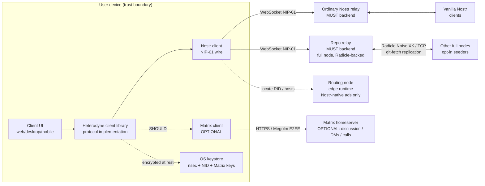
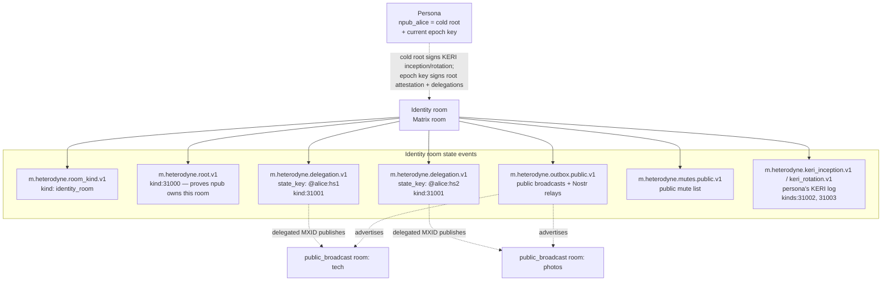
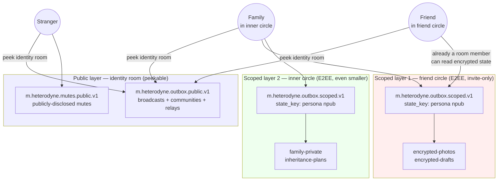

# Heterodyne Protocol Specification

**Version:** 0.4.0 (DRAFT - Radicle + Nostr core substrate, repo-visibility privacy tiers, optional Matrix layer, KERI cold-root/epoch signing)
**Status:** Working draft. While the major version is `0`,
**everything in this specification is subject to change** — wire
formats, event kinds, the room taxonomy, the signing model, and
any normative requirement MAY change in any release, breaking
prior `0.x` versions (semver 0.x rule; see §12.1). The strict
PATCH/MINOR/MAJOR compatibility contract takes effect only at
`1.0.0`. See `docs/adr/` for the decisions behind each revision.

This revision records a substrate pivot (ADR-026 through ADR-029):
**Nostr signed events are the canonical content unit, carried over
two co-equal MUST backends** - ordinary Nostr relays AND "repo
relays" (NIP-01 websocket endpoints backed by a Radicle git
repository). **Radicle** (the Heartwood 1.x peer-to-peer git stack)
provides durable, censorship-resistant P2P replication behind repo
relays; it never sits in front of a browser or mobile client.
**Matrix is demoted to an OPTIONAL (SHOULD) layer** for interactive
discussion groups, DMs, calls, and encrypted real-time rooms; no
identity, publishing, discovery, or privacy requirement depends on
it. The broadcast privacy model is recast as a repo-visibility
taxonomy with three tiers (public repo; private
"unencrypted-but-not-discoverable" repo; encrypted-blobs-in-repo),
and asynchronous public interaction (replies, reactions) uses the
Nostr outbox model over the two core backends. See ADR-029 for the
full supersession of the earlier Matrix-mandatory requirements.

Earlier revisions (v0.2.0–v0.3.0) made substantive structural
changes following external review:
(a) the per-room feed index is no longer a Matrix state event —
it is a Nostr replaceable event (`kind:31007`) published to
relays; for private rooms the index content is encrypted under a
Heterodyne room-key derived from the Matrix Megolm session
(§6.7.4, ADR-005), so the canonical feed list cannot be silently
mutated by a hostile homeserver nor read by non-members;
(b) the identity room is reframed as a disposable container,
with the NIP-01 `kind:31005` identity pointer as the
authoritative npub→room mapping that allows the owner to abandon
a compromised room and direct followers elsewhere; (c)
delegation acknowledgement no longer requires a Matrix MSK
signature — the delegation is authenticated by the homeserver's
normal `/send/state` authorization on the epoch-key-signed payload;
(d) the §3.5 single-key successor chain is deleted, and
Heterodyne commits unconditionally to KERI for root inception
and rotation; the Heterodyne KERI profile is inlined in §3.5
(ADR-003); (e) the room taxonomy (ADR-017) is organized on a
broadcast-vs-discussion × public-vs-private axis into four social
kinds (`public_broadcast`, `private_broadcast`,
`public_discussion`, `private_discussion`) plus the `identity_room`
and `config_room` infrastructure kinds — broadcast posts are always
Nostr-signed (room-key-wrapped on relays when private, §6.10),
discussion is bare Matrix by default with an opt-in per-message
signature badge, and no kind claims deniability; (f) Matrix-DM
retrieval backfill is forbidden (Nostr
relays + user-hosted archives only); (g) moderator post-hoc
removal uses Nostr `kind:5` deletion plus an updated
`kind:31007` feed index, not Matrix redaction; (h) security
hardening — scoped ±5 minute clock skew on root attestations
(§3.2.1 NOTE), mandatory SSRF prevention on ATProto DID
resolution, and a mandatory `nip01_raw` canonical-serialization
field on `m.heterodyne.note.v1` to prevent JSON-canonicalization
attacks on signature validation; (i) MSC4362-compatible
encrypted state events are implemented client-side over vanilla
Matrix homeservers (ADR-001); private rooms are Heterodyne-only
(ADR-002); (j) page-integrity hashing via `prev_page_hash` and
normative relay-partition handling (ADR-006); (k) a formal
`heterodyne-strict-mode` client profile for moderation and
state-downgrade enforcement (ADR-007). The Matrix room version
is pinned at `"11"` (ADR-002). v0.1.4 added the OPTIONAL
ATProto attached outbox (§11.6) and KERI social witnesses;
v0.1.3 introduced the Nostr-relays-for-public-content pivot.
The spec is implementation-agnostic — language and runtime
choices are out of scope.

**Legacy v0.2/v0.3 behavior superseded by the v0.4.0 substrate pivot.**
The paragraph above records the v0.2.0-v0.3.0 history; several details in
it are **legacy and superseded by the v0.4.0 substrate pivot** and MUST
NOT be read as current requirements. In particular: (a) the Tier 3 index
key is NO LONGER derived from the Matrix Megolm session - it is a
Heterodyne audience key distributed Matrix-free via per-recipient
`kind:31011` wraps (§6.7.4, ADR-028), and the retired
Megolm-derived `"room_key.v1"` construction MUST NOT be honored; (b)
`kind:31005` is NO LONGER an "npub → Matrix room" pointer - it is the
authoritative **npub → Radicle RID + optional host hints** pointer (§3.2,
§7, §11.3, ADR-026); and (c) the earlier Matrix-centric room taxonomy
(`public_broadcast` / `private_broadcast` / `public_discussion` /
`private_discussion` as the primary substrate) is superseded by the
repo-visibility privacy-tier model (§5, §9.0, ADR-028); the room kinds
survive only inside the OPTIONAL Matrix discussion layer (ADR-029). Where
the historical list mentions Matrix-derived room keys, npub→room
pointers, or the room taxonomy as load-bearing, treat those as v0.2/v0.3
behavior, not v0.4.0.

## System overview



Heterodyne is a decentralized social network protocol built on a
**Radicle + Nostr core**, with Matrix as an OPTIONAL layer. A
persona's identity is a Nostr `secp256k1` keypair (npub/nsec); its
npub is the canonical, portable, homeserver-independent identity.
Nostr signed events are the canonical content unit. A conforming
client MUST read and write those events over **two co-equal
backends**: ordinary Nostr relays and **repo relays** - NIP-01
websocket endpoints whose event store is a **Radicle** git
repository. At the wire level the two are indistinguishable; the
difference is what a repo relay is backed by: a Radicle-replicated,
delegate-signed git store rather than a single relay's database.
Radicle's peer-to-peer replication (Heartwood 1.x, Noise XK over
TCP) lives entirely behind full nodes and never sits in front of a
browser or mobile client.

Broadcast content is organized by **repo-visibility privacy tier**
(§5): public repo (world-readable plaintext), private repo
(`visibility: private` + allow-list - plaintext on allowed seeders,
invisible to everyone else), and encrypted-blobs-in-repo (NIP-44
ciphertext under an audience key, confidential against everyone
including seeders). A persona's curated **feed indexes** are Nostr
replaceable events (`kind:31007`) published to both backends, and
remain the canonical ordering/curation authority regardless of which
backend served a post. Asynchronous public interaction - replies and
reactions - uses the Nostr **outbox model**: each author writes into
their own outbox (their repo relay and Nostr relays), and threads are
assembled scatter-gather across repliers' outboxes. **Matrix** is a
SHOULD-level layer for real-time confidential discussion, DMs, and
calls; clients that omit it remain fully conformant and MUST degrade
gracefully to async outbox interaction.
The cross-protocol bridge is purely client-side: no homeserver,
relay, or Radicle node software modification is required, and no
specific language or runtime is prescribed.

This document is the normative specification for the Heterodyne protocol: a
decentralized social network built by carrying Nostr events over ordinary
Nostr relays and Radicle-backed repo relays, with Matrix as an optional
real-time layer. It is the single source of truth that any
independently-implemented Heterodyne client MUST follow to interoperate.

The keywords MUST, MUST NOT, REQUIRED, SHALL, SHALL NOT, SHOULD, SHOULD NOT,
RECOMMENDED, MAY, and OPTIONAL in this document are to be interpreted as
described in [RFC 2119](https://www.rfc-editor.org/rfc/rfc2119).

## Table of contents

1. [Scope and non-goals](#1-scope-and-non-goals)
2. [Terminology](#2-terminology)
3. [Identity model](#3-identity-model) - **drafted**
4. [Event envelope](#4-event-envelope) - **drafted**
5. [Repo-visibility taxonomy (and OPTIONAL Matrix discussion kinds)](#5-repo-visibility-taxonomy-and-optional-matrix-discussion-kinds) - **drafted**
6. [Publishing flow](#6-publishing-flow) - **drafted**
7. [Discovery and subscription](#7-discovery-and-subscription) - **drafted**
8. [Moderation](#8-moderation) - **drafted** (NIP-72 approval mode + Radicle editorial-gating mode §8.8, ADR-027)
9. [Encryption guarantees](#9-encryption-guarantees) - **drafted** (three privacy tiers §9.0; Megolm/MLS scoped to OPTIONAL Matrix)
10. [Bridge and client model](#10-bridge-and-client-model) - **drafted** (Nostr + repo-relay client; node roles §10.1.1; Matrix OPTIONAL)
11. [Interoperability with vanilla Nostr and vanilla Matrix](#11-interoperability) - **drafted** (incl. §11.7 strict-mode profile, ADR-007)
12. [Versioning and capability negotiation](#12-versioning-and-capability-negotiation) - **drafted**
13. [Security model](#13-security-model) - **drafted** (companion analysis in [`../security/threat-model.md`](../security/threat-model.md))
14. [Conformance and test vectors](#14-conformance-and-test-vectors) - **drafted** (vectors authored incrementally in [`vectors/`](vectors/))

## 1. Scope and non-goals

### 1.1 Scope

Heterodyne defines:

- An **identity model** binding a Nostr `secp256k1` keypair (the canonical
  identity) to one or more delegated publishers. A delegated publisher is
  a device authorized by the persona's KERI-anchored key event log; it
  carries a secp256k1 publishing key and, when it participates in Radicle
  replication, an Ed25519 Radicle Node ID (NID). Matrix MXIDs survive as
  delegated publishers only inside the OPTIONAL Matrix layer (§3.3).
- Two co-equal **content backends** for Nostr signed events: ordinary
  Nostr relays and Radicle-backed **repo relays** (both the NIP-01
  websocket wire). Repo relays add durable, censorship-resistant P2P git
  replication behind the relay; the wire is unchanged.
- An **event envelope** for carrying signed Nostr events, with a bare
  default (no extra signature) and an OPTIONAL per-message signature that
  adds a transferable authenticity proof; the same envelope forms carry
  timeline traffic in the OPTIONAL Matrix layer.
- A **repo-visibility taxonomy** for broadcast content on three privacy
  tiers (public repo, private repo, encrypted-blobs-in-repo, §5), plus an
  OPTIONAL Matrix discussion taxonomy (`public_discussion`,
  `private_discussion`) for real-time conversation.
- A **publishing flow** describing how a client fans out a single
  user-level post across the two core backends (and optionally the Matrix
  layer), and an **outbox interaction model** for replies and reactions.
- A **discovery mechanism** (routing nodes, `kind:31005` npub→RID
  pointer, `kind:31010` node advertisement) so followers can locate a
  persona's repo and reachable full nodes without a central directory.
- A **node topology** - full node (Radicle node + repo-relay adapter),
  routing node (edge-deployable, content-free), and light node
  (browser/mobile client) - defined in §7 and §10.
- A **moderation layering** combining a Radicle-native editorial-gating
  mode (reachability from the delegate-threshold-approved canonical feed
  branch, §8) with NIP-72-style approval signatures for editorial
  control, and - in the OPTIONAL Matrix layer - room-level ACLs.
- A **bridge model** that is purely client-side; no homeserver, relay, or
  Radicle node software modifications are required.
- A **transport-reachability requirement** (§7.7) making embedded Tor a
  universal client conformance obligation, so that `.onion` repo relays,
  Nostr relays, routing nodes, full nodes, and (optional) homeservers are
  first-class destinations and opt-in egress-over-Tor is a one-toggle
  privacy feature.
- A **multi-homed redundancy model** (§3.11, per ADR-020, reframed by
  ADR-026): OPT-IN Radicle **seeding** of a persona's repo by the peers
  who choose to seed it, so persona content survives the loss of any
  single full node. Redundancy is opt-in seeding, not automatic
  popularity-weighting; a persona MUST be reachable through at least one
  durably-connected full node for reliable replication.
- A **social-recovery model** (§3.12, per ADR-021): follower caching of
  identity-room state and a two-tier (declared-witness + informal)
  vouching process that lets a persona re-anchor after the permanent
  loss of its identity-room homeserver.
- An OPTIONAL **Heterodyne-aware relay profile** (§10.6, per ADR-022): a
  strict superset of a vanilla NIP-01 relay that adds KEL-aware
  reputation continuity, optional KEL-aware discovery, and a passive
  witness-receipt store — never required for conformance.

### 1.2 Non-goals

Heterodyne explicitly does not:

- Define a new transport, relay protocol, homeserver, or peer-to-peer
  network. It composes the Nostr, Radicle, and (optionally) Matrix
  networks as they exist. A repo relay is an ordinary NIP-01 relay whose
  store happens to be a Radicle repository; it introduces no new wire.
  Requiring that a conforming client be able to *reach* an existing
  transport - specifically Tor `.onion` endpoints (§7.7) - is a client
  conformance property, not the definition of a new transport: Tor is an
  existing transport the client composes, exactly as it composes clearnet
  TCP/TLS.
- Reserve new Nostr event kinds for user content. Existing NIP-defined
  kinds are used verbatim inside the envelope. (A small range of
  Heterodyne-reserved kinds for identity-room state events is defined in
  §3; these never appear as user-visible posts.)
- Provide a global directory of users. Discovery is consent-driven and
  relationship-mediated.
- Replace or compete with vanilla Nostr, vanilla Radicle, or vanilla
  Matrix. A Heterodyne user can interact with all three networks; a
  vanilla client of any can interact with a Heterodyne user with reduced
  fidelity. In particular every published event remains a normal
  single-signed Nostr event, so vanilla Nostr clients and relays are
  unaffected.

## 2. Terminology

Defined terms appear in **bold** on first use. The canonical glossary is
[`../glossary.md`](../glossary.md); the most load-bearing terms are
restated here.

- **npub** / **nsec** — a user's Nostr public key (`secp256k1`,
  bech32-encoded with `npub1...` prefix) and secret key (`nsec1...`
  prefix). The npub is the canonical Heterodyne identity. All Nostr
  identity and event signatures use `secp256k1` with BIP-340 Schnorr.
- **Persona** - a distinct Heterodyne identity (one npub anchored by a
  KERI cold root, one canonical Radicle repository, one set of
  delegations). A user MAY hold multiple personas; the protocol does not
  link them. An organization is a persona whose repo delegates and
  thresholds encode shared authority (§3, ADR-027); a plain user is the
  one-delegate degenerate case.
- **Radicle** - the peer-to-peer git collaboration network (the
  Heartwood 1.x stack) that provides durable, censorship-resistant
  replication of git repositories behind repo relays. Radicle signs
  everything (node identity, git refs, collaborative objects, identity
  documents) with **Ed25519**; it never sits in front of a browser or
  mobile client (§7, §10, ADR-026).
- **Heartwood** - the current Radicle protocol/node implementation
  (1.x). Assumed version for normative dependence is 1.9.x; where a
  Radicle internal detail is not yet confirmed against the pinned
  Heartwood release, this spec marks it UNVERIFIED and MUST NOT depend on
  it normatively until verified.
- **Node ID (NID)** - a Radicle node's identity: an **Ed25519** keypair
  encoded as a `did:key` DID. A device that participates in Radicle
  replication has an NID; it signs git refs and collaborative objects.
  The NID curve (Ed25519) is distinct from and unrelated to the persona's
  Nostr npub curve (secp256k1); any binding between them is by attestation
  (§3.3), not by algebra.
- **Repository ID (RID)** - a Radicle repository's stable identifier
  (`rad:z...`), a multibase base58-btc encoding of a hash of the initial
  identity document; stable across identity-document changes. The
  persona's canonical RID is carried by its `kind:31005` pointer.
- **Repo relay** - a NIP-01-compatible relay endpoint (the ordinary Nostr
  websocket wire) served by a full node, whose event store is a Radicle
  git repository. Indistinguishable from a plain Nostr relay at the wire
  level (§7, §10, ADR-026).
- **Full node** - a node that runs a Radicle node (Noise XK / TCP gossip +
  git-fetch replication) AND a NIP-01 repo-relay adapter over its repo
  store. Full nodes are the only nodes that hold content; a persona needs
  at least one durably-connected full node to replicate reliably (§7,
  §10).
- **Routing node** - a stripped-down, edge-runtime-deployable node (e.g.
  Cloudflare Workers) that does NOT clone repos and holds no content. It
  answers "which full nodes serve the repo relay for this npub / RID?"
  from Nostr-native advertisements (`kind:31005`, `kind:31010`) only, and
  MUST NOT be required to proxy content (§7, ADR-026).
- **Light node** - a client (including WASM/browser/mobile) that queries a
  routing node, then connects **directly** to a full node's repo relay
  (or an ordinary Nostr relay) to fetch content and verifies every
  event's Nostr signature locally. It pulls no content through a routing
  node (§7, §10).
- **Seeding** - a peer's explicit choice to store and help replicate a
  Radicle repository. Replication is driven by seeding policy, not by
  popularity; a repo is mirrored by exactly the peers who choose to seed
  it (§3.11, ADR-026).
- **Collaborative Object (COB)** - a Radicle social artifact (issue,
  patch, identity document, or a custom reverse-DNS type such as
  `xyz.heterodyne.thread`) stored as git objects and merged with a CRDT.
  Custom COB types need no protocol change.
- **Canonical `defaultBranch`** - the repo's canonical head, established
  as the commit a **threshold of delegates** agree on (the verified
  Radicle canonicity mechanism). Heterodyne's baseline org
  editorial-gating uses this delegate-threshold canonical feed branch
  (§6.7.0, §8).
- **Canonical reference rules (`xyz.radicle.crefs`)** - an OPTIONAL,
  EXPERIMENTAL Radicle per-ref refinement: per-ref rules, each with an
  `allow` set of DIDs (or the keyword `"delegates"`) and a `threshold`,
  that would govern which refs are canonical at finer granularity than
  the single `defaultBranch`. A deployment MAY use it to gate individual
  branches at different thresholds, but its exact semantics are NOT yet
  verified against the pinned Heartwood release (the sources note only
  that additional canonical branches beyond `defaultBranch` "may be
  supported" in future); Heterodyne baseline canonicity MUST NOT depend
  on it (§6.7.0, §8, §3.9.10, ADR-027).
- **Identity document** - a Radicle repository's Canonical JSON document
  (`delegates`, `threshold`, `payload`, `visibility`), the projection of
  the persona's KERI-authoritative delegate set. Its exact storage
  (a `xyz.radicle.id` COB versus a special ref) is UNVERIFIED pending the
  pinned Heartwood release; the spec does not depend on that detail
  normatively (§3.9, ADR-027).
- **Delegates** - the Ed25519 NIDs empowered to change a repo's identity
  document and establish its canonical refs. Distinct from the
  `visibility.allow` set (which grants replication/read access without
  governance authority, §5, §6.10).
- **Threshold** - the integer M in an M-of-N scheme: an identity-document
  change or the canonical `defaultBranch` head is authoritative once M
  delegates sign the same revision/commit. A sole-delegate persona has
  threshold 1.
- **KERI key event log (KEL)** - the persona's authoritative key-rotation
  history (§3.5). It is authoritative over the Radicle identity document:
  on any divergence, clients trust the KEL (§3.9, ADR-027).
- **Delegation** - an attestation (Nostr `kind:31001`) authorizing a
  device to publish on behalf of the persona's npub. A device carries a
  secp256k1 publishing key and, when it participates in Radicle
  replication, an Ed25519 NID; one delegation binds both, and (for a NID)
  is bidirectionally signed (§3.3, ADR-027). Matrix MXID delegations
  survive only inside the OPTIONAL Matrix layer.
- **Identity room** - an OPTIONAL Matrix room that MAY act as a container
  for a persona's Heterodyne state. It is no longer authoritative: the
  authoritative npub→location mapping is the `kind:31005` RID pointer
  (§3.2, ADR-026/029).
- **Outbox** - the persona's own writable location for its content and
  interactions: its repo relay plus its Nostr relays. Replies and
  reactions are written into the AUTHOR'S OWN outbox and assembled
  scatter-gather (§6.5).
- **Broadcast vs discussion** - the primary content axis (§5). A
  **broadcast** persona publishes *as* a persona: posts are always
  Nostr-signed and live on the two core backends, organized by
  repo-visibility privacy tier (public / private / encrypted, §5).
  **Discussion** - many-party (or two-party DM) real-time conversation -
  is carried as bare Matrix in the OPTIONAL Matrix layer, or as async
  outbox interaction when Matrix is absent.
- **Wrap mode** — whether an in-room message carries a Nostr signature
  (**wrapped** `m.heterodyne.note.v1` or a `heterodyne_nostr_sig`,
  authentic and forwardable to vanilla Nostr, giving a transferable
  proof of authorship) or only Matrix-layer content (**bare**). Bare
  is the default for discussion traffic and reactions; it is NOT
  deniable — the author's npub is still attributable via §3.3 (§13.1.2)
  — but it leaves no transferable third-party proof.
- **KERI key event log** — the persona's authoritative key-rotation history
  per §3.5: a sequence of `kind:31002` inception and `kind:31003` rotation
  events committing to successive epoch public keys under a single cold
  root. Followers replay the log to follow a persona across rotations. The
  v0.1.4 single-key successor chain is deprecated (see §3.5).
- **NIP-59 wrapping terminology** — Nostr's gift-wrap mechanism
  (used for vanilla-Nostr DMs per NIP-17, and historically
  considered for Heterodyne private indexes — withdrawn in v0.2.0
  per ADR-005). Three distinct layers per NIP-59:
  - **rumor** — an UNSIGNED Nostr event (e.g., `kind:14` chat
    message rumor per NIP-17). Carries the actual content.
  - **seal** (`kind:13`) — encrypts the rumor under the sender's
    long-term key; SIGNED by the author.
  - **gift wrap** (`kind:1059`) — encrypts the seal under a
    one-time key addressed to a specific recipient; signed by
    that one-time key. One gift wrap event per recipient.

  When the spec mentions "NIP-17 DM kinds" it refers to the
  combination of kinds 14/15 (rumor), 13 (seal), 1059 (gift
  wrap), and 10050 (DM relay list).

- **`matrix:` URI** — the canonical reference format for Matrix rooms,
  events, and users used in this spec, per MSC2312. Form:
  `matrix:roomid/<id-without-bang>:<server>?via=<server>&via=<server>`
  for room-by-id; `matrix:r/<alias-without-hash>:<server>` for
  room-by-alias; `matrix:u/<user-without-at>:<server>` for user. New
  constructs in this spec (e.g., the config-room pointer in §3.8)
  reference rooms via `matrix:` URIs. Earlier sections (§7 outbox
  schemas) use a structured `{room_id, via}` form which is equivalent
  and remains valid; the URI form is REQUIRED only where explicitly
  stated.

## 3. Identity model

### 3.0 Nostr kind allocations

Heterodyne uses existing Nostr event kinds wherever a NIP already
defines the semantics, and reserves a small range (31000-31099) for
Heterodyne-specific state events. Implementations MUST NOT allocate
new kinds outside the reserved range without a spec amendment.

| Kind | Use | Defined in | NIP origin |
|------|-----|------------|------------|
| 1 | Short-form text note (microblog) | §4.2 | NIP-01 / NIP-10 |
| 3 | Follow list (contact list) | §7.4 (OPTIONAL emit for interop) | NIP-02 |
| 4 | Encrypted DM | NOT USED — deprecated upstream | NIP-04 |
| 7 | Reaction | §4.2 | NIP-25 |
| 1984 | Reporting | §8 (community moderation interop) | NIP-56 |
| 4550 | Community post approval | §8.1 | NIP-72 |
| 9734 | Zap request | §7.1 reply-inbox interop | NIP-57 |
| 9735 | Zap receipt | §7.1 reply-inbox interop | NIP-57 |
| 10002 | Relay list metadata | §7.1 `nostr_relays` interop | NIP-65 |
| 14, 15 | NIP-17 chat message rumor (unsigned) | §11.4 (vanilla-Nostr-only DMs) | NIP-17 |
| 13 | NIP-17 / NIP-59 seal (encrypted rumor, signed by author) | §11.4 | NIP-59 |
| 1059 | NIP-17 / NIP-59 gift wrap (encrypts seal; signed by one-time key) | §11.4 | NIP-59 |
| 10050 | NIP-17 DM relay list | §11.4 | NIP-17 |
| 30023 | Long-form content (article) | §4.2, §11.5 | NIP-23 |
| 30024 | Long-form content (draft) | §4.2 | NIP-23 |
| 30402 | Classified listing | §4.2 (interop only) | NIP-99 |
| **31000** | **Heterodyne: root attestation** | §3.2.1 | Heterodyne-reserved |
| **31001** | **Heterodyne: delegation attestation (secp256k1 publisher + Ed25519 Radicle NID)** | §3.3 | Heterodyne-reserved |
| **31002** | **Heterodyne: KERI inception** | §3.5 | Heterodyne-reserved (Cold Root design) |
| **31003** | **Heterodyne: KERI rotation** | §3.5 | Heterodyne-reserved (Cold Root design) |
| **31004** | **Heterodyne: related-persona attestation** | §7.5 | Heterodyne-reserved |
| **31005** | **Heterodyne: identity pointer (authoritative npub→RID + optional full-node host hints)** | §3.2, §7, §11.3 | Heterodyne-reserved |
| **31006** | **Heterodyne: cold root backup** | RESERVED for future normative schema | Heterodyne-reserved |
| **31007** | **Heterodyne: feed index (canonical ordering/curation authority)** | §6.7 | Heterodyne-reserved |
| **31008** | **Heterodyne: social vouch (informal recovery attestation)** | §3.5.5 | Heterodyne-reserved |
| **31009** | **Heterodyne: ATProto identity link attestation** | §11.6.3 | Heterodyne-reserved |
| **31010** | **Heterodyne: node/repo advertisement (RID → full-node repo-relay endpoints)** | §7 | Heterodyne-reserved (secp256k1/BIP-340 Nostr event carrying an inner Ed25519 NID possession proof) |
| **31011** | **Heterodyne: audience-key-wrap (per-recipient NIP-44 wrap of an audience key)** | §6.7.4, §6.10 | Heterodyne-reserved |
| **31012** | **Heterodyne: audience roster (epoch-key-signed recipient set for a Tier 3 audience)** | §6.7.4, §7.2 | Heterodyne-reserved |
| 31013-31099 | RESERVED for future Heterodyne use | - | - |

NOTES on the substrate pivot (ADR-026/027/028):

- `kind:31005` is repurposed from "npub → Matrix identity room" to the
  authoritative **npub → Radicle RID + optional full-node host hints**
  pointer (§3.2, §7, §11.3). Its signing authority is split: the
  authoritative **npub→RID binding MUST be cold-root-signed** (matching
  §11.3 and the re-anchor requirement in §3.9.10/§3.12.2); a routine
  **host-hint-only refresh** (which leaves the RID binding unchanged) MAY
  be **epoch-key-signed**. A verifier distinguishes the two by the
  signing key: any change to the `["rid", ...]` binding requires the
  cold-root signature, while an update that only refreshes
  `["host_hint", ...]` tags for the same RID may carry an epoch-key
  signature.
- `kind:31001` is extended to authorize an Ed25519 Radicle NID as a
  delegated publisher in addition to its existing publisher-target
  semantics; a NID binding is bidirectionally signed (§3.3).
- `kind:31007` gains ordering-authority and, for org personas, a
  delegate-threshold canonical-branch reachability rule (§6.7, §3.9),
  and is published to both core backends.
- `kind:31010` (node/repo advertisement) is a **valid NIP-01 Nostr
  event**: its outer `pubkey`/`sig` are secp256k1/BIP-340, signed by the
  advertising node's Nostr key (a dedicated node npub, or the operating
  persona's current epoch key), so it is Nostr-valid on the NIP-01 wire.
  It CARRIES INSIDE its tags an advertised Ed25519 NID, the reachable
  repo-relay endpoint(s), an expiry, and an **Ed25519 NID
  proof-of-possession** - an Ed25519 signature by that NID over the
  advertisement payload (including the current canonical repo head).
  Verifiers check both signatures: the outer BIP-340 Nostr signature AND
  the inner Ed25519 NID possession proof (§7). It is NOT exempt from the
  secp256k1-signature assumption below - its outer signature IS a
  secp256k1/BIP-340 signature.
- `kind:31011` (audience-key-wrap) is a recipient-addressed event: the
  audience key is NIP-44-wrapped once per recipient to that recipient's
  npub (§6.7.4, §6.10).

All Heterodyne-reserved kinds (31000-31099) follow Nostr's addressable
event convention (NIP-01) for the 30000-39999 range: they are
replaceable by the `(pubkey, kind, d)` tuple. Heterodyne attestations
that should have exactly one canonical instance per persona (root,
identity pointer, current KERI inception; future cold-root backup
schemas are expected to follow the same pattern) use a
`["d", ""]` tag (empty identifier); attestations that may have
multiple instances per persona (delegations keyed by delegated
publisher - a NID or, in the OPTIONAL Matrix layer, an MXID - feed
indexes keyed by page id or an opaque private-index address, KERI
rotations keyed by sequence number, social vouches keyed by vouched
key, ATProto links keyed by DID, node advertisements keyed by RID,
audience-key wraps keyed by recipient npub, audience rosters keyed by
`key_id`) use a non-empty `d` tag
whose construction is defined by the section that introduces the
kind. Schema examples MUST show the `d` tag explicitly; it is never
implicit.

### 3.0.1 Canonical Nostr serialization

Every embedded Nostr event in this specification — whether inside a
Heterodyne state event, inside an `m.heterodyne.note.v1` envelope, or
attached via `heterodyne_nostr_sig` — MUST be serialized for signing
exactly as defined by NIP-01: the JSON array

```
[0, pubkey, created_at, kind, tags, content]
```

with no whitespace, with strings JSON-escaped per RFC 8259, and with
the array UTF-8-encoded before SHA-256 hashing to produce the event
`id`. The `tags` array preserves the order chosen by the producer;
implementations MUST NOT reorder tags during transport. The `sig`
field is the Schnorr signature over the resulting 32-byte hash, per
BIP-340 / NIP-01.

Implementations MUST NOT invent a Heterodyne-specific canonical form.
Matrix-layer canonicalization (Matrix Canonical JSON) is applied
independently by the Matrix SDK; the two canonicalizations do not
interact.

#### 3.0.1.1 `nip01_raw` field on embedded Nostr events

To prevent Matrix homeservers or intermediary JSON parsers from
silently breaking signature validation by re-serializing the
parsed event object (which may reorder object keys per RFC 8259
§4, normalize numeric representations, or alter whitespace,
any of which would invalidate the NIP-01 signature; note that
JSON ARRAY ordering is preserved by conforming parsers per RFC
8259 §5, but the SURROUNDING object containing the parsed event
fields is not), every `m.heterodyne.note.v1` event MUST
include a `nip01_raw` field at the top of `content` containing the
exact stringified JSON array

```
[0, pubkey, created_at, kind, tags, content]
```

that was UTF-8-encoded and SHA-256-hashed to produce the embedded
Nostr event's `id` and over which the BIP-340 signature was
produced. The parsed `content.nostr` object remains for human and
tool readability, but verifiers MUST hash `content.nip01_raw`
directly (rather than reconstructing the serialization from the
parsed object) when validating the signature. Verifiers MUST
additionally check that the values exposed in `content.nostr`
(`id`, `pubkey`, `created_at`, `kind`, `tags`, `content`, `sig`)
match what is contained in `nip01_raw`; any mismatch MUST cause
rejection.

The same `nip01_raw` requirement applies to:

- Embedded Nostr events inside `m.heterodyne.note.v1` (above).
- Nostr attestations embedded in identity-room state events
  (`m.heterodyne.root.v1`, `m.heterodyne.delegation.v1`, KERI
  inception/rotation, `m.heterodyne.atproto_link.v1`).
- The OPTIONAL `heterodyne_nostr_sig` field on bare events
  (§4.3).

In every case the structural location is the same: a sibling
`nip01_raw` string alongside the parsed `nostr_attestation` /
`heterodyne_nostr_sig` / `nostr` object. Schemas in §3.2.1, §3.3,
§4.2, §4.3, §11.6.3 are amended implicitly by this rule —
implementations MUST emit and check `nip01_raw` even where the
schema example below this point omits it for brevity.

### 3.1 The npub is canonical

A Heterodyne identity is a Nostr `secp256k1` keypair, referred to by its
public key in bech32 form (`npub1...`). The npub is the authoritative
subject of all attestations made by or about this identity. Matrix
accounts in this specification are *delegated publishers* of the npub, not
identities in their own right.

A single human MAY hold any number of npubs (personas). The protocol does
not attempt to link personas to humans; this is a deliberate privacy
property.

### 3.2 Identity pointer and OPTIONAL identity room

The **authoritative** npub→location mapping for a persona is its
cold-root/epoch-signed **`kind:31005` identity pointer** (§7, §11.3),
which names the persona's canonical Radicle **RID** and MAY carry
full-node host hints. This is a Nostr-native pointer published to the
core backends (Nostr relays; SHOULD also be mirrored into the identity
repo); it does not depend on Matrix.

A Matrix **identity room** is now OPTIONAL. A persona MAY maintain a
Matrix room as a container for the Heterodyne state events described
below (root attestation, delegations, KERI KEL mirror, outbox
advertisements), for in-room visibility and for personas that also run
the OPTIONAL Matrix layer. It is not required for conformance: a
Matrix-free persona carries the same state on the repo/Nostr substrate
(the identity repo and relay-published attestations), and its identity
resolves entirely through `kind:31005`.

The location a persona lives at is a **disposable container** - whether
a Radicle RID or a Matrix room. The ultimate authority for "where does
this persona live now?" is the persona's Nostr npub (anchored via KERI
per §3.5), not any container id. If a container is compromised (a
Matrix-layer power-level takeover, or a Radicle identity-document
deadlock, §3.9), the persona's owner MUST re-anchor to a fresh
container and publish a new NIP-01 replaceable `kind:31005` pointer on
the persona's write relays naming the new location (a fresh RID, and -
if the OPTIONAL Matrix layer is in use - a fresh `matrix_identity_room`
URI).

Verifiers MUST prioritize the location values carried by the latest
valid `kind:31005` event from the persona's npub over any locally
cached container id. Cached pointers older than the authoritative
`kind:31005` MUST be discarded.

The npub does not change when the container is replaced - followers'
subscriptions, KERI history, and cryptographic identity all persist.
Only the container (RID and/or Matrix room) moves.



When present, a Matrix identity room is intentionally peekable: any
party MAY join or peek it and read its state to verify a persona. State
events that contain audience-restricted content (private mutes,
capabilities) live elsewhere - in the OPTIONAL per-MXID config room
(§3.8) or in scoped contexts (§7.2, §12.2).

When a Matrix identity room is used, it SHOULD contain:

- An `m.heterodyne.room_kind.v1` state event with
  `kind: "identity_room"` (§5.1).
- An `m.heterodyne.root.v1` state event proving npub ownership of the
  room (§3.2.1).
- Zero or more `m.heterodyne.delegation.v1` state events mirroring the
  persona's `kind:31001` delegations into Matrix state (§3.3). MXID
  delegations are meaningful only inside this OPTIONAL layer.
- At most one `m.heterodyne.outbox.public.v1` state event listing the
  persona's public-facing outbox (§7.1).
- Zero or more `m.heterodyne.keri_inception.v1` and
  `m.heterodyne.keri_rotation.v1` state events mirroring the persona's
  KERI key event log (§3.5).

The persona's canonical Heterodyne address is its **npub** — the KERI
cold-root public key (§3.5.0) - not any container id. Authoritative
resolution follows the latest `kind:31005` identity pointer (§7, §11.3),
which the npub controls, to the persona's canonical RID (and, when the
Matrix layer is in use, to whichever identity room is current; see the
§3.6 authority ladder). Resolving a persona therefore means following
that pointer to the persona's repo (fetched via a repo relay, §7) and
verifying its relay-published attestations; a cached container id is
never authoritative on its own.

#### 3.2.1 Root attestation

The `m.heterodyne.root.v1` state event:

```json
{
  "type": "m.heterodyne.root.v1",
  "state_key": "",
  "content": {
    "spec_version": "0.4.0",
    "nostr_attestation": {
      "id": "<32-byte hex>",
      "pubkey": "<32-byte hex of the persona's current epoch key>",
      "created_at": 0,
      "kind": 31000,
      "tags": [
        ["d", ""],
        ["heterodyne", "root"],
        ["matrix_room", "<this room's room_id>"],
        ["cold_root", "<32-byte hex of the persona's npub / cold-root key>"]
      ],
      "content": "",
      "sig": "<64-byte hex by the current epoch key>"
    }
  }
}
```

The `nostr_attestation` field is a valid Nostr event of
Heterodyne-reserved kind `31000` (§3.0), signed by the persona's
**current epoch key** (§3.5.0) per `nip01_raw` (§3.0.1.1). The cold
root is never brought online to sign root attestations: the
`cold_root` tag binds the attestation to the persona's permanent
npub, and the verifier confirms — by replaying the KEL (§3.5.3) —
that the signing epoch key is the one the cold root currently
authorizes. (This is why re-signing a root attestation with a fresh
`created_at`, below, is an epoch-key operation and not a cold-root
ceremony.)

Normative verification rules:

- The Nostr `sig` MUST validate against the asserted `pubkey` per
  BIP-340 Schnorr verification (over `nip01_raw`, §3.0.1.1).
- The `pubkey` MUST be the persona's **current epoch key** as
  determined by replaying the persona's KEL (§3.5.3). A root
  attestation signed by any key that is not the currently
  authoritative epoch key MUST be rejected.
- The `cold_root` tag MUST be present and MUST equal the persona's
  npub (cold-root public key). This is the permanent identity the
  attestation binds to the room.
- The `matrix_room` tag applies ONLY when the OPTIONAL Matrix identity
  room (§3.2) is in use. When the attestation is carried inside a Matrix
  identity room, the `matrix_room` tag MUST contain that room's Matrix
  room ID, as a bare room ID (with leading `!`), or verification against
  that room fails. For a Matrix-free persona the root attestation binds
  the npub to the persona via the `cold_root` tag alone and the
  `matrix_room` tag is omitted; verifiers MUST NOT require it outside the
  Matrix layer.
- The `d` tag MUST be present and have empty value (`["d", ""]`) per
  §3.0. Failure → reject (the root attestation is unique per persona;
  duplicates with non-empty `d` are spurious).
- The Nostr `created_at` MUST be within a strict ±5 minute window
  of the verifier's current wall-clock time at the moment of
  verification. Events outside this window MUST be rejected. (This
  hardens against replay of an old signed attestation re-injected
  into a fresh identity room. Genuine re-publication of a long-ago
  attestation is supported by re-signing with the persona's
  current epoch key — the npub bound in the `cold_root` tag is
  unchanged, and the new signature carries a current `created_at`.)

> **NOTE (scope of the ±5 minute rule, ADR-004).** This freshness
> rule applies ONLY to `m.heterodyne.root.v1` root attestation
> events and the Nostr `kind:31000` attestation they wrap. Other
> Heterodyne events (delegations, KERI inception/rotation, feed
> indexes, outbox advertisements, notes) are NOT subject to wall-
> clock freshness enforcement; each has its own freshness mechanism
> (e.g., KERI sequence numbers per §3.5, delegation `valid_until`
> tags per §3.3, replaceable-event semantics for `kind:31007` per
> §6.7). Verifiers MUST NOT apply the ±5 minute rule to other
> event kinds. A persona whose identity room was created long ago
> remains verifiable: the persona simply re-signs the root
> attestation with a current `created_at` whenever it republishes
> the identity-room state — an epoch-key operation; the npub
> (`cold_root` tag) and Matrix room id are unchanged across
> re-publications.
- The `cold_root` tag MUST be the persona's canonical npub. The room
  MUST NOT contain a second `m.heterodyne.root.v1` state event
  asserting a different `cold_root`; if Matrix state resolution
  produces a conflict, verifiers MUST treat the room as having no
  valid root and refuse to verify any delegation against it.

### 3.3 Delegations

A **delegation** is an epoch-key-signed `kind:31001` attestation
authorizing a device to publish on behalf of the persona's npub. Under
the substrate pivot (ADR-027) a delegation can target two kinds of
publisher:

- an **Ed25519 Radicle Node ID (NID)** - a device that participates in
  Radicle replication and signs git refs / collaborative objects; this
  is the core delegation target; and
- a **Matrix MXID** - a device that publishes only inside the OPTIONAL
  Matrix layer; this is the legacy delegation target and is meaningful
  only when the Matrix layer is in use.

**Two keys per device (ADR-027).** A Heterodyne device carries a
**secp256k1 publishing/epoch key** that signs the actual Nostr events
(preserving vanilla-Nostr interop and single-signature validity) and,
when it participates in Radicle replication, an **Ed25519 Radicle NID**
that signs git refs and participates in replication. **One `kind:31001`
attestation binds both** to the persona. A device that cannot run a
Radicle full node (browser-only / light device, §7) MAY be authorized
with only a secp256k1 publishing key and no NID; its repo writes are
performed by a persona-controlled full node (§10 write path). Only
devices that participate in Radicle replication need an NID.

#### 3.3.1 NID delegation (core)

A `kind:31001` attestation authorizing an Ed25519 Radicle NID binds the
persona npub, the device's secp256k1 publishing key, and the device's
NID:

```json
{
  "id": "<32-byte hex>",
  "pubkey": "<32-byte hex of the persona's current epoch key>",
  "created_at": 0,
  "kind": 31001,
  "tags": [
    ["d", "nid:<did:key of the Ed25519 NID>"],
    ["heterodyne", "delegation"],
    ["radicle_nid", "<did:key:z6Mk... of the Ed25519 NID>"],
    ["publishing_key", "<32-byte hex secp256k1 publishing key of this device>"],
    ["cold_root", "<32-byte hex of the persona's npub / cold-root key>"],
    ["nid_proof", "<Ed25519 signature by the NID over the binding payload>"],
    ["valid_until", ""]
  ],
  "content": "",
  "sig": "<64-byte hex Schnorr sig by the current epoch key>"
}
```

The **binding payload** is the exact byte string that BOTH the epoch
key's Schnorr signature (via the outer Nostr `sig`, which covers the tags
that encode these values) AND the NID's Ed25519 signature (`nid_proof`)
sign over. It MUST be the following domain-separated, deterministic
serialization - a fixed field order with a version/context prefix, joined
by a single ASCII `|` (0x7C) separator, UTF-8-encoded:

```
heterodyne-nid-binding-v1|<npub>|<nid>|<purpose>
```

where:

- `heterodyne-nid-binding-v1` is the literal ASCII context/version prefix
  (domain separation).
- `<npub>` is the persona's cold-root public key as a 64-character
  lowercase hex string (the 32-byte x-only key, matching the
  `["cold_root", ...]` tag).
- `<nid>` is the advertised Ed25519 NID as its `did:key` string (matching
  the `["radicle_nid", ...]` tag), verbatim including the `did:key:`
  prefix.
- `<purpose>` is the literal ASCII string `radicle-nid-delegation`.

The resulting UTF-8 byte string is the message: the NID's Ed25519
`nid_proof` is an Ed25519 signature over these exact bytes, and the epoch
key covers the same values through the outer NIP-01 `sig` over the tags.
This is the proof that the persona actually controls the NID. §3.3.1 is
the normative definition of this serialization; conformance vectors
(§14, `nid-binding/`) test these exact bytes.

Normative rules for NID delegation:

- The attestation MUST be epoch-key-signed per §3.3.3/§3.5: the outer
  Nostr `sig` MUST validate under BIP-340 against the persona's current
  epoch key, and the `cold_root` tag MUST equal the persona's npub.
- **NID binding MUST be bidirectional.** The attestation MUST carry BOTH
  the epoch key's Schnorr signature over the binding payload
  (npub + NID + purpose) AND the NID's Ed25519 signature over the same
  payload (`nid_proof`). A verifier MUST reject a `kind:31001` NID
  binding that lacks either signature. (The outer Nostr `sig` covers the
  whole event and thereby the binding payload encoded in its tags; the
  `nid_proof` tag carries the NID's independent Ed25519 signature over
  the same payload.)
- The `["radicle_nid", ...]` tag MUST be a `did:key` encoding the
  Ed25519 NID; the `["publishing_key", ...]` tag MUST be the secp256k1
  publishing key of the same device. Both are bound to the persona by
  this one attestation.
- The `d` tag MUST be `["d", "nid:<did:key>"]` so NID delegations are
  replaceable by `(pubkey, kind, d)`.
- `["valid_until", ...]` follows the same expiry rules as §3.3.2 step 5.
- The epoch key that signed the delegation MUST have been
  KERI-authoritative (§3.5.3) at the evaluation time `t`; a KERI
  rotation supersedes delegations signed under the prior epoch (§3.5,
  §3.9.9), and a KEL-revoked NID MUST NOT be honored (§3.9).

An NID delegation is the on-substrate authorization that makes a
device's NID a Radicle delegate (§3.9, ADR-027): a device's NID becomes
a repo delegate only after a valid `kind:31001` authorizes it, and the
Radicle identity document's `delegates` set is a projection of the
currently-authorized NIDs.

#### 3.3.2 MXID delegation (OPTIONAL Matrix layer)

The following MXID-targeted delegation survives only inside the OPTIONAL
Matrix layer. A persona that does not run Matrix has no MXID delegations.
Each Matrix account that publishes on behalf of the npub is bound by an
`m.heterodyne.delegation.v1` state event in the identity room, keyed by
the MXID:

```json
{
  "type": "m.heterodyne.delegation.v1",
  "state_key": "@alice:matrix.org",
  "content": {
    "spec_version": "0.4.0",
    "nostr_attestation": {
      "id": "<32-byte hex>",
      "pubkey": "<32-byte hex of the persona's current epoch key>",
      "created_at": 0,
      "kind": 31001,
      "tags": [
        ["d", "mxid:@alice:matrix.org"],
        ["heterodyne", "delegation"],
        ["matrix_mxid", "@alice:matrix.org"],
        ["cold_root", "<32-byte hex of the persona's npub / cold-root key>"],
        ["valid_until", ""]
      ],
      "content": "",
      "sig": "<64-byte hex by the current epoch key>"
    }
  }
}
```

The delegation is **acknowledged** by the MXID through the act of
the MXID itself successfully publishing this `m.heterodyne.delegation.v1`
state event into the identity room. The MXID's authentication is
performed by the homeserver's normal `/_matrix/client/v3/rooms/{roomId}/state/{eventType}/{stateKey}`
authorization (Matrix `m.room.power_levels` plus access-token
session). The cryptographic security of the binding rests on the
BIP-340 signature by the persona's **current epoch key** over the
embedded Nostr attestation — the homeserver cannot forge a
delegation for another persona because it does not hold that
persona's epoch-key secret, and the epoch key's authority chains to
the cold-root npub via the KEL (§3.5). The `cold_root` tag names the
persona the delegation is for; the MXID's own identity is
established by Matrix's existing protocol.

This is a simplification from earlier drafts that additionally
required an Ed25519 signature by the MXID's cross-signing master
key. The MSK signature added no security against the threat model
(a homeserver that can forge the MXID's own state events can also
forge MSK signatures on its behalf via /keys/query manipulation)
while adding significant client complexity. The simpler
formulation makes the delegation binding cleaner and easier to
verify.

A delegation is **active** if and only if:

1. The Nostr signature on `nostr_attestation` validates, per BIP-340
   over `nip01_raw` (§3.0.1.1), against the persona's **current epoch
   key**: the `pubkey` MUST be the epoch key that the persona's KEL
   (§3.5.3) had in authority at the time `t` against which the
   delegation is being evaluated, and the `cold_root` tag MUST equal
   the persona's npub.
2. The Matrix state event's `sender` matches the value in
   `state_key` (the MXID published its own delegation). Verifiers
   MUST reject delegations published by any other sender.
3. The `nostr_attestation.tags` includes a `["matrix_mxid", "<mxid>"]`
   tag whose value equals the state event's `state_key`. (Defends
   against confusing the delegation target.)
4. The `d` tag MUST be present and equal
   `["d", "mxid:<state_key>"]`, where `<state_key>` is the exact
   Matrix MXID string used as the state event's `state_key`. This makes
   delegations replaceable by `(pubkey, kind, d)` without relying on
   Matrix-only state keys.
5. `nostr_attestation.tags` includes a `["valid_until", "<unix-seconds>"]`
   tag that is either empty (no expiry) or strictly greater than the
   verifier's current wall-clock time. Verifiers MAY apply a small
   local clock-skew tolerance (RECOMMENDED: 5 minutes) as a clock-drift
   accommodation. This tolerance is operationally distinct from the
   §3.2.1 ±5-minute freshness rule, which applies only to
   `m.heterodyne.root.v1` root attestation events per ADR-004.
6. The epoch key that signed this delegation was KERI-authoritative
   (§3.5.3) at the evaluation time `t`. A KERI rotation (§3.5, §3.9.9)
   supersedes the epoch and thereby deactivates delegations signed
   under it for any `t` after the rotation's effective time; the
   persona re-signs still-active delegations under the new epoch when
   it rotates.
7. No `m.heterodyne.delegation_revoked.v1` state event for this MXID is
   in effect. If such a state event exists with an `effective_at`
   (clamped per §3.9.7) less than or equal to `t`, the delegation is
   inactive from that time. The Matrix state event is **authoritative**
   for revocation; the paired Nostr `kind:5` deletion (§3.9.7) is a
   relay-side **mirror** so that Nostr-relay-only observers also learn
   of the revocation, and is not itself required for a Matrix verifier
   to treat the delegation as revoked.

Receivers verifying a wrapped Matrix-layer event (§4.2) MUST check that
the event's `nostr.pubkey` is the current epoch key of the persona
asserted by the sender's identity room (per KEL replay, §3.5.3) and that
an active MXID delegation for the sending MXID exists. If verification
fails, the receiver MUST mark the event untrusted; clients MAY render
with a warning or suppress entirely.

#### 3.3.3 Common rules and the KERI anchor

Both delegation targets share these properties:

- A delegation is epoch-key-signed; the signing epoch key MUST be
  KERI-authoritative (§3.5.3) at the evaluation time. Delegation
  authority thus chains to the persona's cold-root npub through the KEL,
  which is curve-agnostic (§3.5) - the same secp256k1 cold root that
  anchors the persona authorizes both secp256k1 publishing keys and
  Ed25519 NIDs.
- Event **authenticity** always rests on the Nostr signature (secp256k1
  publishing key). A device's Ed25519 NID signs git refs and COBs as a
  **storage attestation**, not as authorship (§10 write path); an NID
  signature is never accepted as proof of who authored an event.
- A KEL revocation invalidates a delegated key even if a downstream cache
  (the Radicle identity document, or Matrix state) still lists it; on any
  divergence clients trust the KEL (§3.9).

### 3.4 Multiple personas

A user MAY operate any number of distinct personas. Each persona has its
own npub, its own canonical Radicle RID (and, if the Matrix layer is in
use, its own identity room), and its own set of delegations. Personas
are not linked at the protocol level. A user's client MAY store
correlations between personas in local-only, encrypted-at-rest storage
for the user's own UI convenience, but MUST NOT publish those
correlations to any room, relay, or repo.

### 3.5 KERI-based root inception and key rotation

Heterodyne uses **KERI** (Key Event Receipt Infrastructure) for all
root inception, key rotation, and revocation ceremonies. The
v0.1.4 single-key successor / predecessor / revoke chain
(`m.heterodyne.successor.v1` / `m.heterodyne.predecessor.v1` /
`m.heterodyne.revoke.v1`) is **deprecated and removed in v0.2.0**:
it was vulnerable to "fork-freezing" attacks where a holder of a
prior epoch key could publish a forked chain that a subset of
verifiers would race-accept, splitting the persona's followers
between two universes with no protocol-defined reconciliation.

KERI replaces single-key succession with explicit sequence
numbering, threshold witnesses, and deterministic fork resolution
following canonical KERI first-seen ordering at witnesses (per
the trustoverip KERI specification). The Heterodyne KERI profile
is fully normative in this section (the Cold Root + Epoch Keys
companion document at
[`docs/superpowers/specs/2026-05-21-cold-root-epoch-keys-design.md`](superpowers/specs/2026-05-21-cold-root-epoch-keys-design.md)
is INFORMATIVE; design rationale and worked examples only).

#### 3.5.0 Heterodyne KERI profile — primitives

Heterodyne clients MUST implement the following four primitives.
Wire formats are Nostr events using the Heterodyne-reserved
`kind:31002` (inception) and `kind:31003` (rotation), mirrored
into Matrix identity rooms as `m.heterodyne.keri_inception.v1`
and `m.heterodyne.keri_rotation.v1` state events. Both wire
forms carry the SAME normative content; the Matrix mirror is
for in-room visibility and the Nostr form is for relay-side
verifiability.

**Cold root.** A 32-byte BIP-340 (secp256k1) public key generated
on a clean device, held offline as the persona's permanent
identity anchor. The cold-root public key, encoded as the
persona's **npub**, is the persona's permanent, publicly-advertised
identity; throughout this spec "the persona's npub" denotes this
cold-root key. The cold root signs only rare, identity-anchoring
events: inception events (`kind:31002`), `committed`-strategy
rotations (`kind:31003`), and the `kind:31005` identity pointer
(§11.3, cold-root-signed so vanilla Nostr clients can discover the
room by `authors:[npub]`). It never signs routine attestations —
the root attestation (`kind:31000`), delegations (`kind:31001`),
outbox advertisements, feed indexes (`kind:31007`), posts, or
moderator approvals (`kind:4550`); those are signed by the current
epoch key (below). Used as little as possible to minimize exposure;
see §6 of the Cold Root + Epoch Keys companion for ceremony
guidance.

**Epoch key.** A 32-byte BIP-340 public key committed by an
inception or rotation event. All routine Heterodyne attestations
(delegations, outbox advertisements, feed indexes, etc.) are
signed by the CURRENT epoch key. Epochs rotate via `kind:31003`
events.

**Witness.** A persona declared in an inception event's
witness configuration as authorized to first-see and attest
subsequent rotations. Witnesses MAY be other Heterodyne
personas (Nostr pubkeys), ATProto DIDs (§11.6.7), bare
`did:key` identifiers (§3.5.0.1), or other identifiers
designated by the persona. Each witness has an associated
weight (default: 1); witness thresholds at rotation time
reference these weights. A separate, capped **informal
voucher** tier (§3.5.5) lets undeclared friends contribute a
UI confidence signal without being declared witnesses; informal
vouches never count toward the rotation threshold.

**Key event log (KEL).** The ordered sequence of inception +
rotation events produced by a persona. Each rotation references
its prior event by digest. The KEL is the authoritative record
of the persona's key continuity.

> **NOTE (curve-agnostic delegation of Ed25519 NIDs, ADR-027).** The
> KERI cold root and epoch keys are secp256k1/BIP-340. KERI is
> curve-agnostic (pre-rotation commits to a *digest* of the next key
> set regardless of curve), so the secp256k1 cold-root/epoch key chain
> authorizes both secp256k1 publishing keys and **Ed25519 Radicle
> NIDs** through `kind:31001` delegations (§3.3). The inception and
> rotation machinery in this section is unchanged: it governs the
> persona's secp256k1 key continuity, and delegated NIDs are authorized
> from the current epoch key exactly as publishing keys and (in the
> OPTIONAL Matrix layer) MXIDs are. The KEL remains authoritative over
> the Radicle identity document on any divergence (§3.9).

##### 3.5.0.1 `did:key` witnesses (per ADR-022)

A witness identifier MAY be a `did:key` — a bare, self-certifying
key URI of the form `did:key:<multibase-multicodec-pubkey>`. Unlike
`did:web` / `did:plc` (§11.6.2), a `did:key` has **no service
endpoint and no DID document to fetch**: the public key is encoded
directly in the identifier.

- A verifier of a `did:key` witness attestation MUST extract the
  public key from the multicodec-prefixed material in the identifier
  and verify the attestation signature against it, using the
  signature scheme implied by the multicodec key type.
- A verifier MUST NOT perform any network resolution for a `did:key`
  witness — there is nothing to resolve, and treating one as
  resolvable would reintroduce an SSRF surface that the embedded key
  exists to avoid.
- A `did:key` is a witness identifier only. It MUST NOT be used as an
  `m.heterodyne.atproto_link.v1` subject or a mirror-outbox target;
  the ATProto attached-outbox machinery (§11.6) applies to `did:web`
  and `did:plc` exclusively.

`did:key` witnesses are the natural representation of a friend's bare
signing key in the social-recovery flow (§3.5.5, §3.12): a voucher who
is not a full Heterodyne persona can still hold a `did:key` and co-sign
a rotation.

#### 3.5.1 Inception event schema (`kind:31002`)

```json
{
  "id": "<32-byte hex>",
  "pubkey": "<persona cold-root pubkey hex>",
  "created_at": 0,
  "kind": 31002,
  "tags": [
    ["d", ""],
    ["heterodyne", "keri_inception"],
    ["p", "<persona cold-root pubkey hex>"],
    ["s", "0"],
    ["epoch_key", "<32-byte hex of the initial epoch key>"],
    ["witness", "<witness-id-1>", "<weight-1>"],
    ["witness", "<witness-id-2>", "<weight-2>"],
    ["threshold", "<integer threshold of cumulative witness weight required for rotation>"]
  ],
  "content": "",
  "sig": "<64-byte hex BIP-340 sig by cold root>"
}
```

Normative rules:

- `pubkey` MUST be the persona's cold-root public key.
- A `["p", "<cold-root pubkey hex>"]` tag MUST be present and MUST
  equal the persona's cold-root public key. This is the relay-indexed
  discovery anchor for the whole KEL: every inception and rotation
  event carries it (§3.5.2), so a verifier can fetch the complete key
  history with a single `#p` filter regardless of which key authored
  each event (§3.5.3 step 1). For an inception event the tag duplicates
  `pubkey`; it is mandatory anyway so the discovery query is uniform.
- `s` (sequence number) MUST be `"0"` for an inception event.
- `epoch_key` MUST be the initial epoch public key.
- `witness` tags MAY appear zero or more times. Each entry is
  `["witness", "<witness-identifier>", "<weight>"]` where
  `<witness-identifier>` is a Nostr pubkey hex (for Heterodyne
  witnesses), an ATProto DID string (`did:web` / `did:plc`, for
  ATProto witnesses per §11.6.7), or a `did:key` URI (for bare-key
  witnesses verified per §3.5.0.1).
- `threshold` MUST be present whenever at least one `witness`
  tag exists. Its value is the integer minimum cumulative
  weight required for a rotation to be accepted by verifiers.

#### 3.5.2 Rotation event schema (`kind:31003`)

```json
{
  "id": "<32-byte hex>",
  "pubkey": "<persona cold-root pubkey hex (for committed strategy) OR prior epoch key (for none strategy)>",
  "created_at": 0,
  "kind": 31003,
  "tags": [
    ["d", "<s value, e.g. \"1\">"],
    ["heterodyne", "keri_rotation"],
    ["p", "<persona cold-root pubkey hex>"],
    ["s", "1"],
    ["prior_digest", "<32-byte hex SHA-256 of the prior event's canonical NIP-01 serialization>"],
    ["strategy", "committed | none"],
    ["epoch_key", "<32-byte hex of the new epoch key>"],
    ["witness", "<witness-id>", "<weight>"],
    ["threshold", "<integer>"]
  ],
  "content": "<JSON array of witness receipts — see below>",
  "sig": "<64-byte hex BIP-340 sig by the controller (cold root or prior epoch key per strategy)>"
}
```

Normative rules:

- A `["p", "<cold-root pubkey hex>"]` tag MUST be present and MUST
  equal the persona's cold-root public key — NOT the event author.
  For a `committed` rotation `pubkey` is already the cold root, so the
  tag duplicates it; for a `none` rotation `pubkey` is the **prior
  epoch key** (the cold root is lost), so the `p` tag is the only
  field binding the event to the persona's cold root and the only way
  a relay-side verifier can discover it. A rotation lacking a matching
  `p` tag MUST be ignored.
- `s` MUST be strictly greater than the prior accepted event's
  `s` value.
- `prior_digest` MUST be the SHA-256 of the prior accepted
  event's canonical NIP-01 serialization (NOT the prior
  event's `id` — `id` is also SHA-256 of the same
  serialization, so the values coincide).
- `strategy` MUST be one of `"committed"` (signed by cold root
  with cryptographic chain via `prior_digest`) or `"none"`
  (recovery from cold-root loss; signed by the prior epoch
  key and relying on witness attestations for continuity).

**Witness receipts (`content`).** `content` MUST be a JSON array of
witness-receipt objects, serialized as compact UTF-8 (no insignificant
whitespace). Each object has exactly three fields:

```json
[
  {"witness_id": "<witness identifier>", "scheme": "bip340", "sig": "<lowercase hex of raw signature bytes>"},
  {"witness_id": "<witness identifier>", "scheme": "did:key", "sig": "<lowercase hex of raw signature bytes>"}
]
```

- `witness_id` MUST be one of the witness identifiers declared in the
  witness configuration in force at the prior accepted event (a Nostr
  pubkey hex, an ATProto DID, or a `did:key` URI per §3.5.0.1).
- `scheme` MUST be one of `"bip340"` (Nostr-pubkey witnesses),
  `"did:key"` (bare-key witnesses, §3.5.0.1), or `"atproto"`
  (`did:web` / `did:plc` witnesses, §11.6.7). It selects the
  verification algorithm and the public key for `witness_id`.
- `sig` MUST be the lowercase-hex encoding of the witness's raw
  signature bytes, regardless of scheme (e.g. 64 bytes for BIP-340 and
  Ed25519).
- Receipts MUST be ordered by ascending `witness_id` (byte-wise
  lexicographic on the UTF-8 string). At most one receipt per
  `witness_id` is counted; a verifier MUST ignore duplicate
  `witness_id` entries beyond the first.
- **Signed value.** Every witness signs the same 32-byte
  `witness_digest`, defined as the SHA-256 of the canonical NIP-01
  serialization of *this* rotation event computed **with `content` set
  to the empty string `""`** (and the `sig` field is, as always,
  excluded from NIP-01 serialization). Setting `content` empty breaks
  the circularity — the receipts live in `content`, but the value they
  sign does not include themselves. The event `id` and the next event's
  `prior_digest` are still computed over the full `content` (the
  receipt array), so the KEL chain commits to the receipts even though
  no individual witness signs over the others' signatures.

#### 3.5.3 Verifier algorithm — canonical KERI first-seen ordering

Verifiers replay the persona's KEL to determine the current
epoch key. The algorithm follows canonical KERI semantics:

1. Discover the candidate event set. The canonical query is by the
   relay-indexed cold-root tag, NOT by author:
   `{"kinds":[31002,31003], "#p":["<cold-root pubkey hex>"]}`. This is
   the only query that returns `none`-strategy rotations, which are
   authored by the prior epoch key rather than the cold root (§3.5.2).
   Verifiers MUST issue this tag query against the persona's Nostr write
   relays and SHOULD additionally fold in the Matrix identity-room
   mirror. As a defensive secondary path, a verifier SHOULD also
   chain-discover: after accepting each event (step 3) it learns that
   event's `epoch_key`, and SHOULD issue follow-up `authors` queries for
   the accepted epoch keys to recover any `none` rotation a relay
   omitted from the `#p` result. All discovered events are merged and
   deduplicated by `id`; the open `#p` query MAY return unrelated or
   forged events, which the verification in steps 2–4 discards.
2. Verify the inception event (`s = 0`): its `p` tag MUST equal the
   cold-root pubkey and the cold-root signature MUST be valid; record
   the initial witness configuration.
3. For each candidate rotation event in `s`-ascending order
   (discarding any whose `p` tag does not equal the cold-root pubkey):
   a. Verify the controller signature per `strategy`
      (`committed`: cold-root sig; `none`: prior epoch key sig).
   b. Verify `prior_digest` equals SHA-256 of the prior
      accepted event's canonical serialization.
   c. Parse `content` as the witness-receipt array (§3.5.2) and verify
      each receipt's `sig` over the `witness_digest` (SHA-256 of the
      event's canonical serialization with `content` empty) using the
      key and algorithm named by its `witness_id` and `scheme`, against
      the witness configuration in force at the prior accepted event.
      Receipts whose `witness_id` is not in that configuration, or that
      fail signature verification, contribute zero weight.
   d. Compute the cumulative weight of valid witness
      attestations. The rotation is ACCEPTED only when this
      cumulative weight meets or exceeds the `threshold`
      declared by the prior accepted event.
4. **Fork resolution (canonical KERI first-seen).** When two
   distinct rotation events claim the same `s`, verifiers MUST
   apply KERI's first-seen rule: each witness honors the FIRST
   valid rotation it observed at sequence `s`. A receiver
   constructing the persona's authoritative KEL counts witness
   attestations across the candidate forks; the fork accepted
   by witnesses whose cumulative weight meets `threshold` is
   authoritative. If neither fork meets `threshold`, the KEL
   STALLS at the prior accepted event — no rotation has been
   confirmed — and verifiers MUST surface a "key continuity
   stalled" indicator to the user.
5. Return: the latest accepted rotation's `epoch_key` is the
   persona's current epoch public key; the latest witness
   configuration is in force; routine attestations are
   verified against the current epoch key.

NOTE on informal vouches (§3.5.5): the cumulative-weight test in step 3d
counts **declared-witness** weight only (plus, for `committed` strategy,
the cold-root signature). Informal `kind:31008` vouches are **advisory
only** and MUST NOT be counted toward `threshold` — they never move a
rotation toward acceptance. A rotation that would meet `threshold` only
by counting informal vouches MUST be treated as NOT accepted (the KEL
stalls per step 4). Informal vouches are a UI/promotion signal handled
outside this algorithm.

NOTE on the v0.1.x witness rule: an earlier draft used a
"highest cumulative witness weight, lexicographically smallest
event id" tiebreaker rule. That rule diverged from canonical
KERI and had no upstream design rationale; v0.2.0 corrects to
first-seen ordering per ADR-003.

#### 3.5.4 Migration from v0.1.4 single-key chains

Personas that established their identity under v0.1.4's chain
mechanism MUST migrate to a KERI inception before publishing any
v0.2.0 content. The migration ceremony is:

1. The persona publishes a fresh `m.heterodyne.keri_inception.v1`
   state event in their identity room, with sequence number `0`,
   signed by the cold root (the v0.1.4 npub). Witnesses are optional
   but RECOMMENDED. (No Matrix MSK co-signature is required; the MSK
   requirement was retired in v0.2.0 per §3.3.)
2. Any prior `m.heterodyne.successor.v1` / `m.heterodyne.predecessor.v1` /
   `m.heterodyne.revoke.v1` state events MAY remain in room state
   for archival readers but are no longer authoritative.
3. Verifiers implementing v0.2.0 MUST ignore the deprecated state
   event types when a valid KERI inception is present.

A persona that has not migrated by the time a verifier last
synced is treated as still being on v0.1.4 semantics for backward
read compatibility; verifiers MAY surface a "pre-KERI persona"
indicator to the user.

#### 3.5.5 Informal vouchers (per ADR-021)

Beyond the **declared witnesses** of §3.5.0 — whose attestations are
authoritative and counted at full weight toward the rotation
`threshold` — Heterodyne defines an **informal voucher** tier: any
friend MAY publicly attest a persona's key without being a declared
witness. This is the wire substrate for the social-recovery snowball
of §3.12, kept deliberately sybil-resistant.

An informal vouch is a Heterodyne-reserved `kind:31008` event:

```json
{
  "id": "<32-byte hex>",
  "pubkey": "<voucher's Nostr pubkey hex>",
  "created_at": 0,
  "kind": 31008,
  "tags": [
    ["d", "<vouched persona cold-root public key hex>:<s>:<vouched_key>"],
    ["heterodyne", "social_vouch"],
    ["p", "<vouched persona cold-root public key hex>"],
    ["vouched_key", "<32-byte hex of the key being vouched: new epoch or cold key>"],
    ["s", "<KERI sequence number this vouch refers to>"]
  ],
  "content": "<optional free-text note>",
  "sig": "<64-byte hex BIP-340 sig by the voucher>"
}
```

Normative rules:

- An informal vouch MUST name the vouched persona's cold-root public key
  (`p`, hex), the specific key vouched for (`vouched_key`), and the KERI
  sequence number (`s`) it refers to. A vouch whose `s` or `vouched_key`
  does not match the rotation being evaluated MUST be ignored for that
  rotation.
- The `d` tag MUST be present and equal
  `["d", "<p>:<s>:<vouched_key>"]`, using the same values carried in
  the `p`, `s`, and `vouched_key` tags. A later vouch by the same
  voucher for the same persona/sequence/key replaces the earlier one.
- An informal vouch is a **Nostr-signed event**: the voucher is
  identified by the BIP-340 Nostr `pubkey` that signs the `kind:31008`
  event. The `did:key` witness identifier of §3.5.0.1 applies to the
  **declared** witness tier only (where the witness attestation is
  carried in a rotation's `content`, §3.5.2); it is NOT a `kind:31008`
  voucher identity. A friend who holds only a `did:key` and is not a
  Nostr persona participates as a declared witness, not as an informal
  voucher.
- Informal vouches are **advisory only**: they MUST NOT be counted
  toward the rotation `threshold` in the §3.5.3 verifier algorithm.
  Acceptance of a rotation is decided exclusively by declared-witness
  weight (and, for `committed` strategy, the cold-root signature); a
  `kind:31008` vouch never moves a rotation toward acceptance and a
  rotation that would meet `threshold` only by counting informal vouches
  MUST be treated as NOT accepted. This makes the tier fully
  sybil-proof: no number of `kind:31008` events can authorize a key the
  persona's declared witnesses (or cold root) did not.
- A client MAY surface aggregate informal vouching as a UI confidence
  signal (e.g. "47 friends vouched for this rotation") and MAY rank
  vouchers by its own web-of-trust to *suggest* that the user promote a
  recurring voucher into the declared witness set — but promotion MUST
  be an explicit user action. A client MUST NOT promote an informal
  voucher to a declared witness automatically, and MUST NOT let informal
  vouching influence the accept/reject verdict.

The intended effect is a web-of-trust **snowball** driven entirely by
*manual promotion*: friends who vouch repeatedly get surfaced as
promotion candidates, and the user enlarges the **declared** witness set
by hand. Informal vouches are the discovery/UI layer for that snowball,
never an input to rotation acceptance — so the recovery path's security
rests wholly on the declared set, which §3.5.6 keeps live and adequately
sized.

#### 3.5.6 Witness-set hygiene (per ADR-021)

Because recovery depends *entirely* on declared witnesses (§3.5.5
informal vouches are advisory only and never authorize a rotation),
clients SHOULD actively steward
the persona's declared witness set rather than leaving it empty or
stale:

- **Minimum-witness nudge.** A client SHOULD continually prompt the
  user to designate declared §3.5 witnesses until the persona has at
  least **3**. The prompt SHOULD recur when the user adds friends /
  mutuals (a natural moment to convert a friend into a witness) and
  SHOULD NOT be permanently dismissable while the set is below 3.
- **Scaling with reach.** A persona with more than **1000 mutuals**
  SHOULD be recommended a minimum of **5** declared witnesses, since a
  larger follower base raises both the stakes of a compromise and the
  pool of trustworthy candidates.
- **Periodic re-verification.** A client SHOULD periodically (RECOMMENDED
  every 1–6 months) re-verify that the persona's declared witnesses are
  still valid and reachable — e.g. their own KELs still resolve, their
  keys have not been revoked, and ATProto/`did:key` witnesses still
  verify — and SHOULD surface any stale or invalid witness so the user
  can replace it before a recovery actually depends on it.

These are client-UX SHOULDs, not wire requirements; they harden the
social-recovery path (§3.12) by keeping a live, sufficiently large
declared witness set in place ahead of need.

### 3.6 Identity discovery

A Heterodyne client resolves a persona's current identity entirely over
the core backends, with no Matrix dependency. The CORE Matrix-free
procedure is:

1. Start from the persona's **npub** (the KERI cold-root pubkey, §3.5.0),
   obtained from an event's signing key, an event-level persona hint
   (§4.3), or a follow entry.
2. Fetch the persona's authoritative **`kind:31005` identity pointer**
   (§7, §11.3) from the persona's write relays. It maps the npub to the
   persona's canonical Radicle **RID** and MAY carry full-node host hints.
3. Locate a serving full node - either directly from the pointer's host
   hints, or by asking a routing node "which full nodes serve the repo
   relay for this npub / RID?" (routing nodes answer from `kind:31005`
   and `kind:31010` advertisements, §7.0).
4. Fetch the persona's KERI KEL (`kind:31002` / `kind:31003`),
   delegations (`kind:31001`, §3.3.1), and root attestation as
   Nostr-native, signature-verified events - from the full-node repo
   relay and/or ordinary Nostr relays.
5. Replay the KEL (§3.5) to the persona's current epoch key, then verify
   the root attestation and any relevant delegation against that epoch
   key.

Identity authority flows from the KERI inception pubkey (the npub), NOT
from any Matrix room. A Matrix-free client MUST be able to complete
identity resolution using only steps 1-5 above.

When the OPTIONAL Matrix layer is in play, a receiver additionally needs
to resolve "which npub is this Matrix MXID publishing for in this
event?" using the event's explicit persona hint (when present), the
MXID's Matrix profile, room context, and the persona's identity pointer.
That OPTIONAL-Matrix-layer procedure is retained below; it is never
required for core conformance.

#### Authority ladder (summary)

When multiple identity-related state sources are present, the
following ranked precedence applies. Higher rows override lower
rows in case of conflict:

| Rank | Source | Authoritative for |
|---|---|---|
| 1 | KERI key event log (§3.5) — `kind:31002` / `kind:31003` events on the persona's Nostr write relays and/or repo relay | The persona's current epoch public key and witness configuration. No Matrix or Heterodyne state may contradict the KEL. |
| 2 | `kind:31005` identity pointer (§11.3) on the persona's write relays | The persona's canonical RID and OPTIONAL full-node host hints. This is the authoritative npub→location mapping (§3.2). When the OPTIONAL Matrix layer is in use it also names the current identity room, superseding the room named by the MXID profile field if they differ. |
| 3 (OPTIONAL Matrix layer) | `m.heterodyne.root.v1` state event in the named identity room | The cold-root pubkey-to-room binding (§3.2). Present only when the OPTIONAL Matrix layer is used; the root attestation is otherwise a relay-published event on the core backends. |
| 4 (OPTIONAL Matrix layer) | `m.heterodyne.delegation.v1` state events in the same identity room | Active publisher MXIDs and their dual-authentication binding (§3.3.2). Meaningful only inside the OPTIONAL Matrix layer; NID delegations (§3.3.1) are the core mechanism. |
| 5 (OPTIONAL Matrix layer) | Matrix MXID profile fields `m.heterodyne.identity_rooms` / `m.heterodyne.identity_room` | DISCOVERY HINTS pointing at one or more persona identity rooms for the MXID. Never authoritative on their own; always reconciled against the rank-2 `kind:31005` pointer, and never required for core resolution. |
| 6 | ATProto attached outbox / social-witness signatures (§11.6) | ADDITIVE only — never satisfies any required signature. Useful for "verified Bluesky" UX and as a non-canonical co-signature on KERI rotations. |

Rows 1, 2, and 6 are core; rows 3-5 apply only when the OPTIONAL Matrix
layer is in use and are always subordinate to the KEL (rank 1) and the
`kind:31005` pointer (rank 2). A receiver MUST consult sources in
ascending rank-priority order when conflicts appear. The §3.6 procedure
below implements this ladder; the table is provided as a quick reference.

#### OPTIONAL Matrix-layer resolution (alternative path)

The procedure below is an OPTIONAL-Matrix-layer alternative to the core
Matrix-free resolution above. It applies ONLY when a receiver is
resolving an MXID's persona binding through the OPTIONAL Matrix layer. A
Matrix-free client MUST be able to complete identity resolution without
any of it (steps reading `GET /_matrix` profiles, joining an identity
room, or reading Matrix state); such a client uses the core steps 1-5 at
the top of §3.6 instead. Where this procedure reads Heterodyne state
events (root, delegations, KEL) out of a Matrix identity room, the
Matrix-free path reads the equivalent relay-published events from the
core backends.

```mermaid
sequenceDiagram
    participant F as Follower client
    participant HS as Sender's homeserver
    participant IR as Identity room
    participant Core as Heterodyne client library

    F->>HS: GET /_matrix/client/v3/profile/{mxid}
    HS-->>F: profile incl. m.heterodyne.identity_rooms<br/>(matrix: URIs of identity rooms)
    F->>IR: peek (or join) the identity room
    IR-->>F: state events: root, delegations,<br/>outbox, chain
    F->>Core: verify root.nostr_attestation.sig<br/>and matrix_room tag (§3.2.1)
    Core-->>F: root OK / FAIL
    F->>Core: verify delegation for sender MXID<br/>(npub signature + MXID self-publication, §3.3)
    Core-->>F: delegation active / FAIL
    F->>Core: replay KERI key-event log to current epoch<br/>(§3.5)
    Core-->>F: current_epoch_pubkey, KERI history
    F-->>F: cache result; revalidate on TTL<br/>or on /sync updates
```

Normative algorithm (OPTIONAL Matrix layer):

1. **Read the Matrix profile.** Fetch the MXID's global Matrix profile
   via `GET /_matrix/client/v3/profile/{mxid}`. The profile MUST be
   the homeserver-side **global account profile** (not a per-device
   nor per-room profile). The custom field
   `m.heterodyne.identity_rooms` SHOULD be present, holding an array of
   `matrix:` URIs (§2) pointing at the identity rooms for personas this
   MXID may publish for. For backward compatibility, the singular
   `m.heterodyne.identity_room` MAY be present and is treated as a
   one-element `identity_rooms` array.

2. **Missing profile field.** If the profile lacks
   both `m.heterodyne.identity_rooms` and
   `m.heterodyne.identity_room`, and no unambiguous room context or
   relay-discovered `kind:31005` pointer identifies the persona named
   by the event, the MXID is not bound to any Heterodyne persona at
   the protocol layer. Verifiers MUST refuse to apply identity-level
   trust assertions to events from this MXID; events from such an
   MXID in a Heterodyne room are treated as vanilla Matrix messages
   (no Heterodyne authenticity claim).

3. **Select a candidate identity room.** The candidate set is the union
   of profile-advertised rooms plus any room named by an authoritative
   `kind:31005` pointer for an explicit `heterodyne_persona` or
   unambiguous room-context persona. If the Matrix event names an
   explicit `heterodyne_persona` cold-root pubkey (§4.3), the verifier
   MUST peek each candidate far enough to read its KERI inception and
   choose the room whose accepted inception pubkey equals that value.
   If no event-level persona is present, the verifier MAY infer the
   persona only when the room context is unambiguous (for example, a
   single-persona broadcast room). If more than one candidate remains,
   the event is not Heterodyne-attributable and MUST be rendered as
   vanilla Matrix unless it carries a fully verified Nostr signature
   that can be matched to exactly one candidate KEL.

4. **Read selected identity room state.** Resolve the selected
   `matrix:` URI to a room ID and `via` server hints. Read the room's
   state using the stable Matrix client-server API. The exact mechanism
   depends on room access:
   - If the room's `m.room.history_visibility` is
     `world_readable`, clients MAY read state via
     `GET /_matrix/client/v3/rooms/{roomId}/state` without
     joining (subject to the homeserver's federation/auth rules).
   - Clients MAY use experimental peek endpoints (MSC2753) when
     the homeserver advertises support; conformance MUST NOT
     depend on this.
   - Otherwise, to complete resolution *through the OPTIONAL Matrix
     layer*, clients join the identity room. Identity rooms are
     intentionally low-cost to join (they hold only state, no
     timeline) and leaving after a verification fetch is acceptable.
     Joining is required only for this OPTIONAL-Matrix-layer path; a
     Matrix-free client never joins any room and instead reads the
     equivalent relay-published Heterodyne events from the core
     backends (§3.6 core steps 1-5).

5. **Replay the KERI log.** Apply §3.5 to fold every
   `m.heterodyne.keri_inception.v1` and
   `m.heterodyne.keri_rotation.v1` in sequence-number order,
   resolving forks per KERI's deterministic rule, to obtain the
   persona's current epoch public key and witness set. This step
   comes **before** root- and delegation-verification because both
   the root attestation and the delegation are now signed by the
   current epoch key (§3.2.1, §3.3), so the verifier needs the KEL's
   authoritative epoch key first. Pre-KERI personas (still on v0.1.4
   single-key chains) MUST be surfaced with a "pre-KERI" indicator
   (per §3.5.4). The cold-root `pubkey` of the **accepted inception
   event** (`kind:31002`, `s=0`) is the persona's canonical npub for
   this verification attempt; every subsequent check binds to that
   value, breaking the apparent room→KEL→root circularity (the room
   merely *hosts* the KEL; authority flows from the inception
   pubkey).

6. **Verify the root attestation.** Read
   `m.heterodyne.root.v1`; apply the verification rules in §3.2.1,
   confirming the signing `pubkey` is the current epoch key from step
   5 and the `cold_root` tag equals the canonical npub (the accepted
   inception pubkey) established in step 5. On failure, reject the
   entire chain — without a valid root no subsequent attestation can
   be trusted.

7. **Verify the delegation.** Read the
   `m.heterodyne.delegation.v1` state event keyed by the sender
   MXID. Apply the verification rules in §3.3 (signature against the
   epoch key from step 5; check for any `m.heterodyne.delegation_revoked.v1`).

8. **Confirm authoritative identity pointer.** Fetch the latest
   `kind:31005` identity pointer event for the persona's npub
   from their write relays (§11.3). If it names a different
   identity room than the one just verified, the previously
   verified room is no longer authoritative — restart from step 3
   against the room named by the pointer.

9. **Return.** The resolved persona is `{current_epoch_pubkey,
   cold_root_npub, outbox addresses from §7, KERI log, capability
   advertisement (if visible) from §12.2}`.

#### 3.6.1 Caching and revalidation

A Heterodyne client SHOULD cache resolved identity state (the persona's
`kind:31005` pointer, replayed KEL, root attestation, and active
delegations) locally to avoid round-tripping for every event. This cache
state lives on the core substrate: it is derived from relay-published
and repo-relay-served events and can be re-warmed from them alone.
Cache invalidation:

- Cached identity state MUST be revalidated on a TTL whose default
  SHOULD be no longer than 24 hours. Clients with high-frequency
  user interaction (real-time chat) SHOULD use a shorter TTL
  (RECOMMENDED 1 hour or less).
- Cached state MUST be revalidated immediately when a fresher
  `kind:31005` pointer or KEL event is observed for the persona. When
  the OPTIONAL Matrix layer is in use and identity state is being read
  from an identity room, the cache MUST also be revalidated when the
  Matrix `/sync` endpoint advertises a state delta in that room.
- The cache SHOULD be stored on the persona's repo/Nostr substrate (for
  example, in the persona's own encrypted-blobs-in-repo config state,
  §3.8) so new or recovering devices can resume verification from a warm
  state with no Matrix dependency. When the OPTIONAL Matrix config room
  (§3.8) is in use, the cache MAY additionally be stored there
  (§3.8.3, `identity_room_cache` field).
- If a cached delegation's `valid_until` has expired, a KERI rotation
  (§3.5) supersedes the epoch key that signed it, or a delegation
  revocation (§3.9.7) appears for the delegate, the cache entry MUST be
  invalidated even if the TTL has not yet elapsed.

### 3.7 Failure modes

- **Core identity sources unreachable**: if the persona's `kind:31005`
  pointer, KEL, delegations, and root attestation cannot be fetched -
  because its repo relays / full nodes and its Nostr relays are all
  unavailable - the persona's bindings cannot be freshly verified. Cached
  state (§3.6.1) MAY be used with an explicit "identity verification
  stale" UI signal. Redundancy is opt-in Radicle seeding (§3.11): a
  persona reachable through more than one full node survives a single
  full-node outage, and the Nostr-relay backend provides an independent
  path to the same signed events. If every serving full node is
  *permanently* gone and no seeded replica remains, recovery follows the
  involuntary re-anchor procedure (§3.12), with follower-cached identity
  state bridging verification until a fresh cold-root `kind:31005`
  pointer propagates.
- **Identity room unreachable (OPTIONAL Matrix layer)**: when the
  OPTIONAL Matrix layer is in use and identity state is being read from
  an identity room, an all-homeserver outage for that room blocks the
  Matrix-layer resolution path only. A Matrix-free resolution over the
  core backends is unaffected; a persona running identity-room mirrors
  (§3.11) can also promote a replica.
- **Conflicting state events**: standard Matrix state resolution
  determines winners. Conflicting Heterodyne state is the room admin's
  responsibility to clean up; the spec does not introduce additional
  resolution rules.
- **Compromised delegation**: revoke the delegation per §3.3 and rotate
  Matrix credentials. Already-published events from before the
  delegation's revocation remain valid; subsequent events from that MXID
  fail verification.
- **Compromised root key**: rotate via §3.5 (KERI rotation) from a
  clean device. KERI sequence numbering and witness thresholds
  preserve persona continuity and ensure deterministic fork
  resolution. If the cold root is also lost, follow the `none`-strategy
  rotation procedure in the Cold Root + Epoch Keys design.
- **Compromised identity room (Matrix-layer takeover)**: abandon
  the room per §3.2 and publish a fresh `kind:31005` identity
  pointer to redirect followers to a new room.

### 3.8 Client configuration (OPTIONAL encrypted Matrix config room)

Portable client configuration, per-persona private state, and
Heterodyne-specific backups are synchronized primarily over the
**repo/Nostr substrate**: a persona commits this state as
encrypted-blobs-in-repo (§5, §6.10) under a device/persona audience key
distributed via `kind:31011` (§6.7.4), so a new or recovering device
can re-sync from the persona's repo alone, with no Matrix dependency.

The **encrypted Matrix config room** is now OPTIONAL. When the OPTIONAL
Matrix layer is in use, a Matrix account MAY maintain a single encrypted
client configuration room: an E2EE Matrix room whose only members are
the owning MXID's devices, used to store the same configuration and
backups. It is one available carrier, not a requirement; no identity,
publishing, discovery, or privacy behavior may depend on it.

The motivation is portability. A user adding a new device, or
recovering after losing one, re-syncs their preferences, mute lists,
and key material from the persona's repo (or, if in use, the config
room) without having to manually reconfigure each client surface.

#### 3.8.1 Room shape

REQUIRED:

- `m.heterodyne.room_kind.v1.kind`: `config_room`.
- `m.room.encryption.algorithm`: `m.megolm.v1.aes-sha2` (today); MLS
  variant when ready.
- All state events MUST be encrypted using MSC4362-compatible
  client-side encryption (ADR-001): the client encrypts the
  state event `content` field as ciphertext and posts via the
  standard `PUT /_matrix/client/v3/rooms/{roomId}/state/{eventType}/{stateKey}`
  endpoint. The homeserver stores the encrypted payload as
  opaque JSON; no server-side MSC4362 support is required.
- `m.room.join_rules`: `invite`. The owning MXID controls invites.
  For a single-MXID persona, it is the only member; for a multi-MXID
  persona, currently delegated MXIDs for the same persona are invited
  per §3.9.1 so persona-scoped config can synchronize.
- `m.room.guest_access`: `forbidden`.
- `m.room.history_visibility`: `shared` (so a new device of the same
  MXID, joined later, can read prior state).
- Members: the owning MXID and, when §3.9.1 applies, other
  currently-delegated MXIDs of the same persona. Any non-delegated
  member is a misconfiguration and SHOULD be removed.

The room is NOT discoverable by anyone except the owning MXID and
co-delegated MXIDs admitted under §3.9.1. Non-delegated users MUST NOT
be invited.

#### 3.8.2 Discovery and binding

The owning MXID's Matrix profile SHOULD carry a custom field
`m.heterodyne.config_room` whose value is a `matrix:` URI pointing at
the room:

```
m.heterodyne.config_room: "matrix:roomid/abc123def:matrix.org?via=matrix.org"
```

A new device logging in with the same MXID resolves the URI, joins
the room, and reads its encrypted state to bootstrap configuration.
The first device for a fresh MXID creates the room and writes the
profile field.

#### 3.8.3 Stored state events

The following Heterodyne state events have well-known schemas; a
client MAY store additional vendor-prefixed state events for its own
purposes.

##### `m.heterodyne.user_prefs.v1`

UI and client preferences scoped to this MXID. Schema is intentionally
loose to permit rapid client iteration; clients MUST tolerate unknown
fields.

```json
{
  "type": "m.heterodyne.user_prefs.v1",
  "state_key": "",
  "content": {
    "spec_version": "0.4.0",
    "ui": {
      "theme": "system | light | dark",
      "feed_density": "comfortable | compact",
      "hide_bare_events": "never | unsigned_only | per_room"
    },
    "notifications": {
      "mentions": true,
      "replies": true,
      "follows": false
    },
    "language_preference": "en"
  }
}
```

The `hide_bare_events` knob implements the per-client
bare-event-display policy from §11.1.

##### `m.heterodyne.persona_config.v1`

Per-persona private state, keyed by the persona's npub. Each persona
this MXID is delegated for gets its own state event.

```json
{
  "type": "m.heterodyne.persona_config.v1",
  "state_key": "<persona pubkey hex>",
  "content": {
    "spec_version": "0.4.0",
    "private_mutes": {
      "pubkeys": ["<pubkey hex>", "<pubkey hex>"],
      "topics": [{"namespace": "com.example.tags", "tag": "spoilers"}],
      "string_filters": ["regex or literal substring"]
    },
    "feed_preferences": {
      "subscribed_outboxes": ["<matrix: URI>", "<matrix: URI>"],
      "default_post_audience": "<matrix: URI of preferred broadcast room>"
    },
    "identity_room_cache": {
      "matrix_uri": "<matrix: URI of this persona's identity room>",
      "last_synced_at": 0,
      "etag": "<opaque cache validator>"
    }
  }
}
```

##### `m.heterodyne.key_backup.v1`

Encrypted backups of Heterodyne-specific keys. Matrix-native
cross-signing and Megolm session backup are NOT covered here — those
remain the Matrix layer's responsibility via standard Matrix recovery
mechanisms. This event covers Nostr `nsec` backups and any
Heterodyne-specific recovery codes.

```json
{
  "type": "m.heterodyne.key_backup.v1",
  "state_key": "<persona pubkey hex>",
  "content": {
    "spec_version": "0.4.0",
    "encrypted_nsec": {
      "algorithm": "<symmetric algorithm identifier, e.g. aes-256-gcm>",
      "ciphertext": "<base64>",
      "wrapping_key_derivation": "<KDF spec, e.g. argon2id with parameters>",
      "wrapping_key_source": "user_passphrase | recovery_phrase | os_keystore"
    }
  }
}
```

The wrapping key SHOULD be derived from a user-controlled secret
(passphrase, recovery phrase, or OS keystore-protected material). The
config room itself is E2EE so the ciphertext is doubly protected: the
homeserver sees only Megolm ciphertext, and a compromised Megolm
session still requires the wrapping secret to recover the nsec.

##### `m.heterodyne.device_inventory.v1`

Bookkeeping of devices that have synced this room.

```json
{
  "type": "m.heterodyne.device_inventory.v1",
  "state_key": "",
  "content": {
    "spec_version": "0.4.0",
    "devices": [
      {
        "device_id": "<Matrix device id>",
        "client_name": "heterodyne-web",
        "client_version": "0.3.2",
        "first_seen_at": 0,
        "last_seen_at": 0
      }
    ]
  }
}
```

#### 3.8.4 Cross-MXID synchronization (per ADR-020)

A persona with multiple delegated MXIDs has one config room per MXID.
Earlier 0.x drafts left synchronization of persona-scoped state across
these rooms out of scope. As of ADR-020 it is specified — and it needs
**no new room or transport**, because §3.9.1 already establishes
**mutual config-room membership**: every delegated MXID is a member of
every other delegated MXID's config room. Ordinary Matrix state
replication across that shared membership is the sync substrate.

Clients SHOULD keep the following §3.8.3 state events synchronized
across all of a persona's mutually-joined config rooms, for redundancy
and backup:

- `m.heterodyne.persona_config.v1` — private mutes, feed preferences.
- `m.heterodyne.user_prefs.v1` — UI/client preferences (so they follow
  the user across their accounts).
- `m.heterodyne.key_backup.v1` — the wrapped `nsec` backup, for
  redundancy.

`m.heterodyne.device_inventory.v1` MUST NOT be synchronized: it is
inherently per-room bookkeeping of the devices that touched *that*
room.

Normative rules:

- Synchronization MUST use ordinary Matrix state replication over the
  §3.9.1 mutual membership; it MUST NOT introduce any homeserver-side
  component and MUST NOT place persona config in the identity room or on
  relays (no-unnecessary-broadcast, §3.9).
- Conflicting synced state across config rooms is reconciled by the
  §3.9 rule (greatest `origin_server_ts` wins), with two hardenings:
  because these rooms span different homeservers, `origin_server_ts` is
  a weak causality signal under clock skew, so (a) clients SHOULD embed
  a monotonic per-state `revision` counter in the synced content and
  prefer the greater `revision`, falling back to `origin_server_ts` only
  when revisions are equal or absent, and (b) ties MUST be broken
  deterministically by lex-min event id (mirroring the §3.9.2
  tiebreak). Clients SHOULD surface a sync-conflict indicator on rapid
  concurrent writes (consistent with §3.8.5).
- Because syncing `m.heterodyne.key_backup.v1` copies the wrapped
  `nsec` into every config room, a client MUST keep that backup wrapped
  under the user-controlled secret in every replica (config-room E2EE
  alone is not sufficient, per §3.8.3) and SHOULD offer the user an
  opt-out for syncing the nsec backup specifically.

#### 3.8.5 Failure modes

- **Config room unreachable**: client falls back to baseline defaults;
  a banner SHOULD inform the user that their preferences are
  unavailable until the homeserver hosting the config room recovers.
- **Conflicting state from multiple devices**: standard Matrix state
  resolution applies; the device with the latest write wins. Clients
  SHOULD display a "device sync conflict" indicator if they detect
  rapid concurrent writes.
- **Encrypted nsec backup with lost wrapping secret**: persona is
  unrecoverable from this MXID's backup; rotate via §3.5 from a
  device that still holds the nsec.

### 3.9 Multi-homing coordination and identity reconciliation

A persona may be multi-homed in two ways under the substrate pivot:
across multiple **full nodes** that serve its repo relay (the core
case, §3.9.10), and - inside the OPTIONAL Matrix layer - across
multiple delegated **MXIDs** on multiple homeservers (§3.9.1 onward).
The core identity-reconciliation rules (§3.9.10) are always in force
regardless of whether Matrix is used; the MXID-coordination subsections
apply only when the OPTIONAL Matrix layer is in use.

For the OPTIONAL Matrix layer, three coordination problems arise once a
persona has more than one delegated MXID: (a) preventing two devices
from independently signing the same publishable intent; (b)
deterministic resolution of concurrent `kind:31005` identity-pointer
updates; (c) revoking one MXID's delegation without rotating the
persona's npub root.

This subsection specifies the core Radicle identity-reconciliation
rules (§3.9.10) and, for the OPTIONAL Matrix layer, the substrate
(mutual config-room membership), the active-leader election protocol,
the publish-lease state event, the kind:31005 race tiebreaker, the
single-MXID revocation procedure, and partition-window recovery
semantics.

The design principle is **no unnecessary broadcast**: Matrix-layer
coordination state lives in the per-MXID encrypted config rooms (§3.8),
which only the persona's own devices can read; the identity room, when
used, carries no coordination state.

#### 3.9.1 Mutual config-room membership

The §3.8 per-MXID config room model is preserved. Each delegated
MXID MUST create its own config room on first publish.

Newly-delegated MXIDs MUST invite every currently-delegated MXID of
the same npub to their new config room and share Megolm history.
Existing delegated MXIDs MUST invite a newly-observed delegated MXID
to their config rooms within 60 seconds of observing the new
delegation attestation in the identity room.

A persona with N delegated MXIDs SHOULD reach a steady state of N
config rooms with N members each. Transient asymmetric membership
during invite propagation MUST NOT cause coordination failure (see
partition-window rules in §3.9.6).

#### 3.9.2 Active-room election

A new state event type `m.heterodyne.active_config_room.v1`
identifies the currently-active config room. State key MUST be empty
string. Shape:

```json
{
  "active_room_id": "!opaque:server",
  "active_room_homeserver": "server",
  "elected_at": <unix-seconds>,
  "election_id": "<uuid-v4>"
}
```

This state event MUST be replicated into EVERY config room of the
persona by the electing device. Receivers reconcile multiple seen
active-room pointers by: max `elected_at`, ties broken by **lex-min
`election_id`**. (This tiebreak rule MUST be applied uniformly across
all instances and uses below — failover, rollback recovery, and
parallel elections.)

**Bootstrap.** The first config room created for the persona (lowest
`m.room.create.origin_server_ts` observed across the persona's
delegations) is the initial active room. On persona creation, the
founding MXID MUST publish the initial
`m.heterodyne.active_config_room.v1` state event in its own config
room.

**Cold-start with a single MXID.** A persona with exactly one
delegated MXID has exactly one config room, which is bootstrap-active
by definition. The active-room pointer MUST still be published
(forward-compatibility for when peer MXIDs join).

#### 3.9.3 Failover

Any non-active-MXID device MAY initiate failover by publishing a new
`m.heterodyne.active_config_room.v1` electing a different config
room when ANY of these triggers fires:

- (a) The MXID hosting the active room has its delegation revoked
  per §3.9.7.
- (b) The active room's homeserver returns 5xx or is network-
  unreachable for >30 seconds on sync attempts.
- (c) The active room receives `m.room.tombstone` (e.g., room
  upgrade or homeserver-initiated retirement).

Tiebreaking between concurrent failover elections uses §3.9.2:
highest `elected_at`, then lex-min `election_id`.

After a successful failover, the new active room MUST contain a
fresh `m.heterodyne.publish_lease.v1` issued by the failover
initiator (resetting the lease on transition).

#### 3.9.4 Tombstone-and-retry for accessible-but-unpublishable rooms

When a config room is reachable for read (sync succeeds) but write
attempts return errors for >5 minutes cumulative across 3 retry
windows, any observing device MUST publish
`m.heterodyne.config_room_tombstone.v1` in the currently-active
config room with shape:

```json
{
  "tombstoned_room_id": "!opaque:server",
  "expires_at": <unix-seconds>,
  "reason": "<short string, e.g. 'write_5xx_timeout'>"
}
```

Default `expires_at`: now + 1 hour. Tombstoned rooms MUST NOT be
elected as active during the tombstone window. After expiry, they
MAY be re-elected only if all other rooms are also tombstoned or
unavailable.

#### 3.9.5 Publish lease

A new state event type `m.heterodyne.publish_lease.v1` lives ONLY
in the currently-active config room. State key MUST be empty string.
Shape:

```json
{
  "holder_mxid": "@alice:h1",
  "expires_at": <unix-seconds>,
  "lease_id": "<uuid-v4>"
}
```

Devices MUST acquire the lease before signing a publishable event.
On lease expiry without renewal, any device MAY acquire by writing a
new state event with a fresh `lease_id`. Concurrent lease writes
resolve by Matrix state-event ordering (last-writer-wins via
origin_server_ts → event id, per Matrix v11 state resolution).

Lease TTL is 60 seconds. The holder SHOULD renew at 30-second
intervals while actively publishing.

#### 3.9.6 Partition-window correctness

During a Matrix federation partition, two devices on different
homeservers MAY each elect different active rooms and each issue a
publish lease in their believed-active room. When the partition
heals and Matrix state resolution converges on a single active room
(per §3.9.2), publish leases issued in rooms that LOST the converged
election MUST be considered void.

Events published under a void lease MUST be re-queued and
re-published using the canonical lease, with the original Nostr
event id reused as the Matrix txn_id (idempotent per §6.3).
Followers seeing both publications via raw relay reads MUST dedupe
by Nostr event id.

#### 3.9.7 Single-MXID revocation

To revoke a single delegation without rotating the npub root, the
persona MUST publish:

- A `kind:5` deletion event (per NIP-09) targeting the delegation
  attestation (`kind:31001`) event id.
- An `m.heterodyne.delegation_revoked.v1` state event in the
  identity room. The state event's `content` MUST embed a
  Nostr-signed revocation attestation by the persona's current
  epoch key (mirroring the dual-authentication model of §3.3 / I3
  for delegations themselves). Shape:
  ```json
  {
    "revoked_mxid": "@alice:h1",
    "effective_at": <unix-seconds>,
    "reason": "<optional short string>",
    "nostr_attestation": {
      "id": "...",
      "pubkey": "<current epoch key hex>",
      "created_at": <unix-seconds>,
      "kind": 5,
      "tags": [
        ["e", "<deleted kind:31001 event id>"],
        ["heterodyne_revoke_mxid", "@alice:h1"],
        ["effective_at", "<unix-seconds>"]
      ],
      "content": "<optional reason>",
      "sig": "<64-byte hex BIP-340 sig by current epoch key>"
    }
  }
  ```

The `effective_at` value MUST be greater than or equal to the
`nostr_attestation.created_at`. Verifiers MUST reject unsigned
revocations and MUST clamp the effective revocation time to
`max(effective_at, deletion-observed-at + local clock-skew
tolerance)` to defend against backdated `effective_at` published by
the revoked MXID immediately before being kicked.

Events signed by the revoked MXID with `created_at >= effective_at`
MUST be marked untrusted by verifiers.

Other delegated MXIDs of the same npub MUST kick the revoked MXID
from all of their config rooms within 60 seconds of observing the
revocation state event.

If the revoked MXID was holding the publish lease at the moment of
revocation, any non-revoked MXID device MUST trigger failover per
§3.9.3 trigger (a).

#### 3.9.8 kind:31005 race tiebreaker

When verifiers see multiple `kind:31005` events for the same npub,
the tiebreaker rule MUST be resolvable **without any Matrix layer**. A
Matrix-free client MUST be able to resolve the tie using the CORE steps
alone; the OPTIONAL Matrix step is only additional corroborating
evidence when the OPTIONAL Matrix layer is in use.

This tiebreaker selects the authoritative **npub-to-RID binding**, which
is cold-root-signed (§11.3); an epoch-key-signed `kind:31005` that only
refreshes full-node host hints is not an RID-binding candidate and is
handled separately below.

CORE (Matrix-free) tiebreaker, applied in order:

- (a) Consider only candidates that assert an npub-to-RID binding and
  carry a **valid cold-root signature** (§11.3). Discard any RID-binding
  candidate whose cold-root signature does not verify against the
  persona's npub.
- (b) Among the remaining valid-signed pointers: prefer the one whose RID
  binding is **consistent with the persona's KEL** (§3.5.3) - e.g. an
  emergency re-anchor recorded/derivable from the KEL supersedes a stale
  RID.
- (c) On tie: highest `created_at`.
- (d) On further tie: lex-min event id.

Once the authoritative RID binding is selected, a verifier accepts an
epoch-key-signed host-hint refresh (§3.0, §7.0) only if it names that
same RID and its epoch key is KEL-authoritative at the refresh's
`created_at`; such a refresh updates host hints only and never changes
the cold-root-bound RID.

OPTIONAL Matrix corroboration (only when the Matrix layer is in use):

- After the CORE steps, a verifier MAY additionally prefer a candidate
  whose `matrix_identity_room` value is corroborated by an
  `m.heterodyne.root.v1` published in that room AND has the highest KERI
  witness count for the persona's current epoch (per §3.5.3 first-seen
  ordering). This step MUST NOT override a CORE result and MUST NOT be
  required by a Matrix-free client.

#### 3.9.9 Interaction with KERI rotation

A KERI rotation event (per §3.5 `kind:31003`) implicitly revokes
ALL delegations whose `nostr_attestation` was signed under the
rotated epoch. The single-MXID revocation procedure in §3.9.7 is
for SELECTIVE revocation without full epoch rotation.

#### 3.9.10 KERI / Radicle identity-document reconciliation (per ADR-027)

The persona's KEL (§3.5) is the single authority for all key
lifecycle; the Radicle identity document's `delegates` set is a
**derived projection** of the currently KERI-authorized NIDs (§3.3.1).
The following rules keep the two reconciled without inheriting
Radicle's lack of native key rotation, and are in force for every
persona (they do not depend on the OPTIONAL Matrix layer).

- **KEL precedence.** A conforming verifier MUST treat the KEL as
  authoritative over the Radicle identity document. A NID that is
  absent from, or revoked by, the KEL MUST NOT be honored as a delegate
  even if the identity document still lists it, and git refs signed by
  such a NID MUST be rejected. Clients MUST tolerate the identity
  document lagging the KEL and MUST resolve using the KEL.
- **Dual write.** Adding or removing a device MUST be reflected in both
  the KEL (publish/revoke a `kind:31001`, §3.3) and the Radicle identity
  document (an `id`-mechanism update accepted by the delegate quorum).
- **Add-before-remove.** Delegate-set updates MUST be add-before-remove:
  a replacement NID MUST be added to the Radicle delegate set (and reach
  quorum) BEFORE the NID it replaces is rescinded, so the identity
  document never drops below its `threshold`.
- **Emergency re-inception / re-anchor.** If the KEL's live delegates
  fall below the Radicle quorum required to update the identity document
  (a deadlock, since Radicle has no native rotation), the persona MUST
  re-anchor: incept a fresh repo / RID whose delegate set matches the
  current KEL, and republish a cold-root-signed `kind:31005` pointing at
  the new RID. Clients MUST follow the cold-root-signed `kind:31005` to
  the new RID, exactly as for a compromised-container migration (§3.2,
  §3.10, §3.12.2).

> **NOTE (UNVERIFIED Radicle internals).** The exact `rad id` update
> mechanism, the identity-document storage form (a `xyz.radicle.id` COB
> versus a special ref), and the `xyz.radicle.crefs` semantics are
> load-bearing for these rules and MUST be verified against the pinned
> Heartwood release before normative dependence. Where a detail is not
> yet confirmed the spec treats it as UNVERIFIED and does not commit to
> it.

Reframing note: multi-homing is now primarily **multi-full-node** - a
persona reachable through several full nodes that serve its repo relay
(§3.11) - while the MXID-coordination subsections above cover the
OPTIONAL Matrix layer only.

### 3.10 Voluntary homeserver-exit procedure (per ADR-015)

This subsection applies to the **OPTIONAL Matrix layer** only: it
concerns a persona that maintains a Matrix identity room. A Matrix-free
persona has no homeserver to exit; its identity moves by republishing
`kind:31005` with a new RID and host hints (§3.2), and this procedure
does not apply to it.

Homeserver-exit is the **voluntary** migration of a persona's
identity room (and optionally config rooms) from a source homeserver
H1 to a target homeserver H2. The persona retains the same npub root
and KERI key event log throughout. This subsection specifies voluntary
exit only; compromise-driven abandonment (cold-root loss, identity-room
takeover) is covered by §3.7 and is NOT modified here.

> **Relationship to mirroring (per ADR-020).** For a persona running
> room mirrors (§3.11), voluntary exit is simply **mirror promotion**:
> a replica already standing on H2 is promoted to primary by
> republishing `kind:31005`, and the standing mirror set replaces the
> 7-day dual-publish overlap below. The step-by-step procedure in this
> section remains the canonical description of the underlying operations
> and the path for personas **not** running mirrors. Where they overlap,
> §3.11 promotion and the steps here describe the same state changes.

#### 3.10.1 Identity-room migration steps

The persona MUST perform the migration steps in this order:

1. **Create the new identity room on H2** with the pinned Matrix room
   version per ADR-002 (v11 as of that ADR).
2. **Re-publish all current identity-room state events** to the new
   room: root attestation (`m.heterodyne.root.v1`), all
   currently-active delegation attestations
   (`m.heterodyne.delegation.v1`), the full KERI key event log mirror
   (`m.heterodyne.keri_inception.v1` and all
   `m.heterodyne.keri_rotation.v1` events), the outbox advertisements
   (`m.heterodyne.outbox.*.v1`). The current epoch key signs the root
   attestation, the delegations, and the outbox per §3 conventions
   (the cold root is not required for any of these — see §3.2.1,
   §3.3). Re-publication does NOT count as a new attestation for KERI
   sequence-number purposes; the KEL is the persona's history, not the
   room's history.

   **WARNING — cold root unsealing.** Publishing the new `kind:31005`
   identity pointer (step 3) is the one part of migration that
   requires unsealing the persona's cold root, because `kind:31005` is
   cold-root-signed so that vanilla Nostr clients can discover the new
   room by the persona's npub (§11.3, §3.5.0). The re-signed root
   attestation, delegations, and outbox in step 2 are epoch-key
   operations and do NOT need the cold root. Clients implementing the
   homeserver-exit UX SHOULD warn the user that voluntary migration
   brings the cold root online for that single `kind:31005` signing
   operation, and SHOULD recommend re-securing the cold root
   immediately afterward.
3. **Publish a new `kind:31005`** (identity pointer) event with
   `matrix_identity_room` pointing to the new room on H2. Per NIP-01
   replaceable-event semantics, this supersedes the prior `kind:31005`.
4. **Publish `m.heterodyne.identity_room_migrated.v1`** as a state
   event in the **OLD** room with state key empty string and shape:
   ```json
   {
     "new_room_id": "!opaque:h2",
     "new_homeserver": "h2",
     "migrated_at": <unix-seconds>,
     "old_room_retire_at": <unix-seconds + 7 * 86400>
   }
   ```
5. **Wait one follower-cache-expiry period** (RECOMMENDED 7 days,
   matching `old_room_retire_at`) before ceasing to publish to the
   old room or leaving the old room's homeserver.

During the 7-day overlap window, the persona's clients MUST publish
all new state events to BOTH the old and new identity rooms.
Followers may be reading either room depending on cache freshness.

#### 3.10.2 Follower discovery and migration

Followers' clients observing `m.heterodyne.identity_room_migrated.v1`
in a persona's identity room MUST:

- Surface a one-time notification: "Persona <npub> has moved to
  <new_homeserver>." (UX-grade; the protocol-level requirement is to
  switch lookup.)
- Update their cached identity-room reference to the new room ID for
  any lookup occurring after `migrated_at`.
- Verify the new `kind:31005` pointer corroborates the migration:
  the kind:31005 `matrix_identity_room` MUST equal the `new_room_id`
  from the migration event. If they disagree, the kind:31005 wins
  per existing §3.2 authoritative-pointer rule, BUT the client MUST
  log the disagreement for security review (consistent with
  state-downgrade logging per ADR-001 / ADR-007).

#### 3.10.3 Interaction with kind:31005 race tiebreaker

A `m.heterodyne.identity_room_migrated.v1` state event in the OLD room
takes precedence over later `kind:31005` events with lower `created_at`
than `migrated_at` — the migration is the authoritative signal
regardless of stale pointer publication. Between `migrated_at` and
`old_room_retire_at`, the migration pointer is authoritative.

#### 3.10.4 Config-room handling

The persona's existing delegated MXIDs MAY remain unchanged during a
homeserver exit; the exit is about the identity room, not necessarily
the MXIDs. If the persona is also moving an MXID to H2 (e.g., creating
a new MXID `@persona:h2` with a fresh delegation), the §3.9
mutual-membership and failover machinery (per ADR-009) handles
config-room election: the new MXID's config room is created on H2,
peer MXIDs invite it, and active-room failover proceeds normally.

If the persona is RETIRING an MXID on H1 as part of the exit, the
single-MXID revocation procedure of §3.9 applies. The MXID's config
room SHOULD be tombstoned (§3.9) before revocation to ease cleanup.

#### 3.10.5 Private rooms — explicit non-goal for v0.2

Private rooms (`private_broadcast`, `private_discussion`,
including two-party DMs) remain bound to the homeserver they
were created on. v0.2 does NOT define an export/import mechanism for
private-room history or Megolm session keys across homeservers.

Users wishing to migrate private-room content to a new homeserver
MUST recreate the room on H2, manually re-invite members, and re-share
content out-of-band. A future spec version MAY define a private-room
migration protocol.

Clients SHOULD warn the user during the homeserver-exit flow that
private-room history will not be migrated automatically.

#### 3.10.6 Conflict with KERI rotation

A homeserver-exit MAY be combined with a KERI rotation (per §3.5
`kind:31003`) — for example, the user takes the opportunity to rotate
epoch keys when moving servers. The rotation event MUST be published
to BOTH the old and new identity rooms during the overlap window.

### 3.11 Mirroring and multi-homed redundancy (per ADR-020, reframed by ADR-026)

A persona's content lives in its Radicle repository, served to clients
by one or more **full nodes** running a repo relay (§7, §10). To survive
the loss of any single full node, a persona's repo is mirrored by
**opt-in Radicle seeding**: any peer that chooses to seed the persona's
RID stores and helps replicate it peer-to-peer. This is the redundancy
engine, replacing the v0.3.0 Matrix room-mirroring model (which survives
only inside the OPTIONAL Matrix layer, below). It is built entirely from
Radicle replication as it exists - there is no new replication protocol
and no server-side component.

Redundancy is **opt-in seeding, NOT automatic popularity-weighting.**
Radicle has no "replicate because it is trending" mechanism; a repo is
mirrored by exactly the set of peers who choose to seed it. In practice
followers who seed the accounts they follow yield redundancy that scales
with interest, but a client MUST NOT assume it: a client MUST surface
**host-count and durable-host warnings**. Specifically, a persona MUST be
reachable through at least one durably-connected full node for its
content to replicate reliably - ephemeral nodes announce but do not
propagate (announce-then-fetch, §6.5, §10) - and a client SHOULD warn
when a persona has no advertised durable host.

#### 3.11.1 What is mirrored

- **Identity + content repo** - the persona's canonical Radicle
  repository, carrying the persona's signed Heterodyne state (root
  attestation, delegations, KERI KEL mirror, outbox advertisements) and
  its broadcast content, is seeded by opt-in peers. This is the most
  important store to keep alive.
- **Feed indexes and posts** - the persona's `kind:31007` indexes and
  posts (§6.7) are served from any full node seeding the repo, and are
  ALSO published to ordinary Nostr relays as the co-equal backend, so a
  reader who cannot reach a seeding full node falls back to relays and
  vice versa (dedup by event `id`, §6.1).

Discussion (in the OPTIONAL Matrix layer) is NOT covered by this
mechanism: discussion rooms are shared group spaces not owned solely by
the persona, and their resilience is the room's own concern.

**OPTIONAL Matrix room mirroring.** When a persona also runs the
OPTIONAL Matrix layer, it MAY additionally maintain full-replica mirrors
of its identity/broadcast rooms across the homeservers it controls, per
the mechanism described in §3.11.2–§3.11.5. This is layered redundancy
for the Matrix container only; it is not required for conformance, and a
Matrix-free persona relies solely on Radicle seeding above.

#### 3.11.2 Mirror group and primary

A persona advertises its mirror set with `m.heterodyne.mirror_group.v1`
state events. A persona has **one event per mirrored room family**,
discriminated by `state_key`, because the identity room and each
broadcast room are independent families with independent primaries:

- `state_key` is `"identity"` for the identity-room family, or the
  `matrix:` URI of the *logical* broadcast room for a broadcast family.
- `room_kind` names the family (`identity_room`, `public_broadcast`, or
  `private_broadcast`).

```json
{
  "type": "m.heterodyne.mirror_group.v1",
  "state_key": "identity | <matrix: URI of the logical broadcast room>",
  "content": {
    "spec_version": "0.4.0",
    "room_kind": "identity_room | public_broadcast | private_broadcast",
    "primary_room_id": "!opaque:h1",
    "replica_room_ids": ["!opaque:h1", "!opaque:h2", "!opaque:h3"],
    "feed_index_addr": "<for broadcast families: the kind:31007 address (`31007:<epoch-pubkey>:<d-tag>`) whose retrieval points at this group; omitted for identity_room>",
    "updated_at": 0
  }
}
```

- **Primary selection.** For the `identity` family, the primary MUST be
  the room named by the persona's current cold-root-signed `kind:31005`
  pointer. For a broadcast family, the primary MUST be the room whose
  `kind:31007` feed index is named by `feed_index_addr`; that feed
  index's retrieval hints (§6.7.1) MUST resolve to the primary replica.
  Followers MUST treat the primary as canonical.
- Followers MUST deduplicate content observed across replicas by Nostr
  event `id` (every signed event is globally unique by `id`, §6.1).
- Replicas other than the primary are warm standby; followers MAY read
  from any replica when the primary is unreachable, treating the result
  with the same staleness handling as cached state (§3.6.1).

**Replication and failover discovery.** Because the identity room is
itself mirrored, the `m.heterodyne.mirror_group.v1` events MUST be
replicated into **every** identity replica (not only the primary), so a
client that can reach any one replica can enumerate the rest. A client
that cannot reach any replica and has no cached mirror group MUST fall
through to the authoritative cold-root `kind:31005` discovery path
(§3.12.2) — mirror failover is an optimization layered on top of
`kind:31005`, never a replacement for it. This resolves the
otherwise-circular dependency (needing the mirror group, which lives in
the rooms being mirrored, to find the rooms).

#### 3.11.3 Private content stays relay-borne

Mirroring MUST NOT duplicate private (E2EE) post **bodies** into
multiple Matrix rooms. A `private_broadcast` post remains
room-key-wrapped on the room's advertised relays (§6.10); the mirror
rooms carry only the Heterodyne state, the Megolm **follower keyring**
(the room's group session), and bare in-room reactions/replies. The
per-mirror cost is therefore re-keying and the re-publication of events
that re-key necessitates — not N copies of every post.

#### 3.11.4 Re-key on removal, not on join

A mirrored private room SHOULD rotate its Megolm/room key when a member
is **removed** (preserving forward secrecy against departed members)
and SHOULD NOT rotate it when a member **joins** — joiners receive the
current session forward. This holds the re-key cost down as followers
and replica memberships come online, and is achievable wherever the
client's Megolm implementation supports sharing the current session
forward to new members. (Where it does not, the client MAY rotate on
join, accepting the cost.)

#### 3.11.5 Promotion

When the primary's homeserver fails, the persona **promotes** a replica:

1. Choose a healthy replica from `replica_room_ids`.
2. Republish the cold-root-signed `kind:31005` (identity room) and/or
   the `kind:31007` feed index (broadcast room) to point at the chosen
   replica.
3. Update `m.heterodyne.mirror_group.v1` with the new `primary_room_id`.

Because `kind:31005` is cold-root-signed (§3.5.0, §11.3), promoting the
identity-room primary unseals the cold root, exactly as voluntary
migration does (§3.10.1). Clients implementing promotion MUST warn the
user of the cold-root unsealing and SHOULD recommend re-securing the
cold root immediately afterward. Promotion is a deliberate,
persona-initiated operation; it is not automatic.

Voluntary homeserver-exit (§3.10) is the planned case of promotion. The
involuntary case — the primary's homeserver permanently gone with no
healthy replica remaining — falls through to social recovery (§3.12).

### 3.12 Social recovery and involuntary re-anchor (per ADR-021)

§3.10 covers *voluntary* exit and §3.11 covers *promotion* among a
persona's standing replicas. This section covers the deep fallback:
the persona's serving infrastructure is **permanently gone** and no
persona-run replica remains. Recovery leans on the social graph as an
axis independent of the persona's own infrastructure.

The core mechanism is substrate-agnostic: the persona re-anchors by
signing a **fresh cold-root `kind:31005`** pointer at a new location
(§3.12.2), and followers bridge the outage from cached, persona-signed
identity events. When the OPTIONAL Matrix layer is in use, the lost
infrastructure is the persona's identity-room homeserver and the cached
state is that room's Heterodyne state events (as described below); for a
Matrix-free persona the same procedure applies with the persona's repo /
full nodes as the lost infrastructure and the relay-published identity
events as the cached state.

#### 3.12.1 Follower caching of identity-room state

Followers cache the persona's identity-room state so the persona stays
verifiable across an outage and can be re-seeded after re-anchor.
Caching duty scales with trust:

- A follower MAY cache the persona's identity-room state.
- A follower the persona mutually follows SHOULD cache it.
- A follower that is a **declared §3.5 witness** for the persona MUST
  cache it.

Normative rules on the cache:

- The cache MUST retain the state for at least **30 days**.
- The cache MUST store ONLY (a) content signed by the persona's **own
  Nostr identity** that is feed- or identity-related, and (b) KERI
  events (`kind:31002`, `kind:31003`) present in the room. A client
  MUST NOT cache arbitrary other room content.
- KERI events are the sole exception to the "owner-Nostr-signed only"
  rule, because they may legitimately be signed by a prior epoch key
  (`none`-strategy rotation, §3.5.2) or carry witness attestations
  rather than the persona's current signature.
- A client serving cached identity state to other followers during an
  outage MUST mark it cache-sourced and stale and MUST NOT present it
  as live homeserver state.

The content filter is what makes the cache cheap and
poisoning-resistant: a hostile cacher cannot inject arbitrary state, because only
the persona's own signed feed/identity events (plus KERI events) are
cacheable. Keeping identity rooms deliberately small (the design
intuition throughout §3) keeps the 30-day cache inexpensive to hold.

#### 3.12.2 Re-anchor discovery path

When the persona obtains a new homeserver, it re-establishes its
identity room there and signs a **fresh cold-root `kind:31005`**
identity pointer at the new room, publishing it to the persona's Nostr
write relays.

- The cold-root `kind:31005` on relays is the **authoritative**
  discovery path: followers re-resolve by `authors:[npub]` independent
  of the dead homeserver (§11.3), and the §3.10.3 pointer-precedence
  rule applies.
- The follower cache (§3.12.1) is the **trust bridge** during the gap
  and the **fallback** discovery source if relays also lack the fresh
  pointer.
- Followers MUST treat the fresh cold-root `kind:31005` as
  authoritative and MUST log any disagreement with cached state for
  security review (consistent with §3.10.2).

#### 3.12.3 Two-tier vouching

Re-establishing key continuity after such a loss uses the §3.5 KERI
witness machinery, in two tiers:

- **Declared witnesses (authoritative).** The friends who cache and
  vouch are, by default, the persona's declared §3.5 witnesses. Their
  signatures on the persona's new key are ordinary KERI witness
  attestations, counted at full weight by the §3.5.3 verifier. A
  `none`-strategy rotation (§3.5.2) is the mechanism when the cold root
  itself is lost.
- **Informal vouchers (advisory).** Undeclared friends MAY publish
  `kind:31008` social vouches. **§3.5.5 is the normative source of
  truth** for their wire form and the advisory rule; in summary: they
  are NEVER counted toward the rotation threshold, serving only as a UI
  confidence signal and a feed for the user-confirmed promotion snowball
  that grows the *declared* set. Do not restate the rule elsewhere as
  authoritative — defer to §3.5.5.

#### 3.12.4 Out-of-band identity verification is deferred

How a voucher satisfies themselves that the recovering party is
genuinely the persona's owner — the human-trust step before they sign —
is deliberately **left outside this protocol**. Vouchers MAY use any
channel they choose (in-person, prior shared secret, video, etc.).
Standardizing this step into a single protocol-defined mechanism would
create one capturable, attackable surface; keeping it out of band is
the safer choice. A future spec version MAY revisit optional, opt-in
verification aids, but this version specifies none.

## 4. Event envelope

### 4.1 The canonical event and two envelope types

The canonical content unit is a **Nostr signed event** on the NIP-01
wire. A conforming client publishes and reads that event over the two
co-equal core backends - ordinary Nostr relays and Radicle-backed repo
relays (§7, §10) - which are indistinguishable at the wire level. A repo
relay accepts a NIP-01 event, verifies its Nostr signature, and persists
it as a signed object in its backing Radicle repository; a client
deduplicates events observed across backends by event `id` (§6.1, §6.3).
Broadcast posts are carried this way (§5, §6.10); their **wrap mode**
(bare-plaintext, private-tier, or encrypted-blob) is a property of the
repo-visibility privacy tier, not of a Matrix room.

For the OPTIONAL Matrix layer, Heterodyne additionally supports two
Matrix-envelope types, distinguished by Matrix event `type`:

| Event type | Wrap mode | Forwardable to vanilla Nostr | Vanilla Matrix renders | Use |
|---|---|---|---|---|
| `m.heterodyne.note.v1` | wrapped (Nostr-signed) | yes (1:1 unwrap) | partial (via `fallback`) | authenticity / notarization badge |
| `m.room.message` (with optional `heterodyne_nostr_sig`) | bare or opt-in wrap | only if `heterodyne_nostr_sig` present | yes (natively) | Matrix discussion default; opt-in signature for a transferable proof |

These two envelope types govern **timeline traffic in the OPTIONAL
Matrix discussion layer** (§5, §6.5): a bare `m.room.message` is the
default, and a wrapped event or `heterodyne_nostr_sig` is an OPTIONAL
per-message authenticity badge (§4.4). A bare message is not "anonymous"
- it is attributable to its author's npub via the §3.3 delegation - but
it carries no transferable third-party proof of authorship. Async
replies and reactions on the core backends use plain Nostr events into
the author's own outbox (§6.5), not these Matrix envelopes.

### 4.2 Wrapped event (`m.heterodyne.note.v1`)

```json
{
  "type": "m.heterodyne.note.v1",
  "content": {
    "spec_version": "0.4.0",
    "nip01_raw": "[0,\"<pubkey>\",<created_at>,1,[[\"e\",\"...\"],[\"p\",\"...\"]],\"Hello, decentralized world.\"]",
    "nostr": {
      "id": "<32-byte hex>",
      "pubkey": "<pubkey hex>",
      "created_at": 0,
      "kind": 1,
      "tags": [["e", "..."], ["p", "..."]],
      "content": "Hello, decentralized world.",
      "sig": "<64-byte hex>"
    },
    "fallback": {
      "msgtype": "m.text",
      "body": "Hello, decentralized world."
    }
  }
}
```

Normative rules:

- The `nip01_raw` field MUST be present and MUST contain the exact
  canonical NIP-01 serialization that was hashed to produce
  `nostr.id` (§3.0.1.1). Receivers MUST hash this string directly,
  MUST verify the BIP-340 signature against the resulting digest,
  and MUST verify that the parsed contents of `nostr` match the
  fields encoded in `nip01_raw`. Any mismatch MUST cause rejection.
- The `nostr` field MUST contain a valid Nostr event per NIP-01.
- The Nostr event MUST be byte-identical to what would be published on a
  vanilla Nostr relay for the same content. Re-publishing to a relay is a
  1:1 lift with no transformation.
- Receivers MUST verify `nostr.sig` against `nostr.pubkey` using the
  digest of `nip01_raw`. Invalid signature → reject.
- Receivers MUST verify that `nostr.pubkey` is the **current epoch key**
  (§3.5.0) of the persona bound to the sending Matrix MXID via an active
  delegation in that persona's identity room (§3.3) — i.e., the epoch key
  the persona's KEL had in authority at `nostr.created_at` (§3.5.3). A
  pubkey that is not a KERI-authoritative epoch key for that persona →
  reject as impersonation.
- The `fallback` field is OPTIONAL but RECOMMENDED for Nostr kinds whose
  content can reasonably be represented as `m.text` (notably kind `1`
  microblog posts). It permits vanilla Matrix clients to render something
  legible. Heterodyne clients MUST ignore `fallback` and render from
  `nostr` directly.
- All Nostr event kinds used inside `nostr` are *existing* NIP-defined
  kinds (1 microblog, 3 follows, 7 reactions, 30023 long-form, 9735 zap
  receipt, …) — Heterodyne does not introduce a new general-purpose kind
  range for user content. The reserved 31000-range identity-room kinds
  defined in §3 appear in state events, never in `m.heterodyne.note.v1`.

### 4.3 Bare event (`m.room.message`)

A **bare event** is a normal Matrix message — `m.room.message` with the
usual `msgtype` semantics — that carries no Nostr signature and therefore
no *transferable* cross-protocol authenticity proof. It is the default
for discussion-room traffic (§5.4, §5.5) and for reactions/replies in
broadcast rooms (§5.2, §5.3). A bare event is still attributable to its
author's npub: the sending Matrix device is bound to that npub by the
§3.3 delegation, so any room member (and, for unencrypted rooms, any
observer) can resolve the author. Heterodyne therefore does NOT treat
bare events as deniable (§13.1.1); the absence of a Nostr signature
means only that no member can hand a third party a self-verifying proof
of authorship, not that authorship is hidden inside the room.

A bare event MAY include an OPTIONAL `heterodyne_nostr_sig` field carrying
a Nostr-signed proof of the same content, for senders who want a
transferable authenticity proof (a notarization "badge") without giving
up the `m.room.message` rendering path:

```json
{
  "type": "m.room.message",
  "content": {
    "msgtype": "m.text",
    "body": "I really sent this.",
    "heterodyne_persona": "<persona cold-root pubkey hex>",
    "heterodyne_nostr_sig": {
      "id": "<32-byte hex>",
      "pubkey": "<pubkey hex>",
      "created_at": 0,
      "kind": 1,
      "tags": [["heterodyne", "bare_sig"]],
      "content": "I really sent this.",
      "sig": "<64-byte hex>"
    }
  }
}
```

Normative rules for bare events:

- A receiver that does not understand `heterodyne_nostr_sig` (vanilla
  Matrix client) MUST be able to render the message exactly as a normal
  `m.room.message`. The optional field is purely additive.
- A bare event that wants Heterodyne attribution SHOULD include
  `heterodyne_persona` with the author's persona cold-root pubkey in
  hex. When the sending MXID is delegated to multiple personas, this
  field is REQUIRED for Heterodyne attribution; without it, receivers
  MUST render the event as vanilla Matrix unless the room context
  identifies exactly one possible persona. This field is not a
  signature: it only selects the identity room/KEL/delegation to verify
  under §3.6.
- A Heterodyne receiver that finds `heterodyne_nostr_sig` MUST validate
  the embedded Nostr event per NIP-01, verify the signature, and verify
  that the embedded `content` matches the Matrix `body` byte-for-byte
  after Unicode NFC normalization. The identity-room delegation check
  from §3.3 applies against the persona selected by
  `heterodyne_persona` (or the single unambiguous room-context persona).
  On full success, display an "authenticated" indicator; on any failure,
  display a "signature invalid" indicator but still render the message
  body.

### 4.4 Wrap mode defaults per context

Wrap mode is governed by the **broadcast vs discussion** axis
(§5), not by a per-room verifiable/deniable label. The two rules:

- **Broadcast posts are always Nostr-signed.** A persona's broadcast
  posts are Nostr events signed by an epoch key authorized under §3.5,
  carried over the two core backends (§4.1, §7). Authenticity is
  intrinsic to broadcasting as a persona; there is no "bare" broadcast
  post. Their confidentiality is the repo-visibility tier (§5.2): Tier 1
  plaintext, Tier 2 plaintext to allowed seeders, Tier 3 encrypted-blob
  (§6.10).
- **Discussion messages, and async replies/reactions, default to bare.**
  In the OPTIONAL Matrix discussion layer they are `m.room.message` /
  `m.reaction` events attributed to the author's npub via §3.3; on the
  core backends async replies/reactions are plain Nostr events into the
  author's own outbox (§6.5). Neither requires a Nostr signature beyond
  the ordinary one on an outbox event. A sender MAY attach an OPTIONAL
  authenticity badge (a wrapped `m.heterodyne.note.v1` or a
  `heterodyne_nostr_sig` on a bare Matrix event).

| Context | Persona's own posts | Reactions / replies & discussion |
|---|---|---|
| Tier 1 public repo | Nostr-signed, plaintext (relays + public repo, §6.10). | async: Nostr `kind:7`/`kind:1` into replier's own outbox (§6.5). Matrix layer: bare + OPTIONAL badge. |
| Tier 2 private repo | Nostr-signed, plaintext on allowed seeders (§6.10). | async outbox; Matrix layer: bare + OPTIONAL badge. |
| Tier 3 encrypted repo | Nostr-signed, encrypted-blob (§6.10). | async outbox; Matrix layer: bare (in encrypted room) + OPTIONAL badge. |
| `public_discussion` (Matrix) | N/A - no single "persona" broadcaster. | bare default; OPTIONAL per-message Nostr signature badge. |
| `private_discussion` (Matrix) | N/A. | bare default; OPTIONAL `heterodyne_nostr_sig` badge (in-room notarization). |

Rationale: authenticity follows intent. Broadcasting is the act of
publishing *as* a persona, so it is always signed; discussion is
many-party conversation where a full Nostr signature per message is
unnecessary overhead, because the §3.3 delegation already binds
every message to its author's npub. The OPTIONAL per-message
signature exists for the narrower case where a participant wants a
*transferable* proof a third party can verify. Clients present a
small "signed" badge on signed messages and otherwise render
discussion traffic plainly.
See [`../architecture.md`](../architecture.md) for the full design
rationale.

### 4.5 Verification algorithm

A receiving Heterodyne client MUST perform the following checks
before rendering any event. The order matters: cheaper checks come
first so malformed events are rejected without expensive identity
resolution.

The PRIMARY entry point verifies a raw Nostr event received over the
two core backends (ordinary Nostr relays and repo relays, §7.0). This
path has NO Matrix dependency: authenticity rests on the Nostr
signature and identity resolves via the KEL / delegation / `kind:31005`
core path (§3.6), not via any Matrix room.

```
verify_nostr(event) -> {accept | accept_authenticated | accept_attributed
                        | reject(reason)}:
    # Core path: a Nostr event fetched from a repo relay or Nostr relay.
    # No Matrix layer is involved.
    nostr     = event                          # a bare Nostr event
    nip01_raw = event.nip01_raw                # canonical serialization (§3.0.1.1)

    # Cheap structural checks first. Hash the canonical bytes; never trust
    # the embedded nostr.id, and confirm the parsed event matches nip01_raw.
    if nip01_raw is absent or not nip01_well_formed(nostr):
        return reject("nostr_malformed")
    digest = sha256(nip01_raw)
    if digest != nostr.id or parse_nip01(nip01_raw) != nostr_fields(nostr):
        return reject("nip01_raw_mismatch")
    if not bip340_verify(nostr.sig, digest, nostr.pubkey):
        return reject("nostr_signature_invalid")

    # Identity resolution via the KEL / delegation / kind:31005 core path
    # (§3.6): resolve the signing pubkey to its persona npub (cold root),
    # replay the KERI KEL, and check epoch-key authority at created_at.
    # No Matrix room is consulted.
    identity = resolve_identity(signing_pubkey=nostr.pubkey)
    if identity is None:
        return reject("no_heterodyne_identity_for_signing_key")
    if not identity.kel.epoch_key_authoritative_at(nostr.pubkey, t=nostr.created_at):
        return reject("signing_key_not_keri_authoritative_at_created_at")

    return accept(event)


# OPTIONAL Matrix layer. The following entry point applies ONLY when an
# event is received via the OPTIONAL Matrix layer (§5.4, §5.5). A
# Matrix-free client never reaches it. Its Matrix-layer integrity check
# and its wrapped / bare branches are unchanged, but they are gated on
# the event having arrived over Matrix.
verify_matrix(event) -> {accept | accept_authenticated | accept_attributed
                         | reject(reason) | render_as_vanilla}:
    # Step 1: Matrix-layer integrity (delegated to Matrix SDK). This
    # check is meaningful only in the OPTIONAL Matrix layer.
    if not matrix_sdk.verify(event):
        return reject("matrix_layer_failure")

    # Step 2: Branch on event type
    if event.type == "m.heterodyne.note.v1":
        return verify_wrapped(event)
    elif event.type in ("m.room.message", "m.reaction"):
        if "heterodyne_nostr_sig" in event.content:
            return verify_bare_with_sig(event)
        else:
            # Bare discussion/reaction is the ADR-017 default, NOT hidden.
            return render_bare_attributed(event)
    else:
        # Unknown Heterodyne types under spec_version mismatch (§12.3)
        return render_placeholder(event)


verify_wrapped(event):
    nostr     = event.content.nostr
    nip01_raw = event.content.nip01_raw        # canonical serialization (§3.0.1.1)
    sender_mxid = event.sender

    # Cheap structural checks first. Hash the canonical bytes; never trust
    # the embedded nostr.id, and confirm the parsed event matches nip01_raw.
    if nip01_raw is absent or not nip01_well_formed(nostr):
        return reject("nostr_malformed")
    digest = sha256(nip01_raw)
    if digest != nostr.id or parse_nip01(nip01_raw) != nostr_fields(nostr):
        return reject("nip01_raw_mismatch")
    if not bip340_verify(nostr.sig, digest, nostr.pubkey):
        return reject("nostr_signature_invalid")

    # Identity resolution (cached; §3.6.1) via the KEL / delegation /
    # kind:31005 core path yields the persona npub (cold root), the active
    # delegation, and the replayed KERI key event log (KEL). In the OPTIONAL
    # Matrix layer the sender MXID is an additional disambiguation input, but
    # authority still flows from the KEL, not the room. Wrapped events may be
    # disambiguated by the Nostr signing key if exactly one delegated
    # persona's KEL authorizes it.
    identity = resolve_identity(signing_pubkey=nostr.pubkey, matrix_sender_mxid=sender_mxid)
    if identity is None:
        return reject("no_heterodyne_identity_for_sender")

    # Delegation check, evaluated at the event's created_at. is_active()
    # honors the §3.3 step-7 m.heterodyne.delegation_revoked.v1 check, with
    # revocation time clamped per §3.9.7 against backdating.
    delegation = identity.delegations[sender_mxid]
    if delegation is None or not delegation.is_active(at=nostr.created_at):
        return reject("delegation_inactive_or_missing")

    # Epoch-key authority. The signing key MUST be the epoch key the
    # persona's KEL had in authority at nostr.created_at (§3.5.3 first-seen
    # replay). This single check subsumes the old historical/revoked/
    # outgoing branches: a key rotated out before created_at is, by
    # definition, not authoritative at created_at.
    if not identity.kel.epoch_key_authoritative_at(nostr.pubkey, t=nostr.created_at):
        return reject("signing_key_not_keri_authoritative_at_created_at")

    return accept(event)


verify_bare_with_sig(event):
    sig = event.content.heterodyne_nostr_sig
    persona = event.content.heterodyne_persona

    # Recompute the canonical NIP-01 serialization and hash THAT (§3.0.1.1);
    # never trust the embedded sig.id.
    if not nip01_well_formed(sig):
        return reject("sig_malformed", render_anyway=True)
    digest = sha256(nip01_serialize(sig))
    if not bip340_verify(sig.sig, digest, sig.pubkey):
        return reject("sig_invalid", render_anyway=True)

    # Content must match Matrix body byte-for-byte after NFC
    matrix_body_nfc = unicode_nfc(event.content.body)
    if sig.content != matrix_body_nfc:
        return reject("sig_content_mismatch", render_anyway=True)

    # Delegation + epoch-key authority (same model as verify_wrapped).
    # heterodyne_persona selects the exact cold-root persona when an MXID
    # is delegated to multiple personas; absent/ambiguous persona means the
    # signature cannot become a Heterodyne authenticity badge.
    identity = resolve_identity(event.sender, persona=persona, signing_pubkey=sig.pubkey)
    if not identity or not identity.delegations[event.sender].is_active(at=sig.created_at):
        return reject("delegation_inactive", render_anyway=True)
    if not identity.kel.epoch_key_authoritative_at(sig.pubkey, t=sig.created_at):
        return reject("sig_key_not_keri_authoritative", render_anyway=True)

    return accept_authenticated(event)


render_bare_attributed(event):
    # Bare m.room.message / m.reaction with no Nostr signature: the ADR-017
    # default for discussion traffic and broadcast-room reactions. It is
    # attributable to its author's npub via the §3.3 delegation, and is
    # rendered (never hidden) — the absence of a signature means only that
    # there is no transferable third-party proof, not that authorship is
    # hidden in-room.
    #
    # Attribution is evaluated at the bare event's OWN Matrix room position
    # (its origin_server_ts / DAG position), NOT at verification time, so
    # that a later revocation or epoch rotation does not retroactively
    # un-attribute a message that was validly delegated when it was sent
    # (matching §3.9.7: events from before the revocation's effective time
    # remain attributed). t_event below denotes that position.
    t_event  = event.origin_server_ts
    persona  = event.content.heterodyne_persona
    identity = resolve_identity(event.sender, persona=persona, room_context=event.room_id)
    if identity is not None and \
       identity.delegations[event.sender] is not None and \
       identity.delegations[event.sender].is_active(at=t_event):
        return accept_attributed(event)   # show the author's persona, no proof badge
    # Sender had no active Heterodyne delegation at t_event → vanilla Matrix.
    return render_as_vanilla(event)
```

Throughout, `resolve_identity(...)` resolves a signing pubkey to its
persona via the KEL / delegation / `kind:31005` core path (§3.6): it is
the Matrix-free core resolution. In the OPTIONAL Matrix branches
(`verify_wrapped`, `verify_bare_with_sig`, `render_bare_attributed`) a
Matrix sender MXID and room context are ADDITIONAL disambiguation inputs
only; they never override the KEL and a Matrix-free client resolves
identity without them.

`render_anyway=True` indicates the message body is still rendered to
the user (since `m.room.message` semantics are Matrix-layer) but with
a "signature invalid" indicator surfacing the failure. The three
accept verdicts differ only in the UI affordance the client attaches:
`accept` (wrapped, verified), `accept_authenticated` (bare with a valid
notarization badge), and `accept_attributed` (bare default, attributed
to the author's npub via the delegation but carrying no transferable
proof).

Receivers MUST NOT silently drop events on verification failure,
whether the event arrived over a core backend or the OPTIONAL Matrix
layer.
Either render with an explicit indicator, or surface the rejection to
the user in a way they can act on (e.g., "this post failed
verification, click for details"). Silent drops mask attacks.

## 5. Repo-visibility taxonomy (and OPTIONAL Matrix discussion kinds)

Broadcast content is organized on a **repo-visibility taxonomy** with
three privacy tiers, each with an explicitly stated trust boundary
(§5.2, ADR-028). Discussion is carried in the **OPTIONAL Matrix
discussion taxonomy** (§5.4, §5.5, ADR-029). This recasts v0.3.0's
Matrix-room taxonomy: broadcast privacy is now a property of Radicle
repo visibility plus app-layer encryption, not of a Matrix room, and
discussion room kinds are SHOULD-level rather than core.

The primary content axis is **broadcast vs discussion**.

- **Broadcast** content is a persona publishing *as that persona*.
  Every post is a Nostr signed event (authenticity is intrinsic to
  broadcasting) carried over the two core backends (§4.1, §7). Its
  confidentiality is set by the repo-visibility tier it is published
  under (§5.2):
  - **Tier 1 - Public repo.** World-readable, world-seedable plaintext,
    also mirrored to ordinary Nostr relays. Confidential against no one.
    (Replaces `public_broadcast`.)
  - **Tier 2 - Private repo ("unencrypted-but-not-discoverable").** A
    Radicle private repo (`visibility: private` + an `allow` list).
    Readable by allowed seeders (the intended audience); invisible and
    unfetchable to the public and to non-allowed nodes. NOT confidential
    against members or any node the owner allows to seed - the content
    is plaintext git objects on every allowed seeder.
  - **Tier 3 - Encrypted-blobs-in-repo.** Content encrypted (NIP-44 v2
    under an audience/room key) BEFORE being committed to any repo or
    published to any relay, stored as encrypted blobs. Confidential
    against everyone who is not a key-holder, including seeders and
    full-node operators. (Replaces the room-key-wrapped
    `private_broadcast`.)
- **Discussion** - many participants conversing in real time - is the
  province of the OPTIONAL Matrix layer (§5.4, §5.5). Messages default
  to **bare Matrix** (`m.room.message` / `m.reaction`), attributable to
  the author's npub via the §3.3 delegation. When Matrix is absent,
  clients MUST degrade gracefully to async **outbox** interaction (§6.5):
  replies and reactions are Nostr events written into the author's own
  outbox and assembled scatter-gather.

Heterodyne does NOT describe any tier or discussion kind as offering
deniability: it offers **pseudonymity, not deniability** (§13.1.2).
Every in-tier post and every in-room message is attributable to its
author's npub; a bare message carries no *transferable* third-party
proof, but is not anonymous. Each tier states its trust boundary
honestly (§5.2): a private-tier repo is not confidential against its
allowed seeders, and clients MUST NOT describe it as "encrypted".

The retired v0.3.0 room kinds map forward as follows: `public_broadcast`
→ Tier 1 public repo; `private_broadcast` → Tier 3
encrypted-blobs-in-repo (or Tier 2 private repo where the audience is
trusted with plaintext); `public_moderated` → `public_discussion` with
a moderator declaration (§8.2); `private_verifiable` / `private_deniable`
/ `dm_verifiable` / `dm_deniable` → `private_discussion` (two-party DMs
are two-member `private_discussion` rooms).

### 5.1 Tier declaration and OPTIONAL Matrix kind state event

**Broadcast tier declaration.** A persona's broadcast content lives in a
Radicle repository whose **visibility tier** is a property of the repo's
Radicle identity document and Heterodyne descriptors:

- **Tier 1 (public repo)** - the identity document declares public
  visibility; content is plaintext Nostr events, also mirrored to
  ordinary Nostr relays. Anyone MAY seed and read it.
- **Tier 2 (private repo)** - the identity document declares
  `visibility: private` with an `allow` list of NIDs/nodes permitted to
  replicate and read (§6.10). Content is plaintext to allowed seeders.
- **Tier 3 (encrypted-blobs-in-repo)** - content is NIP-44 ciphertext
  under an audience key committed to a repo (public or private, §6.10).
  On the wire only an opaque `key_id` is visible (§5.2, §6.7.4).

The tier a given `kind:31007` feed index and its posts belong to is
carried by the feed descriptor (public plaintext, private-repo, or
encrypted `heterodyne_wrap`, §6.7); a client MUST present each tier's
trust boundary to the user honestly (§5.2).

**OPTIONAL Matrix kind state event.** When the OPTIONAL Matrix layer is
in use, every Heterodyne-managed Matrix room MUST carry an
`m.heterodyne.room_kind.v1` state event with empty state key:

```json
{
  "type": "m.heterodyne.room_kind.v1",
  "state_key": "",
  "content": {
    "spec_version": "0.4.0",
    "kind": "identity_room | config_room | public_discussion | private_discussion",
    "topics": [
      {"namespace": "com.example.tags", "tag": "tech"},
      {"namespace": "com.example.tags", "tag": "rust"}
    ]
  }
}
```

The `kind` field MUST be one of:

- `identity_room` - see §3.2 (OPTIONAL container); the conventions in
  §5.4–§5.5 do not apply.
- `config_room` - see §3.8 (OPTIONAL per-MXID encrypted self-state
  room); the conventions in §5.4–§5.5 do not apply.
- `public_discussion` - unencrypted many-party discussion (a community,
  topic room, forum, or open group chat) in the OPTIONAL Matrix layer.
  Messages default to bare Matrix; Nostr is OPTIONAL. A moderated
  community (NIP-72) is a `public_discussion` room that additionally
  declares an `m.heterodyne.moderators.v1` state event (§5.4, §8).
- `private_discussion` - E2EE many-party (or two-party DM) discussion in
  the OPTIONAL Matrix layer. Messages default to bare Matrix; Nostr is
  OPTIONAL (§5.5).

Read-back compatibility: clients MAY accept rooms whose kind state
asserts a retired kind (`public_broadcast`, `private_broadcast`,
`public_moderated`, `private_verifiable`, `private_deniable`,
`dm_verifiable`, `dm_deniable`). When they do, they SHOULD map the kind
to the nearest current construct (`public_broadcast` → Tier 1 repo;
`private_broadcast` → Tier 3 encrypted repo; `public_moderated` →
`public_discussion`; `private_verifiable`/`private_deniable` →
`private_discussion`; `dm_*` → two-party `private_discussion`) and
surface a "legacy kind" indicator. New broadcast content MUST use a
repo-visibility tier; new discussion rooms MUST use a current Matrix
kind.

The `topics` array is OPTIONAL but RECOMMENDED. It tags the room (or
repo feed) with one or more topic identifiers; followers can subscribe
selectively. Topic namespaces SHOULD follow reverse-domain notation
(`com.example.tags`) or recognized ISO classifications, mirroring the
NIP-32 labeling convention. Heterodyne reserves the namespace
`org.heterodyne.topics` for future canonical tags.

### 5.2 Broadcast privacy tiers

A persona broadcasting as a persona publishes Nostr signed events over
the two core backends (§4.1, §7). Every broadcast post MUST be a Nostr
event signed by an epoch key authorized under §3.5 (authenticity is
intrinsic to broadcasting). Its confidentiality is set by the
**repo-visibility tier** it is published under. A persona typically runs
several topic-tagged feeds; followers subscribe per-topic. Each tier has
a stated trust boundary that a client MUST present to the user honestly.

#### 5.2.1 Tier 1 - Public repo

A **public Radicle repo**: world-readable, world-seedable, and mirrored
to ordinary Nostr relays. Content is plaintext Nostr events; the
`kind:31007` feed index is plaintext (§6.7.3). This is the analog of the
retired `public_broadcast`.

- Trust boundary: **confidential against no one.** Public feed curation
  is intended to be inspectable.
- Any peer MAY seed the repo; any client MAY fetch from a seeding full
  node or from the Nostr relays. Followers verify each event's Nostr
  signature locally (§7).

#### 5.2.2 Tier 2 - Private repo ("unencrypted-but-not-discoverable")

A **Radicle private repo**: the repo's identity document declares
`visibility: private` with an `allow` list of NIDs/nodes permitted to
replicate and read (§6.10). The repo is **invisible and unfetchable** to
the public and to any non-allowed node; allowed seeders hold the full
content.

- Trust boundary (MUST be stated to the user without ambiguity):
  **content is plaintext git objects on every allowed seeder.** A
  private repo is NOT confidential against its members or any node the
  owner allows to seed. A client MUST NOT describe a private repo as
  "encrypted" or "confidential against members". The `allow` list SHOULD
  be limited to people/devices the persona trusts with plaintext.
- This is the default tier for audience-scoped content where the
  audience is trusted to hold plaintext. Adding a NID to
  `visibility.allow` grants plaintext read access and SHOULD require
  explicit user confirmation (§6.10).

#### 5.2.3 Tier 3 - Encrypted-blobs-in-repo

Content is encrypted with **NIP-44 v2** (or a named successor) under a
Heterodyne **audience/room key** BEFORE it is committed to any repo or
published to any relay, and stored as **encrypted blobs** in a repo
(public or private). This is the encrypt-once-for-the-audience model
(§6.10), replacing the v0.3.0 room-key-wrapped `private_broadcast`: git
is the blind ciphertext transport instead of relays, and no Matrix
dependency is required.

- Trust boundary: **confidential against everyone who is not a
  key-holder, including seeders and rented full nodes.** Only holders of
  the audience key can read the content.
- On the wire only an opaque `key_id` is visible; the RID, index
  entries, and relay hints live inside the encrypted payload or an
  in-audience descriptor (§6.7.4). The audience key is distributed via
  per-recipient `kind:31011` wraps (§6.7.4), and rotated on member
  removal (§6.10).
- Deletion uses Nostr `kind:5` + an updated `kind:31007`; git history is
  immutable, so a client MUST warn that deletion is an intent signal,
  not erasure (§6.10).

The three tiers, at a glance:

| Tier | Repo visibility | Content on wire/store | Confidential against seeders? |
|---|---|---|---|
| 1 Public | public | plaintext (relays + public repo) | no |
| 2 Private | `private` + `allow` | plaintext on allowed seeders; invisible to others | no (allowed seeders read all) |
| 3 Encrypted | any | NIP-44 ciphertext; opaque `key_id` on wire | yes (only key-holders read) |

### 5.4 `public_discussion` (OPTIONAL Matrix layer)

The discussion kinds in §5.4 and §5.5 are part of the OPTIONAL Matrix
layer (SHOULD-level, ADR-029). A conforming client SHOULD implement them
for real-time conversation and ecosystem interop; a Matrix-free client
remains fully conformant and offers async **outbox** interaction (§6.5)
instead of real-time discussion.

An unencrypted many-party Matrix room: a community, a topic room, a
forum, an event channel, or an open group chat. This is the venue for
ongoing conversation among many participants, as distinct from a
broadcast persona publishing.

DEFAULT message form: **bare Matrix** (`m.room.message`,
`m.reaction`, rich replies per §6.5). No per-message Nostr signature
is required: each message is already attributable to its author's
npub via the §3.3 delegation binding the sending Matrix device to
that npub. A client MAY attach an OPTIONAL Nostr signature to a
message it sends (earning a "signed" authenticity badge, §4.3); such
a signature stays local to the room and is NOT rebroadcast to relays
or added to any feed index unless the user takes an explicit
"publish to my feed" action.

**Moderated communities (NIP-72).** A `public_discussion` room
becomes a moderated community when it carries an
`m.heterodyne.moderators.v1` state event (§8.2). Moderators publish
NIP-72 `kind:4550` approval events and per-moderator `kind:31007`
approval indexes on Nostr relays (§8, §6.7); clients render the
moderated/approved view by combining authorized moderators'
indexes, while the unmoderated room timeline remains the live
discussion. This replaces the retired `public_moderated` kind.

REQUIRED:

- `m.room.create.room_version`: `"11"` (pinned per ADR-002). Bumping this requires a new ADR.
- `m.room.encryption`: absent — the room is intentionally unencrypted.
- `m.room.history_visibility`: `world_readable` or `shared`.
- `m.room.guest_access`: `can_join` (open) or `forbidden` (gated).

RECOMMENDED `m.room.power_levels`:

- `users_default`: 0.
- `events_default`: 0 (participants converse freely). Moderated
  communities MAY gate posting via power levels in addition to
  NIP-72 approvals.
- `state_default`: 50 (moderators/owner control state) or 100.
- Moderator MXIDs: 50; room owner MXID: 100.

### 5.5 `private_discussion` (OPTIONAL Matrix layer)

An E2EE many-party room with invitation-controlled membership —
friend circles, work groups, family records, casual planning,
day-to-day group chat — and, in the two-member case, the standard
Heterodyne direct-message room. This single kind replaces the
retired `private_verifiable`, `private_deniable`, `dm_verifiable`,
and `dm_deniable` kinds; two-party DMs are simply two-member
`private_discussion` rooms.

DEFAULT message form: **bare Matrix** (`m.room.message`,
`m.reaction`). The room's confidentiality boundary is the
Megolm/MLS session: non-members cannot decrypt the content. Every
message remains attributable to its author's npub via the §3.3
delegation; Heterodyne does NOT claim deniability for these rooms
(§13.1.1). A sender MAY attach an OPTIONAL `heterodyne_nostr_sig`
(§4.3) per message to produce a transferable authenticity proof
(useful for in-room notarization — agreements, decisions, support
tickets); like all opt-in signatures it stays local unless the user
explicitly publishes it.

REQUIRED:

- `m.room.create.room_version`: `"11"` (pinned per ADR-002). Bumping this requires a new ADR.
- `m.room.encryption.algorithm`: `m.megolm.v1.aes-sha2` (today); the
  MLS variant once stabilized.
- Encrypted state events: MUST follow MSC4362-compatible
  client-side encryption (ADR-001), as in §5.3. Receivers MUST
  treat any unencrypted Heterodyne state event in this room as
  INVALID per §9.1.2.
- `m.room.history_visibility`: `shared` or `invited`.
- `m.room.guest_access`: `forbidden`.
- `m.room.join_rules`: `invite`, or `restricted` to a parent Space or
  gating room.

RECOMMENDED `m.room.power_levels`:

- `users_default`: 0.
- `events_default`: 0 for full-participation circles.
- `state_default`: 50 or 100.
- Owner MXID: 100.

For two-party DMs, the room MUST be E2EE and the
`m.heterodyne.room_kind.v1` state event MUST declare
`kind: "private_discussion"`; other configuration is whatever the
Matrix client SDK produces for a normal DM.

**Intended audience (ADR-002).** `private_discussion` rooms are
intended for Heterodyne-aware client populations only. A
non-Heterodyne Matrix client invited to such a room can read the
Megolm-encrypted timeline normally (if it possesses the session
keys) but cannot interpret encrypted Heterodyne state events or
optional signatures. Heterodyne clients SHOULD warn before inviting
an MXID whose homeserver has not been observed to carry Heterodyne
activity; the warning is a UX guard, not a hard rejection.

### 5.6 Multi-feed patterns

A persona is expected to maintain multiple Heterodyne feeds and
(optionally) rooms simultaneously:

- One canonical Radicle **repo** anchored by the `kind:31005` pointer
  (§3.2, §7). The persona MAY re-anchor it under §3.2 / §3.9.10 / §11.3.
- Zero or more **Tier 1 (public)** broadcast feeds, typically one per
  topic. A persona SHOULD prefer multiple topic-tagged feeds over a
  single catchall feed; this enables topic-selective subscription.
- Zero or more **Tier 2 (private)** and **Tier 3 (encrypted)** broadcast
  feeds (followers-only feeds, gated or team announcement channels),
  distinguished by trust boundary per §5.2.
- Zero or more **`public_discussion`** communities the persona admins or
  participates in (including moderated NIP-72 communities) - in the
  OPTIONAL Matrix layer.
- Zero or more **`private_discussion`** rooms (friend circles, work
  groups, family records, group chats, and two-party DMs) - in the
  OPTIONAL Matrix layer.

A persona MAY organize its feeds within a single repo (per-topic
branches/namespaces) and, when the Matrix layer is in use, MAY aggregate
its discussion rooms into a Matrix **Space** (MSC2946) advertised in the
persona's public outbox (§7.1). This gives a "subscribe to all my
topics" affordance for followers.

An audience-scoped context (a Tier 2/3 feed's in-audience descriptor, or
a `private_discussion` room in the Matrix layer) MAY advertise further
Heterodyne feeds to its audience (§7.2). This is how a "close friends"
context can advertise "I also keep a followers-only encrypted feed you
can join" to its members without leaking that feed's existence to
non-members.

## 6. Publishing flow

Publishing is the act of taking one user-level intent (a post, a reply,
a reaction, a long-form article) and emitting it across the two core
backends (Nostr relays and repo relays) and, optionally, into the Matrix
layer. Heterodyne defines the structure of those emissions and a small
set of normative idempotency rules; the spec deliberately leaves *how to
schedule, batch, and retry* deliveries as a client implementation
choice.

### 6.1 One signed Nostr event per intent

This rule applies to any intent that **is** published as a Nostr event
- every broadcast post (§5.2, §6.10), every async reply/reaction into
the author's outbox (§6.5), and any Matrix-layer discussion message the
sender opts to sign (§4.3). Bare Matrix-layer discussion traffic is a
plain Matrix event with no Nostr event and is out of scope for this
rule.

A single such intent MUST correspond to exactly one signed Nostr event,
computed once from the user's nsec. That single event is then fanned
out to multiple destinations (Nostr relays, repo relays, and - for a
Matrix-layer copy - a Matrix room). The Nostr event `id` (SHA-256 over
the canonical Nostr serialization) is the idempotency token across the
entire fan-out, including across the two core backends (§6.3). For a
Tier 3 encrypted-blob post, the audience-key encryption (§6.10) is
applied to the event `content` *before* signing, so the signed event id
is stable across delivery; re-encrypting under a rotated audience key is
a new intent with a new id (§6.10).

Implementations MUST NOT re-sign the same intent multiple times.
Re-signing would defeat authenticity: receivers would see distinct
event `id`s for the same intent and could not deduplicate.

### 6.2 Destination set

For a single intent, the client computes a destination set. The two core
backends are always candidate destinations for a Nostr event: **ordinary
Nostr relays** and **repo relays** (§7, §10). The Matrix layer is an
OPTIONAL additional destination for a discussion copy. The destination
determines the wire form and, for indexed events, whether the event is
referenced from the persona's feed index (`kind:31007`, §6.7).

| Destination | Wire form for the event | Feed-index entry? |
|---|---|---|
| Repo relay (core backend) | The signed Nostr event per NIP-01, persisted as a signed object in the backing Radicle repo (§10). Same wire as an ordinary relay. Tier 3 posts carry only ciphertext + opaque `key_id` (§6.10). | Yes if indexed (§6.8); the persona's `kind:31007` index is published to this backend too and is the ordering authority (§6.7). |
| Ordinary Nostr relay (core backend) | The same signed Nostr event per NIP-01. Tier 1 plaintext; Tier 3 encrypted-blob (ciphertext) with opaque `key_id`; Tier 2 content lives only on the private repo's allowed seeders, NOT on public relays (§6.10). | Same `kind:31007` index; dedup by event `id` across backends (§6.3). |
| Author's own outbox reply/reaction | A Nostr `kind:1`/`kind:7`/etc. into the author's own repo relay + Nostr relays, referencing the target event `id` (§6.5). | Reactions non-indexed; a reply the author puts on their own feed is indexed (§6.8). |
| `public_discussion` / `private_discussion` room (OPTIONAL Matrix) | Discussion message is a bare `m.room.message` in the Matrix room (OPTIONAL `heterodyne_nostr_sig`). Moderator approval (`kind:4550`) on the core backends. | No for bare discussion. Moderator approvals: yes, in the moderator's `kind:31007` index (only after approval). |

The destination set is computed from:

- The user's explicit selection ("post to my tech feed and my
  close-friends room").
- The default audiences for the post type (configurable per client).
- The persona's outbox advertisements (§7), especially when replying
  to a specific event or quoting another persona's content.
- Whether the event is indexed by default per its kind (§6.8) — the
  publisher MAY override per event via the `heterodyne_index` tag.

### 6.3 Idempotency

The Nostr event `id` is the canonical idempotency token.

- Receivers SHOULD deduplicate by `id` when the same event arrives via
  multiple paths (e.g., wrapped via Matrix and unwrapped via a Nostr
  relay subscription).
- For Matrix delivery, the client SHOULD use the Nostr event `id`
  directly (the 64-character lowercase hex string) as the `txn_id`
  for `PUT /_matrix/client/v3/rooms/{room}/send/{type}/{txn_id}`.
  Matrix txn_ids are opaque per the Matrix spec, so the hex form
  fits as-is and ties Matrix-layer idempotency to Nostr-layer
  identity. A client that fans the same intent to multiple rooms
  uses the same Nostr `id` as txn_id in each room — Matrix's
  per-room idempotency naturally deduplicates retries within each
  room's scope. Cross-room deduplication remains the receiver's
  responsibility per the rule above.
- For vanilla Nostr delivery, NIP-01 deduplication by `id` is automatic
  at relay level.

### 6.4 Best-effort fan-out: recommended patterns

The spec does NOT mandate a specific fan-out algorithm. Clients MAY
implement any of the following patterns, alone or in combination:

- **Optimistic concurrent.** Dispatch to all destinations in parallel;
  treat each as independent. Surface aggregate success/failure in UI.
  Suitable for low-stakes microblogging.
- **Best-effort with retry queue.** Dispatch concurrently; for each
  destination that fails, queue a retry with exponential backoff. The
  user sees "sent" once the first destination accepts; failures are
  surfaced as transient indicators that resolve as retries succeed.
- **Robust batched delivery.** Withhold the user-visible "sent" state
  until all destinations acknowledge. Suitable for DMs where delivery
  confirmation matters, or for high-value publications where the user
  wants explicit success across every audience.
- **Tiered.** Dispatch to high-priority destinations first (e.g., the
  user's own Matrix outbox rooms), then to secondary destinations
  (vanilla Nostr relays) without blocking user feedback on the latter.

Clients SHOULD surface partial-failure state in UI so the user can
detect when a post failed to reach an audience they care about. Clients
MAY require robust batched delivery for destinations the user
configures as delivery-critical (e.g., DMs to specific recipients,
posts to public broadcast rooms with subscriber counts the user wants
to guarantee).

#### 6.4.1 Asymmetric delivery failure contract (per ADR-010)

Matrix and Nostr fail independently. The §6.4 patterns above describe
what to attempt; this subsection defines the normative contract for
what counts as "permanently failed" on each transport, how each
asymmetric outcome affects the kind:31007 feed index, and what UX the
client MUST surface.

**Permanent failure predicates.**

A **Nostr relay write** is **permanently failed** if any of:

- (a) The relay returns a NIP-01 `["OK", <id>, false, <reason>]` with
  `reason` starting `"invalid:"`, `"blocked:"`, `"restricted:"`, or
  `"rate-limited:"` where the rate-limit retry-after window exceeds
  1 hour.
- (b) Three consecutive ADR-006 retry windows fail for the same event
  id (no successful write to that relay).
- (c) The relay closes the websocket with an application-level close
  code in the 4000–4999 range.

Anything else MUST be classified as transient (retryable).

A **Matrix room write** is **permanently failed** if any of:

- (a) The homeserver returns HTTP 403 or 404 after three retries with
  2/8/30-second exponential backoff (total elapsed >=40 seconds).
- (b) The client is no longer a member of the room (`m.room.member`
  state shows leave/ban/kick).
- (c) The room has been tombstoned and no successor room is
  reachable.

Anything else (5xx, 429, network errors) MUST be classified as
transient.

**Asymmetric outcomes — Nostr-failed + Matrix-success.**

When all configured write relays (per the persona's NIP-65 outbox for
the publishing epoch key) return permanent failure for an event id,
the event enters **Nostr-failed** state. The corresponding Matrix room
event remains in the room (it was already accepted; un-publishing from
Matrix is not possible). The kind:31007 feed index MUST NOT be updated
to include a Nostr-failed event id. Followers reading the index do not
see the event; followers reading the Matrix room directly do see it
(with no signed Nostr-side counterpart). The publishing client MUST
surface a "not on Nostr — some followers cannot see this" warning to
the user.

**Asymmetric outcomes — Matrix-failed + Nostr-success.**

When the Matrix room write permanently fails (per the predicates
above) but at least one Nostr relay accepted the event, the event
remains in the kind:31007 feed index. The event IS published as far
as Nostr-side discovery is concerned. The publishing client MUST
surface a "Matrix-out-of-sync — re-publish required" warning to the
user. The client MUST queue the event for re-publication once Matrix
connectivity is restored, using the original Nostr event id as the
Matrix txn_id (idempotent per §6.3).

**Destination-level UX granularity (MUST).**

Partial-delivery state MUST be surfaced to the user with
destination-level granularity. Permitted UX shapes include:

- "Posted to 5/7 relays (rejected by [list with reasons]); pending
  Matrix room delivery."
- "Posted to all relays; Matrix room delivery failed (HTTP 403)."
- "Permanent failure on relay X (blocked: spam policy)."

Generic "partial failure" messages without destination-level breakdown
MUST NOT be used.

**Idempotency and re-publication.**

- Re-publication of a Nostr-failed event MUST NOT happen
  automatically (the failure is permanent by definition). The client
  MUST require user action to re-publish, with the option to add or
  switch write relays.
- Re-publication of a Matrix-failed event MAY happen automatically up
  to three attempts with 2/8/30-second exponential backoff. After
  exhaustion, the event MUST be queued for manual re-publication.
- All re-publication MUST reuse the original Nostr event id as the
  Matrix txn_id, ensuring at-most-once Matrix delivery per Nostr
  event id (per §6.3).

**Cross-references.**

- Anti-abuse-driven rejections (per ADR-013 / §10.5.1) follow this
  contract: first rejection due to AUTH-required is TRANSIENT (client
  retries after authenticating); post-authentication rejection is
  PERMANENT per predicate (a) above. NIP-13 PoW insufficient where
  the client cannot meet the target is PERMANENT.
- Partition-window publish-lease void events (per ADR-009 §3.9)
  trigger the re-publication path; the original event id is reused
  so dedup is automatic on the receiver side.

### 6.5 Replies and threading (outbox model)

Because a persona's repo is single-writer (only its delegates can sign
its refs), a follower cannot write a reply into the author's repo. The
base interaction model is therefore the Nostr **outbox model**:

- **Reactions and replies are written into the AUTHOR'S OWN outbox.** A
  reply (NIP-10) or reaction (NIP-25 `kind:7`) is a normal Nostr event
  the replier publishes to **their own** repo relay and Nostr relays,
  carrying NIP-10 `e`/`p` tags that reference the target event `id` and
  author. Clients MUST NOT require write access to another persona's
  repo to reply or react.
- **Thread assembly is scatter-gather.** A client assembles a thread by
  gathering events that reference a target `id` across repliers'
  outboxes and relays (the two core backends), and MUST deduplicate by
  event `id` (§6.3). A follower who wants their own reply on their own
  feed indexes it in their own `kind:31007` (§6.8).
- **Thread COBs are an optimization, not the source of truth.** A full
  node MAY materialize a hot thread or an org-scoped discussion as a
  Radicle Collaborative Object of type `xyz.heterodyne.thread`. Clients
  MUST treat such a COB as an optimization only, never as the
  authoritative thread; the scatter-gathered outbox events remain the
  source of truth.

**Real-time interaction is the OPTIONAL Matrix layer.** Real-time chat,
DMs, and calls are the province of the OPTIONAL Matrix layer (§5.4,
§5.5). When the Matrix layer is in use, a reply MAY instead be a bare
`m.room.message` with a Matrix rich reply (`m.in_reply_to`), attributed
to the replier's npub via §3.3. Clients requiring real-time interaction
SHOULD use the Matrix layer and MUST degrade gracefully to async outbox
interaction when it is absent. Clients MUST NOT assume real-time push
from the repo substrate: Radicle replication is announce-then-fetch
(§10), so a client SHOULD announce-then-fetch and MUST NOT block the
user on push semantics the substrate does not provide.

If the parent author's public outbox (§7.1) advertises a "reply inbox"
hint (analogous to NIP-65's `read` marker), the replier's client SHOULD
include the listed relays / repo relays in the destination set so the
parent author observes the reply on infrastructure they control.

### 6.6 Mixing tiers, relays, and the OPTIONAL Matrix layer in one fan-out

When a client fans an intent both to the encrypted or private tier and
to a public Nostr relay in the same operation, it MUST NOT leak
tier-protected content: a Tier 3 post is published as ciphertext to both
backends (§6.10), and Tier 2 content MUST NOT be published to public
relays at all (it lives only on the private repo's allowed seeders).
When the OPTIONAL Matrix layer is also a destination, the same event is
also written into the Matrix room (bare or wrapped, inside Megolm).

The user is responsible for ensuring a mixed fan-out is intended.
Clients SHOULD warn before publishing to a public Nostr relay when the
originating context is a Tier 2/Tier 3 feed or a `private_discussion`
room - a private-audience intent SHOULD NOT normally spill into public
relays in plaintext. The warning is a UX guard; the no-plaintext rule
for Tier 3 (§6.10) is normative.

### 6.7 Feed index (Nostr-native, `kind:31007`)

The `kind:31007` feed index is the persona's **canonical
ordering/curation authority**: it defines what belongs in the persona's
feed and in what order, **regardless of which backend served a post**. A
persona maintains it as a replaceable Nostr event of `kind:31007`,
**published to BOTH core backends** (ordinary Nostr relays and the
persona's repo relay, §7). The index is signed by the persona's
**current epoch key** (authorized under the cold-root KEL,
§3.5.0/§3.5.3), so verifiers can check authenticity - chaining the epoch
key back to the persona's npub - without trusting any intermediary.
Clients deduplicate posts observed across backends by event `id` (§6.3)
and take the current `kind:31007` as the ordering authority.

Mutable server state MUST NOT be used to carry the feed index. In
particular a Matrix state event (mutable by anyone with sufficient power
in a room) MUST NOT carry it. The previous `m.heterodyne.feed_status.v1`
Matrix state event is deprecated and MUST NOT be produced; verifiers MAY
honor it only for read-back compatibility and MUST treat the Nostr
`kind:31007` index as authoritative whenever one is present.

#### 6.7.0 Org feed canonicity - delegate-threshold canonical branch (per ADR-027)

For an **organization** persona (a persona whose repo delegates and
`threshold` encode M-of-N governance, §3, §8), both the posts AND the
`kind:31007` index MUST be reachable from the **delegate-threshold-approved
canonical feed branch** before a client treats them as canonical. The
canonical feed branch is the repo's canonical `defaultBranch` head - the
commit a **threshold of the org's delegates agree on** (the verified
Radicle canonicity mechanism, §3.9.10). A single-signature `kind:31007`
(or post) published to ordinary relays by a lone holder of the org epoch
key, but NOT reachable from the delegate-threshold-approved canonical
feed branch, MUST NOT be treated as the org's canonical feed. This closes
the rogue-epoch-key relay-bypass: because a published Nostr event carries
exactly one signature (§4, ADR-027), org governance is proven by
reachability from the threshold-approved canonical branch, not by the
event signature alone. For a plain (single-delegate) persona the
canonical branch is the persona's own namespace and this reduces to the
ordinary signature check.

**OPTIONAL per-ref refinement (EXPERIMENTAL).** A deployment MAY use
Radicle's finer-grained per-ref `xyz.radicle.crefs` mechanism
(per-ref-pattern allow lists with per-pattern thresholds) to gate
individual branches at different thresholds - for example a canonical
feed branch requiring M-of-N admin sign-off while each member's own
namespace branch needs only that member. This per-ref refinement is
OPTIONAL and EXPERIMENTAL: its semantics are NOT yet verified against the
target Heartwood release (the sources note only that additional
canonical branches beyond `defaultBranch` "may be supported" in future,
§3.9.10). A deployment MUST NOT make baseline canonicity depend on
`crefs`; baseline canonicity is the delegate-threshold canonical feed
branch above, and `crefs` is an optional finer-grained overlay pending
Heartwood-release verification.

> **NOTE.** The baseline rule (reachability from the delegate-threshold
> canonical `defaultBranch`) rests on the verified Radicle canonicity
> mechanism (§3.9.10). The OPTIONAL per-ref `xyz.radicle.crefs`
> refinement is UNVERIFIED and MUST be verified against the pinned
> Heartwood release before any normative dependence on it (§3.9.10).

#### 6.7.1 Event shape

```json
{
  "id": "<32-byte hex>",
  "pubkey": "<persona current epoch pubkey hex>",
  "created_at": 0,
  "kind": 31007,
  "tags": [
    ["d", "<feed_id>:<page_id>"],
    ["heterodyne", "feed_index"],
    ["cold_root", "<persona cold-root pubkey hex>"],
    ["rid", "<radicle RID this feed lives in>"],
    ["feed_label", "Optional human-readable label"],
    ["e", "<nostr_event_id_1>", "<relay_hint_1>"],
    ["e", "<nostr_event_id_2>", "<relay_hint_2>"]
  ],
  "content": "",
  "sig": "<64-byte hex>"
}
```

Normative rules:

- The event MUST be a valid Nostr event per NIP-01, signed by the
  persona's epoch key authorized under §3.5. The event `pubkey` is
  therefore the current epoch key, not the cold-root npub; the
  `cold_root` tag binds the index back to the persona.
- The `content` field MUST be the empty string. All payload data
  lives in tags so the event is forwardable through any
  Nostr-aware tooling.
- The `d` tag MUST be present. Its value is `<feed_id>:<page_id>` where
  `feed_id` names the feed (a topic-scoped identifier such as
  `nostr:public` for a whole-persona feed, or a per-topic label) and
  `page_id` is the page identifier (see §6.7.2 for paging). The `d` tag
  enables NIP-01 replaceable-event semantics - a new `kind:31007` with
  the same `d` tag from the same pubkey supersedes the prior one.
- `heterodyne` tag MUST equal `feed_index`.
- `cold_root` tag MUST be present and equal the persona's cold-root
  public key.
- `rid` tag SHOULD be present for a repo-backed feed and reference the
  Radicle RID the feed lives in, so verifiers can confirm the index is
  published into a persona's repo (and, for org personas, evaluate
  reachability from the delegate-threshold canonical feed branch,
  §6.7.0). When the OPTIONAL Matrix layer is in
  use a `["room", "<matrix room id>"]` tag MAY also be present, but MUST
  NOT be relied on as the sole context anchor.
- `e` tags carry the indexed Nostr event ids in the persona's
  intended display order. Each `e` tag MAY include a relay hint
  as the third element (NIP-01 convention). Future tags MAY
  carry additional metadata; the first three positions of an `e`
  tag are positionally fixed at `["e", "<event_id>", "<relay_hint>"]`.
- For moderator approvals in moderated `public_discussion`
  communities, the index references the moderator's own
  `kind:4550` approval events (not the underlying contributor
  posts directly). Receivers correlate the approval to the post
  via the approval's tags.

#### 6.7.2 Paging, size limits, and page-chain integrity (ADR-006)

To prevent Nostr-relay event-size limits from constraining the
length of a persona's feed, a single `kind:31007` event MUST NOT
contain more than **500 `e` tags**. Clients SHOULD page at 256
entries to leave room for tag-list growth and relay
margin-of-safety.

When pagination is required, the persona publishes multiple
`kind:31007` events with distinct `page_id` values in their `d`
tags (e.g., `"tech:2026-q2"`, `"tech:2026-q1"`, …). Page chaining is
explicit via an OPTIONAL `["previous_index", "<event_id>"]` tag
pointing to the prior page's Nostr event id. Receivers
constructing the persona's full feed walk the chain of
`previous_index` tags backward.

**Page-integrity hashing (REQUIRED for chained pages, ADR-006).**
A `kind:31007` event that includes `["previous_index", "<id>"]`
MUST also include `["prev_page_hash", "<hex-sha256>"]` where
`<hex-sha256>` is the SHA-256 of the prior page's canonical
NIP-01 serialization (the same serialization used to compute
its event `id`). The first page in a chain (no `previous_index`)
MUST omit `prev_page_hash`.

Verifiers traversing a public `kind:31007` chain MUST:

1. Verify the BIP-340 signature on each page.
2. Compute the SHA-256 of the prior page's canonical
   serialization and compare it to the current page's
   `prev_page_hash`. A mismatch indicates relay-side page
   substitution; the chain is BROKEN at that point and the
   client MUST surface a "feed integrity error" UI indicator
   to the user.

Backward compatibility: receivers MAY accept legacy chained
pages that lack `prev_page_hash`, but MUST surface a
"legacy / unverifiable chain" indicator. Publishers MUST emit
`prev_page_hash` for any new chained page.

For Tier 3 audience-key-wrapped indexes, the same rule applies after
decryption, using the encrypted payload's `previous_index.prev_page_hash`
field instead of a clear relay-visible tag (§6.7.4).

Choice of `page_id` (the value inside the `d` tag) is the publisher's.
For Tier 1 feeds a common convention is a date suffix
(`<feed_id>:2026-q2`) or a monotonically increasing counter
(`<feed_id>:0001`). For Tier 3 feeds `d` values MUST be opaque per
§6.7.4 to avoid leaking the RID/audience to non-member relay observers.
Clients display the publisher's pages in `created_at`-descending order
by default.

**Missing-page handling (REQUIRED, ADR-006).** When a
`previous_index`-linked page does not resolve after a complete
fetch attempt across the persona's published relay set
(definition in §6.9.1), clients MUST surface a "feed truncated
at `<created_at-of-prior-page>` / `<d-tag-of-missing-page>`"
indicator to the user and MUST continue rendering from the most
recent resolvable page. Clients MUST NOT silently treat a
truncated feed as complete history. Clients SHOULD remember
unresolved pages across fetch attempts and retry when new
relays become reachable or the user revisits the feed.

#### 6.7.3 Tier 1 - plaintext on both backends

For Tier 1 (public repo) feeds and moderated `public_discussion`
communities, the `kind:31007` index is published in plaintext to both
core backends - the persona's public write relays and its repo relay
(§7). Anyone with knowledge of the persona's npub and any of their write
relays or repo relays can fetch the index. This is the intended behavior
- public feed curation should be inspectable.

#### 6.7.4 Tier 3 - audience-key wrap and `kind:31011` distribution (ADR-005/028)

Publishing a plaintext `kind:31007` for an encrypted (Tier 3) feed would
leak the audience's existence and the persona's posting cadence (event
ids + timestamps) to anyone subscribed to the persona's relays or repo.
For Tier 3 encrypted-blobs feeds, a persona publishing a feed index MUST
use the **Heterodyne audience-key wrap** defined in this subsection. The
same wrap protects Tier 3 *post content* (§6.10), so an encrypted feed
and the posts it indexes share one encrypt-once-for-the-audience key.
(A Tier 2 private repo carries a plaintext index on its allowed
seeders - the private-repo access control, not encryption, is its
boundary; the wrap in this subsection is the Tier 3 mechanism.)

**Audience key.** The wrap key is a **Heterodyne audience/room key**: a
uniformly random 32-byte value generated by the publisher and used as
the HKDF input keying material below. It is NOT derived from Megolm key
material.

**Distribution - `kind:31011` per-recipient wrap (primary, Matrix-free).**
The audience key MUST be distributable over the core repo/Nostr
substrate, independent of Matrix. Distribution is a reserved
**`kind:31011` audience-key-wrap event**: the audience key is
**NIP-44-wrapped once per recipient** to that recipient's npub and
published to the repo/Nostr backends, addressed so each member can
locate and unwrap their own copy:

```json
{
  "id": "<32-byte hex>",
  "pubkey": "<persona current epoch pubkey hex>",
  "created_at": 0,
  "kind": 31011,
  "tags": [
    ["d", "<key_id>:<recipient npub hex>"],
    ["heterodyne", "audience_key_wrap"],
    ["key_id", "<opaque audience-key generation id, >=128 bits>"],
    ["p", "<recipient npub hex>"],
    ["cold_root", "<persona cold-root pubkey hex>"]
  ],
  "content": "<NIP-44 wrap of the 32-byte audience key to the recipient's npub>",
  "sig": "<64-byte hex Schnorr sig by current epoch key>"
}
```

**Audience roster - `kind:31012` (normative carrier).** The audience
roster (the recipient set for a Tier 3 audience) is the persona's signed
membership list, NOT a Matrix room membership. It MUST be carried as an
**epoch-key-signed replaceable `kind:31012` Nostr event**, addressed so
members fetch it over the core repo/Nostr backends:

```json
{
  "id": "<32-byte hex>",
  "pubkey": "<persona current epoch pubkey hex>",
  "created_at": 0,
  "kind": 31012,
  "tags": [
    ["d", "<key_id>"],
    ["heterodyne", "audience_roster"],
    ["key_id", "<opaque audience-key generation id, >=128 bits>"],
    ["cold_root", "<persona cold-root pubkey hex>"],
    ["p", "<recipient npub hex>"],
    ["p", "<recipient npub hex>"]
  ],
  "content": "",
  "sig": "<64-byte hex Schnorr sig by current epoch key>"
}
```

Normative rules for the audience roster:

- The event MUST be a valid NIP-01 event signed by the persona's
  **current epoch key** (authorized under the cold-root KEL, §3.5); the
  `["cold_root", ...]` tag binds it to the persona and verifiers MUST
  confirm the epoch key chains to that cold root.
- The `d` tag MUST be `["d", "<key_id>"]` so the roster is replaceable by
  `(pubkey, kind, d)` per audience-key generation. A new `key_id` (a
  rotation) produces a new replaceable roster.
- One `["p", "<recipient npub hex>"]` tag per current member enumerates
  the recipient set. For audiences whose membership itself is sensitive,
  the persona MAY instead carry the roster inside a Tier 3 encrypted
  object addressed by `key_id` (below); a relay-visible plaintext roster
  reveals the membership graph and is at the persona's discretion.
- **Update / revocation.** A roster change (add or remove) MUST publish a
  replacing `kind:31012` for the affected `key_id`; a **member removal**
  MUST trigger audience-key rotation to a fresh `key_id`, a fresh
  `kind:31012` roster for the new `key_id`, and redistribution via
  `kind:31011` per the removal-rekey rule (§6.10, and the Rotation policy
  below).

One `kind:31011` event is published per recipient per audience-key
generation; a recipient locates their copy by the `["p", <own npub>]`
and `["key_id", ...]` tags and unwraps the audience key with their nsec.
The `kind:31012` roster and the per-recipient `kind:31011` wraps share
the same `key_id`.

**OPTIONAL Matrix room-secret alternative.** When the OPTIONAL Matrix
layer is in use, a client MAY additionally carry the audience key in an
`m.heterodyne.room_secret.v1` Megolm-encrypted state event in a Matrix
room, with decrypted content `{"key_id", "secret", "created_at"}`. This
is an optional alternative carrier only; a client MUST NOT require Matrix
to distribute or obtain an audience key.

**Non-circular bootstrap (MUST).** The encrypted tier MUST NOT have a
circular bootstrap. A new member MUST be able to locate the encrypted
object and their wrapped key **from clear data alone**: the opaque
`key_id`, the recipient-addressed `kind:31011` event, and the
RID/host routing (`kind:31005`/`kind:31010`, §7). The in-audience
descriptor carrying the RID, index entries, and relay hints (below) MUST
be distributable over the repo/Nostr substrate - NOT as Matrix state -
so a Matrix-free member can join and decrypt.

**Index key derivation.** The index key is derived from the active
audience key:

```
index_key = HKDF-SHA256(
  ikm  = audience_key (32 bytes, unwrapped from the recipient's kind:31011),
  salt = key_id (UTF-8 bytes of the audience-key generation id),
  info = "heterodyne-index-key-v1",
  L    = 32 bytes
)
```

`HKDF-SHA256` is RFC 5869. The `key_id` salt is substrate-neutral (it
carries no room or RID identifier), so the derivation works identically
whether the audience key was obtained via `kind:31011` or the OPTIONAL
Matrix room-secret carrier. The `info` label `"heterodyne-index-key-v1"`
domain-separates this index key from the `"heterodyne-post-key-v1"` key
used for Tier 3 post content (§6.10); the two are derived from the same
audience key but never share key material. Heterodyne clients MUST
re-derive `index_key` whenever the audience key rotates (a new `key_id`).

**Encryption.** The `content` field of a Tier 3 `kind:31007` event MUST
be the NIP-44 v2 *symmetric* encryption of the private index payload
using `index_key` directly as the 32-byte NIP-44 conversation key, per
the Heterodyne NIP-44 profile defined in §6.10 (NIP-44 v2's symmetric
layer only; no ECDH step).

Unlike public indexes, a Tier 3 index MUST NOT expose the RID, indexed
event ids, relay hints, page links, or page-integrity hashes in clear
Nostr tags. Relay-visible tags exist only to make the encrypted event
addressable and decryptable by members who already know the opaque index
address.

For Tier 3 indexes the schema modifies §6.7.1 as follows:

```json
{
  "id": "<32-byte hex>",
  "pubkey": "<persona current epoch pubkey hex>",
  "created_at": 0,
  "kind": 31007,
  "tags": [
    ["d", "<opaque-page-identifier>"],
    ["heterodyne", "feed_index"],
    ["cold_root", "<persona cold-root pubkey hex>"],
    ["heterodyne_wrap", "room_key.v2"],
    ["key_id", "<opaque audience-key generation id>"]
  ],
  "content": "<NIP-44 v2 encryption of the Tier 3 index payload under index_key>",
  "sig": "<64-byte hex BIP-340 sig by current epoch key>"
}
```

The decrypted Tier 3 index payload is:

```json
{
  "spec_version": "0.4.0",
  "rid": "<radicle RID this feed lives in>",
  "page_id": "<opaque-page-identifier>",
  "feed_label": "Optional human-readable label",
  "entries": [
    {"event_id": "<nostr_event_id_1>", "relay_hint": "<relay_hint_1>"},
    {"event_id": "<nostr_event_id_2>", "relay_hint": "<relay_hint_2>"}
  ],
  "previous_index": {
    "event_id": "<prior kind:31007 event id>",
    "prev_page_hash": "<hex-sha256 of prior page canonical NIP-01 serialization>"
  }
}
```

`previous_index` is `null` or absent on the first page in a chain.

Normative rules for Tier 3 `kind:31007` events:

- `tags` MUST include `["heterodyne_wrap", "room_key.v2"]` so receivers
  know to attempt audience-key decryption rather than treat `content` as
  plaintext.
- `tags` MUST include `["cold_root", "<persona cold-root pubkey hex>"]`
  so receivers can bind the epoch-key-signed index to the persona.
- `tags` MUST include `["key_id", "<id>"]` naming which audience-key
  generation derived `index_key`. Receivers MUST use this tag to select
  the matching audience key (from their `kind:31011` wraps, or the
  OPTIONAL room-secret carrier) before re-deriving `index_key`. `key_id`
  is opaque and carries no RID or room identifier, so a relay observer
  learns neither the RID nor audience churn from it.
- The `["d", "<page-identifier>"]` tag MUST be an opaque value that does
  not include the literal RID or room id. Producers SHOULD generate it
  from at least 128 bits of randomness, or from a keyed/salted digest
  whose secret input is known only to audience members. This prevents
  non-member relay observers from correlating page identifiers to known
  RIDs.
- Relay-visible tags MUST NOT include `matrix_room`, `room`, `rid`,
  `e`, `previous_index`, `prev_page_hash`, or any other tag that reveals
  the RID/room, indexed event ids, page-chain topology, or retrieval
  hints. Those fields live in the encrypted payload.
- Receivers MUST decrypt by: selecting the audience key whose `key_id`
  matches the event's `key_id` tag (unwrapped from their `kind:31011`
  copy, §6.7.4); re-deriving `index_key` per the HKDF formula above;
  applying NIP-44 v2 symmetric decryption to `content`; then parsing the
  index payload and confirming its `rid` matches the expected feed. As
  with Tier 3 posts (§6.10), the access-control primitive is possession
  of the audience key for that `key_id`, NOT current Matrix room
  membership - any membership signal is a UX/soft gate only. This
  preserves the property that a member who retains a prior audience key
  keeps access to content wrapped under that `key_id`, but cannot read
  content wrapped under a post-removal `key_id`. A party without the
  audience key cannot decrypt.

**Tier 3 index address discovery - the in-audience descriptor
(normative carrier).** Because Tier 3 indexes use opaque `d` values,
receivers cannot discover them with a room-id relay filter. An encrypted
feed MUST advertise the current opaque index address inside an
**in-audience descriptor**, which MUST be a **Tier 3 encrypted object
retrievable by its opaque `key_id`** over the core repo/Nostr backends
(NOT Matrix state):

- **Addressing.** The descriptor MUST be locatable from clear routing
  alone - the opaque `key_id` and the RID/host routing
  (`kind:31005`/`kind:31010`, §7) - so a Matrix-free member can fetch it
  with their unwrapped audience key and nothing else (the non-circular
  bootstrap requirement above). Concretely it is carried either as a
  blob committed under the audience's Tier 3 repo namespace keyed by
  `key_id`, or as an encrypted relay-pointer object addressed by
  `key_id`.
- **Encryption.** The descriptor payload MUST be NIP-44 v2 symmetric
  encryption under the `index_key` derived from the audience key for that
  `key_id` (the same derivation used for the Tier 3 index `content`
  above), so only audience members can read it.
- **Signature.** The descriptor MUST be authenticated by the persona's
  **current epoch key** (either as the `sig` of the carrying Nostr event,
  or as a signature over the encrypted object), so members can confirm it
  came from the persona and chains to the cold-root KEL (§3.5).
- **Payload.** The decrypted descriptor MUST include the publisher
  pubkey, kind `31007`, the opaque `d` value of the latest page, the
  current `key_id`, and the relay/repo set to query (the RID and index
  entries / relay hints). Page traversal after the first fetch uses the
  decrypted `previous_index` payload.
- **Update / revocation.** The descriptor is superseded whenever the
  audience key rotates: on member removal (§6.10) the persona re-keys to
  a fresh `key_id`, and the fresh in-audience descriptor is encrypted
  under the new `index_key` and readable only by the post-removal roster
  (§6.7.4 Rotation policy). A removed member retains no ability to read
  the new descriptor.

(When the OPTIONAL Matrix layer is in use, the descriptor MAY
additionally live in encrypted Matrix state - as an
`m.heterodyne.outbox.scoped.v1` state event, §7.2 - but MUST NOT live
there exclusively; see the non-circular bootstrap requirement above.)
The exact byte-level field serialization of the descriptor payload is a
§14 vector to be authored; the carrier, encryption, signature,
addressing, and revocation model are pinned here.

**Rotation policy.** Audience-key rotation MUST occur on member
**removal**: when any member is removed from the audience, Heterodyne
clients MUST generate a **new audience key** (a fresh `key_id`),
redistribute it via `kind:31011` to the remaining roster (§6.7.4), and
republish the latest `kind:31007` index encrypted under the `index_key`
derived from the new key within 60 seconds, so removed members cannot
read subsequent updates. Posts published under the prior `key_id` remain
readable only by those who retain the prior audience key (§6.10). Clients
SHOULD NOT rotate on member **join** - joiners receive the current
audience key forward; historical content encrypted under prior keys
remains readable only by prior key-holders, which is expected behavior.
When the OPTIONAL Matrix layer carries the audience key, clients MUST
also trigger a Matrix Megolm rotation on removal so in-room reactions/
replies are not encrypted to the departed member.

**Backward compatibility.** Receivers MUST NOT honor any Tier 3
`kind:31007` event published with `heterodyne_wrap` absent or set to a
value other than `"room_key.v2"`. The `"room_key.v1"` construction
(Megolm-derived key material, `megolm_session_id` selector) is retired
and MUST NOT be honored, and the withdrawn NIP-59 gift-wrap path remains
unrecognized.

**When NOT to publish a Tier 3 index.** For an encrypted broadcast feed
an index is expected - it is the persona's curated feed over the
encrypted-blob posts (§6.10). Where an audience relies on the
OPTIONAL Matrix layer's chronological DAG for casual discussion, a feed
index remains at the persona's option and typically covers only the
subset of messages the sender explicitly chose to publish to their
feed. The audience-key wrap does not change this tradeoff; it just
provides an honest single-event-per-update wire format for those who
choose to publish.

#### 6.7.5 Verifier algorithm

Given a persona npub, a verifier constructs the persona's curated feed
by:

1. Fetching the latest `kind:31007` event for the persona from either
   core backend (Nostr relays or the persona's repo relay, §7):
   - For Tier 1 feeds, resolve the persona's current epoch key via §3.5,
     then fetch with filter `{authors:[current_epoch_key],
     kinds:[31007], #d:["<page-prefix>:*"]}`. Receivers then verify the
     `cold_root` tag after retrieval. For an org persona, ALSO confirm
     the index and its posts are reachable from the
     delegate-threshold-approved canonical feed branch (§6.7.0) before
     treating them as canonical.
   - For Tier 3 feeds, read the encrypted index-address descriptor from
     the in-audience descriptor over the repo/Nostr substrate (§6.7.4,
     §7.2), then fetch the exact opaque `d` value from the descriptor's
     relay/repo set.
2. For Tier 3 indexes, applying the Heterodyne audience-key wrap
   decryption per §6.7.4: select the audience key named by the `key_id`
   tag (unwrapped from the recipient's `kind:31011`), re-derive
   `index_key`, NIP-44 v2 symmetric decrypt `content`, and verify the
   decrypted payload's `rid` matches the expected feed. (Access is gated
   by possession of the audience key for that `key_id`, not current room
   membership; a party without the audience key cannot decrypt.)
3. Verifying each public or decrypted Tier 3 `kind:31007`'s BIP-340
   signature against the persona's currently authorized epoch key
   (§3.5).
4. Walking public `previous_index` tags or Tier 3 decrypted
   `previous_index` payloads backward to assemble the full ordered list
   across pages.
5. For each public `e` tag or Tier 3 decrypted `entries[]` item,
   optionally retrieving the referenced event per §6.9 (Nostr relay,
   repo relay, or user-hosted archive).

If multiple `kind:31007` events claim the same `d` tag from the
same pubkey at the same `created_at`, verifiers MUST choose the
one whose event id is lexicographically smallest, mirroring NIP-01
replaceable-event conflict resolution.

#### 6.7.6 What the feed index enables

1. **Authoritative index.** The persona's signed list of "what
   belongs in this room's feed view." Posts on Nostr relays that
   are NOT listed are not part of the persona's curated feed
   even if signed by their key (drafts, ephemeral posts, off-feed
   replies).
2. **Curated ordering.** Posts in non-chronological order: pinned
   items, themed sequences, intentional omissions.
3. **Tamper-evident.** Because the index is signed by the persona's
   current epoch key and chained to the cold-root npub by the KEL, no
   homeserver or third party can silently rewrite it. The persona is the
   only party whose authorized signature is accepted.
4. **Relay-portable.** A persona changing relays continues to
   serve the same index from new relays; the npub-anchored
   signature carries through.
5. **Heterodyne-aware Nostr clients** that do not implement the
   Matrix layer can still consume the persona's public curated feed by
   replaying the persona's KEL to learn the current epoch key, then
   subscribing to `kind:31007` filtered on that epoch pubkey and
   verifying the `cold_root` tag.

### 6.8 Indexed vs non-indexed events

Heterodyne classifies events by whether they belong in a persona's
**feed** or are **ephemeral activity** that decorates other events
without standing alone. The classification controls whether the
event is referenced from a `kind:31007` feed index entry (§6.7).

- **Indexed events** appear in the persona's feed view. Examples:
  microblog posts, long-form articles, classified listings. The
  publisher's client MUST add each indexed event to the room's
  `kind:31007` feed index: as an `e` tag for public/plaintext indexes,
  or as an encrypted `entries[]` item for private room-key-wrapped
  indexes.
- **Non-indexed events** are ephemeral or decorative — reactions,
  replies, zap receipts, follow-list updates, deletion requests,
  status changes, moderation reports. They are visible on Nostr
  relays (or in Matrix rooms) but are not listed in the feed
  index. Clients render them contextually: a reaction appears
  under the post it reacts to; a zap receipt is shown as an
  interaction counter; a follow list update propagates silently.

**Reactions and replies in rooms (never indexed).** A reaction or
reply posted inside a Matrix room — a broadcast room (§5.2, §5.3)
or a discussion room (§5.4, §5.5) — is by default a **bare Matrix
event** (`m.reaction`, or `m.room.message` with `m.in_reply_to`).
No Nostr signature is required: the event is attributed to its
author's npub via the §3.3 delegation binding the sending Matrix
device to that npub. Such events are NOT added to any `kind:31007`
index and are NOT rebroadcast to relays. A client MAY optionally
Nostr-sign a reaction (`kind:7`) or reply it sends — earning a
"signed" badge — but that signature stays local to the room unless
the user takes an explicit "publish to my feed" action (which would
then make it an indexed event per the policy below). Followers who
consume a public broadcast via Nostr rather than via the Matrix
room MAY instead react with native Nostr `kind:7` events on the
relays.

#### 6.8.1 Default indexing policy by kind

Clients MUST follow these defaults when publishing or rendering
events, unless the publisher explicitly overrides per-event:

| Nostr kind | Default classification | Notes |
|---|---|---|
| 1 | **indexed** | Short-form microblog post |
| 6 | **indexed** | Repost (NIP-18) — counts as a feed entry |
| 16 | **indexed** | Generic repost |
| 30023 | **indexed** | Long-form content (published article) |
| 30402 | **indexed** | Classified listing |
| 1063 | **indexed** | File metadata |
| 0 | non-indexed | User metadata (profile) |
| 3 | non-indexed | Follow list — metadata, not content |
| 5 | non-indexed | Deletion request |
| 7 | non-indexed | Reaction |
| 8 | non-indexed | Badge award |
| 17 | non-indexed | Sealed DM (private channel only) |
| 30024 | non-indexed | Long-form draft (not yet published) |
| 1984 | non-indexed | Reporting (moderation signal) |
| 4550 | non-indexed | NIP-72 moderation approval — referenced from the moderator's own `kind:31007` index as a `kind:4550` entry, not as the post it approves |
| 9734 | non-indexed | Zap request |
| 9735 | non-indexed | Zap receipt |
| 10000–10999 | non-indexed | Lists and replaceable metadata (mutes, relay lists) |
| 30000–30099 | non-indexed | Lists (interest sets, etc.) |
| 31000–31099 | non-indexed | Heterodyne-reserved attestations (live in identity rooms, not feed rooms) |

For Nostr kinds not in this table:

- Addressable kinds (30000–39999) that represent persistent
  user-authored content SHOULD default to **indexed**.
- All other kinds SHOULD default to **non-indexed**.

A publisher MAY override the default by setting an explicit
`["heterodyne_index", "true"|"false"]` tag on the Nostr event
before signing. Receivers MUST honor the publisher's explicit tag
over the default when deciding whether the event belongs in the
publisher's feed view.

### 6.9 Event retrieval and backfill

A receiving client may need to fetch a Nostr event referenced
from a `kind:31007` feed index entry that it does not already
have in cache. Two retrieval channels are defined. Channel 1
spans both core backends: ordinary Nostr relays and repo relays
(both the NIP-01 wire); a client MAY query either and dedups by
event `id` (§6.3).

**Automated Matrix-DM-based backfill requests are explicitly
forbidden.** Earlier drafts defined a `m.heterodyne.retrieval_request.v1`
/ `m.heterodyne.retrieval_response.v1` / `m.heterodyne.retrieval_push.v1`
trio of DM event types as an encrypted fallback channel for
events that could not be retrieved via Nostr relays. The mechanism
is removed in v0.2.0 because it created a Matrix-DM DoS / rate-limit
vector — any peer could ask any other peer for arbitrary historical
events, and any publisher could spray unsolicited "pushes" through
DM rooms. The performance / abuse tradeoff did not justify the
small recovery convenience.

Historical retrieval MUST be performed via Channel 1 (Nostr
relays) or Channel 2 (user-hosted Web Archive). If an event is
unavailable via either channel, it is considered **permanently
lost** to the network, and the receiver SHOULD surface it as
missing rather than chasing recovery through ad hoc means.

#### 6.9.1 Channel 1: Nostr relays + complete-fetch-attempt semantics (ADR-006)

Public `kind:31007` feed index pages identify posts with clear
`e` tags and relay hints. Private room-key-wrapped index pages
identify posts inside the decrypted `entries[]` array. When a
client encounters an entry for an event it does not have, it
SHOULD issue a standard NIP-01 REQ to the hinted relay (and to the
persona's other NIP-65 write relays as fallbacks) with filter
`{ids: ["<nostr_event_id>"]}`. Most broadcast events are
retrievable this way.

A **complete fetch attempt** for a given event id or page id is
defined normatively as:

- At minimum `N = max(3, ceil(len(known_relays) * 0.5))` relays
  queried (where `known_relays` is the union of the persona's
  NIP-65 `read`/`write` relays and any relay hints accompanying
  the feed-index entry).
- Each relay query has a default per-relay timeout of **10
  seconds** before being treated as a non-response.
- Per-page retry budget of **3** retries across the configured
  relay set (exponential backoff RECOMMENDED: 1s, 4s, 16s).
- Relay traversal order: hinted relays first, then NIP-65
  `write` relays, then NIP-65 `read` relays.

A page or event is "missing" after a complete fetch attempt
returns no result; clients then apply the missing-page handling
rules in §6.7.2.

Clients MUST publish updates to their NIP-65 relay list
(`kind:10002`) when their relay set changes; readers SHOULD
refresh the persona's relay set before declaring a fetch attempt
complete.

For Tier 3 encrypted feeds (audience-key wrapped per §6.7.4), Channel 1
also serves the underlying posts - the encrypted-blob posts (§6.10) live
on the feed's advertised relays and repo relays and are fetched the same
way as the index, then decrypted with the audience key. For a Tier 2
private repo, the posts live only on the repo's allowed seeders and are
fetched from a full node the reader is allowed to fetch from (§7, §10).
For optionally-signed events that live only inside a `private_discussion`
Matrix room (OPTIONAL layer), the client uses Matrix's normal `/messages`
pagination plus its locally cached Megolm sessions to back-load history
rather than attempting a core-backend fetch.

#### 6.9.2 Channel 2: user-hosted Web Archive

A persona MAY operate an HTTPS archive of their own historical
Nostr events and advertise it via an optional
`m.heterodyne.archive.v1` state event in their identity room:

```json
{
  "type": "m.heterodyne.archive.v1",
  "state_key": "",
  "content": {
    "spec_version": "0.4.0",
    "archive_url": "https://archive.alice.example/heterodyne/<nostr_event_id>",
    "archive_format": "nip-01-json"
  }
}
```

If `archive_url` contains the literal substring
`<nostr_event_id>`, clients substitute the entry's event id at
retrieval time; if not, the URL is treated as a fixed retrieval
endpoint that the client queries with a `?id=<nostr_event_id>`
parameter.

The publisher is **entirely responsible** for any external
archive infrastructure they advertise. Heterodyne does not
specify an archive service, host one, or guarantee availability.
Archives are typically publisher-owned object storage (S3, R2,
IPFS gateway, self-hosted HTTP server) or third-party services
the persona has chosen. Failure to fetch from an archive is not a
protocol error; the client falls back to surfacing the missing
event to the user.

#### 6.9.3 What is NOT supported

- **No Matrix-DM backfill protocol.** Per the section header
  above, ad hoc DM-based retrieval requests, responses, and
  pushes are forbidden.
- **No Heterodyne-defined relay-style fetch service.** The spec
  does not introduce a new wire protocol for bulk historical
  retrieval. Nostr relays already provide this for public events.
- **No spec-mandated archive service or format negotiation.**
  Publishers describe their own archive in
  `m.heterodyne.archive.v1`; receivers either succeed or surface
  the missing event.

### 6.10 Encrypted-blobs-in-repo (Tier 3) and private-repo tier (Tier 2)

This section defines the two audience-gated broadcast tiers (§5.2).
Tier 3 (encrypted-blobs-in-repo) is the confidential tier; Tier 2
(private repo) is the not-discoverable-but-plaintext tier. Both replace
v0.3.0's room-key-wrapped `private_broadcast`; git is now the carrier.

#### 6.10.1 Tier 3 - encrypted-blobs-in-repo

The persona broadcasts to a closed audience without per-recipient
NIP-59 gift-wrap. The mechanism is the §6.7.4 Heterodyne audience-key
wrap, generalized from feed indexes to **post content**: the persona
encrypts each post once under an audience key every authorized member
holds (distributed via `kind:31011`, §6.7.4), commits the single
ciphertext event as an encrypted blob into a repo and publishes it to
the audience's relays, and indexes it in the audience-key-wrapped
`kind:31007` feed (§6.7.4). This is the confidential analogue of Tier 1,
where the same post would be published in plaintext (§5.2).

**Content MUST be encrypted before it is committed anywhere.** A client
MUST encrypt Tier 3 content (NIP-44 v2 or a named successor) under the
audience/room key BEFORE committing it to any repo or publishing it to
any relay, and MUST NOT write the plaintext of Tier 3 content to any
repo, relay, or seed node. Because git is a blind ciphertext carrier,
Tier 3 content is confidential against everyone who is not a key-holder,
including seeders and rented full nodes (§5.2.3).

**Why not gift-wrap.** Per-recipient `kind:1059` gift-wrap of the whole
post produces one full-post copy per member per post and scales poorly.
Instead, the audience key is wrapped once per recipient via `kind:31011`
(§6.7.4) and the post itself is encrypted once under that key -
encrypt-once, decrypt-by-any-key-holder.

**Post key (domain-separated from the index key).** Posts and feed
indexes are both protected by keys derived from the audience key
(§6.7.4), but with **distinct HKDF `info` labels** so the two never
share key material:

```
post_key  = HKDF-SHA256(ikm = audience_key,
                        salt = key_id,
                        info = "heterodyne-post-key-v1",  L = 32)
index_key = HKDF-SHA256(ikm = audience_key,
                        salt = key_id,
                        info = "heterodyne-index-key-v1", L = 32)
```

`index_key` is the key of §6.7.4 (unchanged). `post_key` is new in this
section. `audience_key` is the 32-byte value from the active audience-key
generation (unwrapped from `kind:31011`, §6.7.4); `salt` is the UTF-8
bytes of the `key_id`. A member derives both from the one audience key
they hold, so reading the whole feed still costs one key, but a
compromise scoped to one label does not extend to the other.

**NIP-44 profile (symmetric).** Heterodyne uses **only the symmetric
encryption layer of NIP-44 v2** - the ChaCha20 + HMAC-SHA256
construction NIP-44 v2 defines over a 32-byte conversation key -
supplying `post_key` (or `index_key`) directly as that 32-byte
conversation key. Heterodyne does NOT perform NIP-44's ECDH
key-agreement step for the post body (the per-recipient ECDH happens
only in the `kind:31011` audience-key wrap); the post's conversation key
comes from the audience-key-derived HKDF above. This is a Heterodyne
profile, not interoperable with a vanilla NIP-44 sender/recipient
exchange, and clients MUST treat `heterodyne_wrap` = `"room_key.v2"` as
the signal to apply it.

**Post wire form.** A Tier 3 post is a Nostr event of the normal content
kind (e.g., `kind:1`, `kind:30023`) signed by the persona's current
epoch key (§3.5). Its `content` is the NIP-44 v2 symmetric encryption,
under `post_key`, of an **inner payload** object carrying the real
content and any sensitive tags:

```json
{
  "id": "<32-byte hex>",
  "pubkey": "<persona current epoch pubkey hex>",
  "created_at": 0,
  "kind": 1,
  "tags": [
    ["heterodyne_wrap", "room_key.v2"],
    ["key_id", "<opaque audience-key generation id>"]
  ],
  "content": "<NIP-44 v2 (symmetric, post_key) encryption of the inner payload below>",
  "sig": "<64-byte hex BIP-340 sig by current epoch key>"
}
```

The inner payload (plaintext before encryption) is a JSON object:

```json
{
  "content": "<the post's real Nostr content string>",
  "tags": [["e", "<parent_id>", "<relay>"], ["p", "<pubkey>"], ["t", "topic"]]
}
```

Normative rules for Tier 3 posts:

- The event MUST carry `["heterodyne_wrap", "room_key.v2"]` and
  `["key_id", "<id>"]`, with the same meanings as in §6.7.4. Receivers
  MUST use `key_id` to select the audience key and MUST re-derive
  `post_key` per the HKDF formula above. The event MUST NOT carry a
  cleartext `matrix_room`, `room`, `rid`, or `megolm_session_id` tag: the
  audience association lives only inside the in-audience descriptor
  (§6.7.4), so an observer cannot link the post to its RID/audience.
  `key_id` is opaque and reveals neither the RID nor audience churn.
- All semantically meaningful tags (NIP-10 `e`/`p` reply tags, topic `t`
  tags, and any other kind-defining tags) MUST be carried in the inner
  payload's `tags` array, NOT in the cleartext event `tags`. After
  decryption, a receiver reconstructs the logical Nostr event by taking
  the decrypted `content` and `tags` together with the event's
  `kind`/`pubkey`/`created_at`/`id`/`sig`; the reconstructed `tags` are
  the inner-payload tags. Only the two wrap tags above (plus a `d` tag
  for replaceable kinds) appear in the cleartext `tags`, so observers
  learn nothing beyond the fact that some Heterodyne-wrapped post was
  published and its timing.
- Wrapping is applied to `content` **before** signing, so the signed
  event `id` is stable across delivery and idempotent per §6.3 / §6.1.
  Re-encrypting the same post under a rotated `post_key` (after a §6.7.4
  audience-key rotation) is a NEW intent with a new `id`.
- The persona MUST add each post's event `id` to the audience-key-wrapped
  `kind:31007` index for the feed (§6.7.4) if the post is an indexed kind
  (§6.8).
- **Access control is cryptographic, not membership-gated.** The ability
  to read a post is exactly possession of the audience key named by
  `key_id` (from which `post_key` is derived) - this is what makes
  removed members lose access to *future* posts after a §6.7.4
  audience-key rotation while legitimately retaining *past* posts whose
  `key_id` names a key they already hold. Any Matrix room membership is a
  UX/soft gate only; a receiver MUST NOT treat current membership as the
  access-control primitive.
- Receivers decrypt by: selecting the audience key named by `key_id`
  (unwrapped from their `kind:31011`); re-deriving `post_key`; applying
  NIP-44 v2 symmetric decryption to `content`; reconstructing the logical
  event from the inner payload; then verifying the BIP-340 signature and
  the §4.5 delegation/epoch checks against the persona's authorized key.
  A party without the audience key cannot decrypt.

**Key rotation.** Audience-key rotation MUST occur on member
**removal**: a fresh audience key is generated and redistributed via
`kind:31011` to the remaining roster (§6.7.4), and subsequent posts are
encrypted under the new key so removed members cannot read them. It
SHOULD NOT occur on member **join** (joiners receive the current key
forward). This excludes removed members from *future* content only;
ciphertext they already held (and its residue in git history) is not
retroactively protected.

#### 6.10.2 Tier 2 - private repo (delegates vs `visibility.allow`)

A Tier 2 feed lives in a Radicle private repo. It has plaintext content
on every allowed seeder (§5.2.2); its access boundary is Radicle
selective replication, not encryption. A client MUST distinguish two
permissions that MUST NOT be conflated:

- the **`delegates`** set - identity/canonical-ref *governance* (§3.9,
  ADR-027); and
- the **`visibility.allow`** set - the NIDs/nodes permitted to
  *replicate and read* the private repo.

Audience membership is `visibility.allow`, NOT delegate authority: a
persona MAY grant a follower read/replication access without making them
a governance delegate. **Adding a NID to `visibility.allow` MUST be
treated by the client as granting plaintext read access to that node,
and SHOULD require explicit user confirmation.** A client MUST NOT
describe a private repo as "encrypted" or "confidential against members"
(§5.2.2).

#### 6.10.3 Deletion and residue (both tiers)

Deleting Tier 2 or Tier 3 content MUST use Nostr `kind:5` deletion plus
an updated `kind:31007` index (§6.7); a client MUST treat git history as
immutable and MUST NOT rely on repo rewriting for content removal.
Clients MUST warn that deletion is an intent signal, not erasure, and
that the residue is tier-specific:

- Tier 1 / Tier 2 plaintext may persist on every node that fetched or
  seeds the repo.
- Tier 3 ciphertext remains in git history, recoverable only by current
  audience-key holders.

Deletion signals intent to conforming clients; it does not guarantee
removal from other nodes' stores.

**Reactions and replies use the outbox.** Members react and reply to
Tier 2/Tier 3 posts by writing Nostr events into their **own** outbox
(§6.5), referencing the target event `id`; a member who wants their
reply on their own feed publishes it under their own persona and tier.
When the OPTIONAL Matrix layer is in use, members MAY additionally
react/reply as bare Matrix events inside an encrypted room, which are
Megolm-protected and not published to the core backends.

## 7. Discovery and subscription

Discovery in Heterodyne is **consent-driven** and
**audience-stratified**. A persona advertises different sets of feeds
to different audiences: public advertisements are Nostr-native and
world-readable; audience-scoped advertisements are distributed only to
the audiences they pertain to (over the repo/Nostr substrate, or - when
the OPTIONAL Matrix layer is in use - inside the rooms they pertain to).

This design lets a single persona maintain a public face (advertised to
the world) and any number of private faces (advertised only to chosen
audiences) without leaking the existence of the private faces to
outsiders.

### 7.0 Discovery primitives and node roles

Discovery rests on two Nostr-native pointers and three node roles.

- **`kind:31005` identity pointer.** Repurposed to map **npub → Radicle
  RID + optional full-node host hints** (§3.2, §11.3). It is the
  authoritative npub→location mapping. Its signing authority is split:
  the authoritative **npub→RID binding MUST be cold-root-signed** (§11.3,
  §3.9.10); a routine **host-hint-only refresh** that does not change the
  RID binding MAY be **epoch-key-signed**. A verifier distinguishes the
  two by the signing key - a changed `["rid", ...]` binding requires the
  cold-root signature, while a same-RID host-hint refresh may carry an
  epoch-key signature. A persona MUST publish its `kind:31005` pointer to
  Nostr relays and SHOULD mirror it into its identity repo.
- **`kind:31010` node/repo advertisement.** Maps an **RID → the network
  endpoints of full nodes currently serving its repo relay**. It is a
  **valid NIP-01 Nostr event**: the outer `pubkey`/`sig` are
  **secp256k1/BIP-340**, signed by the advertising node's Nostr key - a
  dedicated **node npub**, or the operating persona's **current epoch
  key**. It MUST carry, in its tags, the advertised **Ed25519 NID**, the
  reachable endpoint(s), an **expiry**, and an **Ed25519 NID
  proof-of-possession**: an Ed25519 signature by that NID over the
  advertisement payload, which includes the current canonical repo head
  (so the proof also attests repo possession). The event is thus
  Nostr-valid on the NIP-01 wire AND carries an inner NID possession
  proof; a verifier MUST check both signatures. Full nodes serving a
  persona's repo relay SHOULD publish one so routing nodes can route to
  them.

```json
{
  "id": "<32-byte hex>",
  "pubkey": "<32-byte hex secp256k1 Nostr key: node npub or persona current epoch key>",
  "created_at": 0,
  "kind": 31010,
  "tags": [
    ["d", "<RID>"],
    ["heterodyne", "node_advert"],
    ["rid", "<rad:z... RID served>"],
    ["nid", "<did:key:z6Mk... of the advertised Ed25519 NID>"],
    ["endpoint", "wss://node.example/relay"],
    ["expiry", "<unix-seconds>"],
    ["nid_proof", "<Ed25519 sig by the advertised NID over the advertisement payload, incl. the current canonical repo head>"]
  ],
  "content": "",
  "sig": "<64-byte hex Schnorr sig by the outer secp256k1 Nostr key over the NIP-01 event>"
}
```

A verifier MUST reject a `kind:31010` advertisement whose outer BIP-340
Nostr signature fails, whose `nid_proof` Ed25519 signature does not
verify under the advertised `nid`, or whose `expiry` is in the past. The
`nid_proof` payload MUST bind the RID, the advertised NID, the
endpoint(s), the expiry, and the current canonical repo head under a
domain-separated, deterministic serialization; a §14 vector pins the
exact bytes.

The three node roles (§10 defines them in full):

- **Full node** - runs a Radicle node plus a NIP-01 repo-relay adapter;
  the only node type that holds content. Serves events to clients over
  websocket and replicates repos peer-to-peer.
- **Routing node** - a stripped-down, edge-runtime-deployable node (e.g.
  Cloudflare Workers) that does NOT clone repos and holds no content. It
  answers "which full nodes serve the repo relay for this npub / RID?"
  from Nostr-native advertisements (`kind:31005`, `kind:31010`) ONLY. A
  routing node MUST discard expired or unverifiable `kind:31010` ads,
  MUST NOT be required to proxy content, and MAY offer an OPTIONAL
  content cache that MUST NOT be on the integrity path.
- **Light node** - a client (including WASM/browser/mobile) that queries
  a routing node, then connects **directly** to a full node's repo relay
  (or an ordinary Nostr relay) to fetch content, and **verifies every
  event's Nostr signature locally** before display or storage. A light
  node MUST NOT be required to fetch content through a routing node and
  pulls no content through it.

Clients MUST treat advertisements as hints and MUST verify content
independently of routing: a routing node sees only *which* repos a
client asks about (a metadata leak), never content, so it cannot tamper;
a full node cannot forge npub-signed, client-verified events and can
only withhold, which a light node routes around using other hosts from
the routing node's list and the ordinary-Nostr-relay backend.



Each audience-scoped advertisement is invisible to non-members because
it is distributed only to the audience - either committed to a private
repo / encrypted-blob descriptor readable only by key-holders (§6.7.4),
or, when the OPTIONAL Matrix layer is used, in an E2EE room the
homeserver sees only as ciphertext. Discovery walks layer-by-layer: a
follower starts at the public layer and progresses inward only as they
earn membership in each circle.

### 7.1 Public outbox advertisement

The persona's public-facing outbox is anchored by its Nostr-native
**`kind:31005` pointer** (npub → RID + host hints, §7.0) and its NIP-65
relay list. The pointer is the authoritative discovery anchor; a client
resolves it to the persona's repo (via a routing node and a full-node
repo relay, §7.0) and to the persona's Nostr relays, then reads the
persona's public feed indexes (`kind:31007`, §6.7) by tier.

When the OPTIONAL Matrix layer is in use, a persona MAY additionally
carry a human-curated outbox listing in an `m.heterodyne.outbox.public.v1`
state event in a Matrix identity room; the schema below is that OPTIONAL
Matrix listing and MUST NOT be required for discovery. Its `broadcasts`
entries name Matrix rooms only in the Matrix layer; a Matrix-free
persona's broadcasts are its repo feeds addressed by tier and RID.

Room references in this section use the structured form
`{room_id, kind, topics, via}` for backward compatibility. The
equivalent `matrix:` URI form (§2) is ALSO accepted by parsers: where
this schema shows `room_id` and `via` separately, an implementation MAY
emit `matrix_uri` instead. Receivers MUST accept either form. New
constructs in the spec (notably §3.8 config-room pointer and §11.3
identity pointer) use the URI form exclusively.

```json
{
  "type": "m.heterodyne.outbox.public.v1",
  "state_key": "",
  "content": {
    "spec_version": "0.4.0",
    "broadcasts": [
      {
        "room_id": "!techfeed:matrix.org",
        "kind": "public_broadcast",
        "topics": [{"namespace": "com.example.tags", "tag": "tech"}],
        "via": ["matrix.org", "tuwunel.example"]
      },
      {
        "room_id": "!photos:matrix.org",
        "kind": "public_broadcast",
        "topics": [{"namespace": "com.example.tags", "tag": "photos"}],
        "via": ["matrix.org"]
      }
    ],
    "communities": [
      {
        "room_id": "!fediverse-news:matrix.org",
        "kind": "public_discussion",
        "topics": [{"namespace": "com.example.tags", "tag": "fediverse"}],
        "role": "poster",
        "via": ["matrix.org"]
      }
    ],
    "nostr_relays": [
      {"url": "wss://relay.damus.io", "markers": ["write"]},
      {"url": "wss://relay.example", "markers": ["read", "write"]}
    ],
    "space": "#alice-space:matrix.org",
    "reply_inbox": {
      "rooms": ["!my-mentions:matrix.org"],
      "nostr_relays": [{"url": "wss://relay.example", "markers": ["read"]}]
    }
  }
}
```

Field semantics:

- `broadcasts`: `public_broadcast` rooms the persona admins. Each entry
  includes the room ID, kind, topic tags, and `via` servers as Matrix
  federation join hints.
- `communities`: `public_discussion` rooms (including moderated
  NIP-72 communities) the persona participates in as poster or
  moderator. The `role` field indicates relationship.
- `nostr_relays`: NIP-65-compatible relay list with `read`/`write`
  markers. Followers using vanilla Nostr clients consume this list
  directly per NIP-65.
- `space`: OPTIONAL pointer to a Matrix Space (MSC2946) aggregating
  the persona's public broadcast rooms.
- `reply_inbox`: OPTIONAL hint to repliers indicating where the
  persona prefers to observe replies and mentions. Analogous to
  NIP-65's `read` marker. Repliers' clients SHOULD include these
  destinations in the fan-out per §6.5.

This state event is NOT encrypted — its container (the identity room)
is intentionally peekable, and public discovery requires that the
event be readable by anyone.

A persona MUST publish at most one `m.heterodyne.outbox.public.v1`
state event per identity room. Updates replace the previous version
via standard Matrix state semantics.

### 7.2 Audience-scoped outbox advertisement

An audience-scoped advertisement lists additional feeds visible only to
a specific audience. It is the **in-audience descriptor** of §6.7.4, and
its normative carrier is defined there: for a Tier 2 audience it is
committed to the audience's private repo (plaintext on allowed seeders);
for a Tier 3 audience it is a NIP-44-encrypted object under the
audience's `index_key`, epoch-key-authenticated and retrievable by its
opaque `key_id` over the core repo/Nostr backends. In every case a
Matrix-free member MUST be able to discover the further feeds from clear
routing plus their unwrapped audience key alone (the non-circular
bootstrap requirement, §6.7.4). When the OPTIONAL Matrix layer is in
use, the same descriptor MAY additionally be published as an
`m.heterodyne.outbox.scoped.v1` state event inside a `private_discussion`
room, but MUST NOT live there exclusively. The payload shape below is
the OPTIONAL Matrix-carrier form; in the CORE (Matrix-free) descriptor
each entry locates its feed by **RID plus repo-relay / Nostr-relay hints
and its `feed_index`**, and the Matrix-only `room_id` / `via` fields are
absent. Its (decrypted) payload shape is:

```json
{
  "type": "m.heterodyne.outbox.scoped.v1",
  "state_key": "<persona pubkey hex>",
  "content": {
    "spec_version": "0.4.0",
    "scope_note": "Close friends — these are the private feeds I share with you.",
    "broadcasts": [
      {
        "room_id": "!private-photos:matrix.org",
        "kind": "private_broadcast",
        "topics": [{"namespace": "com.example.tags", "tag": "photos"}],
        "via": ["matrix.org"],
        "feed_index": {
          "pubkey": "<publisher current epoch pubkey>",
          "kind": 31007,
          "d": "<opaque latest-page d value>",
          "relays": ["wss://relay.example"]
        }
      }
    ],
    "communities": [
      {
        "room_id": "!drafts-circle:matrix.org",
        "kind": "private_discussion",
        "topics": [{"namespace": "com.example.tags", "tag": "long-form"}],
        "role": "owner",
        "via": ["matrix.org"]
      }
    ],
    "nostr_relays": []
  }
}
```

Rules:

- The descriptor is scoped to the **audience**, NOT to the persona's
  public pointer. Membership in the audience (holding the audience key,
  or being on the private repo's `visibility.allow`) is the access gate.
- The descriptor MUST be confidential to the audience: for a Tier 3
  audience it is carried encrypted (its own `heterodyne_wrap` payload, or
  inside the encrypted repo), and for a Tier 2 audience it lives on the
  private repo readable only by allowed seeders. When ALSO carried as an
  `m.heterodyne.outbox.scoped.v1` Matrix state event, that room MUST be
  E2EE and the state event MUST be encrypted per §9 (MSC4362-compatible
  client-side encryption, ADR-001).
- `state_key` (in the Matrix carrier) is the advertising persona's
  pubkey in hex; different personas / co-administrators each get their
  own scoped advertisement keyed by their own pubkey hex.
- Each listed entry SHOULD be reachable by the audience's current
  members. For a Tier 2/Tier 3 feed, reachability is the audience key
  plus `visibility.allow`; in the Matrix layer, Heterodyne RECOMMENDS
  the `restricted` join rule (MSC3083) so joinability is automatic.
- A persona SHOULD only advertise feeds whose topic tags are relevant to
  the audience. This is a soft norm.
- `nostr_relays` / repo-relay hints MAY list private or invite-only
  endpoints visible only to the audience.
- For Tier 3 entries that maintain a feed index, `feed_index` SHOULD be
  present and MUST use an opaque `d` value per §6.7.4. Receivers use this
  descriptor to fetch the latest Tier 3 `kind:31007` page; they MUST NOT
  discover Tier 3 indexes by relay-visible RID/room-id filters.
- The `feed_index.pubkey` value is the publisher's current epoch pubkey
  at the time the descriptor is written. After KERI rotation, publishers
  SHOULD update scoped descriptors along with the next feed-index update.

### 7.3 Discovery flow

A follower discovering a persona executes the following:

1. **Resolve the persona's npub** from a vanilla Nostr `npub1...`
   reference, or (in the OPTIONAL Matrix layer) from a Matrix MXID per
   §3.6.
2. **Resolve `kind:31005`** to the persona's canonical RID and any
   full-node host hints. The follower's client MAY query a **routing
   node** to learn which full nodes currently serve the repo relay for
   that npub / RID (from `kind:31010` ads), then connects **directly** to
   a full-node repo relay (or an ordinary Nostr relay) as a light node
   (§7.0). The client MUST verify each fetched event's Nostr signature
   locally.
3. **Read the public feed indexes** (`kind:31007`, §6.7) from either core
   backend. Choose which feeds (by topic) to follow. For an org persona,
   confirm reachability from the delegate-threshold canonical feed branch
   before treating a feed as canonical (§6.7.0).
4. **Reach audience-gated feeds.** Tier 1 content is fetchable by anyone
   from a seeding full node or the Nostr relays. Tier 2 content requires
   being on the private repo's `visibility.allow` (a full node the reader
   is allowed to fetch from serves it). Tier 3 content requires holding
   the audience key (delivered via `kind:31011`, §6.7.4); the encrypted
   objects and the wrapped key are locatable from clear routing alone
   (non-circular bootstrap, §6.7.4).
5. **Once in an audience**, read the in-audience descriptor (§7.2) to
   discover further feeds gated behind that audience.
6. **Repeat step 5 transitively.** Inner audiences MAY advertise even
   deeper ones; the discovery walk is finite because reaching each inner
   feed requires prior membership in its advertising audience.

A follower's client SHOULD cache discovered pointers/advertisements and
revalidate on a TTL; it MUST revalidate on a newer cold-root/epoch-signed
`kind:31005` and MUST discard `kind:31010` ads past their expiry.

### 7.4 Following semantics

"Following" a persona in Heterodyne is not a single act; it is a
collection of feed subscriptions across the two core backends and
(optionally) Matrix room subscriptions:

- Following a persona's public tech feed = subscribing to that Tier 1
  feed's `kind:31007` on the persona's repo relay and/or Nostr relays,
  and (SHOULD) opting to seed the persona's repo for redundancy (§3.11).
- Following a persona across all public topics = subscribing to each
  topic feed's index.
- Following a persona privately = being added to a Tier 2 private repo's
  `visibility.allow` or a Tier 3 audience key roster (§6.10), and - in
  the OPTIONAL Matrix layer - being invited to a `private_discussion`
  room.
- Following the persona via vanilla Nostr = subscribing to the
  `write`-marked relays in their NIP-65 relay list.

A follower MAY express their following preferences in a private,
local-only data structure; the spec does NOT require a NIP-02-style
public follow list. Clients MAY OPTIONALLY emit a NIP-02 `kind:3`
event to vanilla Nostr relays for interop with non-Heterodyne Nostr
clients.

### 7.5 Cross-persona advertisement

A persona MAY advertise a relationship to another persona,
double-signed by both npubs:

```json
{
  "type": "m.heterodyne.related_persona.v1",
  "state_key": "<other persona pubkey hex>",
  "content": {
    "spec_version": "0.4.0",
    "relation": "same_holder",
    "this_attestation": {
      "id": "<32-byte hex>",
      "pubkey": "<this pubkey hex>",
      "created_at": 0,
      "kind": 31004,
      "tags": [
        ["d", "same_holder:<other pubkey hex>"],
        ["heterodyne", "related_persona"],
        ["other_npub", "<other pubkey hex>"],
        ["relation", "same_holder"]
      ],
      "content": "",
      "sig": "<sig from this npub>"
    },
    "other_attestation": {
      "id": "<32-byte hex>",
      "pubkey": "<other pubkey hex>",
      "created_at": 0,
      "kind": 31004,
      "tags": [
        ["d", "same_holder:<this pubkey hex>"],
        ["heterodyne", "related_persona"],
        ["other_npub", "<this pubkey hex>"],
        ["relation", "same_holder"]
      ],
      "content": "",
      "sig": "<sig from other npub>"
    }
  }
}
```

Rules:

- `relation` is one of: `same_holder` (both personas are operated by
  the same human), `endorses` (this persona vouches for the other),
  `endorsed_by` (this persona is vouched for by the other), or
  `linked` (some other declared relationship spelled out in
  `scope_note`).
- The attestation is valid only if BOTH `this_attestation` and
  `other_attestation` validate against their respective npubs. A
  single-signed cross-persona claim MUST be rejected.
- Each `kind:31004` attestation MUST include a deterministic `d` tag of
  the form `["d", "<relation>:<other_npub_hex>"]`, where
  `<other_npub_hex>` is the persona named by that attestation's
  `other_npub` tag. This makes each declared relationship replaceable
  without relying on the Matrix state key alone.
- Cross-persona advertisements MAY live in the public outbox
  context (publicly linking the personas) OR in a scoped outbox
  context (revealing the link only to a chosen audience). The
  containing room's privacy determines the audience.
- A client MUST NOT infer persona relationships from any signal other
  than an explicit, valid, double-signed
  `m.heterodyne.related_persona.v1`.

### 7.6 Discovery extensions (per ADR-016)

Heterodyne specifies the in-scope status of three Nostr-side discovery
mechanisms that the current 0.x baseline acknowledges explicitly:

- **NIP-50 (relay-side search) — OPTIONAL.** Clients MAY support NIP-50
  search queries against subscribed relays. Search results referencing
  npubs MUST be resolved via the standard discovery walk (§7.3) before
  being trusted; relay-returned npub lists are NOT authoritative for
  identity resolution.
- **`kind:39089` (starter packs) — RECOMMENDED.** Clients SHOULD
  recognize `kind:39089` events as a discovery mechanism for new persona
  follows. Each npub in a starter pack MUST be resolved via the standard
  discovery walk before being added to the user's follow set.
- **NIP-90 (Data Vending Machines for algorithmic feeds, AI
  moderation) — explicit non-goal for v0.2.** Heterodyne v0.2 makes no
  statement about DVM use; clients neither REQUIRE nor are PROHIBITED
  from supporting them, but baseline conformance does not depend on DVM
  behavior. A future spec version may define DVM integration semantics.

### 7.7 Onion reachability and Tor transport (per ADR-019, extended by ADR-026/029)

Privacy-focused Nostr relays, repo relays, routing nodes, full nodes,
and (optional) Matrix homeservers increasingly publish Tor `.onion`
endpoints. For onion-hosted feeds and endpoints to be first-class
destinations rather than advertised-but-unreachable addresses,
Heterodyne makes **embedded Tor a universal client conformance
requirement**. The requirement is expressed in terms of *capability and
reachability*, never a named library, daemon, or version (§1.2 transport
non-goal).

Two distinct capabilities are required independently:

1. **Onion reachability (Universal MUST).** A conforming client MUST be
   able to establish connections to `.onion` endpoints that appear in
   user configuration or a discovered list - Nostr relays, repo relays,
   routing nodes, full-node endpoints (e.g. from `kind:31010` ads, §7.0),
   NIP-65 relay lists, and (in the OPTIONAL Matrix layer) homeservers.
   The client MUST provide self-contained Tor capability *as part of the
   application* - a bundled library, native binding, app-managed daemon,
   or WASM build; the normative requirement is the *capability*
   (built-in, no external dependency), not a specific packaging. The
   client MUST NOT depend on a separately installed Tor daemon or an
   externally configured SOCKS5 proxy to satisfy this MUST. The `.onion`
   host MUST NOT leak to a clearnet DNS resolver.
   - **Radicle-side scope.** Full-node Radicle replication SHOULD be able
     to run over `.onion` (Radicle's SOCKS5 Tor support), so full nodes
     can peer and serve repo relays without exposing a clearnet address.
     Light clients reaching a repo relay retain the same Tor capability
     and the WebSocket-PT bridge caveat below.
   - **Matrix-side scope.** The reachability MUST applies to a `.onion`
     Matrix homeserver (OPTIONAL layer) whether it is a directly
     configured client-server base URL or the result of standard Matrix
     discovery (`.well-known` / delegated server name) that resolves to a
     `.onion` host.
   - **Browser/WASM clients.** A client running where raw TCP sockets
     are unavailable (browser/WASM runtimes cannot open them) MUST
     satisfy this MUST by *implementing* a path that tunnels its
     embedded Tor through a WebSocket-based pluggable transport /
     bridge. No platform is exempt from the MUST; only the *mechanism*
     differs. Conformance is evaluated on the client's *capability to
     use* such a bridge, not on ambient network conditions: a temporary
     bridge outage is an operational condition, not a conformance
     failure. Such a client MUST surface a clear indicator when no
     usable bridge is available, so the unreachable state is never
     silent. (This path is experimental and bridge-availability
     dependent; see
     [`../security/threat-model.md`](../security/threat-model.md).)

2. **Egress-over-Tor (opt-in but prominent).** Routing the client's own
   outbound connections over Tor anonymizes the user's network location.
   A conforming client MUST offer this as a user-controllable feature;
   MUST default it to OFF; and MUST expose its toggle through a
   prominent, discoverable control rather than a buried setting. A
   client MUST NOT silently route user egress over Tor without the user
   having enabled it — *except* under a profile whose selection itself
   constitutes that enablement (§11.7 strict-mode defaults egress-on; see
   below), in which case the client MUST disclose that egress is
   default-on. In all cases the client MUST surface an active indicator
   while egress-over-Tor is on. The §11.7 strict-mode client profile
   requires egress-over-Tor to be default-on.

A conforming client MAY additionally honor an externally configured
SOCKS5/system proxy, but MUST NOT treat that as a substitute for the
embedded-Tor MUST in (1).

Onion reachability and the browser bridge path are conformance-relevant
(§14); the strict-mode profile (§11.7) is the natural home for any
stronger egress guarantees.

## 8. Moderation

Heterodyne provides **two parallel editorial-gating mechanisms** that
answer the same question - "which posts surface in a community's
curated view?" - by different means (ADR-027):

- **NIP-72 approval-event mode (§8.0-§8.6).** NIP-72-style approval
  signatures (`kind:4550`) by appointed moderators, indexed in each
  moderator's `kind:31007`, determine **whose posts surface in the
  moderated feed view**. This is the model for relay-hosted and
  interoperating communities and for moderated `public_discussion`
  communities in the OPTIONAL Matrix layer.
- **Radicle editorial-gating mode (§8.8).** For a community hosted in a
  Radicle repo, a post is editorially approved **iff it is reachable
  from the delegate-threshold-approved canonical feed branch** (the
  canonical `defaultBranch` head a threshold of delegates agree on).
  Editorial authority is a property of Radicle repo governance (delegates
  + `threshold`), not of a separate approval event. A deployment MAY
  OPTIONALLY layer the finer-grained per-ref `xyz.radicle.crefs`
  mechanism on top, but that refinement is EXPERIMENTAL and pending
  Heartwood-release verification (§6.7.0, §8.8).

These are **two distinct mechanisms, not one folding into the other**.
A community MAY use either or both, and a client MUST NOT treat one as a
substitute for the other's semantics: a canonical-branch-reachable post
is not a `kind:4550`-approved post and vice versa. §8.0-§8.6 specify the
NIP-72 mode unchanged (retained per ADR-014); §8.8 specifies the Radicle
mode.

Membership control is a separate axis from editorial gating in both
modes:

- **Repo/Radicle layer.** A repo's `visibility.allow` set and its
  delegate set determine **who can replicate/read and who can commit**
  to the repo (§6.10, §3.9.10). Determines who participates in a
  Radicle-hosted community.
- **Matrix layer (OPTIONAL).** Standard Matrix room access control:
  power levels, kicks, bans, `m.room.server_acl`, subscribable policy
  rooms (MSC2313, §8.6). Determines **who is in a Matrix room** when the
  OPTIONAL Matrix discussion layer is in use.

Membership and editorial gating do not interact and conflicts are not
possible: an unapproved (or non-canonical-branch-reachable) post is
invisible in the curated feed but remains visible to anyone subscribed
to the raw
room / repo; and a member removed from a room / allow list stops
producing new content but their historical content is unaffected
(§8.2.1, §8.8).

```mermaid
sequenceDiagram
    participant A as Author
    participant N as Nostr relays
    participant R as moderated public_discussion room<br/>(homeserver; state + live timeline)
    participant M as Moderator client
    participant F as Follower client

    A->>N: publish kind:1 microblog<br/>tagged for room's topic
    Note over N: Post lives on Nostr.<br/>NOT yet in any moderator's kind:31007 index;<br/>invisible in moderated view.

    N-->>M: relay subscription delivers candidate
    M->>M: review content; decide to approve

    M->>N: publish kind:4550 approval (NIP-72)<br/>signed by mod npub
    M->>N: publish updated kind:31007 feed index<br/>tag d=&lt;room_id&gt;:&lt;page_id&gt;<br/>add e-tag for kind:4550 approval

    R->>F: /sync delivers m.heterodyne.moderators.v1
    F->>N: REQ kind:31007 from each moderator
    F->>N: REQ kind:1 + kind:4550 by id
    N-->>F: events

    F->>F: verify approval sig against m.heterodyne.moderators.v1
    F->>F: count approvals ≥ approvals_required ?
    alt approvals met
        F-->>F: render post in moderated feed view
    else approvals not met
        F-->>F: keep out of moderated view<br/>(still visible to raw-Nostr subscribers)
    end

    Note over A,F: If author wants their own post visible:<br/>client renders unapproved posts to the author themselves<br/>marked "pending mod approval"
```

### 8.0 Contributor submission flow (per ADR-014)

This subsection specifies the SENDER side of the NIP-72 flow — what a
contributor (a persona authoring content for a moderated
`public_discussion` community) does. §8.1 onward specifies the
moderator side. §8.4 specifies the follower side.

**Community address tagging (MUST).** Contributors MUST tag candidate
posts with the NIP-72 community address tag:

```
["a", "34550:<community-pubkey-hex>:<community-d-tag>"]
```

where `<community-pubkey-hex>` is the npub that originated the
community (per NIP-72 `kind:34550`) and `<community-d-tag>` is the
community's `d` tag value. The tag MUST be present in the candidate
post's NIP-01 `tags` array BEFORE the contributor signs the event;
adding it post-signature invalidates the BIP-340 signature.

**Moderator-relay publishing (SHOULD).** Contributors SHOULD publish
candidate posts to the moderators' NIP-65 write relays. The moderator
set is discovered from the `m.heterodyne.moderators.v1` state event of
the `public_discussion` community: the listed moderator npubs are resolved
via the standard discovery walk (§7.3) to their `kind:10002` outbox
lists; the union of their write relays forms the recommended publish
set. Contributors MUST also publish to their own NIP-65 write relays.
The two relay sets MAY overlap; the union is used.

**Client identification tag (OPTIONAL).** Contributors MAY add a
`["client", "heterodyne"]` tag for moderator UI filtering. This tag is
informational; moderators MAY use it to prioritize Heterodyne-originated
submissions but MUST NOT use it as a filter that excludes
non-Heterodyne submissions.

**Pending-approval detection (SHOULD).** After submission, contributors
SHOULD poll each moderator's `kind:31007` feed index every 5 minutes
for the candidate post id appearing in a `kind:4550` approval. Clients
MAY use exponential backoff after the first 30 minutes (5min → 10min
→ 30min → 1hr) to reduce relay load. Polling MUST stop when an
approval is detected or the implicit-rejection window expires.
Clients MAY substitute a real-time NIP-01 REQ subscription to
moderator indexes for polling.

**Implicit rejection (MUST).** If no `kind:4550` approval appears
within 7 days of the candidate post's `created_at`, the post MUST be
treated as rejected by all conformant clients. The contributor's
client MUST surface "post not approved within 7-day window" to the
user with the option to: republish unchanged (rare — useful if the
contributor believes the moderator queue was overwhelmed), republish
with edits (new post, new id), or abandon. v0.2 does NOT define an
explicit moderator-rejection event; the §8.4 "silence is rejection"
model is preserved.

**Backoff after multiple rejections (SHOULD).** Contributors that have
had three consecutive posts implicitly rejected from a single
moderated `public_discussion` community SHOULD surface a warning to the
user that "the community may not be accepting your submissions." This is a UX
hint, not a protocol-level enforcement.

**Interaction with anti-abuse contract.** Candidate posts are subject
to the same NIP-42 AUTH / NIP-13 PoW requirements as any other public
Nostr write per §10.5.1 / ADR-013. Relay rejection of a candidate post
follows ADR-010 transient/permanent semantics independent of the
community moderation flow.

### 8.1 Approval wire form (NIP-72 mirror)

A moderator approval is a vanilla **Nostr `kind:4550` event** as
defined by NIP-72, published to Nostr relays. The Nostr event's
`content` field stringifies the original post being approved per
NIP-72 convention; the Nostr event's tags reference the approved
post's id and author.

Mirroring NIP-72 exactly preserves the protocol-composition principle:
approvals are content (Nostr), Matrix is transport for the index. An
approval read directly from a vanilla Nostr relay is indistinguishable
from one produced by a vanilla NIP-72 client.

A receiving Heterodyne client computing the moderated feed view for a
moderated `public_discussion` community MUST:

1. Read the `m.heterodyne.moderators.v1` state event to determine
   the set of currently authorized moderator npubs and the
   `approvals_required` threshold for the room (§8.2).
2. For each authorized moderator npub, fetch their `kind:31007`
   feed index events filtered by `d` tag prefix `<room_id>:*` from
   their NIP-65 write relays (§6.7).
3. For each `e`-tag entry in a moderator's index that references a
   `kind:4550` approval, fetch the approval via Nostr REQ. The
   `kind:4550` event's NIP-72 tags identify the underlying
   contributor post being approved.
4. For each candidate post id, count valid approvals across all
   authorized moderators. An approval counts iff: (a) its Nostr
   signature validates (per `nip01_raw`); (b) its `pubkey` — an
   **epoch key** — maps, via the signing moderator's KEL (§3.5.3),
   to a **cold-root npub** that is listed in the
   `m.heterodyne.moderators.v1` resolved at the approval's
   Matrix-state position (see §8.2.1 — the moderator set is read
   *as-of* the approval, not at verification time, and the listing
   names cold-root npubs per §8.2/§8.3); and (c) that moderator
   referenced the approval from their current `kind:31007` index.
   Honor any `kind:5` deletion (§8.4) by dropping the corresponding
   approval from the count.
5. Surface the post in the feed view only if the count meets or
   exceeds `approvals_required` (§8.2).

**Matrix anchor for counted approvals (MUST).** An approval that
counts toward the Heterodyne moderated view MUST be anchored by a
Matrix event in the moderated `public_discussion` room: the
approving moderator MUST send an `m.heterodyne.approval.v1` Matrix
event into the room whose `content` references the `kind:4550`
approval's Nostr event id (and the approved post's id):

```json
{
  "type": "m.heterodyne.approval.v1",
  "content": {
    "spec_version": "0.4.0",
    "approval_event_id": "<kind:4550 Nostr event id, hex>",
    "approved_post_id": "<approved post's Nostr event id, hex>"
  }
}
```

This anchor is what gives a Nostr approval a position in the room's
event DAG. Verifiers MUST evaluate the moderator set "as-of" the
approval by resolving `m.heterodyne.moderators.v1` via Matrix state
resolution **at the `m.heterodyne.approval.v1` event** (§8.2.1), and
MUST confirm the anchor's `sender` MXID maps (via §3.3 delegation)
to the same persona whose cold-root npub signs the referenced
`kind:4550`. An approval whose `kind:4550` is referenced from the
moderator's `kind:31007` index but which has no such Matrix anchor
in the room MUST NOT be counted (it is treated as off-index, below).
The forgeable Nostr `created_at` is never used to place the approval
in moderator-set history.

Moderators MAY also publish kind:4550 approvals to Nostr relays
without updating their `kind:31007` index (for example, in a vanilla
NIP-72 community a moderator also moderates). Such "off-index"
approvals are visible to vanilla Nostr clients and contribute to
the NIP-72 view of the same community, but they do NOT count
toward the Heterodyne moderated view unless the moderator also
references the approval entry from their `kind:31007` index
keyed by this room. This is intentional: the moderator's
`kind:31007` index is the authoritative manifest of "approvals I
am putting on the record for this room."

### 8.2 Moderator declaration

A moderated `public_discussion` community MUST contain exactly one
`m.heterodyne.moderators.v1` state event with empty state key, listing
the appointed moderators (the presence of this state event is what
makes a `public_discussion` room a moderated community, §5.4):

```json
{
  "type": "m.heterodyne.moderators.v1",
  "state_key": "",
  "content": {
    "spec_version": "0.4.0",
    "approvals_required": 1,
    "moderators": [
      {
        "mxid": "@alice:matrix.org",
        "npub": "<32-byte hex of alice's npub>",
        "powers": ["approve"],
        "appointed_at": 0
      },
      {
        "mxid": "@bob:tuwunel.example",
        "npub": "<32-byte hex of bob's npub>",
        "powers": ["approve"],
        "appointed_at": 0
      }
    ]
  }
}
```

Field semantics:

- `approvals_required`: integer, default 1. The minimum number of
  distinct moderator approvals a post needs to surface in the
  moderated feed view. Room admins MAY raise this for high-stakes
  communities (e.g., 2-of-N).
- `moderators[].mxid`: the moderator's Matrix MXID. Used by the Matrix
  layer for power-level mapping (§5.3 recommends PL 50 for moderators).
- `moderators[].npub`: the moderator's persona npub — their permanent
  KERI **cold-root** controller (§3.5.0, §8.3), NOT the key that signs
  approvals. Approvals (`kind:4550`) are signed by the moderator's
  *current epoch key*; verifiers map that epoch key to this cold-root
  npub via the moderator's KEL (§3.5.3). Because the listing is the
  permanent cold root, a moderator who rotates epoch keys need not be
  re-listed (§8.3).
- `moderators[].powers`: string array of permitted moderator actions.
  In v0.1 only `"approve"` is defined; reserved for future graduated
  powers (e.g., per-topic approval, sub-moderator hierarchy).
- `moderators[].appointed_at`: Unix seconds; informational.

A moderator is **active** for an approval if and only if their
cold-root npub appears in the `m.heterodyne.moderators.v1` resolved
as-of that approval (§8.2.1) AND the epoch key that signed the
approval was KERI-authoritative (§3.5.3) for that cold root at the
approval's `created_at`.

#### 8.2.1 Past approvals after moderator removal

Approval validity is evaluated **as-of the approval's own position
in Matrix room state**, not at the time of later verification.
Moderation in Heterodyne is a Matrix-room (discussion) activity:
moderators operate as members of the moderated `public_discussion`
room, and an approval that counts toward the Heterodyne moderated
view (§8.1) has a Matrix-state anchor — the `m.heterodyne.approval.v1`
event defined in §8.1 — and therefore a position in that room's
event DAG. The moderator set in force for an approval is therefore
the `m.heterodyne.moderators.v1` that **Matrix state resolution**
reports as current *at that anchor event* ("state at event") — a
deterministic, tamper-evident snapshot that does not depend on the
approval's forgeable Nostr `created_at`. Concretely, an approval A
(anchored by Matrix event X) is valid iff:

- The `m.heterodyne.moderators.v1` resolved at X lists the approving
  moderator's **cold-root npub**; AND
- A's BIP-340 signature validates against the epoch key that the
  moderator's KEL (§3.5.3) had in authority at A's `nostr.created_at`.

Because the moderator set is read from room state *at the approval*,
later removal of a moderator does NOT retroactively invalidate their
prior approvals: the historical state still lists them at the point
their approval was made, and rewriting it would require a new state
event that does not change the past snapshot. No separate
timestamp-history walk is required. (This relies on counted approvals
having a Matrix-state anchor in the moderated room. Off-index,
relay-only `kind:4550` approvals — vanilla NIP-72 — do not count
toward the Heterodyne view in the first place per §8.1; a future
spec version MAY define a timestamp-based fallback for relay-only
moderation.)

- The exception is **explicit revocation**: if a moderator's epoch
  key is rotated out by a KERI rotation event (§3.5) declaring the
  prior key revoked, approvals signed by that key with
  `nostr.created_at` strictly after the rotation's effective time
  MUST be rejected. Approvals signed before the rotation remain
  valid (the past is not retroactively erased).
- Room admins wishing to invalidate a removed moderator's past
  approvals MUST issue per-post Nostr `kind:5` deletion requests
  targeting the individual approval events (§8.4), and the
  moderator (or the room admins acting on their behalf) MUST
  update their `kind:31007` feed index to omit the revoked
  approvals. This is a deliberate UX choice: retroactive en-masse
  de-approval risks reinterpreting the past in ways that hurt
  readers more than they hurt bad moderators.

In practical UX terms: removing a moderator stops them from approving
new posts, but it does NOT unapprove their historical approvals.
Editorial revisionism requires explicit redaction events.

### 8.3 Moderator key rotation

Moderators rotate keys using the same KERI key event log
mechanism as ordinary personas (§3.5). The cold-root pubkey
listed in `m.heterodyne.moderators.v1[].npub` is the
moderator's KERI controller; their CURRENT epoch key (the one
that signs `kind:4550` approvals) is determined by replaying
the KEL.

A moderator approval is valid if:

1. The approval's BIP-340 signature validates against the
   epoch key that was authoritative under the KEL at
   `nostr.created_at` (per §3.5.3 verifier algorithm); AND
2. The moderator's cold-root pubkey is listed in the
   `m.heterodyne.moderators.v1` resolved at the approval's
   Matrix-state anchor (§8.2.1) — not merely the verification-time
   set.

A moderator who rotates their epoch key does NOT need to be
re-listed in `m.heterodyne.moderators.v1` because the cold-root
pubkey (which the listing references) is permanent. The KEL
replay supplies the current epoch key automatically.

If a moderator's cold root itself is compromised, the moderator
performs a `none`-strategy rotation (§3.5.2) provided witness
attestations meet the threshold, and the room continues to honor
their approvals. If no `none`-strategy rotation is possible (e.g.,
insufficient witnesses), the moderator's cold root must be removed
from `m.heterodyne.moderators.v1` and a replacement listed.

When fetching a moderator's KEL, verifiers MUST query the
moderator's Nostr write relays for `kind:31002` and `kind:31003`
events filtered by `authors:[<moderator-cold-root-pubkey>]`. The
Matrix `m.heterodyne.keri_inception.v1` /
`m.heterodyne.keri_rotation.v1` state events in the moderator's
identity room are an alternative source for the SAME events.

NOTE: pre-v0.2.0 drafts of this section described moderator
rotation in terms of the v0.1.4 "identity chain" mechanism with
paired successor/predecessor events. That mechanism was retired
in v0.2.0 (§3.5); moderator rotation is now KERI-based per this
section. (ADR-003.)

Stricter moderator-specific rotation requirements (e.g.,
mandatory community-owner re-attestation per NIP-72 on
rotation, minimum witness threshold floors) are deferred to a
future spec version pending first-party-client implementation
experience.

### 8.4 No explicit rejection; revocation via Nostr

Mirroring NIP-72: silence is rejection. There is NO
`m.heterodyne.moderation.reject.v1` event. A post without enough
valid approvals does not surface in the moderated feed view; that
is the rejection.

If a moderator wishes to remove an already-approved post (e.g.,
discovered to be abusive after-the-fact), they MUST:

1. Publish a standard Nostr `kind:5` (Deletion Request, NIP-09)
   targeting their own `kind:4550` approval event on the relays
   where the approval was published. The deletion request is
   signed by the moderator's npub and is the cross-protocol
   authoritative record of "I am withdrawing my approval."
2. Publish an updated `kind:31007` feed index for the moderated
   room (§6.7) that omits the now-revoked approval (and the
   contributor post it approved).

Matrix `m.room.redaction` events MUST NOT be used to revoke a
Nostr-anchored approval. A redaction inside the Matrix room would
not propagate to the Nostr relays where the approval was actually
published and could mislead Heterodyne-aware Nostr clients into
believing the approval still stood. The Nostr-side deletion plus
the index update keeps both protocols consistent.

A receiver computing the curated feed for a moderated
`public_discussion` community MUST honor a `kind:5` deletion against an approval event it
had previously surfaced: the post that approval gated is dropped
from the moderator's feed-view computation. If a different
moderator still has a live approval for the same post, that
moderator's approval continues to surface the post in their
own feed view; revocations are per-moderator.

### 8.5 Personal mute lists

#### Public mutes

A persona's public mute list — npubs the persona has cut off and is
willing to publicly identify as bots, spammers, or unwanted — lives
as a state event in the persona's identity room:

```json
{
  "type": "m.heterodyne.mutes.public.v1",
  "state_key": "",
  "content": {
    "spec_version": "0.4.0",
    "muted_pubkeys": [
      {"npub": "<hex>", "reason": "spam", "muted_at": 0},
      {"npub": "<hex>", "reason": "bot", "muted_at": 0}
    ],
    "muted_topics": [
      {"namespace": "com.example.tags", "tag": "spoilers"}
    ]
  }
}
```

Reason values are non-normative free-form strings; community
conventions may emerge. Clients SHOULD display them as informational
context.

Public mutes are **subscribable** by other personas. A follower may
inherit a trusted persona's public mutes via NIP-51-style mute set
subscription, mediated entirely by the client (no protocol mechanism
required). This implements the NIP-51 community-curated blocklist
pattern.

#### Private mutes

A persona's private mute list — sensitive entries the persona does NOT
want publicly visible — lives in the persona's
`m.heterodyne.persona_config.v1` state event inside the relevant
MXID's encrypted client config room (§3.8.3, `private_mutes` field).
The config room is E2EE so the list is invisible to the homeserver
and to non-owners.

Cross-MXID synchronization of private mutes follows §3.8.4: because
private mutes live in `m.heterodyne.persona_config.v1`, clients SHOULD
sync them across the persona's mutually joined config rooms. Sync is a
client responsibility, not a homeserver feature, and implementations MAY
offer a user-visible opt-out for especially sensitive local-only state.

### 8.6 Subscribable community blocklists (MSC2313)

Heterodyne uses Matrix's existing MSC2313 policy-rooms mechanism
unmodified for community-level moderation. A `public_discussion`,
`private_broadcast`, or `private_discussion` room MAY subscribe to
one or more policy rooms
via standard `m.policy.rule.user`, `m.policy.rule.server`, and
`m.policy.rule.room` events.

Subscription is the room admin's decision; the spec adds nothing new
on top of MSC2313.

### 8.7 Layer independence

The two moderation layers are intentionally independent:

- **Matrix-layer ban**: the user is removed from the room and cannot
  post. Their existing posts in the room MAY be redacted by admins
  but the ban itself does not redact.
- **Heterodyne-layer no-approval**: the user remains in the room and
  can post; their posts are visible in the raw room timeline but do
  NOT surface in the moderated feed view. Effectively a "shadowban"
  for the curated feed only — but transparent: the user can see their
  own unapproved posts, marked as pending or unsurfaced.

Clients SHOULD render unapproved posts to the posting user themselves
(so they know what they sent) but SHOULD NOT render them in the
moderated feed view to other users.

### 8.8 Radicle editorial-gating mode (per ADR-027)

For a community hosted in a Radicle repo, Heterodyne defines a native
editorial-gating mode that uses Radicle repo governance directly instead
of NIP-72 approval events. This mode is **parallel to, not a replacement
for**, the NIP-72 flow of §8.0-§8.6 (see the §8 introduction): a
community MAY use either or both, and a client MUST NOT treat
delegate-threshold canonical-branch reachability as a substitute for a
`kind:4550` approval or vice versa.

**Approval rule.** A post is editorially approved in Radicle mode **iff
it is reachable from the delegate-threshold-approved canonical feed
branch** of the community's repo. "Reachable" means the post's event id
is referenced (directly, or transitively via the canonical `kind:31007`
feed index, §6.7.0) from the repo's canonical `defaultBranch` head - the
commit a threshold of the community's delegates agree on (§3.9.10).
Editorial authority is thus the same M-of-N delegate governance that
governs the repo's identity document, not a separately-appointed
moderator set.

**Organization communities.** An organization persona (§3, §6.7.0) is
the natural host for a Radicle-mode community: the org's delegates are
the member/admin device NIDs, and the identity document's `threshold`
encodes the approval quorum on the canonical feed branch. "The community
approved this post" is proven by the post being reachable from the
delegate-threshold-signed canonical feed branch. A deployment MAY OPTIONALLY
layer the finer-grained per-ref `xyz.radicle.crefs` mechanism on top to
gate individual branches at different thresholds (e.g. the canonical feed
branch requires M-of-N admin sign-off while each member's own namespace
branch needs only that member), but that per-ref refinement is OPTIONAL
and EXPERIMENTAL, pending Heartwood-release verification (§6.7.0,
§3.9.10); baseline editorial-gating depends only on the delegate-threshold
canonical branch.

Normative rules for Radicle editorial-gating mode:

- A client evaluating a Radicle-mode community MUST treat a post as
  editorially approved iff both the post AND the `kind:31007` feed index
  that references it are reachable from the delegate-threshold-approved
  canonical feed branch (§6.7.0). A single-signature `kind:31007` or post
  published to ordinary relays by a lone holder of the community/org
  epoch key, but NOT reachable from the threshold-approved branch, MUST
  NOT be treated as canonical - this is the rule that closes the
  rogue-epoch-key relay-bypass (§6.7.0, §13.3).
- A client MUST NOT require a `kind:4550` approval event for a
  Radicle-mode post, and MUST NOT require canonical-branch reachability
  for a NIP-72-mode post. The two mechanisms are evaluated independently;
  a community declaring both is approved-in-a-view only under the
  mechanism that view is computed with.
- Post-hoc removal in Radicle mode uses the same substrate-neutral
  mechanism as elsewhere: a Nostr `kind:5` deletion plus an updated
  `kind:31007` index that omits the removed post (§8.4). Because git
  history is immutable, a client MUST treat removal as an intent signal
  that drops the post from the canonical view, not as erasure from repo
  history (§6.10.3).

> **NOTE.** The baseline editorial-gating rule (reachability from the
> delegate-threshold canonical `defaultBranch`) rests on the verified
> Radicle canonicity mechanism (§3.9.10). The OPTIONAL per-ref
> `xyz.radicle.crefs` refinement is UNVERIFIED and MUST be verified
> against the pinned Heartwood release before any normative dependence on
> it (§3.9.10).

## 9. Encryption guarantees

Confidentiality in Heterodyne is a property of **repo visibility plus
app-layer encryption** on the core substrate, with Megolm/MLS scoped to
the OPTIONAL Matrix layer (ADR-028/029). This section states the three
privacy tiers and their trust boundaries honestly (§9.0), the
core-substrate invariants (§9.1), and the optional-Matrix encryption
guarantees (§9.2 onward).

### 9.0 The three privacy tiers and their trust boundaries

Broadcast confidentiality is set by the repo-visibility tier a persona
publishes under (§5.2). Each tier has a distinct, explicitly-stated
trust boundary, and a client MUST present it to the user without
ambiguity.

- **Tier 1 - Public repo.** World-readable plaintext Nostr events in a
  public Radicle repo, also mirrored to ordinary Nostr relays.
  **Confidential against no one.** Public feed curation is intended to
  be inspectable.
- **Tier 2 - Private repo ("unencrypted-but-not-discoverable").** A
  Radicle private repo (`visibility: private` + an `allow` list). The
  repo is invisible and unfetchable to the public and to any non-allowed
  node, but its content is **plaintext git objects on every allowed
  seeder**. It is **NOT confidential against members or any allowed
  node**: the confidentiality is selective-replication access control,
  not encryption. Because Radicle private repos are not encrypted at
  rest, any node the owner adds to `visibility.allow` can read
  everything.
- **Tier 3 - Encrypted-blobs-in-repo.** Content encrypted with NIP-44 v2
  under a Heterodyne audience/room key **before** it is committed to any
  repo or published to any relay, stored as encrypted blobs (§6.10).
  **Confidential against everyone who is not a key-holder, including
  seeders and rented full nodes.** Only holders of the audience key can
  read the content; on the wire only an opaque `key_id` is visible.

**Private-tier honesty (MUST).** A client MUST present the Tier 2
private-repo trust boundary to the user without ambiguity: content is
**plaintext on every allowed seeder**, and the `allow` list SHOULD be
limited to people/devices the persona trusts with plaintext. A client
**MUST NOT** describe a private repo as "encrypted" or as "confidential
against members." This honesty requirement is also a normative
strict-mode requirement (§11.7).

**Where Megolm/MLS fits.** Megolm (today) and MLS (per ADR-012, when
mature) provide confidentiality for **real-time discussion in the
OPTIONAL Matrix layer** only (§5.4, §5.5, §9.2 onward). They are NOT
required for broadcast confidentiality - Tier 3 encrypted-blobs-in-repo
delivers confidential broadcast with no Matrix dependency (§6.10). A
Matrix-free client is fully conformant across all three tiers (§14).

### 9.1 Core-substrate invariants

The following invariants apply on the core Radicle + Nostr substrate,
independent of the OPTIONAL Matrix layer:

- **Tier 3 encrypt-before-commit (MUST).** Tier 3 content MUST be
  NIP-44-encrypted under the audience key BEFORE it is committed to any
  repo or published to any relay; a client MUST NOT write plaintext of
  Tier 3 content to a repo, relay, or seed node (§6.10). The audience
  key is distributed Matrix-free via per-recipient `kind:31011` wraps
  (§6.7.4) and rotated on member removal (§6.10.1).
- **Private-tier read grant is a plaintext grant (MUST).** Adding a NID
  to a Tier 2 repo's `visibility.allow` MUST be treated by the client as
  granting plaintext read access to that node and SHOULD require
  explicit user confirmation (§6.10.2). The `visibility.allow`
  (replicate/read) set MUST NOT be conflated with the `delegates`
  (governance) set (§6.10.2, §3.9.10).
- **At-rest key protection (MUST).** A persona's `nsec` (and its
  Ed25519 NID secret, where the device holds one) MUST be stored
  encrypted at rest. OS keystore / keychain integration SHOULD be used
  where available. Plaintext export SHOULD require explicit user
  confirmation.
- **Client-side bridging only (MUST).** Cross-protocol/cross-backend
  bridging logic is purely client-side (§10.1). No full node, repo
  relay, routing node, Nostr relay, or (when the Matrix layer is in use)
  homeserver-side component is permitted to see plaintext for Tier 3 or
  Matrix-E2EE content.

#### 9.1.1 OPTIONAL Matrix-layer encrypted-state invariant

When the OPTIONAL Matrix layer is in use, Heterodyne inherits the
following state-encryption invariant from sibling project `mxdx`,
restated as a normative requirement for the Matrix layer:

- Every event in a Matrix `private_discussion` or (OPTIONAL) Matrix
  `config_room` MUST be end-to-end encrypted, **including state
  events**. State-event encryption is implemented client-side per
  ADR-001: Heterodyne clients encrypt the state event `content` field
  using MSC4362-compatible ciphertext and publish via the stable
  `PUT /_matrix/client/v3/rooms/{roomId}/state/...` endpoint.
  Homeservers store the ciphertext as opaque JSON and do NOT need to
  advertise or implement MSC4362 themselves. This preserves the
  inherited mxdx invariant that vanilla Matrix homeservers run
  Heterodyne traffic without protocol-specific modifications. No
  exceptions. (This invariant applies only to the OPTIONAL Matrix layer;
  the core substrate's confidentiality is governed by §9.0/§9.1.)

#### 9.1.2 State-downgrade resistance (normative, OPTIONAL Matrix layer)

Because encrypted-state enforcement is client-side rather than
server-enforced, a malicious or buggy peer client could attempt
to publish unencrypted Heterodyne state events into an E2EE Matrix
room (a "state-downgrade attack"). This applies to the OPTIONAL Matrix
layer only; the core substrate carries no Matrix state events. All
conforming Heterodyne clients that participate in the Matrix layer MUST
defend against this regardless of profile:

- A receiver observing a state event of any `m.heterodyne.*`
  type with unencrypted (plaintext) content in a
  Matrix `private_discussion` or (OPTIONAL) `config_room`
  room MUST treat that state event as INVALID.
- INVALID state events MUST NOT contribute to authoritative
  state resolution and MUST NOT be presented to the user
  without an explicit "potentially forged" warning that
  identifies the offending sender MXID.
- Receivers SHOULD log such events for diagnostic and
  security-monitoring review.
- Strict-mode clients (ADR-007 / §11.5) extend this baseline
  with UX-layer rejection, prominent warning rendering, and an
  option to mute the offending peer client's events.

### 9.2 Megolm today, MLS tomorrow (OPTIONAL Matrix layer)

This subsection and its children (§9.2-§9.6) apply to the **OPTIONAL
Matrix layer** only (ADR-029). A Matrix-free client is fully conformant
without implementing any of it; broadcast confidentiality is delivered
by the three repo-visibility tiers (§9.0, §6.10) without Matrix.

Matrix `private_discussion` rooms (and OPTIONAL `config_room`s) today
use Megolm (`m.megolm.v1.aes-sha2`). The spec reserves an explicit
migration mechanism to Messaging Layer Security (MLS) when the Matrix
MLS specification and at least one mature client library implementation
stabilize.

A new state event `m.heterodyne.encryption_version.v1` declares the
encryption algorithm in use:

```json
{
  "type": "m.heterodyne.encryption_version.v1",
  "state_key": "",
  "content": {
    "spec_version": "0.4.0",
    "algorithm": "megolm",
    "migrated_from": null,
    "migrated_at": null
  }
}
```

Every Heterodyne E2EE Matrix room (`private_discussion`, OPTIONAL
`config_room`) MUST have this state event with `algorithm: "megolm"`.

Legacy room handling: if a private room lacks
`m.heterodyne.encryption_version.v1` but does have
`m.room.encryption.algorithm == "m.megolm.v1.aes-sha2"`, conformant
implementations MUST treat the room as if the state event were
present with `algorithm: "megolm"`. The persona's client SHOULD
publish the explicit state event the next time it sends to the room,
to make the room's encryption posture introspectable by future
implementations. This makes adoption non-disruptive: existing E2EE
Matrix rooms can be retrofitted into Heterodyne use without
re-creation.

#### 9.2.1 Megolm→MLS migration protocol (per ADR-012)

Heterodyne specifies the full Megolm→MLS migration protocol as a
moderator-initiated, all-member-ACK'd, receiver-verifiable flip with
a defined drain window, key-continuity recommendation, and explicit
fallback for non-MLS clients. Capability advertisement (§12.2) gates
eligibility. The "atomic flip" framing of earlier drafts is replaced
with **receiver-verifiable flip** because Matrix state propagation is
eventually consistent across federation.

**Capability advertisement.** The `m.heterodyne.capabilities.v1`
schema (§12.2) includes an `encryption_algorithms_supported` field:

```json
{ "encryption_algorithms_supported": ["megolm"] }
{ "encryption_algorithms_supported": ["megolm", "mls"] }
```

Clients that implement the OPTIONAL Matrix layer MUST advertise their
supported algorithms; for that layer, baseline conformance MUST include
`"megolm"`. A Matrix-free client (§12.2, `matrix: false`) MAY omit the
field or advertise an empty array. Clients claiming MLS support MUST
include `"mls"`.

**Migration eligibility.** A room MUST NOT initiate Megolm→MLS
migration unless every current member's most-recent
`m.heterodyne.capabilities.v1` advertisement (within the last 30 days)
includes `"mls"`. The initiator MUST verify this gate before
publishing the migration intent.

**Initiator selection.** The migration initiator is the room moderator
(highest Matrix power level whose MXID is currently delegated under
any persona). If multiple members share the highest power level, the
persona npub with lex-min hex value initiates. The initiator's MXID
and persona npub MUST be recorded in the migration intent event.

**Pre-flip intent.** The initiator publishes
`m.heterodyne.migration_intent.v1` as a state event in the room
(encrypted under the current Megolm session per ADR-001) with state
key the `intent_id` and shape:

```json
{
  "target_algorithm": "mls",
  "drain_window_seconds": 60,
  "intent_id": "<uuid-v4>",
  "initiator_mxid": "@alice:h1",
  "initiator_npub": "<hex>"
}
```

**Member ACK.** Every current room member MUST respond within the
drain window with `m.heterodyne.migration_ack.v1` (encrypted under
current Megolm), shape:

```json
{ "intent_id": "<uuid-v4>", "member_npub": "<hex>" }
```

Missing ACKs at drain expiry MUST cause migration abort: the
initiator publishes `m.heterodyne.migration_abort.v1` referencing the
`intent_id` with `reason: "missing_acks"` and a list of non-acking
npubs. A new `migration_intent` event MUST NOT be issued within 24
hours of an abort.

**Drain window.** During the 60-second drain window, members SHOULD
NOT publish new timeline events. In-flight Megolm events signed
before the drain window opened MAY complete delivery normally.

**Receiver-verifiable flip.** At drain expiry with all ACKs
received, the initiator MUST publish `m.heterodyne.encryption_version.v1`
(state key empty string) with:

```json
{
  "spec_version": "0.4.0",
  "algorithm": "mls",
  "migrated_from": "megolm",
  "migrated_at": <unix-seconds>,
  "intent_id": "<uuid-v4>"
}
```

This state event MUST itself be encrypted under the LAST Megolm
session key so all current members can read it. The flip is
**receiver-verifiable, not atomic**: each receiver, on processing the
flip event in its local view of room state, treats all timeline
events with `origin_server_ts` > flip event's `origin_server_ts` as
MLS-encrypted and all earlier events as Megolm-encrypted.

**Offline-member reconnect handling.** A member that comes online
after the flip with queued local Megolm events MUST check the room's
current `m.heterodyne.encryption_version.v1` state BEFORE publishing:

- If `algorithm != "megolm"` and the member supports the new
  algorithm, queued events MUST be re-encrypted under the new
  algorithm using fresh MLS state (NOT the queued Megolm
  ciphertext) before publish. The original Nostr event id is reused
  as the Matrix txn_id (idempotency per §6.3).
- If the queued events were already published via Nostr relays
  (asymmetric delivery per §6.4.1 / ADR-010) before going offline,
  the Matrix-side re-encryption proceeds normally; ADR-010's
  reverse-asymmetry rules apply.
- If the member does NOT support the new algorithm, queued events
  MUST be marked as locally failed; the user MUST be notified per
  §6.4.1.

**Federation-lag tail period.** Between the initiator's flip event
being committed at the initiator's homeserver and full Matrix
federation propagation (typically <30 seconds), federated members who
have not yet seen the flip MAY publish Megolm-encrypted events.
Receivers that HAVE seen the flip MUST accept such Megolm events as
valid for the room's history ONLY IF ALL of:

- (a) The event's `origin_server_ts` is within a 60-second
  tail-period after the flip's `origin_server_ts`;
- (b) The event references Megolm session keys received before the
  flip;
- (c) The event's `sender` MXID was a member of the room at the
  moment of the flip's `origin_server_ts` (per the room's
  pre-flip `m.room.member` state).

Events outside this window, referencing session keys not received
before the flip, or sent from MXIDs not in the room at flip time
MUST be rejected as unauthenticated. The third condition (sender
membership at flip time) defends against an outsider who obtained
a leaked pre-flip Megolm session key during the tail window.

After the 60-second tail expires, any Megolm event MUST be rejected
regardless of session key provenance.

**Key continuity.** RECOMMENDED: the initiator includes the Megolm
session export (per Matrix spec, encrypted as opaque blob) as
`app_data.megolm_session_export` in the first MLS commit after the
flip. Clients with the export can decrypt pre-flip historical
timeline content. Key continuity is OPTIONAL because the privacy
benefit (decrypting old Megolm content under MLS-derived keys) is
small and the operational cost (key-handling complexity) is
non-trivial.

**Receiver fallback (non-MLS clients).** A client whose
`encryption_algorithms_supported` does NOT include `"mls"` that
encounters a room with `algorithm: "mls"` MUST:

- Mark the room "unsupported encryption — MLS upgrade required."
- Stop accepting new timeline events for moderation/storage
  processing.
- Retain read access to pre-migration history via Megolm (the
  session keys it already holds remain valid for pre-flip events
  and tail-period events).
- Surface a one-time warning to the user with upgrade guidance.

**Rollback FORBIDDEN.** MLS→Megolm rollback is FORBIDDEN in v0.2.
Once a room is flipped to MLS, it remains on MLS for this spec's
lifetime. Future spec versions may revisit.

**Re-attempt after abort.** If a `migration_intent` event is
followed by `migration_abort` or expires without quorum ACK, the
room remains on Megolm. A new `migration_intent` MAY be issued no
sooner than 24 hours after the abort. Repeated aborts SHOULD be
surfaced to the room's moderators as a "members not upgrading"
signal.

### 9.3 Delegation revocation and Megolm session lifecycle

When a delegation is revoked (§3.3) and the revoked MXID has Megolm
session keys in active rooms:

- Affected rooms SHOULD rotate Megolm keys to deny the revoked device
  the ability to decrypt subsequent messages with extracted session
  keys.
- This is a SHOULD, not a MUST: forced rotation across many rooms is
  expensive and clients MAY trade off against revocation risk per
  room. A low-stakes `private_discussion` chat room MAY skip.

Clients implementing the SHOULD path execute the rotation by sending
a fresh Megolm session to remaining members, using the standard
Matrix client-library mechanism. No Heterodyne-specific protocol is
required.

This subsection governs the OPTIONAL Matrix layer. Audience-key
rotation for the core-substrate encrypted tier (Tier 3) is a separate,
MUST-level mechanism: on member removal a persona MUST rotate the
audience key and redistribute it via `kind:31011` to the remaining
roster (§6.10.1, §6.7.4), independent of any Matrix Megolm rotation.

### 9.4 KERI rotation interaction

KERI rotations (§3.5) change the persona's epoch public key but do
NOT change the persona's cold-root npub or the delegated MXIDs.
Megolm sessions are per-Matrix-device, not per-Nostr-key. A
persona rotating their epoch key is therefore invisible to Megolm:
existing room sessions continue, no key rotation is required, and
the new epoch key co-signs subsequent Heterodyne attestations
through the same MXIDs.

The cross-protocol effect: the prior epoch key stops signing new
content (per §3.5 / the Cold Root + Epoch Keys design); the new
epoch key signs new content delegated through the same MXIDs;
receiving clients replay the KERI log to associate the new epoch
key with the persona; Megolm provides the transport security for
both, unchanged.

### 9.5 Forward secrecy asymmetry

Heterodyne combines two cryptographic systems with different forward
secrecy properties. Implementers and users should understand the
asymmetry:

- **Megolm forward secrecy**: Past Megolm sessions cannot be
  decrypted by an attacker who later compromises the current session
  key. Each new session limits exposure of old plaintext.
- **Nostr signature non-secrecy**: A compromised epoch key lets an
  attacker forge new events backdated to any timestamp. Old signed
  events themselves remain verifiable (the signature is still valid),
  but the forging asymmetry is real. Mitigation is KERI rotation
  (§3.5); the ±5 minute clock-skew enforcement of §3.2.1 hardens
  root-attestation replay specifically (see §3.2.1 NOTE for scope).

These guarantees do not replace each other. Megolm protects the
*content* of past communications; Nostr signatures protect the
*authorship* of future and past events from forgery in real time but
not from forgery after key compromise. Heterodyne carries both because
they cover different risks.

### 9.6 Backup and recovery

The encrypted client configuration room (§3.8) provides
Heterodyne-specific key backup via
`m.heterodyne.key_backup.v1`. Specifically:

- The persona's `nsec` MAY be backed up wrapped under a
  user-controlled secret (passphrase, recovery phrase, or OS
  keystore-protected material).
- The wrapping key derivation MUST use a memory-hard KDF (Argon2id or
  equivalent) when the wrapping secret is a passphrase or recovery
  phrase.
- The config room itself is E2EE, so the wrapped backup is doubly
  protected: a compromised Megolm session still requires the wrapping
  secret to recover the nsec.

Matrix-native key backup (cross-signing master key, recovery key,
Megolm session backup) remains the Matrix layer's responsibility via
standard Matrix recovery mechanisms. Heterodyne does not replace it.

## 10. Bridge and client model

### 10.1 Nostr + repo-relay client; Matrix OPTIONAL

Every Heterodyne client is a **Nostr client + repo-relay client**: it
reads and writes Nostr signed events over the two co-equal core backends
- ordinary Nostr relays and repo relays (§4.1, §7.0, ADR-026) - and does
all cross-backend translation on the user's own device. A client SHOULD
additionally be a Matrix client for the OPTIONAL discussion/DM/call
layer (§5.4, §5.5, ADR-029); a client that omits Matrix is fully
conformant for identity, publishing, discovery, and all three privacy
tiers (§14).

Client-side operation is a hard requirement, not a recommendation. No
full node, repo relay, routing node, Nostr relay, or (when the Matrix
layer is in use) homeserver may be a bridging component that sees
plaintext before encryption: doing so would defeat the blind-carrier
property that makes Heterodyne's privacy story coherent (§9, §13.2 I7).

#### 10.1.1 The three node roles

The core substrate defines three node roles (introduced in §7.0):

- **Full node.** Runs a Radicle node - Noise XK over TCP gossip plus
  git-fetch replication - AND a NIP-01 **repo-relay adapter** over its
  Radicle repo store (§10.1.2). A full node is the **only** node type
  that holds content: it stores repos, replicates them peer-to-peer with
  other full nodes, and serves the events derived from them to clients
  over the ordinary Nostr websocket wire. A persona MUST be reachable
  through at least one durably-connected full node for its content to
  replicate reliably (ephemeral nodes do not propagate); a client SHOULD
  warn when a persona has no advertised durable host.
- **Routing node.** A stripped-down node that **does NOT clone repos and
  holds no content**. It answers "which full nodes currently serve the
  repo relay for this npub / RID?" from Nostr-native advertisements
  (`kind:31005`, `kind:31010`, §7.0) ONLY, needs no Radicle
  participation, and is therefore deployable in a constrained edge
  runtime (e.g. a serverless/Worker environment). A routing node MUST
  discard expired or unverifiable `kind:31010` advertisements, MUST NOT
  be required to proxy content, and MAY offer an OPTIONAL content cache
  that MUST NOT be on the integrity path. (The name avoids collision with
  Radicle *seeding*, which means storing and replicating a repo; a
  routing node does neither.)
- **Light node.** A client - including WASM/browser/mobile - that
  queries a routing node to locate hosts, then connects **directly** to a
  full node's repo relay (or an ordinary Nostr relay) to fetch content,
  and **verifies every event's Nostr signature locally** before display
  or storage. A light node pulls no content through the routing node, so
  it need not trust the routing node with content; it MUST NOT be
  required to fetch content through a routing node.

Trust is decomposed across the roles so no single role is a trusted
point: a routing node sees only *which* repos a client asks about (a
metadata leak, §13.1.1) and never content, so it cannot tamper; a full
node cannot forge npub-signed, client-verified events and can only
withhold, which a light node routes around using other hosts from the
routing node's list and the ordinary-Nostr-relay backend. Clients
mitigate the trust surface by rotating/self-hosting routing nodes and by
multi-hosting with Nostr-relay fallback (§13.1, §13.3).

#### 10.1.2 The repo-relay adapter

A **repo relay** is a NIP-01 relay endpoint served by a full node whose
event store is a Radicle git repository. At the wire level a client
cannot distinguish a repo relay from a plain Nostr relay; the difference
is what is behind it - a Radicle-replicated, delegate-signed git store
rather than a single relay's database (§7.0). Normative rules:

- A repo relay MUST present the NIP-01 websocket wire and MUST NOT
  require any client to speak Radicle's Noise XK / TCP transport or the
  git wire protocol. All Radicle replication MUST be confined to
  full-node-to-full-node communication.
- A repo relay MUST persist an accepted event as a signed object in its
  backing Radicle repository, and MUST reject events whose Nostr
  signature does not verify.
- A full node MUST verify that a repo's canonical refs are
  delegate-signed (Radicle `rad/sigrefs` plus the identity-document
  threshold) before serving events derived from them, and MUST
  namespace non-delegate contributions per Radicle's signed-ref model.

**Full-node-only Radicle write path.** Authoring a Nostr event is a
client operation with the device's secp256k1 publishing key; *committing
that event into a Radicle repo* - signing git refs / COBs with an
Ed25519 NID - is a full-node operation (§3.3.1). A light node MUST
author Nostr events with its secp256k1 key and submit them to a
persona-controlled (or authenticated-write) repo relay for commitment;
the full node persists them under its delegate NID. Event authenticity
MUST rest on the Nostr signature (verified by all readers), not on the
git-ref signature, which is a storage attestation only (§3.3.3).
Browser-only devices MUST NOT be assumed to sign Radicle refs directly
until a client-signed Radicle change envelope is specified (§3.3.1).

**Reserved event-storage namespace.** Nostr events live in the repo
under a reserved Heterodyne namespace: `refs/cobs/xyz.heterodyne.*` for
collaborative objects (such as `xyz.heterodyne.thread` materialized
threads, §6.5), and an event-id-addressed append-log ref layout for a
persona's own outbox. Radicle's fetch size limits (special-refs and
data-refs caps) bound per-fetch size.

**Two conformance targets (repo-relay CLIENT vs SERVER/STORAGE).** The
repo-relay requirement splits into two independently-testable targets so
that baseline conformance does not wait on the not-yet-written storage
contract:

- **Repo-relay CLIENT conformance (baseline, testable now).** A
  conformant client MUST be able to **read and write Nostr events over a
  repo relay's NIP-01 websocket wire** - the two-backend capability of
  §10.2 (ordinary Nostr relay AND repo relay), including the
  full-node-only submit-to-repo-relay write path (§3.3.1). This target
  depends only on the NIP-01 wire (indistinguishable from a plain relay)
  and is exercised by the `repo-relay/` vectors (§14); it is part of the
  CORE baseline and MUST NOT depend on the server storage contract below.
- **Repo-relay SERVER / STORAGE conformance (a NAMED pre-1.0 spec work
  item, not yet finalized).** The concrete git storage contract - the
  ref namespace, the COB type registry, the NIP-01-filter-to-git-read
  mapping, and the retention / GC / quota rules - is a named pre-1.0 spec
  work item. A repo relay **cannot be certified server-conformant** until
  this contract is finalized; until then it is TBD and MUST NOT be relied
  on as stable. Baseline conformance (client and vector) does NOT depend
  on it.

> **TBD / UNVERIFIED.** The server storage contract above (ref namespace,
> COB type registry, NIP-01-filter-to-git-read mapping, retention / GC /
> quota) MUST be fixed before a repo relay is declared
> server-conformant. Separately, the OPTIONAL/EXPERIMENTAL
> `xyz.radicle.crefs` semantics and the identity-document storage detail
> (COB versus special ref) remain UNVERIFIED and MUST be verified against
> the pinned Heartwood release before normative dependence (§3.9.10).

### 10.2 Client library responsibilities

A conformant Heterodyne client implementation — regardless of
programming language, runtime, or packaging — MUST provide the
following CORE (Matrix-independent) capabilities:

- Nostr event creation, canonical serialization (§3.0.1), and
  signing per BIP-340.
- Reading and writing Nostr events over BOTH core backends - ordinary
  Nostr relays and repo relays (NIP-01 wire, §10.1.2) - including the
  full-node-only Radicle write path (submit-to-repo-relay, §10.1.2).
- Light-node operation: locate hosts via a routing node
  (`kind:31005`/`kind:31010`, §7.0), fetch directly from a full-node
  repo relay or a Nostr relay, and verify every event's Nostr signature
  locally before display or storage (§7.3).
- Identity-state management (§3): root attestation, delegations
  (including the bidirectional `kind:31001` NID binding, §3.3.1), KERI
  key event log (§3.5), revocation, and the KEL-over-identity-document
  reconciliation rules (§3.9.10). The KEL is published to Nostr relays
  and SHOULD be mirrored into the identity repo.
- The three privacy tiers (§9.0): public repo, private repo (with the
  private-tier honesty warning, §9.0), and encrypted-blobs-in-repo
  (NIP-44 encrypt-before-commit plus `kind:31011` audience-key
  distribution, §6.10, §6.7.4).
- Feed-index (`kind:31007`) publication to both backends and, for org
  personas, delegate-threshold canonical-branch reachability evaluation
  (§6.7, §6.7.0).
- Outbox-model replies/reactions and scatter-gather thread assembly
  (§6.5), deduplicating across backends by event id (§6.3).
- Event retrieval via two channels (§6.9): NIP-01 REQ to Nostr relays /
  repo relays (with complete-fetch-attempt semantics per §6.9.1, see
  ADR-006) and HTTPS GET against user-hosted archive URLs (§6.9.2).
  DM-based retrieval is explicitly forbidden (§6.9.3).
- Embedded Tor capability for `.onion` reachability and opt-in
  egress-over-Tor (§7.7): the client MUST be able to reach `.onion`
  relay / repo-relay / routing-node / full-node / homeserver endpoints
  via self-contained, application-embedded Tor (a bundled library,
  native binding, app-managed daemon, or WASM build over a WebSocket
  bridge in browser/WASM runtimes) with no external Tor dependency, and
  MUST offer egress-over-Tor as a prominent, opt-in, off-by-default
  control.

The following capability is OPTIONAL (SHOULD-level, per ADR-029):

- Matrix support for discussion groups, DMs, calls, and encrypted
  real-time rooms: Matrix event composition with correct wrap-mode
  handling per §4 and indexing classification per §6.8, Matrix-layer
  identity/config-room state (§3.2, §3.8), and the Matrix encryption
  guarantees of §9.2. A client that omits Matrix MUST degrade gracefully
  to async outbox interaction (§6.5) and remains fully conformant (§14).

The spec is **language- and runtime-agnostic**. Clients MAY be
written in any language; MAY package these capabilities as a shared
library, a service, or inline within the application; MAY target
browser, native desktop, mobile, or headless contexts. Normative
requirements in this specification define protocol conformance; test
vectors (§14), as they are authored, are the interoperability arbiter
for the covered behaviors irrespective of internal architecture.

### 10.3 Personal headless bridge (optional)

A user MAY run a long-running headless Heterodyne client on hardware
they control (laptop, VPS, home server). This is useful for:

- Publishing from non-interactive sources (e.g., a static-site
  generator hook emitting long-form Nostr `kind:30023` events).
- Maintaining a continuous Nostr-relay presence even when no
  interactive client is online.
- Hosting the user's own archive endpoint (referenced from
  `retrieval_hints.archive_url`, §6.7.1, §6.9.1) for events the
  user wants to keep retrievable beyond Nostr relay retention
  windows.

A personal headless client is functionally identical to an
interactive client in every protocol respect. It is *within the
user's trust boundary by construction* and the spec does not
distinguish it from any other client.

### 10.4 What homeservers MUST and MUST NOT do (OPTIONAL Matrix layer)

This subsection applies only when the OPTIONAL Matrix layer is in use
(ADR-029); a Matrix-free deployment involves no homeserver at all.

- A homeserver hosting a Heterodyne user's optional Matrix identity room,
  discussion rooms, or DMs needs no Heterodyne-specific software. Vanilla
  Synapse, Dendrite, Conduit, Tuwunel, etc. all suffice.
- A homeserver MUST NOT be expected to parse or validate Heterodyne event
  payloads. All such logic is client-side.
- A homeserver operator MAY refuse to host Heterodyne content per their
  acceptable-use policy; if so, the user moves to another homeserver and
  updates their identity-room delegations.

### 10.5 Vanilla Nostr relay interop

Ordinary Nostr relays are one of the two co-equal core backends (§4.1,
§7.0): public content and feed indexes both live there alongside the
repo relay. A persona's relays are advertised in their NIP-65 relay list
and (in the OPTIONAL Matrix layer) their `m.heterodyne.outbox.public.v1`
(§7.1), and are a canonical source for the persona's `kind:31007` feed
indexes and indexed event content alike; the repo relay is the co-equal
other source, and clients deduplicate across the two by event id (§6.3).

A Heterodyne client publishing a public (Tier 1) event:

1. Signs the Nostr event once.
2. Publishes it to the persona's Nostr write relays per NIP-01 AND to
   the persona's repo relay (§10.1.2), the two co-equal backends.
3. Updates the persona's `kind:31007` feed index for the relevant Tier 1
   feed (§6.7), publishing the replacement index to both backends.

For Tier 3 (encrypted) content, the Nostr event is published as NIP-44
ciphertext under the audience key to both backends (§6.10); its
plaintext MUST NOT reach any relay or repo. Tier 2 (private-repo)
content MUST NOT be published to public Nostr relays at all - it lives
only on the private repo's allowed seeders (§6.6, §6.10.2). In the
OPTIONAL Matrix layer, an optionally-signed `private_discussion` message
lives only inside the encrypted Matrix room.

A Heterodyne client publishing Tier 2/Tier 3 content MAY *also*
simultaneously publish a plaintext unwrapped Nostr event to relays the
client knows are trusted (e.g., an inbox relay belonging to a specific
other persona). Whether this is appropriate is a per-event judgment by
the user, not a protocol matter, and is subject to the §6.6 mixed-fanout
warning.

Symmetric inbound interop: a Heterodyne client MAY subscribe to
vanilla Nostr relays directly. Inbound events from vanilla relays
are presented in the UI exactly as wrapped events from Matrix, with
the same signature check. The delegation check from §3.3 is N/A in
this case (there is no Matrix MXID to bind to); the npub identity
stands on its own Nostr signature.

#### 10.5.1 Anti-abuse contract (per ADR-013)

Nostr relays widely apply anti-abuse mechanisms — challenge/response
authentication, proof-of-work targets, per-pubkey rate limits, and
content policy filtering. Heterodyne clients writing to such relays
MUST implement the following baseline. NIP-42 AUTH is MUST because
auth-required relays form a substantial fraction of the public Nostr
graph; without AUTH support, the client silently cannot publish to
them.

**NIP-42 AUTH (MUST).** Clients MUST implement NIP-42 (`AUTH`)
challenge/response. On receipt of an `["AUTH", <challenge>]` frame
from a relay during a write session, the client MUST respond with a
signed `kind:22242` authentication event per NIP-42.

- The `kind:22242` event's `pubkey` field MUST be the persona's
  **current epoch key** (per §3.5). The corresponding BIP-340
  signature is produced by the current epoch private key.
- The cold root MUST NOT be used to sign AUTH events. The cold root
  is reserved for KERI inception and `committed`-strategy rotations
  per §3.5 and MUST remain offline outside those ceremonies.
- Clients SHOULD complete AUTH within 10 seconds of the challenge.
  On AUTH failure, clients MUST surface the failure to the user with
  the relay URL and rejection reason.

**NIP-13 PoW (SHOULD).** Clients SHOULD implement NIP-13
(Proof-of-Work) computation for events destined for relays that
advertise a non-zero `limitation.min_pow_difficulty` in their NIP-11
relay-info document.

- The target difficulty MUST be read from NIP-11
  `limitation.min_pow_difficulty`. If absent or zero, no PoW is
  required for that relay.
- Clients that cannot meet a relay's PoW requirement (CPU budget
  exceeded or computation cancelled) MUST surface the constraint to
  the user with the relay URL and required difficulty.

**Relay-rejection surfacing (MUST).** Clients MUST surface relay
NOTICE messages (per NIP-01) to the user with the relay URL and
rejection reason. No silent drops. Per ADR-010 req 1, certain
NOTICE-prefixed rejection reasons (`invalid:`, `blocked:`,
`restricted:`, `rate-limited:` with retry-after >1 hour) classify the
write as permanently failed and feed the asymmetric-delivery contract
(§6.4 / ADR-010).

**Explicit non-goals for v0.2.** NIP-57 (zap-gating) is an explicit
non-goal for v0.2; clients MAY opt into zap support but MUST NOT
advertise zap-gating via §12 capability negotiation until a future
spec version defines the wire semantics. NIP-86 (relay admin
operations) is an explicit non-goal; clients MAY ignore NIP-86 frames.

**KERI-rotation resets relay-side reputation (acknowledged
limitation).** Vanilla Nostr relays applying per-pubkey reputation,
rate limits, or per-pubkey allowlists/denylists treat the persona's
current epoch key as the identity. When the persona executes a KERI
rotation per §3.5, the relay sees a "new" pubkey and per-persona
reputation does NOT carry forward on that relay. This is an
unavoidable consequence of the vanilla-relay invariant: relays do
not understand the Heterodyne KEL. Mitigations available to
deployers: (a) operate an OPTIONAL Heterodyne-aware relay (§10.6) that
understands the KEL — defined as a strict NIP-01 superset, so vanilla
relays and clients remain fully supported and baseline conformance does
not depend on it; (b) treat KERI rotations as
significant events (they already are per ADR-003) and accept that
relay reputation rebuilds after each rotation. See §13 for the
threat-model framing of this limitation.

**Cross-references.** A first rejection on a write attempt due to
NIP-42 AUTH-required is TRANSIENT (the client retries after
authenticating). A subsequent post-authentication rejection is
PERMANENT per ADR-010 req 1(a). NIP-13 PoW insufficient where the
client cannot meet the target is PERMANENT per ADR-010 req 1(a).

### 10.6 Optional Heterodyne-aware relay profile (per ADR-022)

A **Heterodyne-aware relay** is an OPTIONAL relay profile that
addresses the §13.4 reputation-reset limitation and related gaps. It
is defined here as a **strict superset of a vanilla NIP-01 relay**.
Baseline conformance NEVER depends on it: every Heterodyne client must
work against ordinary vanilla relays (§10.5), and a persona MUST NOT
rely on Heterodyne-aware relays being reachable.

#### 10.6.1 Vanilla compatibility is mandatory

- A Heterodyne-aware relay MUST remain a fully conformant NIP-01 relay.
  Vanilla Nostr clients MUST be able to read from and write to it using
  unmodified NIP-01, unaware of any Heterodyne extension.
- The relay MUST advertise its Heterodyne capabilities in its NIP-11
  relay-info document (a Heterodyne capability flag / supported-feature
  list), so Heterodyne clients can detect the extra features and
  vanilla clients can ignore them.

#### 10.6.2 Capabilities

A relay MAY offer any subset of:

- **KEL-aware reputation continuity.** The relay reads a persona's KEL
  (§3.5) so that per-pubkey reputation, rate limits, and
  allowlist/denylist policy follow the persona across a KERI epoch
  rotation, rather than resetting when the epoch key changes. This is
  the direct mitigation for §13.4.
- **KEL-aware discovery (optional, relay-side only).** The relay MAY
  serve epoch-key-signed content in response to `authors:[<npub>]`
  queries by replaying the persona's KEL to learn current and prior
  epoch keys. This is a **server-side convenience offered at the
  relay's option**; it does NOT make epoch-key-signed discovery a
  *client* responsibility — clients remain free not to bridge it
  (§11.3, §11.4 box). Operators offering it MUST advertise it via
  NIP-11 so the altered `authors:` semantics are not a surprise.
- **Passive witness-receipt store.** The relay MAY store and serve
  (queryable by persona npub + KERI sequence number) the witness
  attestation and `kind:31008` vouch events that others produce on a
  persona's KERI ceremonies (§3.5, §3.12). Acting as a receipt store
  does NOT make the relay a KERI witness: it stores and serves
  attestations, it does not sign them. A relay operator who wishes to
  *be* a witness does so by being enlisted in a persona's witness set
  like any other witness (§3.5.0), independently of hosting receipts.

#### 10.6.3 Conformance independence

No §14 conformance verdict depends on Heterodyne-aware relay behavior.
The relay profile's test vectors (§14.3) are OPTIONAL and live outside
the baseline minimum set. A client that only ever speaks vanilla NIP-01
to vanilla relays is fully conformant.

## 11. Interoperability

Heterodyne intentionally composes Matrix and Nostr without modifying
either. This section specifies graceful behavior in both directions:
how Heterodyne rooms behave when vanilla Matrix clients participate,
and how Heterodyne content appears to vanilla Nostr clients.

### 11.1 Vanilla Matrix clients in Heterodyne rooms (OPTIONAL Matrix layer)

This subsection applies to the OPTIONAL Matrix layer only (ADR-029);
broadcast content on the core substrate involves no Matrix room.

A vanilla Matrix client (one that does not understand `m.heterodyne.*`
event types) may participate in a Heterodyne Matrix discussion room and
post `m.room.message` events. Without Heterodyne support they cannot
produce wrapped events or read Heterodyne state.

What such a client sees, by OPTIONAL Matrix discussion kind:

- **`public_discussion`:** an ordinary unencrypted Matrix room from
  the vanilla client's perspective — it renders all `m.room.message`
  and `m.reaction` events natively. Optional `heterodyne_nostr_sig`
  fields and the moderated-feed view are simply ignored.
- **`private_discussion`:** the room timeline carries normal
  (Megolm-encrypted) `m.room.message` events; vanilla clients render
  them natively. Wrapped events or `heterodyne_nostr_sig` appear for
  the subset of messages where the sender opted into a signature; a
  vanilla client renders the bare body and ignores the signature.
  Two-party DMs are the same with two-party membership.

(Broadcast content is no longer carried in Matrix rooms: a persona's
Tier 1/2/3 posts live on repo relays and Nostr relays, reached via the
persona's `kind:31005` RID pointer and NIP-65 relay list, not via a
Matrix timeline.)

For bare events that DO end up in any Heterodyne room, the interop
policy resolves at the **client** layer:

- The room itself does not actively reject bare events. Matrix has
  no event-admission machinery suited to this.
- A Heterodyne client receiving a bare event MUST render it with an
  explicit "unauthenticated message" indicator. This is the
  **accept-with-warning** default.
- A Heterodyne client SHOULD offer the user a setting in
  `m.heterodyne.user_prefs.v1` (`hide_bare_events`, §3.8.3) to:
  - `never` — always render bare events with the warning indicator;
  - `unsigned_only` — hide bare events that lack any
    `heterodyne_nostr_sig` (§4.3) attachment;
  - `per_room` — hide bare events room by room based on per-room user
    preference.

Strict rooms MAY operationally reject bare events by configuring a
moderator to issue Nostr `kind:5` deletions (§8.4) for any
non-wrapped event with a `heterodyne_nostr_sig`, or by simply not
listing such events in their `kind:31007` feed index. This is
enforcement by editorial action, not by admission policy —
consistent with §12.3's principle that moderation enforces
contracts that the wire protocol cannot.

### 11.2 Vanilla Nostr clients consuming Heterodyne content

Heterodyne's compatibility with vanilla Nostr is **relay-level, not
social-graph-level**, and this section is careful not to overstate it.

A wrapped Heterodyne event is, by construction (§4.2), a verbatim Nostr
event: when a Heterodyne client fans out to vanilla Nostr relays per
§10.5, those relays store and serve it like any other event, and a
vanilla Nostr client that *has* the event can parse it and verify its
BIP-340 signature as NIP-01-compliant. That is the full extent of the
guarantee — **relay-level NIP-01 compatibility**: the bytes are valid
Nostr.

It is **not** social-graph compatibility. Heterodyne content is signed
by rotating epoch keys, not by the persona's npub (§3.5.0), so a vanilla
client that knows only the npub does not discover, attribute, follow, or
thread that content without replaying the persona's KEL to learn the
current epoch key. Author queries, follow lists, replies, reputation,
and allowlists keyed to the npub will not resolve to epoch-key-signed
posts on their own. Bridging that gap is OPTIONAL and out of scope for
vanilla clients (see the boxed note in §11.3); Heterodyne-aware clients
cross it via the §3.6 authority ladder. Encrypted `private_broadcast`
content is additionally unreadable to any client without the room secret
(§6.10). Implementers MUST NOT read "no special support needed to read"
into the relay-level guarantee.

To encourage adoption, a Heterodyne client SHOULD publish a NIP-89
`kind:31990` application-handler-information event to the persona's
write relays, advertising the canonical Heterodyne client landing
page:

```
# in the kind:31990 event content
{
  "name": "Heterodyne",
  "description": "Decentralized social network running Nostr over Matrix.",
  "url": "https://heterodyne.network/clients"
}
```

Vanilla Nostr clients can surface this as "open in Heterodyne" or
similar UX. The link MAY change as the project evolves; the
canonical pointer is `https://heterodyne.network/clients` and clients
SHOULD use that URL until a future spec version updates it.

### 11.3 Cross-protocol identity verification: `kind:31005`

A vanilla Nostr user who encounters a Heterodyne user's npub on a
relay needs a way to discover where that persona publishes (and
therefore the delegations, KERI key event log, feed indexes, etc.)
without being told out-of-band.

Heterodyne reserves Nostr `kind:31005` (Heterodyne identity pointer),
repurposed under the substrate pivot (ADR-026) to map **npub → Radicle
RID + optional full-node host hints**:

```json
{
  "id": "<32-byte hex>",
  "pubkey": "<persona pubkey hex>",
  "created_at": 0,
  "kind": 31005,
  "tags": [
    ["d", ""],
    ["heterodyne", "identity_pointer"],
    ["rid", "rad:z... (the persona's canonical Radicle RID)"],
    ["host_hint", "wss://node.example/relay"],
    ["matrix_identity_room", "matrix:roomid/<id>:<server>?via=<server>"],
    ["spec_version", "0.4.0"]
  ],
  "content": "",
  "sig": "<64-byte hex>"
}
```

- The `["rid", ...]` tag MUST carry the persona's canonical Radicle
  RID; it is the authoritative npub→location anchor. Zero or more
  `["host_hint", ...]` tags MAY name full-node repo-relay endpoints as
  hints; clients treat them as hints only and locate current hosts via a
  routing node (`kind:31010`, §7.0), verifying content independently.
- The `["matrix_identity_room", ...]` tag is OPTIONAL and meaningful
  only when the persona runs the OPTIONAL Matrix layer; a Matrix-free
  persona omits it.

A persona MUST publish this event to Nostr relays (the primary
discovery path) and SHOULD mirror it into its identity repo. It SHOULD
be published to the persona's NIP-65 write relays so vanilla clients
fetching the persona's events can find it incidentally. The event is
addressable per NIP-01 conventions for the 30000 range (replaceable by
`(pubkey, kind, d)` triple — implementations MUST use a `["d", ""]` tag
for the canonical version, and MAY publish additional pointer events
with distinct `d` values for staging or re-anchored RIDs).

The authoritative **npub→RID binding** in `kind:31005` MUST be
**cold-root-signed**: for the RID binding, `kind:31005` is one of the few
cold-root-signed event kinds (alongside inception and `committed`
rotation), signed by the cold root (so its `pubkey` is the persona's npub
/ KERI cold-root public key, §3.5.0), precisely so that a vanilla Nostr
client that knows only the npub can discover the persona's RID by
querying `authors:[<npub>]`. Re-signing the RID binding (e.g., on an
emergency re-anchor to a fresh RID, §3.9.10, or at Matrix
homeserver-exit, §3.10.1) is therefore a rare cold-root operation.

A routine **host-hint-only refresh** - one that leaves the `["rid", ...]`
binding unchanged and only updates `["host_hint", ...]` tags - MAY
instead be **epoch-key-signed** for operational convenience; such a
pointer's `pubkey` is the current epoch key and it carries a
`["cold_root", "<npub>"]` tag binding it to the persona. A verifier
distinguishes the two by the signing key and MUST require the cold-root
signature for any pointer that changes the RID binding; it MAY accept an
epoch-key-signed pointer only when the RID it carries matches the
cold-root-established binding. This split is stated identically in §3.0
and §7.0.

Vanilla Nostr clients without Heterodyne awareness ignore the unknown
kind. Heterodyne-aware clients (or vanilla clients reachable through
NIP-89 handler discovery, §11.2) follow the pointer for full
verification.

> **Out of scope: vanilla discovery of epoch-key-signed content.** A
> persona's posts and feed index are signed by rotating epoch keys
> (§3.5.0), not by the npub directly, so a vanilla Nostr client that
> knows only the npub does not automatically discover that content
> without replaying the persona's KEL (§3.5.3) to learn the current
> epoch key. Bridging that gap is **not a Heterodyne protocol
> responsibility**: a client MAY implement KEL-aware discovery if it
> wishes, but doing so is entirely OPTIONAL and the spec does not owe
> a solution. Heterodyne-aware clients already have everything they
> need via the §3.6 authority ladder (the cold-root-signed
> `kind:31005` pointer plus the KEL).

### 11.4 Following vanilla Nostr-only users

A Heterodyne user MAY follow a vanilla Nostr-only user — one without
a Matrix identity room or delegations. Such a follower relationship
is supported as a first-class case:

- The followed npub is treated as a persona with no identity room
  and therefore no delegations.
- Receiving clients verify only the Nostr signature; the §3.3
  delegation check is N/A and is omitted.
- Subscription is via the followed user's NIP-65 write relays.
- DMs to vanilla-Nostr-only users use NIP-44 / NIP-17 over Nostr
  (no Matrix DM room exists since the recipient has no MXID).

This is a reduced-feature case — no E2EE Matrix transport, no
identity-chain rotation support, no scoped outbox advertisement —
but it preserves protocol participation for users who are only on
the Nostr side. Heterodyne clients SHOULD render an "external
identity" indicator so the user understands the reduced guarantees.

### 11.5 `fallback` field for vanilla Matrix rendering (OPTIONAL Matrix layer)

This subsection applies only when a Heterodyne note is carried over the
OPTIONAL Matrix layer (ADR-029). §4.2 defines an OPTIONAL `fallback`
field on `m.heterodyne.note.v1` permitting vanilla Matrix clients to
render kind:1 microblog content as plain `m.text`. Normative guidance:

- For Nostr `kind:1` events: clients SHOULD include `fallback` so
  vanilla Matrix clients see legible text.
- For Nostr `kind:30023` long-form: `fallback` MAY include a short
  excerpt or summary; vanilla clients won't get the rich rendering
  but will see something.
- For Nostr `kind:7` reactions, `kind:9735` zap receipts, and other
  non-text kinds: `fallback` is impractical and SHOULD be omitted.
- A Heterodyne client publishing to a room that contains vanilla
  Matrix members SHOULD warn the user before sending if the event
  type they're sending would be invisible to vanilla clients.

### 11.6 ATProto attached outbox and social witnesses

This section is OPTIONAL for both publishers and consumers. A
Heterodyne implementation that does not implement §11.6 remains
fully conformant.

ATProto (the at:// protocol underlying Bluesky and the broader
ATProto ecosystem) is treated as a **decorative attached outbox** —
analogous to a vanilla Nostr relay fan-out (§10.5), not a load-bearing
identity or transport layer. The canonical persona identity remains
the npub anchored in a Matrix identity room (§3); ATProto is a
publish target a persona MAY opt in to for adoption reach and a
co-signer a persona MAY enlist as a KERI-style social witness on
root events.

#### 11.6.1 Goals and non-goals

Goals:

1. Let a persona publish a subset of their public Heterodyne feed to
   ATProto so Bluesky-native users can read, follow, and reply
   without leaving their preferred client.
2. Provide a cryptographically verifiable bidirectional binding
   between the persona's npub and an ATProto DID, so each side can
   surface "verified Bluesky: @alice.example" / "verified Heterodyne:
   alice's identity room" as a trust signal.
3. Permit the ATProto-side signing key to act as a peer witness on
   `m.heterodyne.keri_inception.v1` and `m.heterodyne.keri_rotation.v1`
   ceremonies (Cold Root + Epoch Keys design §6.6), giving an
   additional social-continuity signal especially for `none`-strategy
   recovery where no cryptographic chain to the prior cold root
   exists.

Non-goals:

- ATProto is **not** the canonical identity. The DID is a peer
  identifier, not a replacement for the npub.
- Private (E2EE) content MUST NOT mirror to ATProto. The §6.6
  invariant that protects encrypted content from leaking to public
  Nostr applies identically here.
- ATProto records do not feed into a persona's Heterodyne
  `kind:31007` feed index. The Heterodyne feed remains
  Nostr-anchored; the ATProto mirror is downstream.
- No part of Heterodyne identity rotation or revocation depends on
  ATProto liveness. If the persona's PDS goes down or their DID is
  deplatformed, identity and feed continuity are unaffected.

#### 11.6.2 DID resolution policy

A persona's ATProto identifier is a DID. Heterodyne implementations
SHOULD support:

- `did:web:<host>` — fully decentralized, resolution via HTTPS GET
  against the host's `/.well-known/did.json`. RECOMMENDED for
  personas who own a domain.
- `did:plc:<id>` — resolution via the PLC directory currently
  operated by Bluesky PBC. Heterodyne implementations MAY support
  `did:plc:` but MUST surface to the user that PLC is a centralized
  directory whose operator can refuse updates.

`did:key` is supported, but **only as a KERI witness identifier**
(§3.5.0.1), not as an ATProto identity: a `did:key` has no service
endpoint, so it cannot host a PDS record, an identity binding
(§11.6.3), or a mirror outbox. The ATProto attached-outbox machinery
in this section therefore applies to `did:web` and `did:plc` only.
Other DID methods are out of scope for the current 0.x spec.

Heterodyne clients SHOULD cache resolved DID documents with a
moderate TTL (e.g., 1 hour) and SHOULD invalidate the cache when an
ATProto-signed event under that DID fails signature verification
against the cached signing key.

##### 11.6.2.1 SSRF prevention (normative)

DID resolution performs outbound HTTPS requests to hosts named in
DID identifiers (e.g., `did:web:alice.example` resolves against
`https://alice.example/.well-known/did.json`). Without explicit
protection these requests can be steered to internal services on
the user's machine or LAN by a maliciously crafted DID. Clients
MUST enforce the following normative rules when resolving ATProto
DIDs:

- Connections to **RFC 1918** private address ranges (`10.0.0.0/8`,
  `172.16.0.0/12`, `192.168.0.0/16`), **loopback** (`127.0.0.0/8`,
  `::1`), **link-local** (`169.254.0.0/16`, `fe80::/10`), and the
  **wildcard** address (`0.0.0.0`, `::`) MUST be blocked. DNS
  resolution that produces such an address for the DID's host MUST
  cause the resolution to fail.
- Connections to **non-standard HTTPS ports** (anything other than
  `443`) MUST be blocked unless the user has explicitly added the
  host:port to an allow-list. Clients MUST NOT silently follow a
  redirect from port 443 to a different port.
- Clients MUST follow at most a small bounded number of HTTPS
  redirects (RECOMMENDED maximum of 3); each redirect target MUST
  be re-validated against the rules above. A redirect to an
  RFC 1918 address MUST be refused even if the original host was
  public.
- Clients SHOULD warn the user before making any HTTPS request to
  a PDS endpoint not previously seen for this DID (i.e., the
  `pdsEndpoint` advertised by the resolved DID document differs
  from the cached one), explaining that an attested PDS change is
  legitimate but unusual.

These rules apply to every outbound HTTPS request made on behalf
of ATProto resolution — `did:web` lookups, PDS handle resolution,
record fetches, and PDS endpoint discovery alike.

#### 11.6.3 Binding: `m.heterodyne.atproto_link.v1`

The Heterodyne-side half of the npub-to-DID binding is a Nostr
`kind:31009` attestation (the `nostr_attestation` object below). That
attestation is the CORE, Matrix-free carrier: a persona publishes it to
its write relays and/or commits it to its identity repo, and a
Matrix-free client verifies the binding from it alone. When the OPTIONAL
Matrix layer is in use, the same attestation MAY additionally be mirrored
as an `m.heterodyne.atproto_link.v1` state event in the persona's
identity room (shown below):

```json
{
  "type": "m.heterodyne.atproto_link.v1",
  "state_key": "<DID, e.g. did:web:alice.example>",
  "content": {
    "spec_version": "0.4.0",
    "did": "did:web:alice.example",
    "did_signing_key_id": "<key id from the DID document, e.g. #atproto>",
    "atproto_record_uri": "at://did:web:alice.example/social.heterodyne.identityLink/self",
    "nostr_attestation": {
      "pubkey": "<persona current epoch key hex>",
      "created_at": 0,
      "kind": 31009,
      "tags": [
        ["d", "did:web:alice.example"],
        ["heterodyne", "atproto_link"],
        ["cold_root", "<persona cold-root pubkey hex>"],
        ["did", "did:web:alice.example"],
        ["matrix_identity_room", "matrix:roomid/...:server"]
      ],
      "content": "",
      "sig": "<64-byte hex>"
    },
    "atproto_attestation": {
      "alg": "<DID-document-specified signature algorithm>",
      "sig": "<base64url signature by the DID signing key over the canonical binding payload>",
      "signed_payload_hash": "<32-byte hex SHA-256 of the canonical binding payload>"
    },
    "established_at": 0,
    "revoked_at": null
  }
}
```

Normative rules:

- `state_key` is the DID. Multiple DIDs MAY be linked to the same
  persona by publishing multiple `m.heterodyne.atproto_link.v1`
  state events with distinct state keys.
- When mirrored as a Matrix state event (OPTIONAL Matrix layer), the
  Matrix sender MUST be a currently-active delegated MXID for the
  persona's npub (§3.3). The core Matrix-free carrier has no Matrix
  sender; its authority is the `kind:31009` attestation's epoch-key
  signature chaining to the cold-root KEL.
- `nostr_attestation.kind` MUST be `31009` and its `pubkey` MUST be the
  persona's current epoch key authorized by the cold-root KEL (§3.5).
  The cold root is identified by a `["cold_root", "<persona npub hex>"]`
  tag; clients verify that the epoch key chains to that cold root.
- `nostr_attestation.tags` MUST contain `["d", "<DID>"]`,
  `["did", "<DID>"]` matching `state_key`, and
  `["cold_root", "<persona npub hex>"]`. When the attestation is
  mirrored into a Matrix identity room (OPTIONAL Matrix layer), it MUST
  additionally carry `["matrix_identity_room", "<matrix: URI>"]`
  matching that room; the core Matrix-free carrier omits this tag.
- `atproto_attestation.sig` MUST verify under the DID-document signing
  key identified by `did_signing_key_id` over the canonical binding
  payload defined in §11.6.4.
- Receivers MUST verify BOTH signatures before treating the binding
  as authentic. A binding with only one valid signature MUST be
  rejected.
- `revoked_at`, when non-null, supersedes the binding from that
  timestamp forward. Either side MAY revoke unilaterally by
  publishing an updated state event with `revoked_at` set; receivers
  SHOULD reflect revocation in their UI.

The ATProto-side half of the binding is a record on the persona's
PDS under a lexicon Heterodyne registers as `social.heterodyne.identityLink`
(the lexicon definition lives outside this spec; the record content
mirrors the binding payload below). Receivers walking from ATProto to
Heterodyne fetch this record, verify its DID signature, and follow its
**`npub` (and `rid` where present)** to the persona's canonical identity:
they resolve the npub's `kind:31005` pointer to the persona's RID and
relays (§11.3), then confirm that the persona's `kind:31009`
ATProto-link attestation agrees. When the OPTIONAL Matrix layer is in
use, a receiver MAY additionally check the `m.heterodyne.atproto_link.v1`
mirror in the persona's identity room, but the core path is npub/RID-based
and does not require Matrix.

#### 11.6.4 Canonical binding payload

Both signatures cover the same canonical payload to prevent
half-binding forgery. The canonical (CORE) payload is **npub/RID-based
and Matrix-free** - it references the persona's npub (and its Radicle RID
where relevant), NOT a Matrix room:

```
canonical_binding_payload = JSON-canonical-serialize({
  "spec_version": "0.4.0",
  "did": "<DID>",
  "did_signing_key_id": "<key id>",
  "npub": "<persona cold-root pubkey hex>",
  "rid": "<persona canonical Radicle RID, or omitted if none>",
  "established_at": <int>
})
```

The `npub` is the persona's cold-root public key and is the authoritative
subject of the binding; `rid` is the persona's canonical Radicle RID
(§11.3), included when the persona has one. `matrix_identity_room` MUST
NOT appear in the canonical payload.

The Nostr signature is over the canonical Nostr event serialization
per §3.0.1 (with `content` set to the canonical_binding_payload as
a JSON string). The ATProto signature is over the SHA-256 of the
canonical_binding_payload, per the DID document's signing-algorithm
convention.

When the OPTIONAL Matrix layer is in use, the Matrix mirror
(`m.heterodyne.atproto_link.v1`, §11.6.3) MAY carry
`matrix_identity_room` as an **extension field on the mirror state event
only**; it is not part of the signed canonical binding payload and MUST
NOT be required for core verification.

#### 11.6.5 Mirror outbox: `m.heterodyne.outbox.atproto.v1`

A persona advertising an ATProto mirror publishes the following
state event in their identity room:

```json
{
  "type": "m.heterodyne.outbox.atproto.v1",
  "state_key": "<DID>",
  "content": {
    "spec_version": "0.4.0",
    "did": "<DID>",
    "pds_endpoint": "https://pds.alice.example",
    "mirror_rooms": [
      "matrix:roomid/<public_broadcast_room_id>:<server>",
      "matrix:roomid/<public_discussion_room_id>:<server>"
    ],
    "mirror_kinds": [1, 30023],
    "content_adaptation": "truncate_with_link",
    "appended_at": 0
  }
}
```

Field semantics:

- `state_key` MUST equal the DID and MUST correspond to a currently
  active `m.heterodyne.atproto_link.v1` (non-revoked binding).
- `mirror_rooms` MUST be a subset of the persona's
  `public_broadcast` rooms and `public_discussion` communities
  (the public, unencrypted kinds). Rooms not listed do not mirror.
- `mirror_kinds` is an explicit Nostr-kind allow-list. Only events
  whose Nostr kind is in this list mirror. Events not on the list
  are not mirrored regardless of indexed-vs-non-indexed status (§6.8).
- `content_adaptation` SHOULD be one of:
  - `truncate_with_link` — publish a truncated ATProto record with
    a link back to the canonical Heterodyne event (via either the
    Matrix identity room or a Nostr relay URL from the persona's
    outbox). Suitable for kind:1 microblogs longer than the ATProto
    record limit, and for kind:30023 long-form.
  - `full_or_skip` — publish full content only if it fits within
    ATProto record limits; otherwise skip mirroring for that event.

Default: mirroring is **off**. A persona must explicitly publish
`m.heterodyne.outbox.atproto.v1` listing the rooms and kinds they
want mirrored. Heterodyne clients implementing §11.6 SHOULD provide
UI to compose this state event safely (with previews of what will
mirror).

#### 11.6.6 Mirror publication flow

For each event the persona signs in a room listed in
`mirror_rooms.mirror_kinds`:

1. The client performs the standard Heterodyne publication: Nostr
   relay fan-out (§10.5) plus an updated `kind:31007` feed index
   for the relevant room (§6.7).
2. The client constructs an ATProto record under the appropriate
   lexicon (default mapping: Nostr kind:1 → `app.bsky.feed.post`;
   kind:30023 → `app.bsky.feed.post` with a link to the canonical
   Heterodyne event). The record SHOULD include a tag or facet
   referencing the canonical Nostr event id so vanilla Bluesky
   clients can deduplicate if they encounter the mirror twice via
   different channels.
3. The client publishes the record to the persona's PDS using
   ATProto's standard publication mechanism.

A mirror publication failure (PDS unreachable, record rejected)
MUST NOT fail the parent Heterodyne publication. Mirror is a
best-effort additional channel; the canonical publication remains
the Nostr relay + `kind:31007` feed index pair.

Heterodyne clients SHOULD NOT auto-retry mirror publications
aggressively; the persona's content is already canonical on Nostr
and Matrix.

#### 11.6.7 Social witnessing on KERI ceremonies

When a persona has an active `m.heterodyne.atproto_link.v1`, the
DID's signing key MAY co-sign the persona's KERI inception and
rotation events as a **peer witness** (Cold Root + Epoch Keys
design §6.6).

For `m.heterodyne.keri_inception.v1` and `m.heterodyne.keri_rotation.v1`:

- The DID signing key is treated as one peer witness signature
  among the optional witness set.
- The witness signature is over the same canonical inception or
  rotation payload that the controller signature (§3.5.2) covers.
- An ATProto witness signature is **additive only** — it does not
  satisfy any MUST signature requirement. Inception still requires
  the cold-root signature (§3.5.1). `committed`-strategy rotation
  still requires the cold-root signature plus the cryptographic
  chain to the prior event (§3.5.2). `none`-strategy rotation is
  signed by the prior epoch key and relies on witness attestations
  meeting the threshold (§3.5.2); ATProto SHOULD be present as a
  witness because witness signatures are the primary continuity
  signal in that case, but the rotation does not become invalid if
  the persona chose other witnesses instead. (No Matrix MSK
  signature is involved; the MSK requirement was retired in v0.2.0,
  §3.3.)

Why ATProto is a strong witness candidate:

- The DID document's signing-key history is itself an auditable
  chain (especially `did:web` resolved against HTTPS+DNS, and
  `did:plc:` against the PLC operation log). A future follower
  verifying a `none`-strategy rotation gains a second independent
  cryptographic record of "the persona's owner controlled this DID
  at this timestamp."
- Bluesky-native followers who don't run Heterodyne clients can
  still observe the witness signature on the ATProto side and form
  social-trust judgments about whether to follow the rotation.
- For users whose primary public visibility is on Bluesky, the
  ATProto witness is the most natural social-attestation surface
  available.

A KERI rotation event listing an ATProto witness signature MAY
also reference the ATProto-side record id where the persona has
published a corresponding rotation announcement, so an external
observer can verify the witness signature without trusting the
Heterodyne client that produced the Matrix state event.

#### 11.6.8 Verifier behavior

A Heterodyne client encountering an `m.heterodyne.atproto_link.v1`
MAY:

- Display the linked DID (e.g., `did:web:alice.example`) as a
  verified secondary identifier alongside the persona's primary
  display name, but ONLY after verifying both halves of the
  binding (§11.6.3).
- Surface the link as clickable, opening the ATProto-side identity
  in a Bluesky-compatible client.
- For Bluesky handles backed by `did:web` whose hostname matches a
  domain the persona controls (e.g., `did:web:alice.example` →
  handle `alice.example`), display the handle with a "DNS-anchored"
  badge.

A Heterodyne client encountering an inbound event that *claims* an
ATProto identity binding (e.g., via NIP-89 metadata or a Bluesky
profile crawl) without a verified binding - the `kind:31009`
attestation on the persona's relays/repo, or an
`m.heterodyne.atproto_link.v1` mirror in the persona's identity room
when the OPTIONAL Matrix layer is in use - MUST treat the claim as
unverified and SHOULD NOT display it as authoritative.

For KERI rotation verification (§11.6.7), a Heterodyne client
MAY but is not required to verify ATProto witness signatures.
Clients that do not implement §11.6 ignore the witness signature
and rely on the cold-root controller signature + non-ATProto
witnesses, which is sufficient per §6.6 of the Cold Root + Epoch
Keys design.

#### 11.6.9 Adoption-vector rationale

ATProto's cultural visibility — particularly Bluesky's mainstream
user base — exceeds Nostr's and Matrix's combined. Mirroring a
public Heterodyne feed there creates a low-friction discovery
funnel: a Bluesky follower sees the persona's posts in a client
they already use; the verified `m.heterodyne.atproto_link.v1`
binding surfaces a "find me on Heterodyne" affordance; curious
followers can install a Heterodyne client to reach the canonical
identity and private circles.

This is the only motivation for §11.6's existence. The protocol
does not depend on ATProto for any correctness property; the
section exists because empirical adoption needs a funnel, and
ATProto's reach is currently the most pragmatic source of one
without compromising Heterodyne's Nostr-canonical identity model.

If a different attached-outbox ecosystem becomes a stronger
adoption vector in the future, §11.6 is the template for adding
it: per-protocol binding state event, mirror outbox state event,
optional KERI witness role. The current spec defines one such
attached outbox (ATProto); future minor versions MAY define
others.

### 11.7 Heterodyne strict-mode client profile (ADR-007)

This section is OPTIONAL. A conformant Heterodyne client MAY
implement the strict-mode profile to provide standardized
moderation enforcement and state-downgrade UX guarantees.
Clients that do not implement strict mode remain fully
conformant to the baseline spec.

A client implementing this profile advertises the capability
`"heterodyne-strict-mode.v1"` in its `m.heterodyne.capabilities.v1`
`profiles` array (§12.2).

#### 11.7.1 Moderation and privacy-tier enforcement requirements

Strict-mode clients MUST:

- For broadcast content across all three privacy tiers (§5.2, §9.0),
  treat the persona's posts as authenticity-required: a purported
  broadcast post (on either core backend, including a Tier 3
  encrypted-blob post per §6.10) that lacks a valid Nostr signature from
  the persona's authorized epoch key MUST be rejected or surfaced with a
  prominent "invalid signature" indicator, never presented as an
  authentic broadcast post. Members' bare reactions/replies (outbox
  replies, §6.5, and - in the OPTIONAL Matrix layer - in-room messages)
  are expected to be bare and are rendered normally (attributed via
  §3.3).
- **Enforce the private-tier honesty warning (§9.0) prominently.** A
  strict-mode client MUST present the Tier 2 private-repo trust boundary
  - content is plaintext on every allowed seeder - as a prominent,
  non-dismissible-by-default indicator wherever private-repo content is
  displayed or authored, MUST NOT describe a private repo as "encrypted"
  or "confidential against members," and MUST require explicit user
  confirmation before adding a NID to a private repo's
  `visibility.allow` (a plaintext-read grant, §6.10.2).
- Process Nostr `kind:5` deletions issued by a recognized
  moderator (per §8.2) and remove the targeted events from
  rendered views within 30 seconds of observing the `kind:5`
  event. The 30-second rule governs **local suppression**: a
  recognized moderator's `kind:5` is sufficient to hide the
  targeted event immediately, pending convergence with that
  moderator's updated `kind:31007` index (which remains the
  authoritative manifest of what the moderator surfaces, §8). If
  the index later still references the event, the client surfaces
  the inconsistency rather than silently un-hiding.
- In moderated `public_discussion` communities, surface an
  "unmoderated" or "pre-approval" UI indicator for any post
  lacking the approval count required per §8.2.
- Default egress-over-Tor to **on** (§7.7), routing the client's
  own outbound connections over Tor unless the user explicitly
  disables it — elevating the baseline opt-in (off-by-default)
  control to default-on for the high-assurance tier.

Because bare Matrix is the legitimate default for discussion-room
traffic and for reactions/replies (§4.4), strict-mode clients MUST
NOT hide bare discussion messages; they MAY present a clear
"signed" vs "unsigned" affordance distinguishing messages that
carry an OPTIONAL `heterodyne_nostr_sig` from those that do not.

Strict-mode clients MUST log all filtering and rejection
decisions to a user-accessible audit trail (last N decisions,
N implementation-defined but RECOMMENDED ≥ 1000). Users MUST be
able to inspect this trail to verify the client behaved
correctly.

#### 11.7.2 State-downgrade enforcement requirements (OPTIONAL Matrix layer)

In addition to the baseline §9.1.2 validity rules (which apply to all
conforming Heterodyne clients that participate in the OPTIONAL Matrix
layer), strict-mode clients receiving an unencrypted Heterodyne state
event in a Matrix `private_discussion` or (OPTIONAL) `config_room` MUST:

- Display a prominent "potentially forged / state downgrade
  detected" warning naming the offending sender MXID.
- Log the event to the audit trail per §11.7.1.
- Offer a UX option to mute the offending peer client's
  events until the user explicitly re-enables them.

#### 11.7.3 Interoperability

Strict-mode clients MUST interoperate with non-strict-mode
clients in the same room: the presence of a non-strict-mode
peer does NOT degrade the strict-mode client's filtering
behavior. Strict-mode is a unilateral client policy, not a
room-wide contract — different clients in the same room MAY
operate in different modes.

Non-strict-mode clients are NOT required to implement §11.7.1
or §11.7.2 beyond the baseline §9.1.2 validity rules.

#### 11.7.4 Profile vs wire protocol

Strict-mode is a client-rendering policy, not a wire-protocol
restriction. §11.1 "the wire protocol accepts what it accepts"
remains accurate; strict mode is the optional client-side
filter layer on top.

## 12. Versioning and capability negotiation

### 12.1 Strict semver

Every Heterodyne event content field carries `spec_version` as a
semver-formatted string (`MAJOR.MINOR.PATCH`).

**Pre-1.0: everything is subject to change.** While the spec MAJOR
version is `0` — the current phase — Heterodyne follows the standard
semver 0.x rule: the protocol is **not yet stable**, and ANY part of
it (wire formats, event kinds, the room taxonomy, the signing model,
or any normative requirement) MAY change in ANY release, including a
MINOR bump, in ways that break prior `0.x` versions. The strict
PATCH/MINOR/MAJOR contract below describes the compatibility
guarantees that take effect at and after `1.0.0`; before then,
implementers MUST expect breaking changes between any two `0.x`
versions and SHOULD pin to an exact `spec_version`. Capability
advertisement (§12.2) and mismatch handling (§12.3) are the mechanism
for coping with this churn during the 0.x phase. (For example, the
v0.2.0 → v0.3.0 revision retired room kinds and changed the signing
model, and the v0.3.0 → v0.4.0 revision moved the substrate to a
Radicle + Nostr core with Matrix demoted to OPTIONAL — breaking changes
that the 0.x rule permits but the strict contract below would classify
as MAJOR.)

**The current version is v0.4.0, and it breaks v0.3.0** under the
semver-0.x rule: the substrate pivot (ADR-026 through ADR-029) makes
Nostr-over-repo-relays-and-relays the core, recasts broadcast privacy as
a repo-visibility taxonomy (§5, §9.0), and demotes every v0.3.0
Matrix-mandatory requirement to OPTIONAL/SHOULD or to a Radicle + Nostr
replacement (see ADR-029's "Supersession of v0.3.0 Matrix MUSTs"
table). **Migration guidance for existing v0.3.0 personas:** republish
the `kind:31005` identity pointer in its RID-pointer form (§11.3) so it
maps npub → Radicle RID rather than npub → Matrix identity room, and
stand up (or arrange to be reachable through) at least one
durably-connected full node serving the persona's repo relay (§10.1).
Content already published to relays remains valid Nostr events;
personas need not re-sign historical posts, but new broadcast content
publishes under a repo-visibility tier (§5.2) and the persona's KEL and
feed indexes SHOULD be mirrored into the identity repo (§3.9.10, §6.7).

At and after `1.0.0`, the contract is strict semver:

- **PATCH bump.** Clarification only. No wire-format change.
  Implementations of the prior version remain fully conformant.
- **MINOR bump.** Additive. New OPTIONAL fields, new event types, or
  loosened MUSTs (e.g., changing a MUST to a SHOULD) only. Receivers
  on a prior MINOR version MUST tolerate unknown fields and unknown
  event types per §12.3.
- **MAJOR bump.** Breaking. Field removal, semantic change,
  retirement of an event type, change to a kind number in the
  Heterodyne-reserved 31000 range, or new MUSTs that would reject
  prior-version events. Receivers MUST gate on MAJOR version.

Two specific extension patterns are classified explicitly (per ADR-016):

- **New room kind in §5.1 enumeration.** Adding a new room kind is a
  MINOR bump. Receivers MUST tolerate unknown room-kind values per
  §12.3 (render placeholder, do not reject the room).
- **New Nostr kind in §6.8.1 default-indexing-classification table**
  where the kind previously fell under the catch-all rule. This is a
  PATCH bump; the behavior change is additive clarification of existing
  classification rules, not a wire-format change.

Implementations SHOULD bump MINOR when adding any optional field to
preserve forward compatibility tracking.

### 12.2 Capabilities advertisement

A client advertises its supported spec versions, event/kind types, the
**backends and node roles** it implements, and the encryption it
supports. Two carriers exist:

- **Core (Matrix-free) carrier.** A client SHOULD advertise its
  capabilities as a Heterodyne descriptor distributed over the core
  substrate - committed to the persona's identity repo and/or an
  audience-scoped descriptor (§7.2) - so a Matrix-free client can
  negotiate capabilities. This carrier is REQUIRED for Matrix-free
  interoperability; its concrete wire form reuses the field set below.
- **OPTIONAL Matrix carrier.** When the Matrix layer is in use, the
  client MAY additionally publish an `m.heterodyne.capabilities.v1`
  state event. **By default, this is advertised in scoped contexts
  only** - Matrix `private_discussion` rooms, including two-party DMs -
  **not** in the public Matrix identity room. Public capability
  publication is a fingerprinting vector; making it scoped-by-default
  protects users from passive surveillance correlating client versions
  to identities. The persona MAY opt in to a public copy for
  convenience.

Two capability fields cover the substrate pivot:

- `backends` (array): the core backends the client reads/writes, from
  `["nostr_relay", "repo_relay"]`. Baseline conformance MUST include
  BOTH; a read-only client MAY advertise a read-only subset with a
  documented rationale (§14.4).
- `node_roles` (array): the node roles the client fulfills, from
  `["light", "routing", "full"]`. Every conformant client is at least a
  `"light"` node (§10.1.1). Clients that also run a routing node or a
  full node advertise those additionally.
- `matrix` (boolean): whether the OPTIONAL Matrix layer is implemented.
  A client with `matrix: false` is fully conformant (§14).

Schema (Matrix carrier shown; the core carrier uses the same `content`
field set):

```json
{
  "type": "m.heterodyne.capabilities.v1",
  "state_key": "@alice:matrix.org",
  "content": {
    "spec_version": "0.4.0",
    "spec_versions_supported": ["0.4.0", "0.3.0"],
    "backends": ["nostr_relay", "repo_relay"],
    "node_roles": ["light"],
    "matrix": true,
    "event_types": [
      "m.heterodyne.note.v1",
      "m.heterodyne.root.v1",
      "m.heterodyne.delegation.v1",
      "m.heterodyne.keri_inception.v1",
      "m.heterodyne.keri_rotation.v1",
      "m.heterodyne.outbox.public.v1",
      "m.heterodyne.outbox.scoped.v1",
      "m.heterodyne.related_persona.v1",
      "m.heterodyne.room_kind.v1",
      "m.heterodyne.moderators.v1",
      "m.heterodyne.encryption_version.v1",
      "m.heterodyne.archive.v1",
      "m.heterodyne.atproto_link.v1",
      "m.heterodyne.outbox.atproto.v1",
      "m.heterodyne.user_prefs.v1",
      "m.heterodyne.persona_config.v1",
      "m.heterodyne.key_backup.v1",
      "m.heterodyne.device_inventory.v1",
      "m.heterodyne.mutes.public.v1",
      "m.heterodyne.active_config_room.v1",
      "m.heterodyne.publish_lease.v1",
      "m.heterodyne.config_room_tombstone.v1",
      "m.heterodyne.delegation_revoked.v1",
      "m.heterodyne.migration_intent.v1",
      "m.heterodyne.migration_ack.v1",
      "m.heterodyne.migration_abort.v1",
      "m.heterodyne.identity_room_migrated.v1"
    ],
    "nostr_kinds": [31000, 31001, 31002, 31003, 31004, 31005, 31007, 31008, 31009, 31010, 31011, 31012],
    "profiles": [],
    "encryption_algorithms_supported": ["megolm"]
  }
}
```

The `backends`, `node_roles`, and `matrix` fields (per ADR-026/029) let
a peer negotiate against the two core backends and the node topology.
Receivers MUST tolerate unknown backend/role strings (forward
compatibility). A client advertising `matrix: false` publishes its
capabilities via the core carrier only; a receiver that finds no Matrix
carrier for a peer MUST fall back to the peer's core-carrier descriptor
and MUST NOT infer non-conformance from the absence of a Matrix
capabilities state event. The `encryption_algorithms_supported` field
describes the OPTIONAL Matrix layer only; a Matrix-free client MAY omit
it or advertise an empty array.

The OPTIONAL `profiles` array advertises Heterodyne client
profiles the implementation conforms to. The currently defined
profile is `"heterodyne-strict-mode.v1"` (§11.7, ADR-007).
Implementations that do not implement strict mode omit the
profile from the array (an empty array MUST be treated
equivalently to "no profiles claimed").

The `encryption_algorithms_supported` field (per ADR-012) advertises
the encryption algorithms the implementation can handle for private
Matrix rooms; it describes the OPTIONAL Matrix layer only. When the
OPTIONAL Matrix layer is implemented, baseline conformance for that
layer MUST include `"megolm"`. A Matrix-free client (advertising
`matrix: false`) MAY omit the field or advertise an empty array and
remains fully conformant. Clients that support MLS-encrypted private
Matrix rooms (per §9.2.1) MUST include `"mls"`. Receivers MUST tolerate
unknown algorithm strings (forward compatibility). This field gates
Megolm→MLS migration eligibility for the OPTIONAL Matrix layer per
§9.2.1.

`state_key` is the publishing MXID, so each device/account in a room
advertises its own capabilities independently. A room with members on
heterogeneous client versions can therefore enumerate the floor.

#### 12.2.1 Publication strategy

To avoid state-event bloat from publishing capabilities in every
scoped room a persona joins, clients SHOULD:

- Publish on first interaction. When the client first sends a
  Heterodyne event into a room (a wrapped note, a bare event with
  sig, an outbox advertisement), it MUST also publish its current
  `m.heterodyne.capabilities.v1` state event in the same room if
  one is not already present.
- Update only on change. Re-publication SHOULD happen only when the
  advertised set actually changes (new event types supported, spec
  version bump). Idle updates are noise.
- Mirror to DM partners on first DM. When opening a DM room, the
  client publishes its capabilities in the DM room so the
  counterparty knows what to expect. This is one event per DM
  relationship, not per message.
- Skip identity room by default. Capabilities MUST NOT be published
  in the persona's identity room unless the user explicitly opts in.
  Public capability publication is a passive-surveillance vector
  (which client version, which device fingerprint) that the spec
  declines to expose by default.

#### 12.2.2 Discovery

A receiver looking up another participant's capabilities reads
`m.heterodyne.capabilities.v1` state events from any room the
receiver and that participant share. Cached results SHOULD be
invalidated when the homeserver's `/sync` advertises new state for
the same `state_key`.

If a receiver cannot find a capabilities event for a sender (e.g.,
strangers in a `public_broadcast` room), the receiver MUST assume
the **minimal baseline**: the sender supports only the core event
types listed in §3.0's table and no optional features. This baseline
is conservative and forward-compatible, and does not assume any
particular point release.

### 12.3 Mismatch handling

Version mismatches are handled at the **client** layer, not enforced
by the room or the protocol:

- **Receiver on an older spec version sees content from a newer
  sender.** The receiver MUST attempt to render what it understands
  and ignore unknown fields. For wholly unknown event types or
  contents that fail to parse, the receiver SHOULD render a
  placeholder ("event from a newer Heterodyne version — partial
  display") rather than silently drop.
- **Receiver on a newer spec version sees content from an older
  sender.** The receiver applies legacy semantics for any minor or
  patch versions it still supports. For very old versions (defined
  by a future spec deprecation policy), the receiver SHOULD warn.
- **Cross-MAJOR mismatch.** Receivers MUST NOT silently apply
  newer-MAJOR semantics to older-MAJOR content; they SHOULD render a
  "spec version mismatch" indicator and refer the user to upgrade
  paths.

Rooms MAY publish a recommended version (e.g., as a custom field on
`m.heterodyne.room_kind.v1` or as a `topic`-style hint), but **rooms
do NOT enforce version admission**. The wire protocol accepts what it
accepts. Cross-version contracts are enforced editorially by
moderators (§8): if a post is unparseable or undesirable due to
version mismatch, moderators in moderated `public_discussion`
communities simply do not approve it; in `private_broadcast` or
`private_discussion` rooms, social/admin pressure applies. The protocol does not gate on
version; the people in the room do.

This is consistent with §11.1's policy: enforce social and editorial
contracts at the human layer, not the wire layer. The wire layer's
job is to deliver bytes; the editorial layer's job is to decide which
bytes count.

## 13. Security model

This section is the spec-internal normative summary of Heterodyne's
security guarantees. The detailed analysis — actors, threats,
mitigations, open questions — lives in the companion document
[`../security/threat-model.md`](../security/threat-model.md). The
threat model is non-normative; this section is normative.

### 13.1 Trust assumptions

A Heterodyne deployment is secure under the following assumptions. The
**CORE** assumptions govern the Radicle + Nostr substrate and apply to
every deployment, including Matrix-free ones; the **OPTIONAL-Matrix**
assumptions apply only when the OPTIONAL Matrix layer is in use.

CORE (Radicle + Nostr substrate) assumptions:

1. The persona's signing keys are not otherwise disclosed: the
   current epoch key resides on the persona's authorized devices, the
   cold root (§3.5.0) is held offline, and the Ed25519 NID secret
   (where a device holds one) is protected at rest (§9.1). A compromised
   device implies a compromised epoch key until a KERI rotation (§3.5)
   or selective revocation (§3.9.7) completes.
2. The Nostr-signature integrity model holds: every content unit is a
   BIP-340-signed Nostr event, verified locally by each reader, so no
   backend (repo relay, full node, routing node, or ordinary Nostr
   relay) can forge or silently mutate a persona's content.
3. Repo relays / full nodes are not assumed honest: a full node may
   drop, delay, refuse, or selectively withhold events, and can read the
   fetch metadata of who asked for what, but cannot forge npub signatures
   (see §13.1.1, §13.3). A routing node sees only query metadata
   (which repos a client asks about) and never content.
4. Tier 2 private-repo content is **plaintext on every allowed seeder**:
   any node on a repo's `visibility.allow` set can read it. Confidentiality
   against seeders requires Tier 3 encrypt-before-commit (§9.0, §6.10).
5. The Radicle RID / git-object hashing is currently SHA-1-based; the
   collision surface is acknowledged and MUST be re-modeled before a
   normative integrity claim is locked on the RID (§13.1.1).
6. The user's choice of ordinary Nostr relay is not assumed honest;
   relays may drop, delay, or refuse events but cannot forge signatures.
7. The user's device is assumed to be free of OS-level malware that
   could extract secrets directly from memory or storage. Defending
   against compromised endpoints is out of scope for the current 0.x spec.

OPTIONAL-Matrix-layer assumptions (apply only when the Matrix layer is in
use):

8. The Matrix client SDK on the user's device implements Megolm
   (eventually MLS) correctly. Heterodyne does not re-implement
   transport encryption. This assumption is scoped to the OPTIONAL Matrix
   layer; the core substrate's confidentiality does not depend on it.
9. The user's choice of homeserver is not assumed honest; homeservers
   are treated as hostile-but-curious (see §13.3).

### 13.1.1 Attacker capabilities (per ADR-004)

Heterodyne's security claims are evaluated against the following
attacker capability classes. Each class names what an attacker
can do; the spec's invariants state what they cannot. The
**core-substrate** classes (routing node, full node, malicious allowed
seeder, private-repo membership-graph observer, request-timing /
storage-exhaustion, org rogue-epoch-key holder, SHA-1 RID collision -
enumerated after the list below) apply to every deployment. The classes
that reference Megolm, homeservers, Matrix rooms, or federation peers
(external observer's Megolm clause, curious homeserver, member/colluding
members with Megolm session keys, state-downgrade peer, federation peer)
are **OPTIONAL-Matrix-layer** classes and apply only when the OPTIONAL
Matrix layer is in use; a Matrix-free deployment carries none of the
Matrix-shaped surfaces.

- **External observer.** Sees Nostr-relay traffic and, in the OPTIONAL
  Matrix layer, Matrix
  homeserver-federation traffic, and any plaintext on the public
  wire. Cannot decrypt Megolm-encrypted Matrix content nor
  Heterodyne room-key-wrapped Nostr indexes (§6.7.4). Can
  enumerate published `kind:31007` page identifiers (`d` tags
  are opaque per ADR-005 req 6 so room identity does not leak,
  but per-persona posting cadence does).
- **Curious homeserver.** Hosts the persona's identity room or
  Heterodyne rooms; can read room state (including encrypted
  state events as opaque ciphertext per ADR-001), membership,
  and per-sender timestamps; cannot read plaintext or forge
  npub signatures.
- **Member with Megolm session keys.** A participant in a
  private room. Can decrypt and attribute every message in the
  room — including bare events in `private_discussion` and
  `private_broadcast` rooms — to its author's npub via the §3.3
  delegation that binds the sending Matrix device to that npub.
  Attribution does not depend on a Nostr signature; the
  signature, when present, only adds a *transferable* proof the
  member could show a third party. Heterodyne therefore does NOT
  claim deniability for any room (§13.1.2).
- **Colluding members.** Two or more members of a room who
  share session keys (and any other extracted material) with
  each other or with outsiders. They can attribute and expose any
  in-room message; this is a structural property of any
  shared-session ratchet (Megolm, MLS) and is consistent with
  Heterodyne's no-deniability posture (§13.1.2).
- **Time-window attacker (root replay).** Possesses a stale
  but valid `m.heterodyne.root.v1` attestation and attempts to
  inject it into a fresh identity room context. Mitigated by
  §3.2.1's scoped ±5 minute freshness window.
- **JSON-canonicalization attacker.** Inserts an intermediary
  that re-serializes parsed Heterodyne events with reordered
  object keys, normalized numbers, or altered whitespace,
  hoping to corrupt signature verification. Mitigated by the
  `nip01_raw` requirement (§3.0.1.1).
- **State-downgrade peer.** A malicious or buggy peer client
  in a Heterodyne private room that publishes unencrypted
  Heterodyne state events, exploiting the client-side nature
  of MSC4362-compatible encryption (ADR-001). Mitigated by
  §9.1.2 baseline validity rules; strict-mode clients (§11.7,
  ADR-007) add UX-layer rejection and warnings.
- **Federation peer (per ADR-016).** A Matrix homeserver
  participating in a room's server-server federation that is
  neither the persona's own homeserver nor the persona's
  adversary. Distinct from "curious homeserver" (the persona's
  own homeserver). A federation peer can observe: all
  unencrypted state events in public rooms (room kind, outbox
  advertisements, moderator list, member power levels); all
  Megolm-encrypted timeline events as opaque ciphertext
  (envelope metadata visible); all `m.room.member` events (full
  membership list); sender MXIDs and `origin_server_ts` on every
  event; the federation join event graph (which servers
  federated with the room and when). A federation peer CANNOT
  observe: Megolm-encrypted timeline or state content in
  private rooms (content protected by Megolm); identity-room
  content for personas hosted on homeservers it is not
  federated with; encrypted config-room contents (ADR-009).
  Invariant I1 covers private-room content confidentiality and
  is unaffected by federation-peer presence. Public-room
  membership-graph leakage is an acknowledged Matrix-layer
  limitation; personas concerned about membership-graph
  exposure SHOULD host their identity room on a homeserver
  whose federation peer set they trust. Heterodyne's wire-level
  invariants do not change because of federation peers; this
  class is enumerated for threat-model completeness.

The substrate pivot (ADR-026/027/028) adds the following core-substrate
attacker classes:

- **Routing node (query-metadata observer).** A routing node
  (§10.1.1) sees *which* repos / npubs a light node asks about, but
  never content. It cannot tamper (content is npub-signed and
  client-verified) and cannot serve content it does not hold. The leak
  is the client's query pattern - which personas a reader is interested
  in. Mitigated by the trust decomposition: clients rotate or self-host
  routing nodes, treat their answers as unverified hints, and verify
  content independently (§10.1.1).
- **Full node (read-metadata observer / selective withholder).** A full
  node serving a repo relay learns who fetched what and when (read
  metadata), and can *withhold* or selectively censor events. It cannot
  forge events (npub-signed, client-verified). Withholding/censorship is
  mitigated by multiple hosts, the ordinary-Nostr-relay fallback
  backend, and local signature verification; a light node routes around
  a withholding node using other hosts from the routing node's list
  (§10.1.1, §13.3).
- **Malicious allowed seeder (private-tier plaintext read).** A node the
  persona adds to a Tier 2 private repo's `visibility.allow` holds the
  content as **plaintext git objects** and can read everything (§9.0).
  This is inherent to Radicle private repos (not encrypted at rest) and
  is why Tier 2 is labeled "unencrypted-but-not-discoverable," not
  confidential. Mitigated only by limiting the allow list to trusted
  parties and by the private-tier honesty warning (§9.0); content that
  must be confidential against allowed seeders MUST use Tier 3
  (encrypt-before-commit, §6.10).
- **Private-repo membership-graph observer.** A Tier 2 repo's
  `visibility.allow` set reveals the audience/membership graph to any
  node that can see the identity document. Mitigated by keeping the
  allow list minimal and, for confidentiality of both content and the
  descriptor, using Tier 3, whose on-wire descriptor exposes only an
  opaque `key_id` (§6.7.4).
- **Request-timing / storage-exhaustion attacker.** An observer
  correlating fetch timing to infer activity, or a client flooding a
  full node with events to exhaust its repo storage. Timing leakage is
  bounded by the same host-rotation and Tor egress options (§7.7);
  storage exhaustion is bounded by the repo-relay retention / GC / quota
  rules that are part of the repo-relay SERVER/STORAGE conformance target
  and MUST be fixed before a repo relay is declared server-conformant
  (§10.1.2); this does not gate baseline client/vector conformance.
- **Org rogue-epoch-key holder (relay-bypass).** A lone holder of an
  org's epoch key who signs a `kind:31007` or post and publishes it to
  ordinary relays, attempting to pass it off as the org's canonical
  feed. Mitigated by the org delegate-threshold canonical-branch
  reachability rule (§6.7.0, §8.8): a post/index not reachable from the
  delegate-threshold-approved canonical feed branch MUST NOT be treated
  as canonical, so the single signature does not bypass M-of-N
  governance. FROST-style threshold epoch-key signing is the eventual
  stronger mitigation (deferred, ADR-027).
- **SHA-1 RID / git-object collision (caveat).** Radicle RIDs and git
  objects are SHA-1-based per the research (§3, §7 of the pivot
  research). A collision surface exists for a security-sensitive social
  log. This is flagged for threat modeling; the spec does not yet depend
  on SHA-256 git repos and MUST re-model this surface (whether
  SHA-256-mode Radicle repos are available) before locking a normative
  integrity claim on the RID.

This enumeration is not exhaustive; the companion threat-model
document at `docs/security/threat-model.md` covers additional
scenarios. The classes above are the ones whose precise
naming changes how §13.2 invariants are interpreted.

### 13.1.2 Pseudonymity, not deniability (per ADR-017)

Heterodyne provides **pseudonymity and confidentiality**, not
deniability. The distinction matters and the spec does not
overstate it:

- **No room kind is deniable.** Earlier drafts labeled certain
  rooms "deniable." That label is retired. Every message from a
  Heterodyne-participating sender — bare or signed, public or
  encrypted — is *intended to be* attributable to its author's
  npub, because the Matrix device that published it is bound to
  that npub by the §3.3 delegation. Any room member (and, in
  unencrypted rooms, any observer) can perform this attribution
  without a Nostr signature, **subject to having the identity-room
  evidence to resolve the delegation** (a stale cache, an abandoned
  identity room, or a vanilla non-Heterodyne participant can weaken
  a specific verifier's confidence, but none of these turns the
  posture into a deniability guarantee). A persona
  that wishes to be unattributable must use a separate persona
  (a different npub with no shared delegation), not a "deniable"
  room.
- **What confidentiality provides.** Non-members cannot read the
  content of `private_broadcast` or `private_discussion` rooms —
  the Megolm/MLS session (and, for `private_broadcast` relay
  posts, the room-key wrap, §6.10) is the confidentiality
  boundary. This protects *what was said* from outsiders; it does
  not make *who said it* deniable to insiders.
- **What the optional signature adds.** A bare message carries no
  *transferable* proof of authorship: an honest member knows who
  said it, but cannot hand a third party a self-verifying artifact.
  An OPTIONAL `heterodyne_nostr_sig` or a wrapped event (§4.3,
  §4.4) adds exactly that transferable proof — useful for
  in-room notarization. This is the only security-relevant
  difference between bare and signed in-room messages; it is an
  authenticity upgrade, not a privacy mode.

### 13.2 Normative security invariants

Heterodyne implementations MUST uphold:

- **I1 — Blind carrier and honest tiers (client-enforced).** Confidential
  (Tier 3) broadcast content is NIP-44-encrypted under an audience key
  BEFORE it reaches any repo, relay, or seed node, so no full node, seed,
  or relay ever sees Tier 3 plaintext (§9.0, §9.1, §6.10). The Tier 2
  private-repo boundary is selective replication, NOT encryption: content
  is plaintext on every allowed seeder, and a client MUST present that
  trust boundary honestly and MUST NOT describe a private repo as
  "encrypted" (§9.0 private-tier honesty MUST). In the OPTIONAL Matrix
  layer, no homeserver sees plaintext for any event in a Matrix
  `private_discussion` or `config_room`, including state events (§9.1.1;
  client-side MSC4362-compatible encryption per ADR-001); because that
  enforcement is client-side, every Matrix-participating receiver MUST
  also uphold §9.1.2 (state-downgrade resistance). Combined with ADR-002
  (private Matrix rooms are Heterodyne-only), the Matrix layer provides
  the same operational property as server-enforced MSC4362 without server
  changes.
- **I2 — Identity integrity.** The npub is the authoritative author
  of every event. Matrix MXIDs are delegated publishers (§3.3) and
  MUST NOT be treated as identities in their own right by any
  Heterodyne client computing trust, attribution, or reputation.
- **I3 — Dual-authenticated delegations.** A delegation is active only
  when both the persona's epoch key AND the delegation target
  cryptographically attest to the binding. For the core **NID
  delegation** (§3.3.1), the binding MUST carry both the epoch key's
  BIP-340 Schnorr signature over the binding payload (npub + NID +
  purpose) AND the NID's Ed25519 signature over the same payload
  (`nid_proof`); a verifier MUST reject a `kind:31001` NID binding
  lacking either signature. For the OPTIONAL Matrix-layer **MXID
  delegation** (§3.3.2), the binding requires the epoch key's BIP-340
  signature AND successful homeserver-mediated `/send/state`
  authorization establishing that the MXID itself published the
  delegation state event. Single-source delegations MUST be rejected.
  Authority chains to the cold-root npub via the KEL (§3.5), and the KEL
  is authoritative over any downstream cache (the Radicle identity
  document or Matrix state) on divergence (§3.9.10). NOTE: the v0.1.x
  "MSK cross-signing" requirement was removed in v0.2.0 (§3.3).
- **I4 — Verification before render.** Every event MUST be
  signature-verified (and, where applicable, delegation-checked, §4.5)
  before rendering, regardless of which backend served it. A light node
  MUST verify each fetched event's Nostr signature locally before
  display or storage (§7.3, §10.1.1); infrastructure hints
  (`kind:31005`/`kind:31010` routing) are never a substitute for
  verification. Failed verification MUST be surfaced to the user, not
  silently passed.
- **I5 — No central directory.** Discovery is consent-driven and
  relationship-mediated (§7). No Heterodyne implementation MAY
  operate or depend on a centralized user registry, persona
  directory, or follow-graph oracle.
- **I6 — At-rest encryption.** The persona's `nsec` (and its Ed25519
  NID secret where held), any cached identity state containing personal
  information, and any private mute lists MUST be stored encrypted at
  rest (§3.8.3, §9.1, §9.6). OS keystore SHOULD be used where available.
- **I7 — Client-side bridging only.** The cross-backend/cross-protocol
  bridge runs on the user's device or on hardware they control (§10.1,
  §10.3). No full node, repo relay, routing node, Nostr relay, or
  (OPTIONAL Matrix) homeserver may be a bridging component that sees
  Tier 3 or Matrix-E2EE plaintext.

### 13.3 Threat → mitigation map

The following threats from
[`../security/threat-model.md`](../security/threat-model.md) are
mitigated by the cited spec sections:

| Threat | Mitigation section |
|---|---|
| Impersonation via friendly homeserver | §3.3 (delegation), §4.5 (verification), I2/I3/I4 |
| Phantom delegation | §3.3 (epoch-key BIP-340 signature + MXID self-publication via homeserver authorization), I3 |
| Stale revocation | §3.9.7 (single-MXID revocation), §3.5 (KERI rotation), §3.6.1 (cache-then-revalidate) |
| Cross-persona linking via metadata | §3.4 (personas not linked at protocol level), §12.2 (capabilities scoped) |
| Bridge-side plaintext leak | §10.1 (no server-side bridge), I7 |
| Replay across forked identity rooms | Matrix state resolution + §3.5.3 KERI first-seen ordering (sequence numbers) + §3.2.1 ±5-min root-attestation freshness |
| Backdating attacks by recently-revoked keys | §3.9.7 effective_at clamping (max of declared and observed time) + clock-skew tolerance |
| Hostile relay refusing to deliver | §6.4 multi-destination fan-out; ADR-010 asymmetric-delivery contract |
| Capabilities-fingerprinting surveillance | §12.2 default-scoped advertisement |
| Federation-peer metadata observation | §13.1.1 attacker class (ADR-016); choose homeserver with trusted federation peer set |
| Routing-node query-metadata leak (which repos a client asks about) | §10.1.1 trust decomposition - rotate/self-host routing nodes; hints only, content verified independently |
| Full-node read-metadata (who fetched what/when) | §10.1.1 - multi-host + Nostr-relay fallback; §7.7 Tor egress |
| Selective withholding / censorship by a full node | §10.1.1 multiple hosts + ordinary-Nostr-relay fallback + local signature verification (I4) |
| Private-repo membership-graph leakage (the allow list) | §9.0 / §6.10.2 minimal allow list; §6.7.4 Tier 3 opaque `key_id` for confidential audiences |
| Malicious allowed seeder reads private-tier plaintext | §9.0 private-tier honesty MUST; use Tier 3 encrypt-before-commit (§6.10) for confidentiality against seeders |
| Request-timing correlation | §7.7 Tor egress; §10.1.1 host rotation |
| Storage exhaustion on a full node | §10.1.2 repo-relay retention / GC / quota rules (part of the repo-relay SERVER/STORAGE conformance target, TBD, MUST fix before a repo relay is server-conformant; does not gate baseline client/vector conformance) |
| Org rogue-epoch-key relay-bypass | §6.7.0 / §8.8 delegate-threshold canonical-branch reachability rule; FROST deferred (ADR-027) |
| SHA-1 RID / git-object collision | §13.1.1 caveat (flag for threat modeling); re-model before a normative RID-integrity claim |

For threats that are explicitly out of scope (compromised user
devices, traffic analysis under Tor, post-quantum adversaries) see
the threat model's "Out of scope" section. Future spec versions will
revisit these.

### 13.4 Acknowledged vanilla-relay reputation limitation (per ADR-013)

A persona's NIP-42 AUTH events are signed by the current epoch key
(§3.5), not by the cold root. Vanilla Nostr relays apply per-pubkey
reputation, rate limits, and allowlist/denylist policies indexed by
the `pubkey` field on AUTH events. When the persona executes a KERI
rotation, the relay sees a "new" pubkey for AUTH purposes; per-persona
reputation does NOT carry forward on that relay.

This is unavoidable without relay-side KERI awareness (which would
violate the vanilla-relay invariant of §10.5). Documenting the
limitation explicitly is the honest move:

- **Severity:** soft. Reputation rebuilds over time; rotations are
  intentionally rare per §3.5.
- **User impact:** post-rotation, the persona may temporarily face
  PoW-target or rate-limit defaults on relays where they previously
  had elevated trust.
- **Mitigation paths:** (a) operate an OPTIONAL Heterodyne-aware relay
  (§10.6) whose KEL-aware reputation continuity follows a persona across
  epoch rotation — a strict NIP-01 superset, so vanilla clients are
  unaffected and baseline conformance does not depend on it; (b) accept
  rotation as a known event that triggers a reputation reset on
  every vanilla relay the persona writes to.

## 14. Conformance and test vectors

A Heterodyne implementation is **protocol-conformant to this spec
version** when it implements the normative requirements in this
document. Test vectors in [`vectors/`](vectors/) are the falsifiable
interoperability suite for those requirements: when a vector exists for
a behavior, a conformant implementation MUST produce or accept it
bit-identically as described below.

**Matrix-free full conformance (ADR-029).** Conformance is split so a
client that omits the OPTIONAL Matrix layer can be **fully conformant**.
The CORE conformance surface - identity (§3), publishing (§6),
discovery (§7), all three privacy tiers (§5.2, §9.0), the two backends
and the light-node role (§10.1), and moderation via NIP-72 approvals
and/or Radicle editorial gating (§8) - MUST be implemented by every
conformant client. Matrix support (discussion/DMs/calls/encrypted rooms,
§5.4, §5.5, §9.2) is **SHOULD-level**: a Matrix-free client is fully
conformant and MUST degrade gracefully to async outbox interaction
(§6.5). No core conformance requirement may depend on Matrix; any such
dependency is a defect (§10.1, ADR-029).

Because vectors are authored incrementally, **full baseline
vector-conformance is not claimable until the baseline vector set in
§14.3 exists**. Implementations MAY claim partial vector-conformance by
naming the authored vector files or categories they pass.

### 14.1 Canonical serialization

Two distinct serializations apply at the two protocol layers:

- **Nostr layer.** The Nostr event `id` is the SHA-256 of the
  canonical Nostr serialization defined in NIP-01:
  `[0, pubkey, created_at, kind, tags, content]` as a JSON array
  with no whitespace, with strings JSON-escaped per RFC 8259, and
  with the array UTF-8-encoded for hashing. Heterodyne does NOT
  redefine this; implementations MUST use the NIP-01 serialization
  byte-for-byte for any event that carries a Nostr signature.
- **Matrix layer.** Matrix events use the Matrix Canonical JSON
  encoding defined in the Matrix spec (sorted keys, no whitespace,
  Unicode-escaped, etc.) for signing and federation. Heterodyne does
  NOT redefine this either; the Matrix client SDK applies it
  transparently.

Implementations MUST NOT invent a third serialization. Heterodyne
test vectors are computed against the union of these two existing
canonicalizations and conformance means matching them exactly.

### 14.2 Conformance verdicts

For each test vector:

- **`produce` vectors**: given the documented inputs, the
  implementation MUST produce the documented `expected_output`
  byte-identically (after the appropriate canonical serialization).
- **`consume` vectors**: given the documented `input` (wire bytes),
  the implementation MUST emit the documented verdict (`accept` or
  `reject` plus reason). For `accept`, the implementation MUST
  produce a normalized view matching `expected_output.normalized`.
- **`round-trip` vectors**: an event lifted from Heterodyne to a
  vanilla Nostr relay and re-ingested MUST be byte-identical at the
  Nostr layer.

No tolerance is permitted. "Close enough" semantic equivalence is not
conformance.

### 14.3 Coverage map

Vectors are authored per spec section. The coverage targets:

| Topic | Spec sections | Vector categories |
|---|---|---|
| `identity/` | §3 | Root attestation; delegation (active, expired, revoked); revocation post-window; CORE Matrix-free `kind:31005` race tiebreaker (valid cold-root signature, then KEL consistency, then higher `created_at`, then lex-min id) resolved with no Matrix input (§3.9.8); identity room with full state (OPTIONAL Matrix layer) |
| `keri/` (per ADR-003, ADR-021, ADR-022) | §3.5 | Inception event; rotation event (committed strategy); rotation event (none strategy with witness threshold); first-seen ordering verifier; fork-resolution with conflicting rotations; `did:key` witness verified against the embedded key with no network resolution (per ADR-022); `kind:31008` informal vouch NOT counted toward threshold — a rotation acceptable only by counting informal vouches is rejected (advisory-only, per ADR-021) |
| `config_room/` | §3.8 | Minimal config room; persona_config with private mutes; key_backup with various wrapping algorithms; cross-MXID sync of persona_config/user_prefs/key_backup across mutual config rooms with device_inventory NOT synced (per ADR-020) |
| `multi-homing/` (per ADR-009, OPTIONAL Matrix layer) | §3.9 | Active-room election; publish-lease acquisition and renewal; single-MXID revocation procedure; OPTIONAL Matrix corroboration of the `kind:31005` tiebreaker via KERI witness counts (the CORE Matrix-free tiebreaker lives in `identity/`, §3.9.8); partition-window void-and-requeue |
| `envelope/` | §4 | Minimal kind:1 wrapped; bare DM with heterodyne_nostr_sig; fallback rendering verification; cross-kind wrapping (1, 7, 30023) |
| `verification/` | §4.5 | Bad sig rejects; delegation mismatch rejects; revoked-key post-revoked_at rejects; backdated event in suspicion window |
| `bridge/` (per ADR-010, OPTIONAL Matrix layer) | §6.4 | Asymmetric cross-backend delivery between Nostr and the OPTIONAL Matrix layer - Nostr permanent failure (kind:31007 index not updated); Matrix permanent failure (kind:31007 index updated; Matrix-out-of-sync warning); idempotent re-publication via Nostr event id reuse. Matrix-shaped: a Matrix-free client has no Matrix backend to bridge to |
| `index/` (per ADR-005, ADR-006, OPTIONAL Matrix layer) | §6.7 | Matrix-era room-key wrap derivation and encryption (NIP-44 v2) for a Matrix-hosted audience. Matrix-shaped. The CORE audience-key-wrap and page-integrity coverage lives in `privacy-tiers/` (Tier 3 `kind:31011` wrap, `index_key` derivation, NIP-44 v2 encryption, `prev_page_hash` page-chain integrity, complete-fetch-attempt across the relay/repo set), which every Matrix-free client MUST pass |
| `room-kind/` (per ADR-017) | §5 | Each of the four social kinds plus `identity_room`/`config_room` round-trips; rejection of a new room asserting a retired kind; read-back map of a legacy `public_moderated`/`private_verifiable`/`dm_*` room to its current kind with "legacy" indicator |
| `broadcast/` (per ADR-017) | §5.3, §6.10 | `private_broadcast` post room-key-wrapped (NIP-44 v2 under §6.7.4 key, signed-after-wrap, stable id); decrypt-by-member / non-member-cannot-decrypt; reaction/reply stays bare in-room and is not indexed; rejection of a NIP-59 gift-wrapped broadcast post |
| `outbox/` | §7 | Full public outbox; scoped outbox; transitive discovery walk; cross-persona attestation (valid and invalid); outbox-model reply/reaction threading with cross-backend dedup by event id (per ADR-029) |
| `repo-relay/` (per ADR-026) | §10.1.2 | Repo-relay CLIENT conformance (baseline, testable now): read AND write Nostr events over the repo relay's NIP-01 wire (indistinguishable from a plain relay); event with invalid Nostr signature rejected; light-node submit-to-repo-relay write path (event authenticity is the Nostr signature, not the git-ref signature). The repo-relay SERVER/STORAGE contract (ref namespace, COB type registry, filter-to-git-read mapping, retention/GC/quota) is a named pre-1.0 work item (§10.1.2) and is NOT part of baseline vector-conformance |
| `routing-node/` (per ADR-026) | §7.0, §10.1.1 | Repo-location answer computed from `kind:31005`/`kind:31010` only; expired or unverifiable `kind:31010` advertisement discarded; routing node returns hints, serves no content |
| `node-advert/` (per ADR-026) | §7.0 | `kind:31010` as a valid NIP-01 event: outer secp256k1/BIP-340 Nostr signature verified AND inner Ed25519 `nid_proof` possession proof (over the advertisement payload incl. the current canonical repo head) verified; expiry honored; advertisement rejected if either signature is missing/invalid or the expiry is past |
| `light-node/` (per ADR-026) | §7.3, §10.1.1 | Light node verifies every fetched event's Nostr signature locally; content NOT fetched through the routing node; withholding full node routed around via other hosts + Nostr-relay fallback |
| `nid-binding/` (per ADR-027) | §3.3.1 | Bidirectional `kind:31001` NID binding - epoch-key Schnorr signature AND NID Ed25519 `nid_proof` both required; binding missing either signature rejected; binding-payload bytes pinned |
| `identity-doc/` (per ADR-027) | §3.9.10 | KEL-over-identity-document precedence - a NID revoked by the KEL rejected as a delegate even if the identity doc still lists it; add-before-remove ordering; emergency re-anchor republishes cold-root `kind:31005` to a fresh RID |
| `org/` (per ADR-027) | §3, §6.7.0, §8.8 | Org persona modeled with threshold>1 delegates; dual-authorized member NID add (member KEL AND org admin threshold, either alone insufficient); org `kind:31007` delegate-threshold canonical-branch reachability rule - a lone-epoch-key feed not reachable from the delegate-threshold-approved canonical `defaultBranch` is NOT canonical (rogue-epoch-key relay-bypass rejected). The OPTIONAL/EXPERIMENTAL per-ref `xyz.radicle.crefs` refinement is NOT part of this baseline vector |
| `privacy-tiers/` (per ADR-028) | §5.2, §9.0, §6.10, §6.7.4 | Tier 1 public plaintext on both backends; Tier 2 private-repo (allow-list read grant; NOT described as encrypted; not published to public relays); Tier 3 encrypt-before-commit with `kind:31011` per-recipient audience-key wrap, `index_key` HKDF derivation, NIP-44 v2 index encryption, `prev_page_hash` page-chain integrity, complete-fetch-attempt across the relay/repo set, `kind:31012` audience roster, non-circular bootstrap, and audience-key rotation on member removal |
| `moderation/` | §8 | NIP-72 approval; multi-mod requirement; moderator rotation through KERI key event log; redaction-of-approved-post; contributor submission with community-address tag and implicit-rejection window (per ADR-014); Radicle editorial-gating mode - a post is approved iff reachable from the delegate-threshold-approved canonical feed branch, evaluated independently of `kind:4550` (per ADR-027) |
| `moderation/strict-mode/` (per ADR-007) | §11.7 | Strict-mode invalid-broadcast-signature rejection; bare discussion message NOT hidden; `kind:5` deletion observed within 30s; state-downgrade warning rendering |
| `encryption/` | §9 | `encryption_version` event; delegation-revocation triggering rotation (SHOULD path) |
| `encryption/mls-migration/` (per ADR-012, OPTIONAL) | §9.2 | Eligibility check (capability gating); intent and ACK; abort on missing ACKs; receiver-verifiable flip with last-Megolm-key encryption of the flip event; 60-second tail-period acceptance of pre-flip-keyed Megolm events; offline-reconnect re-encryption with Nostr event id reuse; non-MLS receiver fallback |
| `relay-interop/` (per ADR-013) | §10.5 | NIP-42 AUTH challenge and response signed by current epoch key (not cold root); AUTH rejection classified as permanent per ADR-010; KERI rotation produces AUTH events under the new epoch key |
| `homeserver-exit/` (per ADR-015, SKIPPABLE for read-only clients) | §3.10 | Identity-room migration with `m.heterodyne.identity_room_migrated.v1`; migration-pointer precedence over stale `kind:31005`; KERI rotation during exit window dual-publishes to both rooms |
| `transport/` (per ADR-019) | §7.7 | `.onion` relay/homeserver reachable via embedded Tor; `.onion` host not leaked to a clearnet resolver; browser/WASM client reaches `.onion` over a WebSocket bridge and surfaces the no-bridge-available indicator; egress-over-Tor off by default with active-state indicator when enabled |
| `transport/strict-mode/` (per ADR-019 / ADR-007) | §7.7, §11.7 | Strict-mode egress-over-Tor default-on unless the user explicitly disables it |
| `redundancy/` (per ADR-020, OPTIONAL) | §3.11 | `m.heterodyne.mirror_group.v1` with primary + replicas; promotion republishes cold-root `kind:31005` and updates the group; private broadcast body stays relay-borne (not duplicated per room); Megolm re-key on member removal but not on join; dedup across replicas by Nostr event id |
| `social-recovery/` (per ADR-021, OPTIONAL) | §3.12 | Three-tier identity-room caching (follower MAY / mutual SHOULD / witness MUST); cache rejects non-owner-signed non-KERI content; 30-day retention; cold-root `kind:31005` re-anchor authoritative with friend-cache bridge/fallback; cache-sourced state marked stale |
| `relay-profile/` (per ADR-022, OPTIONAL) | §10.6 | NIP-11 Heterodyne-capability advertisement; vanilla NIP-01 read/write unaffected; KEL-aware reputation continuity across epoch rotation; passive witness-receipt store that signs nothing |
| `interop/` | §11 | Wrapped → vanilla Nostr roundtrip; bare event with hide-bare preference; vanilla-Nostr-only follow; kind:31005 identity pointer |
| `versioning/` | §12 | Older receiver vs newer sender; capabilities event roundtrip; cross-MAJOR mismatch placeholder rendering; unknown room-kind tolerance per ADR-016 |

**Baseline vector minimum set (per ADR-011, split by ADR-029).** The
baseline splits into a CORE set that every conformant client (including
Matrix-free clients) MUST pass, and an OPTIONAL-Matrix set that only
clients implementing the Matrix layer MUST pass.

CORE baseline (Matrix-independent) - once authored, an implementation
claiming baseline Heterodyne v0.4.0 vector-conformance MUST pass every
vector in: `identity/` (including the CORE Matrix-free `kind:31005`
tiebreaker, §3.9.8), `keri/`, `envelope/`, `verification/`, `outbox/`,
`repo-relay/`, `routing-node/`, `node-advert/`, `light-node/`,
`nid-binding/`, `identity-doc/`, `org/` (delegate-threshold canonicity),
`privacy-tiers/` (including the CORE audience-key-wrap, `index_key`
derivation, NIP-44 v2 index encryption, and `prev_page_hash`
page-chain-integrity coverage), `relay-interop/`,
`transport/` (excluding the `strict-mode/` subdirectory),
`moderation/` (excluding the `strict-mode/` subdirectory),
`interop/`, and `versioning/`. The Matrix-shaped `bridge/` and `index/`
categories are NOT part of the CORE set. A Matrix-free client passing
this CORE set is **fully conformant** (ADR-029).

OPTIONAL-Matrix baseline - a client that implements the Matrix layer
MUST additionally pass `bridge/`, `index/`, `room-kind/`, `config_room/`,
`multi-homing/`, `broadcast/` (the room-key-wrapped-relay carrier for a
Matrix-hosted audience), `encryption/` (excluding the `mls-migration/`
subdirectory), and `homeserver-exit/`. A Matrix-free client MAY skip
these with the rationale "Matrix layer not implemented (SHOULD-level,
ADR-029)".
Implementations MAY skip `encryption/mls-migration/*` vectors with
documented rationale (MLS support is OPTIONAL in this 0.x spec per
ADR-012). Implementations MAY skip `homeserver-exit/*` vectors if the
implementation is Matrix-free or is read-only and never publishes;
publishing Matrix clients MUST pass them.

The `redundancy/`, `social-recovery/`, and `relay-profile/` categories
(per ADR-020, ADR-021, ADR-022) are OPTIONAL and are NOT part of the
baseline minimum set: mirroring, social recovery, and the
Heterodyne-aware relay are opt-in features. The verifier invariants
they depend on that ARE baseline — the `did:key` witness rule and the
`kind:31008` informal-vouch weight cap — live in the baseline `keri/`
category, so a baseline client correctly verifies rotations that
present those constructs even without implementing the optional
features themselves.

**Strict-mode vector-conformance delta (per ADR-007 / ADR-011).** Claiming
the strict-mode profile additionally requires passing every vector in
`moderation/strict-mode/` and `transport/strict-mode/`. An
implementation MAY claim baseline vector-conformance without strict-mode;
it MUST NOT claim strict-mode vector-conformance without
first passing all baseline-minimum vectors.

Vector counts will grow as the spec stabilizes. Any client
implementation claiming full baseline vector-conformance to this spec
version MUST pass every authored vector in the baseline minimum set
defined in this section. Until those vectors exist, implementations
SHOULD claim protocol conformance plus a partial vector-conformance
report naming the vector coverage actually tested. CI enforcement is
each implementation's responsibility.

### 14.4 Conformance reporting

An implementation claiming protocol or vector conformance to a
Heterodyne spec version
SHOULD publish:

- The exact spec version (`MAJOR.MINOR.PATCH`) it conforms to.
- The protocol profile claimed: baseline OR strict-mode (per ADR-011),
  and whether vector-conformance is full or partial for that profile.
- The list of vector files it passes.
- Any vectors it intentionally skips, with rationale (e.g.,
  "encryption/mls-migration/* requires MLS — not yet supported in this
  implementation per ADR-012 OPTIONAL stance").

**Anti-skip floor (per ADR-011).** Implementations that skip MANDATORY
vectors from the baseline minimum set defined in §14.3 MUST NOT claim
baseline vector-conformance. They MAY claim partial or experimental
vector-conformance with a documented gap list naming each skipped
vector category and the reason.

A future spec version may formalize the conformance-reporting
mechanism; this 0.x draft leaves it to implementations.

### 14.5 Vector reproduction and schema

Vector files in [`vectors/`](vectors/) are the normative conformance artifact
for the behavior they cover. The TypeScript generator under
[`vectors/generator/`](vectors/generator/) is non-normative tooling used to
author and verify those files; implementations do not need that generator or
its libraries to claim conformance.

Each vector file MUST carry an immutable `vector_id`, a
`vector_schema_version`, `spec_version`, `spec_refs`, `description`,
`direction`, `input`, and `expected_output`, as defined by
[`vectors/schema/vector.schema.json`](vectors/schema/vector.schema.json). An
incompatible behavior change MUST mint a new `vector_id` rather than silently
rewriting the old assertion.

Reproducible vectors pin all nondeterminism:

- BIP-340 `produce` vectors use `aux_rand = 0x00 * 32`.
- NIP-44 v2 vectors carry their nonce in `input`.
- Time-sensitive vectors carry `simulated_clock`; verdicts MUST NOT depend on
  wall-clock time.
- `created_at` values are fixed constants derived from the shared fixture
  epoch, not generated at author time.

`produce` and `round-trip` vectors compare canonical bytes, never
pretty-printed JSON. For Nostr events, the comparison surface is the NIP-01
canonical serialization that produces `id` and `sig`; relay WebSocket frames
and relay echo bytes are not part of the byte-identity assertion.

`consume` rejects use the closed `reason_code` vocabulary documented in
[`vectors/schema/reason-codes.md`](vectors/schema/reason-codes.md). These
codes are diagnostic test vocabulary, not a wire API. Accepted vectors MAY
include `expected_output.normalized`, which is limited to protocol-visible
facts and MUST NOT encode implementation-private data structures.

Encrypted vectors test the decrypted Matrix payload and the Heterodyne
room-secret → HKDF → NIP-44 chain. They do not validate Matrix/Megolm wire
behavior such as session rotation, device trust, withheld keys, redaction, or
Matrix event authorization.
