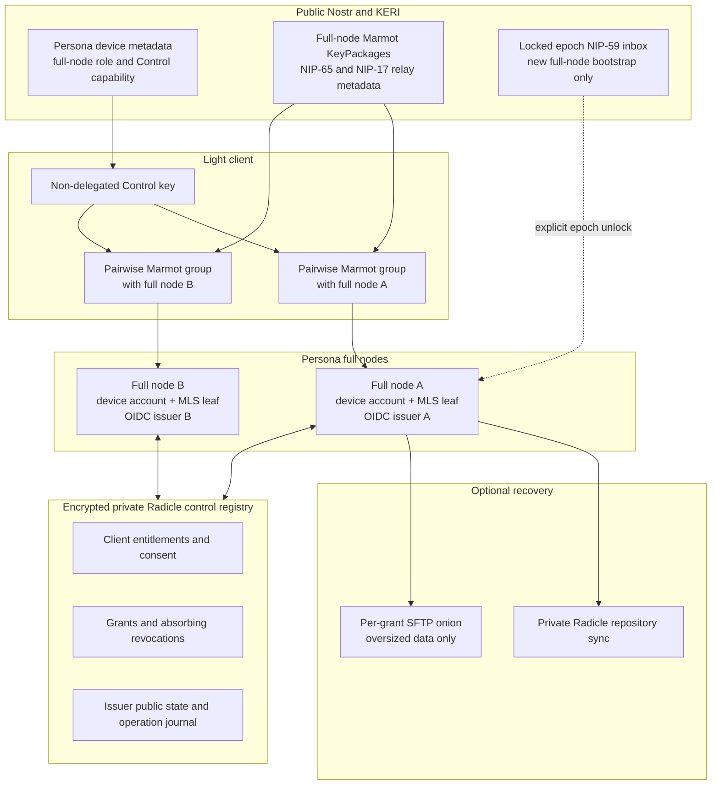

# Marmot Control and Recovery Simplification Design

**Status:** Approved design; specification integration pending

**Date:** 2026-08-10

## Goal

Make Heterodyne Control usable and claimable with fewer cryptographic and
transport mechanisms. Routine light-client and agent control moves from
nostr-double-ratchet to ordinary Marmot groups. Portable recovery and bulk
transfer become separately claimable optional capabilities rather than
blockers for baseline Control.

The design preserves the important boundaries:

- a light client's local key identifies a Control principal but does not let
  that client impersonate the persona;
- every privileged operation requires short-lived, scoped authorization;
- every full node retains its own keys and independently enforces policy;
- authorization follows the persona across its full nodes without sharing
  token-signing or MLS leaf private keys;
- the epoch key is absent from memory during ordinary operation; and
- repository recovery uses Radicle first, with an isolated SFTP service only
  for data that is unsuitable for Radicle.

## Problem

The current incomplete Control draft couples all of the following into one
activation batch:

- a dedicated Double Ratchet invitation and session wire;
- a second encrypted subprotocol-negotiation and payload carrier;
- a public session-device delegation subtype;
- enrollment, grants, RPC, replay, agent MCP, and audit;
- credential-continuity state machines;
- portable recovery and recovery-node authorization;
- SSH large-object transfer; and
- registry, schema, vector, family-manifest, and release-manifest closure for
  every one of those surfaces.

That coupling is not necessary. Marmot already supplies MLS-authenticated
application payloads, standard Nostr KeyPackage and Welcome delivery, fresh
ephemeral outer event keys, transport duplicate handling, retained state, and
forward-secure group evolution. Its application registry is not an allowlist:
an unknown inner event kind remains a valid Marmot application payload and may
be consumed by an application that understands it.

Heterodyne still needs application authorization, request idempotency,
persona-held signing, audit, and recovery policy. It does not need a second
point-to-point encryption protocol to carry those rules.

## Decisions at a glance

1. Routine Control uses one two-member Marmot group between one light client
   and one full node.
2. nostr-double-ratchet and the Comms `kind:31015`/`kind:31016` negotiation and
   payload carriers are removed from the active protocol.
3. A light client has a local Nostr-compatible secp256k1 key, but that key is
   not a public KERI persona delegation and cannot author persona events.
4. Persona-wide light-client entitlement is stored in the encrypted private
   Radicle control registry. Every synchronized full node may recognize the
   client.
5. Each full node issues its own node-audience, Marmot-bound JWT. Signing keys,
   MLS leaves, and tokens are never shared between nodes.
6. OAuth Device Authorization is the ordinary light-client enrollment
   ceremony. Unsolicited Control-group invitations are accepted in
   enrollment-only mode by default, with a per-node configuration switch.
7. Control uses one Heterodyne Marmot application-event kind containing a
   canonical Control frame. Human methods use JSON-RPC 2.0; agent sessions
   carry the pinned MCP data layer through that same frame.
8. Five minutes is the default token lifetime. An explicitly consented
   `control.token.extended` capability may permit a requested lifetime up to
   an absolute maximum of sixty minutes. No refresh tokens are issued.
9. Cross-node failover is sequential. Automatic retry of a mutation is legal
   only when it is inherently idempotent or prior completion can be proved.
10. Baseline Control conformance no longer depends on portable recovery,
    credential-recovery closure, or SFTP.
11. Network recovery uses native private-Radicle synchronization first.
    Oversized archives and objects may use constrained SFTP through a separate,
    per-grant onion service.
12. A new full node uses a NIP-59 registration rumor addressed to the locked
    epoch key only when no existing device Control channel is available.

## Authority boundaries

### Light-client Control key

An authenticated light client generates and retains one Nostr-compatible
secp256k1 keypair. The key has three purposes:

- Marmot account identity for that client's Control groups;
- proof of possession during enrollment; and
- key confirmation for node-issued access tokens.

The key is not published as a Core/KERI persona device delegation. It is not a
human publishing key, epoch key, NID key, full-node device key, or agent-role
key. A Nostr event signed directly by it has no Heterodyne authority to speak
for the persona.

The public key and its authorization state appear only in the persona's
encrypted private Radicle control registry. A full node performs an authorized
operation with the applicable real node-held human, device, administrative, or
agent-role key. The light client receives no such private key.

### Full-node identity

Every publicly authorized device key remains discoverable through the persona's
Core/KERI device metadata. A device record states whether that device is a full
node and which Control version and reachability features it supports.

Here, `device` means a Core/KERI-authorized persona device. An ordinary light
client is only a private Control principal and therefore does not appear in
that public device list.

A full node reuses its existing device Nostr key as its Marmot Control account.
It publishes standard Marmot KeyPackages from dedicated advertised Control
slots and uses the standard NIP-65 and NIP-17 relay metadata that Marmot
requires. Each Control group has an independent MLS leaf. Neither account
private keys nor leaf private keys are shared across full nodes.

The full-node capability advertisement is not liveness evidence. A client
tries known full nodes sequentially and remembers the most recently responsive
node as its next default.

### Agent boundary

An automated principal uses the same Control transport and token lifecycle as
a human-operated light client. Its private entitlement identifies it as
automated and scopes the permitted MCP tools, methods, objects, rate, sizes,
and agent role.

The node-issued Control JWT is itself the scoped OIDC workload access token for
automated Control methods. There is no second session token followed by a
second workload token. Agent authorization remains distinguishable through the
client class, role, scopes, finite limits, and mandatory attribution claims.

The remote agent never receives the full-node-held `agent:<role-id>` key. The
full node validates the Control token and current entitlement, constructs the
authorized output, adds mandatory automation attribution, and signs with the
role key. Raw signing, human-profile fallback, attribution removal, and direct
key access remain prohibited.

## Architecture



## Discovery and Control-group establishment

### Invitation policy

Each full node has a local `accept_control_invitations` policy. Its default is
`true`.

When enabled, the node accepts an unsolicited two-member Marmot group created
with one of its advertised Control KeyPackages. Acceptance creates only an
untrusted message-request context. Before enrollment, the node permits only:

- Control initialization and capability discovery;
- enrollment start and status;
- token-endpoint status needed to finish the pending device grant; and
- group close or cancellation.

Every other method is rejected before application dispatch. Marmot membership,
a valid Welcome, a valid application event, or transport delivery never grants
Control authority.

When invitation acceptance is disabled, the node rejects or ignores new
unsolicited Control groups. It may continue existing authorized groups under
local policy. It stops advertising fresh invitation-ready Control KeyPackages;
stale public advertisements are not a promise of acceptance.

### Ordinary group creation

The light client:

1. resolves the persona's public device metadata;
2. selects a device currently advertised as a compatible full node;
3. fetches and validates one of that node's advertised Marmot KeyPackages;
4. creates an ordinary two-member Marmot group;
5. publishes the normal Marmot Add/Commit and Welcome obligations; and
6. sends the Control initialization frame.

No epoch key, direct node address, Double Ratchet invite, or Heterodyne-specific
Marmot transport envelope is involved.

## Enrollment and durable entitlement

### OAuth Device Authorization

Ordinary light-client enrollment uses the persona node's built-in OIDC/OAuth
issuer and the OAuth Device Authorization state machine. The pending
transaction is node-local, short-lived, and not itself durable authority.

Marmot Control methods initiate and poll that issuer state machine so an onion-
only node remains usable by a browser client communicating through public Nostr
relays. Those Control methods are an application carrier for the issuer; they
are not represented as RFC 8628 HTTP requests and must not be advertised as an
independent HTTP-conformant token endpoint. A node may additionally expose the
ordinary standards-defined HTTP endpoints for compatible clients.

The client proves possession through its Marmot account-to-leaf identity and
the enrollment challenge. The approval surface shows the client fingerprint,
requested methods, objects, limits, and requested token-duration capability.
Approval may occur locally on a full node or through an already authorized
device whose current private authorization permits Control approval.

### Private authorization record

Approval creates a signed authorization record in the persona's encrypted
private Radicle control registry. The record binds at least:

- persona and client Control public key;
- client class (`human-light` or `automated`);
- approving full-node device and authority;
- consented method and object grants;
- rate and size limits where applicable;
- default and maximum token duration;
- predecessor or lineage identifier;
- active or revoked status; and
- creation, expiry where applicable, and signature.

The approving node may activate the entitlement after durably committing and
validating its own record. Another full node accepts it only after that node has
fetched and validated the record and its approving authority.

The repository is replicated evidence, not distributed consensus. Records are
append-only and authorization evaluation fails closed on an unresolved fork or
conflicting expansion. A valid revocation is absorbing and wins over an active
record. Self-revocation by the exact authenticated client is always permitted;
grant expansion requires a new explicit user-consent ceremony.

No public KERI device event is emitted for an ordinary light client.

## Node-scoped Marmot-bound tokens

### Issuance

Every full node has its own issuer signing key and exact resource audience.
Issuer private keys are not copied between nodes. The private control registry
contains the authenticated public issuer state needed for audit and discovery.

After validating the current entitlement and Control group, the contacted node
issues a JWT access token with:

- the JWT access-token media type and required issuer, subject, audience,
  time, identifier, client, and scope claims;
- an audience identifying only that full node's Control resource;
- `cnf.jkt` equal to the RFC 7638 thumbprint of the client's full secp256k1
  JWK;
- the exact Control-group binding;
- the applicable entitlement/authorization record identifier; and
- the permitted method/object and finite-limit scope.

The Nostr x-only public key maps to the unique even-Y secp256k1 point required
by BIP-340; the corresponding uncompressed `x` and `y` members form the RFC
8812 JWK used for the thumbprint.

### Token use

Baseline Marmot Control does not imitate DPoP. RFC 9449 DPoP is defined around
an HTTP method, target URI, and HTTP header. A Control receiver instead treats
Marmot's authenticated sender binding as the proof associated with `cnf.jkt`.

For every privileged frame the node verifies that:

- the Marmot application event is valid and its account is the authenticated
  MLS sender account;
- the sender account's JWK thumbprint equals `cnf.jkt`;
- the frame arrived in the exact Control group bound by the token;
- issuer, node audience, signature, times, token ID, client, and scopes are
  valid;
- the durable entitlement is still active and covers the exact method and
  object; and
- the request satisfies expiry, idempotency, size, rate, and local policy.

A separately exposed HTTPS API may support ordinary DPoP with registered
`ES256K`. That optional HTTP behavior is not part of the baseline Marmot
carrier.

### Lifetime

The effective lifetime is:

```text
min(requested lifetime, entitlement maximum, node-policy maximum, 60 minutes)
```

The default is five minutes. More than five minutes requires the separately
consented `control.token.extended` capability in the private authorization
record. Sixty minutes is an absolute protocol maximum.

No refresh token is issued. While entitlement remains active, a client asks
the current node for another token over the established group. A token is
checked when a request is accepted. Expiry does not interrupt an already
accepted side effect, but every later request or MCP tool call requires a
currently valid token.

Control tokens do not require a distributed Token Status List. Each node checks
its current entitlement view on every request, and short expiry bounds the
effect of a revocation that a disconnected node has not observed.

## Single Control frame

### Marmot application event

Heterodyne allocates one inner Marmot application-event kind for Control. It is
used only inside MLS and is never published as a standalone Nostr event.

The event follows Marmot's ordinary unsigned Nostr-shaped application format.
Its `content` is one canonical compact JSON Control frame. The closed frame
schema contains the negotiated Control version, profile, frame type, request
identity, logical operation identity where applicable, expiry, optional access
token, and payload.

The first exchange is `control.initialize`. It selects one exact Control
version and either the human JSON-RPC profile or the agent MCP profile. This
single exchange replaces the Comms four-phase offer, selection, and dual
confirmation state machine. A full node advertises compatibility before group
creation and still rejects any frame until initialization completes.

Human operations are JSON-RPC 2.0 methods. Agent sessions carry the pinned MCP
data layer's JSON-RPC messages inside the same Control payload. MCP's HTTP,
SSE, and stdio transports remain out of scope. The existing fail-closed agent
tool, workload-token, key-confinement, and attribution rules remain
application requirements.

There is no Control-specific outer envelope, Nostr relay kind, signature, or
reply URL. Marmot owns kind-445 encryption, routing, fanout, duplicate
handling, publish acknowledgement, MLS state, and sender authentication. The
response returns through the same Marmot group under its current routing
state; it is not tied to whichever relay delivered the request first.

### Request processing

Before a privileged method is dispatched, the full node validates in order:

1. Marmot event, group state, sender identity, and initialized profile;
2. closed Control frame and method/MCP schema;
3. frame expiry and request/operation identifiers;
4. node-scoped token and Marmot sender/group binding;
5. current private entitlement and exact method/object grant;
6. finite size, rate, burst, media, and other method limits;
7. existing operation reservation or result; and
8. any method-specific confirmation or local policy.

The node then reserves the logical operation durably before a side effect,
executes or reconciles it, persists the result and encrypted audit evidence,
and only then emits a final response.

## Failover and idempotency

Failover is client-driven and sequential. A client uses its most recently
responsive node first. If that node is unavailable, it creates or resumes a
pairwise group with another known full node. The second node validates the
same persona-wide entitlement and issues its own node-audience token. User
consent is not repeated unless the client requests broader authority.

Read-only methods, status, token issuance, and subscriptions may be retried
automatically.

Every mutation carries a stable logical operation ID. A mutation may be
retried at another node automatically only when:

- the method defines a result that is inherently idempotent under that ID; or
- the second node can prove and return the first node's committed result.

If the first node may have committed but no result is available, the state is
`indeterminate`. The client must reconcile or obtain explicit user direction;
it must not blindly repeat the side effect. The private Radicle operation
journal improves recovery and duplicate detection but is not described as a
lock or consensus protocol.

Public publishing and comparable externally visible operations carry the
logical operation ID in their canonical Heterodyne attribution so clients can
recognize an accidental duplicate when perfect reconciliation is impossible.

## Retention, revocation, and state loss

Control application messages use Marmot's retention component to obtain a
bounded NIP-40 expiration. The default delivery window is one hour. A local
high-latency policy may increase it up to twenty-four hours. Individual
requests retain their own earlier application expiry and are never executable
after it.

The following are never committed to Radicle or portable backups:

- raw Control frames;
- access tokens or enrollment codes;
- Control-group MLS state and epoch secrets; and
- replayable request/response transcripts.

The encrypted private registry retains only durable authorization records,
minimal operation reservations/results, and encrypted audit evidence. Audit
records do not contain raw access tokens.

Loss of a Control group is not a recovery event. The client establishes a new
group with the same registered account key and obtains a new node token.

Once a node observes a valid revocation, it rejects every associated token,
terminates the affected group locally, and refuses re-enrollment of the same
key unless the future protocol defines an explicit post-revocation recovery
ceremony. The protocol makes no false promise of instantaneous revocation at
an offline node. Each implementation exposes and enforces an authorization-
view freshness policy, with stricter fail-closed behavior for mutations.

## New full-node bootstrap

### When the epoch inbox is used

The epoch-key network path is reserved for adding a new full node when no
existing authorized device-to-device Control channel can perform the
ceremony. It does not carry ordinary light-client enrollment or privileged
Control RPC.

The prospective node discovers the epoch public key and inbox relays from the
persona's public identity metadata. It publishes a NIP-59 gift wrap addressed
to that key. The encrypted Heterodyne registration rumor binds:

- the prospective device Nostr public key;
- Radicle NID;
- Marmot Control KeyPackage reference;
- recovery-wrapping public key;
- SSH authentication public key;
- Tor onion-client-authorization public key;
- requested full/recovery-node capabilities;
- nonce and expiration; and
- proof of possession for every prospective private key.

### Unlock and prepared activation

A recovery-capable existing full node keeps the epoch key encrypted and absent
from memory during ordinary operation. In an explicit local ceremony, the user
unlocks it, scans configured relays for pending registration rumors, validates
each candidate, and approves or rejects one.

During the same short unlock window, the approving node prepares:

- the bound public device/full-node authorization artifacts;
- the private recovery-role and repository-bootstrap authorization;
- the finite recovery transfer grant; and
- an epoch activation envelope encrypted to the prospective node's recovery
  key.

These artifacts bind the registration, target keys, expected recovery data,
grant, expiry, and completion condition. They are not published, activated, or
released yet. The node erases epoch plaintext and relocks the key before
starting repository synchronization, an onion service, SFTP, or any bulk
network transfer.

The approving node then creates a normal pairwise Marmot Control group with
the prospective device. Failure, rejection, or grant expiry destroys the
pending activation material and releases no persona authority.

### Completion and activation

After recovering data, the prospective node reports the exact verified
repository heads, portable-manifest identity, and required object digests over
Marmot Control. The approving node reconciles those values with the signed
grant and its operation journal.

Only a successful exact match permits the approving node to:

1. publish the prepared public device/full-node metadata;
2. commit the prepared private recovery role;
3. make permanent the intended private-repository membership; and
4. release the already wrapped epoch activation envelope.

The epoch scalar is never sent in plaintext. The prospective node installs it
only through its platform-protected key boundary after revalidating the
portable archive, repository state, prepared activation, and current public
identity state.

Offline bootstrap from a portable encrypted backup remains supported. It
bypasses network transfer but must pass the same integrity and activation
checks. Possession of backup bytes alone does not publish a full-node device
authorization.

## Recovery transport

### Radicle first

Network recovery uses Radicle's native private-repository synchronization for
all repositories and eligible objects. The prospective NID receives temporary,
grant-bound access to the exact private repositories named by the enrollment.
It does not become a repository delegate or writer unless the final role
explicitly grants that authority.

Heterodyne encryption at rest remains mandatory. Radicle private repositories
use selective replication and encrypted peer connections but are not the
portable-backup encryption boundary.

Small protected records, wrapped keys, progress, and completion receipts use
the pairwise Marmot Control group. This is the baseline network-recovery path.

### Optional SFTP overflow

SFTP is an optional recovery capability for oversized immutable archives,
media, logs, observability bundles, or other objects unsuitable for Radicle.
It is not required for baseline Control or baseline repository recovery.

Every SFTP transfer grant creates a fresh onion-service identity distinct from
the full node's Radicle onion identity and process boundary. The prospective
node supplies both:

- a Tor v3 onion client-authorization public key; and
- an SSH authentication public key.

The signed grant binds the onion address, SSH host key, both client keys, exact
resources, direction, byte ceiling, issue time, and expiry. Knowing the onion
address is insufficient: Tor client authorization gates access before SSH, and
SFTP independently requires the bound SSH key and pinned host key.

The service exposes only a rooted SFTP view containing the immutable resources
authorized by the grant. It supports offset-based resumption and exact file
reads; separately authorized existing recovery peers may receive bounded
writes. It prohibits:

- interactive shell and arbitrary command execution;
- filesystem traversal outside the grant root;
- PTY allocation;
- TCP, Unix-socket, X11, or SSH-agent forwarding; and
- access to an unlisted resource or bytes beyond the grant ceiling.

Artifact manifests and content digests provide end-to-end integrity. Transfer
completion and activation receipts travel over Marmot Control rather than a
new custom protocol layered inside SSH.

A grant lasts no more than eight hours and the endpoint shuts down on
completion, revocation, or expiry. Renewal creates a new grant and fresh onion
identity. The prior endpoint may remain read-only for at most five minutes so
already-open transfers can finish or resume against the new endpoint. The
virtual SSH port is stable; port rotation is not a security boundary.

## Conformance split

### Baseline Control

Control becomes independently claimable when its own complete specification,
registry entries, schemas, vectors, and release metadata cover:

- full-node discovery and invitation policy;
- Marmot Control-group initialization;
- enrollment-only behavior and OAuth Device Authorization projection;
- private client authorization records and revocation;
- node-scoped Marmot-bound JWT issuance and validation;
- the single Control frame and human/MCP profiles;
- method/object grants and agent constraints;
- request expiry, operation reservation, audit, and conservative failover;
- retention, group loss, and termination; and
- required positive and negative conformance vectors.

Portable recovery, epoch-inbox bootstrap, full-node activation, and SFTP are
not baseline Control prerequisites.

### Optional recovery profiles

Recovery is separately advertised and claimed:

- portable encrypted backup and offline restore;
- recovery-capable full-node role;
- NIP-59 epoch-inbox full-node registration;
- prepared activation and wrapped epoch release;
- private-Radicle recovery orchestration; and
- optional SFTP large-object transfer.

A full node may implement Control without holding an epoch key or offering
recovery. A recovery-capable node expands the authority attack surface and
must identify that capability explicitly.

## Material removed or replaced

The specification integration removes or rewrites every active dependency on:

- `nostr-double-ratchet` and its invite, response, message, transcript,
  skipped-key, and terminalization profiles;
- DR-only NIP-59 tombstones;
- Comms generic `kind:31015` negotiation and `kind:31016` payload carriers;
- Control's required `double-ratchet` feature;
- epoch DR invitations for light-client enrollment;
- the public NID-less session-device delegation profile for ordinary light
  clients;
- DR no-backfill and session-restoration rules;
- ingress-relay response affinity that Marmot routing supersedes;
- Control activation's dependency on the credential-continuity/recovery mega-
  batch; and
- the custom `heterodyne-transfer-v1` protocol previously layered inside SSH.

Ordinary user DMs remain two-member Marmot groups. Credential and configuration
synchronization use protected Radicle repositories plus Marmot Control for
small live records. New-full-node rendezvous uses the narrow NIP-59 epoch
inbox. No remaining normative flow requires Double Ratchet.

Because the family is pre-1.0, obsolete registry allocations, schemas, and
vectors may be removed or incompatibly replaced in the same atomic
specification change. The release must not advertise compatibility with the
superseded incomplete Control draft.

## Failure behavior

Implementations fail closed for at least these classes:

- invitation disabled or malformed/unsupported Control KeyPackage;
- method attempted before enrollment or initialization;
- missing, invalid, wrong-node, wrong-group, expired, or overlong token;
- Marmot account mismatch with `cnf.jkt`;
- absent, stale beyond local policy, forked, reduced, or revoked entitlement;
- method, object, rate, size, media, or agent-role scope mismatch;
- expired request, reused request ID with different bytes, or operation-ID
  conflict;
- indeterminate mutation completion at another node;
- epoch inbox accessed without an explicit unlock ceremony;
- registration proof, target key, grant, digest, or prepared-activation
  mismatch;
- private-repository access outside the temporary grant;
- SFTP onion-client, SSH-client, host-key, resource, direction, byte, or time
  mismatch; and
- recovery completion that cannot prove every required repository head and
  artifact digest.

An error must not reveal whether an unauthorized private object, entitlement,
or recovery resource exists beyond what the authenticated caller is permitted
to know.

## Alternatives considered

### Keep Double Ratchet for Control

Rejected. It duplicates Marmot's authenticated encrypted messaging, requires a
second invitation/session lifecycle, and is the reason Control owns several
additional carriers, tombstones, state-loss rules, and vector families. Its
strong no-backfill property is not compelling enough to justify the extra
stack once Control messages have short expiry, bounded Marmot retention, and
no backup.

### One multi-node Control group per light client

Rejected. It makes every node a member of every client group, causes MLS
membership churn as nodes change, and creates races in which multiple nodes may
execute one side effect. Pairwise groups plus explicit sequential failover are
simpler and safer.

### Persona-wide JWT accepted unchanged by all nodes

Rejected. It requires a shared issuer trust and audience surface, increases
the blast radius of one compromised issuer, and permits a stolen token to be
replayed at another node. Replicated entitlement plus cheap node-local
reissuance provides equivalent usability with narrower authority.

### DPoP-shaped proofs inside Marmot

Rejected. DPoP is defined for HTTP requests and binds an HTTP method and target
URI. Inventing virtual HTTP values inside Marmot would reduce standards
clarity. The Marmot account and MLS sender binding supply the proof used by the
Control token profile.

### SFTP for every repository and backup

Rejected. It duplicates Radicle's authenticated private-repository
replication and makes an additional network service mandatory. SFTP remains
valuable only for resumable transfer of data that does not fit Radicle well.

### Authenticated HTTP range service

Rejected for the baseline. It would require Heterodyne to define and secure a
new bulk-transfer API. Constrained SFTP is more mature for the optional
critical interface.

### Periodically rotate one persistent recovery onion address and port

Rejected. Periodic churn complicates discovery and resumption without being
an authorization boundary. A fresh onion identity per finite grant provides a
clear lifecycle; Tor client authorization and SSH authentication provide the
actual access control.

## Specification integration map

The implementation patch is expected to update at least:

- **Core:** full-node device metadata, Control KeyPackage discovery, locked
  epoch inbox discovery, and the removal of the ordinary session-device
  delegation dependency.
- **Comms:** Marmot Control application events, removal of Double Ratchet and
  generic DR subprotocol carriers, private control-registry semantics,
  node-scoped JWT projection, new-full-node NIP-59 registration, and recovery
  orchestration boundaries.
- **Control:** complete rewrite of transport ownership, enrollment, token,
  request, MCP, failover, retention, audit, and conformance sections around
  Marmot.
- **Social:** removal of stale Double Ratchet references, if any; ordinary DMs
  remain Marmot-owned.
- **Registry and schemas:** remove obsolete inactive allocations and close the
  smaller replacement record/frame set.
- **Vectors and releases:** replace DR and gated-Control vectors with Marmot
  Control, token-binding, authorization, failover, bootstrap, and separately
  scoped recovery vectors; update family and release metadata atomically.
- **Architecture, glossary, threat model, and agent guidance:** describe the
  simplified authority and transport boundaries without treating this design
  or its future ADR as canonical.

## Conformance coverage required by implementation

The integration must include positive and negative vectors for at least:

- invitation policy enabled and disabled;
- a valid Welcome that remains enrollment-only;
- successful device authorization and private entitlement replication;
- group membership without entitlement;
- wrong Marmot account, `cnf.jkt`, group, issuer, or node audience;
- five-minute default, explicit extended permission, and sixty-minute cap;
- no refresh token and reissuance at the same or failover node;
- grant reduction, absorbing revocation, and conflicting expansion;
- request expiry, exact duplicate, changed duplicate, and operation conflict;
- safe read failover, idempotent mutation failover, and indeterminate mutation;
- agent token/tool/role/attribution confinement;
- bounded Control retention and absence from backup;
- locked epoch inbox, malformed registration, and prepared-activation mismatch;
- private-Radicle temporary admission and exact recovery completion; and
- SFTP process/address separation, client authorization, SSH key/host pinning,
  rooted resources, byte ceiling, expiry, renewal, and prohibited channels.

The implementation changes wire behavior and therefore must update normative
vectors. Vector conformance checks are required for that implementation patch;
they are not needed for this design-only commit.

## External references

- [Marmot application payloads](https://github.com/marmot-protocol/marmot/blob/4ad4ae21479c3f3fa9950c6fc4556a76941a62e1/foundation/application-messages.md)
- [Marmot group messaging](https://github.com/marmot-protocol/marmot/blob/4ad4ae21479c3f3fa9950c6fc4556a76941a62e1/protocol-core/group-messaging.md)
- [Marmot Nostr transport](https://github.com/marmot-protocol/marmot/blob/4ad4ae21479c3f3fa9950c6fc4556a76941a62e1/transports/nostr.md)
- [OAuth Device Authorization Grant (RFC 8628)](https://www.rfc-editor.org/rfc/rfc8628.html)
- [JWT Profile for OAuth Access Tokens (RFC 9068)](https://www.rfc-editor.org/rfc/rfc9068.html)
- [OAuth DPoP (RFC 9449)](https://www.rfc-editor.org/rfc/rfc9449.html)
- [JOSE secp256k1 and ES256K (RFC 8812)](https://www.rfc-editor.org/rfc/rfc8812.html)
- [Radicle private repositories and Tor](https://radicle.xyz/guides/user/)
- [Tor v3 onion-service client authorization](https://community.torproject.org/onion-services/advanced/client-auth/)
